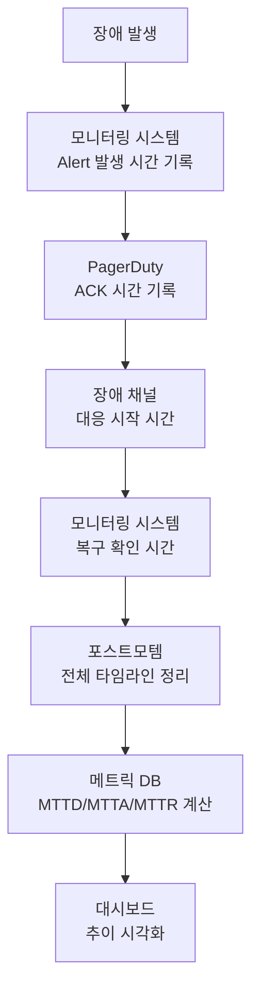

# 장애 대응 메트릭 - MTTD, MTTF, MTTR로 측정하는 대응 성숙도

장애 대응의 효과를 정량적으로 측정하고 개선하기 위한 핵심 메트릭인 MTTD, MTTF, MTTR, MTBF의 정의와 활용 방법을 다룬다. 메트릭 기반으로 장애 대응 성숙도를 평가하고 지속적으로 개선하는 프로세스를 설명한다.

## 목차
- [1. 핵심 개념 (What)](#1-핵심-개념-what)
- [2. 왜 알아야 하는가 (Why)](#2-왜-알아야-하는가-why)
- [3. 내부 구현 분석 (How)](#3-내부-구현-분석-how)
- [4. 실전 예제](#4-실전-예제)
- [5. 정리](#5-정리)

---

## 1. 핵심 개념 (What)

### 장애 대응 핵심 메트릭

```
장애 타임라인과 메트릭:

  장애 발생          감지            대응 시작          복구
     │               │                │                │
     ▼               ▼                ▼                ▼
─────●───────────────●────────────────●────────────────●─────
     │               │                │                │
     │◄── MTTD ────►│                │                │
     │    (감지)      │◄── MTTA ────►│                │
     │               │    (인지)      │◄── MTTR ────►│
     │               │                │    (복구)      │
     │◄──────────── MTTF (실패까지 시간) ──────────────►│
     │                                                 │
     │◄────────────── TTO (총 장애 시간) ──────────────►│
```

### 메트릭 정의

| 메트릭 | 풀네임 | 정의 | 줄이고 싶은 방향 |
|--------|--------|------|----------------|
| MTTD | Mean Time to Detect | 장애 발생~감지까지 평균 시간 | 줄일수록 좋음 |
| MTTA | Mean Time to Acknowledge | 알림~대응 시작까지 평균 시간 | 줄일수록 좋음 |
| MTTR | Mean Time to Recover | 장애 발생~복구까지 평균 시간 | 줄일수록 좋음 |
| MTTF | Mean Time to Failure | 정상 운영~장애 발생까지 평균 시간 | 늘릴수록 좋음 |
| MTBF | Mean Time Between Failures | 장애 간 평균 간격 | 늘릴수록 좋음 |

### MTTR의 여러 의미

MTTR은 문맥에 따라 다른 의미로 사용된다:

```
MTTR의 4가지 해석:
━━━━━━━━━━━━━━━━━
1. Mean Time to Recover  - 서비스 복구까지 시간 (가장 일반적)
2. Mean Time to Repair   - 근본 원인 수정까지 시간
3. Mean Time to Respond  - 대응 시작까지 시간 (≈ MTTA)
4. Mean Time to Resolve  - 포스트모템 Action Item 완료까지 시간

팀 내에서 어떤 의미로 사용하는지 합의 필요!
이 문서에서는 "Mean Time to Recover"로 사용
```

### MTBF와 MTTF의 관계

```
MTBF = MTTF + MTTR

│◄──── MTTF ────►│◄── MTTR ──►│◄──── MTTF ────►│◄── MTTR ──►│
│   정상 운영      │  장애/복구   │   정상 운영      │  장애/복구   │
│                 │             │                 │             │
│◄──────── MTBF (1 cycle) ────►│◄──────── MTBF (1 cycle) ────►│
```

## 2. 왜 알아야 하는가 (Why)

### "개선 중"의 함정

메트릭 없이 "장애 대응이 개선되고 있다"고 말하면 주관적이다.

```
나쁜 보고: "우리 팀의 장애 대응 능력이 향상되고 있습니다."
좋은 보고: "Q4 MTTR이 Q3 대비 35% 감소했습니다 (45분 → 29분).
           주요 기여: 런북 자동화(15분 단축), Alert 개선(5분 단축)"
```

### 투자 우선순위 결정

```
MTTD가 높으면 → 모니터링/Alert 개선에 투자
MTTA가 높으면 → On-call 프로세스/도구 개선에 투자
MTTR이 높으면 → 런북/자동화/아키텍처 개선에 투자
MTTF가 낮으면 → 코드 품질/테스트/인프라 개선에 투자
```

### 조직 성숙도 평가

메트릭을 통해 장애 대응의 현재 수준을 객관적으로 평가할 수 있다.

## 3. 내부 구현 분석 (How)

### 메트릭 수집 방법



### 각 메트릭 개선 전략

**MTTD 개선 (감지 시간 단축)**:

| 방법 | 효과 | 투자 |
|------|------|------|
| SLO Burn Rate Alert 도입 | MTTD 50% 감소 | 중간 |
| Synthetic Monitoring 추가 | 사용자 관점 감지 | 낮음 |
| 로그 기반 이상 탐지 (ML) | 미탐 감소 | 높음 |
| Alert 임계값 최적화 | 불필요한 지연 제거 | 낮음 |

**MTTA 개선 (인지 시간 단축)**:

| 방법 | 효과 | 투자 |
|------|------|------|
| PagerDuty 에스컬레이션 최적화 | 확실한 전달 | 낮음 |
| Alert에 컨텍스트 추가 | 판단 시간 단축 | 낮음 |
| Mobile 알림 설정 | 야간 대응 개선 | 낮음 |
| On-call 교육 강화 | 초기 판단 속도 | 중간 |

**MTTR 개선 (복구 시간 단축)**:

| 방법 | 효과 | 투자 |
|------|------|------|
| 런북 작성/개선 | 대응 표준화 | 중간 |
| 자동 롤백 도입 | 배포 관련 MTTR 대폭 감소 | 중간 |
| 대응 자동화 (Rundeck/SSM) | 반복 장애 자동 복구 | 높음 |
| 아키텍처 개선 (Circuit Breaker) | 장애 전파 방지 | 높음 |

**MTTF 개선 (장애 간격 증가)**:

| 방법 | 효과 | 투자 |
|------|------|------|
| Chaos Engineering | 약점 사전 발견 | 중간 |
| 코드 리뷰 강화 | 결함 유입 방지 | 낮음 |
| Canary 배포 도입 | 배포 관련 장애 감소 | 중간 |
| 용량 계획 (Capacity Planning) | 용량 관련 장애 방지 | 중간 |

### 장애 대응 성숙도 모델

```
Level 1: Reactive (반응적)
├── MTTD: > 30분 (사용자 보고로 인지)
├── MTTR: > 2시간
├── 포스트모템: 없음 또는 형식적
└── 특징: "불 끄기" 모드

Level 2: Proactive (선제적)
├── MTTD: 10-30분 (Alert 기반)
├── MTTR: 30분-2시간
├── 포스트모템: SEV1만 작성
└── 특징: 모니터링 있으나 개선 부족

Level 3: Managed (관리됨)
├── MTTD: 5-10분 (SLO 기반 Alert)
├── MTTR: 15-30분
├── 포스트모템: SEV1-2 + Action Item 추적
└── 특징: 메트릭 기반 개선 사이클

Level 4: Optimized (최적화됨)
├── MTTD: < 5분 (자동 감지)
├── MTTR: < 15분 (자동 복구 포함)
├── 포스트모템: 문화로 정착, 지식 공유
└── 특징: 자동화, Chaos Engineering, 지속 개선

Level 5: Antifragile (반취약)
├── MTTD: ~실시간 (예측적 감지)
├── MTTR: ~자동 복구
├── 포스트모템: 업계 공유, 오픈 소스 기여
└── 특징: 장애로부터 더 강해지는 시스템
```

## 4. 실전 예제

### 장애 메트릭 수집 시스템

```python
from dataclasses import dataclass, field
from datetime import datetime, timedelta
from statistics import mean, median


@dataclass
class Incident:
    """개별 장애 기록"""
    id: str
    severity: str
    occurred_at: datetime
    detected_at: datetime
    acknowledged_at: datetime
    resolved_at: datetime
    service: str
    description: str

    @property
    def ttd(self) -> timedelta:
        """Time to Detect"""
        return self.detected_at - self.occurred_at

    @property
    def tta(self) -> timedelta:
        """Time to Acknowledge"""
        return self.acknowledged_at - self.detected_at

    @property
    def ttr(self) -> timedelta:
        """Time to Recover (전체)"""
        return self.resolved_at - self.occurred_at

    @property
    def repair_time(self) -> timedelta:
        """Repair Time (대응 시작부터 복구까지)"""
        return self.resolved_at - self.acknowledged_at


@dataclass
class IncidentMetricsReport:
    """기간별 장애 메트릭 리포트"""
    period: str
    incidents: list[Incident] = field(default_factory=list)

    def _minutes(self, td: timedelta) -> float:
        return td.total_seconds() / 60

    @property
    def total_count(self) -> int:
        return len(self.incidents)

    @property
    def by_severity(self) -> dict:
        result = {}
        for inc in self.incidents:
            result.setdefault(inc.severity, []).append(inc)
        return {k: len(v) for k, v in result.items()}

    @property
    def mttd_minutes(self) -> float:
        if not self.incidents:
            return 0
        return mean(self._minutes(i.ttd) for i in self.incidents)

    @property
    def mtta_minutes(self) -> float:
        if not self.incidents:
            return 0
        return mean(self._minutes(i.tta) for i in self.incidents)

    @property
    def mttr_minutes(self) -> float:
        if not self.incidents:
            return 0
        return mean(self._minutes(i.ttr) for i in self.incidents)

    @property
    def median_ttr_minutes(self) -> float:
        if not self.incidents:
            return 0
        return median(self._minutes(i.ttr) for i in self.incidents)

    def report(self) -> str:
        return f"""
Incident Metrics Report: {self.period}
{'=' * 50}
총 장애: {self.total_count}건
등급별: {self.by_severity}

MTTD (평균 감지 시간):    {self.mttd_minutes:.1f}분
MTTA (평균 인지 시간):    {self.mtta_minutes:.1f}분
MTTR (평균 복구 시간):    {self.mttr_minutes:.1f}분
MTTR (중앙값):            {self.median_ttr_minutes:.1f}분
"""


# 사용 예시
incidents = [
    Incident(
        id="INC-001", severity="SEV2", service="user-api",
        description="API 응답 지연",
        occurred_at=datetime(2024, 1, 5, 14, 0),
        detected_at=datetime(2024, 1, 5, 14, 5),
        acknowledged_at=datetime(2024, 1, 5, 14, 8),
        resolved_at=datetime(2024, 1, 5, 14, 35),
    ),
    Incident(
        id="INC-002", severity="SEV1", service="payment",
        description="결제 서비스 장애",
        occurred_at=datetime(2024, 1, 12, 10, 0),
        detected_at=datetime(2024, 1, 12, 10, 3),
        acknowledged_at=datetime(2024, 1, 12, 10, 5),
        resolved_at=datetime(2024, 1, 12, 10, 45),
    ),
]

report = IncidentMetricsReport(period="2024-Q1", incidents=incidents)
print(report.report())
```

### Grafana 대시보드 쿼리 (Incident 메트릭)

```sql
-- 월별 MTTD, MTTA, MTTR 추이
SELECT
    DATE_TRUNC('month', occurred_at) AS month,
    COUNT(*) AS incident_count,
    AVG(EXTRACT(EPOCH FROM (detected_at - occurred_at)) / 60) AS avg_mttd_min,
    AVG(EXTRACT(EPOCH FROM (acknowledged_at - detected_at)) / 60) AS avg_mtta_min,
    AVG(EXTRACT(EPOCH FROM (resolved_at - occurred_at)) / 60) AS avg_mttr_min,
    PERCENTILE_CONT(0.5) WITHIN GROUP (
        ORDER BY EXTRACT(EPOCH FROM (resolved_at - occurred_at)) / 60
    ) AS median_mttr_min
FROM incidents
WHERE occurred_at >= NOW() - INTERVAL '12 months'
GROUP BY 1
ORDER BY 1;

-- 서비스별 장애 빈도 (MTBF 계산용)
SELECT
    service,
    COUNT(*) AS incident_count,
    MIN(occurred_at) AS first_incident,
    MAX(occurred_at) AS last_incident,
    EXTRACT(EPOCH FROM (MAX(occurred_at) - MIN(occurred_at))) / 3600 / NULLIF(COUNT(*) - 1, 0)
        AS avg_mtbf_hours
FROM incidents
WHERE occurred_at >= NOW() - INTERVAL '6 months'
  AND severity IN ('SEV1', 'SEV2')
GROUP BY service
ORDER BY incident_count DESC;
```

### 메트릭 기반 분기별 리뷰 템플릿

```markdown
# 장애 대응 메트릭 분기 리뷰 - 2024 Q1

## 핵심 지표 요약

| 메트릭 | Q4 2023 | Q1 2024 | 변화 | 목표 |
|--------|---------|---------|------|------|
| 총 장애(SEV1-2) | 8건 | 5건 | -37.5% | < 4건 |
| MTTD | 12분 | 8분 | -33.3% | < 5분 |
| MTTA | 7분 | 4분 | -42.9% | < 3분 |
| MTTR | 45분 | 29분 | -35.6% | < 20분 |
| MTBF | 11일 | 18일 | +63.6% | > 30일 |

## 개선 요인 분석
1. MTTD 개선: SLO Burn Rate Alert 도입 (-4분)
2. MTTA 개선: PagerDuty 에스컬레이션 최적화 (-3분)
3. MTTR 개선: 런북 자동화 3건 적용 (-10분), 자동 롤백 도입 (-6분)

## 다음 분기 개선 계획
1. MTTD: Synthetic Monitoring 도입 (목표: < 5분)
2. MTTR: 자동 복구 스크립트 2건 추가 (목표: < 20분)
3. MTTF: Chaos Engineering GameDay 월 1회 (목표: MTBF > 30일)
```

## 5. 정리

| 메트릭 | 정의 | 개선 방향 | 주요 개선 수단 |
|--------|------|----------|---------------|
| MTTD | 감지까지 시간 | 줄이기 | Alert 개선, Synthetic Monitoring |
| MTTA | 인지까지 시간 | 줄이기 | On-call 프로세스, PagerDuty |
| MTTR | 복구까지 시간 | 줄이기 | 런북, 자동화, 아키텍처 |
| MTTF | 장애까지 시간 | 늘리기 | Chaos Engineering, 코드 품질 |
| MTBF | 장애 간 간격 | 늘리기 | 예방적 유지보수, 용량 계획 |

**핵심 원칙**:
1. "측정하지 않으면 개선할 수 없다"
2. 평균(Mean)뿐 아니라 중앙값(Median)과 p90도 함께 추적한다
3. 메트릭은 개인 평가가 아닌 프로세스 개선에 사용한다
4. 분기별 리뷰로 추이를 분석하고 개선 계획을 수립한다

---
*참고: Google SRE Book, ITIL v4 Incident Management, Accelerate (Nicole Forsgren et al.)*
