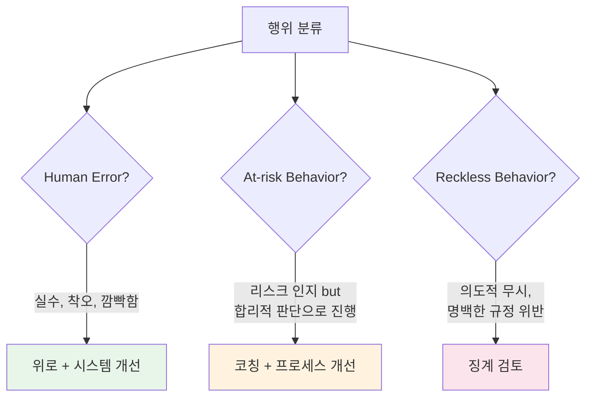
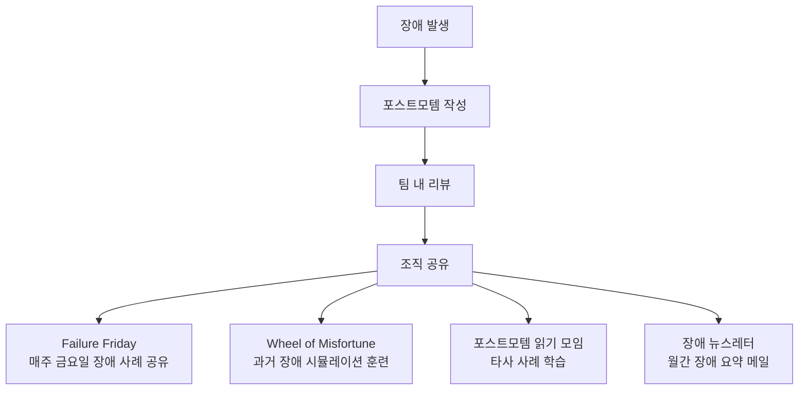

# 장애 대응 문화 구축 - 학습하는 조직과 심리적 안전

기술과 프로세스를 넘어, 장애 대응의 핵심은 **문화**에 있다. 심리적 안전, Blameless 문화, 조직 학습 체계, 그리고 SRE 도입 전략을 다룬다.

## 목차
- [1. 핵심 개념 (What)](#1-핵심-개념-what)
- [2. 왜 알아야 하는가 (Why)](#2-왜-알아야-하는가-why)
- [3. 내부 구현 분석 (How)](#3-내부-구현-분석-how)
- [4. 실전 예제](#4-실전-예제)
- [5. 정리](#5-정리)

---

## 1. 핵심 개념 (What)

### 심리적 안전 (Psychological Safety)

Amy Edmondson이 정의한 심리적 안전은 "팀 내에서 대인 관계의 위험을 감수해도 안전하다는 공유된 믿음"이다.

```
심리적 안전이 높은 팀:
├── "이 배포가 불안한데 잠깐 멈추자" → "좋아, 리뷰하자"
├── "내가 실수로 DB를 날렸어" → "빨리 복구하자, 원인 분석은 나중에"
└── "이 아키텍처가 취약한 것 같아" → "좋은 지적이야, 검토하자"

심리적 안전이 낮은 팀:
├── "이 배포가 불안한데..." → (침묵, 문제 발생 후 "그때 말할 걸")
├── "내가 실수로 DB를..." → (숨김, 늦은 발견으로 피해 확대)
└── "이 아키텍처가 취약..." → (침묵, "말해봤자 비난만")
```

### Blameless vs Blame-aware vs Just Culture

| 접근법 | 설명 | 장점 | 리스크 |
|--------|------|------|--------|
| Blameless | 모든 비난 배제, 시스템에 집중 | 심리적 안전 극대화 | 의도적 무모함 허용 가능 |
| Blame-aware | 비난은 없지만 맥락과 책임은 인식 | 균형잡힌 접근 | 미묘한 비난으로 변질 가능 |
| Just Culture | 행위의 성격에 따라 차등 대응 | 공정성 | 구현이 어려움 |

### Just Culture 모델



**실제 적용**:
- **Human Error**: 엔지니어가 프로덕션에서 staging이라고 착각하고 명령 실행 → 시스템에 환경 구분 강화
- **At-risk**: 배포 프로세스를 건너뛰고 hotfix 직접 적용 (긴급 상황) → 긴급 배포 프로세스 수립
- **Reckless**: 알려진 위험을 무시하고 테스트 없이 배포 (여러 차례 경고 후) → 개인 피드백 + 프로세스 강화

## 2. 왜 알아야 하는가 (Why)

### Google의 Project Aristotle 연구

Google이 180개 팀을 분석한 결과, 팀 성과의 가장 강력한 예측 변수는 **심리적 안전**이었다.

```
팀 효과성 요인 (중요도 순):
1. 심리적 안전 (Psychological Safety) ★★★★★
2. 신뢰성 (Dependability)
3. 구조와 명확성 (Structure & Clarity)
4. 의미 (Meaning)
5. 영향력 (Impact)
```

### 장애 대응에서 심리적 안전의 역할

```
심리적 안전 ↑ → 빠른 장애 보고 → 빠른 감지 (MTTD ↓)
심리적 안전 ↑ → 솔직한 원인 분석 → 효과적 재발 방지
심리적 안전 ↑ → 실험/개선 의지 → Chaos Engineering, 자동화
심리적 안전 ↑ → 지식 공유 활성화 → 조직 전체 역량 향상
```

### Westrum 조직 유형론

| 유형 | 정보 흐름 | 장애 대응 | 협력 |
|------|----------|----------|------|
| Pathological (병리적) | 정보 숨김 | 비난, 책임 전가 | 권력 기반 |
| Bureaucratic (관료적) | 채널 따라 흐름 | 규정대로만 | 규칙 기반 |
| Generative (생산적) | 자유롭게 흐름 | 학습 기회로 활용 | 성과 기반 |

**목표**: Generative 문화로의 전환

## 3. 내부 구현 분석 (How)

### 장애 학습 공유 체계



### Failure Friday

```
Failure Friday 운영법:
━━━━━━━━━━━━━━━━━━
시간: 매주 금요일 16:00-17:00
형식: 발표 + 토론
참석: 자유 참석 (But 최소 팀당 1명)

진행:
1. 이번 주 장애 리뷰 (15분)
   - 포스트모템 요약 발표
   - Action Item 진행 상황

2. 타사 장애 사례 (15분)
   - 공개 포스트모템 분석
   - 우리 시스템에 적용 가능한 교훈

3. 토론 (15분)
   - "우리 시스템에서도 이런 일이 일어날 수 있는가?"
   - "어떻게 예방/감지/대응할 수 있는가?"

4. 다음 주 위험 요소 공유 (15분)
   - 예정된 배포/변경 사항
   - 주의가 필요한 메트릭
```

### Wheel of Misfortune

Google SRE에서 사용하는 장애 대응 훈련 방법이다.

```
Wheel of Misfortune 운영법:
━━━━━━━━━━━━━━━━━━━━━━━━━━
목적: 과거 실제 장애를 시뮬레이션하여 대응 연습

준비:
1. 과거 장애 시나리오 준비 (포스트모템 기반)
2. "게임 마스터" 1명 (장애 상황 진행 역할)
3. "On-call Engineer" 1명 (대응 연습)
4. 관찰자 (학습, 피드백)

진행:
1. 랜덤으로 장애 시나리오 선택 (Wheel 돌리기)
2. On-call Engineer에게 알림 전달 (가상)
3. 게임 마스터가 시스템 상태를 구두로 전달
   - "kubectl get pods 결과: 3/5 Running"
   - "Grafana 대시보드: 에러율 15%"
4. On-call Engineer가 판단하고 명령 선언
5. 게임 마스터가 결과 전달
6. 복구 또는 에스컬레이션까지 진행

디브리핑:
- 무엇을 잘했는가?
- 어디서 막혔는가?
- 런북이 도움이 되었는가?
- 런북에 추가할 내용은?
```

### SRE 도입 단계별 전략

```
Phase 1: 씨앗 심기 (0-3개월)
━━━━━━━━━━━━━━━━━━━━━━━━━
목표: 기본적인 장애 대응 체계 구축
활동:
├── SLI/SLO 정의 (핵심 서비스 3개부터)
├── 기본 모니터링/Alert 구축
├── 장애 대응 프로세스 문서화
├── 포스트모템 양식 도입
└── 첫 포스트모템 리뷰 미팅

Phase 2: 성장기 (3-6개월)
━━━━━━━━━━━━━━━━━━━━━━━━━
목표: 프로세스 정착과 문화 형성
활동:
├── On-call 로테이션 시작
├── 런북 작성 (Top 10 알림)
├── Failure Friday 시작
├── Error Budget 기반 배포 정책
└── 장애 메트릭 추적 시작 (MTTD/MTTR)

Phase 3: 확장기 (6-12개월)
━━━━━━━━━━━━━━━━━━━━━━━━━
목표: 자동화와 확장
활동:
├── Toil 측정 및 자동화
├── Chaos Engineering 첫 GameDay
├── SLO 대시보드 고도화
├── 런북 반자동화
└── Wheel of Misfortune 훈련

Phase 4: 성숙기 (12개월+)
━━━━━━━━━━━━━━━━━━━━━━━━━
목표: 자기 강화 사이클 구축
활동:
├── Continuous Chaos (자동화된 장애 주입)
├── Self-healing 시스템 구축
├── SRE Consulting 모델 (다른 팀 지원)
├── 업계 포스트모템 공유
└── 조직 성숙도 Level 4-5 달성
```

### 경영진 설득 전략

```
경영진이 관심 있는 것:
1. 비용 (Cost)
2. 리스크 (Risk)
3. 매출 영향 (Revenue Impact)
4. 고객 만족 (Customer Satisfaction)

SRE ROI 프레임워크:
━━━━━━━━━━━━━━━━━━

비용 절감:
- 장애 시 매출 손실 감소 (MTTR 단축)
  "MTTR 30분 단축 → 장애당 평균 2,000만원 손실 방지"
- Toil 자동화로 인력 효율화
  "수동 작업 월 80시간 → 20시간 (75% 감소)"

리스크 감소:
- SEV1 장애 빈도 감소
  "분기당 3건 → 0건 (Chaos Engineering + 예방)"
- 규정 준수 (SOC2, ISO27001)
  "감사 대응 시간 80% 단축"

매출 보호:
- 가용성 향상
  "99.9% → 99.95% (월 21분 추가 가동)"
- SLA 위반 크레딧 감소
  "연간 SLA 크레딧 8,000만원 → 0원"
```

## 4. 실전 예제

### 장애 대응 문화 건강도 체크리스트

```yaml
# incident-culture-health-check.yaml
# 분기별 자가 진단 체크리스트

organization_culture:
  psychological_safety:
    - question: "팀원들이 실수를 숨기지 않고 바로 보고하는가?"
      score: null  # 1-5
    - question: "포스트모템에서 개인이 아닌 시스템을 논의하는가?"
      score: null
    - question: "장애 대응 중 질문하기 편한 환경인가?"
      score: null
    - question: "'모른다'고 말하는 것이 안전한가?"
      score: null

  learning_culture:
    - question: "포스트모템이 정기적으로 작성되고 공유되는가?"
      score: null
    - question: "Action Item이 실제로 완료되고 있는가?"
      score: null
    - question: "Failure Friday 같은 학습 세션이 운영되는가?"
      score: null
    - question: "타사 장애 사례를 학습하고 있는가?"
      score: null

  process_maturity:
    - question: "On-call 로테이션이 공정하게 운영되는가?"
      score: null
    - question: "장애 등급(Severity)이 명확히 정의되어 있는가?"
      score: null
    - question: "런북이 최신 상태로 유지되고 있는가?"
      score: null
    - question: "장애 메트릭(MTTD/MTTR)을 추적하고 있는가?"
      score: null

  automation:
    - question: "반복적인 장애 대응이 자동화되어 있는가?"
      score: null
    - question: "Toil 비율이 50% 이하인가?"
      score: null
    - question: "Chaos Engineering을 실시하고 있는가?"
      score: null
    - question: "SLO 기반 알림이 구현되어 있는가?"
      score: null

scoring:
  1: "전혀 아님"
  2: "거의 아님"
  3: "보통"
  4: "대체로 그러함"
  5: "매우 그러함"

interpretation:
  "60-80": "Level 4-5: 성숙한 장애 대응 문화"
  "40-59": "Level 2-3: 기본 체계는 있으나 개선 필요"
  "20-39": "Level 1: 반응적 단계, 체계 구축 시급"
```

### SRE 도입 제안서 핵심 구조

```markdown
# SRE 도입 제안서

## 현재 상황 (As-Is)
- 최근 6개월 SEV1 장애: X건
- 평균 MTTR: X시간
- 장애로 인한 매출 손실: X억원
- On-call 만족도: X/5
- 같은 유형 장애 재발률: X%

## 제안 (To-Be)
### Phase 1 (3개월) - 투자: 엔지니어 2명 × 3개월
- SLO 정의 및 모니터링 구축
- 포스트모템 프로세스 도입
- 장애 등급 체계 수립

### 예상 효과
| 메트릭 | 현재 | 3개월 후 | 12개월 후 |
|--------|------|---------|----------|
| MTTR | 2시간 | 45분 | 15분 |
| SEV1/분기 | 3건 | 1건 | 0건 |
| 장애 매출 손실 | 2억/분기 | 5천만/분기 | 1천만/분기 |
| 재발률 | 40% | 15% | 5% |

### ROI 계산
- 투자: 엔지니어 2명 × 12개월 = 인건비 X억원
- 절감: 장애 손실 감소 Y억원 + Toil 자동화 Z억원
- **ROI: (Y+Z-X)/X × 100 = ???%**
```

## 5. 정리

| 항목 | 핵심 |
|------|------|
| 심리적 안전 | 실수 보고와 솔직한 토론이 가능한 환경 |
| Blameless | 시스템을 개선하지, 사람을 비난하지 않는다 |
| Just Culture | 실수/위험 행동/무모한 행동을 구분하여 대응 |
| 학습 체계 | Failure Friday, Wheel of Misfortune |
| 도입 전략 | 작게 시작, 점진적 확장, 메트릭으로 증명 |
| 경영진 설득 | 비용, 리스크, 매출, 고객 관점의 ROI |

**핵심 원칙**:
1. 문화는 하루아침에 바뀌지 않는다 - 작은 승리를 쌓아간다
2. 리더가 먼저 Blameless를 실천해야 한다 - 행동으로 보여준다
3. 메트릭으로 개선을 증명한다 - 감이 아닌 데이터로 설득한다
4. 학습하는 조직이 되면 장애는 더 나은 시스템을 만드는 기회가 된다

---
*참고: Google SRE Book Ch.28-34, Accelerate (Nicole Forsgren), The Field Guide to Understanding Human Error (Sidney Dekker), Turn the Ship Around! (L. David Marquet)*
