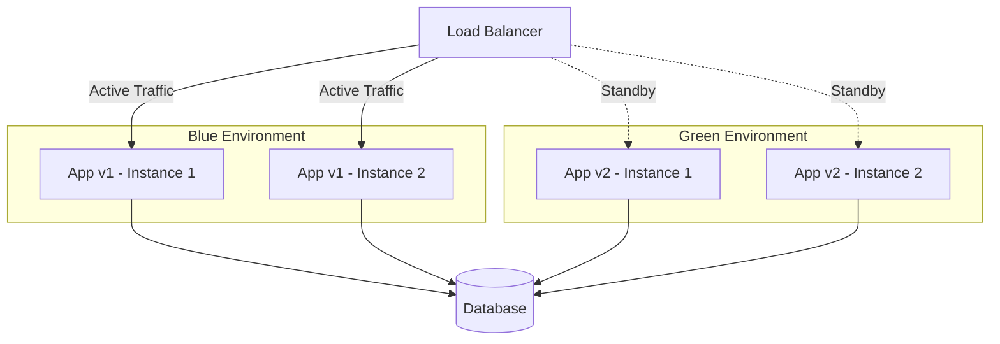

# Blue-Green Deployment

Blue-Green Deployment는 동일한 두 개의 프로덕션 환경(Blue, Green)을 유지하면서 트래픽을 전환하는 무중단 배포 전략이다. 새 버전을 대기 환경에 배포하고 검증한 후 로드 밸런서의 트래픽을 전환하여 즉각적인 릴리스와 롤백이 가능하다.

## 목차
- [1. 핵심 개념 (What)](#1-핵심-개념-what)
- [2. 왜 알아야 하는가 (Why)](#2-왜-알아야-하는가-why)
- [3. 내부 구현 분석 (How)](#3-내부-구현-분석-how)
- [4. 실전 예제](#4-실전-예제)
- [5. 정리](#5-정리)

---

## 1. 핵심 개념 (What)

### Blue-Green Deployment란?



**핵심 구성:**
- **Blue**: 현재 프로덕션 트래픽을 처리하는 활성(Active) 환경
- **Green**: 새 버전이 배포된 대기(Standby) 환경
- **Router/Load Balancer**: 트래픽을 Blue 또는 Green으로 라우팅
- 배포 시 Green에 새 버전을 배포 → 검증 → 트래픽 전환

### 배포 흐름

```
1. 초기 상태
   [Users] → [LB] → [Blue: v1.0] ← Active
                     [Green: idle] ← Idle

2. Green에 v1.1 배포
   [Users] → [LB] → [Blue: v1.0] ← Active
                     [Green: v1.1] ← Testing

3. Green 검증 완료 → 트래픽 전환
   [Users] → [LB] → [Blue: v1.0] ← Standby
                     [Green: v1.1] ← Active

4. (문제 발생 시) 즉시 롤백
   [Users] → [LB] → [Blue: v1.0] ← Active (즉시 복원)
                     [Green: v1.1] ← Standby
```

## 2. 왜 알아야 하는가 (Why)

### Blue-Green의 장점

| 장점 | 설명 |
|------|------|
| 제로 다운타임 | 트래픽 전환으로 서비스 중단 없음 |
| 즉각적 롤백 | 문제 시 트래픽을 이전 환경으로 즉시 전환 |
| 프로덕션 사전 테스트 | Green 환경에서 실제 인프라로 검증 가능 |
| 배포 자신감 | 실패해도 즉시 복원할 수 있으므로 배포 부담 감소 |

### Blue-Green의 단점

| 단점 | 설명 |
|------|------|
| 인프라 비용 2배 | 동일한 환경을 두 벌 유지 |
| DB 마이그레이션 복잡 | 양쪽 환경이 같은 DB를 공유하면 스키마 호환성 필요 |
| 상태 관리 | 세션, 캐시 등 상태 데이터의 전환 처리 필요 |
| Long-running 작업 | 배포 중 진행되던 비동기 작업 처리 주의 |

## 3. 내부 구현 분석 (How)

### 구현 방식별 비교

#### 1. DNS 기반 전환

```
배포 전: app.example.com → Blue (10.0.1.100)
배포 후: app.example.com → Green (10.0.2.100)
```

- 가장 간단한 방법
- DNS TTL에 의한 전환 지연 문제
- 클라이언트 DNS 캐시로 인한 일부 트래픽 유실 가능

#### 2. Load Balancer 기반 전환 (권장)

```
배포 전: ALB → Target Group Blue (v1)
배포 후: ALB → Target Group Green (v2)
```

- 즉각적인 트래픽 전환
- 헬스 체크 통합
- AWS ALB, Nginx, HAProxy 등 활용

#### 3. Kubernetes Service 기반

```
배포 전: Service selector → app=my-app, version=blue
배포 후: Service selector → app=my-app, version=green
```

- Label selector 변경으로 즉시 전환
- Ingress Controller와 연동

### 데이터베이스 마이그레이션 전략

Blue-Green에서 가장 어려운 부분이 DB 마이그레이션이다.

```
문제 상황:
Blue (v1) → DB (schema v1)
Green (v2) → DB (schema v2)  ← v1과 호환 안 됨!

해결 방법: Expand and Contract 패턴

Phase 1 - Expand (확장):
  DB: schema v1 + v2 호환 칼럼 추가 (backward compatible)
  Blue (v1): 정상 동작
  Green (v2): 새 칼럼 사용

Phase 2 - Contract (축소):
  Blue-Green 전환 완료 후
  DB: 이전 버전 칼럼 제거
```

구체적인 예시:

```sql
-- Phase 1: Expand (Blue, Green 모두 호환)
ALTER TABLE users ADD COLUMN full_name VARCHAR(200);
-- v1은 first_name, last_name 사용
-- v2는 full_name 사용
-- 트리거로 양쪽 동기화
CREATE TRIGGER sync_name BEFORE INSERT ON users
  FOR EACH ROW SET NEW.full_name = CONCAT(NEW.first_name, ' ', NEW.last_name);

-- Phase 2: Contract (v2 전환 완료 후)
ALTER TABLE users DROP COLUMN first_name;
ALTER TABLE users DROP COLUMN last_name;
```

### 세션 처리 전략

```
문제: Blue에서 활성화된 사용자 세션을 Green에서도 유지해야 함

해결 1: 외부 세션 스토어 (Redis, Memcached)
  Blue (v1) → Redis (공유 세션)
  Green (v2) → Redis (공유 세션)

해결 2: Stateless 아키텍처 (JWT)
  - 서버에 세션을 저장하지 않음
  - JWT 토큰에 필요한 정보 포함
  - 환경 전환 시 세션 문제 없음
```

## 4. 실전 예제

### 예제 1: AWS ALB + ECS를 활용한 Blue-Green

```yaml
# AWS CloudFormation / CDK 개념

# 1. Blue Target Group
BlueTargetGroup:
  Type: AWS::ElasticLoadBalancingV2::TargetGroup
  Properties:
    Name: my-app-blue
    Port: 8080
    HealthCheckPath: /health
    TargetType: ip

# 2. Green Target Group
GreenTargetGroup:
  Type: AWS::ElasticLoadBalancingV2::TargetGroup
  Properties:
    Name: my-app-green
    Port: 8080
    HealthCheckPath: /health
    TargetType: ip

# 3. ALB Listener - 트래픽을 Blue 또는 Green으로 전달
Listener:
  Type: AWS::ElasticLoadBalancingV2::Listener
  Properties:
    LoadBalancerArn: !Ref ALB
    Port: 443
    DefaultActions:
      - Type: forward
        TargetGroupArn: !Ref BlueTargetGroup  # 전환 시 Green으로 변경
```

```bash
#!/bin/bash
# blue-green-deploy.sh - AWS ALB Blue-Green 배포 스크립트

CLUSTER="my-cluster"
SERVICE="my-app"
BLUE_TG="my-app-blue"
GREEN_TG="my-app-green"
LISTENER_ARN="arn:aws:elasticloadbalancing:..."

# 1. 현재 활성 Target Group 확인
CURRENT_TG=$(aws elbv2 describe-listeners \
    --listener-arns "$LISTENER_ARN" \
    --query 'Listeners[0].DefaultActions[0].TargetGroupArn' \
    --output text)

if [[ "$CURRENT_TG" == *"blue"* ]]; then
    DEPLOY_TG_ARN="arn:.../$GREEN_TG/..."
    DEPLOY_TG="green"
else
    DEPLOY_TG_ARN="arn:.../$BLUE_TG/..."
    DEPLOY_TG="blue"
fi

echo "Current: $CURRENT_TG"
echo "Deploying to: $DEPLOY_TG"

# 2. 대기 환경에 새 버전 배포
aws ecs update-service \
    --cluster "$CLUSTER" \
    --service "${SERVICE}-${DEPLOY_TG}" \
    --force-new-deployment

# 3. 새 버전이 Ready 될 때까지 대기
aws ecs wait services-stable \
    --cluster "$CLUSTER" \
    --services "${SERVICE}-${DEPLOY_TG}"

# 4. 스모크 테스트
echo "Running smoke tests against $DEPLOY_TG..."
HEALTH=$(curl -s -o /dev/null -w "%{http_code}" "http://${DEPLOY_TG}-internal.example.com/health")
if [ "$HEALTH" != "200" ]; then
    echo "Smoke test failed! Aborting deployment."
    exit 1
fi

# 5. 트래픽 전환
aws elbv2 modify-listener \
    --listener-arn "$LISTENER_ARN" \
    --default-actions "Type=forward,TargetGroupArn=$DEPLOY_TG_ARN"

echo "Traffic switched to $DEPLOY_TG. Deployment complete."
echo "To rollback, run: ./rollback.sh"
```

### 예제 2: Kubernetes Blue-Green 배포

```yaml
# blue-deployment.yaml
apiVersion: apps/v1
kind: Deployment
metadata:
  name: my-app-blue
  labels:
    app: my-app
    version: blue
spec:
  replicas: 3
  selector:
    matchLabels:
      app: my-app
      version: blue
  template:
    metadata:
      labels:
        app: my-app
        version: blue
    spec:
      containers:
        - name: my-app
          image: my-app:1.0.0
          ports:
            - containerPort: 8080
          readinessProbe:
            httpGet:
              path: /health
              port: 8080
            initialDelaySeconds: 10
            periodSeconds: 5
---
# green-deployment.yaml
apiVersion: apps/v1
kind: Deployment
metadata:
  name: my-app-green
  labels:
    app: my-app
    version: green
spec:
  replicas: 3
  selector:
    matchLabels:
      app: my-app
      version: green
  template:
    metadata:
      labels:
        app: my-app
        version: green
    spec:
      containers:
        - name: my-app
          image: my-app:1.1.0
          ports:
            - containerPort: 8080
          readinessProbe:
            httpGet:
              path: /health
              port: 8080
---
# service.yaml - selector로 Blue 또는 Green 지정
apiVersion: v1
kind: Service
metadata:
  name: my-app
spec:
  selector:
    app: my-app
    version: blue        # 전환 시 "green"으로 변경
  ports:
    - port: 80
      targetPort: 8080
```

```bash
#!/bin/bash
# k8s-blue-green-switch.sh

NAMESPACE="production"

# 현재 활성 버전 확인
CURRENT=$(kubectl get svc my-app -n "$NAMESPACE" \
    -o jsonpath='{.spec.selector.version}')

if [ "$CURRENT" = "blue" ]; then
    TARGET="green"
else
    TARGET="blue"
fi

echo "Switching from $CURRENT to $TARGET"

# 트래픽 전환 (Service selector 변경)
kubectl patch svc my-app -n "$NAMESPACE" \
    -p "{\"spec\":{\"selector\":{\"version\":\"$TARGET\"}}}"

echo "Traffic switched to $TARGET"
```

### 예제 3: Nginx를 활용한 Blue-Green

```nginx
# /etc/nginx/conf.d/blue-green.conf

upstream blue {
    server 10.0.1.10:8080;
    server 10.0.1.11:8080;
}

upstream green {
    server 10.0.2.10:8080;
    server 10.0.2.11:8080;
}

# active 변수로 현재 활성 환경 결정
map $active_environment $backend {
    "blue"  blue;
    "green" green;
}

server {
    listen 80;
    server_name app.example.com;

    # /etc/nginx/active_env 파일에서 active 환경 읽기
    set_by_lua_block $active_environment {
        local f = io.open("/etc/nginx/active_env", "r")
        local env = f:read("*a"):gsub("%s+", "")
        f:close()
        return env
    }

    location / {
        proxy_pass http://$backend;
        proxy_set_header Host $host;
        proxy_set_header X-Real-IP $remote_addr;
    }
}
```

```bash
# 전환 스크립트
echo "green" > /etc/nginx/active_env
nginx -s reload
```

## 5. 정리

| 항목 | 내용 |
|------|------|
| 핵심 원리 | 두 개의 동일한 환경 간 트래픽 전환 |
| 다운타임 | 없음 (트래픽 스위칭) |
| 롤백 속도 | 즉시 (이전 환경으로 전환) |
| 인프라 비용 | 2x (두 환경 동시 운영) |
| 복잡도 | 중간 (DB 마이그레이션 고려 시 높음) |
| 적합한 경우 | 빠른 롤백이 필수인 서비스, 충분한 인프라 예산 |

### Blue-Green 체크리스트

- [ ] 로드 밸런서/라우터의 트래픽 전환 메커니즘 구현
- [ ] 데이터베이스 마이그레이션 전략 수립 (Expand & Contract)
- [ ] 세션 관리 전략 결정 (외부 스토어 또는 Stateless)
- [ ] 대기 환경 검증을 위한 스모크 테스트 자동화
- [ ] 롤백 프로세스 문서화 및 정기 훈련
- [ ] 모니터링 대시보드에 Blue/Green 상태 표시
- [ ] 전환 후 이전 환경 정리 절차 수립

---
*참고: Martin Fowler - Blue Green Deployment, AWS Blue/Green Deployments on ECS*
