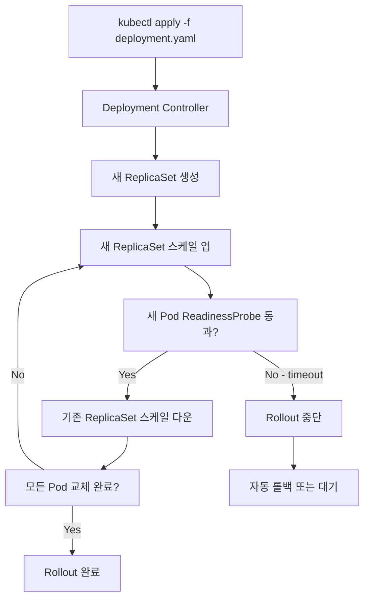

# Rolling Update Deployment

Rolling Update는 인스턴스를 하나씩(또는 일정 수씩) 순차적으로 새 버전으로 교체하는 배포 전략이다. Kubernetes의 기본 배포 전략이며, 추가 인프라 없이 무중단 배포를 구현할 수 있어 가장 널리 사용된다.

## 목차
- [1. 핵심 개념 (What)](#1-핵심-개념-what)
- [2. 왜 알아야 하는가 (Why)](#2-왜-알아야-하는가-why)
- [3. 내부 구현 분석 (How)](#3-내부-구현-분석-how)
- [4. 실전 예제](#4-실전-예제)
- [5. 정리](#5-정리)

---

## 1. 핵심 개념 (What)

### Rolling Update란?

```
시간축 →

Pod 1: [====== v1 ======]→[== v2 ==]→
Pod 2: [========= v1 =========]→[== v2 ==]→
Pod 3: [============ v1 ============]→[== v2 ==]→
Pod 4: [=============== v1 ===============]→[== v2 ==]→

항상 최소 N개의 Pod이 서비스 가능 상태 유지
```

Rolling Update는 다음 과정을 반복한다:
1. 새 버전의 인스턴스 생성
2. 새 인스턴스의 Health Check 통과 확인
3. 기존 버전의 인스턴스 제거
4. 모든 인스턴스가 교체될 때까지 반복

### 핵심 파라미터

| 파라미터 | 설명 | 기본값 |
|---------|------|-------|
| `maxSurge` | 목표 수 대비 추가로 생성할 수 있는 최대 Pod 수 | 25% |
| `maxUnavailable` | 업데이트 중 사용 불가능한 최대 Pod 수 | 25% |
| `minReadySeconds` | Pod이 Ready 후 대기하는 최소 시간 | 0 |
| `progressDeadlineSeconds` | 업데이트 진행 제한 시간 | 600 |

## 2. 왜 알아야 하는가 (Why)

### Rolling Update의 장점

| 장점 | 설명 |
|------|------|
| 무중단 | 항상 최소 수의 인스턴스가 서비스 |
| 추가 비용 없음 | Blue-Green처럼 2배 인프라 불필요 |
| Kubernetes 기본 | 별도 도구 설치 없이 사용 가능 |
| 자동 롤백 | Health Check 실패 시 자동 중단 |

### Rolling Update의 단점

| 단점 | 설명 |
|------|------|
| 버전 혼재 | 배포 중 v1과 v2가 동시에 서비스 |
| 느린 롤백 | 전체 역방향 Rolling이 필요 |
| API 호환성 | 두 버전 간 backward compatibility 필수 |
| 디버깅 어려움 | 에러 발생 시 어떤 버전에서 발생했는지 파악 필요 |

## 3. 내부 구현 분석 (How)

### maxSurge와 maxUnavailable 조합

replicas=4인 Deployment를 기준으로:

#### Case 1: maxSurge=1, maxUnavailable=0 (안전 우선)

```
항상 4개 이상 가용, 최대 5개까지 생성

Step 1: v1 v1 v1 v1 v2(new)    → 5개 (surge +1)
Step 2: v1 v1 v1 v2 v2(new)    → v1 하나 제거, 새 v2 생성
Step 3: v1 v1 v2 v2 v2(new)    → 반복
Step 4: v1 v2 v2 v2 v2(new)    → 반복
Step 5: v2 v2 v2 v2            → 완료
```

- 가장 안전: 항상 원래 replica 수 이상 유지
- 가장 느림: 한 번에 하나씩 교체
- **서비스 가용성 최우선일 때 선택**

#### Case 2: maxSurge=0, maxUnavailable=1 (리소스 절약)

```
항상 3~4개 유지, 추가 Pod 없음

Step 1: v1 v1 v1 __ v2(new)    → v1 하나 제거 먼저
Step 2: v1 v1 __ v2 v2(new)    → 반복
Step 3: v1 __ v2 v2 v2(new)    → 반복
Step 4: v2 v2 v2 v2            → 완료
```

- 추가 리소스 불필요
- 순간적으로 가용 Pod 감소
- **리소스가 제한된 환경에서 선택**

#### Case 3: maxSurge=25%, maxUnavailable=25% (기본값)

```
replicas=4 기준: maxSurge=1, maxUnavailable=1

Step 1: v1 v1 v1 __ v2(new) v2(new)   → 동시에 1개 제거, 2개 추가
Step 2: v1 v1 v2 v2 v2(new)           → 빠른 교체
Step 3: v2 v2 v2 v2                    → 완료
```

- 속도와 안전의 균형
- 대부분의 경우 적합

### Kubernetes Rolling Update 내부 동작



**핵심 메커니즘:**
1. **ReplicaSet**: Deployment는 내부적으로 ReplicaSet을 생성/관리
2. **Revision History**: 이전 ReplicaSet을 보관하여 롤백 지원
3. **ReadinessProbe**: 새 Pod이 트래픽을 받을 준비가 되었는지 확인
4. **LivenessProbe**: Pod이 정상 동작하는지 확인

### Health Check 설정

```yaml
spec:
  containers:
    - name: my-app
      image: my-app:2.0.0
      ports:
        - containerPort: 8080

      # Readiness Probe: 트래픽 수신 준비 확인
      readinessProbe:
        httpGet:
          path: /health/ready
          port: 8080
        initialDelaySeconds: 10    # 최초 대기 시간
        periodSeconds: 5           # 검사 주기
        successThreshold: 1        # 성공 횟수
        failureThreshold: 3        # 실패 허용 횟수

      # Liveness Probe: 정상 동작 확인
      livenessProbe:
        httpGet:
          path: /health/live
          port: 8080
        initialDelaySeconds: 30
        periodSeconds: 10
        failureThreshold: 3

      # Startup Probe: 시작 완료 확인 (느린 앱용)
      startupProbe:
        httpGet:
          path: /health/started
          port: 8080
        failureThreshold: 30       # 30 x 10s = 최대 5분 대기
        periodSeconds: 10
```

### Graceful Shutdown

Rolling Update 중 기존 Pod이 제거될 때, 진행 중인 요청을 안전하게 처리해야 한다.

```
Pod 종료 시퀀스:
1. Pod이 Service 엔드포인트에서 제거 (새 요청 유입 중단)
2. SIGTERM 시그널 전송
3. preStop hook 실행 (설정된 경우)
4. 애플리케이션이 진행 중 요청 완료
5. terminationGracePeriodSeconds 후 SIGKILL
```

```yaml
spec:
  terminationGracePeriodSeconds: 60    # 최대 60초 대기
  containers:
    - name: my-app
      lifecycle:
        preStop:
          exec:
            command: ["/bin/sh", "-c", "sleep 5"]  # LB 반영 대기
```

```java
// Spring Boot Graceful Shutdown
// application.yml
// server.shutdown: graceful
// spring.lifecycle.timeout-per-shutdown-phase: 30s

@Component
public class GracefulShutdownHandler {

    @PreDestroy
    public void onShutdown() {
        // 진행 중인 작업 완료 대기
        // 외부 연결 정리
        log.info("Graceful shutdown initiated");
    }
}
```

## 4. 실전 예제

### 예제 1: 프로덕션 Deployment 설정

```yaml
apiVersion: apps/v1
kind: Deployment
metadata:
  name: my-app
  labels:
    app: my-app
spec:
  replicas: 4
  revisionHistoryLimit: 5           # 롤백용 이전 버전 5개 보관

  strategy:
    type: RollingUpdate
    rollingUpdate:
      maxSurge: 1                   # 최대 5개까지 생성
      maxUnavailable: 0             # 항상 4개 가용 (무중단)

  selector:
    matchLabels:
      app: my-app

  template:
    metadata:
      labels:
        app: my-app
        version: "2.0.0"
    spec:
      terminationGracePeriodSeconds: 60

      # Pod 분산 배치
      topologySpreadConstraints:
        - maxSkew: 1
          topologyKey: kubernetes.io/hostname
          whenUnsatisfiable: DoNotSchedule
          labelSelector:
            matchLabels:
              app: my-app

      containers:
        - name: my-app
          image: my-app:2.0.0
          ports:
            - containerPort: 8080

          resources:
            requests:
              cpu: 500m
              memory: 512Mi
            limits:
              cpu: 1000m
              memory: 1Gi

          readinessProbe:
            httpGet:
              path: /actuator/health/readiness
              port: 8080
            initialDelaySeconds: 15
            periodSeconds: 5
            failureThreshold: 3

          livenessProbe:
            httpGet:
              path: /actuator/health/liveness
              port: 8080
            initialDelaySeconds: 30
            periodSeconds: 10
            failureThreshold: 3

          startupProbe:
            httpGet:
              path: /actuator/health
              port: 8080
            failureThreshold: 30
            periodSeconds: 10

          lifecycle:
            preStop:
              exec:
                command: ["/bin/sh", "-c", "sleep 5"]

  minReadySeconds: 10              # Ready 후 10초 추가 대기
  progressDeadlineSeconds: 300     # 5분 내 완료 안 되면 실패
```

### 예제 2: 롤백 명령어

```bash
# 롤아웃 상태 확인
kubectl rollout status deployment/my-app

# 롤아웃 히스토리 확인
kubectl rollout history deployment/my-app
# REVISION  CHANGE-CAUSE
# 1         Initial deployment
# 2         Update to v1.1.0
# 3         Update to v2.0.0

# 특정 리비전 상세 확인
kubectl rollout history deployment/my-app --revision=2

# 이전 버전으로 롤백
kubectl rollout undo deployment/my-app

# 특정 리비전으로 롤백
kubectl rollout undo deployment/my-app --to-revision=2

# 롤아웃 일시정지 (문제 의심 시)
kubectl rollout pause deployment/my-app

# 롤아웃 재개
kubectl rollout resume deployment/my-app

# 롤아웃 재시작 (모든 Pod 재생성)
kubectl rollout restart deployment/my-app
```

### 예제 3: PodDisruptionBudget과 함께 사용

```yaml
# 최소 가용 Pod 수를 보장하는 PDB
apiVersion: policy/v1
kind: PodDisruptionBudget
metadata:
  name: my-app-pdb
spec:
  minAvailable: 3                  # 항상 최소 3개 가용
  # 또는 maxUnavailable: 1        # 최대 1개 불가용
  selector:
    matchLabels:
      app: my-app
```

## 5. 정리

| 항목 | 내용 |
|------|------|
| 핵심 원리 | 인스턴스를 순차적으로 새 버전으로 교체 |
| 핵심 파라미터 | maxSurge, maxUnavailable |
| Health Check | ReadinessProbe(필수), LivenessProbe, StartupProbe |
| 롤백 | `kubectl rollout undo` (ReplicaSet 히스토리 활용) |
| 비용 | 추가 인프라 비용 최소 (maxSurge만큼 추가) |
| 주의사항 | 배포 중 버전 혼재, Backward Compatibility 필수 |

### Rolling Update 체크리스트

- [ ] ReadinessProbe 설정 (필수)
- [ ] LivenessProbe 설정 (권장)
- [ ] Graceful Shutdown 구현 (terminationGracePeriodSeconds + preStop)
- [ ] maxSurge/maxUnavailable 서비스 특성에 맞게 조정
- [ ] minReadySeconds로 안정화 시간 확보
- [ ] PodDisruptionBudget 설정
- [ ] revisionHistoryLimit으로 롤백 가능 버전 수 관리
- [ ] progressDeadlineSeconds로 배포 실패 감지

---
*참고: Kubernetes Documentation - Deployments, Kubernetes in Action (Marko Luksa)*
