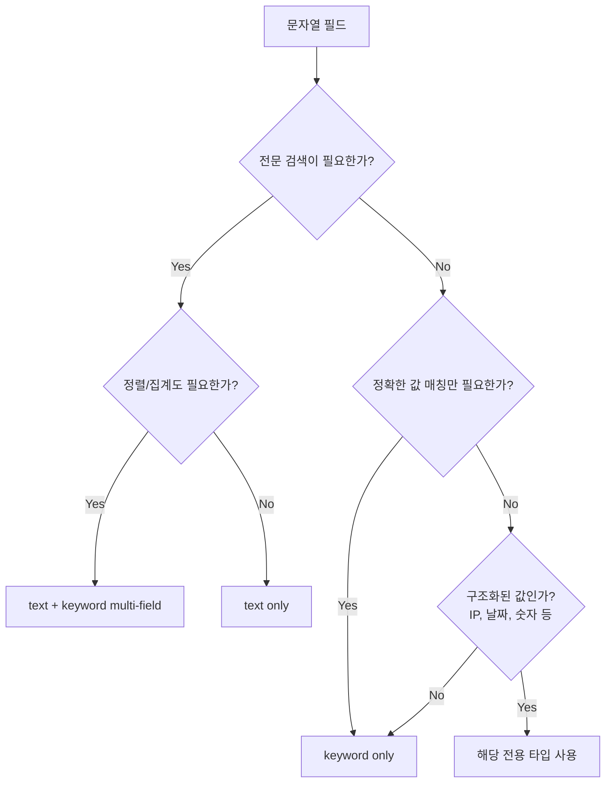
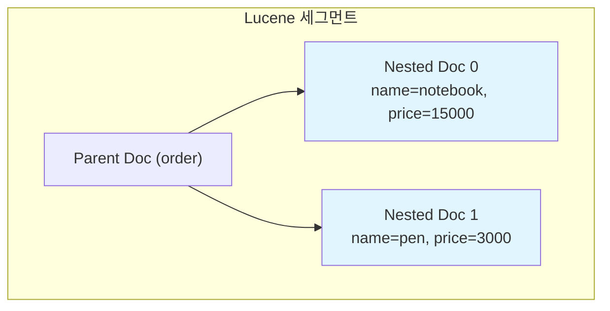
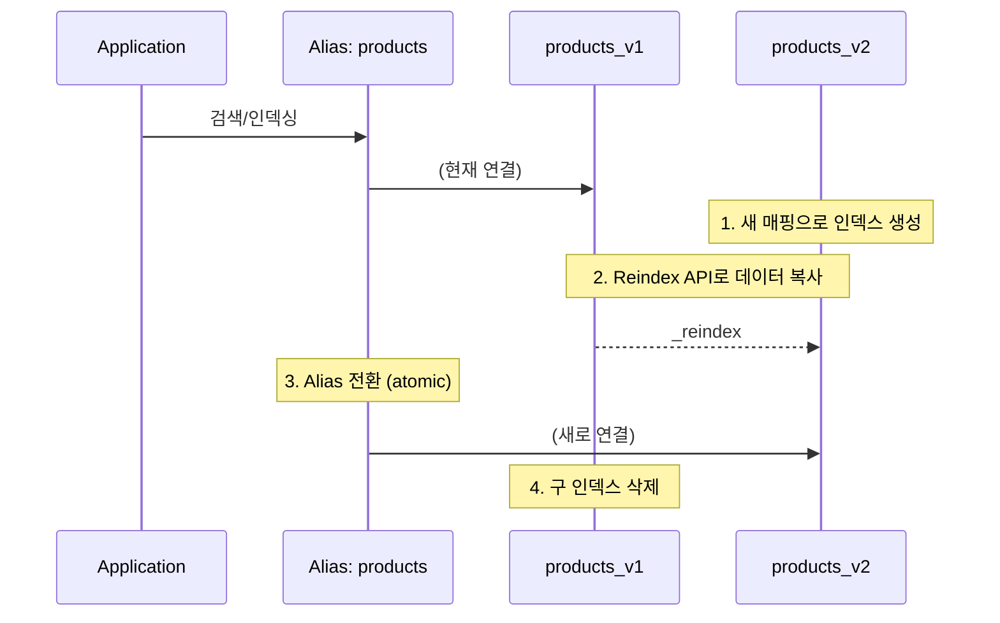
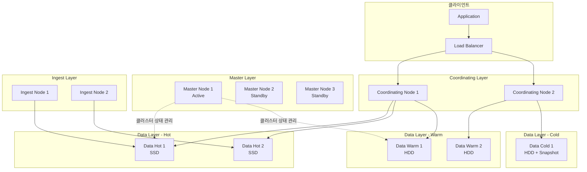

# 매핑 설계와 최적화

Elasticsearch에서 매핑(Mapping)은 문서의 필드가 어떻게 저장되고 인덱싱되는지를 정의하는 스키마다. 올바른 매핑 설계는 검색 성능, 저장 효율, 집계 정확성에 직접적인 영향을 미친다.

## 목차
- [1. 핵심 개념 (What)](#1-핵심-개념-what)
- [2. 왜 알아야 하는가 (Why)](#2-왜-알아야-하는가-why)
- [3. 내부 구현 분석 (How)](#3-내부-구현-분석-how)
- [4. 실전 예제](#4-실전-예제)
- [5. 정리](#5-정리)

---

## 1. 핵심 개념 (What)

### Dynamic Mapping vs Explicit Mapping

Elasticsearch는 두 가지 매핑 방식을 제공한다.

| 구분 | Dynamic Mapping | Explicit Mapping |
|------|----------------|-----------------|
| 정의 | 문서 인덱싱 시 자동으로 필드 타입 추론 | 인덱스 생성 시 명시적으로 필드 타입 지정 |
| 장점 | 빠른 프로토타이핑, 설정 불필요 | 정확한 타입 제어, 최적화 가능 |
| 단점 | 타입 오추론, 불필요한 필드 생성 | 사전 스키마 설계 필요 |
| 적합 환경 | 개발/탐색 단계 | 프로덕션 환경 |

**Dynamic Mapping의 함정**: 숫자 문자열 `"12345"`가 `text` + `keyword`로 매핑되어 숫자 범위 쿼리가 불가능해지는 경우가 흔하다.

### 필드 타입 분류

```
Field Types
├── Core Types
│   ├── text          (전문 검색용, 분석기 적용)
│   ├── keyword       (정확한 값 매칭, 집계/정렬용)
│   ├── long/integer  (정수형)
│   ├── double/float  (부동소수점)
│   ├── boolean
│   └── date
├── Complex Types
│   ├── object        (JSON 객체, 평탄화 저장)
│   ├── nested        (독립 Lucene 문서로 저장)
│   └── flattened     (전체를 keyword로 저장)
├── Specialized Types
│   ├── geo_point / geo_shape
│   ├── ip
│   ├── completion    (자동완성용)
│   └── dense_vector  (벡터 검색용)
└── Meta Types
    ├── _source
    ├── _routing
    └── _meta
```

---

## 2. 왜 알아야 하는가 (Why)

### 매핑 실수의 실무 비용

1. **저장 공간 폭발**: Dynamic Mapping으로 모든 문자열이 `text` + `keyword` 이중 매핑되면, 저장 공간이 2-3배 증가한다.
2. **검색 성능 저하**: `text` 필드에 대해 집계를 수행하면 `fielddata`를 활성화해야 하고, 이는 힙 메모리를 대량 소비한다.
3. **Mapping Explosion**: 로그 데이터에서 동적 키가 무한히 생성되면 매핑 필드 수가 수천 개로 폭증하여 클러스터 불안정을 초래한다.
4. **되돌릴 수 없는 변경**: 기존 필드의 타입은 변경 불가. Reindex가 유일한 방법이며, 대규모 인덱스에서는 수 시간이 소요된다.

### 실제 장애 사례

```
시나리오: 주문 데이터에서 order_id를 Dynamic Mapping으로 인덱싱
→ "ORD-20240101-001"이 text+keyword로 매핑
→ 이후 숫자형 order_id (10001)가 유입
→ 타입 충돌로 해당 문서 인덱싱 실패
→ 데이터 유실 발생
```

---

## 3. 내부 구현 분석 (How)

### 3.1 text vs keyword 선택 전략



**핵심 원칙**: 
- 사람이 읽는 자연어 텍스트 → `text`
- 시스템이 생성한 식별자/코드 → `keyword`
- 둘 다 필요하면 → multi-field

### 3.2 Nested vs Object 타입 비교

**Object 타입의 평탄화 문제**:

```json
// 원본 문서
{
  "order": {
    "items": [
      { "name": "notebook", "price": 15000 },
      { "name": "pen", "price": 3000 }
    ]
  }
}

// Elasticsearch 내부 저장 (Object 타입)
{
  "order.items.name": ["notebook", "pen"],
  "order.items.price": [15000, 3000]
}
```

Object 타입은 내부 배열의 필드 간 연관 관계가 사라진다. `name=pen AND price=15000`으로 검색하면 매칭되어 버리는 오류가 발생한다.

**Nested 타입의 내부 구조**:



Nested 문서는 별도의 Lucene 문서로 저장되므로 필드 간 연관 관계가 유지된다. 하지만 다음 비용이 발생한다:

| 항목 | Object | Nested |
|------|--------|--------|
| Lucene 문서 수 | 1 | 1 + N (배열 요소 수) |
| 쿼리 복잡도 | 일반 쿼리 | nested 쿼리 필수 |
| 인덱싱 속도 | 빠름 | 느림 (별도 문서 생성) |
| 업데이트 비용 | 낮음 | 높음 (전체 재인덱싱) |

**선택 기준**:
- 배열 내 객체 간 필드 연관 쿼리가 필요 → `nested`
- 단순 필터링/집계만 필요 → `object`
- 배열 크기가 수백 개 이상 → `flattened` 또는 별도 인덱스 고려

### 3.3 Multi-field 매핑 패턴

하나의 소스 필드를 여러 방식으로 인덱싱하는 패턴이다.

```json
{
  "mappings": {
    "properties": {
      "product_name": {
        "type": "text",
        "analyzer": "standard",
        "fields": {
          "keyword": {
            "type": "keyword",
            "ignore_above": 256
          },
          "autocomplete": {
            "type": "text",
            "analyzer": "edge_ngram_analyzer"
          },
          "korean": {
            "type": "text",
            "analyzer": "nori_analyzer"
          }
        }
      }
    }
  }
}
```

**활용 패턴**:
- `product_name` → 일반 전문 검색
- `product_name.keyword` → 정렬, 집계, 정확한 매칭
- `product_name.autocomplete` → 자동완성
- `product_name.korean` → 한국어 형태소 분석 검색

### 3.4 Dynamic Template을 활용한 매핑 제어

Dynamic Mapping을 완전히 끄지 않으면서도 제어하는 방법이다.

```json
{
  "mappings": {
    "dynamic": "strict",
    "dynamic_templates": [
      {
        "strings_as_keywords": {
          "match_mapping_type": "string",
          "match": "*_id",
          "mapping": {
            "type": "keyword"
          }
        }
      },
      {
        "strings_as_text": {
          "match_mapping_type": "string",
          "match": "*_desc",
          "mapping": {
            "type": "text",
            "analyzer": "standard"
          }
        }
      },
      {
        "longs_as_integers": {
          "match_mapping_type": "long",
          "mapping": {
            "type": "integer"
          }
        }
      }
    ],
    "properties": {
      // 명시적 매핑은 여기에 정의
    }
  }
}
```

---

## 4. 실전 예제

### 예제 1: E-commerce 상품 인덱스 매핑 설계

```json
PUT /products
{
  "settings": {
    "number_of_shards": 3,
    "number_of_replicas": 1,
    "analysis": {
      "analyzer": {
        "korean_analyzer": {
          "type": "custom",
          "tokenizer": "nori_tokenizer",
          "filter": ["lowercase", "nori_part_of_speech"]
        },
        "edge_ngram_analyzer": {
          "type": "custom",
          "tokenizer": "edge_ngram_tokenizer",
          "filter": ["lowercase"]
        }
      },
      "tokenizer": {
        "edge_ngram_tokenizer": {
          "type": "edge_ngram",
          "min_gram": 2,
          "max_gram": 20,
          "token_chars": ["letter", "digit"]
        }
      }
    }
  },
  "mappings": {
    "dynamic": "strict",
    "properties": {
      "product_id": { "type": "keyword" },
      "name": {
        "type": "text",
        "analyzer": "korean_analyzer",
        "fields": {
          "keyword": { "type": "keyword", "ignore_above": 256 },
          "autocomplete": { "type": "text", "analyzer": "edge_ngram_analyzer" }
        }
      },
      "description": {
        "type": "text",
        "analyzer": "korean_analyzer"
      },
      "category": {
        "type": "keyword"
      },
      "price": { "type": "integer" },
      "discount_rate": { "type": "scaled_float", "scaling_factor": 100 },
      "brand": {
        "type": "text",
        "fields": {
          "keyword": { "type": "keyword" }
        }
      },
      "tags": { "type": "keyword" },
      "attributes": {
        "type": "nested",
        "properties": {
          "key": { "type": "keyword" },
          "value": { "type": "keyword" }
        }
      },
      "reviews": {
        "type": "nested",
        "properties": {
          "user_id": { "type": "keyword" },
          "rating": { "type": "byte" },
          "comment": { "type": "text", "analyzer": "korean_analyzer" },
          "created_at": { "type": "date" }
        }
      },
      "location": { "type": "geo_point" },
      "created_at": { "type": "date" },
      "updated_at": { "type": "date" },
      "is_active": { "type": "boolean" }
    }
  }
}
```

**설계 근거**:
- `product_id`: 정확한 값 조회 전용 → `keyword`
- `name`: 검색 + 정렬 + 자동완성 → multi-field
- `price`: 정수로 충분 → `integer` (float 사용 시 범위 쿼리 느림)
- `discount_rate`: 소수점 필요하지만 정밀도 고정 → `scaled_float`
- `attributes`: 키-값 쌍의 연관 관계 유지 필요 → `nested`

### 예제 2: 매핑 변경 전략 — Reindex with Alias

기존 인덱스의 매핑을 변경해야 할 때 무중단으로 처리하는 패턴이다.



```json
// Step 1: 새 매핑으로 인덱스 생성
PUT /products_v2
{
  "mappings": {
    "properties": {
      "price": { "type": "long" }
    }
  }
}

// Step 2: Reindex
POST /_reindex
{
  "source": { "index": "products_v1" },
  "dest": { "index": "products_v2" }
}

// Step 3: Alias 원자적 전환
POST /_aliases
{
  "actions": [
    { "remove": { "index": "products_v1", "alias": "products" } },
    { "add": { "index": "products_v2", "alias": "products" } }
  ]
}

// Step 4: 확인 후 구 인덱스 삭제
DELETE /products_v1
```

### 예제 3: Mapping Explosion 방지

```json
PUT /logs
{
  "settings": {
    "index.mapping.total_fields.limit": 500,
    "index.mapping.depth.limit": 5,
    "index.mapping.nested_fields.limit": 25,
    "index.mapping.nested_objects.limit": 10000
  },
  "mappings": {
    "dynamic": "strict",
    "properties": {
      "timestamp": { "type": "date" },
      "level": { "type": "keyword" },
      "message": { "type": "text" },
      "metadata": {
        "type": "flattened"
      }
    }
  }
}
```

`metadata` 필드에 `flattened` 타입을 사용하면, 내부의 모든 키-값 쌍이 단일 필드로 취급되어 매핑 필드 수가 폭증하지 않는다. 단, 전문 검색과 범위 쿼리는 불가하고 정확한 값 매칭만 가능하다.

---

## 5. 정리

| 항목 | 핵심 내용 |
|------|----------|
| **Dynamic vs Explicit** | 프로덕션은 반드시 `"dynamic": "strict"` 사용 |
| **text vs keyword** | 전문 검색 → text, 집계/정렬/정확 매칭 → keyword |
| **Nested vs Object** | 배열 내 필드 연관 쿼리 필요 → nested, 아니면 object |
| **Multi-field** | 하나의 필드를 검색/정렬/자동완성 등 다목적으로 활용 |
| **매핑 변경** | Alias + Reindex로 무중단 전환 |
| **Mapping Explosion 방지** | `total_fields.limit` 설정 + `flattened` 타입 활용 |
| **숫자형 필드** | 범위 쿼리 빈번 → numeric, 정확 매칭만 → keyword |
| **날짜 필드** | 반드시 `date` 타입으로 명시 (문자열 추론 방지) |

---

## 보충: 클러스터 셋업

프로덕션 환경에서 안정적인 Elasticsearch 클러스터를 구축하기 위한 노드 구성 전략, 핵심 설정, JVM 튜닝, 디스커버리 메커니즘을 정리한다.

### 노드 역할(Node Roles)

Elasticsearch 7.9+부터 `node.roles` 설정으로 노드 역할을 명시적으로 지정한다.

| 역할 | 설명 | 리소스 특성 |
|------|------|-------------|
| `master` | 클러스터 상태 관리, 인덱스 생성/삭제, 샤드 할당 | 낮은 CPU/메모리, 안정성 최우선 |
| `data` | 데이터 저장, CRUD, 검색, 집계 수행 | 높은 CPU/메모리/디스크 I/O |
| `data_content` | 일반 콘텐츠 데이터 전용 | 높은 디스크, SSD 권장 |
| `data_hot` | 최신 시계열 데이터 저장 | 높은 I/O, SSD 필수 |
| `data_warm` | 조회 빈도 낮은 시계열 데이터 | 대용량 HDD 가능 |
| `data_cold` | 거의 조회하지 않는 데이터 | 대용량 HDD, Searchable Snapshot |
| `ingest` | 인덱싱 전 파이프라인 처리 | 중간 CPU |
| `coordinating` | 요청 라우팅, 결과 병합 (역할 미지정 시 기본) | 높은 메모리 |
| `ml` | 머신러닝 작업 전용 | 높은 CPU/메모리 |

### 클러스터 구성 최소 요건

- **Master-eligible 노드**: 최소 3개 (Split-brain 방지)
- **Data 노드**: 워크로드에 따라 확장
- **Coordinating 노드**: 대규모 집계/검색 시 별도 구성 권장

### 클러스터 아키텍처



### 마스터 선출 프로세스

Elasticsearch 7.0+에서는 Zen Discovery 대신 새로운 클러스터 조정 메커니즘을 사용한다.

1. **초기 부트스트래핑**: `cluster.initial_master_nodes`에 지정된 노드들이 첫 번째 선출 수행
2. **투표 구성(Voting Configuration)**: 클러스터가 자동으로 관리하며, 과반수 기반 합의
3. **Term 기반 선출**: 각 선출마다 term이 증가하여 이전 리더의 결정을 무효화

### 샤드 할당 의사결정

```
할당 요청 → Allocation Decider 체인 실행
  ├── DiskThresholdDecider: 디스크 워터마크 확인
  ├── SameShardAllocationDecider: 동일 노드 중복 방지
  ├── FilterAllocationDecider: 사용자 정의 필터 확인
  ├── AwarenessAllocationDecider: rack/zone 인식 배치
  └── RebalanceAllocationDecider: 균형 재조정 판단
```

### 주요 노드 설정 예시

**Master Node** (`elasticsearch.yml`):

```yaml
cluster.name: prod-search-cluster
node.name: master-01
node.roles: [ master ]
network.host: 0.0.0.0
http.port: 9200
transport.port: 9300

discovery.seed_hosts:
  - master-01:9300
  - master-02:9300
  - master-03:9300

cluster.initial_master_nodes:
  - master-01
  - master-02
  - master-03

path.data: /var/lib/elasticsearch
path.logs: /var/log/elasticsearch
```

**Data Hot Node**:

```yaml
cluster.name: prod-search-cluster
node.name: data-hot-01
node.roles: [ data_hot, ingest ]
network.host: 0.0.0.0

discovery.seed_hosts:
  - master-01:9300
  - master-02:9300
  - master-03:9300

path.data:
  - /mnt/ssd1/elasticsearch
  - /mnt/ssd2/elasticsearch
path.logs: /var/log/elasticsearch

thread_pool.write.queue_size: 1000
thread_pool.search.queue_size: 2000
indices.memory.index_buffer_size: 20%
```

**Coordinating-only Node**:

```yaml
cluster.name: prod-search-cluster
node.name: coord-01
node.roles: [ ]  # 빈 배열 = coordinating only
network.host: 0.0.0.0

discovery.seed_hosts:
  - master-01:9300
  - master-02:9300
  - master-03:9300
```

### JVM 옵션

```bash
# Master Node JVM (4GB)
-Xms4g
-Xmx4g

# Data Hot Node JVM (31GB 상한)
# 물리 메모리의 50% 이하, 최대 31GB (Compressed OOPs 한계)
-Xms31g
-Xmx31g

# GC 설정 (ES 8.x 기본값: G1GC)
-XX:+UseG1GC
-XX:G1HeapRegionSize=16m
-XX:MaxGCPauseMillis=200
-XX:InitiatingHeapOccupancyPercent=30

# OOM 시 힙 덤프
-XX:+HeapDumpOnOutOfMemoryError
-XX:HeapDumpPath=/var/lib/elasticsearch/heapdump
```

### OS 레벨 설정 (Linux)

```bash
# /etc/sysctl.conf
vm.max_map_count=262144
vm.swappiness=1
net.core.somaxconn=65535
net.ipv4.tcp_max_syn_backlog=65535

# /etc/security/limits.conf
elasticsearch  soft  nofile  65535
elasticsearch  hard  nofile  65535
elasticsearch  soft  memlock unlimited
elasticsearch  hard  memlock unlimited
```

### 디스크 워터마크 설정

```yaml
cluster.routing.allocation.disk.threshold_enabled: true
cluster.routing.allocation.disk.watermark.low: 85%
cluster.routing.allocation.disk.watermark.high: 90%
cluster.routing.allocation.disk.watermark.flood_stage: 95%
```

### 보안 설정 (xpack.security)

```yaml
xpack.security.enabled: true
xpack.security.enrollment.enabled: true

# TLS - Transport Layer
xpack.security.transport.ssl.enabled: true
xpack.security.transport.ssl.verification_mode: certificate
xpack.security.transport.ssl.keystore.path: elastic-certificates.p12
xpack.security.transport.ssl.truststore.path: elastic-certificates.p12

# TLS - HTTP Layer
xpack.security.http.ssl.enabled: true
xpack.security.http.ssl.keystore.path: http.p12
```

### Docker Compose 개발 환경

```yaml
version: '3.8'
services:
  es-master-01:
    image: docker.elastic.co/elasticsearch/elasticsearch:8.12.0
    container_name: es-master-01
    environment:
      - node.name=es-master-01
      - node.roles=master
      - cluster.name=dev-cluster
      - discovery.seed_hosts=es-master-02,es-master-03
      - cluster.initial_master_nodes=es-master-01,es-master-02,es-master-03
      - "ES_JAVA_OPTS=-Xms1g -Xmx1g"
      - xpack.security.enabled=false
    ulimits:
      memlock:
        soft: -1
        hard: -1
    ports:
      - "9200:9200"
    networks:
      - elastic

  es-data-hot-01:
    image: docker.elastic.co/elasticsearch/elasticsearch:8.12.0
    container_name: es-data-hot-01
    environment:
      - node.name=es-data-hot-01
      - node.roles=data_hot,ingest
      - cluster.name=dev-cluster
      - discovery.seed_hosts=es-master-01,es-master-02,es-master-03
      - "ES_JAVA_OPTS=-Xms2g -Xmx2g"
      - xpack.security.enabled=false
    ulimits:
      memlock:
        soft: -1
        hard: -1
    volumes:
      - es-data-hot:/usr/share/elasticsearch/data
    networks:
      - elastic

volumes:
  es-data-hot:

networks:
  elastic:
    driver: bridge
```

### 클러스터 셋업 정리

| 항목 | 권장 사항 |
|------|-----------|
| Master 노드 | 최소 3개, 전용 역할, 4GB 힙 |
| Data Hot 노드 | SSD 필수, 힙 31GB 이하, 물리 메모리의 50% |
| Data Warm/Cold 노드 | 대용량 HDD, ILM과 연계하여 자동 전환 |
| Coordinating 노드 | 대규모 쿼리/집계 워크로드 시 별도 구성 |
| JVM | Xms=Xmx, 31GB 상한, G1GC 사용 |
| OS | `vm.max_map_count=262144`, swap 비활성화, `memlock unlimited` |
| 디스크 | 워터마크 low=85%, high=90%, flood_stage=95% |
| 보안 | TLS 활성화, xpack.security 필수 |
| 디스커버리 | `discovery.seed_hosts`에 모든 Master 노드 등록 |

---
*참고: Elasticsearch 8.x 기준*
