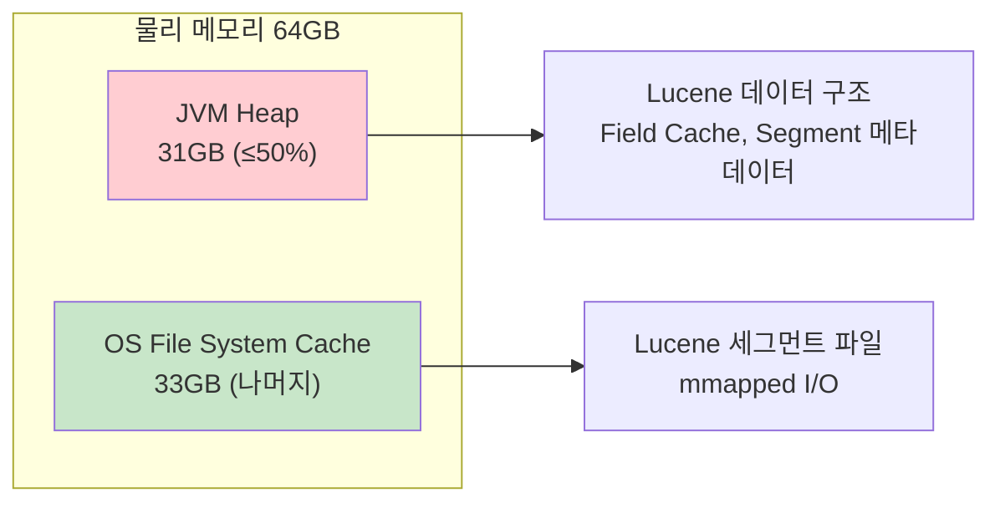
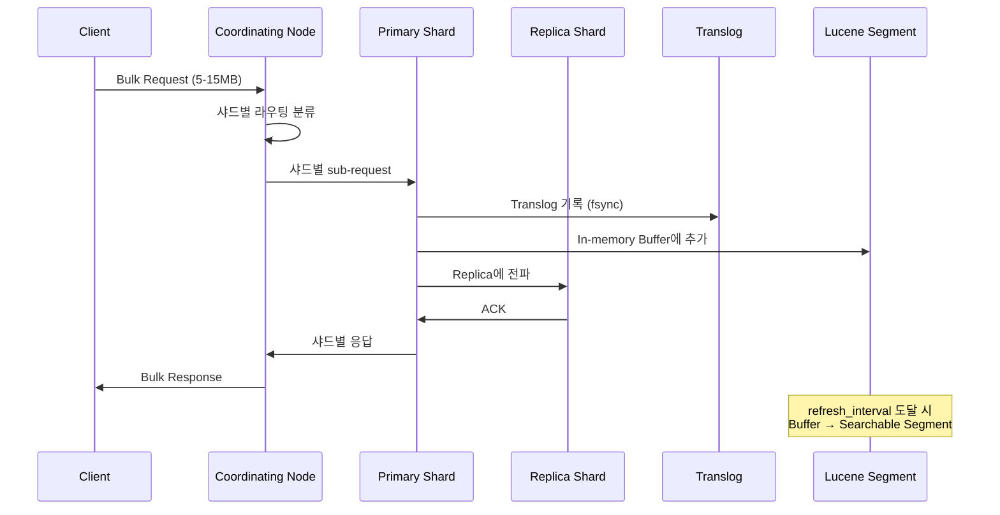
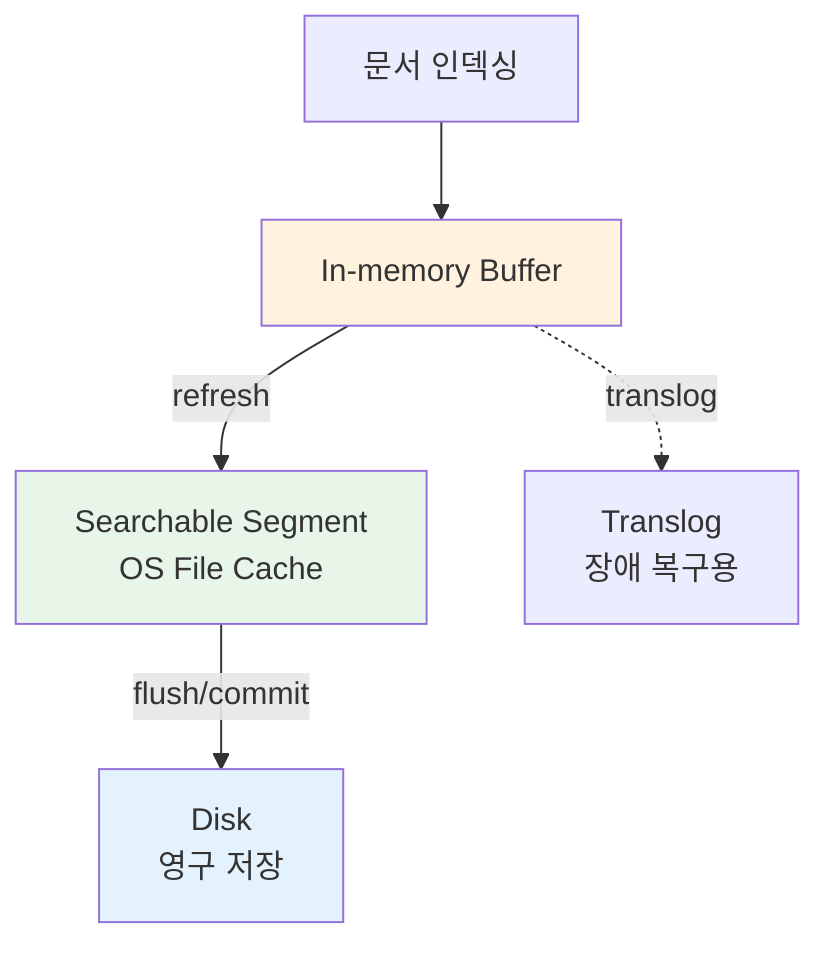
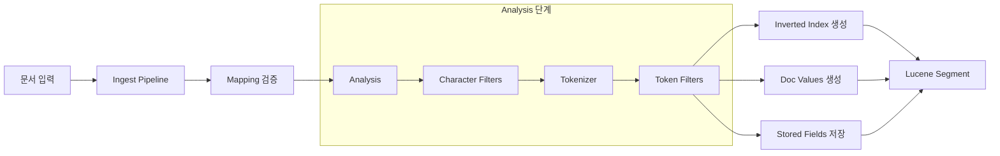
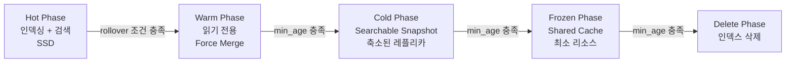

# Elasticsearch 성능 튜닝

Elasticsearch의 성능은 JVM 설정, 인덱싱 전략, 캐시 구성, 쿼리 최적화의 조합으로 결정된다. 이 문서에서는 프로덕션 환경에서 실질적인 성능 개선을 이끌어내는 핵심 튜닝 포인트를 다룬다.

## 목차
- [1. 핵심 개념 (What)](#1-핵심-개념-what)
- [2. 왜 알아야 하는가 (Why)](#2-왜-알아야-하는가-why)
- [3. 내부 구현 분석 (How)](#3-내부-구현-분석-how)
- [4. 실전 예제](#4-실전-예제)
- [5. 정리](#5-정리)

---

## 1. 핵심 개념 (What)

Elasticsearch 성능 튜닝은 크게 4개 레이어로 구분된다.

```
Performance Tuning Layers
├── 1. JVM / OS Layer
│   ├── Heap 크기 설정
│   ├── GC 알고리즘 선택
│   └── OS 파일 디스크립터/mmap 설정
├── 2. Indexing Layer
│   ├── Bulk API 최적화
│   ├── Refresh Interval 튜닝
│   └── Translog 설정
├── 3. Cache Layer
│   ├── Node Query Cache
│   ├── Shard Request Cache
│   └── Fielddata Cache
└── 4. Query Layer
    ├── 쿼리 구조 최적화
    ├── Profile API 활용
    └── 필터 컨텍스트 활용
```

---

## 2. 왜 알아야 하는가 (Why)

### 기본 설정의 한계

Elasticsearch의 기본 설정은 범용적 안정성에 초점이 맞춰져 있다. 프로덕션 워크로드에서는 다음과 같은 병목이 발생한다:

| 병목 유형 | 기본 설정 | 문제 | 튜닝 효과 |
|-----------|----------|------|-----------|
| 인덱싱 처리량 | refresh_interval=1s | 초당 refresh로 세그먼트 과다 생성 | 30s로 변경 시 인덱싱 처리량 30-50% 향상 |
| 검색 지연 | 캐시 미최적화 | 동일 쿼리 반복 시 매번 디스크 접근 | 캐시 적중률 향상으로 응답 시간 50-80% 감소 |
| 메모리 부족 | Heap=1GB (기본) | OOM 또는 빈번한 GC | 적절한 힙 설정으로 GC 일시정지 최소화 |
| Bulk 실패 | 단건 인덱싱 | 네트워크 오버헤드 극대화 | Bulk API로 처리량 5-10배 향상 |

### 실무에서의 영향

- 로그 수집 파이프라인: 초당 수만 건 인덱싱 시 Bulk + Refresh 튜닝이 필수
- 실시간 검색 서비스: 캐시 전략이 P99 latency를 좌우
- 분석 대시보드: 대용량 집계 쿼리에서 fielddata/circuit breaker 설정이 안정성 결정

---

## 3. 내부 구현 분석 (How)

### 3.1 JVM Heap 설정

#### 50% 규칙



**왜 50%인가?**
- Elasticsearch는 Lucene 기반이며, Lucene은 OS 파일 시스템 캐시에 크게 의존한다.
- 힙을 50% 이상 할당하면 파일 시스템 캐시가 부족해져 검색 성능이 급격히 저하된다.
- 힙은 **절대 32GB를 초과하지 않아야** 한다 (Compressed OOPs 비활성화로 오히려 성능 저하).

**jvm.options 설정**:

```bash
# /etc/elasticsearch/jvm.options

## Heap 크기 (Xms = Xmx로 동일하게 설정)
-Xms31g
-Xmx31g

## G1GC 설정 (ES 8.x 기본)
-XX:+UseG1GC

## G1GC 튜닝
-XX:G1HeapRegionSize=16m
-XX:InitiatingHeapOccupancyPercent=40
-XX:G1ReservePercent=15

## GC 로그
-Xlog:gc*,gc+age=trace,safepoint:file=/var/log/elasticsearch/gc.log:utctime,pid,tags:filecount=32,filesize=64m
```

#### G1GC vs 다른 GC

| GC 알고리즘 | 장점 | 단점 | 권장 환경 |
|------------|------|------|----------|
| G1GC | 예측 가능한 일시정지, 대용량 힙에 적합 | CPU 오버헤드 약간 높음 | ES 8.x 기본, 대부분의 환경 |
| ZGC | 극도로 짧은 일시정지 (<10ms) | 메모리 오버헤드 높음 | 지연 시간에 매우 민감한 환경 |
| SerialGC | 단순, 리소스 적음 | 일시정지 길다 | 테스트/개발 환경만 |

### 3.2 Bulk API 최적화

#### 인덱싱 파이프라인 내부 흐름



#### 최적 배치 크기 결정

```python
import elasticsearch
from elasticsearch import Elasticsearch, helpers
import time

es = Elasticsearch(["http://localhost:9200"])

def find_optimal_bulk_size(index_name, documents, sizes=[500, 1000, 2000, 5000]):
    """최적의 Bulk 배치 크기를 실험적으로 결정"""
    results = {}
    
    for size in sizes:
        start = time.time()
        success_count = 0
        
        actions = [
            {
                "_index": index_name,
                "_source": doc
            }
            for doc in documents
        ]
        
        success, errors = helpers.bulk(
            es,
            actions,
            chunk_size=size,
            request_timeout=60,
            raise_on_error=False
        )
        
        elapsed = time.time() - start
        throughput = success / elapsed
        
        results[size] = {
            "elapsed_sec": round(elapsed, 2),
            "throughput_docs_per_sec": round(throughput, 0),
            "errors": len(errors) if isinstance(errors, list) else errors
        }
        
        # 테스트 데이터 정리
        es.indices.delete(index=index_name, ignore=[404])
    
    return results
```

**Bulk 최적화 가이드라인**:

| 파라미터 | 권장값 | 이유 |
|---------|-------|------|
| 배치 크기 | 5-15 MB | 네트워크 버퍼 + 직렬화 오버헤드 최적 구간 |
| 문서 수 | 1,000-5,000 | 문서 크기에 따라 조정 |
| 동시 요청 수 | CPU 코어 수 | 과다 시 thread pool rejection |
| `refresh_interval` | `30s` 또는 `-1` | 대량 인덱싱 시 refresh 비활성화 |
| `number_of_replicas` | `0` (초기 로딩 시) | 레플리카 동기화 비용 제거 |

### 3.3 Refresh Interval 튜닝

Refresh는 인-메모리 버퍼의 문서를 검색 가능한 Lucene 세그먼트로 변환하는 작업이다.



```json
// 대량 인덱싱 시: refresh 비활성화
PUT /logs/_settings
{
  "index.refresh_interval": "-1"
}

// 인덱싱 완료 후: refresh 수동 실행 및 원복
POST /logs/_refresh

PUT /logs/_settings
{
  "index.refresh_interval": "30s"
}
```

### 3.4 캐시 전략

Elasticsearch는 3단계 캐시 체계를 사용한다.

```
요청 흐름과 캐시 레이어
─────────────────────────────────────────────────────
[Query] → [Shard Request Cache] → [Node Query Cache] → [OS Page Cache]
          (집계/count 결과 캐시)   (filter 절 비트셋)   (Lucene 세그먼트)
─────────────────────────────────────────────────────
```

| 캐시 | 대상 | 무효화 시점 | 설정 |
|------|------|-----------|------|
| **Node Query Cache** | filter 절의 비트셋 | 세그먼트 머지 시 | `indices.queries.cache.size: 10%` |
| **Shard Request Cache** | 집계, count, suggest 결과 | refresh 발생 시 | `index.requests.cache.enable: true` |
| **Fielddata Cache** | text 필드의 집계/정렬 데이터 | 세그먼트 변경 시 | `indices.fielddata.cache.size: 20%` |

**Node Query Cache 최적화**:

```json
// elasticsearch.yml
indices.queries.cache.size: 15%
indices.queries.cache.count: 10000

// filter 컨텍스트를 활용한 캐시 적중률 향상
GET /products/_search
{
  "query": {
    "bool": {
      "must": {
        "match": { "name": "laptop" }
      },
      "filter": [
        { "term": { "category": "electronics" } },
        { "range": { "price": { "gte": 500000, "lte": 2000000 } } }
      ]
    }
  }
}
```

`filter` 절은 Node Query Cache에 캐싱되며, 점수를 계산하지 않아 성능이 빠르다. `must` 절은 캐싱되지 않는다.

### 3.5 쿼리 최적화 — Profile API

```json
GET /products/_search
{
  "profile": true,
  "query": {
    "bool": {
      "must": [
        { "match": { "name": "삼성 노트북" } }
      ],
      "filter": [
        { "term": { "category": "electronics" } },
        { "range": { "price": { "gte": 500000 } } }
      ]
    }
  }
}
```

Profile API 응답에서 확인할 포인트:

```json
{
  "profile": {
    "shards": [{
      "searches": [{
        "query": [{
          "type": "BooleanQuery",
          "description": "...",
          "time_in_nanos": 1250000,
          "breakdown": {
            "score": 450000,
            "build_scorer": 300000,
            "create_weight": 200000,
            "advance": 150000,
            "match": 100000,
            "next_doc": 50000
          },
          "children": [...]
        }]
      }]
    }]
  }
}
```

**주요 병목 지표**:
- `build_scorer`가 높으면: 복잡한 쿼리 구조. 쿼리 간소화 필요
- `advance`가 높으면: 문서 건너뛰기 비용. 보다 선택적인 필터 추가
- `score`가 높으면: 점수 계산 비용. 불필요한 scoring 제거 (`constant_score` 활용)

---

## 4. 실전 예제

### 예제 1: 대량 로그 인덱싱 파이프라인 최적화

```python
from elasticsearch import Elasticsearch, helpers
from datetime import datetime
import logging

logger = logging.getLogger(__name__)

class OptimizedLogIndexer:
    def __init__(self, es_hosts, index_prefix="logs"):
        self.es = Elasticsearch(es_hosts)
        self.index_prefix = index_prefix
    
    def get_index_name(self):
        """일별 인덱스 이름 생성"""
        return f"{self.index_prefix}-{datetime.utcnow().strftime('%Y.%m.%d')}"
    
    def prepare_index(self, index_name):
        """인덱싱 최적화 설정 적용"""
        if not self.es.indices.exists(index=index_name):
            self.es.indices.create(
                index=index_name,
                body={
                    "settings": {
                        "number_of_shards": 3,
                        "number_of_replicas": 0,        # 초기 로딩 시 레플리카 비활성화
                        "refresh_interval": "-1",        # refresh 비활성화
                        "index.translog.durability": "async",
                        "index.translog.sync_interval": "30s",
                        "index.translog.flush_threshold_size": "1gb"
                    },
                    "mappings": {
                        "dynamic": "strict",
                        "properties": {
                            "@timestamp": {"type": "date"},
                            "level": {"type": "keyword"},
                            "service": {"type": "keyword"},
                            "message": {"type": "text"},
                            "trace_id": {"type": "keyword"},
                            "host": {"type": "keyword"},
                            "metadata": {"type": "flattened"}
                        }
                    }
                }
            )
            logger.info(f"Created index: {index_name}")
    
    def bulk_index(self, documents, batch_size=2000):
        """최적화된 Bulk 인덱싱"""
        index_name = self.get_index_name()
        self.prepare_index(index_name)
        
        actions = (
            {
                "_index": index_name,
                "_source": doc
            }
            for doc in documents
        )
        
        success, errors = helpers.bulk(
            self.es,
            actions,
            chunk_size=batch_size,
            request_timeout=120,
            raise_on_error=False,
            max_retries=3,
            initial_backoff=1,
            max_backoff=60
        )
        
        logger.info(f"Indexed {success} docs, {len(errors)} errors")
        return success, errors
    
    def finalize_index(self, index_name):
        """인덱싱 완료 후 프로덕션 설정 복원"""
        self.es.indices.refresh(index=index_name)
        
        self.es.indices.put_settings(
            index=index_name,
            body={
                "number_of_replicas": 1,
                "refresh_interval": "30s",
                "index.translog.durability": "request"
            }
        )
        
        # Force merge로 세그먼트 최적화 (더 이상 쓰기 없는 인덱스)
        self.es.indices.forcemerge(
            index=index_name,
            max_num_segments=1
        )
        
        logger.info(f"Finalized index: {index_name}")
```

### 예제 2: 검색 성능 최적화 쿼리 패턴

```json
// BAD: 모든 절이 must에 있어 캐시 불가
GET /products/_search
{
  "query": {
    "bool": {
      "must": [
        { "match": { "name": "노트북" } },
        { "term": { "category": "electronics" } },
        { "range": { "price": { "gte": 500000 } } },
        { "term": { "is_active": true } }
      ]
    }
  }
}

// GOOD: 점수에 영향 없는 조건은 filter로 이동
GET /products/_search
{
  "query": {
    "bool": {
      "must": [
        { "match": { "name": "노트북" } }
      ],
      "filter": [
        { "term": { "category": "electronics" } },
        { "range": { "price": { "gte": 500000 } } },
        { "term": { "is_active": true } }
      ]
    }
  },
  "sort": [
    { "_score": "desc" },
    { "created_at": "desc" }
  ],
  "_source": ["name", "price", "category"],
  "size": 20
}
```

**최적화 포인트**:
1. `filter` 절로 이동 → Node Query Cache 활용 + scoring 비용 제거
2. `_source` 필터링 → 네트워크 전송량 감소
3. `size` 제한 → 불필요한 결과 fetch 방지

### 예제 3: 클러스터 레벨 성능 모니터링

```json
// Hot Threads 확인 — CPU 병목 분석
GET /_nodes/hot_threads

// 노드별 통계
GET /_nodes/stats/jvm,os,process,indices

// 인덱스별 캐시 적중률 확인
GET /products/_stats/query_cache,request_cache,fielddata

// Pending Tasks 확인 — 클러스터 과부하 감지
GET /_cluster/pending_tasks

// Thread Pool 상태 — rejection 감지
GET /_cat/thread_pool/search,write?v&h=node_name,name,active,rejected,completed
```

---

## 5. 정리

| 튜닝 영역 | 핵심 설정 | 권장값 / 전략 |
|-----------|----------|--------------|
| **JVM Heap** | `-Xms`, `-Xmx` | 물리 메모리의 50%, 최대 31GB |
| **GC** | G1GC | ES 8.x 기본, 대부분 충분 |
| **Bulk API** | `chunk_size` | 5-15MB per request |
| **Refresh** | `refresh_interval` | 대량 인덱싱 시 `-1`, 일반 시 `30s` |
| **Translog** | `durability` | 대량 인덱싱 시 `async`, 일반 시 `request` |
| **Query Cache** | `indices.queries.cache.size` | 10-15% of heap |
| **Shard Request Cache** | `index.requests.cache.enable` | 집계 많은 인덱스에서 활성화 |
| **쿼리 최적화** | `bool.filter` | 점수 불필요 조건은 filter로 |
| **모니터링** | Profile API, Hot Threads | 병목 진단 시 필수 사용 |

### 성능 튜닝 체크리스트

```
[ ] JVM Heap = 물리 메모리의 50%, 최대 31GB
[ ] Bulk API 사용 (단건 인덱싱 금지)
[ ] refresh_interval 워크로드에 맞게 조정
[ ] filter 컨텍스트 최대 활용
[ ] _source 필터링으로 불필요한 필드 제외
[ ] Force Merge: 더 이상 쓰지 않는 인덱스에 적용
[ ] 캐시 적중률 정기 모니터링
[ ] GC 로그 활성화 및 모니터링
```

---

## 보충: 인덱스 설계 전략

성능 튜닝과 밀접하게 연관된 인덱스 설계 전략을 다룬다. Analyzer 커스터마이징, Index Template, ILM, Data Stream, 샤드 크기 설계 등을 포함한다.

### 인덱싱 파이프라인 내부



### Analyzer 구성 요소

```
Analyzer = Character Filter(0~N) + Tokenizer(1) + Token Filter(0~N)

예시: "The Quick Brown FOX!" 분석
  Character Filter (html_strip): "The Quick Brown FOX!"
  Tokenizer (standard):          ["The", "Quick", "Brown", "FOX"]
  Token Filter (lowercase):      ["the", "quick", "brown", "fox"]
```

### 한국어 분석기 구성

```json
PUT korean-products
{
  "settings": {
    "analysis": {
      "char_filter": {
        "special_char_filter": {
          "type": "mapping",
          "mappings": [
            "& => and",
            "+ => plus"
          ]
        }
      },
      "tokenizer": {
        "nori_mixed": {
          "type": "nori_tokenizer",
          "decompound_mode": "mixed",
          "discard_punctuation": true,
          "user_dictionary_rules": [
            "삼성전자",
            "갤럭시노트",
            "에어팟프로"
          ]
        }
      },
      "filter": {
        "nori_pos_filter": {
          "type": "nori_part_of_speech",
          "stoptags": [
            "E", "IC", "J", "MAG", "MAJ",
            "MM", "SP", "SSC", "SSO", "SC",
            "SE", "XPN", "XSA", "XSN", "XSV",
            "UNA", "NA", "VSV"
          ]
        },
        "nori_readingform_filter": {
          "type": "nori_readingform"
        }
      },
      "analyzer": {
        "korean_analyzer": {
          "type": "custom",
          "char_filter": ["special_char_filter"],
          "tokenizer": "nori_mixed",
          "filter": [
            "nori_pos_filter",
            "nori_readingform_filter",
            "lowercase"
          ]
        },
        "korean_search_analyzer": {
          "type": "custom",
          "tokenizer": "nori_mixed",
          "filter": [
            "nori_pos_filter",
            "nori_readingform_filter",
            "lowercase"
          ]
        }
      }
    }
  }
}
```

### Component Template + Index Template (ES 7.8+)

```json
// 공통 설정 Component Template
PUT _component_template/common-settings
{
  "template": {
    "settings": {
      "number_of_replicas": 1,
      "refresh_interval": "5s",
      "codec": "best_compression"
    }
  }
}

// 공통 매핑 Component Template
PUT _component_template/common-mappings
{
  "template": {
    "mappings": {
      "properties": {
        "@timestamp": { "type": "date" },
        "host": {
          "properties": {
            "name": { "type": "keyword" },
            "ip": { "type": "ip" }
          }
        },
        "environment": { "type": "keyword" }
      }
    }
  }
}

// ILM 정책 Component Template
PUT _component_template/ilm-settings
{
  "template": {
    "settings": {
      "index.lifecycle.name": "logs-policy",
      "index.lifecycle.rollover_alias": "logs"
    }
  }
}

// 조합한 Index Template
PUT _index_template/logs-template
{
  "index_patterns": ["logs-*"],
  "composed_of": [
    "common-settings",
    "common-mappings",
    "ilm-settings"
  ],
  "priority": 200,
  "template": {
    "settings": {
      "number_of_shards": 3
    },
    "mappings": {
      "properties": {
        "message": { "type": "text" },
        "level": { "type": "keyword" }
      }
    }
  }
}
```

### ILM(Index Lifecycle Management) 정책



```json
PUT _ilm/policy/logs-policy
{
  "policy": {
    "phases": {
      "hot": {
        "min_age": "0ms",
        "actions": {
          "rollover": {
            "max_primary_shard_size": "50gb",
            "max_age": "1d",
            "max_docs": 100000000
          },
          "set_priority": { "priority": 100 }
        }
      },
      "warm": {
        "min_age": "3d",
        "actions": {
          "shrink": { "number_of_shards": 1 },
          "forcemerge": { "max_num_segments": 1 },
          "allocate": { "require": { "data": "warm" } },
          "set_priority": { "priority": 50 }
        }
      },
      "cold": {
        "min_age": "30d",
        "actions": {
          "allocate": {
            "number_of_replicas": 0,
            "require": { "data": "cold" }
          },
          "set_priority": { "priority": 0 }
        }
      },
      "delete": {
        "min_age": "90d",
        "actions": { "delete": {} }
      }
    }
  }
}
```

### Data Stream (시계열 데이터)

```json
// Data Stream용 Index Template
PUT _index_template/metrics-template
{
  "index_patterns": ["metrics-*"],
  "data_stream": {},
  "composed_of": ["common-settings", "common-mappings"],
  "priority": 300,
  "template": {
    "settings": {
      "number_of_shards": 2,
      "number_of_replicas": 1,
      "index.lifecycle.name": "logs-policy"
    },
    "mappings": {
      "properties": {
        "metric_name": { "type": "keyword" },
        "metric_value": { "type": "double" },
        "unit": { "type": "keyword" },
        "dimensions": {
          "type": "object",
          "dynamic": true
        }
      }
    }
  }
}

// Data Stream에 문서 인덱싱 (POST만 가능, _id 지정 불가)
POST metrics-app/_doc
{
  "@timestamp": "2026-03-07T10:00:00Z",
  "metric_name": "cpu_usage",
  "metric_value": 72.5,
  "unit": "percent",
  "dimensions": {
    "host": "web-server-01",
    "region": "ap-northeast-2"
  }
}
```

### 샤드 크기 설계 가이드

```
적정 샤드 크기: 10GB ~ 50GB (primary shard 기준)

계산 예시:
  - 일일 데이터량: 100GB
  - 보존 기간: 30일
  - 총 데이터량: 3TB
  - 샤드 크기 목표: 30GB
  - 필요 샤드 수: 3TB / 30GB = 100 샤드

  - 일별 인덱스 사용 시: 100GB/30GB ≈ 3~4 샤드/일
  - ILM rollover 사용 시: max_primary_shard_size=30gb

주의:
  - 노드당 샤드 수 1000개 이하 권장
  - 힙 1GB당 샤드 20개 이하 권장
  - 너무 작은 샤드: 오버헤드 증가
  - 너무 큰 샤드: 복구 시간 증가, 재할당 어려움
```

---
*참고: Elasticsearch 8.x 기준*
