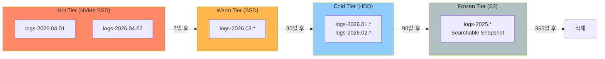
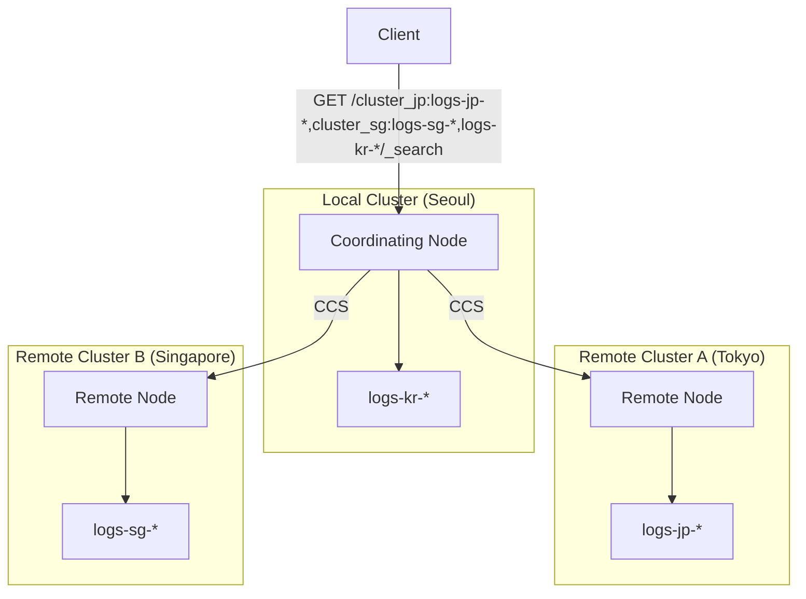
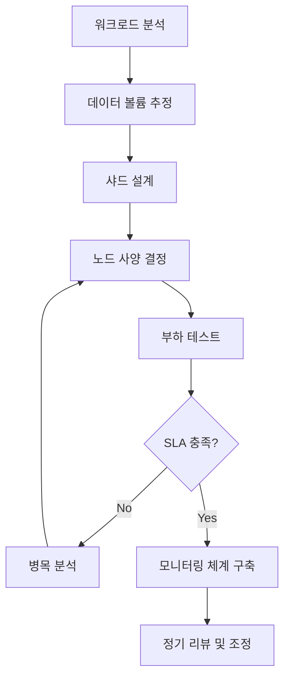
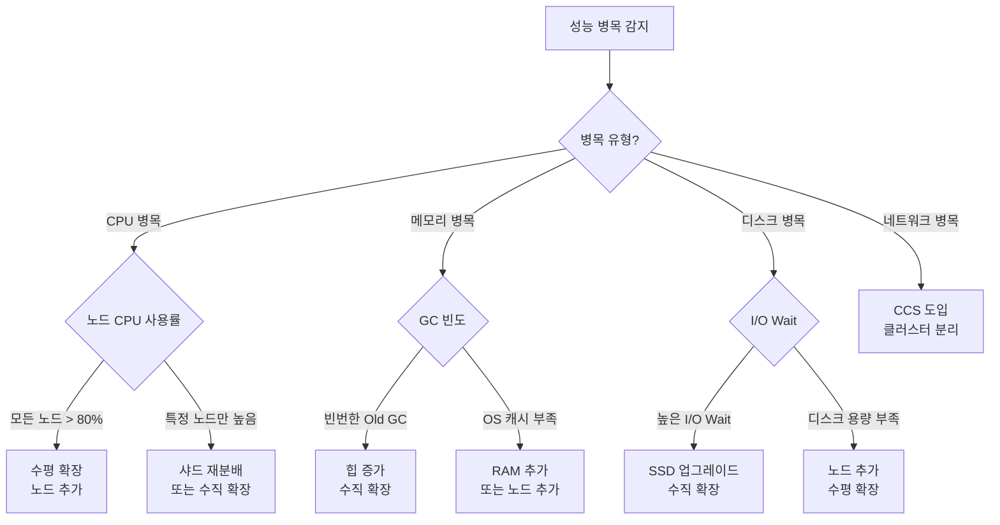
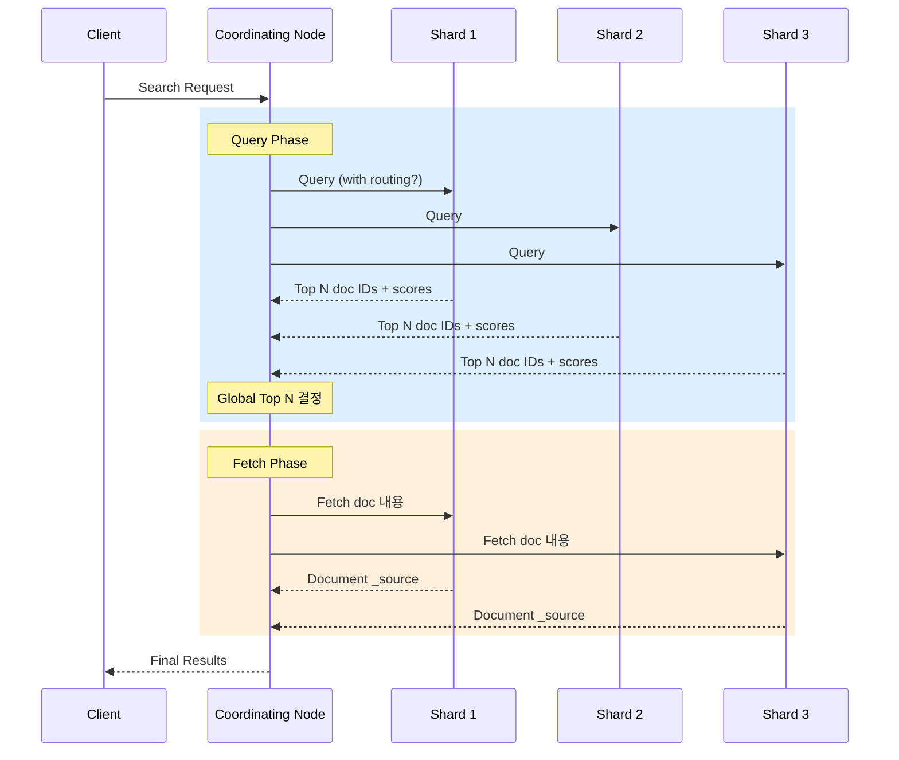

# 클러스터 스케일링 전략

Elasticsearch 클러스터의 확장은 단순히 노드를 추가하는 것이 아니라, 데이터 라이프사이클과 워크로드 특성에 맞춘 아키텍처 설계가 필요하다. 이 문서에서는 Hot-Warm-Cold 아키텍처부터 Cross-Cluster Search, 용량 계획까지 실무 스케일링 전략을 다룬다.

## 목차
- [1. 핵심 개념 (What)](#1-핵심-개념-what)
- [2. 왜 알아야 하는가 (Why)](#2-왜-알아야-하는가-why)
- [3. 내부 구현 분석 (How)](#3-내부-구현-분석-how)
- [4. 실전 예제](#4-실전-예제)
- [5. 정리](#5-정리)

---

## 1. 핵심 개념 (What)

### 스케일링의 두 축

```
Elasticsearch 스케일링 전략
├── 수평 확장 (Scale Out)
│   ├── 노드 추가로 샤드 분산
│   ├── Hot-Warm-Cold 티어 아키텍처
│   └── Cross-Cluster Search
├── 수직 확장 (Scale Up)
│   ├── CPU/RAM/Disk 업그레이드
│   └── NVMe SSD → 검색 성능 직결
└── 데이터 라이프사이클 관리
    ├── ILM (Index Lifecycle Management)
    ├── 롤오버 (Rollover)
    └── 스냅샷/삭제 정책
```

### 핵심 용어

| 용어 | 설명 |
|------|------|
| **Shard** | 인덱스의 물리적 파티션. Lucene 인스턴스 1개 |
| **Primary Shard** | 원본 데이터를 보유한 샤드 |
| **Replica Shard** | Primary의 복제본. 읽기 분산 + 장애 복구 |
| **Hot Node** | 최신 데이터, 고성능 하드웨어 (NVMe SSD) |
| **Warm Node** | 중간 데이터, 중성능 하드웨어 (SSD) |
| **Cold/Frozen Node** | 오래된 데이터, 저비용 하드웨어 (HDD/S3) |
| **ILM** | Index Lifecycle Management. 인덱스의 생성-이동-삭제 자동화 |
| **CCS** | Cross-Cluster Search. 여러 클러스터를 단일 검색으로 조회 |

---

## 2. 왜 알아야 하는가 (Why)

### 스케일링 실패의 비용

1. **과소 프로비저닝**: 검색 지연 증가 → 서비스 SLA 위반 → 사용자 이탈
2. **과대 프로비저닝**: 월 수천만 원의 불필요한 인프라 비용
3. **샤드 과다 생성**: 하루 1개 인덱스 × 5 Primary × 1 Replica = 10 샤드/일 → 1년 3,650 샤드. 마스터 노드 과부하
4. **단일 클러스터 한계**: 리전 장애 시 전체 서비스 중단

### 실제 사례: 로그 클러스터의 성장

```
Phase 1 (초기): 일 10GB, 3노드
→ 기본 설정으로 충분

Phase 2 (6개월): 일 100GB, 3노드
→ 디스크 부족. 노드 추가로 해결

Phase 3 (1년): 일 500GB, 6노드
→ Hot-Warm 분리 필요. 비용 최적화 필수

Phase 4 (2년): 일 2TB, 멀티 클러스터
→ CCS + ILM + Frozen 티어 도입
```

---

## 3. 내부 구현 분석 (How)

### 3.1 Hot-Warm-Cold 아키텍처



**노드 역할 설정** (elasticsearch.yml):

```yaml
# Hot 노드
node.roles: [data_hot, data_content, ingest]
node.attr.data: hot

# Warm 노드
node.roles: [data_warm]
node.attr.data: warm

# Cold 노드
node.roles: [data_cold]
node.attr.data: cold

# Frozen 노드
node.roles: [data_frozen]
node.attr.data: frozen

# Master 전용 노드 (데이터 저장하지 않음)
node.roles: [master]
```

**하드웨어 권장 사양**:

| 티어 | CPU | RAM | 디스크 | 데이터 비율 |
|------|-----|-----|--------|-----------|
| Hot | 높음 (16+ cores) | 64GB | NVMe SSD | 디스크:RAM = 10:1 |
| Warm | 중간 (8 cores) | 32GB | SSD | 디스크:RAM = 20:1 |
| Cold | 낮음 (4 cores) | 16GB | HDD | 디스크:RAM = 30:1 |
| Frozen | 최소 (2 cores) | 8GB | S3/Shared FS | 제한 없음 |

### 3.2 샤드 사이징 전략

#### 20-40GB 규칙

단일 샤드의 권장 크기는 **20-40GB**이다. 이 범위를 벗어나면 다음 문제가 발생한다:

```
샤드 크기에 따른 문제
────────────────────────────────────────────────────
크기      < 1GB         1-20GB        20-40GB       > 50GB
상태    [과소 샤딩]    [약간 작음]    [최적 구간]    [과대 샤딩]
문제    오버헤드 증가   -              -            복구 시간 길다
        마스터 부하↑                               merge 비용 높음
        메모리 낭비                                재분배 어려움
────────────────────────────────────────────────────
```

#### 샤드 수 계산 공식

```
필요 Primary 샤드 수 = 예상 인덱스 크기 / 목표 샤드 크기

예시:
- 일별 로그 인덱스 = 200GB
- 목표 샤드 크기 = 40GB
- Primary 샤드 수 = 200GB / 40GB = 5
```

**주의 사항**:
- 클러스터 전체 샤드 수 < 노드당 1,000개 (ES 기본 제한)
- 힙 1GB당 약 20개 샤드가 안정적
- 일별 인덱스보다 Rollover 기반 인덱스 관리가 샤드 수 제어에 유리

#### 노드당 적정 샤드 계산

```python
def calculate_shards(
    daily_data_gb: float,
    retention_days: int,
    target_shard_size_gb: float = 30,
    replicas: int = 1,
    data_nodes: int = 3
) -> dict:
    """클러스터 샤드 계획 계산기"""
    
    total_data_gb = daily_data_gb * retention_days
    total_primary_shards = int(total_data_gb / target_shard_size_gb) + 1
    total_shards = total_primary_shards * (1 + replicas)
    shards_per_node = total_shards / data_nodes
    
    # 노드당 힙 32GB 기준 권장 한도
    recommended_max = 600  # 32GB heap * 20 shards/GB
    
    return {
        "total_data_gb": total_data_gb,
        "total_primary_shards": total_primary_shards,
        "total_shards_with_replicas": total_shards,
        "shards_per_node": round(shards_per_node, 1),
        "within_limit": shards_per_node < recommended_max,
        "recommended_data_nodes": (
            max(data_nodes, int(total_shards / recommended_max) + 1)
        )
    }

# 사용 예시
result = calculate_shards(
    daily_data_gb=200,
    retention_days=30,
    target_shard_size_gb=30,
    replicas=1,
    data_nodes=6
)
# → total_data: 6000GB, primary_shards: 201, total: 402, per_node: 67
```

### 3.3 Cross-Cluster Search (CCS)

여러 독립 클러스터를 하나의 검색 엔드포인트로 통합한다.



**CCS 설정**:

```json
// 로컬 클러스터에서 원격 클러스터 등록
PUT /_cluster/settings
{
  "persistent": {
    "cluster.remote": {
      "cluster_jp": {
        "seeds": ["jp-node1:9300", "jp-node2:9300"],
        "transport.compress": true,
        "skip_unavailable": true
      },
      "cluster_sg": {
        "seeds": ["sg-node1:9300", "sg-node2:9300"],
        "transport.compress": true,
        "skip_unavailable": true
      }
    }
  }
}
```

```json
// Cross-Cluster Search 실행
GET /cluster_jp:logs-jp-*,cluster_sg:logs-sg-*,logs-kr-*/_search
{
  "query": {
    "bool": {
      "filter": [
        { "range": { "@timestamp": { "gte": "now-1h" } } },
        { "term": { "level": "ERROR" } }
      ]
    }
  },
  "sort": [{ "@timestamp": "desc" }],
  "size": 100
}
```

**CCS 설계 고려사항**:

| 항목 | 설명 |
|------|------|
| `skip_unavailable: true` | 원격 클러스터 장애 시 해당 클러스터만 건너뜀 |
| `transport.compress: true` | 클러스터 간 네트워크 비용 절감 |
| 네트워크 지연 | 리전 간 RTT가 검색 지연에 직접 추가됨 |
| 버전 호환 | 로컬/원격 클러스터의 주 버전이 동일해야 함 |
| CCS Minimize Roundtrips | `ccs_minimize_roundtrips=true`로 네트워크 왕복 최소화 |

### 3.4 용량 계획 (Capacity Planning) 방법론



#### Step 1: 워크로드 프로파일링

```
분석 항목:
├── 인덱싱 워크로드
│   ├── 일일 데이터 양 (GB/일)
│   ├── 피크 인덱싱 레이트 (docs/sec)
│   ├── 문서 평균 크기 (KB)
│   └── 인덱싱 패턴 (연속 vs 배치)
├── 검색 워크로드
│   ├── 일일 검색 요청 수 (QPS)
│   ├── 검색 유형 (단순 조회 vs 집계)
│   ├── 목표 응답 시간 (P50, P99)
│   └── 피크 시간대 QPS
└── 보존 정책
    ├── 데이터 보존 기간
    └── 핫/웜/콜드 비율
```

#### Step 2: 리소스 추정 공식

```python
def capacity_plan(
    daily_ingest_gb: float,
    retention_days: int,
    peak_qps: int,
    avg_doc_size_kb: float,
    target_p99_ms: int = 500
) -> dict:
    """용량 계획 계산"""
    
    # 1. 스토리지 계산
    raw_storage_gb = daily_ingest_gb * retention_days
    # 인덱싱 오버헤드 10% + 레플리카 1개
    total_storage_gb = raw_storage_gb * 1.1 * 2
    # 디스크 사용률 85% 이하 유지
    provisioned_storage_gb = total_storage_gb / 0.85
    
    # 2. 메모리 계산
    # Hot 데이터의 10%는 OS 캐시에 있어야 함
    hot_data_gb = daily_ingest_gb * 7 * 2  # 7일 핫 데이터, 레플리카 포함
    required_cache_gb = hot_data_gb * 0.1
    # 힙은 노드당 31GB 이하
    heap_per_node_gb = 31
    # 총 RAM = 힙 + 캐시
    ram_per_node_gb = heap_per_node_gb * 2  # 50% 규칙
    
    # 3. 노드 수 계산
    nodes_for_storage = int(provisioned_storage_gb / 2000) + 1  # 노드당 2TB
    nodes_for_cache = int(required_cache_gb / (ram_per_node_gb - heap_per_node_gb)) + 1
    nodes_for_qps = int(peak_qps / 500) + 1  # 보수적으로 노드당 500 QPS
    
    data_nodes = max(nodes_for_storage, nodes_for_cache, nodes_for_qps, 3)
    
    # 4. 마스터 노드
    master_nodes = 3  # 항상 3개 (quorum)
    
    return {
        "storage": {
            "raw_gb": round(raw_storage_gb),
            "total_gb": round(total_storage_gb),
            "provisioned_gb": round(provisioned_storage_gb)
        },
        "nodes": {
            "data_nodes": data_nodes,
            "master_nodes": master_nodes,
            "total": data_nodes + master_nodes,
            "ram_per_node_gb": ram_per_node_gb,
            "reason": f"storage={nodes_for_storage}, cache={nodes_for_cache}, qps={nodes_for_qps}"
        }
    }
```

### 3.5 수평/수직 확장 판단 기준



| 상황 | 수직 확장 | 수평 확장 |
|------|----------|----------|
| CPU 일부 포화 | O (코어 추가) | |
| CPU 전체 포화 | | O (노드 추가) |
| 힙 부족 (<31GB) | O (메모리 추가) | |
| 힙 이미 31GB | | O (노드 추가) |
| I/O 병목 | O (NVMe SSD) | |
| 디스크 용량 부족 | | O (노드 추가) |
| 샤드 수 과다 | | O (노드 추가) |
| 지역 분산 필요 | | O (CCS) |

---

## 4. 실전 예제

### 예제 1: ILM 정책으로 Hot-Warm-Cold 자동화

```json
// Step 1: ILM 정책 생성
PUT /_ilm/policy/logs_policy
{
  "policy": {
    "phases": {
      "hot": {
        "min_age": "0ms",
        "actions": {
          "rollover": {
            "max_primary_shard_size": "30gb",
            "max_age": "1d"
          },
          "set_priority": {
            "priority": 100
          }
        }
      },
      "warm": {
        "min_age": "7d",
        "actions": {
          "shrink": {
            "number_of_shards": 1
          },
          "forcemerge": {
            "max_num_segments": 1
          },
          "allocate": {
            "number_of_replicas": 1
          },
          "set_priority": {
            "priority": 50
          }
        }
      },
      "cold": {
        "min_age": "30d",
        "actions": {
          "allocate": {
            "number_of_replicas": 0
          },
          "set_priority": {
            "priority": 0
          }
        }
      },
      "frozen": {
        "min_age": "90d",
        "actions": {
          "searchable_snapshot": {
            "snapshot_repository": "my_s3_repo"
          }
        }
      },
      "delete": {
        "min_age": "365d",
        "actions": {
          "delete": {}
        }
      }
    }
  }
}

// Step 2: 인덱스 템플릿에 ILM 정책 연결
PUT /_index_template/logs_template
{
  "index_patterns": ["logs-*"],
  "template": {
    "settings": {
      "number_of_shards": 3,
      "number_of_replicas": 1,
      "index.lifecycle.name": "logs_policy",
      "index.lifecycle.rollover_alias": "logs",
      "index.routing.allocation.include._tier_preference": "data_hot"
    },
    "mappings": {
      "dynamic": "strict",
      "properties": {
        "@timestamp": { "type": "date" },
        "message": { "type": "text" },
        "level": { "type": "keyword" },
        "service": { "type": "keyword" }
      }
    }
  }
}

// Step 3: 초기 인덱스 + Alias 생성
PUT /logs-000001
{
  "aliases": {
    "logs": {
      "is_write_index": true
    }
  }
}
```

### 예제 2: 클러스터 건강 상태 모니터링 스크립트

```bash
#!/bin/bash
# cluster_health_check.sh

ES_URL="http://localhost:9200"

echo "=== Cluster Health ==="
curl -s "$ES_URL/_cluster/health?pretty" | jq '{
  status,
  number_of_nodes,
  active_primary_shards,
  active_shards,
  relocating_shards,
  unassigned_shards
}'

echo -e "\n=== Disk Usage by Node ==="
curl -s "$ES_URL/_cat/allocation?v&h=node,disk.used,disk.avail,disk.percent,shards"

echo -e "\n=== Largest Indices ==="
curl -s "$ES_URL/_cat/indices?v&h=index,health,pri,rep,docs.count,store.size&s=store.size:desc" | head -20

echo -e "\n=== Shard Distribution ==="
curl -s "$ES_URL/_cat/shards?v&h=index,shard,prirep,state,node&s=index" | head -30

echo -e "\n=== ILM Status ==="
curl -s "$ES_URL/_ilm/status?pretty"

echo -e "\n=== Pending Tasks ==="
curl -s "$ES_URL/_cluster/pending_tasks?pretty"
```

---

## 5. 정리

| 항목 | 핵심 내용 |
|------|----------|
| **Hot-Warm-Cold** | 데이터 수명에 따라 비용 효율적 티어 분리 |
| **샤드 크기** | Primary 샤드당 20-40GB 유지 |
| **샤드 수 제한** | 힙 1GB당 약 20개, 노드당 1,000개 미만 |
| **ILM** | Rollover + 티어 이동 + 삭제 자동화 |
| **CCS** | 멀티 클러스터를 단일 검색으로 통합 |
| **마스터 노드** | 항상 3개, 데이터 저장하지 않음 |
| **용량 계획** | 스토리지 + 메모리 + QPS 세 축으로 노드 수 결정 |
| **수평 vs 수직** | 힙 31GB 한계, 전체 CPU 포화 → 수평 확장 |

### 스케일링 의사결정 치트시트

```
데이터 증가 → 노드 추가 (수평)
검색 지연 → 레플리카 추가 → 캐시 튜닝 → 노드 추가
인덱싱 지연 → 샤드 수 조정 → 노드 추가
비용 최적화 → Hot-Warm-Cold + ILM
멀티 리전 → CCS 도입
디스크 IOPS → SSD 업그레이드 (수직)
```

---

## 보충: 쿼리 최적화

Query Context와 Filter Context의 차이, Bool Query 패턴, Routing 최적화, Profile API 활용, Slow Log 분석, 캐싱 전략을 통해 검색 성능을 극대화하는 방법을 정리한다.

### Query Context vs Filter Context

| 구분 | Query Context | Filter Context |
|------|---------------|----------------|
| 목적 | "이 문서가 쿼리와 얼마나 관련되는가?" | "이 문서가 조건에 맞는가?" |
| 점수 계산 | O (_score 계산) | X (0.0 고정) |
| 캐싱 | X | O (자동 캐싱) |
| 사용 위치 | `must`, `should` | `filter`, `must_not` |
| 성능 | 상대적으로 느림 | 빠름 (비트셋 캐싱) |

### Bool Query 구조

| 절 | 동작 | Context |
|----|------|---------|
| `must` | 모두 만족해야 함, 점수에 기여 | Query |
| `filter` | 모두 만족해야 함, 점수 무관 | Filter |
| `should` | 하나 이상 만족 시 점수 보너스 | Query |
| `must_not` | 만족하면 제외 | Filter |

### 캐싱 메커니즘

- **Node Query Cache**: Filter context 쿼리 결과를 비트셋으로 캐싱 (노드 레벨)
- **Shard Request Cache**: 전체 검색 결과를 캐싱 (size=0인 집계 요청 등)
- **Fielddata Cache**: text 필드의 집계/정렬 시 사용 (비권장, doc_values 사용)

### 검색 실행 흐름



### Filter 캐싱 동작 원리

```
1. 첫 번째 Filter 실행:
   Segment A: [1, 0, 1, 1, 0, 0, 1, 0]  (비트셋 생성)
   Segment B: [0, 1, 0, 0, 1, 1, 0, 1]

2. 캐시 저장 조건:
   - 세그먼트 크기 > 10,000 문서
   - 동일 필터가 일정 횟수 이상 실행
   - LRU 정책으로 관리

3. 이후 동일 Filter:
   캐시에서 비트셋 즉시 반환 → 디스크 I/O 없음
```

### Routing 최적화

```json
// 인덱스 생성 시 routing 설정
PUT tenant-data
{
  "settings": {
    "number_of_shards": 5
  },
  "mappings": {
    "_routing": { "required": true },
    "properties": {
      "tenant_id": { "type": "keyword" },
      "data": { "type": "text" }
    }
  }
}

// 검색 시 routing으로 대상 샤드 제한
GET tenant-data/_search?routing=tenant-abc
{
  "query": {
    "bool": {
      "filter": [
        { "term": { "tenant_id": "tenant-abc" } }
      ],
      "must": [
        { "match": { "data": "important" } }
      ]
    }
  }
}
```

### Slow Log 설정 및 분석

```json
PUT logs-*/_settings
{
  "index.search.slowlog.threshold.query.warn": "5s",
  "index.search.slowlog.threshold.query.info": "2s",
  "index.search.slowlog.threshold.query.debug": "1s",
  "index.search.slowlog.threshold.query.trace": "500ms",
  "index.search.slowlog.threshold.fetch.warn": "1s",
  "index.search.slowlog.threshold.fetch.info": "500ms",
  "index.indexing.slowlog.threshold.index.warn": "10s",
  "index.indexing.slowlog.threshold.index.info": "5s",
  "index.search.slowlog.level": "info"
}
```

### 검색 성능 패턴 모음

```json
// 1. 대량 결과 페이지네이션: search_after (deep pagination 회피)
GET logs-*/_search
{
  "size": 100,
  "query": {
    "bool": {
      "filter": [
        { "range": { "@timestamp": { "gte": "now-7d" } } }
      ]
    }
  },
  "sort": [
    { "@timestamp": "desc" },
    { "_id": "asc" }
  ],
  "search_after": ["2026-03-06T23:59:59.999Z", "doc-id-12345"]
}

// 2. 카운트만 필요한 경우: size=0 + track_total_hits
GET logs-*/_search
{
  "size": 0,
  "track_total_hits": true,
  "query": {
    "bool": {
      "filter": [
        { "term": { "service": "auth-api" } },
        { "term": { "level": "ERROR" } },
        { "range": { "@timestamp": { "gte": "now-1h" } } }
      ]
    }
  }
}

// 3. 존재 여부만 확인: terminate_after
GET logs-*/_search
{
  "size": 1,
  "terminate_after": 1,
  "query": {
    "bool": {
      "filter": [
        { "term": { "error_code": "CRITICAL_FAILURE" } }
      ]
    }
  }
}

// 4. Wildcard 대신 Prefix 사용
// BAD
{ "wildcard": { "path": "*api/v2*" } }
// GOOD
{ "prefix": { "path": "/api/v2" } }

// 5. index_prefixes로 Prefix 쿼리 가속
PUT optimized-index
{
  "mappings": {
    "properties": {
      "url_path": {
        "type": "text",
        "index_prefixes": {
          "min_chars": 2,
          "max_chars": 10
        }
      }
    }
  }
}
```

### 캐싱 전략 상세

```json
// Shard Request Cache 활성화
GET logs-*/_search?request_cache=true
{
  "size": 0,
  "aggs": {
    "error_count_by_service": {
      "terms": { "field": "service", "size": 20 }
    }
  }
}

// 캐시 활용 극대화 팁
// 1. 날짜 범위를 "now-1h" 대신 라운드 처리
//    "gte": "now-1h/h"  → 시간 단위로 라운드 → 캐시 히트율 증가
// 2. size=0 집계는 자동으로 Shard Request Cache 대상
// 3. 자주 사용하는 필터 조합을 표준화
```

### Multi-Search API 활용

```json
// 여러 쿼리를 한 번의 HTTP 요청으로 실행
GET _msearch
{"index": "logs-*"}
{"size": 0, "query": {"bool": {"filter": [{"term": {"level": "ERROR"}}]}}, "aggs": {"by_service": {"terms": {"field": "service"}}}}
{"index": "logs-*"}
{"size": 0, "query": {"bool": {"filter": [{"range": {"@timestamp": {"gte": "now-1h"}}}]}}, "aggs": {"status_dist": {"terms": {"field": "status_code"}}}}
{"index": "metrics-*"}
{"size": 0, "aggs": {"avg_response": {"avg": {"field": "response_time_ms"}}}}
```

### 쿼리 최적화 정리

| 항목 | 권장 사항 |
|------|-----------|
| Query vs Filter | 점수 불필요한 조건은 반드시 `filter`로 이동 |
| Bool Query | `must`는 스코어링 필요 시에만, 나머지는 `filter`/`must_not` |
| Routing | 멀티테넌시, 파티셔닝된 데이터에 routing 적용 |
| 페이지네이션 | `from`+`size` 대신 `search_after` 사용 (10,000건 이상) |
| _source | 필요한 필드만 지정하여 네트워크/파싱 비용 절감 |
| 캐싱 | 날짜 범위 라운딩(`now-1h/h`), 표준화된 필터 조합 |
| Wildcard | 가능한 `prefix` 또는 `index_prefixes`로 대체 |
| Slow Log | 임계값 설정하여 느린 쿼리 자동 로깅 |
| 집계 전용 | `size: 0`으로 Request Cache 활용 극대화 |

---
*참고: Elasticsearch 8.x 기준*
