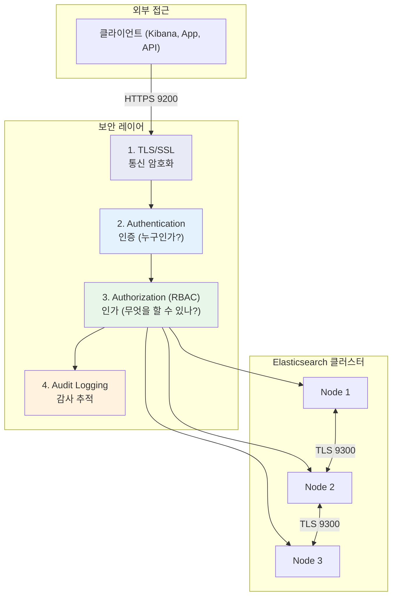
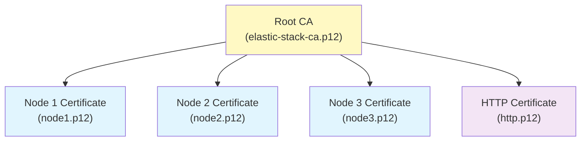
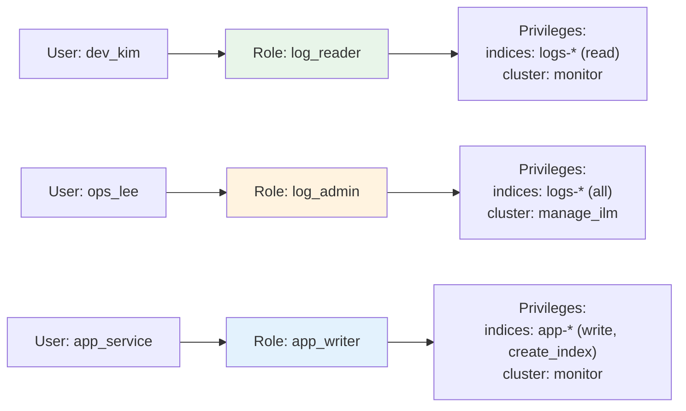
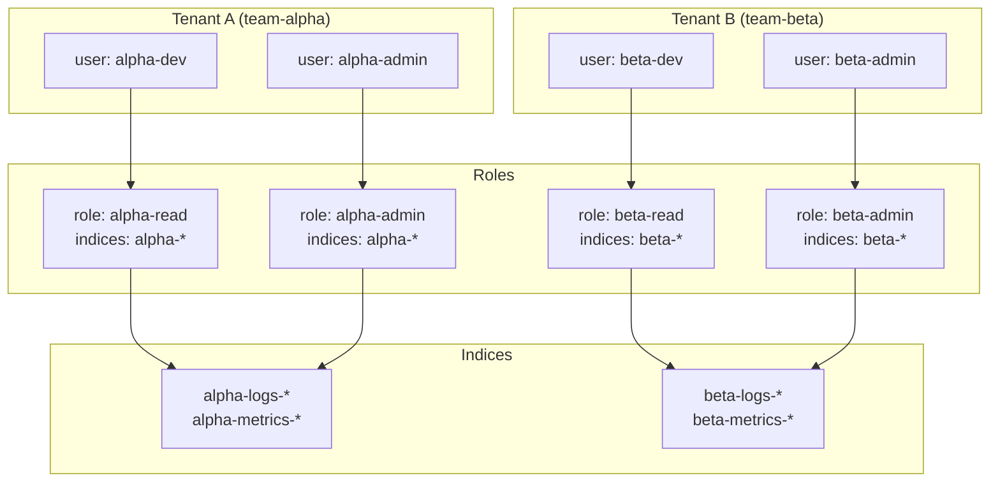
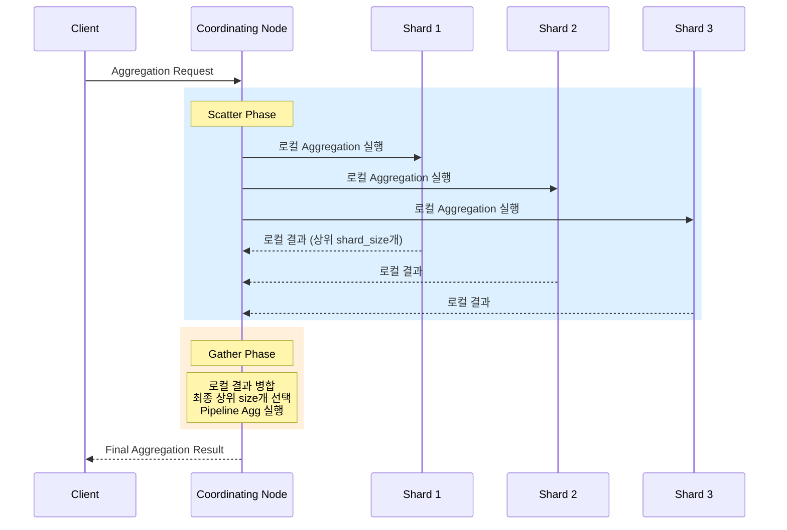

# 보안 설정

Elasticsearch 클러스터의 보안은 통신 암호화(TLS/SSL), 접근 제어(RBAC), 인증(Authentication), 감사 로깅(Audit Logging)의 네 축으로 구성된다. 8.x부터는 보안 기능이 기본 활성화되어 있으며, 이 문서에서는 프로덕션 수준의 보안 구성을 다룬다.

## 목차
- [1. 핵심 개념 (What)](#1-핵심-개념-what)
- [2. 왜 알아야 하는가 (Why)](#2-왜-알아야-하는가-why)
- [3. 내부 구현 분석 (How)](#3-내부-구현-분석-how)
- [4. 실전 예제](#4-실전-예제)
- [5. 정리](#5-정리)

---

## 1. 핵심 개념 (What)

### Elasticsearch 보안 아키텍처



### 보안 구성 요소 요약

| 구성 요소 | 목적 | ES 8.x 기본 상태 |
|-----------|------|-----------------|
| TLS (Transport) | 노드 간 통신 암호화 | 자동 구성 |
| TLS (HTTP) | 클라이언트-노드 통신 암호화 | 자동 구성 |
| Native Realm | 내장 사용자 인증 | 활성화 (elastic 계정) |
| RBAC | 역할 기반 접근 제어 | 활성화 |
| API Key | 프로그래밍 방식 인증 | 활성화 |
| Audit Logging | 보안 이벤트 기록 | 비활성화 (수동 설정 필요) |
| LDAP/SAML/OIDC | 외부 인증 시스템 연동 | 설정 필요 (Platinum+) |

---

## 2. 왜 알아야 하는가 (Why)

### 보안 미설정의 위험

1. **데이터 유출**: 암호화되지 않은 HTTP 통신으로 민감 데이터 노출
2. **무단 접근**: 인증 없이 누구나 클러스터에 접근하여 데이터 삭제/변경 가능
3. **권한 남용**: 개발자가 프로덕션 인덱스를 실수로 삭제
4. **규정 위반**: GDPR, ISMS, SOC2 등 컴플라이언스 요구사항 미충족
5. **추적 불가**: 감사 로그 없이 보안 사고 원인 분석 불가

### ES 8.x의 변화

Elasticsearch 8.0부터 보안이 **기본 활성화**되었다:
- 첫 시작 시 자동으로 TLS 인증서 생성
- `elastic` 사용자의 초기 비밀번호 자동 생성
- Kibana enrollment token 자동 발급

이전 버전에서 보안 없이 운영하던 관행은 더 이상 통하지 않는다.

---

## 3. 내부 구현 분석 (How)

### 3.1 TLS/SSL 구성

#### 인증서 체계



#### 인증서 생성 및 배포

```bash
# Step 1: CA 생성
bin/elasticsearch-certutil ca \
  --out config/certs/elastic-stack-ca.p12 \
  --pass ""

# Step 2: 노드 인증서 생성 (instances.yml 기반)
# instances.yml 작성
cat > config/certs/instances.yml << 'YAML'
instances:
  - name: "node1"
    dns:
      - "es-node1.example.com"
      - "localhost"
    ip:
      - "10.0.1.10"
  - name: "node2"
    dns:
      - "es-node2.example.com"
    ip:
      - "10.0.1.11"
  - name: "node3"
    dns:
      - "es-node3.example.com"
    ip:
      - "10.0.1.12"
YAML

bin/elasticsearch-certutil cert \
  --ca config/certs/elastic-stack-ca.p12 \
  --in config/certs/instances.yml \
  --out config/certs/certs.zip \
  --pass ""

# Step 3: HTTP 인증서 생성
bin/elasticsearch-certutil http
# 대화형 프롬프트를 통해 설정
```

#### elasticsearch.yml TLS 설정

```yaml
# Transport Layer TLS (노드 간 통신 — 필수)
xpack.security.transport.ssl:
  enabled: true
  verification_mode: certificate
  keystore.path: certs/node1.p12
  truststore.path: certs/elastic-stack-ca.p12

# HTTP Layer TLS (클라이언트 통신 — 권장)
xpack.security.http.ssl:
  enabled: true
  keystore.path: certs/http.p12
  truststore.path: certs/elastic-stack-ca.p12

# 인증서 비밀번호 (keystore에 저장)
# bin/elasticsearch-keystore add xpack.security.transport.ssl.keystore.secure_password
# bin/elasticsearch-keystore add xpack.security.http.ssl.keystore.secure_password
```

**verification_mode 옵션**:

| 모드 | 설명 | 용도 |
|------|------|------|
| `full` | 인증서 + 호스트네임 검증 | 프로덕션 권장 |
| `certificate` | 인증서만 검증 | 내부 네트워크 |
| `none` | 검증 없음 | 테스트만 (절대 프로덕션 금지) |

### 3.2 RBAC (Role-Based Access Control)

#### 권한 모델



#### 역할 생성

```json
// 읽기 전용 역할: 로그 조회만 가능
PUT /_security/role/log_reader
{
  "cluster": ["monitor"],
  "indices": [
    {
      "names": ["logs-*"],
      "privileges": ["read", "view_index_metadata"],
      "field_security": {
        "grant": ["@timestamp", "level", "message", "service"]
      },
      "query": {
        "term": { "level": "ERROR" }
      }
    }
  ]
}

// 관리자 역할: 로그 인덱스 전체 관리
PUT /_security/role/log_admin
{
  "cluster": ["monitor", "manage_ilm", "manage_index_templates"],
  "indices": [
    {
      "names": ["logs-*"],
      "privileges": ["all"]
    }
  ]
}

// 애플리케이션 역할: 쓰기 전용
PUT /_security/role/app_writer
{
  "cluster": ["monitor"],
  "indices": [
    {
      "names": ["app-*"],
      "privileges": ["write", "create_index", "auto_configure"]
    }
  ]
}

// Document-Level Security: 특정 부서 데이터만 접근
PUT /_security/role/hr_reader
{
  "cluster": ["monitor"],
  "indices": [
    {
      "names": ["employees-*"],
      "privileges": ["read"],
      "query": {
        "term": { "department": "HR" }
      },
      "field_security": {
        "grant": ["name", "department", "title"],
        "except": ["salary", "ssn"]
      }
    }
  ]
}
```

**권한 레벨 구조**:

| 레벨 | 권한 예시 | 설명 |
|------|----------|------|
| Cluster | `monitor`, `manage`, `manage_security` | 클러스터 전역 작업 |
| Index | `read`, `write`, `create_index`, `delete_index`, `all` | 인덱스 단위 작업 |
| Document | `query` (DLS) | 문서 레벨 접근 제어 |
| Field | `field_security` (FLS) | 필드 레벨 접근 제어 |

#### 사용자 생성

```json
// 내장 사용자 생성
POST /_security/user/dev_kim
{
  "password": "SecureP@ssw0rd!2026",
  "roles": ["log_reader"],
  "full_name": "Kim Dev",
  "email": "dev.kim@example.com",
  "metadata": {
    "team": "backend",
    "department": "engineering"
  }
}

// 비밀번호 변경
PUT /_security/user/dev_kim/_password
{
  "password": "NewSecureP@ss!2026"
}
```

### 3.3 API Key 관리

서비스 계정 비밀번호 대신 API Key를 사용하면 세밀한 권한 제어와 만료 관리가 가능하다.

```json
// API Key 생성 — 30일 만료, 특정 인덱스 쓰기 전용
POST /_security/api_key
{
  "name": "log-ingest-service",
  "expiration": "30d",
  "role_descriptors": {
    "log_writer": {
      "cluster": ["monitor"],
      "indices": [
        {
          "names": ["logs-*"],
          "privileges": ["write", "create_index"]
        }
      ]
    }
  },
  "metadata": {
    "application": "log-pipeline",
    "environment": "production",
    "owner": "ops-team"
  }
}

// 응답 예시
// {
//   "id": "VuaCfGcBCdbkQm-e5aOx",
//   "name": "log-ingest-service",
//   "api_key": "ui2lp2axTNmsyakw9tvNnw",
//   "encoded": "VnVhQ2ZHY0JDZGJrUW0tZTVhT3g6dWkybHAyYXhUTm1zeWFrdzl0dk5udw=="
// }
```

```bash
# API Key 사용
curl -H "Authorization: ApiKey VnVhQ2ZHY0JDZGJrUW0tZTVhT3g6dWkybHAyYXhUTm1zeWFrdzl0dk5udw==" \
  "https://localhost:9200/logs-2026.04.02/_doc" \
  -H "Content-Type: application/json" \
  -d '{"@timestamp":"2026-04-02T10:00:00Z","message":"test"}'
```

```json
// API Key 조회
GET /_security/api_key?name=log-ingest-*

// API Key 무효화
DELETE /_security/api_key
{
  "name": "log-ingest-service"
}

// 만료된 API Key 정리 (주기적 실행 권장)
DELETE /_security/api_key
{
  "owner": true,
  "name": "log-ingest-*"
}
```

**API Key vs 사용자 계정 비교**:

| 항목 | API Key | 사용자 계정 |
|------|---------|-----------|
| 용도 | 서비스/애플리케이션 | 사람 (관리자, 개발자) |
| 만료 | 설정 가능 | 만료 없음 |
| 권한 범위 | 생성 시 지정 (축소만 가능) | 역할 기반 |
| 관리 | 프로그래밍 방식 | Kibana UI 가능 |
| 회전 | 새 키 생성 + 구 키 폐기 | 비밀번호 변경 |

### 3.4 LDAP/SAML/OIDC 연동

#### LDAP 연동

```yaml
# elasticsearch.yml — LDAP Realm 설정
xpack.security.authc.realms:
  native:
    native1:
      order: 0
  
  ldap:
    ldap1:
      order: 1
      url: "ldaps://ldap.example.com:636"
      bind_dn: "cn=elasticsearch,ou=services,dc=example,dc=com"
      user_search:
        base_dn: "ou=users,dc=example,dc=com"
        filter: "(uid={0})"
      group_search:
        base_dn: "ou=groups,dc=example,dc=com"
      ssl:
        certificate_authorities: ["config/certs/ldap-ca.pem"]
        verification_mode: full
      unmapped_groups_as_roles: false
```

```json
// LDAP 그룹 → ES 역할 매핑
PUT /_security/role_mapping/ldap_admin_mapping
{
  "roles": ["superuser"],
  "enabled": true,
  "rules": {
    "field": {
      "groups": "cn=es-admins,ou=groups,dc=example,dc=com"
    }
  }
}

PUT /_security/role_mapping/ldap_developer_mapping
{
  "roles": ["log_reader"],
  "enabled": true,
  "rules": {
    "all": [
      { "field": { "groups": "cn=developers,ou=groups,dc=example,dc=com" } },
      { "field": { "realm.name": "ldap1" } }
    ]
  }
}
```

#### SAML 연동 (Kibana SSO)

```yaml
# elasticsearch.yml — SAML Realm
xpack.security.authc.realms:
  saml:
    saml1:
      order: 2
      idp.metadata.path: "config/saml/idp-metadata.xml"
      idp.entity_id: "https://idp.example.com/"
      sp.entity_id: "https://kibana.example.com"
      sp.acs: "https://kibana.example.com/api/security/saml/callback"
      sp.logout: "https://kibana.example.com/logout"
      attributes.principal: "nameid"
      attributes.groups: "groups"
```

```yaml
# kibana.yml — SAML 로그인 설정
xpack.security.authc.providers:
  saml.saml1:
    order: 0
    realm: "saml1"
    description: "Log in with SSO"
  basic.basic1:
    order: 1
    description: "Log in with username/password"
```

#### OIDC 연동

```yaml
# elasticsearch.yml — OIDC Realm
xpack.security.authc.realms:
  oidc:
    oidc1:
      order: 3
      rp.client_id: "elasticsearch"
      rp.response_type: "code"
      rp.redirect_uri: "https://kibana.example.com/api/security/oidc/callback"
      op.issuer: "https://auth.example.com/"
      op.authorization_endpoint: "https://auth.example.com/authorize"
      op.token_endpoint: "https://auth.example.com/oauth/token"
      op.jwkset_path: "https://auth.example.com/.well-known/jwks.json"
      op.userinfo_endpoint: "https://auth.example.com/userinfo"
      claims.principal: "sub"
      claims.groups: "groups"
```

### 3.5 감사 로깅 (Audit Logging)

```yaml
# elasticsearch.yml — Audit Logging 활성화
xpack.security.audit.enabled: true

# 로그 출력 대상
xpack.security.audit.logfile.events.include:
  - "access_denied"
  - "access_granted"
  - "anonymous_access_denied"
  - "authentication_failed"
  - "authentication_success"
  - "connection_denied"
  - "tampered_request"
  - "run_as_denied"
  - "run_as_granted"
  - "security_config_change"

# 노이즈 감소: 시스템 사용자 제외
xpack.security.audit.logfile.events.exclude:
  - "system_access_granted"

# 특정 사용자 제외 (모니터링 계정 등)
xpack.security.audit.logfile.events.ignore_filters:
  monitoring:
    users: ["_xpack_security", "beats_system", "logstash_system"]
```

**감사 로그 출력 예시**:

```json
{
  "@timestamp": "2026-04-02T10:30:00.000Z",
  "event.action": "access_denied",
  "user.name": "dev_kim",
  "user.roles": ["log_reader"],
  "origin.address": "10.0.1.50",
  "request.name": "DeleteIndexAction",
  "indices": ["logs-2026.04.01"],
  "action": "indices:admin/delete",
  "request.id": "abc123"
}
```

감사 로그를 Elasticsearch 자체에 인덱싱하여 Kibana에서 시각화할 수 있다:

```json
// Filebeat로 감사 로그 수집 → 별도 인덱스에 저장
// filebeat.yml
filebeat.inputs:
  - type: log
    paths:
      - /var/log/elasticsearch/*_audit.json
    json.keys_under_root: true
    json.add_error_key: true

output.elasticsearch:
  hosts: ["https://localhost:9200"]
  index: "audit-logs-%{+yyyy.MM.dd}"
  username: "audit_writer"
  password: "${AUDIT_WRITER_PASSWORD}"
```

---

## 4. 실전 예제

### 예제 1: 프로덕션 보안 체크리스트 구현

```bash
#!/bin/bash
# security_audit.sh — 클러스터 보안 설정 점검 스크립트

ES_URL="https://localhost:9200"
ES_USER="elastic"
ES_PASS="${ELASTIC_PASSWORD}"

echo "=== 1. TLS 상태 확인 ==="
curl -sk -u "$ES_USER:$ES_PASS" "$ES_URL/_ssl/certificates" | \
  jq '.[] | {path, expiry, has_private_key}'

echo -e "\n=== 2. 인증 Realm 확인 ==="
curl -sk -u "$ES_USER:$ES_PASS" "$ES_URL/_xpack/security" | \
  jq '.realms'

echo -e "\n=== 3. 비밀번호 미변경 기본 계정 확인 ==="
for user in elastic kibana_system logstash_system beats_system; do
  echo -n "  $user: "
  curl -sk -u "$user:changeme" "$ES_URL/_security/_authenticate" \
    -o /dev/null -w "%{http_code}" 2>/dev/null
  echo ""
done

echo -e "\n=== 4. 만료 임박 API Key 확인 (7일 이내) ==="
curl -sk -u "$ES_USER:$ES_PASS" "$ES_URL/_security/api_key" | \
  jq --arg threshold "$(date -d '+7 days' +%s)000" \
  '.api_keys[] | select(.expiration != null and .expiration < ($threshold | tonumber)) | {name, expiration}'

echo -e "\n=== 5. Anonymous 접근 확인 ==="
curl -sk "$ES_URL/_cluster/health" -o /dev/null -w "Anonymous access: HTTP %{http_code}\n"

echo -e "\n=== 6. Audit Logging 상태 ==="
curl -sk -u "$ES_USER:$ES_PASS" "$ES_URL/_cluster/settings?include_defaults=true" | \
  jq '.defaults.xpack.security.audit'
```

### 예제 2: 멀티테넌트 환경의 RBAC 설계



```json
// Tenant A 역할 생성
PUT /_security/role/alpha_read
{
  "cluster": ["monitor"],
  "indices": [
    {
      "names": ["alpha-*"],
      "privileges": ["read", "view_index_metadata"]
    }
  ]
}

PUT /_security/role/alpha_admin
{
  "cluster": ["monitor", "manage_index_templates"],
  "indices": [
    {
      "names": ["alpha-*"],
      "privileges": ["all"]
    }
  ]
}

// Tenant B 역할 생성 (동일 패턴)
PUT /_security/role/beta_read
{
  "cluster": ["monitor"],
  "indices": [
    {
      "names": ["beta-*"],
      "privileges": ["read", "view_index_metadata"]
    }
  ]
}

PUT /_security/role/beta_admin
{
  "cluster": ["monitor", "manage_index_templates"],
  "indices": [
    {
      "names": ["beta-*"],
      "privileges": ["all"]
    }
  ]
}

// Kibana Space와 연동하여 UI 격리
PUT /_security/role/alpha_kibana
{
  "cluster": [],
  "indices": [
    {
      "names": ["alpha-*"],
      "privileges": ["read", "view_index_metadata"]
    }
  ],
  "applications": [
    {
      "application": "kibana-.kibana",
      "privileges": ["feature_discover.all", "feature_dashboard.all"],
      "resources": ["space:alpha"]
    }
  ]
}
```

---

## 5. 정리

| 항목 | 핵심 내용 |
|------|----------|
| **TLS Transport** | 노드 간 통신 암호화 — 필수 (8.x 기본 활성화) |
| **TLS HTTP** | 클라이언트 통신 암호화 — 프로덕션 필수 |
| **verification_mode** | 프로덕션은 `full` 권장, 최소 `certificate` |
| **RBAC** | 역할 기반 접근 제어 — index/document/field 레벨 |
| **API Key** | 서비스 인증용, 만료 설정 및 주기적 회전 필수 |
| **DLS/FLS** | Document/Field Level Security로 세밀한 접근 제어 |
| **LDAP/SAML/OIDC** | 엔터프라이즈 SSO 연동 (Platinum 라이선스 이상) |
| **Audit Logging** | 보안 이벤트 기록 — 컴플라이언스 필수 |
| **기본 계정** | `elastic` 등 기본 비밀번호 즉시 변경 |

### 보안 설정 체크리스트

```
[ ] TLS 활성화 (Transport + HTTP)
[ ] 인증서 만료일 모니터링 설정
[ ] 기본 계정 비밀번호 변경 (elastic, kibana_system 등)
[ ] 최소 권한 원칙으로 역할 설계
[ ] 서비스 계정은 API Key 사용 (비밀번호 대신)
[ ] API Key 만료 정책 수립 (30-90일)
[ ] 불필요한 사용자/역할 정기 검토
[ ] Audit Logging 활성화
[ ] 감사 로그 별도 인덱스에 저장
[ ] anonymous 접근 비활성화 확인
[ ] LDAP/SAML 연동 시 역할 매핑 검증
[ ] 인증서 자동 갱신 파이프라인 구축
```

---

## 보충: Aggregation 분석

Bucket, Metric, Pipeline Aggregation의 핵심 패턴과 Composite Aggregation을 활용한 대용량 페이지네이션, 실시간 분석 대시보드 구축, 성능 최적화 전략을 정리한다.

### Aggregation 유형

| 유형 | 설명 | 대표 예시 |
|------|------|-----------|
| **Bucket** | 문서를 그룹으로 분류 | `terms`, `date_histogram`, `range`, `filters`, `composite` |
| **Metric** | 수치 계산 | `avg`, `sum`, `min`, `max`, `cardinality`, `percentiles`, `stats` |
| **Pipeline** | 다른 Aggregation 결과를 입력으로 받아 2차 계산 | `derivative`, `moving_avg`, `cumulative_sum`, `bucket_sort` |

### Aggregation 중첩 구조

```
Terms Agg (서비스별)
├── Date Histogram Agg (시간대별)
│   ├── Avg Agg (평균 응답시간)
│   └── Percentiles Agg (P95, P99)
└── Cardinality Agg (고유 사용자 수)
```

### 핵심 개념

- **doc_values**: 집계/정렬에 사용되는 컬럼 기반 자료구조, `keyword`와 숫자 타입에 기본 활성화
- **Bucket 크기 제한**: `terms` agg의 `size` 파라미터로 반환할 버킷 수 제한
- **Precision vs Performance**: `cardinality`는 HyperLogLog++ 알고리즘 기반 근사값
- **shard_size**: 각 샤드에서 수집하는 버킷 수, 정확도와 성능의 트레이드오프

### 분산 Aggregation 실행 흐름



### Terms Aggregation 정확도 문제

```
예시: size=3, shard_size=5, 3개 샤드

Shard 1:  A(100), B(90), C(80), D(70), E(60)
Shard 2:  B(95), C(85), A(75), E(65), F(55)
Shard 3:  C(110), A(50), D(80), B(40), G(30)

Coordinating Node 병합:
  C: 80+85+110 = 275
  A: 100+75+50 = 225
  B: 90+95+40  = 225

→ shard_size가 작으면 일부 샤드에서 누락되어 부정확할 수 있음
→ 기본값: shard_size = size * 1.5 + 10
```

### Bucket Aggregation: 다차원 분석

```json
// 서비스별 → 시간대별 → 상태 코드별 분석
GET api-logs-*/_search
{
  "size": 0,
  "aggs": {
    "by_service": {
      "terms": {
        "field": "service",
        "size": 20,
        "order": { "error_rate": "desc" }
      },
      "aggs": {
        "by_hour": {
          "date_histogram": {
            "field": "@timestamp",
            "fixed_interval": "1h"
          },
          "aggs": {
            "avg_response": {
              "avg": { "field": "response_time_ms" }
            },
            "error_count": {
              "filter": {
                "range": { "status_code": { "gte": 500 } }
              }
            }
          }
        },
        "total_requests": {
          "value_count": { "field": "_id" }
        },
        "error_requests": {
          "filter": {
            "range": { "status_code": { "gte": 500 } }
          }
        },
        "error_rate": {
          "bucket_script": {
            "buckets_path": {
              "errors": "error_requests._count",
              "total": "total_requests"
            },
            "script": "params.errors / params.total * 100"
          }
        }
      }
    }
  }
}
```

### Composite Aggregation: 전체 버킷 순회

```json
// 첫 번째 페이지
GET api-logs-*/_search
{
  "size": 0,
  "aggs": {
    "all_combinations": {
      "composite": {
        "size": 1000,
        "sources": [
          { "service": { "terms": { "field": "service" } } },
          { "status": { "terms": { "field": "status_code" } } },
          { "date": { "date_histogram": { "field": "@timestamp", "calendar_interval": "1d" } } }
        ]
      },
      "aggs": {
        "avg_response": {
          "avg": { "field": "response_time_ms" }
        }
      }
    }
  }
}

// 다음 페이지: after_key 사용
// "after": { "service": "payment-api", "status": 500, "date": 1741305600000 }
```

### Pipeline Aggregation: 시계열 분석

```json
GET api-logs-*/_search
{
  "size": 0,
  "aggs": {
    "daily": {
      "date_histogram": {
        "field": "@timestamp",
        "calendar_interval": "1d"
      },
      "aggs": {
        "total_errors": {
          "filter": {
            "range": { "status_code": { "gte": 500 } }
          }
        },
        "avg_latency": {
          "avg": { "field": "response_time_ms" }
        }
      }
    },
    "latency_moving_avg": {
      "moving_fn": {
        "buckets_path": "daily>avg_latency",
        "window": 7,
        "script": "MovingFunctions.unweightedAvg(values)"
      }
    },
    "error_derivative": {
      "derivative": {
        "buckets_path": "daily>total_errors._count"
      }
    },
    "cumulative_errors": {
      "cumulative_sum": {
        "buckets_path": "daily>total_errors._count"
      }
    }
  }
}
```

### Aggregation 성능 최적화

```json
// 1. execution_hint로 메모리 최적화
{
  "aggs": {
    "by_service": {
      "terms": {
        "field": "service",
        "size": 10,
        "execution_hint": "map"
      }
    }
  }
}
// "map": 작은 세그먼트에 유리, "global_ordinals" (기본): 대규모 데이터에 유리

// 2. eager_global_ordinals로 사전 빌드
PUT api-logs-template
{
  "mappings": {
    "properties": {
      "service": {
        "type": "keyword",
        "eager_global_ordinals": true
      }
    }
  }
}

// 3. 집계 전용 쿼리 최적화
{
  "size": 0,
  "track_total_hits": false,
  "_source": false,
  "query": { "bool": { "filter": [...] } },
  "aggs": { ... }
}

// 4. sampler로 대용량 데이터 샘플링
{
  "size": 0,
  "aggs": {
    "sample": {
      "sampler": { "shard_size": 5000 },
      "aggs": {
        "keywords": {
          "significant_terms": {
            "field": "message.keyword",
            "size": 10
          }
        }
      }
    }
  }
}
```

### Aggregation 정리

| 항목 | 권장 사항 |
|------|-----------|
| Bucket Agg | 중첩 depth를 3단계 이하로 제한, Bucket Explosion 주의 |
| Metric Agg | `cardinality`는 근사값임을 인지, `precision_threshold` 조정 |
| Pipeline Agg | `bucket_sort`로 상위 N개 추출, `moving_fn`으로 시계열 분석 |
| Composite Agg | 전체 버킷 순회 시 사용, `after` 키로 페이지네이션 |
| 성능 | `size: 0`, `track_total_hits: false`, Filter context 활용 |
| 정확도 | `shard_size` 증가로 terms 정확도 향상 (기본: size * 1.5 + 10) |
| High Cardinality | UUID 등 고유값 필드에 `terms` agg 지양, `composite` 또는 `cardinality` 사용 |
| Global Ordinals | 자주 집계되는 keyword 필드에 `eager_global_ordinals: true` |

---
*참고: Elasticsearch 8.x 기준*
