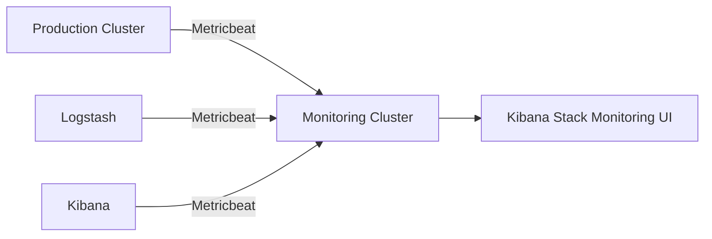
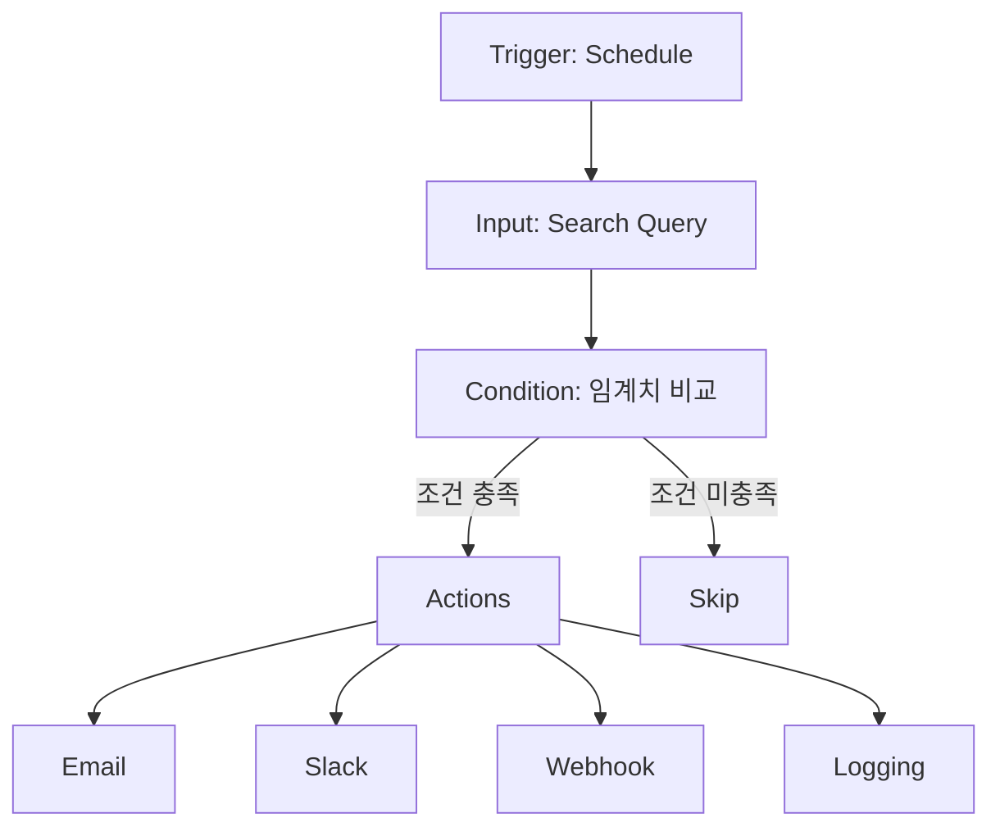
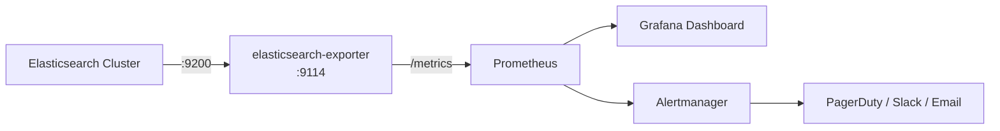

# Elasticsearch 모니터링과 알림

Elasticsearch 클러스터의 안정적 운영을 위한 모니터링 체계 구축과 알림 설정 전략을 다룬다. Stack Monitoring, Watcher, Prometheus + Grafana 연동까지 실전 구성을 살펴본다.

## 목차
- [1. 핵심 개념 (What)](#1-핵심-개념-what)
- [2. 왜 알아야 하는가 (Why)](#2-왜-알아야-하는가-why)
- [3. 내부 구현 분석 (How)](#3-내부-구현-분석-how)
- [4. 실전 예제](#4-실전-예제)
- [5. 정리](#5-정리)

---

## 1. 핵심 개념 (What)

### 모니터링 레이어 구조

Elasticsearch 모니터링은 크게 세 가지 레이어로 나뉜다.

| 레이어 | 대상 | 도구 |
|--------|------|------|
| **클러스터 레벨** | Cluster Health, Shard 분배, 노드 상태 | `_cluster/health`, `_cat/nodes` |
| **노드 레벨** | JVM Heap, GC, Thread Pool, Circuit Breaker | `_nodes/stats` |
| **인덱스 레벨** | 인덱싱 속도, 검색 지연, Segment 수 | `_stats`, `_cat/indices` |

### 핵심 모니터링 메트릭

```
Cluster Health (green/yellow/red)
├── Unassigned Shards
├── Pending Tasks
└── Active Shards Percentage

Node Metrics
├── JVM Heap Usage (%)
├── GC Collection Time (Old/Young)
├── Thread Pool (search/write rejected)
├── OS CPU Usage (%)
└── Disk Watermark

Index Metrics
├── Indexing Rate (docs/sec)
├── Search Latency (ms)
├── Refresh Time
└── Merge Time
```

### 모니터링 방식 비교

| 방식 | 설명 | 권장 환경 |
|------|------|-----------|
| **Self-monitoring** | 같은 클러스터에 모니터링 데이터 저장 | 개발/테스트 |
| **Metricbeat 방식** | 별도 모니터링 클러스터로 전송 | 프로덕션 |
| **Prometheus + Grafana** | elasticsearch-exporter로 메트릭 수집 | 이미 Prometheus 스택이 있는 환경 |

---

## 2. 왜 알아야 하는가 (Why)

### 장애는 예고 없이 오지 않는다

대부분의 Elasticsearch 장애는 사전 징후가 있다.

- **JVM Heap 90% 이상**: Old GC 빈도 증가 -> Stop-the-World -> 노드 응답 불가
- **Thread Pool Rejection 증가**: 검색/인덱싱 큐 포화 -> 요청 드랍
- **Disk Watermark 초과**: Shard 할당 중단 -> 인덱싱 실패
- **Unassigned Shards**: 데이터 가용성 저하 -> 검색 결과 누락

### 사후 대응 vs 사전 대응 비용

```
사후 대응: 장애 발생 → 원인 분석 → 복구 (수시간~수일)
사전 대응: 메트릭 수집 → 임계치 알림 → 선제 조치 (수분~수시간)
```

모니터링 없이 운영하는 것은 계기판 없이 비행하는 것과 같다. 클러스터 규모가 커질수록 수동 점검은 불가능하며, 자동화된 모니터링과 알림이 필수다.

---

## 3. 내부 구현 분석 (How)

### 3.1 Stack Monitoring 아키텍처

#### Self-monitoring 방식


Self-monitoring은 `xpack.monitoring.collection.enabled: true` 설정으로 활성화한다. 모니터링 데이터가 같은 클러스터의 `.monitoring-*` 인덱스에 저장되므로, 클러스터 장애 시 모니터링 데이터도 함께 유실된다.

#### Metricbeat 방식 (권장)



**Metricbeat 설정 (metricbeat.yml)**:

```yaml
metricbeat.modules:
- module: elasticsearch
  metricsets:
    - node
    - node_stats
    - cluster_stats
    - index
    - index_summary
    - shard
    - pending_tasks
  period: 10s
  hosts: ["https://es-prod-01:9200", "https://es-prod-02:9200"]
  username: "monitoring_user"
  password: "${ES_MONITOR_PWD}"
  ssl.certificate_authorities: ["/etc/pki/ca.crt"]
  xpack.enabled: true

output.elasticsearch:
  hosts: ["https://es-monitoring:9200"]
  username: "metricbeat_writer"
  password: "${ES_METRICBEAT_PWD}"
  ssl.certificate_authorities: ["/etc/pki/ca.crt"]
```

**프로덕션 클러스터에서 Self-monitoring 비활성화**:

```yaml
# elasticsearch.yml (프로덕션 노드)
xpack.monitoring.collection.enabled: false
xpack.monitoring.elasticsearch.collection.enabled: false
```

### 3.2 Watcher 알림 시스템

Watcher는 Elasticsearch 내장 알림 엔진으로, 주기적으로 쿼리를 실행하고 조건에 따라 액션을 수행한다.



**Watcher 구성 요소**:

| 요소 | 역할 | 예시 |
|------|------|------|
| **Trigger** | 실행 주기 | `"schedule": {"interval": "5m"}` |
| **Input** | 데이터 수집 | `"search": { "request": {...} }` |
| **Condition** | 판단 기준 | `"compare": { "ctx.payload.hits.total": { "gt": 100 } }` |
| **Transform** | 데이터 변환 | `"script": { "source": "..." }` |
| **Actions** | 실행할 동작 | email, slack, webhook, logging |

### 3.3 Prometheus + Grafana 연동



`elasticsearch-exporter`는 Elasticsearch API를 주기적으로 호출하여 Prometheus 형식의 메트릭을 노출한다.

**주요 노출 메트릭**:

```
elasticsearch_cluster_health_status
elasticsearch_cluster_health_number_of_nodes
elasticsearch_jvm_memory_used_bytes
elasticsearch_jvm_gc_collection_seconds_count
elasticsearch_indices_indexing_index_total
elasticsearch_indices_search_query_time_seconds
elasticsearch_thread_pool_rejected_count
elasticsearch_filesystem_data_available_bytes
```

---

## 4. 실전 예제

### 4.1 Cluster Health 모니터링 Watcher

```json
PUT _watcher/watch/cluster_health_watch
{
  "trigger": {
    "schedule": { "interval": "1m" }
  },
  "input": {
    "http": {
      "request": {
        "host": "localhost",
        "port": 9200,
        "path": "/_cluster/health",
        "scheme": "https",
        "auth": {
          "basic": {
            "username": "elastic",
            "password": "{{vault.es_password}}"
          }
        }
      }
    }
  },
  "condition": {
    "compare": {
      "ctx.payload.status": { "eq": "red" }
    }
  },
  "actions": {
    "notify_slack": {
      "throttle_period": "15m",
      "slack": {
        "account": "ops-team",
        "message": {
          "to": ["#elk-alerts"],
          "text": ":red_circle: Cluster Health RED!\nCluster: {{ctx.payload.cluster_name}}\nUnassigned Shards: {{ctx.payload.unassigned_shards}}\nActive Shards: {{ctx.payload.active_shards_percent_as_number}}%"
        }
      }
    },
    "notify_email": {
      "throttle_period": "30m",
      "email": {
        "to": ["oncall@company.com"],
        "subject": "[CRITICAL] Elasticsearch Cluster Health RED",
        "body": {
          "text": "Cluster {{ctx.payload.cluster_name}} is RED.\nUnassigned shards: {{ctx.payload.unassigned_shards}}\nCheck immediately."
        }
      }
    }
  }
}
```

### 4.2 JVM Heap 사용률 알림

```json
PUT _watcher/watch/jvm_heap_watch
{
  "trigger": {
    "schedule": { "interval": "2m" }
  },
  "input": {
    "search": {
      "request": {
        "indices": [".monitoring-es-*"],
        "body": {
          "size": 0,
          "query": {
            "bool": {
              "filter": [
                { "term": { "type": "node_stats" } },
                { "range": { "timestamp": { "gte": "now-5m" } } }
              ]
            }
          },
          "aggs": {
            "nodes": {
              "terms": { "field": "source_node.name", "size": 50 },
              "aggs": {
                "max_heap_pct": {
                  "max": {
                    "field": "node_stats.jvm.mem.heap_used_percent"
                  }
                },
                "high_heap": {
                  "bucket_selector": {
                    "buckets_path": { "heap": "max_heap_pct" },
                    "script": "params.heap > 85"
                  }
                }
              }
            }
          }
        }
      }
    }
  },
  "condition": {
    "script": {
      "source": "return ctx.payload.aggregations.nodes.buckets.size() > 0"
    }
  },
  "actions": {
    "notify_slack": {
      "throttle_period": "10m",
      "slack": {
        "account": "ops-team",
        "message": {
          "to": ["#elk-alerts"],
          "text": ":warning: JVM Heap > 85% detected!\n{{#ctx.payload.aggregations.nodes.buckets}}Node: {{key}} - Heap: {{max_heap_pct.value}}%\n{{/ctx.payload.aggregations.nodes.buckets}}"
        }
      }
    }
  }
}
```

### 4.3 Prometheus elasticsearch-exporter 배포

```yaml
# docker-compose.monitoring.yml
services:
  elasticsearch-exporter:
    image: quay.io/prometheuscommunity/elasticsearch-exporter:v1.7.0
    command:
      - '--es.uri=https://es-prod-01:9200'
      - '--es.all'
      - '--es.indices'
      - '--es.indices_settings'
      - '--es.shards'
      - '--es.snapshots'
      - '--es.timeout=30s'
      - '--es.ca=/certs/ca.crt'
    environment:
      - ES_USERNAME=monitoring_user
      - ES_PASSWORD=${ES_MONITOR_PWD}
    volumes:
      - ./certs:/certs:ro
    ports:
      - "9114:9114"
    restart: unless-stopped

  prometheus:
    image: prom/prometheus:v2.51.0
    volumes:
      - ./prometheus.yml:/etc/prometheus/prometheus.yml
      - prometheus_data:/prometheus
    ports:
      - "9090:9090"
    restart: unless-stopped

  grafana:
    image: grafana/grafana:10.4.0
    volumes:
      - grafana_data:/var/lib/grafana
    environment:
      - GF_SECURITY_ADMIN_PASSWORD=${GRAFANA_PWD}
    ports:
      - "3000:3000"
    restart: unless-stopped

volumes:
  prometheus_data:
  grafana_data:
```

**Prometheus 스크래핑 설정**:

```yaml
# prometheus.yml
global:
  scrape_interval: 15s

scrape_configs:
  - job_name: 'elasticsearch'
    static_configs:
      - targets: ['elasticsearch-exporter:9114']
    scrape_interval: 10s
    metrics_path: /metrics
```

### 4.4 Grafana 알림 규칙 (Alertmanager 연동)

```yaml
# alertmanager/rules/elasticsearch.yml
groups:
  - name: elasticsearch_alerts
    rules:
      - alert: ElasticsearchClusterRed
        expr: elasticsearch_cluster_health_status{color="red"} == 1
        for: 1m
        labels:
          severity: critical
        annotations:
          summary: "Elasticsearch Cluster is RED"
          description: "Cluster has been RED for over 1 minute."

      - alert: ElasticsearchHeapTooHigh
        expr: |
          elasticsearch_jvm_memory_used_bytes{area="heap"}
          / elasticsearch_jvm_memory_max_bytes{area="heap"} > 0.9
        for: 5m
        labels:
          severity: warning
        annotations:
          summary: "JVM Heap > 90% on {{ $labels.name }}"
          description: "Heap usage: {{ $value | humanizePercentage }}"

      - alert: ElasticsearchDiskLow
        expr: |
          elasticsearch_filesystem_data_available_bytes
          / elasticsearch_filesystem_data_size_bytes < 0.15
        for: 10m
        labels:
          severity: warning
        annotations:
          summary: "Disk space < 15% on {{ $labels.name }}"

      - alert: ElasticsearchThreadPoolRejections
        expr: |
          rate(elasticsearch_thread_pool_rejected_count{name=~"search|write"}[5m]) > 0
        for: 2m
        labels:
          severity: warning
        annotations:
          summary: "Thread pool rejections on {{ $labels.name }} ({{ $labels.type }})"
```

### 4.5 일일 점검 스크립트

```bash
#!/bin/bash
# daily_es_healthcheck.sh
ES_HOST="https://es-prod-01:9200"
ES_USER="monitoring_user"
ES_PASS="${ES_MONITOR_PWD}"
CURL="curl -s -u ${ES_USER}:${ES_PASS} --cacert /etc/pki/ca.crt"

echo "=== Elasticsearch Daily Health Check ==="
echo "Date: $(date '+%Y-%m-%d %H:%M:%S')"
echo ""

# Cluster Health
echo "--- Cluster Health ---"
$CURL "${ES_HOST}/_cluster/health?pretty"

# Node Stats Summary
echo ""
echo "--- Node Summary ---"
$CURL "${ES_HOST}/_cat/nodes?v&h=name,heap.percent,ram.percent,cpu,load_1m,disk.used_percent,node.role"

# Thread Pool Rejections
echo ""
echo "--- Thread Pool Rejections ---"
$CURL "${ES_HOST}/_cat/thread_pool?v&h=node_name,name,active,rejected,completed&s=rejected:desc" | head -20

# Unassigned Shards
echo ""
echo "--- Unassigned Shards ---"
UNASSIGNED=$($CURL "${ES_HOST}/_cluster/health" | python3 -c "import sys,json; print(json.load(sys.stdin)['unassigned_shards'])")
if [ "$UNASSIGNED" -gt 0 ]; then
  echo "WARNING: ${UNASSIGNED} unassigned shards found!"
  $CURL "${ES_HOST}/_cat/shards?v&h=index,shard,prirep,state,unassigned.reason&s=state:asc" | grep UNASSIGNED
else
  echo "OK: No unassigned shards"
fi

# Large Indices
echo ""
echo "--- Top 10 Indices by Size ---"
$CURL "${ES_HOST}/_cat/indices?v&h=index,health,status,pri,rep,docs.count,store.size&s=store.size:desc" | head -11
```

---

## 5. 정리

| 항목 | 핵심 포인트 |
|------|-------------|
| **모니터링 방식** | 프로덕션은 반드시 Metricbeat + 별도 모니터링 클러스터 사용 |
| **핵심 메트릭** | Cluster Health, JVM Heap(85% 경고/90% 위험), Thread Pool Rejection, Disk 사용률 |
| **Watcher** | 내장 알림 엔진, Slack/Email/Webhook 지원, throttle_period로 알림 폭주 방지 |
| **Prometheus 연동** | elasticsearch-exporter로 메트릭 노출, Alertmanager로 알림 라우팅 |
| **알림 설계** | 임계치 2단계(Warning/Critical), throttle 설정, 에스컬레이션 경로 정의 |
| **일일 점검** | 자동화 스크립트로 Cluster Health, Shard 상태, Thread Pool, 디스크 확인 |

### 알림 임계치 가이드

| 메트릭 | Warning | Critical |
|--------|---------|----------|
| Cluster Health | Yellow > 5m | Red > 1m |
| JVM Heap | > 85% for 5m | > 90% for 2m |
| Disk Usage | > 80% | > 85% (Watermark) |
| Thread Pool Rejected | rate > 0 for 2m | rate > 10/s for 1m |
| Search Latency (p99) | > 500ms | > 2000ms |
| Pending Tasks | > 10 for 5m | > 50 for 2m |

---
*참고: Elasticsearch 8.x / Logstash 8.x / Kibana 8.x 기준*
