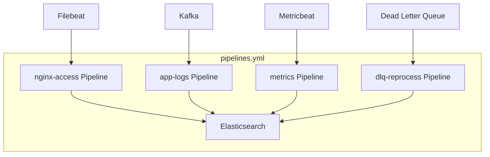
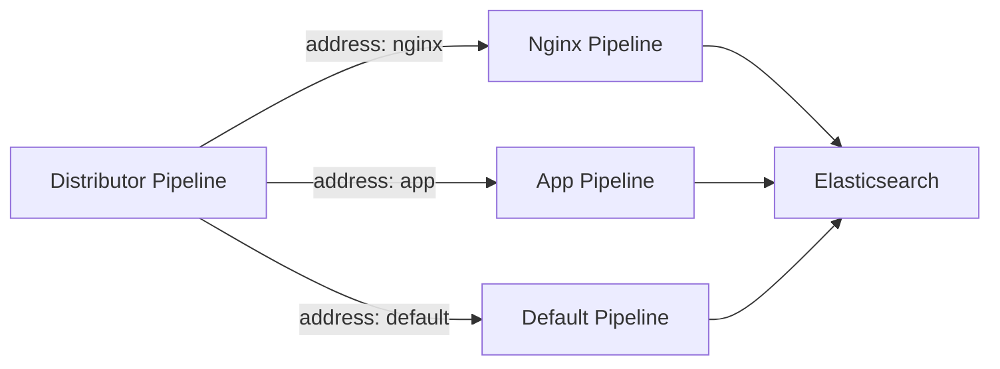
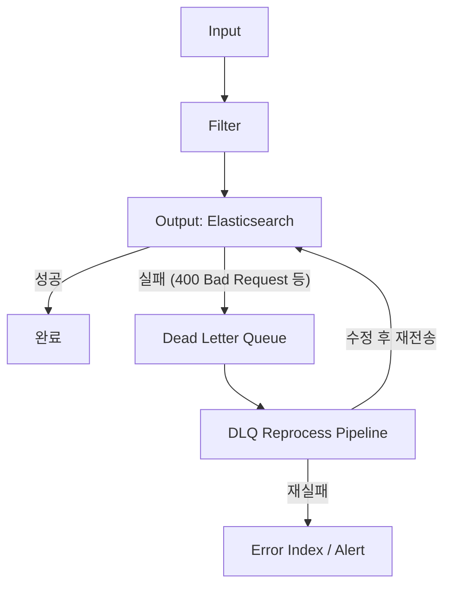

# Logstash 실전 파이프라인 설계

Logstash 멀티 파이프라인 설계 패턴, 조건 분기, Dead Letter Queue, 에러 핸들링까지 프로덕션 파이프라인 설계의 핵심 패턴을 다룬다.

## 목차
- [1. 핵심 개념 (What)](#1-핵심-개념-what)
- [2. 왜 알아야 하는가 (Why)](#2-왜-알아야-하는가-why)
- [3. 내부 구현 분석 (How)](#3-내부-구현-분석-how)
- [4. 실전 예제](#4-실전-예제)
- [5. 정리](#5-정리)

---

## 1. 핵심 개념 (What)

### 파이프라인 구성 요소

Logstash 파이프라인은 세 단계로 구성된다.

```
Input → Filter → Output
(수집)   (변환)    (전송)
```

단일 파이프라인으로는 복잡한 요구사항을 감당하기 어렵다. 실전에서는 **멀티 파이프라인**, **조건 분기**, **에러 핸들링**을 조합하여 설계한다.

### 파이프라인 설계 핵심 원칙

| 원칙 | 설명 |
|------|------|
| **격리(Isolation)** | 서로 다른 데이터 소스는 별도 파이프라인으로 분리 |
| **단일 책임** | 하나의 파이프라인은 하나의 데이터 흐름만 처리 |
| **실패 허용(Fault Tolerance)** | DLQ, 재처리 경로로 데이터 유실 방지 |
| **관측 가능성** | 파이프라인별 메트릭 수집과 태깅 |

### 멀티 파이프라인 vs 단일 파이프라인 비교

| 항목 | 단일 파이프라인 | 멀티 파이프라인 |
|------|----------------|----------------|
| 설정 복잡도 | 낮음 | 중간 |
| 장애 격리 | 없음 (하나 실패 시 전체 영향) | 파이프라인별 독립 |
| 리소스 제어 | 불가 | 파이프라인별 Worker/Batch 설정 가능 |
| 스케일링 | 전체 단위 | 파이프라인별 독립 스케일 |
| 모니터링 | 어려움 | 파이프라인별 메트릭 분리 |

---

## 2. 왜 알아야 하는가 (Why)

### 실전에서 마주하는 문제들

**문제 1: 한 소스의 장애가 전체를 멈춘다**

단일 파이프라인에서 Kafka input이 장애를 일으키면, 같은 파이프라인의 Filebeat input도 함께 멈출 수 있다. 멀티 파이프라인으로 분리하면 각 파이프라인이 독립적으로 동작한다.

**문제 2: 파싱 실패 이벤트가 사라진다**

Grok 패턴 불일치, JSON 파싱 실패 등으로 이벤트가 `_grokparsefailure` 태그만 달고 Elasticsearch에 저장되거나, 최악의 경우 드랍된다. DLQ와 에러 핸들링 파이프라인이 없으면 데이터 유실을 감지조차 못한다.

**문제 3: 조건 분기가 복잡해지면 유지보수가 불가능하다**

`if/else if/else` 체인이 중첩되면 디버깅이 극도로 어렵다. 체계적인 분기 패턴과 파이프라인 분리가 필요하다.

---

## 3. 내부 구현 분석 (How)

### 3.1 멀티 파이프라인 아키텍처



**pipelines.yml 설정**:

```yaml
# /etc/logstash/pipelines.yml

- pipeline.id: nginx-access
  path.config: "/etc/logstash/pipelines/nginx-access/*.conf"
  pipeline.workers: 4
  pipeline.batch.size: 500
  queue.type: persisted
  queue.max_bytes: 1gb

- pipeline.id: app-logs
  path.config: "/etc/logstash/pipelines/app-logs/*.conf"
  pipeline.workers: 2
  pipeline.batch.size: 250
  queue.type: persisted
  queue.max_bytes: 2gb

- pipeline.id: metrics
  path.config: "/etc/logstash/pipelines/metrics/*.conf"
  pipeline.workers: 1
  pipeline.batch.size: 1000
  queue.type: memory

- pipeline.id: dlq-reprocess
  path.config: "/etc/logstash/pipelines/dlq/*.conf"
  pipeline.workers: 1
  pipeline.batch.size: 100
```

### 3.2 Pipeline-to-Pipeline 통신

Logstash 8.x에서는 파이프라인 간 이벤트 전달이 가능하다. `pipeline` input/output을 사용하여 내부 라우팅을 구성한다.



**Distributor 파이프라인**:

```ruby
# pipelines/distributor/input.conf
input {
  beats {
    port => 5044
  }
}

# pipelines/distributor/output.conf
output {
  if [fields][log_type] == "nginx" {
    pipeline {
      send_to => ["nginx"]
    }
  } else if [fields][log_type] == "application" {
    pipeline {
      send_to => ["app"]
    }
  } else {
    pipeline {
      send_to => ["default"]
    }
  }
}
```

**수신 파이프라인 (Nginx)**:

```ruby
# pipelines/nginx/input.conf
input {
  pipeline {
    address => "nginx"
  }
}

# pipelines/nginx/filter.conf
filter {
  grok {
    match => {
      "message" => '%{IPORHOST:client_ip} - %{DATA:user} \[%{HTTPDATE:timestamp}\] "%{WORD:method} %{URIPATHPARAM:request} HTTP/%{NUMBER:http_version}" %{NUMBER:response_code} %{NUMBER:bytes}'
    }
  }
  date {
    match => ["timestamp", "dd/MMM/yyyy:HH:mm:ss Z"]
    target => "@timestamp"
  }
  geoip {
    source => "client_ip"
    target => "geoip"
  }
  mutate {
    remove_field => ["message", "timestamp"]
  }
}

# pipelines/nginx/output.conf
output {
  elasticsearch {
    hosts => ["https://es-prod:9200"]
    index => "nginx-access-%{+YYYY.MM.dd}"
    user => "logstash_writer"
    password => "${ES_PASSWORD}"
    ssl_certificate_authorities => ["/etc/pki/ca.crt"]
  }
}
```

### 3.3 조건 분기 패턴

#### 패턴 1: 태그 기반 분기

```ruby
filter {
  # 공통 처리
  mutate {
    add_field => { "[@metadata][pipeline]" => "unknown" }
  }

  if [agent][type] == "filebeat" {
    if [fileset][module] == "nginx" {
      mutate { replace => { "[@metadata][pipeline]" => "nginx" } }
    } else if [fileset][module] == "system" {
      mutate { replace => { "[@metadata][pipeline]" => "system" } }
    }
  }

  # 모듈별 처리
  if [@metadata][pipeline] == "nginx" {
    grok {
      match => { "message" => "%{COMBINEDAPACHELOG}" }
    }
  } else if [@metadata][pipeline] == "system" {
    grok {
      match => { "message" => "%{SYSLOGLINE}" }
    }
  }
}
```

#### 패턴 2: @metadata를 활용한 라우팅

`@metadata` 필드는 output 이후 자동 제거되므로 라우팅 정보를 저장하기에 적합하다.

```ruby
filter {
  # 인덱스 라우팅 결정
  if [kubernetes][namespace] =~ /^prod-/ {
    mutate {
      add_field => {
        "[@metadata][target_index]" => "prod-%{[kubernetes][labels][app]}-%{+YYYY.MM.dd}"
      }
    }
  } else {
    mutate {
      add_field => {
        "[@metadata][target_index]" => "dev-%{[kubernetes][labels][app]}-%{+YYYY.MM.dd}"
      }
    }
  }
}

output {
  elasticsearch {
    hosts => ["https://es-prod:9200"]
    index => "%{[@metadata][target_index]}"
  }
}
```

### 3.4 Dead Letter Queue (DLQ)

DLQ는 output 플러그인에서 처리 실패한 이벤트를 별도 큐에 저장하는 메커니즘이다.



**DLQ 활성화**:

```yaml
# logstash.yml
dead_letter_queue.enable: true
dead_letter_queue.max_bytes: 4gb
dead_letter_queue.storage_policy: drop_newer  # or drop_older
dead_letter_queue.retain.age: 7d
path.dead_letter_queue: "/var/logstash/dlq"
```

**DLQ 재처리 파이프라인**:

```ruby
# pipelines/dlq/reprocess.conf
input {
  dead_letter_queue {
    path => "/var/logstash/dlq"
    commit_offsets => true
    pipeline_id => "app-logs"
    clean_consumed => true
  }
}

filter {
  # DLQ 메타데이터 확인
  ruby {
    code => '
      dlq_entry = event.get("[@metadata][dead_letter_queue]")
      if dlq_entry
        event.set("[@metadata][dlq_reason]", dlq_entry["reason"])
        event.set("[@metadata][dlq_plugin_type]", dlq_entry["plugin_type"])
        event.set("[@metadata][dlq_plugin_id]", dlq_entry["plugin_id"])
      end
    '
  }

  # 일반적인 수정 시도: 너무 긴 필드 잘라내기
  if [message] {
    truncate {
      fields => ["message"]
      length_bytes => 32766
    }
  }

  # 매핑 충돌 해결: 문제 필드 타입 변환
  if [@metadata][dlq_reason] =~ /mapper_parsing_exception/ {
    ruby {
      code => '
        # 숫자 필드에 문자열이 들어온 경우 처리
        problematic_fields = ["response_time", "bytes", "status_code"]
        problematic_fields.each do |field|
          val = event.get(field)
          if val.is_a?(String)
            numeric_val = val.to_f rescue nil
            if numeric_val
              event.set(field, numeric_val)
            else
              event.remove(field)
              event.tag("_dlq_field_removed_#{field}")
            end
          end
        end
      '
    }
  }

  # 재처리 메타 추가
  mutate {
    add_field => {
      "[@metadata][reprocessed]" => "true"
      "dlq_reprocessed_at" => "%{+ISO8601}"
    }
  }
}

output {
  elasticsearch {
    hosts => ["https://es-prod:9200"]
    index => "recovered-%{+YYYY.MM.dd}"
    user => "logstash_writer"
    password => "${ES_PASSWORD}"
    ssl_certificate_authorities => ["/etc/pki/ca.crt"]
  }
}
```

### 3.5 에러 핸들링 패턴

```ruby
filter {
  # JSON 파싱 시도
  json {
    source => "message"
    target => "parsed"
    tag_on_failure => ["_json_parse_failure"]
  }

  # 파싱 실패 시 폴백 처리
  if "_json_parse_failure" in [tags] {
    mutate {
      add_field => {
        "parse_error" => "true"
        "raw_message" => "%{message}"
      }
      add_tag => ["needs_review"]
    }
    # 원본 보존을 위해 별도 인덱스로 라우팅
    mutate {
      add_field => {
        "[@metadata][target_index]" => "parse-errors-%{+YYYY.MM.dd}"
      }
    }
  }

  # Grok 실패 핸들링
  grok {
    match => { "message" => "%{COMMONAPACHELOG}" }
    tag_on_failure => ["_grok_nomatch"]
  }

  if "_grok_nomatch" in [tags] {
    # 대체 패턴 시도
    grok {
      match => { "message" => "%{GREEDYDATA:raw_log}" }
      overwrite => ["raw_log"]
      remove_tag => ["_grok_nomatch"]
      add_tag => ["_grok_fallback"]
    }
  }
}

output {
  if "parse-errors" in [@metadata][target_index] {
    elasticsearch {
      hosts => ["https://es-prod:9200"]
      index => "%{[@metadata][target_index]}"
    }
  } else {
    elasticsearch {
      hosts => ["https://es-prod:9200"]
      index => "logs-%{+YYYY.MM.dd}"
    }
  }
}
```

---

## 4. 실전 예제

### 4.1 마이크로서비스 로그 수집 파이프라인

```ruby
# pipelines/microservices/input.conf
input {
  kafka {
    bootstrap_servers => "kafka-01:9092,kafka-02:9092,kafka-03:9092"
    topics_pattern => "logs\\..*"
    group_id => "logstash-microservices"
    consumer_threads => 3
    codec => json
    decorate_events => "extended"
    auto_offset_reset => "latest"
  }
}

# pipelines/microservices/filter.conf
filter {
  # 공통 필드 정규화
  mutate {
    rename => {
      "[kafka][topic]" => "[@metadata][kafka_topic]"
    }
  }

  # 서비스별 파싱
  if [@metadata][kafka_topic] =~ /^logs\.order-service/ {
    # 주문 서비스 로그 파싱
    if [level] == "ERROR" {
      grok {
        match => {
          "stack_trace" => "(?<exception_class>[a-zA-Z.]+Exception): %{GREEDYDATA:exception_message}"
        }
        tag_on_failure => []
      }
    }
    mutate {
      add_field => { "[@metadata][service]" => "order-service" }
    }
  } else if [@metadata][kafka_topic] =~ /^logs\.payment-service/ {
    # 결제 서비스 - 민감 정보 마스킹
    mutate {
      gsub => [
        "message", "\b\d{4}[-\s]?\d{4}[-\s]?\d{4}[-\s]?\d{4}\b", "[CARD_MASKED]",
        "message", "\b[A-Za-z0-9._%+-]+@[A-Za-z0-9.-]+\.[A-Za-z]{2,}\b", "[EMAIL_MASKED]"
      ]
    }
    mutate {
      add_field => { "[@metadata][service]" => "payment-service" }
    }
  }

  # 공통 enrichment
  mutate {
    add_field => {
      "[@metadata][target_index]" => "svc-%{[@metadata][service]}-%{+YYYY.MM.dd}"
    }
  }
}

# pipelines/microservices/output.conf
output {
  elasticsearch {
    hosts => ["https://es-prod:9200"]
    index => "%{[@metadata][target_index]}"
    user => "logstash_writer"
    password => "${ES_PASSWORD}"
    ssl_certificate_authorities => ["/etc/pki/ca.crt"]
    action => "create"
  }
}
```

### 4.2 파이프라인 테스트

Logstash는 `--config.test_and_exit` 옵션으로 설정 문법을 검증할 수 있다.

```bash
# 설정 문법 검증
/usr/share/logstash/bin/logstash \
  --config.test_and_exit \
  --path.config /etc/logstash/pipelines/nginx-access/

# 단일 파이프라인 디버그 모드
/usr/share/logstash/bin/logstash \
  -f /etc/logstash/pipelines/nginx-access/ \
  --pipeline.workers 1 \
  --log.level debug
```

**stdin/stdout을 이용한 필터 테스트**:

```ruby
# test-filter.conf
input {
  stdin {
    codec => json
  }
}

filter {
  grok {
    match => {
      "message" => '%{IPORHOST:client_ip} - %{DATA:user} \[%{HTTPDATE:timestamp}\] "%{WORD:method} %{URIPATHPARAM:request} HTTP/%{NUMBER:http_version}" %{NUMBER:response_code} %{NUMBER:bytes}'
    }
  }
}

output {
  stdout {
    codec => rubydebug
  }
}
```

```bash
# 테스트 실행
echo '{"message": "192.168.1.1 - frank [10/Oct/2024:13:55:36 +0000] \"GET /api/users HTTP/1.1\" 200 1234"}' | \
  /usr/share/logstash/bin/logstash -f test-filter.conf --pipeline.workers 1
```

### 4.3 파이프라인 모니터링 API

```bash
# 전체 파이프라인 상태
curl -s localhost:9600/_node/stats/pipelines?pretty

# 특정 파이프라인 상태
curl -s localhost:9600/_node/stats/pipelines/nginx-access?pretty

# 핵심 메트릭 추출
curl -s localhost:9600/_node/stats/pipelines | \
  python3 -c "
import sys, json
data = json.load(sys.stdin)
for pid, stats in data['pipelines'].items():
    events = stats['events']
    print(f'Pipeline: {pid}')
    print(f'  In: {events[\"in\"]}  Out: {events[\"out\"]}  Filtered: {events[\"filtered\"]}')
    print(f'  Duration (ms): {events[\"duration_in_millis\"]}')
    if events['in'] > 0:
        drop_rate = (1 - events['out'] / events['in']) * 100
        print(f'  Drop Rate: {drop_rate:.2f}%')
    print()
"
```

---

## 5. 정리

| 항목 | 핵심 포인트 |
|------|-------------|
| **멀티 파이프라인** | `pipelines.yml`로 파이프라인 분리, 각각 독립 Worker/Queue 설정 |
| **Pipeline-to-Pipeline** | `pipeline` input/output으로 내부 라우팅, Distributor 패턴 |
| **조건 분기** | `@metadata` 활용, 태그 기반 분기, 중첩 최소화 |
| **DLQ** | `dead_letter_queue.enable: true`, 별도 재처리 파이프라인 구성 |
| **에러 핸들링** | `tag_on_failure`로 실패 감지, 폴백 처리, 별도 에러 인덱스 |
| **테스트** | `--config.test_and_exit`로 문법 검증, stdin/stdout으로 필터 테스트 |
| **모니터링** | `_node/stats/pipelines` API로 in/out/filtered/duration 확인 |

### 파이프라인 설계 체크리스트

- [ ] 데이터 소스별 파이프라인 분리 여부 검토
- [ ] 각 파이프라인의 Worker/Batch 사이즈 적정성 확인
- [ ] DLQ 활성화 및 재처리 파이프라인 구성
- [ ] 파싱 실패 이벤트의 처리 경로 정의
- [ ] `@metadata` 기반 라우팅으로 불필요한 필드 제거
- [ ] 민감 정보 마스킹 처리 확인
- [ ] Persistent Queue 사용 여부 결정 (데이터 유실 방지)
- [ ] 파이프라인 모니터링 메트릭 수집 확인

---
*참고: Elasticsearch 8.x / Logstash 8.x / Kibana 8.x 기준*
