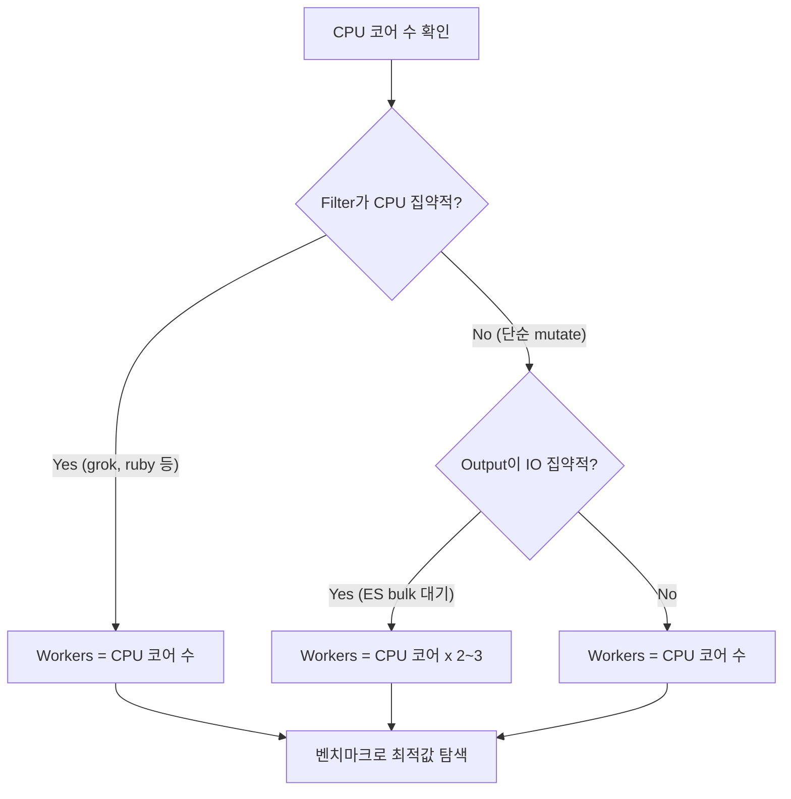
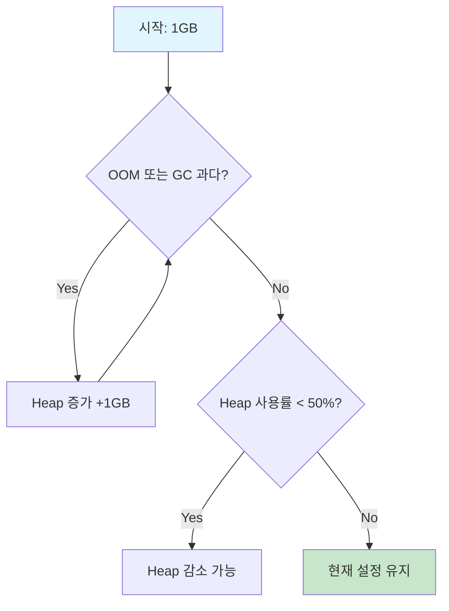
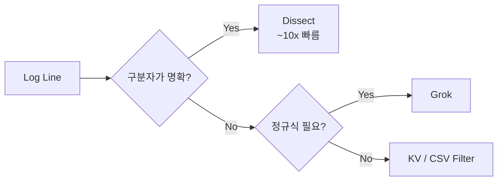

# Logstash 성능 최적화

Logstash 파이프라인의 처리량과 안정성을 극대화하기 위한 튜닝 전략을 다룬다. Worker, Batch, JVM, Persistent Queue 설정부터 CPU/IO 바운드 분석, Grok vs Dissect 비교까지 실전 최적화를 안내한다.

## 목차
- [1. 핵심 개념 (What)](#1-핵심-개념-what)
- [2. 왜 알아야 하는가 (Why)](#2-왜-알아야-하는가-why)
- [3. 내부 구현 분석 (How)](#3-내부-구현-분석-how)
- [4. 실전 예제](#4-실전-예제)
- [5. 정리](#5-정리)

---

## 1. 핵심 개념 (What)

### Logstash 이벤트 처리 모델

```
Input Thread(s)
    │
    ▼
┌─────────────────────┐
│   Memory/Persistent  │
│       Queue          │
└─────────────────────┘
    │
    ▼
┌───────────────────────────────────┐
│  Worker Thread Pool               │
│  ┌─────────┐ ┌─────────┐        │
│  │ Worker 1 │ │ Worker 2 │ ...   │
│  │ (Batch)  │ │ (Batch)  │       │
│  └─────────┘ └─────────┘        │
│       │             │             │
│   Filter Chain  Filter Chain      │
│       │             │             │
│   Output Chain  Output Chain      │
└───────────────────────────────────┘
```

- **Input Thread**: 데이터 소스로부터 이벤트를 읽어 Queue에 넣는다
- **Queue**: Memory 또는 Persistent Queue에 이벤트를 버퍼링한다
- **Worker Thread**: Queue에서 Batch 단위로 이벤트를 꺼내 Filter + Output을 실행한다

### 핵심 튜닝 파라미터

| 파라미터 | 기본값 | 설명 |
|----------|--------|------|
| `pipeline.workers` | CPU 코어 수 | Filter + Output 병렬 처리 스레드 수 |
| `pipeline.batch.size` | 125 | Worker당 한번에 처리하는 이벤트 수 |
| `pipeline.batch.delay` | 50ms | Batch가 채워지지 않을 때 대기 시간 |
| `queue.type` | memory | `memory` 또는 `persisted` |
| `queue.max_bytes` | 1gb | Persistent Queue 최대 크기 |
| `queue.page_capacity` | 64mb | PQ 페이지 크기 |
| `queue.drain` | false | 종료 시 큐의 남은 이벤트 처리 여부 |

---

## 2. 왜 알아야 하는가 (Why)

### 성능 병목의 실제 영향

```
데이터 유입 속도 > Logstash 처리 속도
         │
         ▼
Queue 포화 → Backpressure → Input 차단
         │
         ▼
Kafka: Consumer Lag 증가
Beats: Filebeat 버퍼 포화 → 로그 수집 지연
TCP:   Connection Timeout → 데이터 유실
```

**사례: 일일 500GB 로그 환경**

- 최적화 전: 초당 5,000 이벤트 처리, 피크 시간 2시간 지연 누적
- Worker 튜닝 후: 초당 15,000 이벤트, 지연 해소
- Grok → Dissect 전환 후: 초당 25,000 이벤트, CPU 사용률 40% 감소

### 비용 관점

Logstash의 처리 효율이 2배 향상되면, 같은 워크로드를 절반의 인스턴스로 처리할 수 있다. 클라우드 환경에서 이는 직접적인 비용 절감으로 이어진다.

---

## 3. 내부 구현 분석 (How)

### 3.1 Worker 수 튜닝



**Worker 수 결정 원칙**:

- **CPU 바운드** (Grok, Ruby filter 등): Worker 수 = CPU 코어 수가 상한선
- **IO 바운드** (Elasticsearch output 대기 등): Worker 수 > CPU 코어 수 가능
- 너무 많은 Worker는 컨텍스트 스위칭 오버헤드를 유발한다

**Worker 수 변경 (무중단)**:

```bash
# Hot Reload로 적용 (Logstash 재시작 없음)
curl -XPUT 'localhost:9600/_node/pipelines/main' \
  -H 'Content-Type: application/json' \
  -d '{"pipeline.workers": 8}'
```

또는 `pipelines.yml` 수정 후 SIGHUP 전송:

```bash
kill -SIGHUP $(cat /var/run/logstash.pid)
```

### 3.2 Batch Size 튜닝

Batch Size는 Worker가 한번에 처리하는 이벤트 수를 결정한다.

```
Batch Size 작음 (50)                  Batch Size 큼 (1000)
├── Output 호출 빈번                   ├── Output 호출 적음
├── ES Bulk 요청 작음                  ├── ES Bulk 요청 큼
├── 메모리 사용 적음                    ├── 메모리 사용 많음
├── 지연 시간 짧음                     ├── 지연 시간 길 수 있음
└── 처리량 낮음                        └── 처리량 높음
```

**권장 설정 시나리오**:

| 시나리오 | Batch Size | Batch Delay | 이유 |
|----------|-----------|-------------|------|
| 실시간 알림 로그 | 50~125 | 5~10ms | 낮은 지연 우선 |
| 일반 로그 수집 | 250~500 | 50ms | 처리량/지연 균형 |
| 대량 배치 처리 | 1000~5000 | 100~250ms | 최대 처리량 우선 |

### 3.3 JVM 메모리 최적화

**jvm.options 설정**:

```bash
# /etc/logstash/jvm.options

# Heap 크기: 물리 메모리의 50% 이하, 최대 8GB 권장
-Xms4g
-Xmx4g

# GC 설정 (Logstash 8.x 기본: G1GC)
-XX:+UseG1GC
-XX:G1HeapRegionSize=16m
-XX:InitiatingHeapOccupancyPercent=45

# GC 로깅
-Xlog:gc*,gc+age=trace,safepoint:file=/var/log/logstash/gc.log:utctime,pid,tags:filecount=32,filesize=64m
```

**JVM Heap 크기 결정 기준**:



| Heap 사용률 | 상태 | 조치 |
|-------------|------|------|
| < 50% | 여유 | 다른 서비스에 메모리 할당 가능 |
| 50-75% | 적정 | 유지 |
| 75-85% | 주의 | GC 빈도 모니터링 |
| > 85% | 위험 | Heap 증가 필요 또는 파이프라인 분리 |

### 3.4 Persistent Queue (PQ) 설정

```yaml
# logstash.yml
queue.type: persisted
queue.max_bytes: 4gb          # 큐 최대 크기
queue.page_capacity: 64mb     # 페이지 파일 크기
queue.drain: true             # 종료 시 잔여 이벤트 처리
queue.checkpoint.writes: 1024 # 체크포인트 간격
```

**PQ vs Memory Queue 비교**:

| 항목 | Memory Queue | Persistent Queue |
|------|-------------|-----------------|
| 데이터 안전성 | Logstash 종료 시 유실 | 디스크 저장, 복구 가능 |
| 처리 성능 | 빠름 | 10~20% 오버헤드 |
| Backpressure 대응 | 제한적 | 대용량 버퍼 가능 |
| 디스크 사용 | 없음 | max_bytes 만큼 사용 |
| 권장 환경 | 유실 허용, 성능 우선 | 프로덕션, 데이터 보존 필수 |

**PQ 디스크 성능 요구사항**:

```
PQ 디스크 IOPS 추정:
  이벤트 처리 속도: 10,000 events/sec
  평균 이벤트 크기: 1KB
  쓰기 속도: ~10 MB/s
  체크포인트 쓰기: 추가 ~2 MB/s
  
  최소 디스크 성능: 100+ MB/s Sequential Write
  권장: SSD 또는 NVMe
```

### 3.5 CPU/IO 바운드 파이프라인 분석

**병목 지점 판별 방법**:

```bash
# 파이프라인 통계 조회
curl -s localhost:9600/_node/stats/pipelines?pretty | \
  python3 -c "
import sys, json
data = json.load(sys.stdin)
for pid, stats in data['pipelines'].items():
    print(f'=== Pipeline: {pid} ===')
    events = stats['events']
    print(f'Events In: {events[\"in\"]}')
    print(f'Events Out: {events[\"out\"]}')
    print(f'Queue Push Duration (ms): {events.get(\"queue_push_duration_in_millis\", 0)}')
    print(f'Filter Duration (ms): {events[\"duration_in_millis\"]}')
    
    # 플러그인별 분석
    if 'plugins' in stats:
        print('\\nFilter breakdown:')
        for f in stats['plugins'].get('filters', []):
            name = f.get('name', 'unknown')
            dur = f.get('duration_in_millis', 0)
            evts = f.get('events', {}).get('in', 0)
            avg = dur / evts * 1000 if evts > 0 else 0
            print(f'  {name}: {dur}ms total, {avg:.1f}us/event')
        
        print('\\nOutput breakdown:')
        for o in stats['plugins'].get('outputs', []):
            name = o.get('name', 'unknown')
            dur = o.get('duration_in_millis', 0)
            print(f'  {name}: {dur}ms total')
"
```

**판별 기준**:

| 지표 | CPU 바운드 | IO 바운드 |
|------|-----------|----------|
| CPU 사용률 | Worker 수에 비례하여 높음 | 낮음 (< 50%) |
| Filter Duration | 전체 시간의 대부분 | 적음 |
| Output Duration | 적음 | 전체 시간의 대부분 |
| Worker 증가 효과 | 선형 향상 (코어 수까지) | 선형 향상 (IO 포화까지) |

### 3.6 Grok vs Dissect 성능 비교



**동일 로그 파싱 비교**:

로그 예시: `2024-10-15 14:23:45 INFO [order-service] [req-abc123] Order created successfully`

**Grok 방식**:

```ruby
filter {
  grok {
    match => {
      "message" => "%{TIMESTAMP_ISO8601:timestamp} %{LOGLEVEL:level} \[%{DATA:service}\] \[%{DATA:request_id}\] %{GREEDYDATA:log_message}"
    }
  }
}
```

**Dissect 방식**:

```ruby
filter {
  dissect {
    mapping => {
      "message" => "%{timestamp} %{+timestamp} %{level} [%{service}] [%{request_id}] %{log_message}"
    }
  }
}
```

**성능 벤치마크 결과** (동일 하드웨어, 100만 이벤트):

| 항목 | Grok | Dissect | 차이 |
|------|------|---------|------|
| 처리 시간 | 42초 | 4.5초 | **~9.3x** |
| CPU 사용률 | 95% | 15% | **~6.3x** |
| 이벤트/초 | ~23,800 | ~222,000 | **~9.3x** |
| 메모리 사용 | 높음 (정규식 컴파일) | 낮음 | - |

**Grok 최적화 팁** (불가피하게 사용할 때):

```ruby
filter {
  grok {
    # 1. 앵커 사용으로 불필요한 백트래킹 방지
    match => { "message" => "^%{TIMESTAMP_ISO8601:timestamp}" }
    
    # 2. 가능한 경우 GREEDYDATA 대신 구체적 패턴 사용
    # BAD:  %{GREEDYDATA:field1} %{GREEDYDATA:field2}
    # GOOD: %{NOTSPACE:field1} %{GREEDYDATA:field2}
    
    # 3. 불필요한 캡처 비활성화
    match => { "message" => "%{TIMESTAMP_ISO8601:timestamp} %{WORD:level} (?:\[%{DATA:service}\] )?%{GREEDYDATA:msg}" }
    
    # 4. break_on_match: 첫 번째 매칭 후 중단 (기본값 true)
    break_on_match => true
    
    # 5. timeout 설정으로 재앙적 백트래킹 방지
    timeout_millis => 500
  }
}
```

---

## 4. 실전 예제

### 4.1 처리량 벤치마킹 스크립트

```bash
#!/bin/bash
# benchmark_logstash.sh - Logstash 파이프라인 벤치마크

LOGSTASH_BIN="/usr/share/logstash/bin/logstash"
TEST_CONFIG="$1"
EVENT_COUNT="${2:-100000}"
RESULT_FILE="benchmark_results.csv"

if [ -z "$TEST_CONFIG" ]; then
  echo "Usage: $0 <config_file> [event_count]"
  exit 1
fi

# 테스트 데이터 생성
TEMP_DATA=$(mktemp)
for i in $(seq 1 $EVENT_COUNT); do
  echo '{"timestamp":"2024-10-15T14:23:45.123Z","level":"INFO","service":"order-service","request_id":"req-'$i'","message":"Order created successfully for user user-'$i'"}'
done > "$TEMP_DATA"

echo "worker,batch_size,events_per_sec,duration_sec" > "$RESULT_FILE"

# Worker와 Batch 조합 테스트
for WORKERS in 1 2 4 8; do
  for BATCH in 125 250 500 1000; do
    echo "Testing: workers=$WORKERS, batch=$BATCH"
    
    START=$(date +%s%N)
    
    cat "$TEMP_DATA" | $LOGSTASH_BIN \
      -f "$TEST_CONFIG" \
      --pipeline.workers "$WORKERS" \
      --pipeline.batch.size "$BATCH" \
      --pipeline.batch.delay 5 \
      2>/dev/null
    
    END=$(date +%s%N)
    DURATION=$(( (END - START) / 1000000 ))  # ms
    DURATION_SEC=$(echo "scale=2; $DURATION / 1000" | bc)
    EPS=$(echo "scale=0; $EVENT_COUNT / $DURATION_SEC" | bc 2>/dev/null || echo "0")
    
    echo "$WORKERS,$BATCH,$EPS,$DURATION_SEC" >> "$RESULT_FILE"
    echo "  -> ${EPS} events/sec (${DURATION_SEC}s)"
  done
done

rm "$TEMP_DATA"
echo ""
echo "Results saved to $RESULT_FILE"
cat "$RESULT_FILE" | column -t -s','
```

### 4.2 프로덕션 최적화 설정 예시

```yaml
# pipelines.yml - 고처리량 파이프라인 설정

- pipeline.id: high-throughput-logs
  path.config: "/etc/logstash/pipelines/high-throughput/*.conf"
  # Worker: 8코어 서버 기준, IO 바운드이므로 코어 수 x 2
  pipeline.workers: 16
  # 대량 처리 우선, Batch 크게 설정
  pipeline.batch.size: 1000
  pipeline.batch.delay: 100
  # Persistent Queue: 데이터 유실 방지
  queue.type: persisted
  queue.max_bytes: 8gb
  queue.page_capacity: 256mb
  queue.drain: true
  queue.checkpoint.writes: 2048

- pipeline.id: realtime-alerts
  path.config: "/etc/logstash/pipelines/realtime-alerts/*.conf"
  # 실시간성 우선: Worker 적게, Batch 작게
  pipeline.workers: 2
  pipeline.batch.size: 50
  pipeline.batch.delay: 5
  queue.type: memory
```

### 4.3 Elasticsearch Output 최적화

```ruby
output {
  elasticsearch {
    hosts => ["https://es-01:9200", "https://es-02:9200", "https://es-03:9200"]
    user => "logstash_writer"
    password => "${ES_PASSWORD}"
    ssl_certificate_authorities => ["/etc/pki/ca.crt"]
    
    # Bulk 요청 최적화
    # Logstash batch.size가 1000이면 flush_size도 맞춤
    flush_size => 1000
    
    # 재시도 설정
    retry_initial_interval => 2
    retry_max_interval => 64
    retry_on_conflict => 3
    
    # Sniffing: Data Node 직접 접근 (LB 뒤에서는 비활성화)
    sniffing => false
    
    # HTTP 압축
    http_compression => true
    
    # Connection Pool
    pool_max => 50
    pool_max_per_route => 25
    
    # Timeout
    timeout => 60
  }
}
```

### 4.4 성능 모니터링 대시보드 쿼리

```bash
# 실시간 이벤트 처리 속도 모니터링
watch -n 5 'curl -s localhost:9600/_node/stats/events | \
  python3 -c "
import sys, json
d = json.load(sys.stdin)
e = d[\"events\"]
print(f\"In:       {e[\"in\"]:>12,}\")
print(f\"Out:      {e[\"out\"]:>12,}\")
print(f\"Filtered: {e[\"filtered\"]:>12,}\")
print(f\"Duration: {e[\"duration_in_millis\"]:>12,} ms\")
if e[\"duration_in_millis\"] > 0:
    eps = e[\"out\"] / (e[\"duration_in_millis\"] / 1000)
    print(f\"Rate:     {eps:>12,.0f} events/sec\")
"'
```

### 4.5 GC 분석 스크립트

```bash
#!/bin/bash
# analyze_gc.sh - Logstash GC 로그 분석

GC_LOG="${1:-/var/log/logstash/gc.log}"

echo "=== GC Summary ==="

# GC Pause 통계
echo ""
echo "--- GC Pause Statistics ---"
grep -oP 'pause.*?(\d+\.\d+)ms' "$GC_LOG" | \
  awk -F'ms' '{sum+=$1; count++; if($1>max)max=$1} 
    END{printf "Count: %d\nAvg: %.2f ms\nMax: %.2f ms\n", count, sum/count, max}'

# Old GC 빈도
echo ""
echo "--- Old GC Count (last hour) ---"
HOUR_AGO=$(date -d '1 hour ago' '+%Y-%m-%dT%H' 2>/dev/null || date -v-1H '+%Y-%m-%dT%H')
grep "$HOUR_AGO" "$GC_LOG" | grep -c "Old" || echo "0"

# Heap 사용 추이
echo ""
echo "--- Recent Heap Usage ---"
tail -20 "$GC_LOG" | grep -oP 'Heap.*?\d+M->\d+M' | tail -5
```

---

## 5. 정리

| 항목 | 핵심 포인트 |
|------|-------------|
| **Workers** | CPU 바운드: 코어 수, IO 바운드: 코어 수 x 2~3, 벤치마크로 확정 |
| **Batch Size** | 실시간: 50~125, 일반: 250~500, 대량 배치: 1000~5000 |
| **JVM Heap** | 물리 메모리 50% 이하, 최대 8GB, Xms = Xmx 동일 설정 |
| **Persistent Queue** | 프로덕션 필수, SSD/NVMe 권장, drain: true |
| **Grok vs Dissect** | 구분자 기반이면 Dissect (약 10x 빠름), 정규식 필요 시만 Grok |
| **Grok 최적화** | 앵커 사용, GREEDYDATA 최소화, timeout_millis 설정 |
| **병목 분석** | `_node/stats/pipelines`로 플러그인별 소요 시간 확인 |
| **ES Output** | http_compression, flush_size 매칭, sniffing 제어 |

### 성능 튜닝 순서 (권장)

```
1. 병목 지점 식별 (Filter vs Output)
     │
2. 가장 느린 Filter 플러그인 최적화 (Grok → Dissect 등)
     │
3. Worker 수 조정 (CPU/IO 바운드에 따라)
     │
4. Batch Size 조정 (처리량 vs 지연 트레이드오프)
     │
5. JVM Heap 최적화 (GC 로그 기반)
     │
6. Persistent Queue 설정 (안정성 확보)
     │
7. Elasticsearch Output 튜닝 (bulk, compression, pool)
```

---
*참고: Elasticsearch 8.x / Logstash 8.x / Kibana 8.x 기준*
