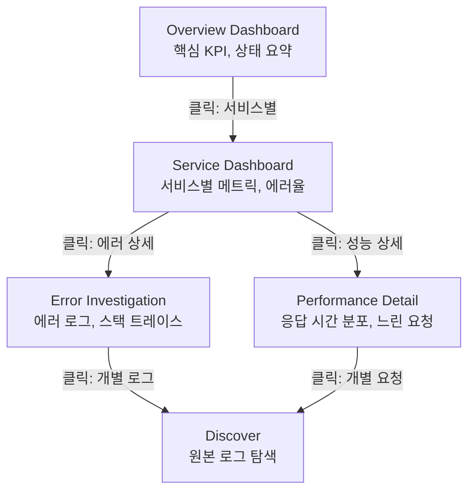
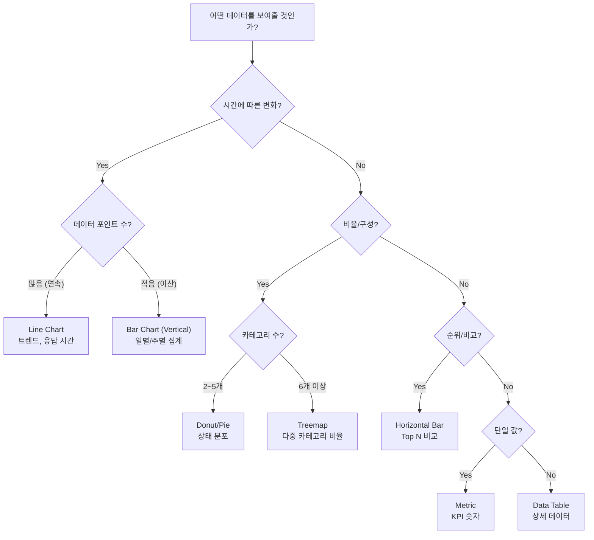
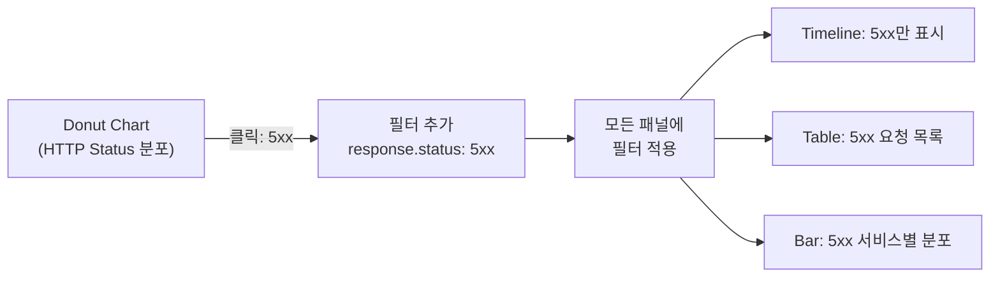
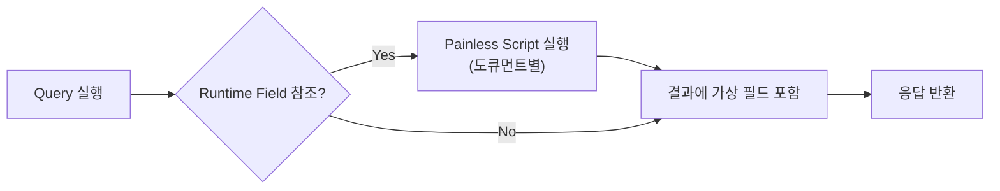
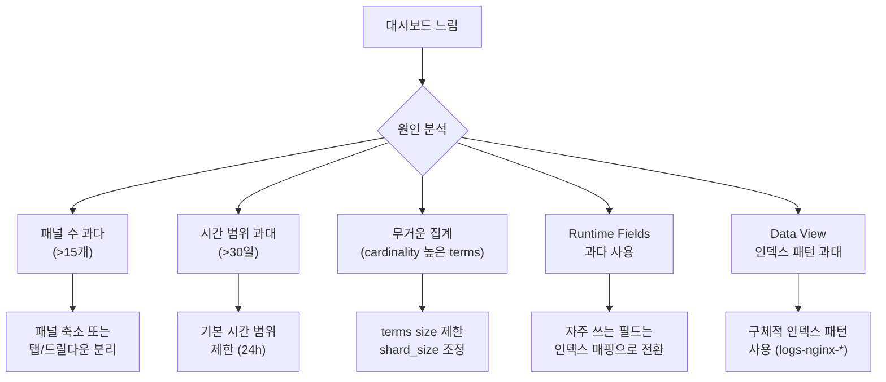

# Kibana 대시보드 실전 설계

Kibana 대시보드의 레이아웃 설계, Lens 시각화, 필터 연동, Runtime Fields, 성능 최적화까지 프로덕션 환경에서 효과적인 대시보드를 구축하는 전략을 다룬다.

## 목차
- [1. 핵심 개념 (What)](#1-핵심-개념-what)
- [2. 왜 알아야 하는가 (Why)](#2-왜-알아야-하는가-why)
- [3. 내부 구현 분석 (How)](#3-내부-구현-분석-how)
- [4. 실전 예제](#4-실전-예제)
- [5. 정리](#5-정리)

---

## 1. 핵심 개념 (What)

### 대시보드 구성 요소

Kibana 대시보드는 여러 시각화 패널을 하나의 화면에 배치하여 데이터를 종합적으로 분석할 수 있게 해주는 컨테이너다.

| 구성 요소 | 역할 |
|-----------|------|
| **Panel** | 개별 시각화 단위 (Lens, TSVB, Vega, Metric, Map 등) |
| **Controls** | 사용자 인터랙션 필터 (드롭다운, 슬라이더, 시간 범위) |
| **Filter Bar** | 전역 필터, KQL/Lucene 쿼리 |
| **Time Picker** | 전역 시간 범위 제어 |
| **Drilldown** | 패널 클릭 시 다른 대시보드/URL로 연결 |

### 대시보드 설계 계층

```
Level 0: Executive Overview (경영진/PM)
  └─ 핵심 KPI, 전체 트렌드, 상태 요약
  
Level 1: Operational Dashboard (운영팀)
  └─ 서비스별 상태, 에러율, 응답 시간 분포
  
Level 2: Detail / Investigation (엔지니어)
  └─ 개별 로그, 트레이스, 상세 메트릭
```

### Lens vs 기타 시각화 도구

| 도구 | 사용 시점 | 복잡도 |
|------|-----------|--------|
| **Lens** | 대부분의 시각화 (권장 기본값) | 낮음 |
| **TSVB** | 고급 시계열 분석, 수식 기반 | 중간 |
| **Vega/Vega-Lite** | 완전한 커스텀 시각화 | 높음 |
| **Maps** | 지리 데이터 시각화 | 중간 |
| **Discover** | 원본 로그 탐색, 임시 분석 | 낮음 |

---

## 2. 왜 알아야 하는가 (Why)

### 나쁜 대시보드의 실제 비용

**문제 1: 모든 것을 보여주는 대시보드**

패널 20개 이상, 서로 다른 시간 범위와 인덱스를 참조하는 대시보드는 로딩에 30초 이상 걸리고, 정작 중요한 정보를 찾기 어렵다. 아무도 사용하지 않는 대시보드가 된다.

**문제 2: 컨텍스트 없는 숫자**

"오류 1,247건"이라는 숫자만으로는 심각도를 판단할 수 없다. 전일 대비 변화율, 정상 범위 기준선, 영향 받는 서비스 범위 등 컨텍스트가 있어야 액션으로 이어진다.

**문제 3: 드릴다운 경로 부재**

Overview 대시보드에서 이상 징후를 발견해도 원인을 파고들 수 있는 경로가 없으면, 결국 Discover에서 수동 검색을 시작한다. 설계된 드릴다운 경로가 MTTD(Mean Time To Detect)와 MTTR(Mean Time To Resolve)을 크게 줄인다.

### 좋은 대시보드의 조건

- **5초 안에 핵심 상태를 파악**할 수 있다
- **이상 징후에서 원인까지의 경로**가 명확하다
- **로딩 시간이 3초 이내**다
- **대상 사용자의 역할**에 맞는 정보 수준을 제공한다

---

## 3. 내부 구현 분석 (How)

### 3.1 대시보드 레이아웃 패턴

#### Overview → Detail 드릴다운 패턴



#### 레이아웃 그리드 설계

Kibana 대시보드는 48열 그리드 시스템을 사용한다.

```
┌──────────────── 48 columns ────────────────┐
│ ┌──────────┐ ┌──────────┐ ┌──────────┐     │  Row 1: KPI Metrics
│ │ Metric 1 │ │ Metric 2 │ │ Metric 3 │     │  (높이: 4~6 units)
│ └──────────┘ └──────────┘ └──────────┘     │
│ ┌────────────────────────────────────┐     │  Row 2: Primary Chart
│ │                                    │     │  (높이: 12~15 units)
│ │        Main Timeline Chart         │     │
│ │                                    │     │
│ └────────────────────────────────────┘     │
│ ┌─────────────────┐ ┌─────────────────┐   │  Row 3: Secondary
│ │  Breakdown       │ │  Top N Table    │   │  (높이: 10~12 units)
│ │  (Pie/Donut)     │ │                 │   │
│ └─────────────────┘ └─────────────────┘   │
│ ┌────────────────────────────────────┐     │  Row 4: Data Table
│ │         Detail Table               │     │  (높이: 10~15 units)
│ └────────────────────────────────────┘     │
└────────────────────────────────────────────┘
```

**레이아웃 원칙**:

| 위치 | 콘텐츠 | 이유 |
|------|--------|------|
| 최상단 | KPI Metric 카드 (3~5개) | 가장 먼저 눈에 들어옴 |
| 상단 중앙 | 시계열 차트 (메인 트렌드) | 시간 흐름에 따른 패턴 파악 |
| 중앙 좌/우 | 분포 차트 + 순위 테이블 | 구성 비율과 Top N 확인 |
| 하단 | 데이터 테이블 | 상세 데이터 확인 |

### 3.2 Lens 시각화 활용

#### 차트 유형 선택 가이드



#### Lens 수식 (Formula) 활용

Lens Formula를 사용하면 복잡한 메트릭을 하나의 시각화에서 계산할 수 있다.

**에러율 계산**:

```
# Error Rate (%)
count(kql='response.status_code >= 500') / count() * 100
```

**p99 응답 시간**:

```
# p99 Response Time
percentile(response.duration, percentile=99)
```

**전일 대비 변화율**:

```
# Day-over-Day Change (%)
(count() - count(shift='1d')) / count(shift='1d') * 100
```

**이동 평균 (Moving Average)**:

```
# 5-bucket Moving Average of Error Count
moving_average(count(kql='level:ERROR'), window=5)
```

**누적 합계**:

```
# Cumulative Sum of Bytes
cumulative_sum(sum(bytes))
```

#### Lens Reference Line 활용

임계치 기준선을 추가하여 시각적으로 이상 여부를 즉시 파악할 수 있다.

```
Reference Lines 설정:
  - SLO Target (99.9%): value=99.9, color=green, style=dashed
  - Warning Threshold: value=99.5, color=yellow, style=dotted
  - Critical Threshold: value=99.0, color=red, style=solid
```

### 3.3 필터 연동과 Controls 패널

#### Controls 패널 유형

| 유형 | 용도 | 설정 |
|------|------|------|
| **Options List** | 필드 값 드롭다운 선택 | 단일/다중 선택, 존재하는 값 자동 로드 |
| **Range Slider** | 숫자 범위 필터 | 최소/최대, 스텝 설정 |
| **Time Slider** | 시간 범위 애니메이션 | 시간 흐름에 따른 데이터 변화 관찰 |

#### Controls 패널 설정 (Saved Object API)

```json
POST kbn:/api/kibana/dashboards/import
{
  "objects": [
    {
      "type": "dashboard",
      "attributes": {
        "controlGroupInput": {
          "controlStyle": "oneLine",
          "chainingSystem": "HIERARCHICAL",
          "showApplySelections": false,
          "ignoreParentSettingsJSON": "{\"ignoreValidations\":false}",
          "panelsJSON": {
            "control_env": {
              "order": 0,
              "width": "small",
              "type": "optionsListControl",
              "explicitInput": {
                "fieldName": "environment",
                "title": "Environment",
                "selectedOptions": [],
                "singleSelect": true,
                "dataViewId": "logs-*"
              }
            },
            "control_service": {
              "order": 1,
              "width": "medium",
              "type": "optionsListControl",
              "explicitInput": {
                "fieldName": "service.name",
                "title": "Service",
                "selectedOptions": [],
                "singleSelect": false,
                "dataViewId": "logs-*"
              }
            },
            "control_level": {
              "order": 2,
              "width": "small",
              "type": "optionsListControl",
              "explicitInput": {
                "fieldName": "log.level",
                "title": "Log Level",
                "selectedOptions": [],
                "singleSelect": false,
                "dataViewId": "logs-*"
              }
            }
          }
        }
      }
    }
  ]
}
```

#### Hierarchical Chaining

Controls의 `chainingSystem: "HIERARCHICAL"` 설정을 사용하면, 앞 컨트롤의 선택이 뒤 컨트롤의 옵션을 자동 필터링한다.

```
[Environment: prod] → [Service: order-svc, payment-svc, ...] → [Level: ERROR, WARN]
      ↓ prod 선택                  ↓ prod 환경의 서비스만 표시          ↓ 선택된 서비스의 레벨만 표시
```

#### 패널 간 필터 연동 (Drilldown)



**Drilldown 설정 (대시보드 → 대시보드)**:

Kibana UI에서 패널 > Actions > Create drilldown으로 설정한다.

```
Drilldown 구성:
  Trigger: Panel click (차트 요소 클릭 시)
  Action: Go to dashboard
  Target: "Service Detail Dashboard"
  
  Filters to carry over:
    - Use clicked element value as filter
    - {{context.panel.filters}}
    
  URL Drilldown (외부 시스템 연동):
    URL Template: https://grafana.internal/d/abc123?var-service={{event.value}}&from={{context.panel.timeRange.from}}&to={{context.panel.timeRange.to}}
```

### 3.4 Runtime Fields 활용

Runtime Fields는 인덱싱 시점이 아닌 쿼리 시점에 계산되는 가상 필드다. 인덱스 재색인 없이 새로운 필드를 추가하거나 기존 필드를 변환할 수 있다.

#### Runtime Field 동작 원리



#### Data View에서 Runtime Field 추가

```json
PUT logs-*/_mapping
{
  "runtime": {
    "response_time_category": {
      "type": "keyword",
      "script": {
        "source": """
          double duration = doc['response.duration_ms'].value;
          if (duration < 100) {
            emit('fast');
          } else if (duration < 500) {
            emit('normal');
          } else if (duration < 2000) {
            emit('slow');
          } else {
            emit('critical');
          }
        """
      }
    },
    "hour_of_day": {
      "type": "long",
      "script": {
        "source": """
          emit(doc['@timestamp'].value.getHour());
        """
      }
    },
    "request_path_group": {
      "type": "keyword",
      "script": {
        "source": """
          String path = doc['url.path.keyword'].value;
          if (path.startsWith('/api/v1/users')) {
            emit('/api/v1/users/*');
          } else if (path.startsWith('/api/v1/orders')) {
            emit('/api/v1/orders/*');
          } else if (path.startsWith('/api/v1/payments')) {
            emit('/api/v1/payments/*');
          } else if (path.startsWith('/health')) {
            emit('/health');
          } else {
            emit(path);
          }
        """
      }
    },
    "is_error": {
      "type": "boolean",
      "script": {
        "source": """
          int status = doc['response.status_code'].value;
          emit(status >= 400);
        """
      }
    },
    "client_geo_summary": {
      "type": "keyword",
      "script": {
        "source": """
          String country = doc['geoip.country_name.keyword'].value;
          String city = doc['geoip.city_name.keyword'].value;
          emit(country + ' / ' + city);
        """
      }
    }
  }
}
```

#### Kibana Data View에서 Runtime Field 추가 (UI)

Kibana > Stack Management > Data Views > 해당 Data View > Add field 에서 설정 가능하다.

```
Name: response_time_bucket
Type: Keyword
Script:
  double ms = doc['response.duration_ms'].value;
  if (ms <= 100) emit('0-100ms');
  else if (ms <= 300) emit('100-300ms');
  else if (ms <= 1000) emit('300ms-1s');
  else emit('>1s');
```

#### Runtime Field 사용 시 주의사항

| 항목 | 설명 |
|------|------|
| **성능** | 매 쿼리마다 스크립트 실행, 대량 도큐먼트에서 느릴 수 있음 |
| **사용 범위** | 대시보드 필터, 시각화 집계, Discover에서 모두 사용 가능 |
| **적합한 경우** | 필드 분류, 라벨링, 간단한 계산, 마스킹 |
| **부적합한 경우** | 고빈도 쿼리의 집계 필드, 복잡한 문자열 조작 |

자주 사용되는 Runtime Field는 인덱스 매핑에 일반 필드로 추가하는 것이 성능상 유리하다.

### 3.5 대시보드 성능 최적화

#### 성능 병목 원인



#### 쿼리 최소화 전략

**1. Saved Search 재사용**

동일한 Base Query를 여러 패널이 공유하면, 각 패널이 독립적으로 쿼리를 실행한다. Saved Search 기반 패널을 사용하면 Elasticsearch 쿼리 캐시를 효과적으로 활용할 수 있다.

**2. 시간 범위 최적화**

```yaml
# 대시보드 기본 시간 범위 권장
Overview Dashboard:     Last 24 hours    (refresh: 30s)
Service Dashboard:      Last 4 hours     (refresh: 15s)
Investigation:          Last 1 hour      (refresh: off)
Historical Analysis:    Custom range     (refresh: off)
```

**3. 집계 최적화**

```json
// BAD: 높은 cardinality terms 집계
{
  "aggs": {
    "top_urls": {
      "terms": {
        "field": "url.full.keyword",
        "size": 1000
      }
    }
  }
}

// GOOD: 그룹화된 필드 사용 + size 제한
{
  "aggs": {
    "top_paths": {
      "terms": {
        "field": "url.path_group.keyword",
        "size": 20
      }
    }
  }
}
```

**4. 패널별 시간 오프셋 주의**

패널에 개별 시간 오프셋(예: "1 day ago")을 설정하면 해당 패널은 전역 시간 범위와 다른 쿼리를 보내므로 캐시 효율이 떨어진다. 전일 대비를 보여주려면 Lens Formula의 `shift` 기능을 사용하는 것이 낫다.

#### 성능 점검 체크리스트

```bash
# Kibana에서 대시보드 성능 확인
# Browser DevTools > Network 탭에서 확인

# 1. 총 요청 수 확인 (패널 수 x 쿼리 수)
#    목표: 20개 이하

# 2. 가장 느린 요청 식별
#    _search 요청의 응답 시간 확인

# 3. Elasticsearch Slow Log로 느린 쿼리 확인
PUT _cluster/settings
{
  "persistent": {
    "index.search.slowlog.threshold.query.warn": "5s",
    "index.search.slowlog.threshold.query.info": "2s",
    "index.search.slowlog.threshold.fetch.warn": "1s"
  }
}
```

---

## 4. 실전 예제

### 4.1 서비스 Overview 대시보드 설계

```
┌─────────────── Service Overview Dashboard ───────────────┐
│ [Controls: Environment | Service | Time Range]            │
│                                                           │
│ ┌──────────┐ ┌──────────┐ ┌──────────┐ ┌──────────┐     │
│ │ Total    │ │ Error    │ │  p99     │ │ Uptime   │     │
│ │ Requests │ │ Rate (%) │ │ Latency  │ │ (%)      │     │
│ │ 1.2M     │ │ 0.3% ▼  │ │ 245ms ▲ │ │ 99.97%   │     │
│ └──────────┘ └──────────┘ └──────────┘ └──────────┘     │
│                                                           │
│ ┌────────────────────────────────────────────────────┐   │
│ │        Request Rate & Error Rate (Timeline)        │   │
│ │  ═══════════════════════════════                    │   │
│ │  ─ ─ ─ ─ ─ ─ (errors, red)                        │   │
│ │  --- Reference: SLO 99.9% ---                      │   │
│ └────────────────────────────────────────────────────┘   │
│                                                           │
│ ┌──────────────────────┐ ┌──────────────────────┐       │
│ │  Response Time       │ │  Top 10 Endpoints    │       │
│ │  Distribution        │ │  by Error Count      │       │
│ │  (Heatmap)           │ │  (Horizontal Bar)    │       │
│ └──────────────────────┘ └──────────────────────┘       │
│                                                           │
│ ┌────────────────────────────────────────────────────┐   │
│ │  Recent Errors (Table: timestamp, service,         │   │
│ │                  endpoint, status, message)         │   │
│ │  [Drilldown → Error Investigation Dashboard]       │   │
│ └────────────────────────────────────────────────────┘   │
└───────────────────────────────────────────────────────────┘
```

### 4.2 Lens 패널 구성 (Kibana Saved Object)

**에러율 시계열 차트 (Saved Object Export)**:

```json
{
  "attributes": {
    "title": "Error Rate Timeline",
    "visualizationType": "lnsXY",
    "state": {
      "visualization": {
        "legend": { "isVisible": true, "position": "right" },
        "valueLabels": "hide",
        "preferredSeriesType": "line",
        "layers": [
          {
            "layerId": "layer1",
            "layerType": "data",
            "seriesType": "line",
            "accessors": ["error_rate"],
            "xAccessor": "timestamp",
            "yConfig": [
              {
                "forAccessor": "error_rate",
                "color": "#E7664C",
                "axisMode": "left"
              }
            ]
          },
          {
            "layerId": "reference",
            "layerType": "referenceLine",
            "accessors": ["slo_line"],
            "yConfig": [
              {
                "forAccessor": "slo_line",
                "color": "#54B399",
                "lineStyle": "dashed",
                "lineWidth": 2,
                "fill": "none"
              }
            ]
          }
        ]
      },
      "query": { "query": "", "language": "kuery" },
      "datasourceStates": {
        "formBased": {
          "layers": {
            "layer1": {
              "columns": {
                "timestamp": {
                  "operationType": "date_histogram",
                  "sourceField": "@timestamp",
                  "params": { "interval": "auto" }
                },
                "error_rate": {
                  "operationType": "formula",
                  "params": {
                    "formula": "count(kql='response.status_code >= 500') / count() * 100",
                    "format": { "id": "percent", "params": { "decimals": 2 } }
                  }
                }
              }
            },
            "reference": {
              "columns": {
                "slo_line": {
                  "operationType": "static_value",
                  "params": { "value": "0.1" }
                }
              }
            }
          }
        }
      }
    }
  }
}
```

### 4.3 대시보드 Import/Export 자동화

```bash
#!/bin/bash
# dashboard_sync.sh - 대시보드 Git 기반 버전 관리

KIBANA_URL="https://kibana.internal:5601"
KIBANA_USER="admin"
KIBANA_PASS="${KIBANA_PWD}"
EXPORT_DIR="./kibana-dashboards"
SPACE="default"

CURL="curl -s -u ${KIBANA_USER}:${KIBANA_PASS} --cacert /etc/pki/ca.crt"

# Export
export_dashboard() {
  local DASHBOARD_ID="$1"
  local FILENAME="$2"
  
  $CURL -X POST "${KIBANA_URL}/s/${SPACE}/api/kibana/dashboards/export" \
    -H 'kbn-xsrf: true' \
    -H 'Content-Type: application/json' \
    -d "{\"objects\": [{\"type\": \"dashboard\", \"id\": \"${DASHBOARD_ID}\"}]}" \
    | python3 -m json.tool > "${EXPORT_DIR}/${FILENAME}.ndjson"
  
  echo "Exported: ${FILENAME}"
}

# Import
import_dashboard() {
  local FILENAME="$1"
  
  $CURL -X POST "${KIBANA_URL}/s/${SPACE}/api/kibana/dashboards/import?force=true" \
    -H 'kbn-xsrf: true' \
    -H 'Content-Type: application/json' \
    -d @"${EXPORT_DIR}/${FILENAME}.ndjson"
  
  echo "Imported: ${FILENAME}"
}

# 전체 Export
export_all() {
  mkdir -p "${EXPORT_DIR}"
  
  # 대시보드 목록 조회
  $CURL "${KIBANA_URL}/s/${SPACE}/api/saved_objects/_find?type=dashboard&per_page=100" | \
    python3 -c "
import sys, json
data = json.load(sys.stdin)
for obj in data['saved_objects']:
    print(f\"{obj['id']}|{obj['attributes']['title']}\")
" | while IFS='|' read -r id title; do
    safe_name=$(echo "$title" | tr ' /' '-_' | tr '[:upper:]' '[:lower:]')
    export_dashboard "$id" "$safe_name"
  done
}

case "$1" in
  export) export_dashboard "$2" "$3" ;;
  import) import_dashboard "$2" ;;
  export-all) export_all ;;
  *) echo "Usage: $0 {export <id> <name>|import <name>|export-all}" ;;
esac
```

### 4.4 Vega 커스텀 시각화 (Heatmap 예시)

Controls와 Lens로 해결이 안 되는 고급 시각화에는 Vega를 사용한다.

```json
{
  "$schema": "https://vega.github.io/schema/vega-lite/v5.json",
  "title": "Request Latency Heatmap by Hour",
  "data": {
    "url": {
      "index": "logs-*",
      "body": {
        "size": 0,
        "query": {
          "bool": {
            "filter": [
              { "range": { "@timestamp": { "gte": "now-7d" } } },
              "%dashboard_context-must_clause%"
            ]
          }
        },
        "aggs": {
          "by_hour": {
            "histogram": {
              "field": "hour_of_day",
              "interval": 1,
              "min_doc_count": 0
            },
            "aggs": {
              "by_day": {
                "date_histogram": {
                  "field": "@timestamp",
                  "calendar_interval": "day"
                },
                "aggs": {
                  "p95_latency": {
                    "percentiles": {
                      "field": "response.duration_ms",
                      "percents": [95]
                    }
                  }
                }
              }
            }
          }
        }
      }
    },
    "format": { "property": "aggregations.by_hour.buckets" }
  },
  "transform": [
    { "flatten": ["by_day.buckets"], "as": ["day_bucket"] },
    {
      "calculate": "datum.day_bucket.p95_latency.values['95.0']",
      "as": "p95"
    },
    {
      "calculate": "datum.day_bucket.key_as_string",
      "as": "day"
    }
  ],
  "mark": "rect",
  "encoding": {
    "x": {
      "field": "day",
      "type": "ordinal",
      "timeUnit": "yearmonthdate",
      "title": "Date"
    },
    "y": {
      "field": "key",
      "type": "ordinal",
      "title": "Hour of Day"
    },
    "color": {
      "field": "p95",
      "type": "quantitative",
      "title": "p95 Latency (ms)",
      "scale": {
        "scheme": "redyellowgreen",
        "reverse": true,
        "domain": [0, 500, 2000]
      }
    },
    "tooltip": [
      { "field": "day", "type": "temporal", "title": "Date" },
      { "field": "key", "type": "ordinal", "title": "Hour" },
      { "field": "p95", "type": "quantitative", "title": "p95 (ms)", "format": ".0f" }
    ]
  }
}
```

### 4.5 프로그래밍 방식 대시보드 생성 (Kibana API)

```bash
# 대시보드 프로그래밍 방식 생성
curl -X POST "https://kibana.internal:5601/api/saved_objects/dashboard/service-overview-v1" \
  -H 'kbn-xsrf: true' \
  -H 'Content-Type: application/json' \
  -u "admin:${KIBANA_PWD}" \
  --cacert /etc/pki/ca.crt \
  -d '{
  "attributes": {
    "title": "Service Overview v1",
    "description": "Production service health overview with drilldown",
    "panelsJSON": "[]",
    "optionsJSON": "{\"useMargins\":true,\"syncColors\":true,\"syncCursor\":true,\"syncTooltips\":true,\"hidePanelTitles\":false}",
    "timeRestore": true,
    "timeTo": "now",
    "timeFrom": "now-24h",
    "refreshInterval": {
      "pause": false,
      "value": 30000
    },
    "kibanaSavedObjectMeta": {
      "searchSourceJSON": "{\"query\":{\"query\":\"\",\"language\":\"kuery\"},\"filter\":[]}"
    }
  }
}'
```

---

## 5. 정리

| 항목 | 핵심 포인트 |
|------|-------------|
| **레이아웃 패턴** | Overview → Detail 드릴다운 계층, 상단 KPI → 중앙 트렌드 → 하단 상세 |
| **Lens 활용** | Formula로 에러율/변화율 계산, Reference Line으로 SLO 기준선, shift로 전일 비교 |
| **차트 선택** | 시계열=Line, 비율=Donut, 순위=Horizontal Bar, 단일값=Metric |
| **Controls** | Options List + Hierarchical Chaining으로 계층적 필터링 |
| **Runtime Fields** | 쿼리 시점 가상 필드, 분류/라벨링에 적합, 고빈도 집계에는 부적합 |
| **Drilldown** | 패널 클릭 → 대시보드 이동, URL Drilldown으로 외부 연동 |
| **성능 최적화** | 패널 15개 이하, 시간 범위 제한, terms size 축소, 구체적 인덱스 패턴 |
| **버전 관리** | Saved Object Export/Import API로 Git 기반 관리 |

### 대시보드 설계 체크리스트

- [ ] 대상 사용자(경영진/운영/엔지니어)에 맞는 정보 수준 결정
- [ ] 핵심 KPI 3~5개 선정 및 최상단 배치
- [ ] Overview → Detail 드릴다운 경로 설계
- [ ] Controls로 Environment, Service 필터 구성
- [ ] 기본 시간 범위와 자동 새로고침 간격 설정
- [ ] 패널 수 15개 이하 유지
- [ ] Runtime Field 사용 시 성능 영향 검토
- [ ] Slow Log 활성화로 느린 쿼리 모니터링
- [ ] 대시보드 Export → Git 버전 관리 자동화

---
*참고: Elasticsearch 8.x / Logstash 8.x / Kibana 8.x 기준*
