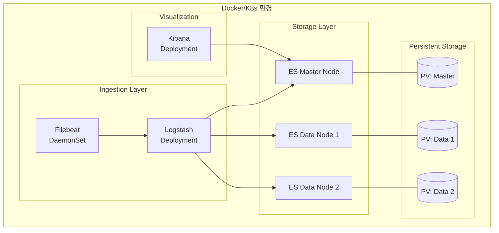
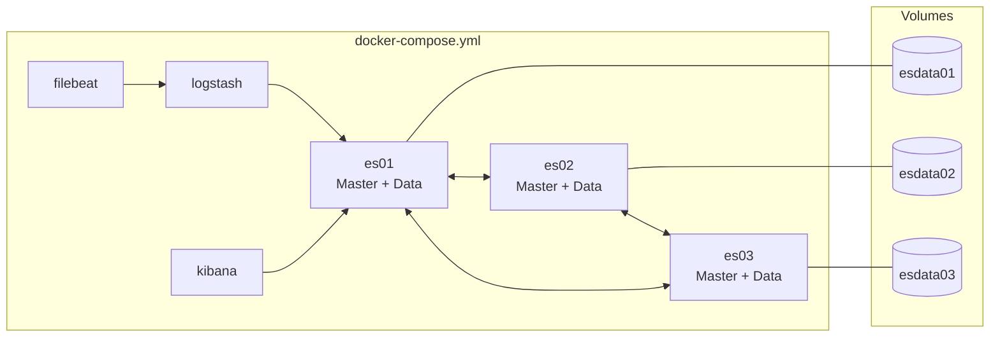
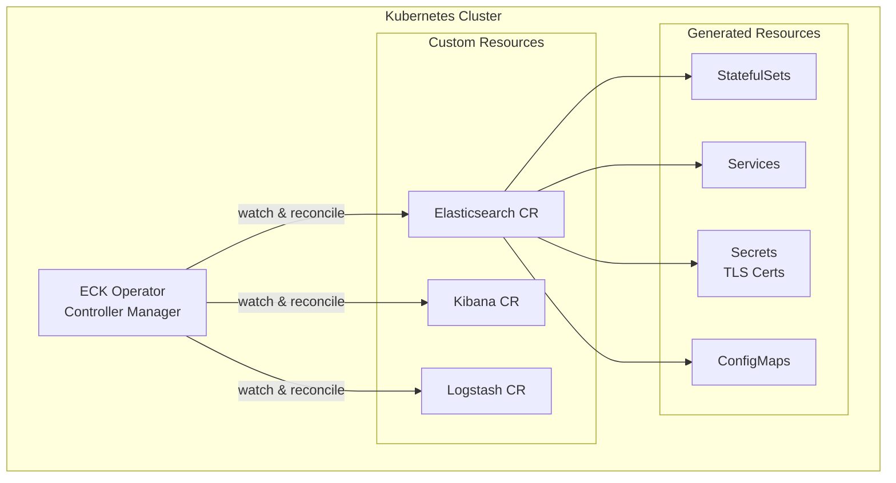
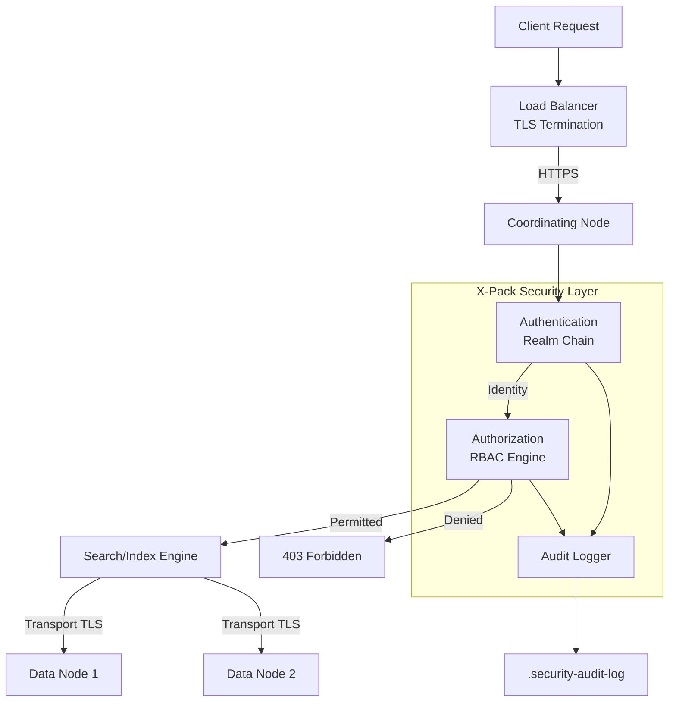

# Docker/K8s 환경에서 ELK 스택 배포

컨테이너 환경에서 ELK 스택을 안정적으로 배포하고 운영하기 위한 실전 가이드. Docker Compose 기반 단일 서버 구성부터 Kubernetes ECK Operator를 활용한 프로덕션 배포까지 다룬다.

## 목차
- [1. 핵심 개념 (What)](#1-핵심-개념-what)
- [2. 왜 알아야 하는가 (Why)](#2-왜-알아야-하는가-why)
- [3. 내부 구현 분석 (How)](#3-내부-구현-분석-how)
- [4. 실전 예제](#4-실전-예제)
- [5. 정리](#5-정리)

---

## 1. 핵심 개념 (What)

### 컨테이너 기반 ELK 배포의 구성 요소

ELK 스택의 컨테이너 배포는 크게 세 가지 방식으로 나뉜다:

| 배포 방식 | 적합 환경 | 복잡도 |
|-----------|-----------|--------|
| Docker Compose | 개발/테스트, 소규모 운영 | 낮음 |
| Helm Chart | Kubernetes 기본 배포 | 중간 |
| ECK Operator | Kubernetes 프로덕션 운영 | 높음 |

### 핵심 구성 요소



- **Elasticsearch**: StatefulSet으로 배포하여 안정적인 네트워크 ID와 영속 볼륨 보장
- **Logstash**: Deployment로 배포, 스케일 아웃 가능
- **Kibana**: Deployment로 배포, 단일 인스턴스 또는 로드밸런서 뒤 다중 인스턴스
- **Filebeat**: DaemonSet으로 모든 노드에서 로그 수집

---

## 2. 왜 알아야 하는가 (Why)

### 베어메탈 대비 컨테이너 배포의 이점

1. **재현 가능한 환경**: docker-compose.yml 또는 Helm values.yaml 하나로 동일한 환경을 어디서든 재현
2. **스케일링 용이**: `kubectl scale` 명령 한 줄로 Data Node 증설
3. **롤링 업그레이드**: 무중단으로 Elasticsearch 버전 업그레이드 가능
4. **리소스 격리**: 컨테이너 단위로 CPU/Memory 제한을 걸어 노이지 네이버 문제 방지
5. **자동 복구**: Pod가 죽으면 Kubernetes가 자동 재시작

### 실무에서 흔히 겪는 문제

- Elasticsearch는 **메모리 집약적**이므로 컨테이너 리소스 설정이 매우 중요
- JVM 힙 크기와 컨테이너 메모리 제한의 불일치로 인한 OOM Kill
- 영속 볼륨 없이 배포하면 Pod 재시작 시 데이터 유실
- `vm.max_map_count` 커널 파라미터 미설정으로 인한 부팅 실패

---

## 3. 내부 구현 분석 (How)

### 3.1 Docker Compose 기반 배포 아키텍처



**핵심 설정 포인트**:

- `discovery.seed_hosts`: 클러스터 노드 디스커버리
- `cluster.initial_master_nodes`: 최초 마스터 선출
- `ES_JAVA_OPTS`: JVM 힙 크기 (컨테이너 메모리의 50% 이하)
- `ulimits.memlock`: 메모리 락 설정으로 스왑 방지

### 3.2 ECK (Elastic Cloud on Kubernetes) Operator

ECK Operator는 Elasticsearch, Kibana, Logstash 등의 Elastic 리소스를 **Custom Resource Definition(CRD)** 으로 관리한다.



**ECK가 자동으로 처리하는 것들**:
- TLS 인증서 생성 및 로테이션
- 클러스터 노드 디스커버리 설정
- Rolling Upgrade 오케스트레이션
- 사용자 인증 (elastic 사용자 비밀번호 자동 생성)

### 3.3 리소스 설정 가이드라인

| 구성 요소 | CPU Request | CPU Limit | Memory Request | Memory Limit |
|-----------|-------------|-----------|----------------|--------------|
| ES Master | 500m | 1000m | 2Gi | 2Gi |
| ES Data | 1000m | 2000m | 4Gi | 8Gi |
| Logstash | 500m | 1000m | 1Gi | 2Gi |
| Kibana | 250m | 500m | 512Mi | 1Gi |
| Filebeat | 100m | 200m | 128Mi | 256Mi |

> **중요**: Elasticsearch의 Memory Request와 Limit은 동일하게 설정하여 OOM Kill을 방지한다. JVM 힙은 컨테이너 메모리의 50%로 설정한다.

---

## 4. 실전 예제

### 4.1 프로덕션 Docker Compose 구성

```yaml
# docker-compose.yml
version: "3.8"

services:
  # --- Elasticsearch Cluster (3 Nodes) ---
  es01:
    image: docker.elastic.co/elasticsearch/elasticsearch:8.12.0
    container_name: es01
    environment:
      - node.name=es01
      - cluster.name=production-cluster
      - discovery.seed_hosts=es02,es03
      - cluster.initial_master_nodes=es01,es02,es03
      - bootstrap.memory_lock=true
      - ES_JAVA_OPTS=-Xms4g -Xmx4g
      - xpack.security.enabled=true
      - xpack.security.transport.ssl.enabled=true
      - xpack.security.transport.ssl.keystore.path=certs/elastic-certificates.p12
      - xpack.security.transport.ssl.truststore.path=certs/elastic-certificates.p12
      - xpack.security.http.ssl.enabled=true
      - xpack.security.http.ssl.keystore.path=certs/elastic-certificates.p12
      - ELASTIC_PASSWORD=${ELASTIC_PASSWORD}
    ulimits:
      memlock:
        soft: -1
        hard: -1
      nofile:
        soft: 65536
        hard: 65536
    volumes:
      - esdata01:/usr/share/elasticsearch/data
      - ./certs:/usr/share/elasticsearch/config/certs:ro
    ports:
      - "9200:9200"
    networks:
      - elastic
    deploy:
      resources:
        limits:
          memory: 8G
        reservations:
          memory: 8G
    healthcheck:
      test: >
        curl -s -k https://localhost:9200/_cluster/health
        -u elastic:${ELASTIC_PASSWORD} | grep -q '"status":"green"\|"status":"yellow"'
      interval: 30s
      timeout: 10s
      retries: 5

  es02:
    image: docker.elastic.co/elasticsearch/elasticsearch:8.12.0
    container_name: es02
    environment:
      - node.name=es02
      - cluster.name=production-cluster
      - discovery.seed_hosts=es01,es03
      - cluster.initial_master_nodes=es01,es02,es03
      - bootstrap.memory_lock=true
      - ES_JAVA_OPTS=-Xms4g -Xmx4g
      - xpack.security.enabled=true
      - xpack.security.transport.ssl.enabled=true
      - xpack.security.transport.ssl.keystore.path=certs/elastic-certificates.p12
      - xpack.security.transport.ssl.truststore.path=certs/elastic-certificates.p12
      - ELASTIC_PASSWORD=${ELASTIC_PASSWORD}
    ulimits:
      memlock:
        soft: -1
        hard: -1
    volumes:
      - esdata02:/usr/share/elasticsearch/data
      - ./certs:/usr/share/elasticsearch/config/certs:ro
    networks:
      - elastic
    deploy:
      resources:
        limits:
          memory: 8G
        reservations:
          memory: 8G

  es03:
    image: docker.elastic.co/elasticsearch/elasticsearch:8.12.0
    container_name: es03
    environment:
      - node.name=es03
      - cluster.name=production-cluster
      - discovery.seed_hosts=es01,es02
      - cluster.initial_master_nodes=es01,es02,es03
      - bootstrap.memory_lock=true
      - ES_JAVA_OPTS=-Xms4g -Xmx4g
      - xpack.security.enabled=true
      - xpack.security.transport.ssl.enabled=true
      - xpack.security.transport.ssl.keystore.path=certs/elastic-certificates.p12
      - xpack.security.transport.ssl.truststore.path=certs/elastic-certificates.p12
      - ELASTIC_PASSWORD=${ELASTIC_PASSWORD}
    ulimits:
      memlock:
        soft: -1
        hard: -1
    volumes:
      - esdata03:/usr/share/elasticsearch/data
      - ./certs:/usr/share/elasticsearch/config/certs:ro
    networks:
      - elastic
    deploy:
      resources:
        limits:
          memory: 8G
        reservations:
          memory: 8G

  # --- Logstash ---
  logstash:
    image: docker.elastic.co/logstash/logstash:8.12.0
    container_name: logstash
    environment:
      - LS_JAVA_OPTS=-Xms1g -Xmx1g
      - xpack.monitoring.elasticsearch.hosts=https://es01:9200
      - xpack.monitoring.elasticsearch.username=elastic
      - xpack.monitoring.elasticsearch.password=${ELASTIC_PASSWORD}
      - xpack.monitoring.elasticsearch.ssl.certificate_authority=/usr/share/logstash/config/certs/ca.crt
    volumes:
      - ./logstash/pipeline:/usr/share/logstash/pipeline:ro
      - ./logstash/config/logstash.yml:/usr/share/logstash/config/logstash.yml:ro
      - ./certs:/usr/share/logstash/config/certs:ro
    ports:
      - "5044:5044"   # Beats input
      - "9600:9600"   # Monitoring API
    networks:
      - elastic
    depends_on:
      es01:
        condition: service_healthy
    deploy:
      resources:
        limits:
          memory: 2G

  # --- Kibana ---
  kibana:
    image: docker.elastic.co/kibana/kibana:8.12.0
    container_name: kibana
    environment:
      - ELASTICSEARCH_HOSTS=https://es01:9200
      - ELASTICSEARCH_USERNAME=kibana_system
      - ELASTICSEARCH_PASSWORD=${KIBANA_PASSWORD}
      - ELASTICSEARCH_SSL_CERTIFICATEAUTHORITIES=/usr/share/kibana/config/certs/ca.crt
      - SERVER_SSL_ENABLED=true
      - SERVER_SSL_KEY=/usr/share/kibana/config/certs/kibana.key
      - SERVER_SSL_CERTIFICATE=/usr/share/kibana/config/certs/kibana.crt
    volumes:
      - ./certs:/usr/share/kibana/config/certs:ro
    ports:
      - "5601:5601"
    networks:
      - elastic
    depends_on:
      es01:
        condition: service_healthy
    deploy:
      resources:
        limits:
          memory: 1G

  # --- Filebeat ---
  filebeat:
    image: docker.elastic.co/beats/filebeat:8.12.0
    container_name: filebeat
    user: root
    volumes:
      - ./filebeat/filebeat.yml:/usr/share/filebeat/filebeat.yml:ro
      - /var/lib/docker/containers:/var/lib/docker/containers:ro
      - /var/run/docker.sock:/var/run/docker.sock:ro
    networks:
      - elastic
    depends_on:
      - logstash

volumes:
  esdata01:
    driver: local
  esdata02:
    driver: local
  esdata03:
    driver: local

networks:
  elastic:
    driver: bridge
```

### 4.2 ECK Operator를 활용한 Kubernetes 배포

```bash
# ECK Operator 설치
kubectl create -f https://download.elastic.co/downloads/eck/2.11.0/crds.yaml
kubectl apply -f https://download.elastic.co/downloads/eck/2.11.0/operator.yaml
```

```yaml
# elasticsearch-cluster.yaml
apiVersion: elasticsearch.k8s.elastic.co/v1
kind: Elasticsearch
metadata:
  name: production
  namespace: elastic-system
spec:
  version: 8.12.0
  nodeSets:
    # Master 전용 노드
    - name: master
      count: 3
      config:
        node.roles: ["master"]
        xpack.ml.enabled: false
      podTemplate:
        spec:
          initContainers:
            - name: sysctl
              securityContext:
                privileged: true
                runAsUser: 0
              command: ["sh", "-c", "sysctl -w vm.max_map_count=262144"]
          containers:
            - name: elasticsearch
              resources:
                requests:
                  memory: 2Gi
                  cpu: 500m
                limits:
                  memory: 2Gi
                  cpu: 1
              env:
                - name: ES_JAVA_OPTS
                  value: "-Xms1g -Xmx1g"
      volumeClaimTemplates:
        - metadata:
            name: elasticsearch-data
          spec:
            accessModes: ["ReadWriteOnce"]
            storageClassName: gp3
            resources:
              requests:
                storage: 10Gi

    # Data 노드 (Hot Tier)
    - name: data-hot
      count: 3
      config:
        node.roles: ["data_hot", "data_content", "ingest"]
        node.attr.data_tier: hot
      podTemplate:
        spec:
          initContainers:
            - name: sysctl
              securityContext:
                privileged: true
                runAsUser: 0
              command: ["sh", "-c", "sysctl -w vm.max_map_count=262144"]
          containers:
            - name: elasticsearch
              resources:
                requests:
                  memory: 8Gi
                  cpu: 2
                limits:
                  memory: 8Gi
                  cpu: 4
              env:
                - name: ES_JAVA_OPTS
                  value: "-Xms4g -Xmx4g"
          nodeSelector:
            node-type: elk-data-hot
          tolerations:
            - key: "dedicated"
              operator: "Equal"
              value: "elk"
              effect: "NoSchedule"
      volumeClaimTemplates:
        - metadata:
            name: elasticsearch-data
          spec:
            accessModes: ["ReadWriteOnce"]
            storageClassName: gp3-iops
            resources:
              requests:
                storage: 500Gi

    # Data 노드 (Warm Tier)
    - name: data-warm
      count: 2
      config:
        node.roles: ["data_warm"]
        node.attr.data_tier: warm
      podTemplate:
        spec:
          initContainers:
            - name: sysctl
              securityContext:
                privileged: true
                runAsUser: 0
              command: ["sh", "-c", "sysctl -w vm.max_map_count=262144"]
          containers:
            - name: elasticsearch
              resources:
                requests:
                  memory: 4Gi
                  cpu: 1
                limits:
                  memory: 4Gi
                  cpu: 2
              env:
                - name: ES_JAVA_OPTS
                  value: "-Xms2g -Xmx2g"
      volumeClaimTemplates:
        - metadata:
            name: elasticsearch-data
          spec:
            accessModes: ["ReadWriteOnce"]
            storageClassName: gp3
            resources:
              requests:
                storage: 1Ti

---
# kibana.yaml
apiVersion: kibana.k8s.elastic.co/v1
kind: Kibana
metadata:
  name: production
  namespace: elastic-system
spec:
  version: 8.12.0
  count: 2
  elasticsearchRef:
    name: production
  podTemplate:
    spec:
      containers:
        - name: kibana
          resources:
            requests:
              memory: 512Mi
              cpu: 250m
            limits:
              memory: 1Gi
              cpu: 500m
  http:
    tls:
      selfSignedCertificate:
        disabled: false
```

### 4.3 Helm Chart 기반 배포

```bash
# Elastic Helm 레포 추가
helm repo add elastic https://helm.elastic.co
helm repo update

# Elasticsearch 설치
helm install elasticsearch elastic/elasticsearch \
  --namespace elastic-system \
  --create-namespace \
  -f es-values.yaml

# Kibana 설치
helm install kibana elastic/kibana \
  --namespace elastic-system \
  -f kibana-values.yaml
```

```yaml
# es-values.yaml
replicas: 3
minimumMasterNodes: 2

esJavaOpts: "-Xms4g -Xmx4g"

resources:
  requests:
    cpu: "1000m"
    memory: "8Gi"
  limits:
    cpu: "2000m"
    memory: "8Gi"

volumeClaimTemplate:
  accessModes: ["ReadWriteOnce"]
  storageClassName: "gp3"
  resources:
    requests:
      storage: 200Gi

esConfig:
  elasticsearch.yml: |
    cluster.name: "production"
    xpack.security.enabled: true
    xpack.security.transport.ssl.enabled: true
    xpack.security.transport.ssl.verification_mode: certificate
    xpack.security.http.ssl.enabled: true

extraInitContainers:
  - name: sysctl
    image: busybox
    securityContext:
      privileged: true
    command: ["sh", "-c", "sysctl -w vm.max_map_count=262144"]

tolerations:
  - key: "dedicated"
    operator: "Equal"
    value: "elk"
    effect: "NoSchedule"

nodeSelector:
  node-type: elk

antiAffinity: "hard"

podSecurityPolicy:
  create: false
```

### 4.4 호스트 초기화 스크립트

컨테이너 호스트에서 반드시 실행해야 하는 커널 파라미터 설정:

```bash
#!/bin/bash
# elk-host-init.sh - ELK 호스트 노드 초기화

# Elasticsearch가 요구하는 최소 mmap 카운트
sysctl -w vm.max_map_count=262144
echo "vm.max_map_count=262144" >> /etc/sysctl.conf

# 파일 디스크립터 제한 증가
ulimit -n 65536
echo "* soft nofile 65536" >> /etc/security/limits.conf
echo "* hard nofile 65536" >> /etc/security/limits.conf

# 스왑 비활성화 (Elasticsearch 권장)
swapoff -a
sed -i '/swap/d' /etc/fstab

echo "Host initialization completed for ELK deployment."
```

---

## 5. 정리

| 항목 | Docker Compose | Helm Chart | ECK Operator |
|------|---------------|------------|-------------|
| **적합 환경** | 개발/소규모 | K8s 기본 | K8s 프로덕션 |
| **TLS 자동화** | 수동 설정 | 수동/반자동 | 완전 자동 |
| **Rolling Upgrade** | 수동 | 반자동 | 자동 |
| **스케일링** | 수동 compose 수정 | `helm upgrade` | CR 수정으로 자동 |
| **모니터링 통합** | 별도 구성 | 별도 구성 | Stack Monitoring CRD |
| **복잡도** | 낮음 | 중간 | 높음 (초기 학습) |

### 필수 체크리스트

- `vm.max_map_count=262144` 호스트 커널 설정
- JVM 힙 = 컨테이너 메모리의 50%, 최대 32GB 미만
- Memory Request = Memory Limit (동일하게 설정)
- 영속 볼륨 반드시 연결 (StatefulSet + PVC)
- `bootstrap.memory_lock=true`로 스왑 방지
- 프로덕션에서는 Master / Data 노드 역할 분리
- Anti-Affinity 설정으로 동일 호스트 배치 방지

---

## 보충: X-Pack 보안

> 이 섹션은 infrastructure/ELK 문서에서 통합된 보충 자료로, X-Pack Security를 활용한 인증, 암호화, 접근제어 구성을 다룬다.

### X-Pack Security 핵심 영역

| 영역 | 설명 |
|------|------|
| **TLS/SSL** | 노드 간(Transport), 클라이언트-노드 간(HTTP) 통신 암호화 |
| **Authentication** | 사용자 신원 확인 (Native, LDAP, SAML, OIDC, PKI) |
| **Authorization (RBAC)** | 역할 기반 인덱스/클러스터 수준 접근제어 |
| **API Key** | 서비스 간 인증을 위한 토큰 기반 인증 |
| **Audit Logging** | 보안 이벤트 추적 및 감사 로그 |

### Security Realm Chain

```
요청 → [Native Realm] → [LDAP Realm] → [SAML Realm] → [PKI Realm] → 인증 실패
              ↓                ↓              ↓              ↓
         인증 성공         인증 성공      인증 성공      인증 성공
```

### 보안 아키텍처 전체 흐름



### TLS/SSL 인증서 생성 및 설정

```bash
# CA 생성
bin/elasticsearch-certutil ca \
  --out elastic-stack-ca.p12 \
  --pass "ca-password"

# 노드 인증서 생성 (CA 서명)
bin/elasticsearch-certutil cert \
  --ca elastic-stack-ca.p12 \
  --ca-pass "ca-password" \
  --out elastic-certificates.p12 \
  --pass "cert-password" \
  --dns "es-node-01.example.com,es-node-02.example.com" \
  --ip "10.0.1.10,10.0.1.11"
```

```yaml
# elasticsearch.yml - TLS 설정
xpack.security.enabled: true

# Transport Layer TLS (노드 간 통신)
xpack.security.transport.ssl:
  enabled: true
  verification_mode: certificate
  keystore.path: elastic-certificates.p12
  truststore.path: elastic-certificates.p12

# HTTP Layer TLS (클라이언트 통신)
xpack.security.http.ssl:
  enabled: true
  keystore.path: http.p12
  truststore.path: http.p12
```

### RBAC 역할 정의

#### 읽기 전용 역할

```bash
curl -X PUT "https://localhost:9200/_security/role/logs_reader" \
  -H "Content-Type: application/json" \
  -u "elastic:changeme" \
  --cacert ca.crt \
  -d '{
    "cluster": ["monitor"],
    "indices": [
      {
        "names": ["logs-*", "filebeat-*"],
        "privileges": ["read", "view_index_metadata"],
        "field_security": {
          "grant": ["timestamp", "message", "level", "service"]
        },
        "query": "{\"match\": {\"environment\": \"production\"}}"
      }
    ],
    "applications": [
      {
        "application": "kibana-.kibana",
        "privileges": ["feature_discover.read", "feature_dashboard.read"],
        "resources": ["space:production"]
      }
    ]
  }'
```

#### 쓰기 전용 역할 (Ingestion)

```bash
curl -X PUT "https://localhost:9200/_security/role/log_writer" \
  -H "Content-Type: application/json" \
  -u "elastic:changeme" \
  --cacert ca.crt \
  -d '{
    "cluster": ["manage_index_templates", "manage_ilm", "monitor"],
    "indices": [
      {
        "names": ["logs-*", "metrics-*"],
        "privileges": ["write", "create_index", "auto_configure"]
      }
    ]
  }'
```

### API Key 관리

```bash
# 제한된 권한의 API Key 생성
curl -X POST "https://localhost:9200/_security/api_key" \
  -H "Content-Type: application/json" \
  -u "elastic:changeme" \
  --cacert ca.crt \
  -d '{
    "name": "filebeat-shipper-key",
    "expiration": "30d",
    "role_descriptors": {
      "filebeat_writer": {
        "cluster": ["monitor"],
        "index": [
          {
            "names": ["filebeat-*"],
            "privileges": ["write", "create_index"]
          }
        ]
      }
    },
    "metadata": {
      "application": "filebeat",
      "environment": "production"
    }
  }'
```

### Audit Logging 설정

```yaml
# elasticsearch.yml
xpack.security.audit.enabled: true
xpack.security.audit.logfile.events.include:
  - access_denied
  - anonymous_access_denied
  - authentication_failed
  - connection_denied
  - run_as_denied
  - security_config_change

xpack.security.audit.logfile.events.emit_request_body: false

# 특정 사용자 제외 (헬스체크 등)
xpack.security.audit.logfile.events.ignore_filters:
  system_filter:
    users: ["_xpack_security", "beats_system"]
    realms: ["_service_account"]
```

### Kibana 보안 설정

```yaml
# kibana.yml
server.ssl.enabled: true
server.ssl.certificate: /etc/kibana/certs/kibana.crt
server.ssl.key: /etc/kibana/certs/kibana.key

elasticsearch.ssl.certificateAuthorities: ["/etc/kibana/certs/ca.crt"]
elasticsearch.ssl.verificationMode: full

elasticsearch.username: "kibana_system"
elasticsearch.password: "${KIBANA_ES_PASSWORD}"

# 암호화 키 설정
xpack.encryptedSavedObjects.encryptionKey: "min-32-byte-key-for-saved-objects!!"
xpack.reporting.encryptionKey: "min-32-byte-key-for-reporting!!!!"
xpack.security.encryptionKey: "min-32-byte-key-for-security!!!!!"

# 세션 설정
xpack.security.session.idleTimeout: "1h"
xpack.security.session.lifespan: "24h"
```

### Logstash/Beats 보안 연결

```yaml
# filebeat.yml - API Key 인증
output.elasticsearch:
  hosts: ["https://es-node-01:9200", "https://es-node-02:9200"]
  api_key: "VnVhQ2ZTMEJ...=="
  ssl:
    certificate_authorities: ["/etc/filebeat/ca.crt"]
    verification_mode: full
```

```ruby
# logstash.conf - 인증서 기반
output {
  elasticsearch {
    hosts => ["https://es-node-01:9200"]
    user => "logstash_writer"
    password => "${LOGSTASH_ES_PASSWORD}"
    ssl_enabled => true
    ssl_certificate_authorities => ["/etc/logstash/ca.crt"]
    ssl_verification_mode => "full"
  }
}
```

### 보안 체크리스트

| 보안 영역 | 핵심 설정 | 우선순위 |
|-----------|----------|---------|
| **TLS/SSL** | Transport + HTTP 모두 활성화, 인증서 자동 회전 | 최우선 |
| **Authentication** | Native(소규모), LDAP/SAML(엔터프라이즈) | 필수 |
| **RBAC** | 최소 권한 원칙, field/document 수준 제어 | 필수 |
| **API Key** | 만료 기간 설정, 정기 회전, 최소 권한 | 권장 |
| **Audit Logging** | 인증 실패, 접근 거부 이벤트 중심 수집 | 권장 |
| **Kibana** | SSL + 암호화 키 + 세션 타임아웃 | 필수 |
| **Beats/Logstash** | API Key 또는 인증서 기반 인증 | 필수 |

---
*참고: Elasticsearch 8.x / Logstash 8.x / Kibana 8.x 기준*
