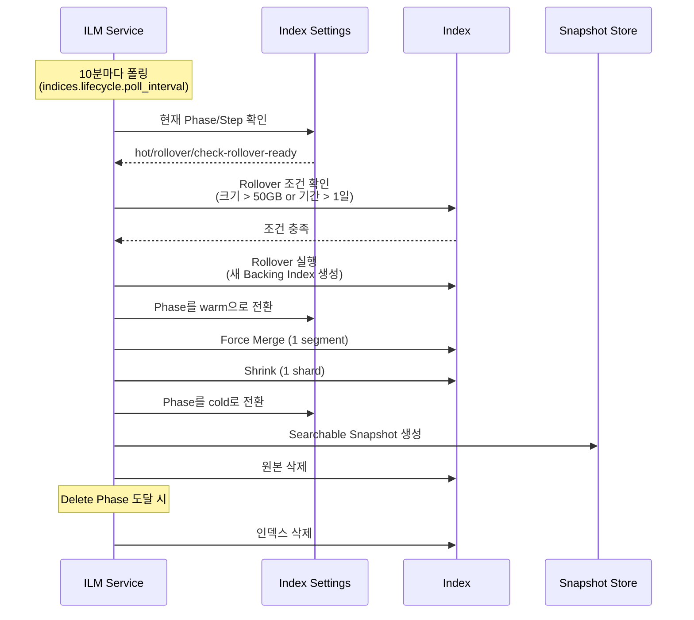
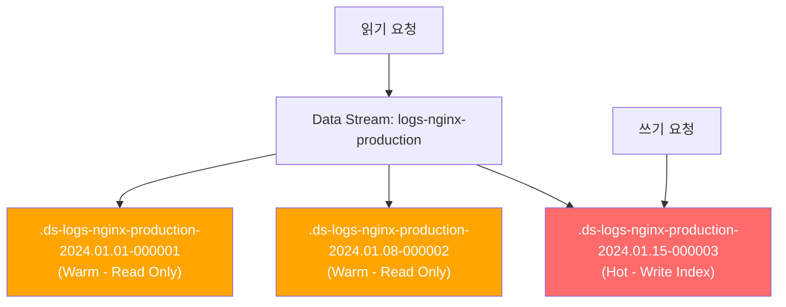

# 로그 관리 전략: ILM, Data Stream, 백업

Elasticsearch에서 시간 기반 데이터를 효율적으로 관리하기 위한 ILM(Index Lifecycle Management) 정책 설계, Data Stream 활용, 그리고 Snapshot/Restore 기반 백업 전략을 실전 중심으로 다룬다.

## 목차
- [1. 핵심 개념 (What)](#1-핵심-개념-what)
- [2. 왜 알아야 하는가 (Why)](#2-왜-알아야-하는가-why)
- [3. 내부 구현 분석 (How)](#3-내부-구현-분석-how)
- [4. 실전 예제](#4-실전-예제)
- [5. 정리](#5-정리)

---

## 1. 핵심 개념 (What)

### Index Lifecycle Management (ILM)

ILM은 인덱스가 생성되어 삭제될 때까지의 **전체 생명주기**를 자동으로 관리하는 기능이다. 인덱스는 다음 4단계(Phase)를 거친다:


| Phase | 역할 | 전형적 기간 | 주요 액션 |
|-------|------|------------|----------|
| Hot | 인덱싱 + 검색 | 0~7일 | Rollover |
| Warm | 검색 전용 | 7~30일 | Shrink, Force Merge, Read-only |
| Cold | 드문 검색 | 30~90일 | Searchable Snapshot |
| Delete | 삭제 | 90일+ | Delete |

### Data Stream

Data Stream은 시계열 데이터를 위한 **추상화 레이어**로, 내부적으로 여러 Backing Index를 관리한다. `@timestamp` 필드가 필수이며, append-only(추가 전용) 특성을 가진다.

### Rollover

Rollover는 인덱스가 특정 조건(크기, 문서 수, 기간)에 도달하면 자동으로 새 인덱스를 생성하는 메커니즘이다.

### Snapshot/Restore

클러스터 전체 또는 특정 인덱스의 스냅샷을 원격 저장소(S3, GCS, Azure Blob 등)에 저장하고 복원하는 백업 메커니즘이다.

---

## 2. 왜 알아야 하는가 (Why)

### 로그 관리 없이 운영하면 생기는 문제

1. **디스크 고갈**: 로그는 계속 쌓인다. 관리하지 않으면 디스크가 차고, 클러스터가 read-only 모드로 전환된다
2. **성능 저하**: 인덱스가 너무 크면 검색 속도가 급격히 떨어진다. 단일 인덱스 50GB를 넘으면 성능이 눈에 띄게 저하
3. **비용 폭증**: Hot 스토리지(SSD)에 오래된 데이터를 계속 두면 불필요한 스토리지 비용 발생
4. **복구 불가**: 백업 없이 클러스터 장애가 발생하면 데이터를 영구 손실

### ILM이 해결하는 것

- **자동화된 수명주기**: 수동으로 인덱스를 삭제하거나 이동할 필요 없음
- **비용 최적화**: 오래된 데이터를 저비용 스토리지로 자동 이동
- **성능 유지**: Rollover로 인덱스 크기를 적정 수준으로 유지
- **규정 준수**: 보존 기간에 맞춰 자동 삭제 (GDPR 등)

---

## 3. 내부 구현 분석 (How)

### 3.1 ILM 정책의 동작 원리



**ILM 내부 상태 머신**:
- 각 Phase는 여러 Step으로 구성 (check → action → complete)
- `indices.lifecycle.poll_interval` (기본 10분)마다 상태 확인
- 에러 발생 시 `ERROR` Step으로 이동하며, 수동 Retry 가능

### 3.2 Data Stream 내부 구조



- **쓰기**: 항상 최신 Backing Index(Write Index)로만 라우팅
- **읽기**: Data Stream 이름으로 모든 Backing Index를 투명하게 검색
- **Rollover**: 조건 충족 시 새 Backing Index 생성, 이전 인덱스는 read-only
- **명명 규칙**: `.ds-<data-stream-name>-<generation_date>-<generation>`

### 3.3 Snapshot 내부 동작

Snapshot은 **증분(Incremental)** 방식으로 동작한다:

1. 첫 스냅샷: 모든 Segment 파일 복사
2. 이후 스냅샷: 변경/추가된 Segment만 복사
3. Segment는 불변(Immutable)이므로 증분 감지가 효율적

```
Repository (S3)
├── index-N                    # 리포지토리 메타데이터
├── snap-{snapshot-uuid}.dat   # 스냅샷 메타데이터
└── indices/
    └── {index-uuid}/
        └── {shard-id}/
            ├── snap-{uuid}.dat     # 샤드 스냅샷 메타
            ├── __VPO...            # Segment 파일 (블롭)
            └── __xyZ...            # Segment 파일 (블롭)
```

---

## 4. 실전 예제

### 4.1 ILM 정책 생성

```json
// PUT _ilm/policy/logs-policy
{
  "policy": {
    "phases": {
      "hot": {
        "min_age": "0ms",
        "actions": {
          "rollover": {
            "max_primary_shard_size": "50gb",
            "max_age": "1d",
            "max_docs": 100000000
          },
          "set_priority": {
            "priority": 100
          }
        }
      },
      "warm": {
        "min_age": "7d",
        "actions": {
          "shrink": {
            "number_of_shards": 1
          },
          "forcemerge": {
            "max_num_segments": 1
          },
          "allocate": {
            "require": {
              "data": "warm"
            }
          },
          "set_priority": {
            "priority": 50
          }
        }
      },
      "cold": {
        "min_age": "30d",
        "actions": {
          "searchable_snapshot": {
            "snapshot_repository": "s3-backup-repo",
            "force_merge_index": true
          },
          "set_priority": {
            "priority": 0
          }
        }
      },
      "delete": {
        "min_age": "90d",
        "actions": {
          "delete": {}
        }
      }
    }
  }
}
```

### 4.2 Data Stream 설정 (Index Template + ILM)

```json
// PUT _component_template/logs-mappings
{
  "template": {
    "mappings": {
      "properties": {
        "@timestamp": { "type": "date" },
        "message": { "type": "text" },
        "log.level": { "type": "keyword" },
        "service.name": { "type": "keyword" },
        "host.name": { "type": "keyword" },
        "trace.id": { "type": "keyword" },
        "http.response.status_code": { "type": "integer" },
        "http.request.method": { "type": "keyword" },
        "url.path": { "type": "keyword" },
        "event.duration": { "type": "long" }
      }
    }
  }
}

// PUT _component_template/logs-settings
{
  "template": {
    "settings": {
      "index.lifecycle.name": "logs-policy",
      "number_of_shards": 3,
      "number_of_replicas": 1,
      "index.codec": "best_compression",
      "index.routing.allocation.require.data": "hot"
    }
  }
}

// PUT _index_template/logs-template
{
  "index_patterns": ["logs-*"],
  "data_stream": {},
  "composed_of": ["logs-mappings", "logs-settings"],
  "priority": 200
}
```

### 4.3 Data Stream에 데이터 쓰기

```json
// POST logs-nginx-production/_doc
{
  "@timestamp": "2024-01-15T10:30:00Z",
  "message": "GET /api/users 200 45ms",
  "log.level": "info",
  "service.name": "nginx",
  "host.name": "web-server-01",
  "http.response.status_code": 200,
  "http.request.method": "GET",
  "url.path": "/api/users",
  "event.duration": 45000000
}

// POST logs-nginx-production/_bulk
{"create": {}}
{"@timestamp": "2024-01-15T10:30:01Z", "message": "POST /api/orders 201 120ms", "log.level": "info", "service.name": "nginx"}
{"create": {}}
{"@timestamp": "2024-01-15T10:30:02Z", "message": "GET /api/products 500 5000ms", "log.level": "error", "service.name": "nginx"}
```

### 4.4 Snapshot Repository 설정 및 SLM 정책

```json
// PUT _snapshot/s3-backup-repo
{
  "type": "s3",
  "settings": {
    "bucket": "my-elasticsearch-backups",
    "region": "ap-northeast-2",
    "base_path": "production-cluster",
    "max_restore_bytes_per_sec": "200mb",
    "max_snapshot_bytes_per_sec": "200mb",
    "compress": true
  }
}

// PUT _slm/policy/nightly-backup
{
  "schedule": "0 30 2 * * ?",
  "name": "<nightly-backup-{now/d}>",
  "repository": "s3-backup-repo",
  "config": {
    "indices": ["logs-*", "metrics-*", ".kibana*"],
    "ignore_unavailable": true,
    "include_global_state": true
  },
  "retention": {
    "expire_after": "30d",
    "min_count": 7,
    "max_count": 30
  }
}
```

### 4.5 ILM 정책 상태 확인 및 트러블슈팅

```bash
# 인덱스의 ILM 상태 확인
GET logs-nginx-production/_ilm/explain

# 응답 예시:
# {
#   "indices": {
#     ".ds-logs-nginx-production-2024.01.15-000003": {
#       "index": ".ds-logs-nginx-production-2024.01.15-000003",
#       "managed": true,
#       "policy": "logs-policy",
#       "phase": "hot",
#       "action": "rollover",
#       "step": "check-rollover-ready",
#       "age": "3d"
#     }
#   }
# }

# ILM 에러 발생 시 재시도
POST .ds-logs-nginx-production-2024.01.15-000003/_ilm/retry

# 수동 Rollover 실행
POST logs-nginx-production/_rollover

# Data Stream 상태 확인
GET _data_stream/logs-nginx-production

# SLM 정책 즉시 실행
POST _slm/policy/nightly-backup/_execute

# 스냅샷 상태 확인
GET _snapshot/s3-backup-repo/_all?verbose=false

# 스냅샷에서 특정 인덱스 복원
POST _snapshot/s3-backup-repo/nightly-backup-2024.01.15/_restore
{
  "indices": "logs-nginx-production",
  "rename_pattern": "(.+)",
  "rename_replacement": "restored-$1"
}
```

### 4.6 인덱스 보관 정책 설계 가이드

```mermaid
graph TB
    subgraph "Retention Policy by Data Type"
        direction TB
        
        subgraph "Application Logs"
            AL_HOT[Hot: 7일<br/>SSD, 3 Shards] --> AL_WARM[Warm: 23일<br/>HDD, 1 Shard]
            AL_WARM --> AL_COLD[Cold: 60일<br/>Searchable Snapshot]
            AL_COLD --> AL_DEL[Delete: 90일 후]
        end
        
        subgraph "Security/Audit Logs"
            SL_HOT[Hot: 30일<br/>SSD, 3 Shards] --> SL_WARM[Warm: 335일<br/>HDD, 1 Shard]
            SL_WARM --> SL_FROZEN[Frozen: 5년<br/>S3 Archive]
            SL_FROZEN --> SL_DEL[Delete: 7년 후]
        end
        
        subgraph "Metrics"
            MT_HOT[Hot: 3일<br/>SSD, 1 Shard] --> MT_WARM[Warm: 11일<br/>HDD, 1 Shard]
            MT_WARM --> MT_DEL[Delete: 14일 후]
        end
    end
```



---

## 5. 정리

| 기능 | 목적 | 핵심 설정 | 주의사항 |
|------|------|----------|---------|
| **ILM** | 인덱스 자동 수명주기 관리 | Phase별 액션, Rollover 조건 | `poll_interval` 기본 10분, Phase 전환 지연 가능 |
| **Data Stream** | 시계열 데이터 추상화 | Index Template + `data_stream: {}` | `@timestamp` 필수, append-only |
| **Rollover** | 인덱스 크기/기간 제한 | `max_primary_shard_size`, `max_age` | 샤드 당 50GB 이하 유지 권장 |
| **SLM** | 자동 스냅샷 백업 | Cron 스케줄, Retention 정책 | Repository 사전 설정 필요 |
| **Searchable Snapshot** | Cold 데이터 비용 절감 | Cold/Frozen Phase에서 사용 | 검색 속도 저하 감수 필요 |

### 핵심 원칙

1. **Rollover 기준**: Primary 샤드 50GB 또는 1일 단위 (워크로드에 따라 조정)
2. **보존 기간**: 데이터 유형과 규정에 맞게 설계 (일반 로그 90일, 감사 로그 7년 등)
3. **백업은 필수**: SLM으로 매일 자동 스냅샷, 최소 7일분 보관
4. **복원 테스트**: 분기별로 반드시 복원 테스트를 수행하여 백업 무결성 확인

---
*참고: Elasticsearch 8.x / Logstash 8.x / Kibana 8.x 기준*
