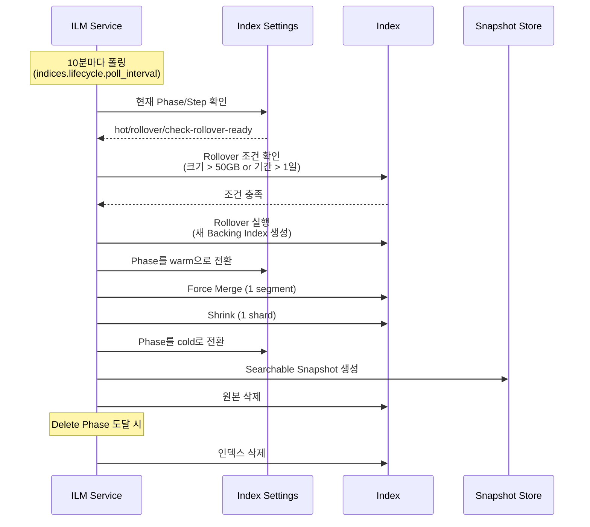
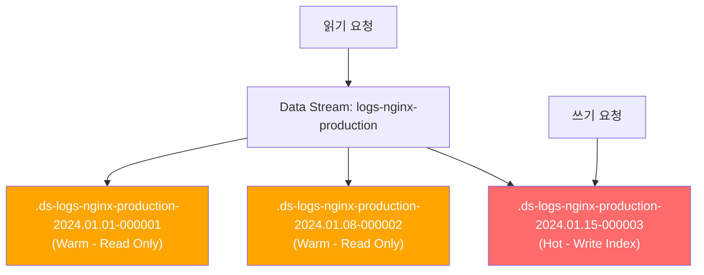
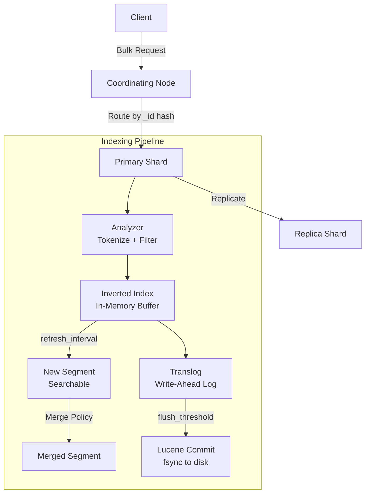

# 로그 관리 전략: ILM, Data Stream, 백업

Elasticsearch에서 시간 기반 데이터를 효율적으로 관리하기 위한 ILM(Index Lifecycle Management) 정책 설계, Data Stream 활용, 그리고 Snapshot/Restore 기반 백업 전략을 실전 중심으로 다룬다.

## 목차
- [1. 핵심 개념 (What)](#1-핵심-개념-what)
- [2. 왜 알아야 하는가 (Why)](#2-왜-알아야-하는가-why)
- [3. 내부 구현 분석 (How)](#3-내부-구현-분석-how)
- [4. 실전 예제](#4-실전-예제)
- [5. 정리](#5-정리)

---

## 1. 핵심 개념 (What)

### Index Lifecycle Management (ILM)

ILM은 인덱스가 생성되어 삭제될 때까지의 **전체 생명주기**를 자동으로 관리하는 기능이다. 인덱스는 다음 4단계(Phase)를 거친다:


| Phase | 역할 | 전형적 기간 | 주요 액션 |
|-------|------|------------|----------|
| Hot | 인덱싱 + 검색 | 0~7일 | Rollover |
| Warm | 검색 전용 | 7~30일 | Shrink, Force Merge, Read-only |
| Cold | 드문 검색 | 30~90일 | Searchable Snapshot |
| Delete | 삭제 | 90일+ | Delete |

### Data Stream

Data Stream은 시계열 데이터를 위한 **추상화 레이어**로, 내부적으로 여러 Backing Index를 관리한다. `@timestamp` 필드가 필수이며, append-only(추가 전용) 특성을 가진다.

### Rollover

Rollover는 인덱스가 특정 조건(크기, 문서 수, 기간)에 도달하면 자동으로 새 인덱스를 생성하는 메커니즘이다.

### Snapshot/Restore

클러스터 전체 또는 특정 인덱스의 스냅샷을 원격 저장소(S3, GCS, Azure Blob 등)에 저장하고 복원하는 백업 메커니즘이다.

---

## 2. 왜 알아야 하는가 (Why)

### 로그 관리 없이 운영하면 생기는 문제

1. **디스크 고갈**: 로그는 계속 쌓인다. 관리하지 않으면 디스크가 차고, 클러스터가 read-only 모드로 전환된다
2. **성능 저하**: 인덱스가 너무 크면 검색 속도가 급격히 떨어진다. 단일 인덱스 50GB를 넘으면 성능이 눈에 띄게 저하
3. **비용 폭증**: Hot 스토리지(SSD)에 오래된 데이터를 계속 두면 불필요한 스토리지 비용 발생
4. **복구 불가**: 백업 없이 클러스터 장애가 발생하면 데이터를 영구 손실

### ILM이 해결하는 것

- **자동화된 수명주기**: 수동으로 인덱스를 삭제하거나 이동할 필요 없음
- **비용 최적화**: 오래된 데이터를 저비용 스토리지로 자동 이동
- **성능 유지**: Rollover로 인덱스 크기를 적정 수준으로 유지
- **규정 준수**: 보존 기간에 맞춰 자동 삭제 (GDPR 등)

---

## 3. 내부 구현 분석 (How)

### 3.1 ILM 정책의 동작 원리



**ILM 내부 상태 머신**:
- 각 Phase는 여러 Step으로 구성 (check → action → complete)
- `indices.lifecycle.poll_interval` (기본 10분)마다 상태 확인
- 에러 발생 시 `ERROR` Step으로 이동하며, 수동 Retry 가능

### 3.2 Data Stream 내부 구조



- **쓰기**: 항상 최신 Backing Index(Write Index)로만 라우팅
- **읽기**: Data Stream 이름으로 모든 Backing Index를 투명하게 검색
- **Rollover**: 조건 충족 시 새 Backing Index 생성, 이전 인덱스는 read-only
- **명명 규칙**: `.ds-<data-stream-name>-<generation_date>-<generation>`

### 3.3 Snapshot 내부 동작

Snapshot은 **증분(Incremental)** 방식으로 동작한다:

1. 첫 스냅샷: 모든 Segment 파일 복사
2. 이후 스냅샷: 변경/추가된 Segment만 복사
3. Segment는 불변(Immutable)이므로 증분 감지가 효율적

```
Repository (S3)
├── index-N                    # 리포지토리 메타데이터
├── snap-{snapshot-uuid}.dat   # 스냅샷 메타데이터
└── indices/
    └── {index-uuid}/
        └── {shard-id}/
            ├── snap-{uuid}.dat     # 샤드 스냅샷 메타
            ├── __VPO...            # Segment 파일 (블롭)
            └── __xyZ...            # Segment 파일 (블롭)
```

---

## 4. 실전 예제

### 4.1 ILM 정책 생성

```json
// PUT _ilm/policy/logs-policy
{
  "policy": {
    "phases": {
      "hot": {
        "min_age": "0ms",
        "actions": {
          "rollover": {
            "max_primary_shard_size": "50gb",
            "max_age": "1d",
            "max_docs": 100000000
          },
          "set_priority": {
            "priority": 100
          }
        }
      },
      "warm": {
        "min_age": "7d",
        "actions": {
          "shrink": {
            "number_of_shards": 1
          },
          "forcemerge": {
            "max_num_segments": 1
          },
          "allocate": {
            "require": {
              "data": "warm"
            }
          },
          "set_priority": {
            "priority": 50
          }
        }
      },
      "cold": {
        "min_age": "30d",
        "actions": {
          "searchable_snapshot": {
            "snapshot_repository": "s3-backup-repo",
            "force_merge_index": true
          },
          "set_priority": {
            "priority": 0
          }
        }
      },
      "delete": {
        "min_age": "90d",
        "actions": {
          "delete": {}
        }
      }
    }
  }
}
```

### 4.2 Data Stream 설정 (Index Template + ILM)

```json
// PUT _component_template/logs-mappings
{
  "template": {
    "mappings": {
      "properties": {
        "@timestamp": { "type": "date" },
        "message": { "type": "text" },
        "log.level": { "type": "keyword" },
        "service.name": { "type": "keyword" },
        "host.name": { "type": "keyword" },
        "trace.id": { "type": "keyword" },
        "http.response.status_code": { "type": "integer" },
        "http.request.method": { "type": "keyword" },
        "url.path": { "type": "keyword" },
        "event.duration": { "type": "long" }
      }
    }
  }
}

// PUT _component_template/logs-settings
{
  "template": {
    "settings": {
      "index.lifecycle.name": "logs-policy",
      "number_of_shards": 3,
      "number_of_replicas": 1,
      "index.codec": "best_compression",
      "index.routing.allocation.require.data": "hot"
    }
  }
}

// PUT _index_template/logs-template
{
  "index_patterns": ["logs-*"],
  "data_stream": {},
  "composed_of": ["logs-mappings", "logs-settings"],
  "priority": 200
}
```

### 4.3 Data Stream에 데이터 쓰기

```json
// POST logs-nginx-production/_doc
{
  "@timestamp": "2024-01-15T10:30:00Z",
  "message": "GET /api/users 200 45ms",
  "log.level": "info",
  "service.name": "nginx",
  "host.name": "web-server-01",
  "http.response.status_code": 200,
  "http.request.method": "GET",
  "url.path": "/api/users",
  "event.duration": 45000000
}

// POST logs-nginx-production/_bulk
{"create": {}}
{"@timestamp": "2024-01-15T10:30:01Z", "message": "POST /api/orders 201 120ms", "log.level": "info", "service.name": "nginx"}
{"create": {}}
{"@timestamp": "2024-01-15T10:30:02Z", "message": "GET /api/products 500 5000ms", "log.level": "error", "service.name": "nginx"}
```

### 4.4 Snapshot Repository 설정 및 SLM 정책

```json
// PUT _snapshot/s3-backup-repo
{
  "type": "s3",
  "settings": {
    "bucket": "my-elasticsearch-backups",
    "region": "ap-northeast-2",
    "base_path": "production-cluster",
    "max_restore_bytes_per_sec": "200mb",
    "max_snapshot_bytes_per_sec": "200mb",
    "compress": true
  }
}

// PUT _slm/policy/nightly-backup
{
  "schedule": "0 30 2 * * ?",
  "name": "<nightly-backup-{now/d}>",
  "repository": "s3-backup-repo",
  "config": {
    "indices": ["logs-*", "metrics-*", ".kibana*"],
    "ignore_unavailable": true,
    "include_global_state": true
  },
  "retention": {
    "expire_after": "30d",
    "min_count": 7,
    "max_count": 30
  }
}
```

### 4.5 ILM 정책 상태 확인 및 트러블슈팅

```bash
# 인덱스의 ILM 상태 확인
GET logs-nginx-production/_ilm/explain

# 응답 예시:
# {
#   "indices": {
#     ".ds-logs-nginx-production-2024.01.15-000003": {
#       "index": ".ds-logs-nginx-production-2024.01.15-000003",
#       "managed": true,
#       "policy": "logs-policy",
#       "phase": "hot",
#       "action": "rollover",
#       "step": "check-rollover-ready",
#       "age": "3d"
#     }
#   }
# }

# ILM 에러 발생 시 재시도
POST .ds-logs-nginx-production-2024.01.15-000003/_ilm/retry

# 수동 Rollover 실행
POST logs-nginx-production/_rollover

# Data Stream 상태 확인
GET _data_stream/logs-nginx-production

# SLM 정책 즉시 실행
POST _slm/policy/nightly-backup/_execute

# 스냅샷 상태 확인
GET _snapshot/s3-backup-repo/_all?verbose=false

# 스냅샷에서 특정 인덱스 복원
POST _snapshot/s3-backup-repo/nightly-backup-2024.01.15/_restore
{
  "indices": "logs-nginx-production",
  "rename_pattern": "(.+)",
  "rename_replacement": "restored-$1"
}
```

### 4.6 인덱스 보관 정책 설계 가이드

```mermaid
graph TB
    subgraph "Retention Policy by Data Type"
        direction TB
        
        subgraph "Application Logs"
            AL_HOT[Hot: 7일<br/>SSD, 3 Shards] --> AL_WARM[Warm: 23일<br/>HDD, 1 Shard]
            AL_WARM --> AL_COLD[Cold: 60일<br/>Searchable Snapshot]
            AL_COLD --> AL_DEL[Delete: 90일 후]
        end
        
        subgraph "Security/Audit Logs"
            SL_HOT[Hot: 30일<br/>SSD, 3 Shards] --> SL_WARM[Warm: 335일<br/>HDD, 1 Shard]
            SL_WARM --> SL_FROZEN[Frozen: 5년<br/>S3 Archive]
            SL_FROZEN --> SL_DEL[Delete: 7년 후]
        end
        
        subgraph "Metrics"
            MT_HOT[Hot: 3일<br/>SSD, 1 Shard] --> MT_WARM[Warm: 11일<br/>HDD, 1 Shard]
            MT_WARM --> MT_DEL[Delete: 14일 후]
        end
    end
```



---

## 5. 정리

| 기능 | 목적 | 핵심 설정 | 주의사항 |
|------|------|----------|---------|
| **ILM** | 인덱스 자동 수명주기 관리 | Phase별 액션, Rollover 조건 | `poll_interval` 기본 10분, Phase 전환 지연 가능 |
| **Data Stream** | 시계열 데이터 추상화 | Index Template + `data_stream: {}` | `@timestamp` 필수, append-only |
| **Rollover** | 인덱스 크기/기간 제한 | `max_primary_shard_size`, `max_age` | 샤드 당 50GB 이하 유지 권장 |
| **SLM** | 자동 스냅샷 백업 | Cron 스케줄, Retention 정책 | Repository 사전 설정 필요 |
| **Searchable Snapshot** | Cold 데이터 비용 절감 | Cold/Frozen Phase에서 사용 | 검색 속도 저하 감수 필요 |

### 핵심 원칙

1. **Rollover 기준**: Primary 샤드 50GB 또는 1일 단위 (워크로드에 따라 조정)
2. **보존 기간**: 데이터 유형과 규정에 맞게 설계 (일반 로그 90일, 감사 로그 7년 등)
3. **백업은 필수**: SLM으로 매일 자동 스냅샷, 최소 7일분 보관
4. **복원 테스트**: 분기별로 반드시 복원 테스트를 수행하여 백업 무결성 확인

---

## 보충: Elasticsearch 성능 튜닝

> 이 섹션은 infrastructure/ELK 문서에서 통합된 보충 자료로, Elasticsearch 클러스터의 JVM, 인덱싱, 검색, Merge, 하드웨어 전반의 성능 튜닝 전략을 다룬다.

### 성능 튜닝 5개 계층

| 계층 | 튜닝 대상 | 영향 범위 |
|------|----------|----------|
| **JVM** | Heap 크기, GC 정책 | 전체 노드 안정성 |
| **Indexing** | Bulk 크기, Refresh Interval, Translog | 쓰기 처리량 |
| **Search** | 캐시, Shard 수, Routing | 읽기 지연시간 |
| **Merge** | Merge 정책, 스레드 수 | I/O 부하 및 검색 성능 |
| **Hardware** | 디스크, 메모리, CPU, 네트워크 | 전체 성능 상한 |

### 인덱싱 파이프라인 내부 구조



### JVM 메모리 구조

```
┌─────────────────────────────────────────────────┐
│                   시스템 메모리 (64GB)              │
│                                                 │
│  ┌──────────────────┐  ┌──────────────────────┐ │
│  │   JVM Heap (31GB) │  │  OS File Cache (33GB)│ │
│  │                  │  │                      │ │
│  │  ┌─────────────┐ │  │  Lucene Segments     │ │
│  │  │  Young Gen   │ │  │  (Memory-mapped)     │ │
│  │  │  (Eden+S0+S1)│ │  │                      │ │
│  │  ├─────────────┤ │  │  Doc Values           │ │
│  │  │  Old Gen     │ │  │  (columnar store)    │ │
│  │  │  (Field Data,│ │  │                      │ │
│  │  │   Caches,    │ │  │  Stored Fields       │ │
│  │  │   Buffers)   │ │  │                      │ │
│  │  └─────────────┘ │  └──────────────────────┘ │
│  └──────────────────┘                           │
└─────────────────────────────────────────────────┘
```

**핵심 원칙**: Heap은 물리 메모리의 50% 이하, 최대 31GB(Compressed OOP 임계값)로 설정한다. 나머지는 OS File Cache가 Lucene 세그먼트를 캐싱하는 데 사용한다.

### JVM 설정

```bash
# /etc/elasticsearch/jvm.options

# Heap 크기: 물리 메모리의 50% 이하, 최대 31GB
-Xms31g
-Xmx31g

# G1GC 사용 (Elasticsearch 7.x+ 기본값)
-XX:+UseG1GC

# G1GC 튜닝
-XX:G1HeapRegionSize=16m
-XX:InitiatingHeapOccupancyPercent=30
-XX:G1ReservePercent=25

# GC 로깅
-Xlog:gc*,gc+age=trace,safepoint:file=/var/log/elasticsearch/gc.log:utctime,pid,tags:filecount=32,filesize=64m

# OOM 시 Heap Dump
-XX:+HeapDumpOnOutOfMemoryError
-XX:HeapDumpPath=/var/lib/elasticsearch/heapdump
-XX:+ExitOnOutOfMemoryError
```

### Bulk API 최적화

```bash
# 인덱싱 전 최적화 설정 적용
curl -X PUT "localhost:9200/logs-2026.03/_settings" \
  -H "Content-Type: application/json" \
  -d '{
    "index": {
      "refresh_interval": "30s",
      "number_of_replicas": 0,
      "translog": {
        "durability": "async",
        "sync_interval": "30s",
        "flush_threshold_size": "1gb"
      }
    }
  }'

# Bulk 인덱싱 실행 (최적 크기: 5-15MB per request)
curl -X POST "localhost:9200/_bulk" \
  -H "Content-Type: application/x-ndjson" \
  --data-binary @bulk_data.ndjson

# 인덱싱 완료 후 설정 복원
curl -X PUT "localhost:9200/logs-2026.03/_settings" \
  -H "Content-Type: application/json" \
  -d '{
    "index": {
      "refresh_interval": "1s",
      "number_of_replicas": 1,
      "translog": {
        "durability": "request"
      }
    }
  }'
```

### Refresh Interval 조정

```bash
# 로그/메트릭 수집 (near-realtime 불필요)
curl -X PUT "localhost:9200/logs-*/_settings" \
  -H "Content-Type: application/json" \
  -d '{"index": {"refresh_interval": "30s"}}'

# 실시간 검색 (기본값 유지)
curl -X PUT "localhost:9200/products/_settings" \
  -H "Content-Type: application/json" \
  -d '{"index": {"refresh_interval": "1s"}}'

# 대량 리인덱싱 (완료 후 수동 refresh)
curl -X PUT "localhost:9200/reindex-target/_settings" \
  -H "Content-Type: application/json" \
  -d '{"index": {"refresh_interval": "-1"}}'
```

### Merge 정책 튜닝

```bash
curl -X PUT "localhost:9200/logs-*/_settings" \
  -H "Content-Type: application/json" \
  -d '{
    "index": {
      "merge": {
        "scheduler": {
          "max_thread_count": 1
        },
        "policy": {
          "max_merged_segment": "5gb",
          "segments_per_tier": 10,
          "floor_segment": "2mb"
        }
      }
    }
  }'

# Force Merge (읽기 전용 인덱스에서만 사용)
curl -X POST "localhost:9200/logs-2026.02/_forcemerge?max_num_segments=1"
```

### 검색 성능 최적화

```bash
# Shard 크기 및 수 최적화
# 권장 Shard 크기: 10GB ~ 50GB
# 권장 Shard 수: 노드당 Heap 1GB에 20개 이하

# Filter Context 활용 (캐싱 가능, 스코어링 불필요)
curl -X GET "localhost:9200/logs-*/_search" \
  -H "Content-Type: application/json" \
  -d '{
    "query": {
      "bool": {
        "filter": [
          {"term": {"status": "error"}},
          {"range": {"@timestamp": {"gte": "now-1h"}}}
        ]
      }
    }
  }'

# _source 필드 제한
curl -X GET "localhost:9200/logs-*/_search" \
  -H "Content-Type: application/json" \
  -d '{
    "query": {"match_all": {}},
    "_source": ["@timestamp", "message", "level"],
    "size": 100
  }'
```

### 쓰기/읽기 노드 분리

```yaml
# Hot 노드 (쓰기 중심) - elasticsearch.yml
node.roles: [data_hot, ingest]
# SSD 사용, 높은 CPU

# Warm 노드 (읽기 중심) - elasticsearch.yml
node.roles: [data_warm]
# HDD 가능, 높은 디스크 용량

# Cold 노드 (아카이브) - elasticsearch.yml
node.roles: [data_cold]
# 대용량 HDD, 최소 리소스
```

### 하드웨어 사이징 가이드

```
┌──────────────────────────────────────────────────────────────┐
│                    하드웨어 사이징 기준                         │
├──────────┬────────────┬────────────┬────────────┬────────────┤
│  역할     │  CPU       │  메모리     │  디스크     │  네트워크   │
├──────────┼────────────┼────────────┼────────────┼────────────┤
│ Master   │ 4 cores    │ 16GB       │ 50GB SSD   │ 1Gbps      │
│ Hot Data │ 16+ cores  │ 64GB       │ 2TB NVMe   │ 10Gbps     │
│ Warm     │ 8 cores    │ 64GB       │ 8TB HDD    │ 1Gbps      │
│ Cold     │ 4 cores    │ 32GB       │ 16TB HDD   │ 1Gbps      │
│ Coord    │ 8 cores    │ 32GB       │ 100GB SSD  │ 10Gbps     │
│ Ingest   │ 16 cores   │ 32GB       │ 100GB SSD  │ 10Gbps     │
└──────────┴────────────┴────────────┴────────────┴────────────┘
```

### 성능 모니터링 쿼리

```bash
# 느린 쿼리 로그 설정
curl -X PUT "localhost:9200/logs-*/_settings" \
  -H "Content-Type: application/json" \
  -d '{
    "index.search.slowlog.threshold.query.warn": "10s",
    "index.search.slowlog.threshold.query.info": "5s",
    "index.search.slowlog.threshold.fetch.warn": "1s",
    "index.indexing.slowlog.threshold.index.warn": "10s",
    "index.indexing.slowlog.threshold.index.info": "5s"
  }'

# Thread Pool 상태 확인
curl -s "localhost:9200/_cat/thread_pool?v&h=node_name,name,active,rejected,completed" \
  | grep -E "write|search|bulk"

# Hot Threads 분석
curl -X GET "localhost:9200/_nodes/hot_threads?threads=5"
```

### 성능 튜닝 요약

| 튜닝 영역 | 핵심 설정 | 권장 값 | 효과 |
|-----------|----------|--------|------|
| **JVM Heap** | -Xmx | 물리 메모리 50%, max 31GB | OOP 압축 유지, GC 안정화 |
| **Refresh Interval** | refresh_interval | 로그: 30s, 검색: 1s | 쓰기 처리량 2-3x 향상 |
| **Bulk Size** | 요청당 크기 | 5-15MB | 최적 인덱싱 처리량 |
| **Translog** | flush_threshold_size | 512MB-1GB | 디스크 I/O 감소 |
| **Merge** | max_thread_count | HDD: 1, SSD: 기본값 | I/O 경합 감소 |
| **Shard 크기** | number_of_shards | 10-50GB per shard | 검색/복구 성능 균형 |
| **노드 분리** | node.roles | hot/warm/cold | 워크로드 격리 |
| **Force Merge** | max_num_segments | 1 (읽기 전용만) | 검색 성능 향상 |

---
*참고: Elasticsearch 8.x / Logstash 8.x / Kibana 8.x 기준*
