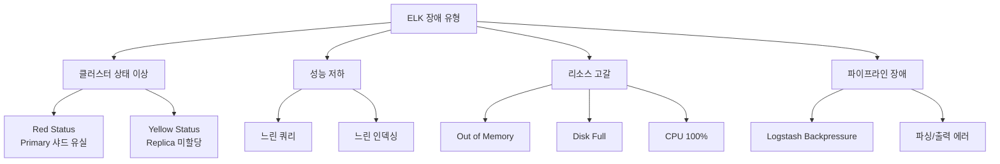
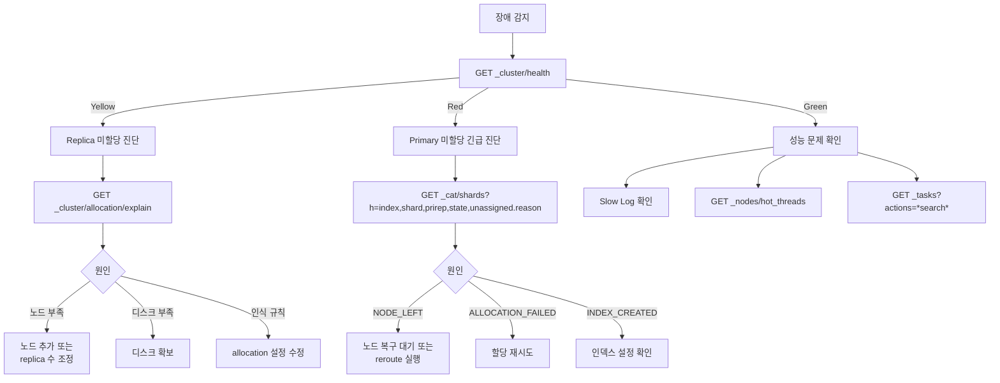
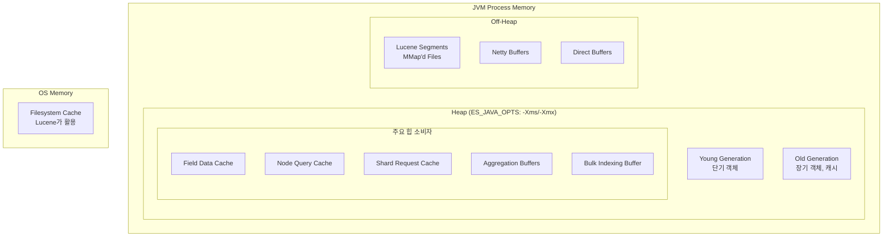
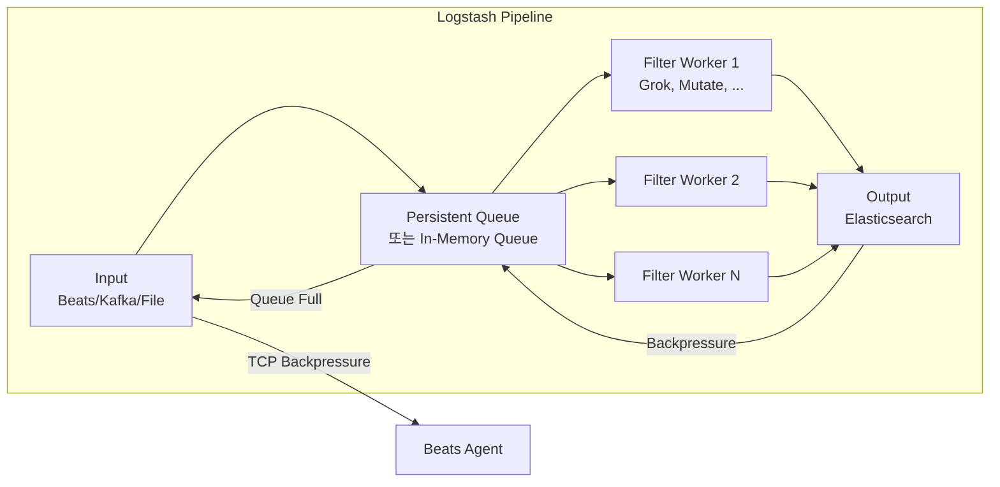
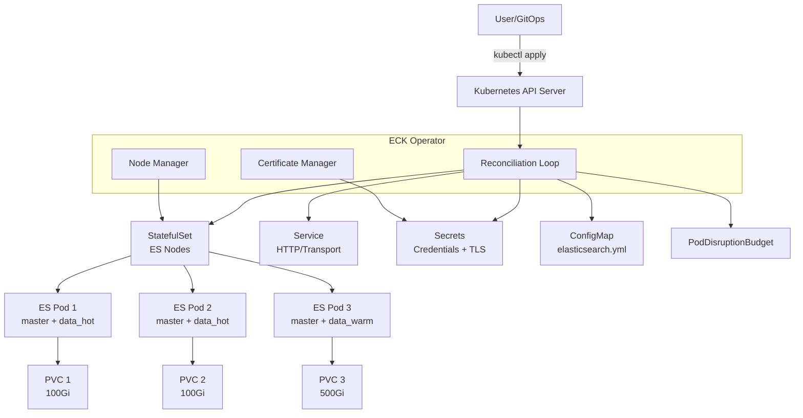

# ELK 트러블슈팅 가이드

Elasticsearch 클러스터 운영 중 발생하는 주요 장애 상황(Red/Yellow 상태, 느린 쿼리, OOM, 디스크 풀)의 진단 방법과 복구 절차를 단계별로 정리한다. Logstash 파이프라인 장애 대응까지 포함한다.

## 목차
- [1. 핵심 개념 (What)](#1-핵심-개념-what)
- [2. 왜 알아야 하는가 (Why)](#2-왜-알아야-하는가-why)
- [3. 내부 구현 분석 (How)](#3-내부-구현-분석-how)
- [4. 실전 예제](#4-실전-예제)
- [5. 정리](#5-정리)

---

## 1. 핵심 개념 (What)

### 클러스터 헬스 상태

Elasticsearch 클러스터는 세 가지 상태를 가진다:

| 상태 | 의미 | 긴급도 |
|------|------|--------|
| **Green** | 모든 Primary + Replica 샤드 정상 할당 | 정상 |
| **Yellow** | 모든 Primary 정상, 일부 Replica 미할당 | 주의 (데이터 유실 위험 없음) |
| **Red** | 일부 Primary 샤드 미할당 | 긴급 (데이터 유실 가능) |

### 주요 장애 유형



---

## 2. 왜 알아야 하는가 (Why)

### 장애 대응 시간이 비즈니스에 미치는 영향

- **Red 클러스터**: 검색/인덱싱 일부 불가 → 서비스 장애로 직결
- **OOM Kill**: Elasticsearch 프로세스 사망 → 클러스터 불안정, 연쇄 장애
- **Disk Full**: 인덱스 read-only 전환 → 로그 유입 중단, 모니터링 블라인드 스팟
- **느린 쿼리**: Kibana 대시보드 타임아웃 → 장애 감지/분석 불가

### 사전에 알아야 하는 이유

1. 장애 발생 시 **패닉 상태에서 검색하면 늦다** — 사전에 진단/복구 프로세스를 숙지해야 함
2. 잘못된 복구 시도가 **상황을 악화**시킬 수 있음 (예: Red 상태에서 무작정 노드 재시작)
3. 대부분의 장애는 **예측 가능한 패턴**을 따르므로 체계적 접근이 가능

---

## 3. 내부 구현 분석 (How)

### 3.1 클러스터 상태 진단 흐름



### 3.2 Elasticsearch 메모리 구조와 OOM



**OOM 발생 메커니즘**:
1. 거대한 Aggregation 쿼리 → Heap 폭증
2. Field Data가 text 필드에 로드 → 힙 점유
3. 너무 많은 Bulk 요청 동시 처리 → Indexing Buffer 폭증
4. 많은 샤드 수 → 샤드당 오버헤드 누적 (샤드 1개당 ~10MB 힙)

### 3.3 디스크 워터마크 시스템

Elasticsearch는 디스크 사용량에 따라 3단계 워터마크를 적용한다:

```
디스크 사용량 증가 방향 →

[0%]────[85%]────[90%]────[95%]────[100%]
         │        │        │
         ▼        ▼        ▼
    Low Water   High     Flood
    Mark       Water     Stage
                Mark
                
Low (85%):   새 샤드 할당 중지
High (90%):  기존 샤드를 다른 노드로 이동 시작
Flood (95%): 모든 인덱스를 read-only로 전환
```

### 3.4 Logstash 파이프라인 내부 구조



**Backpressure 전파 경로**:
1. Elasticsearch가 느려짐 (429 Too Many Requests)
2. Output이 블록됨 → Queue에 이벤트 적체
3. Queue가 가득 참 → Input이 블록됨
4. Beats에게 TCP Backpressure → Beats가 자체 큐에 보관

---

## 4. 실전 예제

### 4.1 Red 클러스터 복구 절차

```bash
# 1단계: 클러스터 상태 확인
GET _cluster/health?pretty

# 2단계: 미할당 샤드 확인
GET _cat/shards?v&h=index,shard,prirep,state,unassigned.reason&s=state:desc

# 3단계: 미할당 원인 상세 분석
GET _cluster/allocation/explain
{
  "index": "logs-nginx-production",
  "shard": 0,
  "primary": true
}

# 4단계-A: 노드 복구 대기 후 reroute (노드가 살아났을 때)
POST _cluster/reroute?retry_failed=true

# 4단계-B: 데이터 유실 감수하고 빈 Primary 할당 (최후 수단)
POST _cluster/reroute
{
  "commands": [
    {
      "allocate_empty_primary": {
        "index": "logs-nginx-production",
        "shard": 0,
        "node": "data-node-1",
        "accept_data_loss": true
      }
    }
  ]
}

# 4단계-C: 스냅샷에서 복원 (권장)
POST _snapshot/s3-backup-repo/latest-snapshot/_restore
{
  "indices": "logs-nginx-production",
  "rename_pattern": "(.+)",
  "rename_replacement": "restored-$1"
}
```

### 4.2 Yellow 클러스터 진단 및 해결

```bash
# 미할당 Replica 확인
GET _cat/shards?v&h=index,shard,prirep,state,unassigned.reason&s=state

# 흔한 원인 1: 단일 노드 클러스터 → Replica 할당 불가
PUT logs-nginx-production/_settings
{
  "index.number_of_replicas": 0
}

# 흔한 원인 2: 디스크 사용량 > 85% (Low Watermark)
GET _cat/allocation?v&h=node,disk.percent,disk.used,disk.avail,shards

# 워터마크 임시 조정 (긴급 시)
PUT _cluster/settings
{
  "transient": {
    "cluster.routing.allocation.disk.watermark.low": "90%",
    "cluster.routing.allocation.disk.watermark.high": "95%",
    "cluster.routing.allocation.disk.watermark.flood_stage": "97%"
  }
}

# 흔한 원인 3: Allocation Awareness로 인한 미할당
GET _cluster/settings?include_defaults&filter_path=*.cluster.routing.allocation*
```

### 4.3 느린 쿼리 분석

```bash
# Slow Log 활성화
PUT logs-nginx-production/_settings
{
  "index.search.slowlog.threshold.query.warn": "5s",
  "index.search.slowlog.threshold.query.info": "2s",
  "index.search.slowlog.threshold.query.debug": "1s",
  "index.search.slowlog.threshold.fetch.warn": "1s",
  "index.indexing.slowlog.threshold.index.warn": "10s",
  "index.indexing.slowlog.threshold.index.info": "5s"
}

# Profile API로 쿼리 상세 분석
GET logs-nginx-production/_search
{
  "profile": true,
  "query": {
    "bool": {
      "must": [
        { "match": { "message": "error timeout" }},
        { "range": { "@timestamp": { "gte": "now-1h" }}}
      ]
    }
  }
}

# Hot Threads로 CPU 병목 확인
GET _nodes/hot_threads?threads=3&interval=500ms

# 실행 중인 태스크 확인 (장시간 실행 쿼리)
GET _tasks?actions=*search*&detailed&group_by=parents

# 문제 태스크 취소
POST _tasks/{task_id}/_cancel
```

### 4.4 OOM 대응

```bash
# 1. 현재 JVM 힙 사용량 확인
GET _nodes/stats/jvm?filter_path=nodes.*.jvm.mem

# 2. 힙 사용량이 높은 원인 분석
# Circuit Breaker 상태 확인
GET _nodes/stats/breaker

# 3. Field Data 캐시 확인 (text 필드 aggregation 시 폭증)
GET _nodes/stats/indices/fielddata?fields=*

# 4. 즉각 조치: Field Data 캐시 클리어
POST _cache/clear?fielddata=true

# 5. Circuit Breaker 설정 강화
PUT _cluster/settings
{
  "persistent": {
    "indices.breaker.total.limit": "70%",
    "indices.breaker.fielddata.limit": "40%",
    "indices.breaker.request.limit": "40%",
    "network.breaker.inflight_requests.limit": "100%"
  }
}

# 6. 과도한 Aggregation 방지 — 버킷 수 제한
PUT _cluster/settings
{
  "persistent": {
    "search.max_buckets": 10000
  }
}

# 7. text 필드에 fielddata 사용 금지 (keyword 서브필드 사용 유도)
# 잘못된 예: "message" (text) 필드로 aggregation
# 올바른 예: "message.keyword" (keyword) 필드로 aggregation
```

### 4.5 디스크 풀 (Disk Full) 긴급 대응

```bash
# 1. 디스크 상태 확인
GET _cat/allocation?v&h=node,disk.percent,disk.used,disk.avail,shards

# 2. 가장 큰 인덱스 확인
GET _cat/indices?v&h=index,store.size,pri.store.size&s=store.size:desc&format=json

# 3. Flood Stage read-only 해제 (디스크 확보 후)
PUT _all/_settings
{
  "index.blocks.read_only_allow_delete": null
}

# 4. 오래된 인덱스 즉시 삭제
DELETE logs-nginx-production-2023.10.*

# 5. Force Merge로 삭제된 문서 정리 (디스크 회복)
POST logs-nginx-production-2024.01/_forcemerge?max_num_segments=1

# 6. 인덱스 Shrink로 샤드 수 줄이기
# 먼저 인덱스를 하나의 노드로 이동
PUT logs-old-index/_settings
{
  "index.routing.allocation.require._name": "data-node-1",
  "index.blocks.write": true
}

# Shrink 실행
POST logs-old-index/_shrink/logs-old-index-shrunk
{
  "settings": {
    "index.number_of_replicas": 1,
    "index.number_of_shards": 1,
    "index.codec": "best_compression"
  }
}
```

### 4.6 Logstash 파이프라인 장애 대응

```bash
# Logstash 파이프라인 상태 확인
curl -s localhost:9600/_node/stats/pipelines?pretty

# 주요 지표 해석:
# - events.out < events.in → 파이프라인 병목
# - events.filtered 증가 → 필터에서 드롭
# - queue.events 증가 → 백프레셔 발생 중

# Logstash Slow Log 확인
# logstash.yml 에서 설정:
# slowlog.threshold.warn: 2s
# slowlog.threshold.info: 1s
# slowlog.threshold.debug: 500ms

# Pipeline Worker 수 조정
# logstash.yml
# pipeline.workers: 8          # CPU 코어 수에 맞춤
# pipeline.batch.size: 500     # 배치 크기 (기본 125)
# pipeline.batch.delay: 50     # 배치 대기 시간 ms

# Dead Letter Queue 활성화 (파싱 실패 이벤트 보존)
# logstash.yml
# dead_letter_queue.enable: true
# dead_letter_queue.max_bytes: 4096mb
```

```ruby
# Logstash 에러 핸들링 파이프라인 예시
input {
  beats {
    port => 5044
  }
}

filter {
  # Grok 파싱 실패 처리
  grok {
    match => { "message" => "%{COMBINEDAPACHELOG}" }
    tag_on_failure => ["_grokparsefailure"]
  }

  # 파싱 실패한 이벤트를 별도 인덱스로 라우팅
  if "_grokparsefailure" in [tags] {
    mutate {
      add_field => { "[@metadata][target_index]" => "parse-failures" }
    }
  } else {
    mutate {
      add_field => { "[@metadata][target_index]" => "logs-parsed" }
    }
  }
}

output {
  elasticsearch {
    hosts => ["https://es01:9200"]
    index => "%{[@metadata][target_index]}-%{+YYYY.MM.dd}"
    user => "elastic"
    password => "${ES_PASSWORD}"
    ssl_certificate_authorities => ["/etc/logstash/certs/ca.crt"]

    # 재시도 설정
    retry_on_conflict => 3

    # Backpressure 대응
    action => "create"
  }
}
```

### 4.7 종합 진단 스크립트

```bash
#!/bin/bash
# elk-health-check.sh — ELK 클러스터 종합 진단 스크립트

ES_HOST="${ES_HOST:-https://localhost:9200}"
ES_USER="${ES_USER:-elastic}"
ES_PASS="${ES_PASS:-changeme}"
CURL="curl -sk -u ${ES_USER}:${ES_PASS}"

echo "========== ELK Cluster Health Check =========="
echo "Time: $(date -u '+%Y-%m-%dT%H:%M:%SZ')"
echo ""

# 1. 클러스터 헬스
echo "--- Cluster Health ---"
${CURL} "${ES_HOST}/_cluster/health?pretty"
echo ""

# 2. 노드 상태
echo "--- Node Status ---"
${CURL} "${ES_HOST}/_cat/nodes?v&h=name,ip,heap.percent,ram.percent,cpu,load_1m,disk.used_percent,node.role"
echo ""

# 3. 미할당 샤드
echo "--- Unassigned Shards ---"
UNASSIGNED=$(${CURL} -s "${ES_HOST}/_cluster/health" | python3 -c "import sys,json; print(json.load(sys.stdin)['unassigned_shards'])")
if [ "$UNASSIGNED" -gt 0 ]; then
    echo "WARNING: ${UNASSIGNED} unassigned shards detected!"
    ${CURL} "${ES_HOST}/_cat/shards?v&h=index,shard,prirep,state,unassigned.reason&s=state:desc" | head -20
else
    echo "OK: No unassigned shards"
fi
echo ""

# 4. 디스크 사용량
echo "--- Disk Usage ---"
${CURL} "${ES_HOST}/_cat/allocation?v&h=node,disk.percent,disk.used,disk.avail,shards"
echo ""

# 5. JVM 힙 사용량
echo "--- JVM Heap Usage ---"
${CURL} -s "${ES_HOST}/_nodes/stats/jvm" | python3 -c "
import sys, json
data = json.load(sys.stdin)
for node_id, node in data['nodes'].items():
    name = node['name']
    heap_pct = node['jvm']['mem']['heap_used_percent']
    status = 'CRITICAL' if heap_pct > 85 else 'WARNING' if heap_pct > 75 else 'OK'
    print(f'  {name}: {heap_pct}% heap used [{status}]')
"
echo ""

# 6. 큰 인덱스 Top 10
echo "--- Largest Indices (Top 10) ---"
${CURL} "${ES_HOST}/_cat/indices?v&h=index,docs.count,store.size&s=store.size:desc&format=text" | head -11
echo ""

echo "========== Check Complete =========="
```

---

## 5. 정리

| 장애 유형 | 진단 명령 | 핵심 원인 | 즉각 대응 |
|-----------|----------|----------|----------|
| **Red 클러스터** | `_cluster/allocation/explain` | 노드 다운, 디스크 풀, 인덱스 손상 | `_cluster/reroute?retry_failed` 또는 스냅샷 복원 |
| **Yellow 클러스터** | `_cat/shards?s=state` | Replica 할당 불가 (노드/디스크) | Replica 수 조정 또는 노드 추가 |
| **느린 쿼리** | Slow Log + Profile API | 비효율 쿼리, 큰 Aggregation | 쿼리 최적화, 취소 |
| **OOM** | `_nodes/stats/jvm` + Breaker | Field Data, 대형 Aggregation | 캐시 클리어, Breaker 강화 |
| **디스크 풀** | `_cat/allocation` | 로그 보관 미설정 | 인덱스 삭제, ILM 적용 |
| **Logstash 병목** | `:9600/_node/stats/pipelines` | Worker 부족, ES 느림 | Worker 수 증가, Batch 크기 조정 |

### 장애 대응 원칙

1. **진단 먼저, 행동은 그 다음** — 원인 파악 없이 노드 재시작하면 상황 악화
2. **`allocate_empty_primary`는 최후 수단** — 데이터 유실이 발생하므로 스냅샷 복원 먼저 시도
3. **워터마크 임시 조정은 반드시 원복** — 긴급 대응 후 근본 원인(디스크 확보, ILM)을 해결
4. **Circuit Breaker를 신뢰** — OOM이 발생했다면 Breaker 설정이 너무 느슨한 것
5. **정기 진단 스크립트를 cron에 등록** — 장애는 예방이 최선

---

## 보충: Docker & Kubernetes 배포

> 이 섹션은 infrastructure/ELK 문서에서 통합된 보충 자료로, Docker Compose 및 ECK Operator를 활용한 ELK 컨테이너 배포 실전 구성을 다룬다.

### 컨테이너 배포 방식 비교

| 방식 | 사용 환경 | 복잡도 | 운영 자동화 |
|------|----------|--------|------------|
| **Docker Compose** | 개발/테스트, 소규모 프로덕션 | 낮음 | 수동 |
| **ECK Operator** | 프로덕션 Kubernetes | 중간 | CRD 기반 자동화 |
| **Helm Chart** | Kubernetes (ECK 미사용) | 중간 | Helm 릴리스 관리 |

### ECK Operator 아키텍처



### Docker Compose 전체 구성

```yaml
version: "3.8"

services:
  # Elasticsearch
  elasticsearch:
    image: docker.elastic.co/elasticsearch/elasticsearch:8.17.0
    container_name: elasticsearch
    environment:
      - node.name=es-node-01
      - cluster.name=elk-docker
      - discovery.type=single-node
      - bootstrap.memory_lock=true
      - xpack.security.enabled=true
      - xpack.security.http.ssl.enabled=false
      - ELASTIC_PASSWORD=${ELASTIC_PASSWORD:-changeme}
      - "ES_JAVA_OPTS=-Xms4g -Xmx4g"
    ulimits:
      memlock:
        soft: -1
        hard: -1
      nofile:
        soft: 65536
        hard: 65536
    volumes:
      - es-data:/usr/share/elasticsearch/data
    ports:
      - "9200:9200"
    networks:
      - elk
    healthcheck:
      test: ["CMD-SHELL", "curl -s -u elastic:${ELASTIC_PASSWORD:-changeme} http://localhost:9200/_cluster/health | grep -q '\"status\":\"green\"\\|\"status\":\"yellow\"'"]
      interval: 30s
      timeout: 10s
      retries: 5

  # Logstash
  logstash:
    image: docker.elastic.co/logstash/logstash:8.17.0
    container_name: logstash
    environment:
      - "LS_JAVA_OPTS=-Xms1g -Xmx1g"
      - ELASTIC_PASSWORD=${ELASTIC_PASSWORD:-changeme}
    volumes:
      - ./logstash/pipeline:/usr/share/logstash/pipeline:ro
      - ./logstash/config/logstash.yml:/usr/share/logstash/config/logstash.yml:ro
    ports:
      - "5044:5044"
      - "9600:9600"
    networks:
      - elk
    depends_on:
      elasticsearch:
        condition: service_healthy

  # Kibana
  kibana:
    image: docker.elastic.co/kibana/kibana:8.17.0
    container_name: kibana
    environment:
      - ELASTICSEARCH_HOSTS=http://elasticsearch:9200
      - ELASTICSEARCH_USERNAME=kibana_system
      - ELASTICSEARCH_PASSWORD=${KIBANA_PASSWORD:-changeme}
    ports:
      - "5601:5601"
    networks:
      - elk
    depends_on:
      elasticsearch:
        condition: service_healthy

  # Filebeat
  filebeat:
    image: docker.elastic.co/beats/filebeat:8.17.0
    container_name: filebeat
    user: root
    command: filebeat -e --strict.perms=false
    volumes:
      - ./filebeat/filebeat.yml:/usr/share/filebeat/filebeat.yml:ro
      - /var/lib/docker/containers:/var/lib/docker/containers:ro
      - /var/run/docker.sock:/var/run/docker.sock:ro
    networks:
      - elk
    depends_on:
      elasticsearch:
        condition: service_healthy

volumes:
  es-data:
    driver: local

networks:
  elk:
    driver: bridge
```

### ECK Operator 설치 및 Elasticsearch CRD

```bash
# CRD 및 Operator 설치
kubectl create -f https://download.elastic.co/downloads/eck/2.14.0/crds.yaml
kubectl apply -f https://download.elastic.co/downloads/eck/2.14.0/operator.yaml
```

```yaml
# elasticsearch-cluster.yaml
apiVersion: elasticsearch.k8s.elastic.co/v1
kind: Elasticsearch
metadata:
  name: production
  namespace: elastic
spec:
  version: 8.17.0
  nodeSets:
    # Master 노드
    - name: master
      count: 3
      config:
        node.roles: ["master"]
        xpack.ml.enabled: false
      podTemplate:
        spec:
          containers:
            - name: elasticsearch
              resources:
                requests:
                  memory: 4Gi
                  cpu: 2
                limits:
                  memory: 4Gi
              env:
                - name: ES_JAVA_OPTS
                  value: "-Xms2g -Xmx2g"
          affinity:
            podAntiAffinity:
              requiredDuringSchedulingIgnoredDuringExecution:
                - labelSelector:
                    matchLabels:
                      elasticsearch.k8s.elastic.co/cluster-name: production
                      elasticsearch.k8s.elastic.co/statefulset-name: production-es-master
                  topologyKey: kubernetes.io/hostname
      volumeClaimTemplates:
        - metadata:
            name: elasticsearch-data
          spec:
            accessModes: ["ReadWriteOnce"]
            storageClassName: fast-ssd
            resources:
              requests:
                storage: 10Gi

    # Hot Data 노드
    - name: hot
      count: 3
      config:
        node.roles: ["data_hot", "data_content", "ingest"]
      podTemplate:
        spec:
          containers:
            - name: elasticsearch
              resources:
                requests:
                  memory: 32Gi
                  cpu: 8
                limits:
                  memory: 32Gi
              env:
                - name: ES_JAVA_OPTS
                  value: "-Xms16g -Xmx16g"
          nodeSelector:
            node-type: high-performance
          tolerations:
            - key: "dedicated"
              operator: "Equal"
              value: "elasticsearch"
              effect: "NoSchedule"
      volumeClaimTemplates:
        - metadata:
            name: elasticsearch-data
          spec:
            accessModes: ["ReadWriteOnce"]
            storageClassName: fast-nvme
            resources:
              requests:
                storage: 500Gi

    # Warm Data 노드
    - name: warm
      count: 2
      config:
        node.roles: ["data_warm"]
      podTemplate:
        spec:
          containers:
            - name: elasticsearch
              resources:
                requests:
                  memory: 32Gi
                  cpu: 4
                limits:
                  memory: 32Gi
              env:
                - name: ES_JAVA_OPTS
                  value: "-Xms16g -Xmx16g"
          nodeSelector:
            node-type: storage-optimized
      volumeClaimTemplates:
        - metadata:
            name: elasticsearch-data
          spec:
            accessModes: ["ReadWriteOnce"]
            storageClassName: standard-hdd
            resources:
              requests:
                storage: 2Ti
```

### Filebeat DaemonSet (ECK CRD)

```yaml
apiVersion: beat.k8s.elastic.co/v1beta1
kind: Beat
metadata:
  name: filebeat
  namespace: elastic
spec:
  type: filebeat
  version: 8.17.0
  elasticsearchRef:
    name: production
  config:
    filebeat.autodiscover:
      providers:
        - type: kubernetes
          node: ${NODE_NAME}
          hints.enabled: true
          hints.default_config:
            type: container
            paths:
              - /var/log/containers/*${data.kubernetes.container.id}.log
    processors:
      - add_kubernetes_metadata:
          host: ${NODE_NAME}
          matchers:
            - logs_path:
                logs_path: /var/log/containers/
  daemonSet:
    podTemplate:
      spec:
        serviceAccountName: filebeat
        automountServiceAccountToken: true
        dnsPolicy: ClusterFirstWithHostNet
        hostNetwork: true
        containers:
          - name: filebeat
            securityContext:
              runAsUser: 0
            volumeMounts:
              - name: varlogcontainers
                mountPath: /var/log/containers
              - name: varlogpods
                mountPath: /var/log/pods
        volumes:
          - name: varlogcontainers
            hostPath:
              path: /var/log/containers
          - name: varlogpods
            hostPath:
              path: /var/log/pods
```

### 스케일링 및 운영

```bash
# Hot 노드 스케일링 (3 -> 5)
kubectl patch elasticsearch production -n elastic --type merge -p '{
  "spec": {
    "nodeSets": [
      {"name": "master", "count": 3},
      {"name": "hot", "count": 5},
      {"name": "warm", "count": 2}
    ]
  }
}'

# Elasticsearch 비밀번호 확인
kubectl get secret production-es-elastic-user -n elastic \
  -o jsonpath='{.data.elastic}' | base64 -d; echo

# Pod 내부에서 클러스터 상태 확인
kubectl exec -n elastic production-es-hot-0 -c elasticsearch -- \
  curl -s -u "elastic:$(kubectl get secret production-es-elastic-user -n elastic -o jsonpath='{.data.elastic}' | base64 -d)" \
  -k "https://localhost:9200/_cluster/health?pretty"
```

### StorageClass 정의

```yaml
# NVMe SSD (Hot 노드용)
apiVersion: storage.k8s.io/v1
kind: StorageClass
metadata:
  name: fast-nvme
provisioner: ebs.csi.aws.com
parameters:
  type: io2
  iopsPerGB: "50"
  encrypted: "true"
reclaimPolicy: Retain
allowVolumeExpansion: true
volumeBindingMode: WaitForFirstConsumer

# Standard HDD (Warm/Cold 노드용)
apiVersion: storage.k8s.io/v1
kind: StorageClass
metadata:
  name: standard-hdd
provisioner: ebs.csi.aws.com
parameters:
  type: st1
  encrypted: "true"
reclaimPolicy: Retain
allowVolumeExpansion: true
volumeBindingMode: WaitForFirstConsumer
```

### 배포 방식 비교 요약

| 항목 | Docker Compose | ECK Operator | Helm Chart |
|------|---------------|-------------|------------|
| **사용 환경** | 개발/테스트 | 프로덕션 K8s | 프로덕션 K8s |
| **TLS 관리** | 수동 인증서 | 자동 생성/회전 | 수동 또는 cert-manager |
| **스케일링** | 수동 서비스 추가 | `count` 변경 | `replicas` 변경 |
| **업그레이드** | 이미지 태그 변경 | `version` 변경 (자동 롤링) | `helm upgrade` |
| **볼륨 관리** | Docker Volume | PVC + StorageClass | PVC + StorageClass |
| **모니터링** | 수동 구성 | Stack Monitoring 내장 | 수동 구성 |
| **장애 복구** | restart_policy | Pod 자동 재시작 + Shard 재배치 | Pod 자동 재시작 |
| **적합 규모** | 1-3 노드 | 3-100+ 노드 | 3-50 노드 |

---
*참고: Elasticsearch 8.x / Logstash 8.x / Kibana 8.x 기준*
