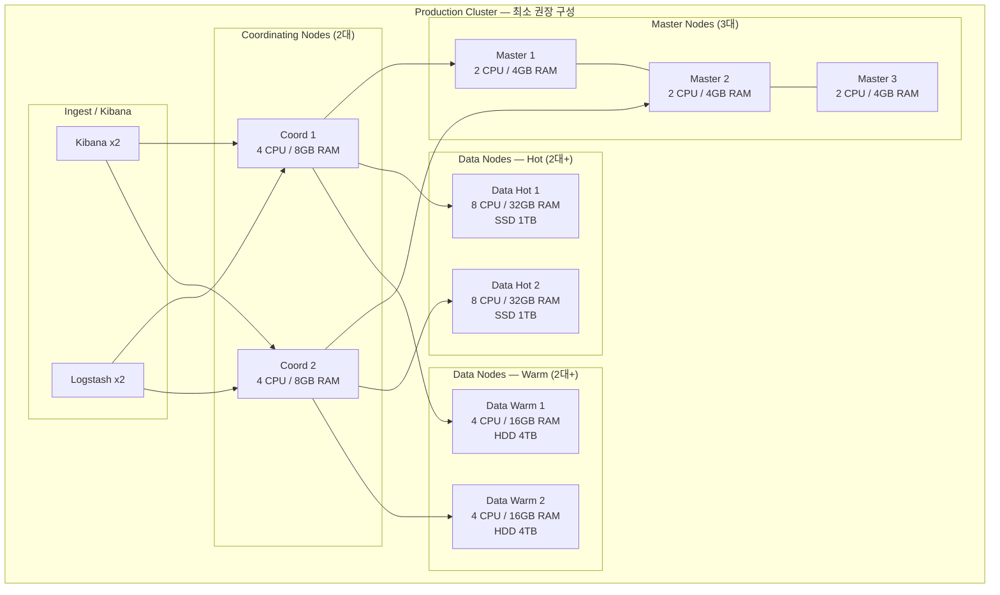
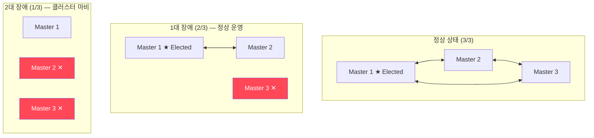
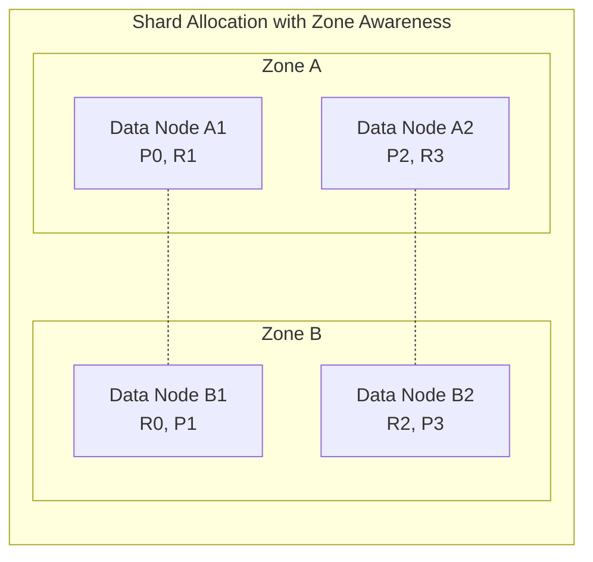
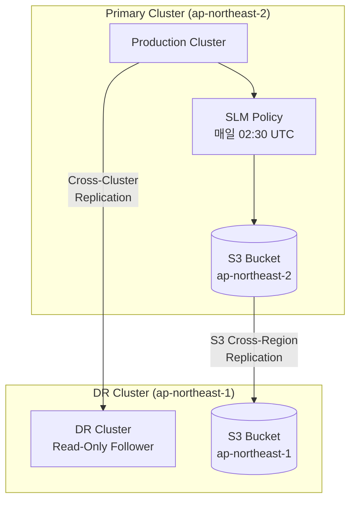
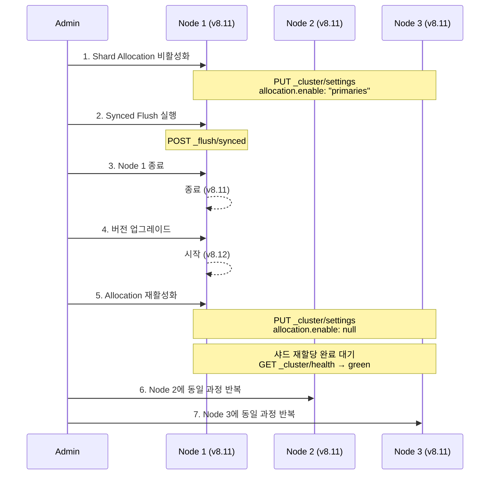
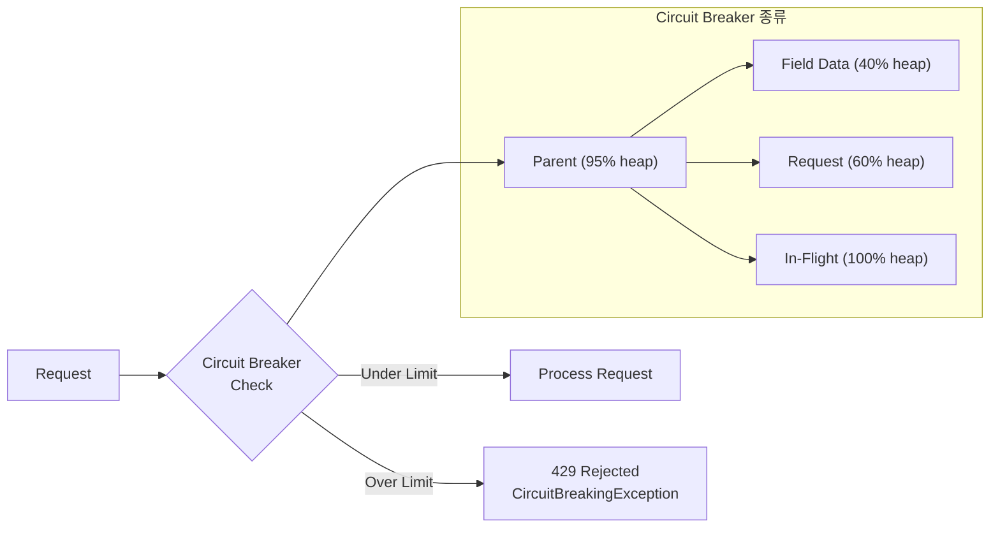

# 프로덕션 운영 베스트 프랙티스

Elasticsearch 클러스터를 프로덕션 환경에서 안정적으로 운영하기 위한 고가용성 구성, 백업, 업그레이드, 용량 계획, 운영 자동화 전략을 체계적으로 정리한다.

## 목차
- [1. 핵심 개념 (What)](#1-핵심-개념-what)
- [2. 왜 알아야 하는가 (Why)](#2-왜-알아야-하는가-why)
- [3. 내부 구현 분석 (How)](#3-내부-구현-분석-how)
- [4. 실전 예제](#4-실전-예제)
- [5. 정리](#5-정리)

---

## 1. 핵심 개념 (What)

### 프로덕션 운영의 5대 축

| 축 | 목표 | 핵심 질문 |
|----|------|----------|
| **고가용성(HA)** | 단일 장애점 제거 | 노드 1대가 죽어도 서비스가 유지되는가? |
| **백업/복구** | 데이터 보호 | 클러스터 전체가 소실되어도 복구 가능한가? |
| **업그레이드** | 무중단 버전 관리 | 서비스 중단 없이 버전을 올릴 수 있는가? |
| **용량 계획** | 리소스 예측 | 6개월 후에도 현재 구성으로 충분한가? |
| **운영 자동화** | 반복 작업 제거 | 수동 개입 없이 일상 운영이 가능한가? |

### 프로덕션 클러스터 최소 구성



---

## 2. 왜 알아야 하는가 (Why)

### 개발 환경과 프로덕션의 결정적 차이

개발 환경에서 단일 노드로 잘 돌아가던 Elasticsearch가 프로덕션에서는 완전히 다른 양상을 보인다:

1. **트래픽 규모**: 초당 수천~수만 건의 인덱싱과 수백 건의 검색 동시 발생
2. **가용성 요구**: 99.9% 이상 업타임 — 연간 다운타임 8.7시간 이내
3. **데이터 보호**: 규정(GDPR, 정보통신망법)에 따라 특정 기간 보존 의무
4. **장애 전파**: Elasticsearch 장애가 로깅, 모니터링, 검색 서비스에 동시 영향

### 베스트 프랙티스를 따르지 않으면

- Master 1대 구성 → Master 다운 시 **클러스터 전체 마비**
- 백업 미설정 → 디스크 장애 시 **데이터 영구 손실**
- 무계획 업그레이드 → 호환성 문제로 **롤백 불가** 상태
- 용량 미예측 → 트래픽 피크에 **디스크 풀/OOM** 발생

---

## 3. 내부 구현 분석 (How)

### 3.1 고가용성(HA) 구성 전략

#### Master Node 쿼럼 메커니즘

Elasticsearch 7.x 이상에서는 자동 쿼럼(quorum)을 사용한다. Master 후보 노드 3대 구성 시, 과반수인 2대가 생존해야 클러스터가 동작한다.



**핵심 원칙**:
- Master 전용 노드 3대 (Data 역할 제외하여 안정성 확보)
- Master 노드는 서로 **다른 물리 호스트/AZ**에 배치
- Master 노드의 리소스 요구량은 낮음 (2 CPU, 4GB RAM 충분)
- `cluster.routing.allocation.awareness.attributes: zone` 으로 AZ 분산

#### Data Node 레플리카 전략



- Primary와 Replica는 반드시 다른 Zone에 배치
- `number_of_replicas: 1` 이 최소 (Zone 2개 기준)
- Zone 3개라면 `number_of_replicas: 2` 로 설정하여 2-Zone 장애까지 대비

### 3.2 백업 전략: SLM + Cross-Cluster Replication



**3계층 백업 전략**:

| 계층 | 방식 | RPO | RTO | 용도 |
|------|------|-----|-----|------|
| 1차 | Replica Shard | 0 (실시간) | 즉시 | 노드 장애 |
| 2차 | SLM Snapshot → S3 | 최대 24시간 | 수 시간 | 클러스터 장애 |
| 3차 | CCR (Cross-Cluster Replication) | 수 초 | 수 분 (수동 전환) | 리전 장애 |

### 3.3 Rolling Upgrade 동작 원리



**Rolling Upgrade 규칙**:
- 한 번에 1개의 노드만 업그레이드
- Data Node → Master Node 순서 (Master는 마지막)
- **Minor 버전 간** 롤링 업그레이드 지원 (8.11 → 8.12)
- **Major 버전**은 직전 마지막 Minor를 먼저 거쳐야 함 (7.17 → 8.x)

### 3.4 용량 계획 공식

```
일일 인덱싱 용량 산정:
━━━━━━━━━━━━━━━━━━━━━━━
Raw Data (GB/day)  = 이벤트 수/일 × 평균 이벤트 크기
Index Size (GB/day) = Raw Data × (1 + 인덱싱 오버헤드 비율)
                     ※ 오버헤드: 보통 10~15%

총 스토리지 요구량:
━━━━━━━━━━━━━━━━━━━━━━━
Total Storage = Index Size × 보존 일수 × (1 + Replica 수)
              + 15% 여유 공간 (워터마크 대비)

노드 수 산정:
━━━━━━━━━━━━━━━━━━━━━━━
Data Node 수 = Total Storage / 노드당 디스크 용량
             = max(스토리지 기반, 성능 기반)

JVM Heap 산정:
━━━━━━━━━━━━━━━━━━━━━━━
Heap = min(물리 RAM의 50%, 31GB)
※ 31GB 초과 시 Compressed OOP 비활성화로 오히려 성능 저하
```

---

## 4. 실전 예제

### 4.1 고가용성 클러스터 설정

```yaml
# elasticsearch.yml — Master Node
cluster.name: production
node.name: master-1
node.roles: [ master ]

# 네트워크
network.host: 0.0.0.0
discovery.seed_hosts:
  - master-1.internal:9300
  - master-2.internal:9300
  - master-3.internal:9300
cluster.initial_master_nodes:
  - master-1
  - master-2
  - master-3

# Zone Awareness
node.attr.zone: az-a
cluster.routing.allocation.awareness.attributes: zone
cluster.routing.allocation.awareness.force.zone.values: az-a,az-b

# 안정성 설정
gateway.expected_data_nodes: 4
gateway.recover_after_data_nodes: 3

# 보안
xpack.security.enabled: true
xpack.security.transport.ssl.enabled: true
```

```yaml
# elasticsearch.yml — Data Hot Node
cluster.name: production
node.name: data-hot-1
node.roles: [ data_hot, data_content, ingest ]

node.attr.zone: az-a
node.attr.data: hot

# JVM: 물리 RAM 64GB 기준
# jvm.options: -Xms31g -Xmx31g

# Thread Pool 튜닝
thread_pool.write.queue_size: 1000
thread_pool.search.queue_size: 1000

# Circuit Breaker
indices.breaker.total.limit: 70%
indices.breaker.fielddata.limit: 40%
indices.breaker.request.limit: 40%
```

```yaml
# elasticsearch.yml — Coordinating Node
cluster.name: production
node.name: coord-1
node.roles: [ ]  # 빈 역할 = Coordinating Only

node.attr.zone: az-a

# 검색 전용이므로 충분한 request breaker
indices.breaker.request.limit: 60%
```

### 4.2 SLM (Snapshot Lifecycle Management) 정책

```json
// 1. S3 Snapshot Repository 등록
// PUT _snapshot/s3-production-backup
{
  "type": "s3",
  "settings": {
    "bucket": "elk-backup-production",
    "region": "ap-northeast-2",
    "base_path": "snapshots",
    "compress": true,
    "server_side_encryption": true,
    "storage_class": "standard_ia",
    "max_snapshot_bytes_per_sec": "200mb",
    "max_restore_bytes_per_sec": "200mb"
  }
}

// 2. SLM 정책: 매일 새벽 2시 30분 스냅샷
// PUT _slm/policy/daily-production-backup
{
  "schedule": "0 30 2 * * ?",
  "name": "<daily-prod-{now/d}>",
  "repository": "s3-production-backup",
  "config": {
    "indices": ["logs-*", "metrics-*", "apm-*", ".kibana*", ".security*"],
    "ignore_unavailable": true,
    "include_global_state": true,
    "partial": false
  },
  "retention": {
    "expire_after": "90d",
    "min_count": 7,
    "max_count": 90
  }
}

// 3. SLM 정책: 주간 전체 백업
// PUT _slm/policy/weekly-full-backup
{
  "schedule": "0 0 3 ? * SUN",
  "name": "<weekly-full-{now/d}>",
  "repository": "s3-production-backup",
  "config": {
    "indices": ["*"],
    "ignore_unavailable": true,
    "include_global_state": true
  },
  "retention": {
    "expire_after": "365d",
    "min_count": 4,
    "max_count": 52
  }
}
```

### 4.3 Cross-Cluster Replication (CCR) 설정

```json
// Primary Cluster: 리더 인덱스 설정 (soft_deletes 필수)
// PUT logs-critical-production
{
  "settings": {
    "number_of_shards": 3,
    "number_of_replicas": 1,
    "soft_deletes.retention_lease.period": "24h"
  }
}

// DR Cluster: 원격 클러스터 연결
// PUT _cluster/settings
{
  "persistent": {
    "cluster.remote.primary-cluster": {
      "seeds": [
        "master-1.primary.internal:9300",
        "master-2.primary.internal:9300",
        "master-3.primary.internal:9300"
      ],
      "transport.compress": true,
      "skip_unavailable": false
    }
  }
}

// DR Cluster: 팔로워 인덱스 생성
// PUT logs-critical-production/_ccr/follow
{
  "remote_cluster": "primary-cluster",
  "leader_index": "logs-critical-production",
  "max_read_request_operation_count": 5120,
  "max_outstanding_read_requests": 12,
  "max_read_request_size": "32mb",
  "max_write_request_operation_count": 5120,
  "max_write_buffer_count": 512,
  "max_retry_delay": "500ms",
  "read_poll_timeout": "1m"
}

// Auto-Follow Pattern (새 인덱스 자동 복제)
// PUT _ccr/auto_follow/logs-pattern
{
  "remote_cluster": "primary-cluster",
  "leader_index_patterns": ["logs-critical-*"],
  "follow_index_pattern": "{{leader_index}}"
}
```

### 4.4 Rolling Upgrade 자동화 스크립트

```bash
#!/bin/bash
# rolling-upgrade.sh — Elasticsearch Rolling Upgrade 자동화
# 사용법: ./rolling-upgrade.sh <node-name> <new-version>

set -euo pipefail

NODE_NAME="${1:?Usage: $0 <node-name> <new-version>}"
NEW_VERSION="${2:?Usage: $0 <node-name> <new-version>}"

ES_HOST="${ES_HOST:-https://localhost:9200}"
ES_USER="${ES_USER:-elastic}"
ES_PASS="${ES_PASS:-changeme}"
CURL="curl -sk -u ${ES_USER}:${ES_PASS}"

echo "[$(date)] Starting rolling upgrade for ${NODE_NAME} to ${NEW_VERSION}"

# 1. 클러스터 상태 확인 — Green이 아니면 중단
HEALTH=$(${CURL} -s "${ES_HOST}/_cluster/health" | python3 -c "import sys,json; print(json.load(sys.stdin)['status'])")
if [ "${HEALTH}" != "green" ]; then
    echo "ERROR: Cluster is ${HEALTH}. Upgrade aborted. Cluster must be green."
    exit 1
fi
echo "[$(date)] Cluster health: green — proceeding"

# 2. Shard Allocation 비활성화
echo "[$(date)] Disabling shard allocation..."
${CURL} -X PUT "${ES_HOST}/_cluster/settings" -H 'Content-Type: application/json' -d '{
  "persistent": {
    "cluster.routing.allocation.enable": "primaries"
  }
}'
echo ""

# 3. Synced Flush (8.x 이전) / Flush (8.x+)
echo "[$(date)] Flushing indices..."
${CURL} -X POST "${ES_HOST}/_flush"
echo ""

# 4. 노드 종료
echo "[$(date)] Stopping ${NODE_NAME}..."
ssh "${NODE_NAME}" "systemctl stop elasticsearch"

# 5. 패키지 업그레이드
echo "[$(date)] Upgrading to ${NEW_VERSION}..."
ssh "${NODE_NAME}" "
    rpm -U elasticsearch-${NEW_VERSION}-x86_64.rpm || \
    dpkg -i elasticsearch-${NEW_VERSION}-amd64.deb
"

# 6. 노드 시작
echo "[$(date)] Starting ${NODE_NAME}..."
ssh "${NODE_NAME}" "systemctl start elasticsearch"

# 7. 노드 조인 대기
echo "[$(date)] Waiting for ${NODE_NAME} to join cluster..."
for i in $(seq 1 60); do
    NODES=$(${CURL} -s "${ES_HOST}/_cat/nodes?h=name" | grep -c "${NODE_NAME}" || true)
    if [ "${NODES}" -ge 1 ]; then
        echo "[$(date)] ${NODE_NAME} joined cluster"
        break
    fi
    sleep 5
done

# 8. Shard Allocation 재활성화
echo "[$(date)] Re-enabling shard allocation..."
${CURL} -X PUT "${ES_HOST}/_cluster/settings" -H 'Content-Type: application/json' -d '{
  "persistent": {
    "cluster.routing.allocation.enable": null
  }
}'
echo ""

# 9. Green 상태 대기
echo "[$(date)] Waiting for cluster to return to green..."
for i in $(seq 1 120); do
    HEALTH=$(${CURL} -s "${ES_HOST}/_cluster/health" | python3 -c "import sys,json; print(json.load(sys.stdin)['status'])")
    if [ "${HEALTH}" == "green" ]; then
        echo "[$(date)] Cluster is green. Upgrade of ${NODE_NAME} complete."
        exit 0
    fi
    echo "  Status: ${HEALTH} — waiting... (${i}/120)"
    sleep 10
done

echo "WARNING: Cluster did not return to green within 20 minutes."
echo "Check: ${ES_HOST}/_cluster/health?pretty"
exit 1
```

### 4.5 용량 계획 체크리스트

```markdown
## 용량 계획 워크시트

### 입력 값
- 일일 이벤트 수:          __________ 건/일
- 평균 이벤트 크기:        __________ bytes
- 인덱싱 오버헤드:         10~15% (기본 10%)
- 보존 기간:               __________ 일
- Replica 수:              __________ (최소 1)

### 스토리지 계산
- Raw Data/일:             이벤트 수 × 평균 크기 = ______ GB
- Index Size/일:           Raw Data × 1.10 = ______ GB
- 총 Index 크기:           Index Size × 보존 일수 = ______ GB
- Replica 포함:            총 크기 × (1 + Replica 수) = ______ GB
- 워터마크 여유 (15%):     ÷ 0.85 = ______ GB
- **필요 총 스토리지:      ______ GB**

### 노드 계산
- 노드당 디스크:           __________ GB
- **필요 Data Node 수:     총 스토리지 ÷ 노드당 디스크 = ____ 대**

### RAM 계산 (Data Node)
- 샤드 수 총합:            인덱스 수 × 샤드 수 × (1 + Replica)
- 샤드당 힙:               ~10MB
- 필요 힙:                 샤드 수 × 10MB (최소 4GB, 최대 31GB)
- **노드당 RAM:            힙 × 2 = ______ GB**

### 검증 기준
- [ ] 샤드당 크기 50GB 이하
- [ ] 노드당 샤드 수 1000개 이하
- [ ] Heap 사용률 평시 70% 이하
- [ ] 디스크 사용률 70% 이하 (피크 기준)
- [ ] 6개월 성장분 반영
```

### 4.6 운영 자동화: API 기반 관리 스크립트 모음

```bash
#!/bin/bash
# elk-ops.sh — ELK 운영 자동화 도구 모음
# 사용법: ./elk-ops.sh <command> [options]

ES_HOST="${ES_HOST:-https://localhost:9200}"
ES_USER="${ES_USER:-elastic}"
ES_PASS="${ES_PASS:-changeme}"
CURL="curl -sk -u ${ES_USER}:${ES_PASS} -H 'Content-Type: application/json'"

case "${1:-help}" in
    # ─── 클러스터 상태 ───
    health)
        eval ${CURL} "${ES_HOST}/_cluster/health?pretty"
        ;;

    nodes)
        eval ${CURL} "${ES_HOST}/_cat/nodes?v&h=name,ip,heap.percent,ram.percent,cpu,load_1m,disk.used_percent,node.role,master"
        ;;

    # ─── 인덱스 관리 ───
    large-indices)
        echo "=== Top 20 Largest Indices ==="
        eval ${CURL} "${ES_HOST}/_cat/indices?v&h=index,docs.count,store.size,pri.store.size&s=store.size:desc" | head -21
        ;;

    ilm-errors)
        echo "=== ILM Error Indices ==="
        eval ${CURL} "${ES_HOST}/*/_ilm/explain?only_errors=true&pretty"
        ;;

    ilm-retry-all)
        echo "=== Retrying all failed ILM steps ==="
        INDICES=$(eval ${CURL} -s "${ES_HOST}/*/_ilm/explain?only_errors=true" | \
            python3 -c "import sys,json; d=json.load(sys.stdin); [print(k) for k,v in d.get('indices',{}).items() if v.get('step','')=='ERROR']")
        for idx in ${INDICES}; do
            echo "Retrying: ${idx}"
            eval ${CURL} -X POST "${ES_HOST}/${idx}/_ilm/retry"
        done
        ;;

    # ─── 샤드 관리 ───
    unassigned)
        echo "=== Unassigned Shards ==="
        eval ${CURL} "${ES_HOST}/_cat/shards?v&h=index,shard,prirep,state,unassigned.reason&s=state:desc" | grep UNASSIGNED
        ;;

    reroute-retry)
        echo "=== Retrying failed shard allocation ==="
        eval ${CURL} -X POST "${ES_HOST}/_cluster/reroute?retry_failed=true&pretty"
        ;;

    # ─── 백업 관리 ───
    snapshot-status)
        echo "=== Recent Snapshots ==="
        eval ${CURL} "${ES_HOST}/_cat/snapshots?v&s=end_epoch:desc" | head -11
        ;;

    snapshot-now)
        REPO="${2:-s3-production-backup}"
        NAME="manual-$(date +%Y%m%d-%H%M%S)"
        echo "=== Creating snapshot: ${NAME} ==="
        eval ${CURL} -X PUT "${ES_HOST}/_snapshot/${REPO}/${NAME}?wait_for_completion=false" -d '{
            "indices": "*",
            "ignore_unavailable": true,
            "include_global_state": true
        }'
        ;;

    # ─── 성능 진단 ───
    hot-threads)
        eval ${CURL} "${ES_HOST}/_nodes/hot_threads?threads=3&interval=500ms"
        ;;

    pending-tasks)
        eval ${CURL} "${ES_HOST}/_cluster/pending_tasks?pretty"
        ;;

    long-running-tasks)
        echo "=== Tasks running > 60s ==="
        eval ${CURL} -s "${ES_HOST}/_tasks?detailed&group_by=parents" | \
            python3 -c "
import sys, json
data = json.load(sys.stdin)
for node_id, node in data.get('nodes', {}).items():
    for task_id, task in node.get('tasks', {}).items():
        running_ms = task.get('running_time_in_nanos', 0) / 1e6
        if running_ms > 60000:
            print(f'  {task_id}: {task[\"action\"]} — {running_ms/1000:.0f}s')
"
        ;;

    # ─── Disk 관리 ───
    disk)
        eval ${CURL} "${ES_HOST}/_cat/allocation?v&h=node,disk.percent,disk.used,disk.avail,shards"
        ;;

    clear-readonly)
        echo "=== Clearing read_only_allow_delete blocks ==="
        eval ${CURL} -X PUT "${ES_HOST}/_all/_settings" -d '{
            "index.blocks.read_only_allow_delete": null
        }'
        ;;

    # ─── 도움말 ───
    help|*)
        cat <<'HELP'
ELK Operations Tool

Usage: elk-ops.sh <command>

Cluster:
  health              Show cluster health
  nodes               Show node status
  hot-threads         Show hot threads
  pending-tasks       Show pending cluster tasks
  long-running-tasks  Show tasks running > 60s

Index:
  large-indices       Show top 20 largest indices
  ilm-errors          Show indices with ILM errors
  ilm-retry-all       Retry all failed ILM steps

Shards:
  unassigned          Show unassigned shards
  reroute-retry       Retry failed shard allocations

Backup:
  snapshot-status     Show recent snapshots
  snapshot-now [repo] Create manual snapshot

Disk:
  disk                Show disk allocation per node
  clear-readonly      Clear flood-stage read-only blocks

Environment variables:
  ES_HOST  (default: https://localhost:9200)
  ES_USER  (default: elastic)
  ES_PASS  (default: changeme)
HELP
        ;;
esac
```

---

## 5. 정리

| 영역 | 핵심 권장 사항 | 절대 하지 말 것 |
|------|--------------|----------------|
| **HA 구성** | Master 전용 3대, Data 2대+, Zone Awareness | Master와 Data 역할 혼용, 단일 AZ 배치 |
| **백업** | SLM 매일 자동 + 분기별 복원 테스트 | 백업 없이 운영, 복원 테스트 미실시 |
| **업그레이드** | Rolling Upgrade, 1노드씩, Green 확인 후 진행 | 전체 노드 동시 중지, Major 버전 직접 점프 |
| **용량 계획** | 6개월 성장분 반영, 샤드당 50GB 이하 | 현재 사용량만 기준, 무제한 샤드 생성 |
| **자동화** | API 기반 운영 스크립트, 정기 헬스체크 | 수동 curl 반복, 모니터링 없는 운영 |

### 프로덕션 운영 체크리스트 (배포 전 필수)

```
[ ] Master 전용 노드 3대 (서로 다른 AZ)
[ ] Data Node Replica >= 1, Zone Awareness 활성화
[ ] JVM Heap = min(RAM/2, 31GB), Request = Limit
[ ] vm.max_map_count = 262144
[ ] bootstrap.memory_lock = true (스왑 방지)
[ ] SLM 스냅샷 정책 등록 및 테스트 완료
[ ] ILM 정책 적용 (Hot → Warm → Cold → Delete)
[ ] Circuit Breaker 설정 확인
[ ] Slow Log 임계값 설정
[ ] 모니터링 대시보드 구성 (Stack Monitoring 또는 Prometheus)
[ ] 알림 설정 (클러스터 상태, 디스크, 힙 사용률)
[ ] 용량 계획 워크시트 작성 및 검증
[ ] 장애 대응 런북(Runbook) 작성
[ ] 복원 테스트 스케줄 등록
```

---

## 보충: 트러블슈팅 심화

> 이 섹션은 infrastructure/ELK 트러블슈팅 문서에서 통합된 보충 자료로, 프로덕션 운영 중 발생하는 장애 진단/복구에 유용한 추가 기법을 다룬다.

### Circuit Breaker 동작 원리



Circuit Breaker는 메모리 사용량이 임계값을 초과하기 전에 요청을 거부하여 OOM을 예방한다.

### Stale Primary 복구 (allocate_stale_primary)

`allocate_empty_primary`와 달리, Stale Copy에서 복구하면 일부 데이터를 살릴 수 있다:

```bash
# Stale Copy에서 복구 (일부 데이터 유실 가능하지만 empty보다 나음)
curl -X POST "localhost:9200/_cluster/reroute" \
  -H "Content-Type: application/json" \
  -d '{
    "commands": [
      {
        "allocate_stale_primary": {
          "index": "logs-2026.03.07",
          "shard": 0,
          "node": "es-node-01",
          "accept_data_loss": true
        }
      }
    ]
  }'
```

### 쿼리 최적화 패턴

```bash
# Bad: wildcard leading (인덱스 전체 스캔)
# {"query": {"wildcard": {"message": {"value": "*error*"}}}}

# Good: match 쿼리 사용
curl -X GET "localhost:9200/logs-*/_search" \
  -H "Content-Type: application/json" \
  -d '{"query": {"match": {"message": "error"}}}'

# Bad: 대량 결과 deep pagination
# {"from": 10000, "size": 10}

# Good: search_after 사용
curl -X GET "localhost:9200/logs-*/_search" \
  -H "Content-Type: application/json" \
  -d '{
    "size": 100,
    "sort": [{"@timestamp": "desc"}, {"_id": "asc"}],
    "search_after": ["2026-03-07T10:00:00.000Z", "doc_id_123"],
    "query": {"match_all": {}}
  }'

# Bad: 모든 필드 반환 (_source: true)
# Good: 필요한 필드만 반환
curl -X GET "localhost:9200/logs-*/_search" \
  -H "Content-Type: application/json" \
  -d '{
    "query": {"match_all": {}},
    "_source": ["@timestamp", "level", "message"],
    "size": 100
  }'
```

### Search Profiler 활용

```bash
curl -X GET "localhost:9200/logs-*/_search" \
  -H "Content-Type: application/json" \
  -d '{
    "profile": true,
    "query": {
      "bool": {
        "must": [
          {"match": {"message": "error timeout"}}
        ],
        "filter": [
          {"range": {"@timestamp": {"gte": "now-1h"}}}
        ]
      }
    }
  }' | jq '.profile.shards[0].searches[0].query[0] | {
    type: .type,
    description: .description,
    time_in_nanos: .time_in_nanos,
    breakdown: .breakdown
  }'
```

### 노드 복구 절차 (계획된 유지보수)

```bash
# 1. 클러스터에서 노드 제외 (Shard 이동 시작)
curl -X PUT "localhost:9200/_cluster/settings" \
  -H "Content-Type: application/json" \
  -d '{
    "transient": {
      "cluster.routing.allocation.exclude._name": "es-node-03"
    }
  }'

# 2. Shard 이동 완료 대기
watch 'curl -s "localhost:9200/_cat/shards?v" | grep es-node-03 | wc -l'

# 3. 노드 재시작
systemctl restart elasticsearch

# 4. 제외 설정 해제
curl -X PUT "localhost:9200/_cluster/settings" \
  -H "Content-Type: application/json" \
  -d '{
    "transient": {
      "cluster.routing.allocation.exclude._name": null
    }
  }'

# 5. 복구 속도 향상 설정
curl -X PUT "localhost:9200/_cluster/settings" \
  -H "Content-Type: application/json" \
  -d '{
    "transient": {
      "cluster.routing.allocation.node_concurrent_incoming_recoveries": 4,
      "cluster.routing.allocation.node_concurrent_outgoing_recoveries": 4,
      "indices.recovery.max_bytes_per_sec": "200mb"
    }
  }'
```

### Kibana 트러블슈팅

```bash
# Kibana 상태 확인
curl -s "localhost:5601/api/status" | jq '{
  overall_status: .status.overall.level,
  elasticsearch: .status.statuses[] | select(.id | contains("elasticsearch"))
}'

# 흔한 문제 1: "Kibana server is not ready yet"
# 원인: ES 연결 실패 또는 .kibana 인덱스 문제
curl -s "localhost:9200/.kibana*/_count"

# 흔한 문제 2: Saved Objects 마이그레이션 실패
curl -X POST "localhost:5601/api/saved_objects/_migrate" \
  -H "kbn-xsrf: true"

# 흔한 문제 3: 메모리 부족
# kibana.yml에서 Node.js 메모리 제한 증가
# node.options: ["--max-old-space-size=2048"]
```

### Logstash 설정 검증

```bash
# 파이프라인 설정을 실행 전에 테스트
/usr/share/logstash/bin/logstash --config.test_and_exit -f /etc/logstash/conf.d/

# Dead Letter Queue 확인
curl -s "localhost:9600/_node/stats/pipelines" | jq '
  .pipelines | to_entries[] | {
    pipeline: .key,
    dlq_events: .value.dead_letter_queue.queue_size_in_bytes
  }'
```

### 종합 헬스체크 스크립트 (컬러 출력)

```bash
#!/bin/bash
# elk-healthcheck.sh
ES_HOST="${1:-localhost:9200}"
RED='\033[0;31m'
YELLOW='\033[1;33m'
GREEN='\033[0;32m'
NC='\033[0m'

echo "=== ELK Health Check ==="
echo "Target: $ES_HOST"
echo ""

# 1. Cluster Health
HEALTH=$(curl -s "$ES_HOST/_cluster/health")
STATUS=$(echo $HEALTH | jq -r '.status')
case $STATUS in
  green)  echo -e "Cluster Status: ${GREEN}$STATUS${NC}" ;;
  yellow) echo -e "Cluster Status: ${YELLOW}$STATUS${NC}" ;;
  red)    echo -e "Cluster Status: ${RED}$STATUS${NC}" ;;
esac

echo "  Nodes: $(echo $HEALTH | jq '.number_of_nodes')"
echo "  Active Shards: $(echo $HEALTH | jq '.active_shards')"
echo "  Unassigned: $(echo $HEALTH | jq '.unassigned_shards')"
echo ""

# 2. Node Status
echo "=== Node Status ==="
curl -s "$ES_HOST/_cat/nodes?v&h=name,heap.percent,ram.percent,cpu,load_1m,disk.used_percent,node.role"
echo ""

# 3. Problem Indices
echo "=== Problem Indices ==="
PROBLEM=$(curl -s "$ES_HOST/_cat/indices?v&health=red,yellow&s=health" 2>/dev/null)
if [ -z "$PROBLEM" ]; then
  echo -e "${GREEN}No problem indices found${NC}"
else
  echo "$PROBLEM"
fi
echo ""

# 4. Disk Watermark Check
echo "=== Disk Usage ==="
curl -s "$ES_HOST/_cat/allocation?v&s=disk.percent:desc"
echo ""

# 5. JVM Heap Pressure
echo "=== JVM Heap Pressure ==="
curl -s "$ES_HOST/_nodes/stats/jvm" | jq -r '
  .nodes | to_entries[] |
  "\(.value.name): \(.value.jvm.mem.heap_used_percent)% heap used"'
echo ""

# 6. Circuit Breaker Trips
echo "=== Circuit Breaker Status ==="
curl -s "$ES_HOST/_nodes/stats/breaker" | jq -r '
  .nodes | to_entries[] |
  .value as $node |
  .value.breakers | to_entries[] |
  select(.value.tripped > 0) |
  "\($node.name) - \(.key): tripped \(.value.tripped) times"'

echo "=== Health Check Complete ==="
```

---
*참고: Elasticsearch 8.x / Logstash 8.x / Kibana 8.x 기준*
