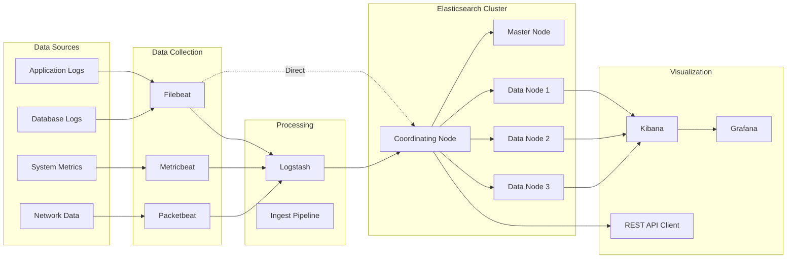
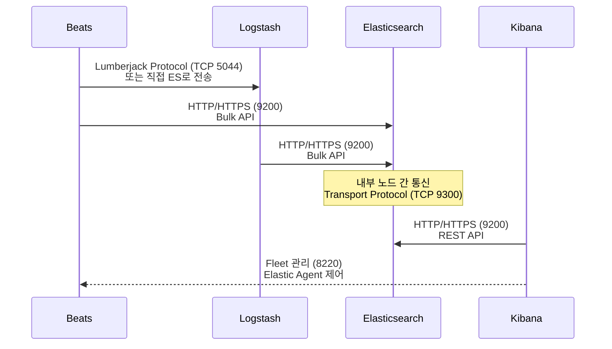

# ELK 스택 개요와 아키텍처

Elasticsearch, Logstash, Kibana로 구성된 ELK 스택의 전체 아키텍처와 각 컴포넌트의 역할, 데이터 흐름을 살펴본다.

## 목차
- [1. 핵심 개념 (What)](#1-핵심-개념-what)
- [2. 왜 알아야 하는가 (Why)](#2-왜-알아야-하는가-why)
- [3. 내부 구현 분석 (How)](#3-내부-구현-분석-how)
- [4. 실전 예제](#4-실전-예제)
- [5. 정리](#5-정리)

---

## 1. 핵심 개념 (What)

### ELK 스택이란?

ELK는 세 개의 오픈소스 프로젝트의 앞글자를 조합한 약어다.

| 컴포넌트 | 역할 | 핵심 기능 |
|-----------|------|-----------|
| **Elasticsearch** | 분산 검색/분석 엔진 | 인덱싱, 검색, 집계(Aggregation) |
| **Logstash** | 데이터 수집/변환 파이프라인 | Input → Filter → Output |
| **Kibana** | 시각화/대시보드 | 데이터 탐색, 대시보드, 알림 |

### ELK에서 Elastic Stack으로의 진화

초기 ELK 스택은 세 컴포넌트로 시작했지만, 시간이 지나며 생태계가 확장되었다.

```
[2012] ELK Stack 탄생
  └─ Elasticsearch + Logstash + Kibana

[2015] Beats 추가 → Elastic Stack으로 리브랜딩
  └─ Filebeat, Metricbeat, Packetbeat, Heartbeat 등

[2018] Elastic Agent 도입
  └─ 단일 에이전트로 여러 Beat 통합 관리

[2020~] Elastic Security, Observability, Enterprise Search
  └─ 솔루션 단위 패키징

[2023~] Serverless (Elastic Cloud Serverless)
  └─ 인프라 관리 없이 사용 가능
```

### Beats 패밀리

Beats는 경량 데이터 수집기(data shipper)로, 각각 특정 데이터 소스에 특화되어 있다.

| Beat | 수집 대상 | 사용 사례 |
|------|-----------|-----------|
| **Filebeat** | 로그 파일 | 애플리케이션/시스템 로그 |
| **Metricbeat** | 시스템/서비스 메트릭 | CPU, 메모리, Docker, K8s |
| **Packetbeat** | 네트워크 패킷 | HTTP, MySQL, DNS 트래픽 |
| **Heartbeat** | Uptime 모니터링 | HTTP/TCP/ICMP 헬스체크 |
| **Auditbeat** | 감사(Audit) 데이터 | 파일 무결성, 시스템 콜 |
| **Winlogbeat** | Windows 이벤트 로그 | Windows 보안 이벤트 |

---

## 2. 왜 알아야 하는가 (Why)

### 실무에서 ELK가 필요한 순간

1. **로그 중앙화**: 수십~수백 대의 서버에 분산된 로그를 한곳에서 검색해야 할 때
2. **장애 대응**: 마이크로서비스 환경에서 특정 요청의 전체 경로를 추적할 때 (Distributed Tracing)
3. **보안 모니터링 (SIEM)**: 이상 탐지, 침입 탐지 로그 분석
4. **비즈니스 분석**: 사용자 행동 로그 기반 실시간 대시보드
5. **전문 검색(Full-Text Search)**: 상품 검색, 문서 검색 엔진 구축

### ELK vs 대안

| 솔루션 | 장점 | 단점 |
|--------|------|------|
| **ELK** | 유연성, 대규모 생태계, 자체 호스팅 가능 | 운영 복잡도, 리소스 소비 |
| **Splunk** | 엔터프라이즈 지원, 강력한 SPL | 높은 라이선스 비용 |
| **Grafana + Loki** | 경량, Grafana 통합 | 풀텍스트 인덱싱 없음 |
| **Datadog** | SaaS, 쉬운 설정 | 데이터 양에 따라 비용 급증 |
| **CloudWatch** | AWS 네이티브 통합 | 복잡한 쿼리 제한적 |

---

## 3. 내부 구현 분석 (How)

### 전체 아키텍처 조감도



### 컴포넌트 간 통신 프로토콜



### 데이터 흐름 상세

#### 1단계: 수집 (Collection)

Beats 또는 Logstash Input 플러그인이 소스에서 데이터를 읽어온다.

```yaml
# filebeat.yml - 기본 수집 설정
filebeat.inputs:
  - type: log
    enabled: true
    paths:
      - /var/log/app/*.log
    fields:
      service: my-api
      environment: production
    multiline:
      pattern: '^\d{4}-\d{2}-\d{2}'
      negate: true
      match: after

output.logstash:
  hosts: ["logstash:5044"]
  ssl.certificate_authorities: ["/etc/pki/ca.crt"]
```

#### 2단계: 변환 (Transformation)

Logstash Filter 플러그인이 데이터를 파싱하고 변환한다.

```ruby
# logstash.conf
input {
  beats {
    port => 5044
    ssl => true
    ssl_certificate => "/etc/pki/server.crt"
    ssl_key => "/etc/pki/server.key"
  }
}

filter {
  # JSON 로그 파싱
  json {
    source => "message"
    target => "parsed"
  }
  
  # 타임스탬프 변환
  date {
    match => ["[parsed][timestamp]", "ISO8601"]
    target => "@timestamp"
  }
  
  # GeoIP 정보 추가
  geoip {
    source => "[parsed][client_ip]"
    target => "geoip"
  }
  
  # 불필요한 필드 제거
  mutate {
    remove_field => ["[parsed][password]", "[parsed][token]"]
  }
}

output {
  elasticsearch {
    hosts => ["https://es-node1:9200", "https://es-node2:9200"]
    index => "app-logs-%{+YYYY.MM.dd}"
    user => "logstash_writer"
    password => "${ES_PASSWORD}"
    ssl_certificate_verification => true
  }
}
```

#### 3단계: 저장 및 인덱싱 (Indexing)

Elasticsearch가 문서를 받아 인덱싱한다. 이 단계의 상세 내용은 [03-elasticsearch-indexing.md](./03-elasticsearch-indexing.md)에서 다룬다.

#### 4단계: 시각화 (Visualization)

Kibana에서 Discover, Dashboard, Lens 등을 통해 데이터를 탐색한다.

### Elasticsearch Ingest Pipeline (Logstash 없이 변환)

Logstash를 거치지 않고 Elasticsearch 자체에서 데이터를 변환할 수도 있다.

```json
PUT _ingest/pipeline/app-log-pipeline
{
  "description": "Application log processing pipeline",
  "processors": [
    {
      "json": {
        "field": "message",
        "target_field": "parsed"
      }
    },
    {
      "date": {
        "field": "parsed.timestamp",
        "formats": ["ISO8601"],
        "target_field": "@timestamp"
      }
    },
    {
      "geoip": {
        "field": "parsed.client_ip",
        "target_field": "geoip"
      }
    },
    {
      "remove": {
        "field": ["parsed.password", "parsed.token"],
        "ignore_missing": true
      }
    }
  ]
}
```

---

## 4. 실전 예제

### 예제 1: Docker Compose로 ELK 스택 구축

```yaml
# docker-compose.yml
version: "3.8"

services:
  elasticsearch:
    image: docker.elastic.co/elasticsearch/elasticsearch:8.13.0
    container_name: es01
    environment:
      - node.name=es01
      - cluster.name=dev-cluster
      - discovery.type=single-node
      - xpack.security.enabled=true
      - ELASTIC_PASSWORD=${ELASTIC_PASSWORD}
      - "ES_JAVA_OPTS=-Xms1g -Xmx1g"
    volumes:
      - es-data:/usr/share/elasticsearch/data
    ports:
      - "9200:9200"
      - "9300:9300"
    networks:
      - elk
    healthcheck:
      test: ["CMD-SHELL", "curl -s -u elastic:${ELASTIC_PASSWORD} http://localhost:9200/_cluster/health | grep -q '\"status\":\"green\"\\|\"status\":\"yellow\"'"]
      interval: 30s
      timeout: 10s
      retries: 5

  logstash:
    image: docker.elastic.co/logstash/logstash:8.13.0
    container_name: logstash
    volumes:
      - ./logstash/pipeline:/usr/share/logstash/pipeline
      - ./logstash/config/logstash.yml:/usr/share/logstash/config/logstash.yml
    ports:
      - "5044:5044"
      - "5000:5000/tcp"
      - "5000:5000/udp"
      - "9600:9600"
    environment:
      - "LS_JAVA_OPTS=-Xms512m -Xmx512m"
    networks:
      - elk
    depends_on:
      elasticsearch:
        condition: service_healthy

  kibana:
    image: docker.elastic.co/kibana/kibana:8.13.0
    container_name: kibana
    environment:
      - ELASTICSEARCH_HOSTS=http://es01:9200
      - ELASTICSEARCH_USERNAME=kibana_system
      - ELASTICSEARCH_PASSWORD=${KIBANA_PASSWORD}
    ports:
      - "5601:5601"
    networks:
      - elk
    depends_on:
      elasticsearch:
        condition: service_healthy

  filebeat:
    image: docker.elastic.co/beats/filebeat:8.13.0
    container_name: filebeat
    user: root
    volumes:
      - ./filebeat/filebeat.yml:/usr/share/filebeat/filebeat.yml:ro
      - /var/lib/docker/containers:/var/lib/docker/containers:ro
      - /var/run/docker.sock:/var/run/docker.sock:ro
    networks:
      - elk
    depends_on:
      elasticsearch:
        condition: service_healthy

volumes:
  es-data:
    driver: local

networks:
  elk:
    driver: bridge
```

### 예제 2: 배포 아키텍처별 구성 패턴

```
[ 소규모 — 단일 노드 ]
App → Filebeat → Elasticsearch (single) → Kibana
  * 개발/테스트 환경
  * 일일 로그 10GB 미만

[ 중규모 — Logstash 포함 ]
App → Filebeat → Logstash → Elasticsearch (3 nodes) → Kibana
  * 스테이징/소규모 프로덕션
  * 복잡한 로그 변환 필요
  * 일일 로그 10~100GB

[ 대규모 — 전체 스택 ]
App → Filebeat ─┬─→ Kafka ─→ Logstash ─→ ES (Hot/Warm/Cold)
                 └─→ Elastic Agent        → Kibana + Fleet
  * 대규모 프로덕션
  * 일일 로그 100GB 이상
  * 데이터 유실 방지를 위한 Kafka 버퍼
```

### 예제 3: Kibana Data View와 기본 쿼리

```json
// Kibana Dev Tools에서 실행
// 1) 인덱스 패턴에 맞는 데이터 확인
GET app-logs-*/_search
{
  "size": 5,
  "sort": [{ "@timestamp": "desc" }],
  "query": {
    "bool": {
      "must": [
        { "match": { "parsed.level": "ERROR" } }
      ],
      "filter": [
        { "range": { "@timestamp": { "gte": "now-1h" } } }
      ]
    }
  }
}

// 2) 서비스별 에러 수 집계
GET app-logs-*/_search
{
  "size": 0,
  "query": {
    "range": { "@timestamp": { "gte": "now-24h" } }
  },
  "aggs": {
    "by_service": {
      "terms": { "field": "fields.service.keyword", "size": 20 },
      "aggs": {
        "errors": {
          "filter": { "term": { "parsed.level.keyword": "ERROR" } }
        }
      }
    }
  }
}
```

---

## 5. 정리

| 항목 | 요약 |
|------|------|
| **Elasticsearch** | 분산 검색/분석 엔진. REST API 기반으로 JSON 문서를 인덱싱하고 검색한다 |
| **Logstash** | 데이터 수집/변환 파이프라인. Input → Filter → Output 구조 |
| **Kibana** | 시각화/대시보드. Discover, Dashboard, Lens, Dev Tools 제공 |
| **Beats** | 경량 데이터 수집기. Filebeat, Metricbeat 등 목적별로 분리 |
| **Elastic Agent** | 여러 Beat을 하나로 통합. Fleet Server로 중앙 관리 |
| **통신 프로토콜** | HTTP/9200(REST), TCP/9300(Transport), TCP/5044(Lumberjack) |
| **핵심 데이터 흐름** | 수집(Beats) → 변환(Logstash/Ingest) → 저장(ES) → 시각화(Kibana) |
| **아키텍처 선택** | 데이터 규모와 변환 복잡도에 따라 소/중/대규모 패턴 선택 |

---

*참고: Elasticsearch 8.x / Logstash 8.x / Kibana 8.x 기준*
