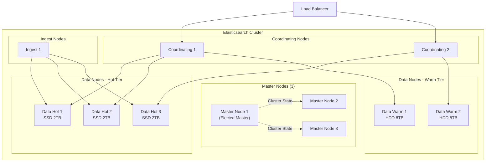
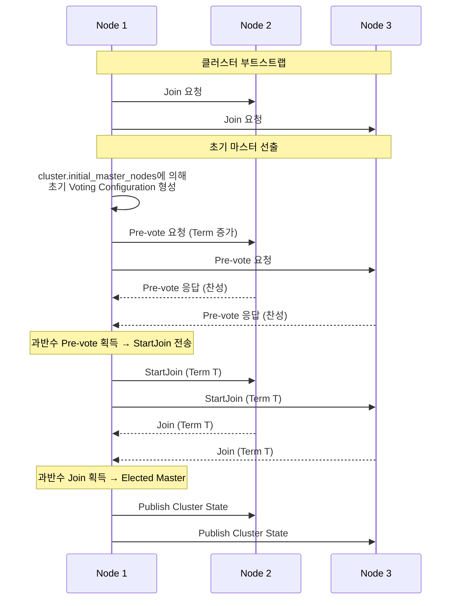
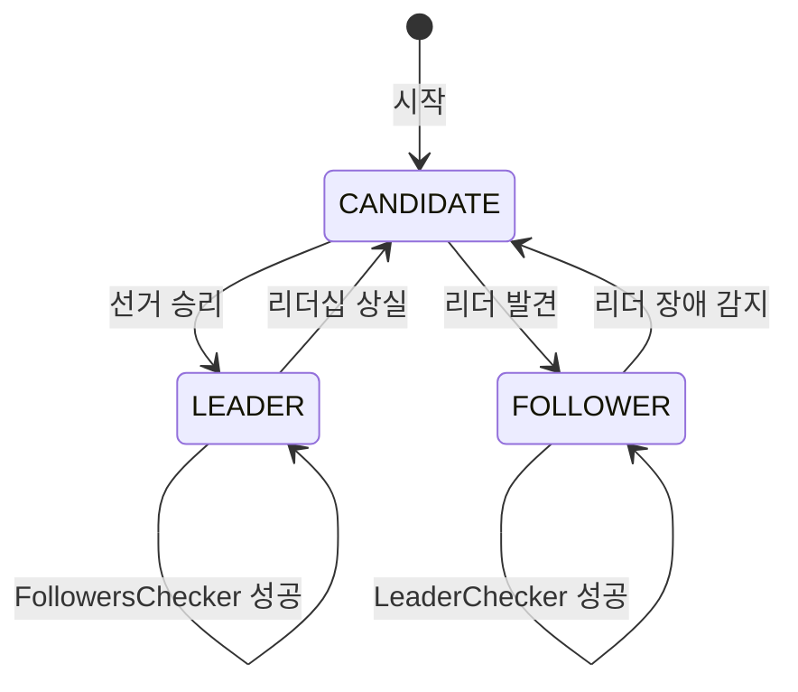
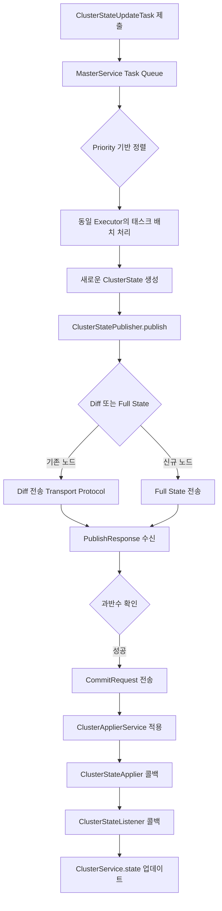

# Elasticsearch 클러스터 아키텍처

Elasticsearch 클러스터를 구성하는 노드 유형, 샤드/레플리카 구조, 마스터 선출 메커니즘, 그리고 Lucene 세그먼트 기반의 Near Real-Time Search 원리를 다룬다.

## 목차
- [1. 핵심 개념 (What)](#1-핵심-개념-what)
- [2. 왜 알아야 하는가 (Why)](#2-왜-알아야-하는가-why)
- [3. 내부 구현 분석 (How)](#3-내부-구현-분석-how)
- [4. 실전 예제](#4-실전-예제)
- [5. 정리](#5-정리)

---

## 1. 핵심 개념 (What)

### 클러스터와 노드

Elasticsearch 클러스터는 하나 이상의 노드(Node)로 구성된다. 클러스터는 고유한 이름(`cluster.name`)으로 식별되며, 같은 클러스터 이름을 가진 노드들이 자동으로 하나의 클러스터를 형성한다.

### 노드 유형 (Node Roles)

| 노드 유형 | Role 설정 | 핵심 역할 | 리소스 특성 |
|-----------|-----------|-----------|-------------|
| **Master-eligible** | `master` | 클러스터 상태 관리, 인덱스 생성/삭제, 샤드 할당 | 저 CPU, 저 메모리, 저 디스크 |
| **Data** | `data` | 문서 인덱싱, 검색, 집계 수행 | 고 CPU, 고 메모리, 고 디스크 |
| **Data Hot** | `data_hot` | 최신 데이터 저장 (빈번한 쓰기/읽기) | SSD, 고 CPU |
| **Data Warm** | `data_warm` | 중간 빈도 접근 데이터 | HDD 가능, 중 CPU |
| **Data Cold** | `data_cold` | 저빈도 접근, 장기 보관 데이터 | 대용량 HDD |
| **Data Frozen** | `data_frozen` | Searchable Snapshot 기반 초저빈도 데이터 | 최소 로컬 캐시 |
| **Coordinating** | (전용) | 검색 요청 라우팅, 결과 병합 | 고 CPU, 고 메모리 |
| **Ingest** | `ingest` | 인덱싱 전 데이터 변환 (Ingest Pipeline) | 중 CPU |
| **ML** | `ml` | 머신러닝 작업 수행 | 고 CPU, 고 메모리 |
| **Remote Cluster Client** | `remote_cluster_client` | Cross-Cluster Search/Replication | 네트워크 |
| **Transform** | `transform` | 데이터 변환 작업 실행 | 중 CPU |

### 샤드(Shard)와 레플리카(Replica)

- **Primary Shard**: 인덱스의 데이터를 수평 분할한 단위. 인덱스 생성 시 개수가 결정되며 변경 불가(reindex 필요).
- **Replica Shard**: Primary Shard의 복제본. 고가용성(HA)과 읽기 처리량 향상에 기여. 동적으로 개수 변경 가능.

```
Index: "app-logs-2024.03"
├── Primary Shard 0  ──→  Replica Shard 0  (다른 노드에 배치)
├── Primary Shard 1  ──→  Replica Shard 1
└── Primary Shard 2  ──→  Replica Shard 2
```

---

## 2. 왜 알아야 하는가 (Why)

### 운영 사고를 예방하기 위해

1. **Split-Brain 방지**: 마스터 선출 메커니즘을 이해하지 못하면 네트워크 파티션 시 데이터 불일치 발생
2. **샤드 설계 실패**: 샤드가 너무 많으면 마스터 노드에 과부하, 너무 적으면 수평 확장 불가
3. **Hot Spot 회피**: 데이터 노드 간 샤드 불균형이 성능 병목으로 이어짐
4. **용량 계획**: 노드별 역할과 리소스 특성을 모르면 과다/과소 프로비저닝

### 샤드 사이징 가이드라인

| 메트릭 | 권장 범위 | 이유 |
|--------|-----------|------|
| 샤드 당 크기 | 10GB ~ 50GB | 너무 작으면 오버헤드, 너무 크면 복구 지연 |
| 노드 당 샤드 수 | 힙 1GB당 20개 이하 | Cluster State 관리 비용 |
| 전체 샤드 수 | 가능한 적게 | 마스터 노드 부하, 메모리 사용량 |

---

## 3. 내부 구현 분석 (How)

### 클러스터 토폴로지



### 마스터 선출 메커니즘

#### Zen Discovery (7.x 이전)

7.x 이전에는 `minimum_master_nodes` 설정으로 Split-Brain을 방지했다. 이 값을 `(master_eligible_nodes / 2) + 1`로 설정해야 했는데, 운영자가 노드 추가/제거 시 이 값을 수동으로 변경해야 하는 번거로움이 있었다.

#### Voting Configuration (7.x 이후)

7.x부터는 자동화된 Voting Configuration 방식을 사용한다.



핵심 변경점:
- `minimum_master_nodes` 설정이 제거됨
- Voting Configuration이 자동으로 관리됨
- 노드 추가/제거 시 자동 조정
- `cluster.initial_master_nodes`는 최초 부트스트랩에서만 사용

### 샤드 할당 메커니즘

마스터 노드는 AllocationDecider 체인을 통해 샤드를 데이터 노드에 배치한다.

```
AllocationDecider 체인:
  1. SameShardAllocationDecider
     └─ Primary와 Replica를 같은 노드에 배치하지 않음
  
  2. AwarenessAllocationDecider
     └─ rack/zone 인식 배치 (cluster.routing.allocation.awareness.attributes)
  
  3. FilterAllocationDecider
     └─ index.routing.allocation.include/exclude/require
  
  4. DiskThresholdDecider
     └─ 디스크 사용량 기반 (low: 85%, high: 90%, flood: 95%)
  
  5. ShardsLimitAllocationDecider
     └─ 노드당 샤드 수 제한
  
  6. RebalanceAllocationDecider
     └─ 노드 간 샤드 균형 유지
```

### Lucene 세그먼트 구조

각 샤드는 내부적으로 하나의 Lucene 인덱스이며, 여러 세그먼트(Segment)로 구성된다.

```
Shard (= Lucene Index)
├── Segment 0 (immutable)
│   ├── .tip  (Term Index - FST)
│   ├── .tim  (Term Dictionary)
│   ├── .doc  (Frequencies/Positions)
│   ├── .dvd  (Doc Values - columnar)
│   ├── .fdt  (Stored Fields)
│   └── .pos  (Positions)
├── Segment 1 (immutable)
│   └── ...
├── Segment 2 (immutable)
│   └── ...
├── Commit Point (segments_N)
│   └── 현재 활성 세그먼트 목록
└── Translog (write-ahead log)
    └── 아직 commit되지 않은 변경사항
```

### Near Real-Time (NRT) Search

문서가 인덱싱된 후 검색 가능해지기까지의 과정:

```
1. 문서 인덱싱 요청 도착
   │
2. 문서가 In-Memory Buffer에 추가 + Translog에 기록
   │  (이 시점에서는 검색 불가)
   │
3. Refresh (기본 1초 간격)
   │  ├── In-Memory Buffer → 새 Segment 생성 (디스크에 fsync 안 함)
   │  ├── Segment가 Searcher에 열림
   │  └── 이제 검색 가능! (Near Real-Time)
   │
4. Flush (기본 30분 간격 또는 Translog 크기 초과)
   │  ├── 모든 In-Memory Segment → 디스크에 fsync
   │  ├── 새 Commit Point 생성
   │  └── Translog 비움
   │
5. Merge (백그라운드)
      ├── 작은 세그먼트들을 큰 세그먼트로 합침
      ├── 삭제 표시된 문서 실제 제거
      └── 검색 성능 최적화
```

### Cluster State

클러스터 상태는 마스터 노드가 관리하는 메타데이터의 집합이다.

```json
// GET /_cluster/state 의 주요 구성 요소
{
  "cluster_name": "production",
  "cluster_uuid": "...",
  "version": 42,         // 상태 버전 (monotonically increasing)
  "state_uuid": "...",
  "master_node": "node-id-1",
  "nodes": {             // 클러스터 내 모든 노드 정보
    "node-id-1": { "name": "master-1", "roles": ["master"] },
    "node-id-2": { "name": "data-hot-1", "roles": ["data_hot"] }
  },
  "metadata": {
    "indices": {          // 모든 인덱스의 매핑, 설정, 별칭
      "app-logs-2024.03.01": {
        "settings": { "number_of_shards": 3, "number_of_replicas": 1 },
        "mappings": { /* ... */ }
      }
    },
    "templates": {},      // 인덱스 템플릿
    "ingest": {}          // Ingest Pipeline 정의
  },
  "routing_table": {      // 샤드 → 노드 매핑
    "indices": {
      "app-logs-2024.03.01": {
        "shards": {
          "0": [
            { "primary": true, "node": "node-id-2", "state": "STARTED" },
            { "primary": false, "node": "node-id-3", "state": "STARTED" }
          ]
        }
      }
    }
  }
}
```

---

## 4. 실전 예제

### 예제 1: 프로덕션 노드 설정

```yaml
# elasticsearch.yml - Master Node
cluster.name: production
node.name: master-1
node.roles: [master]

# 네트워크
network.host: 0.0.0.0
http.port: 9200
transport.port: 9300

# Discovery
discovery.seed_hosts:
  - master-1:9300
  - master-2:9300
  - master-3:9300
cluster.initial_master_nodes:
  - master-1
  - master-2
  - master-3

# 경로
path.data: /data/elasticsearch
path.logs: /var/log/elasticsearch

# 보안
xpack.security.enabled: true
xpack.security.transport.ssl.enabled: true
xpack.security.transport.ssl.keystore.path: elastic-certificates.p12
xpack.security.transport.ssl.truststore.path: elastic-certificates.p12
```

```yaml
# elasticsearch.yml - Data Hot Node
cluster.name: production
node.name: data-hot-1
node.roles: [data_hot, data_content, ingest]

network.host: 0.0.0.0
discovery.seed_hosts:
  - master-1:9300
  - master-2:9300
  - master-3:9300

# Hot Tier 최적화
path.data: /ssd/elasticsearch      # SSD 사용
indices.memory.index_buffer_size: 30%
thread_pool.write.queue_size: 1000
```

```yaml
# elasticsearch.yml - Data Warm Node
cluster.name: production
node.name: data-warm-1
node.roles: [data_warm]

network.host: 0.0.0.0
discovery.seed_hosts:
  - master-1:9300
  - master-2:9300
  - master-3:9300

path.data: /hdd/elasticsearch       # HDD 사용 가능
indices.memory.index_buffer_size: 10%
```

### 예제 2: 샤드 할당 제어

```json
// 인덱스를 특정 Tier로 이동
PUT /app-logs-2024.01.*/_settings
{
  "index.routing.allocation.include._tier_preference": "data_warm,data_hot"
}

// 특정 노드에서 샤드 제외
PUT /app-logs-*/_settings
{
  "index.routing.allocation.exclude._name": "data-hot-3"
}

// Zone 인식 배치 설정 (Multi-AZ)
PUT _cluster/settings
{
  "persistent": {
    "cluster.routing.allocation.awareness.attributes": "zone",
    "cluster.routing.allocation.awareness.force.zone.values": "zone-a,zone-b,zone-c"
  }
}
```

### 예제 3: 클러스터 헬스 모니터링

```json
// 클러스터 전체 상태
GET _cluster/health
// 응답 예시:
{
  "cluster_name": "production",
  "status": "green",                    // green/yellow/red
  "number_of_nodes": 9,
  "number_of_data_nodes": 5,
  "active_primary_shards": 150,
  "active_shards": 300,
  "relocating_shards": 0,
  "initializing_shards": 0,
  "unassigned_shards": 0,              // 0이 아니면 문제!
  "number_of_pending_tasks": 0,
  "active_shards_percent_as_number": 100.0
}

// 할당되지 않은 샤드 원인 분석
GET _cluster/allocation/explain
{
  "index": "app-logs-2024.03.01",
  "shard": 0,
  "primary": true
}

// 노드별 샤드 분포 확인
GET _cat/allocation?v&s=shards:desc
// 출력:
// shards disk.indices disk.used disk.avail disk.total disk.percent host        node
//    60       120gb    180gb      320gb       500gb         36    10.0.1.1    data-hot-1
//    58       115gb    175gb      325gb       500gb         35    10.0.1.2    data-hot-2
//    55       110gb    170gb      330gb       500gb         34    10.0.1.3    data-hot-3

// Hot Threads 분석 (성능 문제 진단)
GET _nodes/hot_threads
```

### 예제 4: ILM (Index Lifecycle Management) 정책

```json
// 인덱스 수명주기 정책 정의
PUT _ilm/policy/app-logs-policy
{
  "policy": {
    "phases": {
      "hot": {
        "min_age": "0ms",
        "actions": {
          "rollover": {
            "max_primary_shard_size": "50gb",
            "max_age": "1d"
          },
          "set_priority": {
            "priority": 100
          }
        }
      },
      "warm": {
        "min_age": "7d",
        "actions": {
          "shrink": {
            "number_of_shards": 1
          },
          "forcemerge": {
            "max_num_segments": 1
          },
          "set_priority": {
            "priority": 50
          }
        }
      },
      "cold": {
        "min_age": "30d",
        "actions": {
          "searchable_snapshot": {
            "snapshot_repository": "my-s3-repo"
          },
          "set_priority": {
            "priority": 0
          }
        }
      },
      "delete": {
        "min_age": "90d",
        "actions": {
          "delete": {}
        }
      }
    }
  }
}

// 인덱스 템플릿에 ILM 정책 적용
PUT _index_template/app-logs-template
{
  "index_patterns": ["app-logs-*"],
  "template": {
    "settings": {
      "number_of_shards": 3,
      "number_of_replicas": 1,
      "index.lifecycle.name": "app-logs-policy",
      "index.lifecycle.rollover_alias": "app-logs"
    }
  }
}
```

### 보충: Coordinator — 클러스터 합의 엔진

`Coordinator` 클래스(`org.elasticsearch.cluster.coordination.Coordinator`)는 클러스터 합의(consensus)를 담당하는 핵심 컴포넌트다. Raft에서 영감을 받은 합의 알고리즘을 구현한다.

```java
// org.elasticsearch.cluster.coordination.Coordinator
public class Coordinator extends AbstractLifecycleComponent
    implements ClusterStatePublisher {

    private final TransportService transportService;
    private final MasterService masterService;
    private final AllocationService allocationService;
    private final JoinHelper joinHelper;
    private final ElectionStrategy electionStrategy;
    private final PeerFinder peerFinder;
    private final PreVoteCollector preVoteCollector;
    private final LeaderChecker leaderChecker;
    private final FollowersChecker followersChecker;
    private final Reconfigurator reconfigurator;
    private final ClusterBootstrapService clusterBootstrapService;

    private Mode mode;  // CANDIDATE, LEADER, FOLLOWER
    private Optional<DiscoveryNode> lastKnownLeader;
    private Optional<Join> lastJoin;
}
```

Coordinator의 세 가지 모드:



### 보충: 클러스터 안정성 보장 메커니즘

**LeaderChecker**: Follower 노드가 주기적으로 Leader에 핑을 보내 생존 확인. 실패 시 재선거 트리거.

**FollowersChecker**: Leader가 모든 Follower에 주기적으로 핑을 보내 멤버십 확인. 응답 없는 노드는 클러스터에서 제거.

**LagDetector**: Follower의 ClusterState 적용 지연을 감지하여 지연이 심한 노드를 감지.

```java
// Coordinator 내부 핵심 컴포넌트
private final LeaderChecker leaderChecker;        // Follower → Leader 핑
private final FollowersChecker followersChecker;  // Leader → Follower 핑
private final LagDetector lagDetector;            // 지연 노드 감지
private final PeerFinder peerFinder;              // 피어 탐색
```

### 보충: ClusterState 불변 객체

`ClusterState`(`org.elasticsearch.cluster.ClusterState`)는 클러스터의 전체 상태를 나타내는 불변(immutable) 객체다. 소스코드 Javadoc에서:

> *"Represents the state of the cluster, held in memory on all nodes in the cluster with updates coordinated by the elected master."*

ClusterState가 포함하는 정보:
- **Metadata**: 인덱스 설정, 매핑, 템플릿 (디스크에 persist)
- **RoutingTable**: 샤드 할당 정보
- **DiscoveryNodes**: 클러스터 멤버 목록
- **ClusterBlocks**: 인덱스/클러스터 레벨 블록
- **CompatibilityVersions**: 노드 간 호환성 버전

### 보충: ClusterState 업데이트 흐름

> *"Updates are triggered by submitting tasks to the MasterService on the elected master... Tasks that share the same ClusterStateTaskExecutor instance are processed as a batch. Each batch of tasks yields a new ClusterState which is published to the cluster by ClusterStatePublisher.publish."*



### 보충: Voting Configuration과 Quorum

`CoordinationMetadata.VotingConfiguration`은 마스터 선출에 투표할 수 있는 노드 집합을 정의한다. Quorum은 `(투표 구성 노드 수 / 2) + 1`이다. 3노드 클러스터에서는 2개의 동의가 필요하다.

---

## 5. 정리

| 항목 | 요약 |
|------|------|
| **노드 유형** | Master(관리), Data(저장/검색), Coordinating(라우팅), Ingest(변환), ML(머신러닝) |
| **샤드** | 인덱스의 수평 분할 단위. Primary(쓰기) + Replica(HA/읽기) |
| **샤드 사이징** | 10~50GB/샤드, 힙 1GB당 20샤드 이하 |
| **마스터 선출** | 7.x+ Voting Configuration으로 자동 관리. Split-Brain 방지 내장 |
| **Coordinator** | 합의 엔진 (Raft-inspired). CANDIDATE/LEADER/FOLLOWER 모드 |
| **ClusterState 전파** | Diff 기반 증분 전송, 과반수 커밋 |
| **LeaderChecker** | Follower→Leader 핑으로 생존 확인 |
| **FollowersChecker** | Leader→Follower 핑으로 멤버십 확인 |
| **Lucene 세그먼트** | 불변(immutable) 자료구조. Refresh로 NRT Search, Merge로 최적화 |
| **NRT Search** | Refresh 간격(기본 1초)으로 Near Real-Time 달성 |
| **Cluster State** | 마스터가 관리하는 전역 메타데이터. 노드/인덱스/라우팅 정보 포함 |
| **ILM** | Hot → Warm → Cold → Frozen → Delete 수명주기 자동 관리 |
| **할당 전략** | AllocationDecider 체인으로 Zone/디스크/균형 고려한 배치 |

---

*참고: Elasticsearch 8.x / Logstash 8.x / Kibana 8.x 기준*
