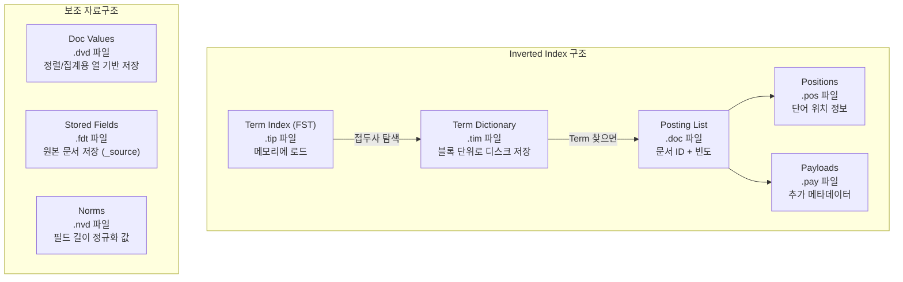
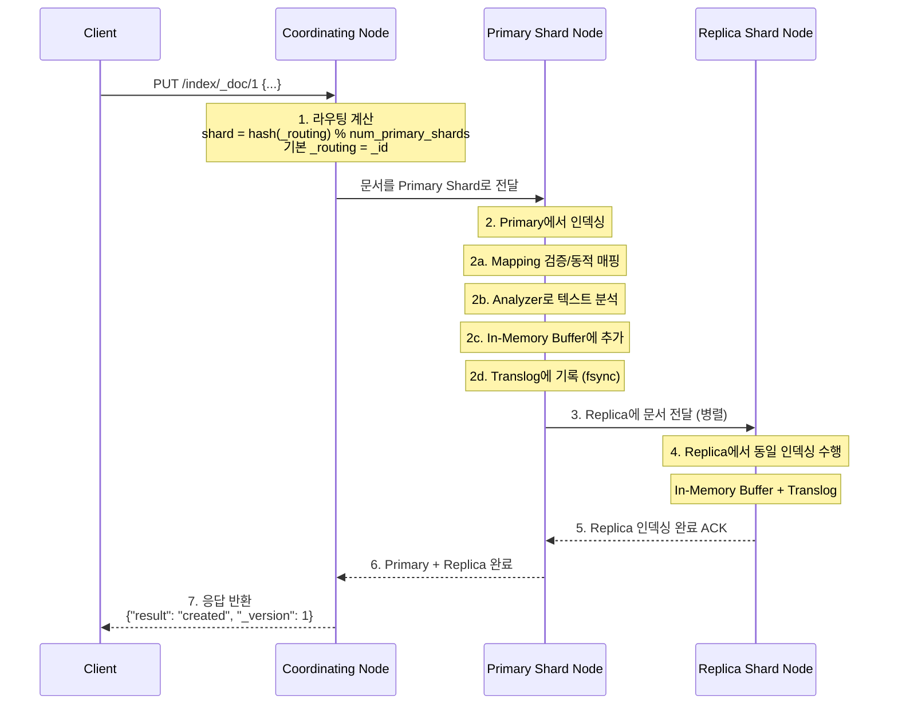
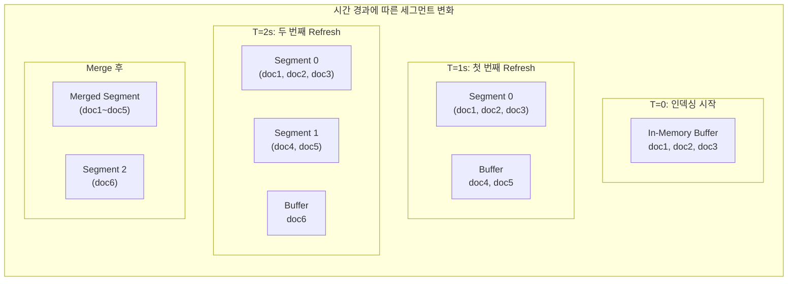

# 인덱싱과 역인덱스 구조

Elasticsearch의 핵심 자료구조인 Inverted Index의 원리, 문서 인덱싱 흐름, Segment의 생성과 Merge 전략, 그리고 Translog 기반 데이터 안정성 보장 메커니즘을 분석한다.

## 목차
- [1. 핵심 개념 (What)](#1-핵심-개념-what)
- [2. 왜 알아야 하는가 (Why)](#2-왜-알아야-하는가-why)
- [3. 내부 구현 분석 (How)](#3-내부-구현-분석-how)
- [4. 실전 예제](#4-실전-예제)
- [5. 정리](#5-정리)

---

## 1. 핵심 개념 (What)

### Inverted Index란?

관계형 데이터베이스가 행(row) 기반으로 데이터를 저장하는 것과 달리, Elasticsearch는 **Inverted Index**(역색인)를 사용한다. 이는 "어떤 단어가 어떤 문서에 있는가?"를 빠르게 찾기 위한 자료구조다.

**Forward Index** (일반 인덱스):
```
문서 1 → "Elasticsearch는 분산 검색 엔진이다"
문서 2 → "Elasticsearch 클러스터는 노드로 구성된다"
문서 3 → "Logstash는 데이터 수집 파이프라인이다"
```

**Inverted Index** (역인덱스):
```
"Elasticsearch" → [문서 1, 문서 2]
"분산"          → [문서 1]
"검색"          → [문서 1]
"엔진"          → [문서 1]
"클러스터"       → [문서 2]
"노드"          → [문서 2]
"Logstash"      → [문서 3]
"데이터"         → [문서 3]
"수집"          → [문서 3]
"파이프라인"     → [문서 3]
```

### 인덱싱 관련 핵심 개념

| 개념 | 설명 |
|------|------|
| **Index** | 논리적인 문서 모음. RDBMS의 테이블에 해당 |
| **Document** | JSON 형태의 데이터 단위. RDBMS의 행(row)에 해당 |
| **Field** | 문서 내 키-값 쌍. RDBMS의 열(column)에 해당 |
| **Mapping** | 필드의 타입과 분석 방식 정의. RDBMS의 스키마에 해당 |
| **Analyzer** | 텍스트를 토큰으로 분리하는 처리기 (Character Filter → Tokenizer → Token Filter) |
| **Segment** | Lucene의 불변(immutable) 데이터 단위 |
| **Translog** | Write-Ahead Log. 커밋 전 데이터 안정성 보장 |

---

## 2. 왜 알아야 하는가 (Why)

### 성능 최적화의 핵심

1. **매핑 설계**: 잘못된 필드 타입은 불필요한 인덱싱 오버헤드 또는 검색 불가로 이어진다
2. **Refresh 튜닝**: 대량 인덱싱 시 refresh_interval 조정으로 10배 이상 성능 향상 가능
3. **Segment Merge 이해**: 과도한 세그먼트는 검색 지연, 과도한 Merge는 I/O 병목
4. **Translog 관리**: flush 정책에 따라 데이터 유실 범위와 복구 시간이 달라짐

### 흔한 실수

| 실수 | 결과 | 해결 |
|------|------|------|
| 모든 필드를 `text`로 매핑 | 불필요한 인덱싱, 메모리 낭비 | 집계/정렬용은 `keyword`, 검색용만 `text` |
| Dynamic Mapping 방치 | 매핑 폭발(Mapping Explosion) | `dynamic: strict` 또는 명시적 매핑 |
| Bulk 미사용 | 문서 건건이 HTTP 요청 → 극심한 오버헤드 | Bulk API 사용 (1000~5000건 단위) |
| refresh_interval 미조정 | 대량 인덱싱 시 불필요한 세그먼트 생성 | 벌크 로딩 시 `-1`로 비활성화 |

---

## 3. 내부 구현 분석 (How)

### Inverted Index 내부 구조

Lucene의 Inverted Index는 단순한 해시맵이 아니라 여러 최적화된 자료구조의 조합이다.



#### Term Index (FST - Finite State Transducer)

Term Index는 메모리에 올라가는 자료구조로, Term Dictionary의 접두사를 효율적으로 탐색한다.

```
FST 구조 (Finite State Transducer):
  - Trie와 유사하지만 접미사 공유로 메모리 절감
  - "elasticsearch", "elastic", "element" 의 경우:

       e
       ├── l
       │   ├── a
       │   │   └── stic → [Block 7 in .tim]
       │   │       └── search → [Block 12 in .tim]
       │   └── e
       │       └── ment → [Block 3 in .tim]
```

#### Posting List 인코딩

```
Term "elasticsearch"의 Posting List:
  Document IDs:  [3, 7, 15, 42, 100, 128, ...]
  
  저장 방식: Delta Encoding + Bit Packing
  원본:  [3,  7,  15, 42, 100, 128]
  Delta: [3,  4,   8, 27,  58,  28]  ← 이전 값과의 차이만 저장
  
  추가로 Skip List를 사용해 대량의 Posting List에서 빠른 탐색:
  Level 2: [3] ─────────────────────────── [100]
  Level 1: [3] ────────── [15] ────────── [100] ──── [128]
  Level 0: [3] → [7] → [15] → [42] → [100] → [128] → ...
```

#### Doc Values (열 기반 저장)

```
Inverted Index (행 기반 - 검색에 최적):
  Term → [Doc IDs]
  "error" → [1, 5, 9]
  "warn"  → [2, 3, 7]

Doc Values (열 기반 - 정렬/집계에 최적):
  Doc ID → Field Value
  1 → "error"
  2 → "warn"
  3 → "warn"
  5 → "error"
  7 → "warn"
  9 → "error"
```

### 문서 인덱싱 흐름



### Analyzer 동작 과정

텍스트 필드가 인덱싱될 때 Analyzer가 토큰을 생성하는 과정:

```
입력 텍스트: "The Quick Brown Fox's HTTP/2 request failed!"

[1] Character Filter (html_strip, pattern_replace 등)
    → "The Quick Brown Fox's HTTP/2 request failed!"
    (이 예제에서는 변환 없음)

[2] Tokenizer (standard)
    → ["The", "Quick", "Brown", "Fox's", "HTTP", "2", "request", "failed"]

[3] Token Filters (순서대로 적용)
    (a) lowercase
        → ["the", "quick", "brown", "fox's", "http", "2", "request", "failed"]
    (b) stop (불용어 제거)
        → ["quick", "brown", "fox's", "http", "2", "request", "failed"]
    (c) apostrophe
        → ["quick", "brown", "fox", "http", "2", "request", "failed"]

최종 토큰: ["quick", "brown", "fox", "http", "2", "request", "failed"]
→ 이 토큰들이 Inverted Index에 등록됨
```

### Segment 생성과 Merge



#### Merge 전략 (TieredMergePolicy)

Elasticsearch 8.x의 기본 Merge 전략은 `TieredMergePolicy`다.

```
TieredMergePolicy 파라미터:
  - segments_per_tier: 10       (Tier당 최대 세그먼트 수)
  - max_merge_at_once: 10       (한 번에 합칠 최대 세그먼트 수)
  - max_merged_segment: 5gb     (Merge 결과 최대 크기)
  - floor_segment: 2mb          (이보다 작은 세그먼트는 무조건 Merge 대상)
  - deletes_pct_allowed: 20%    (삭제 문서 비율이 이를 넘으면 Merge)

Merge 시 일어나는 일:
  1. 여러 작은 세그먼트의 Inverted Index를 하나로 합침
  2. 삭제 표시(.del)된 문서를 실제로 제거
  3. 새 세그먼트 파일 생성
  4. Commit Point 업데이트
  5. 이전 세그먼트 파일 삭제
```

### Translog (Write-Ahead Log)


#### Refresh vs Flush 비교

| 항목 | Refresh | Flush |
|------|---------|-------|
| **주기** | 기본 1초 (`index.refresh_interval`) | 기본 30분 또는 Translog 512MB |
| **동작** | Buffer → 새 Segment (메모리) | Segment → 디스크 fsync |
| **Translog** | 유지됨 | 비워짐 |
| **검색 가능** | Refresh 후 검색 가능 | Flush와 무관 |
| **fsync** | 안 함 (OS 페이지 캐시) | 수행 (디스크 영구 기록) |
| **데이터 안정성** | Translog에 의존 | 독립적으로 보장 |

#### 장애 복구 시나리오

```
[정상 운영 중 노드 크래시 발생]

1. 마지막 Flush 이후의 Commit Point에서 세그먼트 복원
   └─ 이 세그먼트들은 디스크에 fsync 완료된 상태

2. Translog Replay
   └─ 마지막 Flush 이후 ~ 크래시 시점까지의 연산을 재실행
   └─ Translog는 매 연산마다 fsync되므로 유실 최소화

3. 복구 완료 후 정상 운영 재개

Translog 설정:
  - index.translog.durability: "request"  (기본값 - 매 요청 fsync)
  - index.translog.durability: "async"    (비동기 - 성능 우선, 유실 가능)
  - index.translog.sync_interval: "5s"    (async 모드에서 sync 주기)
  - index.translog.flush_threshold_size: "512mb"
```

---

## 4. 실전 예제

### 예제 1: 매핑 설계

```json
// 인덱스 매핑 정의
PUT /app-logs
{
  "settings": {
    "number_of_shards": 3,
    "number_of_replicas": 1,
    "index.refresh_interval": "5s",
    "analysis": {
      "analyzer": {
        "korean_analyzer": {
          "type": "custom",
          "tokenizer": "nori_tokenizer",
          "filter": ["nori_readingform", "lowercase", "nori_part_of_speech"]
        },
        "path_analyzer": {
          "type": "custom",
          "tokenizer": "path_hierarchy"
        }
      }
    }
  },
  "mappings": {
    "dynamic": "strict",
    "properties": {
      "@timestamp": { "type": "date" },
      "level": { "type": "keyword" },
      "service": { "type": "keyword" },
      "trace_id": { "type": "keyword" },
      "message": {
        "type": "text",
        "analyzer": "standard",
        "fields": {
          "keyword": {
            "type": "keyword",
            "ignore_above": 256
          }
        }
      },
      "request": {
        "properties": {
          "method": { "type": "keyword" },
          "path": {
            "type": "text",
            "analyzer": "path_analyzer",
            "fields": {
              "keyword": { "type": "keyword" }
            }
          },
          "status": { "type": "short" },
          "duration_ms": { "type": "integer" },
          "body_bytes": { "type": "long" }
        }
      },
      "client": {
        "properties": {
          "ip": { "type": "ip" },
          "geo": { "type": "geo_point" },
          "user_agent": { "type": "text" }
        }
      },
      "tags": { "type": "keyword" },
      "metadata": {
        "type": "object",
        "enabled": false
      }
    }
  }
}
```

### 예제 2: Bulk Indexing 최적화

```json
// Bulk API 사용
POST _bulk
{"index": {"_index": "app-logs", "_id": "1"}}
{"@timestamp": "2024-03-15T10:30:00Z", "level": "ERROR", "service": "auth-api", "message": "Authentication failed for user admin", "request": {"method": "POST", "path": "/api/v1/auth/login", "status": 401, "duration_ms": 23}}
{"index": {"_index": "app-logs", "_id": "2"}}
{"@timestamp": "2024-03-15T10:30:01Z", "level": "INFO", "service": "order-api", "message": "Order created successfully", "request": {"method": "POST", "path": "/api/v1/orders", "status": 201, "duration_ms": 145}}
{"index": {"_index": "app-logs", "_id": "3"}}
{"@timestamp": "2024-03-15T10:30:02Z", "level": "WARN", "service": "payment-api", "message": "Payment gateway timeout", "request": {"method": "POST", "path": "/api/v1/payments", "status": 504, "duration_ms": 30000}}
```

```python
# Python elasticsearch-py를 사용한 대량 인덱싱
from elasticsearch import Elasticsearch
from elasticsearch.helpers import bulk, parallel_bulk
import json

es = Elasticsearch(
    ["https://es-node1:9200"],
    basic_auth=("elastic", "password"),
    ca_certs="/path/to/ca.crt"
)

def generate_actions(file_path):
    """로그 파일을 읽어 Bulk Action 생성"""
    with open(file_path, 'r') as f:
        for line in f:
            doc = json.loads(line)
            yield {
                "_index": f"app-logs-{doc['@timestamp'][:10]}",
                "_source": doc
            }

# 벌크 인덱싱 전 최적화 설정
es.indices.put_settings(
    index="app-logs-*",
    body={
        "index.refresh_interval": "-1",          # Refresh 비활성화
        "index.number_of_replicas": 0,            # 레플리카 비활성화
        "index.translog.durability": "async",     # 비동기 Translog
        "index.translog.sync_interval": "30s"
    }
)

# 병렬 벌크 인덱싱
success_count = 0
error_count = 0

for ok, result in parallel_bulk(
    es,
    generate_actions("/data/logs/app.jsonl"),
    chunk_size=5000,
    thread_count=4,
    raise_on_error=False
):
    if ok:
        success_count += 1
    else:
        error_count += 1
        print(f"Error: {result}")

print(f"Indexed: {success_count}, Errors: {error_count}")

# 벌크 인덱싱 후 설정 복원
es.indices.put_settings(
    index="app-logs-*",
    body={
        "index.refresh_interval": "1s",
        "index.number_of_replicas": 1,
        "index.translog.durability": "request"
    }
)

# 명시적 Refresh로 즉시 검색 가능하게
es.indices.refresh(index="app-logs-*")

# Force Merge (읽기 전용 인덱스에 권장)
es.indices.forcemerge(index="app-logs-2024.03.14", max_num_segments=1)
```

### 예제 3: Analyzer 테스트

```json
// 기본 Standard Analyzer 테스트
POST _analyze
{
  "analyzer": "standard",
  "text": "The Quick-Brown Fox's jumped over 2 lazy dogs!"
}
// 결과: ["the", "quick", "brown", "fox's", "jumped", "over", "2", "lazy", "dogs"]

// 한국어 Nori Analyzer 테스트
POST _analyze
{
  "analyzer": "nori",
  "text": "Elasticsearch는 분산 검색 엔진입니다"
}
// 결과: ["elasticsearch", "분산", "검색", "엔진", "이"]

// 커스텀 Analyzer 테스트
POST /app-logs/_analyze
{
  "field": "request.path",
  "text": "/api/v1/users/123/orders"
}
// path_hierarchy 결과: ["/api", "/api/v1", "/api/v1/users", "/api/v1/users/123", "/api/v1/users/123/orders"]

// _analyze API로 인덱싱 시 실제 생성되는 토큰 확인
POST /app-logs/_analyze
{
  "field": "message",
  "text": "Connection timeout to database server 10.0.1.5"
}
```

### 예제 4: Reindex API

```json
// 인덱스 간 데이터 복사 (매핑 변경 시)
POST _reindex
{
  "source": {
    "index": "app-logs-old",
    "query": {
      "range": {
        "@timestamp": {
          "gte": "2024-03-01",
          "lt": "2024-04-01"
        }
      }
    }
  },
  "dest": {
    "index": "app-logs-new",
    "pipeline": "app-log-pipeline"
  },
  "script": {
    "source": "ctx._source.migrated = true; ctx._source.migration_date = '2024-03-15'"
  }
}

// 비동기 Reindex (대량 데이터)
POST _reindex?wait_for_completion=false
{
  "source": {
    "index": "app-logs-2024.02.*",
    "size": 5000
  },
  "dest": {
    "index": "app-logs-archive-2024.02"
  }
}
// 응답: {"task": "node-1:12345"}

// Task 진행 상황 확인
GET _tasks/node-1:12345
```

---

## 5. 정리

| 항목 | 요약 |
|------|------|
| **Inverted Index** | Term → Posting List 매핑. FST(Term Index) → Term Dictionary → Posting List 3단계 |
| **Posting List 최적화** | Delta Encoding + Bit Packing + Skip List로 효율적 저장/탐색 |
| **Doc Values** | 열 기반 저장소. 정렬/집계에 사용. `keyword`, `numeric`, `date` 등에 자동 생성 |
| **인덱싱 흐름** | Client → Coordinating → Primary(Buffer+Translog) → Replica |
| **라우팅** | `shard = hash(_routing) % num_primary_shards`, 기본 `_routing = _id` |
| **Analyzer** | Character Filter → Tokenizer → Token Filter 파이프라인 |
| **Segment** | Lucene의 불변 자료구조. Refresh로 생성, Merge로 합침 |
| **Refresh** | Buffer → Segment(메모리). 기본 1초. 검색 가능해지는 시점 |
| **Flush** | Segment → 디스크 fsync + Translog 비움. 기본 30분/512MB |
| **Translog** | WAL. 매 요청 fsync(기본). 크래시 복구 시 Replay |
| **Merge** | TieredMergePolicy. 작은 세그먼트 합침 + 삭제 문서 정리 |
| **Bulk 최적화** | refresh -1, replica 0, async translog → 인덱싱 후 복원 |

---

*참고: Elasticsearch 8.x / Logstash 8.x / Kibana 8.x 기준*
