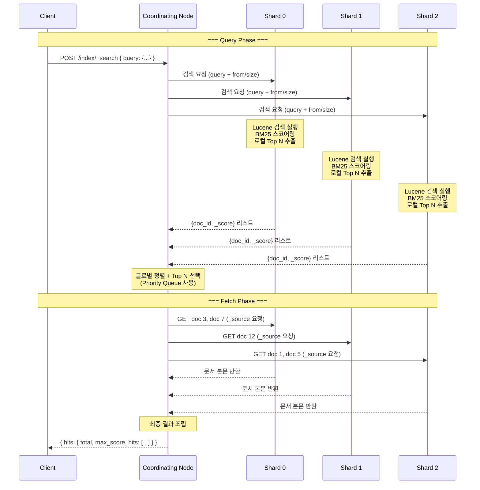
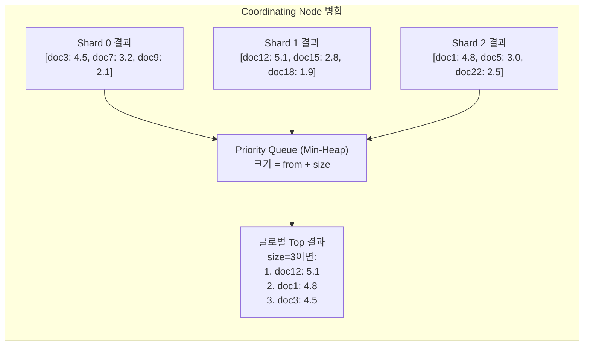
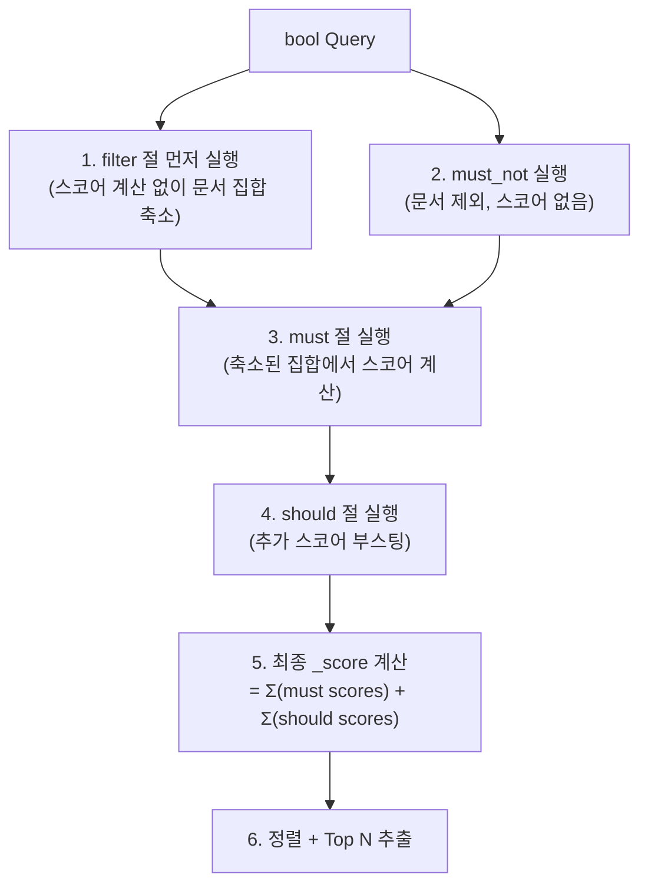
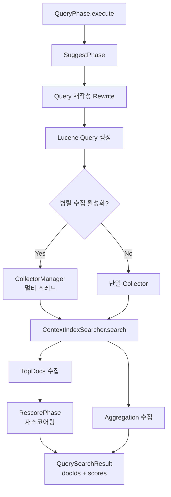
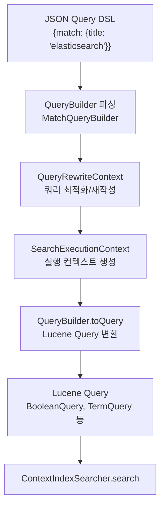

# 검색 엔진 동작 원리

Elasticsearch의 Query DSL 구조, Query/Filter Context 차이, BM25 스코어링 알고리즘, 그리고 분산 환경에서의 검색 실행 과정(Query Phase → Fetch Phase)을 분석한다.

## 목차
- [1. 핵심 개념 (What)](#1-핵심-개념-what)
- [2. 왜 알아야 하는가 (Why)](#2-왜-알아야-하는가-why)
- [3. 내부 구현 분석 (How)](#3-내부-구현-분석-how)
- [4. 실전 예제](#4-실전-예제)
- [5. 정리](#5-정리)

---

## 1. 핵심 개념 (What)

### Query DSL (Domain Specific Language)

Elasticsearch는 JSON 기반의 Query DSL을 통해 검색 요청을 표현한다. 크게 두 종류로 나뉜다.

| 분류 | 쿼리 종류 | 설명 |
|------|-----------|------|
| **Leaf Query** | `match`, `term`, `range`, `exists`, `wildcard`, `prefix`, `fuzzy` | 특정 필드에 대한 단일 조건 |
| **Compound Query** | `bool`, `dis_max`, `constant_score`, `boosting`, `function_score` | 여러 쿼리를 조합 |

### Query Context vs Filter Context

동일한 조건이라도 어떤 Context에서 실행되느냐에 따라 동작이 달라진다.

| 항목 | Query Context | Filter Context |
|------|--------------|----------------|
| **질문** | "이 문서가 얼마나 잘 일치하는가?" | "이 문서가 일치하는가? (Yes/No)" |
| **스코어 계산** | 수행 (`_score` 산출) | 안 함 (`_score` = 0 또는 무시) |
| **캐싱** | 안 됨 | 자주 사용되는 필터는 자동 캐싱 |
| **사용 위치** | `bool.must`, `bool.should` | `bool.filter`, `bool.must_not` |
| **적합한 용도** | 풀텍스트 검색, 관련도 순위 | 정확한 값 매칭, 범위 필터링 |

### BM25 스코어링

Elasticsearch 5.0부터 기본 유사도 알고리즘으로 **BM25** (Best Matching 25)를 사용한다. 이전의 TF-IDF를 개선한 확률적 검색 모델이다.

---

## 2. 왜 알아야 하는가 (Why)

### 검색 품질과 성능의 균형

1. **관련도 튜닝**: BM25 파라미터(`k1`, `b`)를 이해해야 검색 결과 품질을 조정할 수 있다
2. **Query vs Filter 선택**: 필터를 써야 할 곳에 쿼리를 쓰면 불필요한 스코어 계산으로 성능 저하
3. **검색 지연 분석**: Query Phase와 Fetch Phase 중 어디가 병목인지 파악해야 최적화 가능
4. **대규모 클러스터 설계**: Coordinating Node의 결과 병합 전략이 메모리 사용량에 직접 영향

### 흔한 성능 문제

| 문제 | 원인 | 해결 |
|------|------|------|
| 느린 검색 | 모든 조건을 Query Context에 넣음 | 정확한 값 매칭은 Filter Context로 이동 |
| 메모리 초과 | `size`가 너무 크거나 deep pagination | `search_after` 또는 PIT + `search_after` 사용 |
| 타임아웃 | 와일드카드 선행 (`*keyword`) | `keyword` 필드 + `term` 쿼리로 변경 |
| 불정확한 집계 | 샤드별 로컬 집계의 근사치 문제 | `shard_size` 조정 또는 `_search` 대신 전용 집계 |

---

## 3. 내부 구현 분석 (How)

### 검색 실행의 전체 흐름



### Query Phase 상세

각 샤드에서 수행되는 Query Phase의 내부 동작:

```
[Coordinating Node가 요청을 각 샤드로 전달]

각 Shard에서:
  1. Query 파싱 → Lucene Query 객체 변환
     - match "database error"
       → BooleanQuery(TermQuery("database"), TermQuery("error"))
  
  2. IndexSearcher가 모든 Segment를 순회
     ┌─────────────────────────────────────────────┐
     │ Segment 0: Term Index(FST)에서 term 탐색    │
     │   → Term Dictionary에서 Posting List 위치    │
     │   → Posting List에서 일치하는 doc ID 수집    │
     │   → BM25로 _score 계산                       │
     ├─────────────────────────────────────────────┤
     │ Segment 1: 동일 과정                         │
     ├─────────────────────────────────────────────┤
     │ Segment 2: 동일 과정                         │
     └─────────────────────────────────────────────┘
  
  3. Collector가 from + size 개의 Top 문서를 Priority Queue로 수집
     - 예: from=0, size=10 → 상위 10개 유지
  
  4. 결과 반환: [{doc_id, _score}, ...] (문서 본문 없이 ID와 점수만)
```

### Fetch Phase 상세

```
[Coordinating Node가 글로벌 Top N을 결정한 후]

1. 필요한 문서 ID를 보유한 샤드에만 Multi-GET 요청
   - doc 3, 7 → Shard 0
   - doc 12   → Shard 1
   - doc 1, 5 → Shard 2

2. 각 Shard에서:
   - Stored Fields (_source)에서 문서 본문 로드
   - Highlight 계산 (요청 시)
   - Script Fields 실행 (요청 시)
   - 문서 반환

3. Coordinating Node에서 최종 결과 조립
```

### BM25 스코어링 알고리즘

```
BM25 공식:

score(D, Q) = Σ  IDF(qi) × [ f(qi, D) × (k1 + 1) ]
              i               ────────────────────────
                              f(qi, D) + k1 × (1 - b + b × |D| / avgdl)

각 항의 의미:
  Q       = 검색 쿼리 (여러 term으로 분리)
  qi      = 쿼리의 i번째 term
  D       = 대상 문서
  f(qi,D) = term qi가 문서 D에 출현한 횟수 (Term Frequency)
  |D|     = 문서 D의 길이 (총 term 수)
  avgdl   = 전체 문서의 평균 길이

  IDF(qi) = ln(1 + (N - n(qi) + 0.5) / (n(qi) + 0.5))
    N     = 전체 문서 수
    n(qi) = term qi를 포함하는 문서 수

  k1      = Term Frequency 포화도 조절 (기본값: 1.2)
            - 높을수록 TF 영향 증가 (같은 단어 반복 시 점수 계속 증가)
            - 낮을수록 TF 영향 감소 (한 번만 나와도 충분)

  b       = 문서 길이 정규화 조절 (기본값: 0.75)
            - 1.0: 길이 정규화를 완전히 적용 (긴 문서 불리)
            - 0.0: 길이 정규화 안 함 (긴 문서 유리)
```

#### BM25 vs TF-IDF 비교

```
TF-IDF:  TF가 무한히 증가 → 점수도 무한 증가
         tf(t,d) = √freq

BM25:    TF가 증가해도 점수가 포화(saturation)됨
         tf_saturated = freq × (k1 + 1) / (freq + k1 × norm)

그래프로 보면:
  Score
    │         ___________  BM25 (포화)
    │       /
    │     /     ╱ TF-IDF (무한 증가)
    │   /    ╱
    │  /  ╱
    │ /╱
    │╱
    └─────────────────── Term Frequency
    0   1   2   3   4   5   ...
```

BM25가 더 나은 이유: 같은 단어가 100번 나오는 문서가 10번 나오는 문서보다 *약간만* 더 관련 있지, 10배 더 관련 있는 것은 아니다. 포화 특성이 이를 자연스럽게 반영한다.

### Coordinating Node의 결과 병합 전략



병합 시 주의할 점:

```
[from/size와 샤드 수의 관계]

요청: from=90, size=10 (91~100번째 결과 요구)

각 샤드에서 반환해야 하는 문서 수: from + size = 100개

3개 샤드 × 100개 = Coordinating Node에서 300개를 정렬해야 함

→ Deep Pagination 문제:
  from=10000, size=10이면 각 샤드에서 10,010개 반환
  → 메모리 폭발

해결책:
  1. search_after: 이전 페이지의 마지막 정렬 값 기준으로 다음 페이지 요청
  2. PIT (Point in Time) + search_after: 일관된 스냅샷 기반 페이징
  3. Scroll API: 대량 데이터 내보내기 (7.x부터 PIT 권장)
  4. max_result_window 설정 (기본 10,000) → 하드 리밋
```

### bool Query 내부 실행 순서



핵심: `filter`와 `must_not`이 먼저 실행되어 후보 문서를 줄이고, 비용이 큰 스코어링은 축소된 집합에서만 수행한다. 이것이 filter 사용이 성능에 중요한 이유다.

---

## 4. 실전 예제

### 예제 1: 실무 검색 쿼리 패턴

```json
// 1) 기본 풀텍스트 검색
GET /app-logs/_search
{
  "query": {
    "match": {
      "message": {
        "query": "connection timeout database",
        "operator": "and",
        "minimum_should_match": "75%"
      }
    }
  }
}

// 2) 복합 조건 검색 — bool Query
GET /app-logs/_search
{
  "query": {
    "bool": {
      "must": [
        {
          "match": {
            "message": "timeout"
          }
        }
      ],
      "filter": [
        { "term": { "level": "ERROR" } },
        { "terms": { "service": ["auth-api", "payment-api"] } },
        { "range": { "@timestamp": { "gte": "now-1h" } } },
        { "range": { "request.duration_ms": { "gte": 5000 } } }
      ],
      "must_not": [
        { "term": { "tags": "expected" } }
      ],
      "should": [
        { "term": { "level": "CRITICAL" } }
      ]
    }
  },
  "sort": [
    { "@timestamp": "desc" },
    "_score"
  ],
  "size": 20
}

// 3) Multi-match (여러 필드에서 검색)
GET /products/_search
{
  "query": {
    "multi_match": {
      "query": "wireless bluetooth headphones",
      "fields": ["title^3", "description", "tags^2"],
      "type": "best_fields",
      "tie_breaker": 0.3
    }
  }
}

// 4) Exact Value 검색 — term Query (keyword 필드)
GET /app-logs/_search
{
  "query": {
    "bool": {
      "filter": [
        { "term": { "trace_id": "abc-123-def-456" } },
        { "term": { "service": "order-api" } }
      ]
    }
  },
  "sort": [{ "@timestamp": "asc" }]
}
```

### 예제 2: BM25 파라미터 튜닝

```json
// 인덱스 레벨에서 BM25 커스터마이징
PUT /products
{
  "settings": {
    "index": {
      "similarity": {
        "custom_bm25": {
          "type": "BM25",
          "k1": 1.5,
          "b": 0.5
        }
      }
    }
  },
  "mappings": {
    "properties": {
      "title": {
        "type": "text",
        "similarity": "custom_bm25"
      },
      "description": {
        "type": "text"
      }
    }
  }
}

// k1, b 파라미터 조정 가이드:
//
// k1 (기본 1.2) - Term Frequency 포화 속도
//   k1 = 0.0 : TF 무시 (단어 출현 유무만 고려)
//   k1 = 1.2 : 기본값 (균형)
//   k1 = 2.0 : TF 영향 증가 (단어 반복에 더 높은 점수)
//   → 짧은 제목 필드: k1을 낮게 (0.5~1.0)
//   → 긴 본문 필드: k1을 높게 (1.2~2.0)
//
// b (기본 0.75) - 문서 길이 정규화 강도
//   b = 0.0 : 문서 길이 무시
//   b = 0.75: 기본값 (긴 문서 약간 불리)
//   b = 1.0 : 길이 정규화 최대 (긴 문서 많이 불리)
//   → 길이 편차가 큰 필드: b를 높게
//   → 길이가 비슷한 필드: b를 낮게

// _explain API로 스코어 분해 확인
GET /products/_explain/1
{
  "query": {
    "match": {
      "title": "wireless headphones"
    }
  }
}
// 응답 예시:
// {
//   "explanation": {
//     "value": 4.23,
//     "description": "sum of:",
//     "details": [
//       {
//         "value": 2.41,
//         "description": "weight(title:wireless in 0)",
//         "details": [
//           { "value": 1.89, "description": "idf, computed as ..." },
//           { "value": 1.27, "description": "tf, computed as ..." }
//         ]
//       },
//       {
//         "value": 1.82,
//         "description": "weight(title:headphones in 0)",
//         "details": [...]
//       }
//     ]
//   }
// }
```

### 예제 3: Deep Pagination 해결 — search_after + PIT

```json
// 1단계: Point in Time(PIT) 열기
POST /app-logs/_pit?keep_alive=5m
// 응답: { "id": "46ToAwMDaWR..." }

// 2단계: 첫 페이지 요청
GET /_search
{
  "size": 20,
  "query": {
    "bool": {
      "filter": [
        { "term": { "service": "auth-api" } },
        { "range": { "@timestamp": { "gte": "now-24h" } } }
      ]
    }
  },
  "pit": {
    "id": "46ToAwMDaWR...",
    "keep_alive": "5m"
  },
  "sort": [
    { "@timestamp": "desc" },
    { "_shard_doc": "asc" }
  ]
}

// 3단계: 다음 페이지 — 이전 결과의 마지막 sort 값 사용
GET /_search
{
  "size": 20,
  "query": {
    "bool": {
      "filter": [
        { "term": { "service": "auth-api" } },
        { "range": { "@timestamp": { "gte": "now-24h" } } }
      ]
    }
  },
  "pit": {
    "id": "46ToAwMDaWR...",
    "keep_alive": "5m"
  },
  "sort": [
    { "@timestamp": "desc" },
    { "_shard_doc": "asc" }
  ],
  "search_after": [1710518400000, 4102]
}

// 4단계: PIT 닫기 (사용 완료 후 반드시)
DELETE /_pit
{
  "id": "46ToAwMDaWR..."
}
```

### 예제 4: 검색 성능 프로파일링

```json
// Profile API로 검색 실행 과정 분석
GET /app-logs/_search
{
  "profile": true,
  "query": {
    "bool": {
      "must": [
        { "match": { "message": "connection refused" } }
      ],
      "filter": [
        { "term": { "level": "ERROR" } },
        { "range": { "@timestamp": { "gte": "now-1h" } } }
      ]
    }
  }
}

// Profile 응답 구조 (간략화):
// {
//   "profile": {
//     "shards": [
//       {
//         "id": "[node-1][app-logs][0]",
//         "searches": [
//           {
//             "query": [
//               {
//                 "type": "BooleanQuery",
//                 "time_in_nanos": 1250000,
//                 "children": [
//                   {
//                     "type": "TermQuery",           ← "ERROR"
//                     "time_in_nanos": 120000,       ← 빠름 (filter)
//                     "description": "level:ERROR"
//                   },
//                   {
//                     "type": "BooleanQuery",        ← match query
//                     "time_in_nanos": 980000,       ← 상대적으로 느림
//                     "description": "message:connection message:refused"
//                   }
//                 ]
//               }
//             ],
//             "collector": [
//               {
//                 "name": "SimpleTopScoreDocCollector",
//                 "time_in_nanos": 350000
//               }
//             ]
//           }
//         ]
//       }
//     ]
//   }
// }
```

```python
# Python으로 검색 성능 모니터링
from elasticsearch import Elasticsearch
import time

es = Elasticsearch(
    ["https://es-node1:9200"],
    basic_auth=("elastic", "password"),
    ca_certs="/path/to/ca.crt"
)

def search_with_metrics(index, query, size=10):
    """검색 실행 + 성능 메트릭 수집"""
    start = time.perf_counter()
    
    response = es.search(
        index=index,
        body={
            "query": query,
            "size": size,
            "track_total_hits": True    # 정확한 전체 히트 수
        },
        request_timeout=30
    )
    
    elapsed_ms = (time.perf_counter() - start) * 1000
    
    total_hits = response["hits"]["total"]["value"]
    took_ms = response["took"]           # ES 내부 소요 시간
    max_score = response["hits"]["max_score"]
    shards = response["_shards"]
    
    print(f"총 히트: {total_hits}")
    print(f"ES 내부 소요: {took_ms}ms")
    print(f"전체 왕복(RTT): {elapsed_ms:.1f}ms")
    print(f"네트워크 오버헤드: {elapsed_ms - took_ms:.1f}ms")
    print(f"샤드: 성공 {shards['successful']}/{shards['total']}, "
          f"실패 {shards.get('failed', 0)}")
    print(f"최고 점수: {max_score}")
    
    return response


# 사용 예
query = {
    "bool": {
        "must": [{"match": {"message": "payment failed"}}],
        "filter": [
            {"term": {"service": "payment-api"}},
            {"range": {"@timestamp": {"gte": "now-6h"}}}
        ]
    }
}

result = search_with_metrics("app-logs-*", query)

for hit in result["hits"]["hits"]:
    print(f"  [{hit['_score']:.2f}] {hit['_source']['@timestamp']} "
          f"- {hit['_source']['message'][:80]}")
```

### 예제 5: function_score로 커스텀 스코어링

```json
// 최신 문서 + 인기도를 반영한 검색 스코어링
GET /articles/_search
{
  "query": {
    "function_score": {
      "query": {
        "multi_match": {
          "query": "elasticsearch performance tuning",
          "fields": ["title^3", "content"]
        }
      },
      "functions": [
        {
          "gauss": {
            "@timestamp": {
              "origin": "now",
              "scale": "7d",
              "decay": 0.5
            }
          },
          "weight": 2
        },
        {
          "field_value_factor": {
            "field": "view_count",
            "factor": 1.2,
            "modifier": "log1p",
            "missing": 1
          },
          "weight": 1
        },
        {
          "filter": { "term": { "is_featured": true } },
          "weight": 3
        }
      ],
      "score_mode": "sum",
      "boost_mode": "multiply",
      "max_boost": 10
    }
  }
}

// score_mode: 여러 function의 점수를 합산하는 방식
//   - multiply(기본), sum, avg, first, max, min
//
// boost_mode: function 결과와 원래 query 점수를 결합하는 방식
//   - multiply(기본), replace, sum, avg, max, min
```

### 보충: SearchService — 검색의 진입점

`SearchService`(`org.elasticsearch.search.SearchService`)는 검색 요청의 전체 생명주기를 관리하는 핵심 서비스다:

```java
// org.elasticsearch.search.SearchService
public class SearchService extends AbstractLifecycleComponent
    implements IndexEventListener {

    // 검색 컨텍스트 유지 시간 (기본 5분)
    public static final Setting<TimeValue> DEFAULT_KEEPALIVE_SETTING =
        Setting.positiveTimeSetting("search.default_keep_alive",
            timeValueMinutes(5), Property.NodeScope, Property.Dynamic);

    // 비용이 높은 쿼리 허용 여부
    public static final Setting<Boolean> ALLOW_EXPENSIVE_QUERIES =
        Setting.boolSetting("search.allow_expensive_queries", true,
            Property.NodeScope, Property.Dynamic);

    // 병렬 쿼리 실행 설정
    public static final Setting<Boolean> QUERY_PHASE_PARALLEL_COLLECTION_ENABLED =
        Setting.boolSetting("search.query_phase_parallel_collection_enabled",
            true, Property.NodeScope, Property.Dynamic);
}
```

### 보충: DFS Phase — 글로벌 통계 수집

`DfsPhase`(`org.elasticsearch.search.dfs.DfsPhase`)는 각 샤드에서 term 통계와 collection 통계를 수집한다:

> *"DFS phase of a search request, used to make scoring 100% accurate by collecting additional info from each shard before the query phase."*

검색 유형:
- **QUERY_THEN_FETCH** (기본값): Query Phase → Fetch Phase. 각 샤드의 로컬 통계를 사용하여 스코어링
- **DFS_QUERY_THEN_FETCH**: DFS Phase → Query Phase → Fetch Phase. 글로벌 통계를 사용하여 더 정확한 스코어링

DFS가 필요한 경우:
- 샤드 수가 많고 문서가 적어 로컬 IDF 편차가 클 때
- 정확한 스코어 랭킹이 중요한 경우 (e.g., 검색 엔진 서비스)

### 보충: QueryPhase와 FetchPhase 소스코드 구조

`QueryPhase`(`org.elasticsearch.search.query.QueryPhase`)의 세부 단계:



`FetchPhase`(`org.elasticsearch.search.fetch.FetchPhase`)의 FetchSubPhase 체인:

```
FetchSourcePhase → FetchFieldsPhase → FetchScorePhase →
HighlightPhase → FetchDocValuesPhase → ScriptFieldsPhase →
ExplainPhase → FetchVersionPhase → SeqNoPrimaryTermPhase →
MatchedQueriesPhase → InnerHitsPhase
```

### 보충: Query DSL 처리 흐름



---

## 5. 정리

| 항목 | 요약 |
|------|------|
| **Query DSL** | JSON 기반. Leaf Query(match, term, range)와 Compound Query(bool, dis_max, function_score)로 구분 |
| **SearchService** | 검색 생명주기 관리. `DEFAULT_KEEPALIVE_SETTING`, `ALLOW_EXPENSIVE_QUERIES` 등 설정 |
| **DFS Phase** | 글로벌 term 통계 수집. 정확한 스코어링이 필요할 때 `DFS_QUERY_THEN_FETCH` 사용 |
| **Query Context** | `bool.must`, `bool.should`에서 실행. `_score`를 계산하여 관련도 순위 결정 |
| **Filter Context** | `bool.filter`, `bool.must_not`에서 실행. 스코어 없이 Yes/No 판정. 자동 캐싱으로 성능 우수 |
| **BM25** | TF-IDF 개선 모델. Term Frequency 포화(`k1`)와 문서 길이 정규화(`b`) 파라미터 |
| **Query Phase** | 모든 관련 샤드에서 로컬 Top N(doc_id + _score)을 추출. 문서 본문 없이 ID만 반환 |
| **Fetch Phase** | Coordinating Node가 글로벌 Top N을 결정한 후, 해당 문서의 _source를 보유 샤드에서 조회. FetchSubPhase 체인으로 처리 |
| **결과 병합** | Priority Queue(Min-Heap)로 from+size개의 글로벌 Top 결과를 정렬 |
| **Deep Pagination** | from/size는 10,000 제한(기본). PIT + search_after로 효율적 페이징 |
| **bool 실행 순서** | filter → must_not → must → should 순으로 문서 집합을 축소 후 스코어링 |
| **Query DSL 파싱** | JSON → QueryBuilder → QueryRewriteContext → Lucene Query 변환 |
| **성능 최적화** | 정확한 값은 filter, Profile API로 병목 분석, search_after로 페이징 |

---

*참고: Elasticsearch 8.x / Logstash 8.x / Kibana 8.x 기준*
