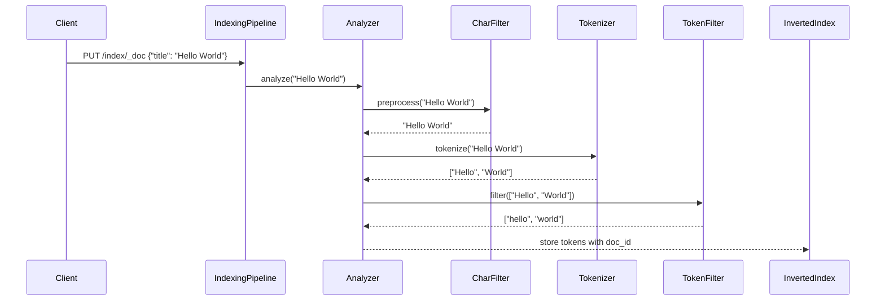
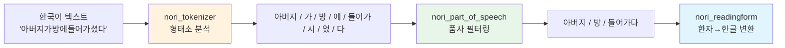
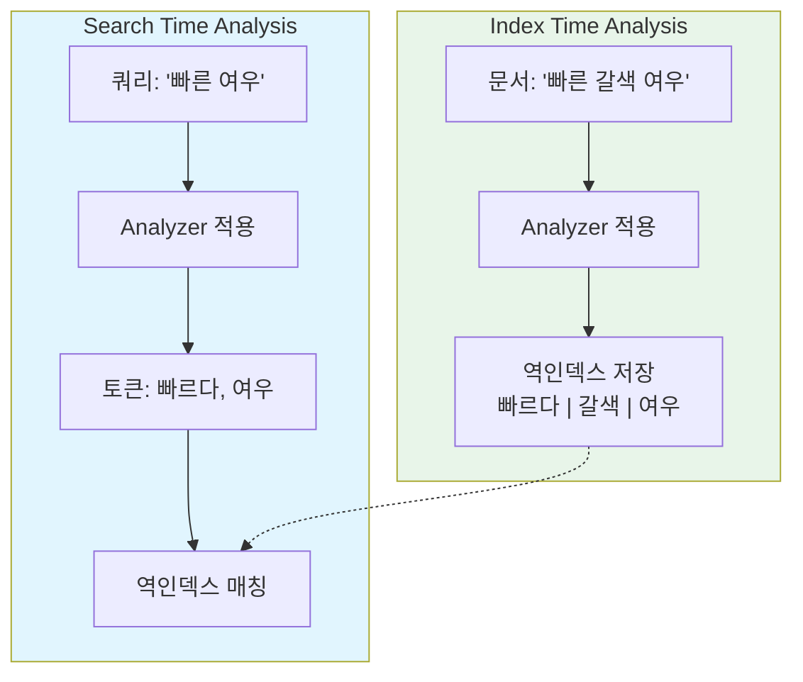

# 텍스트 분석과 Analyzer

Elasticsearch의 텍스트 분석(Text Analysis)은 비정형 텍스트를 검색 가능한 토큰으로 변환하는 핵심 메커니즘이다. Analyzer 파이프라인의 구조와 커스터마이징 방법, 한국어 형태소 분석까지 다룬다.

## 목차
- [1. 핵심 개념 (What)](#1-핵심-개념-what)
- [2. 왜 알아야 하는가 (Why)](#2-왜-알아야-하는가-why)
- [3. 내부 구현 분석 (How)](#3-내부-구현-분석-how)
- [4. 실전 예제](#4-실전-예제)
- [5. 정리](#5-정리)

---

## 1. 핵심 개념 (What)

### Text Analysis이란

텍스트 분석은 문자열 데이터를 **역인덱스(Inverted Index)**에 저장하기 위해 토큰으로 분해하는 과정이다. `text` 타입 필드에 문서를 인덱싱하거나, `match` 쿼리로 검색할 때 자동으로 수행된다.

### Analyzer 파이프라인 3단계

Analyzer는 세 가지 구성 요소가 순서대로 실행되는 파이프라인이다.


| 단계 | 역할 | 예시 |
|------|------|------|
| **Char Filter** | 토크나이징 전 문자열 전처리 | HTML 태그 제거, 패턴 치환 |
| **Tokenizer** | 문자열을 토큰으로 분리 | 공백 기준, 문법 기준, N-gram |
| **Token Filter** | 토큰 후처리 (변환/제거/추가) | 소문자 변환, 불용어 제거, 동의어 확장 |

### 분석이 적용되는 시점

- **Index Time**: 문서 인덱싱 시 `text` 필드의 값을 분석하여 역인덱스에 저장
- **Search Time**: `match`, `match_phrase` 등의 쿼리에서 검색어를 분석하여 토큰화

## 2. 왜 알아야 하는가 (Why)

### 검색 품질의 핵심 결정 요소

Analyzer 설정은 검색의 재현율(Recall)과 정밀도(Precision)를 직접 좌우한다.

- **분석이 너무 느슨한 경우**: "running"을 검색하면 "run", "runs", "runner"까지 모두 매칭되어 노이즈 증가
- **분석이 너무 엄격한 경우**: "elasticsearch"를 검색해도 "Elasticsearch"가 매칭되지 않는 문제 발생

### 다국어 환경의 필수 요소

영어 중심의 기본 Analyzer는 한국어, 일본어, 중국어(CJK) 텍스트를 제대로 토큰화하지 못한다. 한국어에서는 "사과를 먹었다"를 "사과를", "먹었다"로 분리하는 것이 아니라 "사과", "먹다"로 형태소 분석해야 의미 있는 검색이 가능하다.

### 성능과 스토리지에 대한 영향

- 토큰 수가 많을수록 역인덱스 크기 증가 → 디스크 사용량 증가
- N-gram Analyzer 같은 경우 토큰 폭발로 인해 인덱스 크기가 수 배 증가 가능
- 불필요한 Token Filter 체인은 인덱싱 성능 저하 유발

## 3. 내부 구현 분석 (How)

### 3.1 내장 Analyzer 비교

Elasticsearch는 여러 내장 Analyzer를 제공한다. 동일한 텍스트 `"The Quick-Brown Fox's 2 lazy dogs!"`에 대한 결과를 비교한다.

#### Standard Analyzer (기본값)

Unicode Text Segmentation 알고리즘(UAX#29) 기반으로 단어를 분리하고 소문자 변환한다.

```
토큰: [the, quick, brown, fox's, 2, lazy, dogs]
```

- Tokenizer: `standard`
- Token Filter: `lowercase`, `stop` (기본 비활성)

#### Simple Analyzer

문자가 아닌 모든 곳에서 분리하고 소문자 변환한다. 숫자는 제거된다.

```
토큰: [the, quick, brown, fox, s, lazy, dogs]
```

#### Whitespace Analyzer

공백에서만 분리한다. 대소문자 유지.

```
토큰: [The, Quick-Brown, Fox's, 2, lazy, dogs!]
```

#### Keyword Analyzer

텍스트 전체를 하나의 토큰으로 취급한다. `keyword` 타입과 유사하지만 Token Filter 적용이 가능하다.

```
토큰: [The Quick-Brown Fox's 2 lazy dogs!]
```

### 3.2 Analyzer 내부 처리 흐름



### 3.3 주요 Char Filter

| Char Filter | 설명 | 용도 |
|-------------|------|------|
| `html_strip` | HTML 태그와 엔티티 제거 | 웹 크롤링 데이터 |
| `mapping` | 문자열 치환 매핑 | 이모지→텍스트, 약어 전개 |
| `pattern_replace` | 정규식 기반 치환 | 전화번호 정규화, 특수문자 처리 |

### 3.4 주요 Tokenizer

| Tokenizer | 동작 원리 | 적합한 상황 |
|-----------|-----------|-------------|
| `standard` | UAX#29 단어 경계 | 범용 (기본값) |
| `letter` | 비문자 문자에서 분리 | 단순 텍스트 |
| `whitespace` | 공백에서만 분리 | 사전 처리된 데이터 |
| `ngram` | 지정 길이의 N-gram 생성 | 자동완성, 부분 매칭 |
| `edge_ngram` | 토큰 시작부터 N-gram | 접두어 자동완성 |
| `pattern` | 정규식 기반 분리 | 커스텀 구분자 |
| `path_hierarchy` | 경로 계층 분리 (`/a/b` → `/a`, `/a/b`) | 파일 경로 검색 |

### 3.5 주요 Token Filter

| Token Filter | 기능 |
|-------------|------|
| `lowercase` | 소문자 변환 |
| `stop` | 불용어(the, is, a 등) 제거 |
| `stemmer` | 어간 추출 (running → run) |
| `synonym` | 동의어 확장 (quick → fast) |
| `asciifolding` | 유니코드 → ASCII 변환 (cafe → cafe) |
| `ngram` | 토큰을 N-gram으로 분해 |
| `unique` | 중복 토큰 제거 |
| `trim` | 공백 제거 |

### 3.6 한국어 형태소 분석: Nori Analyzer

Nori는 Elasticsearch에서 공식 지원하는 한국어 형태소 분석기 플러그인이다. MeCab-ko 사전 기반으로 동작한다.



#### Nori Tokenizer decompound_mode

| 모드 | 설명 | "삼성전자" 결과 |
|------|------|----------------|
| `none` | 복합어 분해 안 함 | `[삼성전자]` |
| `discard` | 복합어는 버리고 하위 토큰만 | `[삼성, 전자]` |
| `mixed` | 복합어와 하위 토큰 모두 | `[삼성전자, 삼성, 전자]` |

### 3.7 Index Time vs Search Time Analysis



- **Index Time Analyzer**: 매핑의 `analyzer` 파라미터로 설정. 인덱싱 시 한 번만 실행
- **Search Time Analyzer**: 매핑의 `search_analyzer` 파라미터로 설정. 검색할 때마다 실행
- 둘을 다르게 설정하는 대표적 사례: **동의어(synonym)는 search time에만 적용** (인덱스 재빌드 없이 동의어 갱신 가능)

## 4. 실전 예제

### 4.1 커스텀 Analyzer 생성

HTML 콘텐츠에서 검색하기 위한 커스텀 Analyzer:

```json
PUT /blog_index
{
  "settings": {
    "analysis": {
      "char_filter": {
        "html_cleaner": {
          "type": "html_strip",
          "escaped_tags": ["b", "em"]
        }
      },
      "tokenizer": {
        "my_tokenizer": {
          "type": "standard",
          "max_token_length": 256
        }
      },
      "filter": {
        "my_stop": {
          "type": "stop",
          "stopwords": ["_english_", "the", "a"]
        },
        "my_stemmer": {
          "type": "stemmer",
          "language": "english"
        }
      },
      "analyzer": {
        "blog_analyzer": {
          "type": "custom",
          "char_filter": ["html_cleaner"],
          "tokenizer": "my_tokenizer",
          "filter": ["lowercase", "my_stop", "my_stemmer"]
        }
      }
    }
  },
  "mappings": {
    "properties": {
      "content": {
        "type": "text",
        "analyzer": "blog_analyzer"
      }
    }
  }
}
```

### 4.2 _analyze API로 분석 결과 확인

운영 중 Analyzer 동작을 테스트할 때 사용한다:

```json
POST /blog_index/_analyze
{
  "analyzer": "blog_analyzer",
  "text": "<p>The <b>quick</b> brown foxes are running fast!</p>"
}
```

응답:
```json
{
  "tokens": [
    { "token": "quick",  "start_offset": 10, "end_offset": 15, "type": "<ALPHANUM>", "position": 0 },
    { "token": "brown",  "start_offset": 20, "end_offset": 25, "type": "<ALPHANUM>", "position": 1 },
    { "token": "fox",    "start_offset": 26, "end_offset": 31, "type": "<ALPHANUM>", "position": 2 },
    { "token": "run",    "start_offset": 36, "end_offset": 43, "type": "<ALPHANUM>", "position": 3 },
    { "token": "fast",   "start_offset": 44, "end_offset": 48, "type": "<ALPHANUM>", "position": 4 }
  ]
}
```

### 4.3 한국어 Nori Analyzer 설정

```json
PUT /korean_index
{
  "settings": {
    "analysis": {
      "tokenizer": {
        "nori_mixed": {
          "type": "nori_tokenizer",
          "decompound_mode": "mixed",
          "discard_punctuation": true,
          "user_dictionary_rules": [
            "삼성전자",
            "네이버웹툰"
          ]
        }
      },
      "filter": {
        "nori_pos_filter": {
          "type": "nori_part_of_speech",
          "stoptags": [
            "E", "IC", "J", "MAG", "MAJ",
            "MM", "SP", "SSC", "SSO", "SC",
            "SE", "XPN", "XSA", "XSN", "XSV",
            "UNA", "NA", "VSV"
          ]
        }
      },
      "analyzer": {
        "korean_analyzer": {
          "type": "custom",
          "tokenizer": "nori_mixed",
          "filter": [
            "nori_readingform",
            "nori_pos_filter",
            "lowercase"
          ]
        }
      }
    }
  },
  "mappings": {
    "properties": {
      "title": {
        "type": "text",
        "analyzer": "korean_analyzer",
        "search_analyzer": "korean_analyzer"
      },
      "content": {
        "type": "text",
        "analyzer": "korean_analyzer"
      }
    }
  }
}
```

### 4.4 동의어 필터 (Search Time 적용)

```json
PUT /product_index
{
  "settings": {
    "analysis": {
      "filter": {
        "synonym_filter": {
          "type": "synonym_graph",
          "synonyms": [
            "노트북, 랩탑, laptop",
            "핸드폰, 스마트폰, 휴대폰, mobile phone"
          ]
        }
      },
      "analyzer": {
        "index_analyzer": {
          "type": "custom",
          "tokenizer": "nori_tokenizer",
          "filter": ["nori_readingform", "lowercase"]
        },
        "search_synonym_analyzer": {
          "type": "custom",
          "tokenizer": "nori_tokenizer",
          "filter": ["nori_readingform", "lowercase", "synonym_filter"]
        }
      }
    }
  },
  "mappings": {
    "properties": {
      "product_name": {
        "type": "text",
        "analyzer": "index_analyzer",
        "search_analyzer": "search_synonym_analyzer"
      }
    }
  }
}
```

### 4.5 Edge N-gram을 활용한 자동완성

```json
PUT /autocomplete_index
{
  "settings": {
    "analysis": {
      "filter": {
        "autocomplete_filter": {
          "type": "edge_ngram",
          "min_gram": 1,
          "max_gram": 20
        }
      },
      "analyzer": {
        "autocomplete_index": {
          "type": "custom",
          "tokenizer": "standard",
          "filter": ["lowercase", "autocomplete_filter"]
        },
        "autocomplete_search": {
          "type": "custom",
          "tokenizer": "standard",
          "filter": ["lowercase"]
        }
      }
    }
  },
  "mappings": {
    "properties": {
      "suggest": {
        "type": "text",
        "analyzer": "autocomplete_index",
        "search_analyzer": "autocomplete_search"
      }
    }
  }
}
```

검색 시 "ela"를 입력하면 "elasticsearch"가 매칭된다. Index time에 `[e, el, ela, elas, ...]` 토큰이 생성되고, search time에는 `[ela]` 하나만 생성되어 매칭된다.

## 5. 정리

| 구분 | 핵심 내용 |
|------|-----------|
| **Analyzer 구조** | Char Filter → Tokenizer → Token Filter 3단계 파이프라인 |
| **Standard Analyzer** | 기본값. UAX#29 기반 단어 분리 + 소문자 변환 |
| **Nori Analyzer** | 한국어 형태소 분석. `decompound_mode`로 복합어 처리 제어 |
| **Index vs Search Time** | 동의어는 search time에 적용하면 재인덱싱 없이 갱신 가능 |
| **Edge N-gram** | 자동완성 구현의 핵심. Index time에 접두어 토큰 생성 |
| **_analyze API** | 운영 환경에서 Analyzer 동작을 실시간 테스트하는 디버깅 도구 |
| **커스텀 Analyzer** | `settings.analysis`에서 각 구성 요소를 조합하여 생성 |

---
*참고: Elasticsearch 8.x / Nori Plugin 8.x 기준*
