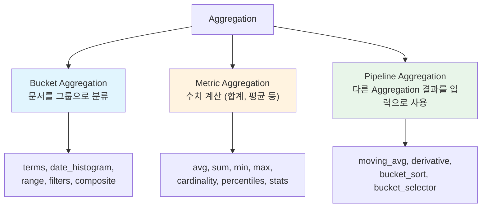
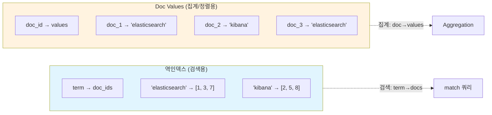
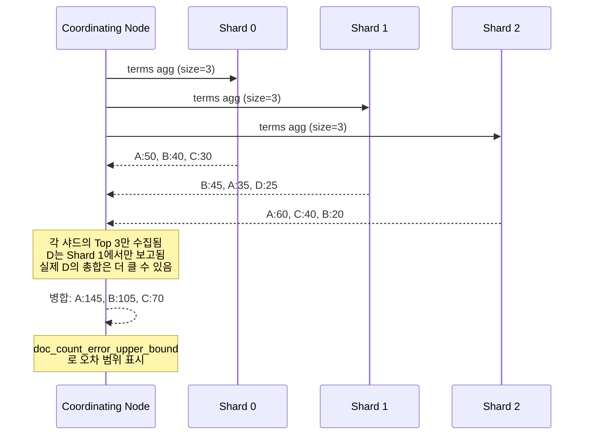
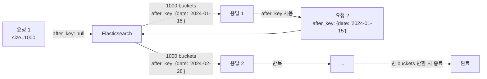
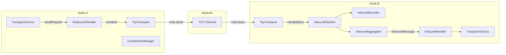
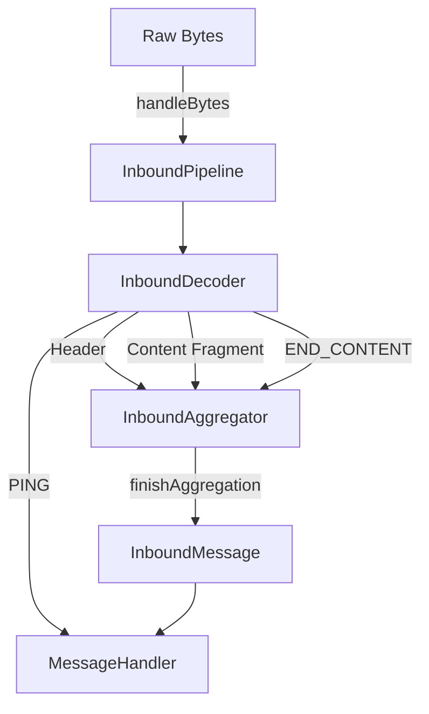

# Aggregation 프레임워크

Elasticsearch의 Aggregation은 검색 결과를 기반으로 통계, 그룹핑, 파이프라인 연산을 수행하는 분석 프레임워크다. Bucket, Metric, Pipeline 세 가지 유형의 구조와 내부 동작 원리, 대용량 처리 패턴을 다룬다.

## 목차
- [1. 핵심 개념 (What)](#1-핵심-개념-what)
- [2. 왜 알아야 하는가 (Why)](#2-왜-알아야-하는가-why)
- [3. 내부 구현 분석 (How)](#3-내부-구현-분석-how)
- [4. 실전 예제](#4-실전-예제)
- [5. 정리](#5-정리)

---

## 1. 핵심 개념 (What)

### Aggregation이란

Aggregation은 검색 쿼리에 의해 매칭된 문서 집합 위에서 데이터 요약 및 분석을 수행하는 기능이다. SQL의 `GROUP BY`와 집계 함수(`COUNT`, `SUM`, `AVG`)에 대응하지만, 중첩(nesting)과 파이프라인 연산 등 훨씬 유연한 조합이 가능하다.

### 세 가지 Aggregation 유형



| 유형 | 역할 | SQL 대응 |
|------|------|----------|
| **Bucket** | 문서를 기준에 따라 버킷(그룹)으로 분류 | `GROUP BY` |
| **Metric** | 버킷 내 문서들의 수치 계산 | `SUM()`, `AVG()`, `COUNT()` |
| **Pipeline** | 다른 Aggregation의 출력을 입력으로 받아 2차 연산 | 서브쿼리 / Window Function |

## 2. 왜 알아야 하는가 (Why)

### 실시간 분석 대시보드의 기반

Kibana의 모든 시각화(차트, 테이블, 맵)는 내부적으로 Elasticsearch Aggregation 쿼리로 변환된다. Aggregation을 이해하면 Kibana에서 표현할 수 없는 복잡한 분석도 API로 직접 구현할 수 있다.

### 성능 문제의 주요 원인

- Terms Aggregation의 `size` 파라미터를 잘못 설정하면 메모리 폭발
- 고카디널리티(High Cardinality) 필드에 대한 Aggregation은 힙 메모리를 빠르게 소진
- Nested Aggregation 깊이가 깊어지면 기하급수적으로 버킷 수 증가

### 대용량 데이터 집계의 정확도

분산 환경에서 Terms Aggregation은 **근사치(approximate)**를 반환한다. 이 동작 원리를 이해하지 못하면 잘못된 분석 결과를 사용하게 된다.

## 3. 내부 구현 분석 (How)

### 3.1 Doc Values와 Fielddata

Aggregation은 역인덱스가 아닌 **Doc Values** 또는 **Fielddata** 자료구조를 사용한다.



| 구분 | Doc Values | Fielddata |
|------|-----------|-----------|
| **저장 위치** | 디스크 (mmap) | JVM 힙 메모리 |
| **대상 필드** | `keyword`, 숫자, 날짜, boolean, IP | `text` 필드 |
| **생성 시점** | 인덱싱 시 자동 생성 | 첫 Aggregation 시 on-demand 로드 |
| **메모리 영향** | OS 페이지 캐시 활용, 힙 부담 적음 | 힙 메모리 직접 사용, OOM 위험 |
| **비활성화** | `"doc_values": false` | `"fielddata": true`로 명시적 활성화 필요 |

> **주의**: `text` 필드에 대한 Aggregation은 Fielddata를 사용하며, 기본적으로 비활성화되어 있다. 집계가 필요하면 `keyword` 서브필드를 사용하는 것이 권장된다.

### 3.2 Terms Aggregation 분산 처리와 정확도

Terms Aggregation이 분산 환경에서 어떻게 동작하는지 이해하는 것이 정확도 문제의 핵심이다.



**정확도 관련 핵심 파라미터:**

| 파라미터 | 기본값 | 설명 |
|----------|--------|------|
| `size` | 10 | 최종 반환할 버킷 수 |
| `shard_size` | `size * 1.5 + 10` | 각 샤드에서 수집할 버킷 수 |
| `show_term_doc_count_error` | false | 각 term의 오차 범위 표시 |

`shard_size`를 높이면 정확도가 향상되지만 메모리와 네트워크 비용이 증가한다.

### 3.3 Composite Aggregation

기존 Terms Aggregation은 `size`보다 많은 버킷을 한 번에 가져올 수 없다. Composite Aggregation은 `after_key`를 사용한 **페이지네이션**으로 모든 버킷을 순회할 수 있다.



### 3.4 Sub-Aggregation 중첩 패턴

Bucket Aggregation 안에 Metric 또는 다른 Bucket Aggregation을 중첩할 수 있다.

```
Terms Agg (status)
├── Bucket: "200"
│   ├── Avg Agg (response_time) → 45.2ms
│   └── Date Histogram Agg (timestamp)
│       ├── 2024-01-01: count=1500
│       └── 2024-01-02: count=1420
├── Bucket: "404"
│   ├── Avg Agg (response_time) → 12.1ms
│   └── Date Histogram Agg (timestamp)
│       └── ...
└── Bucket: "500"
    └── ...
```

> **성능 주의**: 3단계 이상 중첩 시 버킷 수가 곱셈으로 증가한다. `status(5) × endpoint(100) × hour(24) = 12,000 버킷`. 각 버킷에 Metric Aggregation까지 있으면 메모리 사용량이 급증한다.

### 3.5 Pipeline Aggregation

Pipeline Aggregation은 다른 Aggregation의 **출력**을 입력으로 받아 추가 연산을 수행한다.

| 유형 | 종류 | 설명 |
|------|------|------|
| **Parent** | `derivative`, `moving_avg`, `cumulative_sum` | 부모 히스토그램 버킷 간 계산 |
| **Sibling** | `avg_bucket`, `max_bucket`, `min_bucket` | 형제 Aggregation의 결과를 집계 |

```
Date Histogram (일별)
├── 2024-01-01: sum(sales) = 1000
├── 2024-01-02: sum(sales) = 1500  ── derivative → +500
├── 2024-01-03: sum(sales) = 1200  ── derivative → -300
└── avg_bucket(daily_sales) → 1233.3  (sibling)
```

## 4. 실전 예제

### 4.1 기본 Bucket + Metric Aggregation

HTTP 상태 코드별 평균 응답 시간과 요청 수:

```json
GET /access-logs/_search
{
  "size": 0,
  "aggs": {
    "status_codes": {
      "terms": {
        "field": "status",
        "size": 20,
        "order": { "_count": "desc" }
      },
      "aggs": {
        "avg_response_time": {
          "avg": { "field": "response_time_ms" }
        },
        "percentile_response": {
          "percentiles": {
            "field": "response_time_ms",
            "percents": [50, 90, 95, 99]
          }
        }
      }
    }
  }
}
```

### 4.2 Date Histogram + Pipeline Aggregation

일별 매출 추이와 전일 대비 변화량:

```json
GET /sales/_search
{
  "size": 0,
  "aggs": {
    "daily_sales": {
      "date_histogram": {
        "field": "timestamp",
        "calendar_interval": "day",
        "format": "yyyy-MM-dd",
        "min_doc_count": 0
      },
      "aggs": {
        "total_revenue": {
          "sum": { "field": "amount" }
        },
        "revenue_derivative": {
          "derivative": {
            "buckets_path": "total_revenue"
          }
        },
        "moving_avg_revenue": {
          "moving_fn": {
            "buckets_path": "total_revenue",
            "window": 7,
            "script": "MovingFunctions.unweightedAvg(values)"
          }
        }
      }
    }
  }
}
```

### 4.3 Composite Aggregation으로 전체 버킷 순회

카테고리 + 브랜드 조합의 전체 매출 집계:

```json
GET /products/_search
{
  "size": 0,
  "aggs": {
    "all_combinations": {
      "composite": {
        "size": 1000,
        "sources": [
          { "category": { "terms": { "field": "category.keyword" } } },
          { "brand": { "terms": { "field": "brand.keyword" } } }
        ]
      },
      "aggs": {
        "total_sales": {
          "sum": { "field": "sales_amount" }
        }
      }
    }
  }
}
```

다음 페이지 요청 (응답의 `after_key`를 사용):

```json
GET /products/_search
{
  "size": 0,
  "aggs": {
    "all_combinations": {
      "composite": {
        "size": 1000,
        "sources": [
          { "category": { "terms": { "field": "category.keyword" } } },
          { "brand": { "terms": { "field": "brand.keyword" } } }
        ],
        "after": {
          "category": "Electronics",
          "brand": "Samsung"
        }
      },
      "aggs": {
        "total_sales": {
          "sum": { "field": "sales_amount" }
        }
      }
    }
  }
}
```

### 4.4 Filters Aggregation으로 다중 조건 집계

서로 다른 조건의 버킷을 한 번의 쿼리로 처리:

```json
GET /access-logs/_search
{
  "size": 0,
  "aggs": {
    "error_analysis": {
      "filters": {
        "filters": {
          "client_errors": { "range": { "status": { "gte": 400, "lt": 500 } } },
          "server_errors": { "range": { "status": { "gte": 500 } } },
          "slow_requests": { "range": { "response_time_ms": { "gte": 3000 } } }
        }
      },
      "aggs": {
        "top_endpoints": {
          "terms": {
            "field": "endpoint.keyword",
            "size": 5
          }
        },
        "avg_response": {
          "avg": { "field": "response_time_ms" }
        }
      }
    }
  }
}
```

### 4.5 Cardinality Aggregation (고유값 수 근사)

```json
GET /access-logs/_search
{
  "size": 0,
  "aggs": {
    "unique_visitors": {
      "cardinality": {
        "field": "client_ip.keyword",
        "precision_threshold": 10000
      }
    },
    "visitors_per_day": {
      "date_histogram": {
        "field": "timestamp",
        "calendar_interval": "day"
      },
      "aggs": {
        "daily_unique": {
          "cardinality": {
            "field": "client_ip.keyword",
            "precision_threshold": 5000
          }
        }
      }
    }
  }
}
```

> `precision_threshold`가 높을수록 정확하지만 메모리 사용량 증가. HyperLogLog++ 알고리즘 사용으로 항상 근사치를 반환한다. 40,000 이하에서는 오차가 거의 없다.

## 보충: Transport Layer

Elasticsearch 노드 간 모든 내부 통신은 Transport 계층을 통해 이루어진다. 이 섹션에서는 TransportService 아키텍처, TCP 기반 통신 프로토콜, 메시지 인코딩/디코딩 파이프라인, Connection 관리 및 Remote Cluster 연결 메커니즘을 분석한다.

### Transport 계층의 역할

Elasticsearch의 Transport 계층은 노드 간 통신을 담당하는 저수준 네트워크 계층이다. REST API(HTTP 계층)가 클라이언트-노드 통신을 처리하는 반면, Transport 계층은 다음을 담당한다:

- **노드 간 클러스터 내부 통신**: Shard 복제, 클러스터 상태 전파, 검색 Scatter/Gather
- **Action 기반 RPC**: 각 요청은 Action 이름(예: `internal:transport/handshake`)으로 라우팅
- **Connection 풀 관리**: 노드별 다중 TCP 연결을 유지하며 요청 유형별 채널 분리
- **Remote Cluster 연결**: Cross-Cluster Search(CCS)를 위한 원격 클러스터 통신

### 핵심 컴포넌트

| 컴포넌트 | 역할 |
|----------|------|
| `TransportService` | Transport 계층의 최상위 서비스. 요청 전송/수신, Handler 등록 |
| `TcpTransport` | TCP 기반 Transport 구현체. 채널/커넥션 관리 |
| `InboundPipeline` | 수신 바이트를 메시지로 디코딩하는 파이프라인 |
| `OutboundHandler` | 요청/응답을 직렬화하여 전송 |
| `ConnectionManager` | 노드별 Connection 풀 관리 |
| `RemoteClusterService` | Remote Cluster 연결 및 관리 |

### 전체 아키텍처



### TransportService — 최상위 서비스

`TransportService`는 `AbstractLifecycleComponent`를 상속하며, `TransportMessageListener`와 `TransportConnectionListener` 인터페이스를 구현한다.

핵심 필드:

```java
protected final Transport transport;             // 실제 TCP 통신 담당
protected final ConnectionManager connectionManager;  // 노드별 연결 관리
protected final ThreadPool threadPool;            // 비동기 처리용 스레드풀
protected final TaskManager taskManager;          // 요청별 Task 추적
private final TransportInterceptor.AsyncSender asyncSender;  // 인터셉터 체인
private final Transport.ResponseHandlers responseHandlers;   // 응답 핸들러 맵
```

**Handshake 메커니즘**: 새 노드와 연결 시 `internal:transport/handshake` 액션으로 버전, 빌드 해시, 클러스터 이름을 교환한다.

**Local Node 최적화**: 동일 노드 내 요청은 네트워크를 거치지 않고 직접 실행된다.

### InboundPipeline — 수신 메시지 처리

`InboundPipeline`은 TCP 채널에서 수신된 원시 바이트를 메시지로 조립하는 핵심 컴포넌트다.



### Connection 관리

`ConnectionManager`는 노드별 TCP 연결 풀을 관리한다. 연결은 용도별로 구분된 프로파일을 사용한다:

| 프로파일 | 용도 |
|----------|------|
| `default` | 일반 클러스터 내부 통신 |
| `.direct` | 로컬 노드 직접 통신 (네트워크 없음) |
| `_remote_cluster` | Remote Cluster 전용 통신 |

### Transport Layer 실전 예제

**Transport 계층 튜닝:**

```yaml
# elasticsearch.yml - Transport 설정

# TCP 연결 수 (노드당, 유형별)
transport.connections_per_node.recovery: 2
transport.connections_per_node.bulk: 3
transport.connections_per_node.reg: 6
transport.connections_per_node.state: 1
transport.connections_per_node.ping: 1

# TCP 버퍼 크기
transport.tcp.send_buffer_size: 256kb
transport.tcp.receive_buffer_size: 256kb

# 압축 설정
transport.compress: indexing_data

# 느린 로그 설정 (5초 이상 걸리는 Transport 작업 기록)
transport.slow_operation_logging_threshold: 5s
```

**Remote Cluster 구성 및 Cross-Cluster Search:**

```yaml
# elasticsearch.yml - Remote Cluster 설정 (Sniff mode)
cluster.remote.cluster_west:
  seeds: ["west-node1:9300", "west-node2:9300"]
  transport.compress: true
  transport.ping_schedule: 30s

# Proxy mode (단일 진입점)
cluster.remote.cluster_east:
  mode: proxy
  proxy_address: "east-proxy:9443"
  server_name: "east-cluster.example.com"
```

```json
// Cross-Cluster Search 실행
GET /local-index,cluster_west:remote-index/_search
{
  "query": {
    "bool": {
      "must": [
        { "match": { "message": "error" } },
        { "range": { "@timestamp": { "gte": "now-1h" } } }
      ]
    }
  }
}
```

---

## 5. 정리

| 구분 | 핵심 내용 |
|------|-----------|
| **Bucket Aggregation** | 문서를 조건별로 그룹핑 (terms, date_histogram, range, filters, composite) |
| **Metric Aggregation** | 버킷 내 수치 계산 (avg, sum, cardinality, percentiles) |
| **Pipeline Aggregation** | 다른 Aggregation 출력에 대한 2차 연산 (derivative, moving_fn) |
| **Doc Values** | Aggregation/정렬에 사용하는 열 지향 자료구조. keyword/숫자/날짜 필드에서 자동 생성 |
| **Terms 정확도** | 분산 환경에서 근사치 반환. `shard_size` 증가로 정확도 개선 가능 |
| **Composite Aggregation** | `after_key` 페이지네이션으로 고카디널리티 필드의 전체 버킷 순회 |
| **성능 주의** | 중첩 깊이 제한, text 필드 Aggregation 지양, `size` 적절히 설정 |
| **TransportService** | Transport 계층의 최상위 서비스. Action 기반 RPC, Handler 등록/디스패치 |
| **TcpTransport** | TCP 기반 Transport 구현. Inbound/Outbound Handler 조립 |
| **InboundPipeline** | 수신 바이트 -> Header/Content 디코딩 -> InboundMessage 조립 |
| **ConnectionManager** | 노드별 TCP 연결 풀 관리. 프로파일별 연결 분리 |
| **RemoteClusterService** | Cross-Cluster Search/Replication을 위한 원격 클러스터 연결 관리 |

---
*참고: Elasticsearch 8.x 기준*
