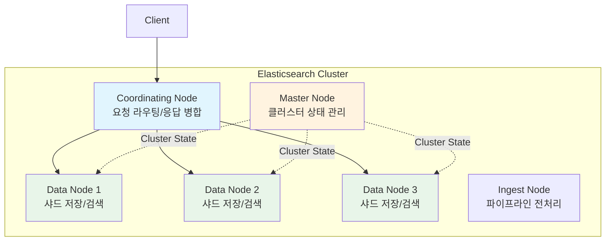
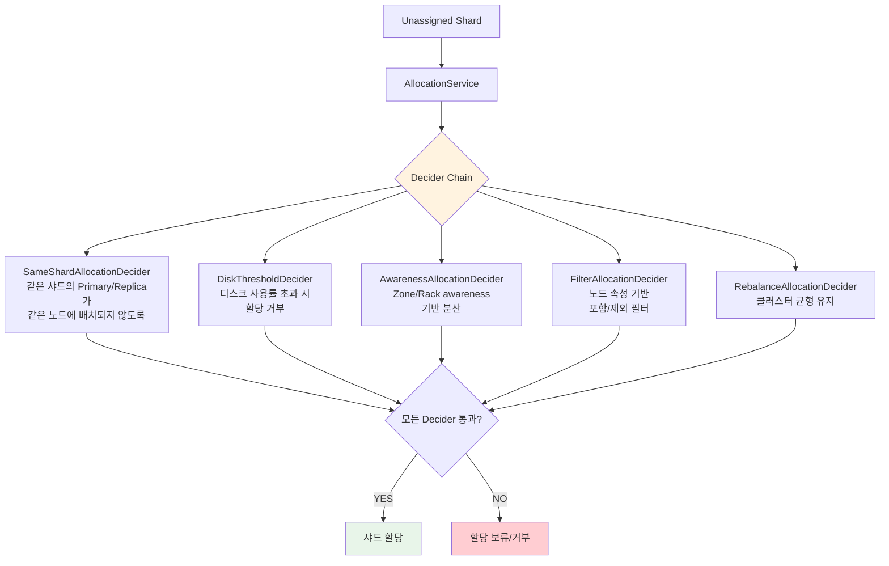
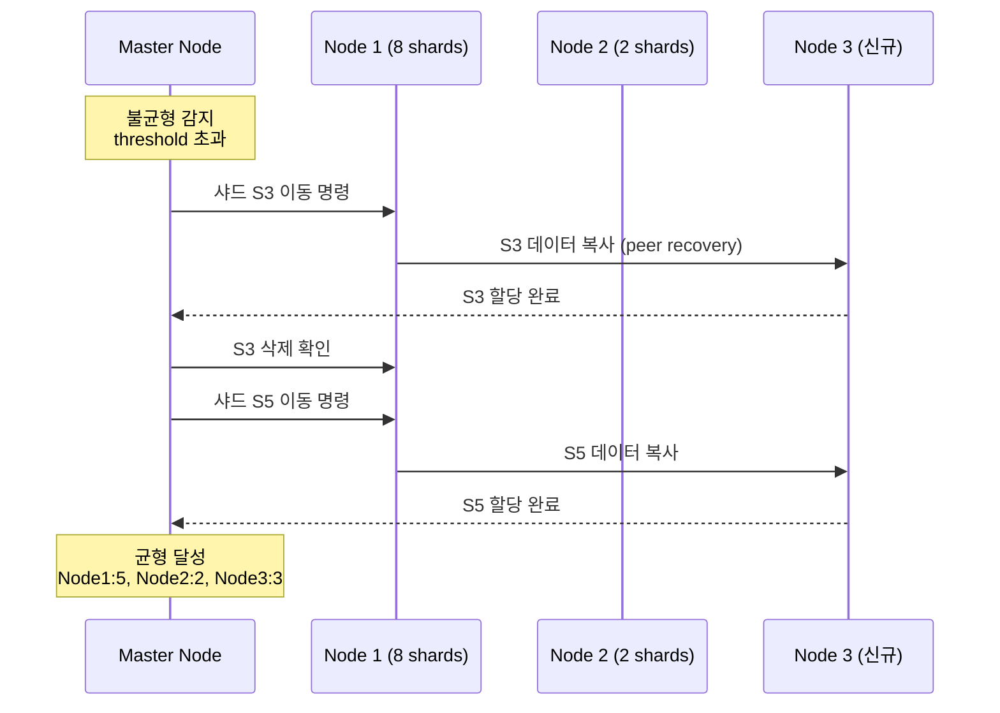
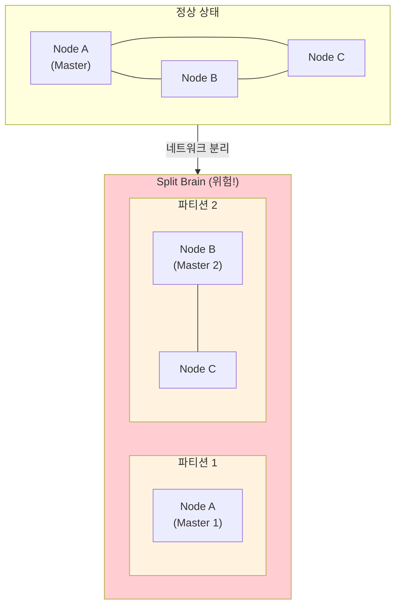
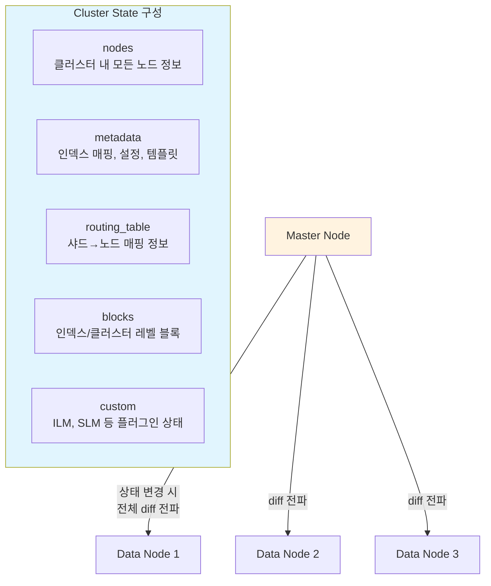
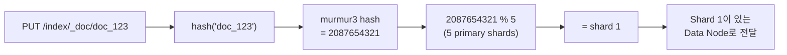

# 클러스터 관리와 샤드 라우팅

Elasticsearch 클러스터의 샤드 할당 전략, Rebalancing 메커니즘, Split Brain 방지, Cluster State 관리 등 운영에 필수적인 내부 동작 원리를 다룬다.

## 목차
- [1. 핵심 개념 (What)](#1-핵심-개념-what)
- [2. 왜 알아야 하는가 (Why)](#2-왜-알아야-하는가-why)
- [3. 내부 구현 분석 (How)](#3-내부-구현-분석-how)
- [4. 실전 예제](#4-실전-예제)
- [5. 정리](#5-정리)

---

## 1. 핵심 개념 (What)

### 클러스터 구성 요소

Elasticsearch 클러스터는 여러 노드로 구성되며, 각 노드는 하나 이상의 역할(role)을 가진다.



### 노드 역할 (Node Roles)

| 역할 | 설정값 | 책임 |
|------|--------|------|
| **Master-eligible** | `master` | 클러스터 상태 관리, 샤드 할당 결정 |
| **Data** | `data` | 샤드 저장, 인덱싱/검색 수행 |
| **Data (tiered)** | `data_hot`, `data_warm`, `data_cold`, `data_frozen` | ILM 기반 계층화 저장 |
| **Ingest** | `ingest` | Ingest Pipeline으로 문서 전처리 |
| **Coordinating** | (전용 설정 없음, 모든 역할 제거) | 요청 라우팅, 응답 집계 |
| **ML** | `ml` | 머신러닝 작업 실행 |

### 라우팅 알고리즘

문서가 어떤 샤드에 저장되는지는 다음 공식으로 결정된다:

```
shard_num = hash(_routing) % num_primary_shards
```

- `_routing`의 기본값은 문서의 `_id`
- 이것이 **인덱스 생성 후 Primary 샤드 수를 변경할 수 없는 이유**다 (Split/Shrink API 제외)

## 2. 왜 알아야 하는가 (Why)

### 운영 안정성의 핵심

- 샤드 할당을 이해하지 못하면 특정 노드에 샤드가 편중되어 핫스팟 발생
- Split Brain 발생 시 데이터 불일치로 복구 불가능한 상태에 빠질 수 있음
- Rebalancing 중 과도한 디스크 I/O로 서비스 성능 저하

### 확장과 축소 전략의 근거

- 노드 추가/제거 시 샤드가 어떻게 재배치되는지 이해해야 안전한 스케일링 가능
- Allocation Awareness를 설정하지 않으면 같은 AZ(Availability Zone)에 Primary와 Replica가 모두 배치될 수 있음

### 비용 최적화

- Hot-Warm-Cold 아키텍처에서 샤드를 적절한 티어로 이동시켜 스토리지 비용 절감
- 불필요한 Replica 수를 줄여 디스크와 메모리 절약

## 3. 내부 구현 분석 (How)

### 3.1 샤드 할당 전략 (Shard Allocation)

샤드 할당은 Master 노드의 **AllocationService**가 담당한다. Decider 체인을 통해 각 샤드의 배치를 결정한다.



#### 주요 Decider 설명

| Decider | 역할 |
|---------|------|
| `SameShardAllocationDecider` | Primary와 Replica를 다른 노드에 배치 |
| `DiskThresholdDecider` | Low watermark(85%), High watermark(90%), Flood stage(95%) |
| `AwarenessAllocationDecider` | 특정 속성(zone, rack) 기준으로 분산 배치 |
| `FilterAllocationDecider` | 인덱스/클러스터 레벨에서 노드 필터링 |
| `MaxRetryAllocationDecider` | 할당 실패 시 최대 재시도 횟수 제어 |

#### 디스크 기반 Watermark

```
0%                    85%              90%              95%         100%
├─────── 정상 ────────┤── Low WM ──────┤── High WM ─────┤─ Flood ──┤
                      │                │                │
                      │ 새 샤드 할당    │ 샤드 재배치     │ 인덱싱
                      │ 중단           │ 시작           │ 차단
```

### 3.2 Rebalancing 동작 원리

Rebalancing은 노드 간 샤드 수의 균형을 맞추는 과정이다.



**Rebalancing 관련 설정:**

| 설정 | 기본값 | 설명 |
|------|--------|------|
| `cluster.routing.rebalance.enable` | `all` | Rebalancing 대상 (all, primaries, replicas, none) |
| `cluster.routing.allocation.balance.shard` | `0.45f` | 노드별 전체 샤드 수 균형 가중치 |
| `cluster.routing.allocation.balance.index` | `0.55f` | 인덱스별 샤드 수 균형 가중치 |
| `cluster.routing.allocation.balance.threshold` | `1.0f` | 이 값 이하의 불균형은 무시 |
| `cluster.routing.allocation.cluster_concurrent_rebalance` | `2` | 동시 Rebalancing 샤드 수 |

### 3.3 Split Brain 방지 메커니즘

Split Brain은 네트워크 파티션으로 클러스터가 둘 이상으로 분리되어 각각 독립적인 Master를 선출하는 상황이다.



#### Elasticsearch 7.x+ 방지 메커니즘

Elasticsearch 7.x부터 `discovery.zen.minimum_master_nodes` 설정이 제거되고, 자동화된 **Quorum 기반 선출**이 도입되었다.

**핵심 원리:**
- Master 선출에 과반수(quorum) 이상의 master-eligible 노드 투표 필요
- `cluster.initial_master_nodes`는 최초 클러스터 부트스트랩 시에만 사용
- 이후에는 클러스터 자체가 투표 구성(voting configuration)을 관리

```
Master-eligible 노드: A, B, C (3개)
Quorum = floor(3/2) + 1 = 2

네트워크 파티션 발생:
  파티션 1: [A]     → 1 < 2 (quorum 미달) → Master 선출 불가
  파티션 2: [B, C]  → 2 >= 2 (quorum 충족) → B 또는 C가 Master 선출

→ Split Brain 방지: 항상 하나의 파티션만 Master를 가질 수 있음
```

**권장 구성:**
- Master-eligible 노드는 **3개** (또는 홀수 개)
- 2개 AZ라면 tiebreaker 노드를 3번째 AZ에 배치
- Dedicated master node 사용 권장 (data 역할 분리)

### 3.4 Cluster State 관리와 전파

Cluster State는 클러스터의 모든 메타데이터를 포함하는 전역 상태 객체다.



**Cluster State 전파 방식:**
- Master 노드만 Cluster State를 수정할 수 있음
- 변경 시 **diff(차분)만 전파**하여 네트워크 효율성 확보 (7.x+)
- 대규모 클러스터에서 인덱스/샤드가 많으면 Cluster State 크기 자체가 문제
- 경험적으로 Cluster State가 100MB를 초과하면 성능 이슈 발생

### 3.5 라우팅 상세 분석

#### 기본 라우팅



#### 커스텀 라우팅

특정 필드 값으로 라우팅하면 관련 문서가 같은 샤드에 저장되어 검색 효율이 향상된다.

```json
PUT /orders/_doc/order_001?routing=user_123
{
  "user_id": "user_123",
  "product": "laptop",
  "amount": 1500
}
```

```
shard_num = hash("user_123") % num_primary_shards
```

같은 `user_id`의 모든 주문이 동일 샤드에 저장되므로, 해당 사용자의 주문 검색 시 단일 샤드만 조회하면 된다.

**주의**: 커스텀 라우팅 사용 시 데이터 편중(skew)이 발생할 수 있다. 특정 사용자의 데이터가 극단적으로 많은 경우 해당 샤드가 핫스팟이 된다.

## 4. 실전 예제

### 4.1 Allocation Awareness 설정 (AZ 분산)

```yaml
# elasticsearch.yml - Node 설정
node.attr.zone: zone-a  # 각 노드에 zone 속성 부여

# 클러스터 레벨 설정 (API)
```

```json
PUT /_cluster/settings
{
  "persistent": {
    "cluster.routing.allocation.awareness.attributes": "zone",
    "cluster.routing.allocation.awareness.force.zone.values": "zone-a,zone-b"
  }
}
```

이 설정으로 Primary 샤드가 `zone-a`에 있으면 Replica는 반드시 `zone-b`에 배치된다. `force` 설정은 특정 zone이 다운되어도 나머지 zone에 Replica를 추가 배치하지 않도록 한다 (한 zone에 모든 복제본이 몰리는 것 방지).

### 4.2 인덱스 레벨 샤드 필터링

Hot-Warm 아키텍처에서 오래된 인덱스를 Warm 노드로 이동:

```json
PUT /logs-2024-01/_settings
{
  "index.routing.allocation.require.data_tier": "warm",
  "index.routing.allocation.exclude._name": "hot-node-*"
}
```

**필터 연산자:**

| 연산자 | 의미 |
|--------|------|
| `require` | 해당 속성을 가진 노드에만 할당 (AND) |
| `include` | 해당 속성을 가진 노드 중 하나에 할당 (OR) |
| `exclude` | 해당 속성을 가진 노드에 할당하지 않음 |

### 4.3 클러스터 건강 상태 모니터링

```json
GET /_cluster/health
```

응답 예시:
```json
{
  "cluster_name": "production",
  "status": "yellow",
  "timed_out": false,
  "number_of_nodes": 5,
  "number_of_data_nodes": 3,
  "active_primary_shards": 150,
  "active_shards": 280,
  "relocating_shards": 2,
  "initializing_shards": 0,
  "unassigned_shards": 20,
  "delayed_unassigned_shards": 0,
  "number_of_pending_tasks": 0,
  "number_of_in_flight_fetch": 0,
  "task_max_waiting_in_queue_millis": 0,
  "active_shards_percent_as_number": 93.33
}
```

| 상태 | 의미 |
|------|------|
| **Green** | 모든 Primary + Replica 정상 할당 |
| **Yellow** | 모든 Primary 정상, 일부 Replica 미할당 |
| **Red** | 일부 Primary 미할당 → 데이터 손실 위험 |

### 4.4 미할당 샤드 원인 진단

```json
GET /_cluster/allocation/explain
{
  "index": "logs-2024-01",
  "shard": 0,
  "primary": false
}
```

응답에서 `allocate_explanation` 필드가 미할당 원인을 설명한다:
- `"the shard cannot be allocated to the same node"` → 단일 노드에서 Replica 할당 불가
- `"the node is above the high watermark"` → 디스크 공간 부족
- `"node does not match index setting"` → 노드 속성 필터 불일치

### 4.5 안전한 노드 제거 (Rolling Restart)

```json
// 1단계: 제거할 노드에서 샤드 배출
PUT /_cluster/settings
{
  "transient": {
    "cluster.routing.allocation.exclude._name": "data-node-3"
  }
}

// 2단계: 샤드 이동 완료 확인
GET /_cat/shards?v&h=index,shard,prirep,state,node&s=node

// 3단계: 모든 샤드 이동 완료 후 노드 중지
// (노드에 샤드가 0개인지 확인)

// 4단계: 노드 재시작 후 필터 해제
PUT /_cluster/settings
{
  "transient": {
    "cluster.routing.allocation.exclude._name": null
  }
}
```

### 4.6 Cluster State 크기 확인

```json
GET /_cluster/state?filter_path=metadata.indices.*.settings.index.number_of_shards

// 전체 Cluster State 크기 확인
GET /_cluster/stats?human&filter_path=indices.shards.total,indices.count
```

**경험적 가이드라인:**

| 항목 | 권장 범위 |
|------|-----------|
| 노드당 샤드 수 | 20 * heap(GB) 이하 (예: 30GB 힙 → 600개) |
| 샤드 크기 | 10GB ~ 50GB |
| 총 샤드 수 | 클러스터 전체에서 수만 개 이하 |
| Cluster State 크기 | 100MB 이하 |

## 5. 정리

| 구분 | 핵심 내용 |
|------|-----------|
| **라우팅 공식** | `shard = hash(_routing) % num_primary_shards` — Primary 수 변경 불가의 근본 원인 |
| **샤드 할당** | AllocationService의 Decider 체인이 순차적으로 배치 가능 여부 판단 |
| **Allocation Awareness** | zone/rack 속성으로 Primary-Replica를 다른 가용 영역에 분산 |
| **Disk Watermark** | 85%(low) → 90%(high) → 95%(flood) 단계별 할당/인덱싱 제한 |
| **Rebalancing** | 노드 간 샤드 수 균형을 자동으로 맞춤. 동시 이동 수 제한으로 부하 조절 |
| **Split Brain 방지** | Quorum 기반 선출 (7.x+). Master-eligible 노드 홀수 개 권장 |
| **Cluster State** | Master만 수정, diff 전파. 인덱스/샤드 수 폭발 시 성능 병목 |
| **노드 제거** | exclude 필터로 샤드 배출 후 안전하게 중지 |

---
*참고: Elasticsearch 8.x 기준*
