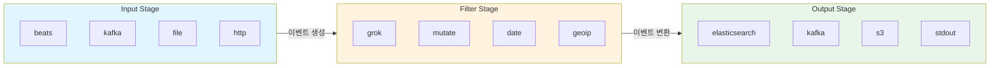
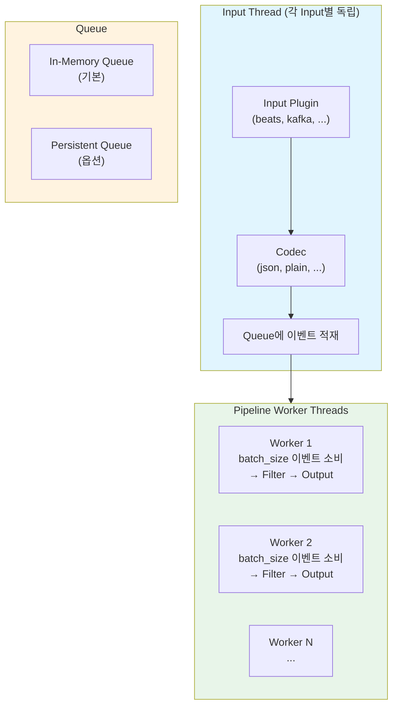
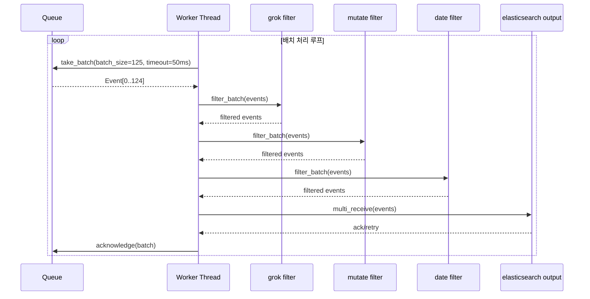
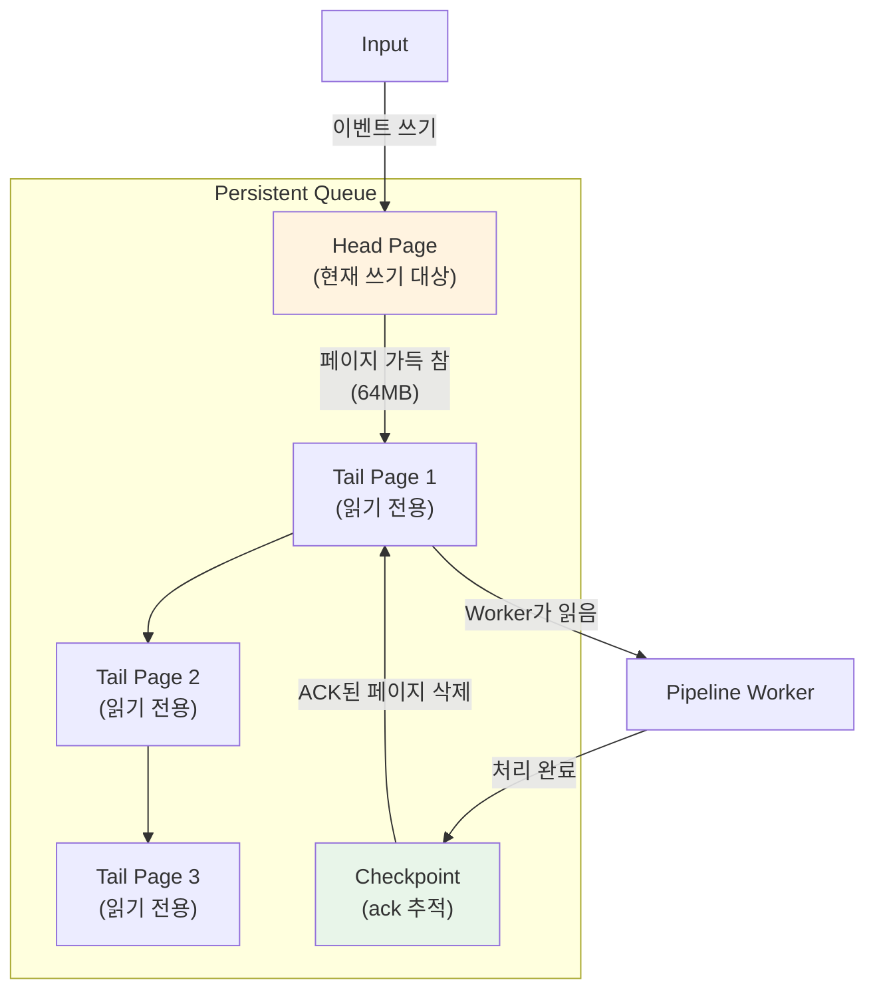
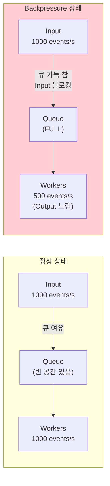
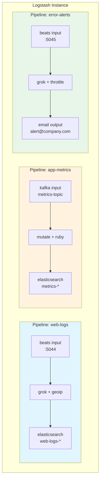
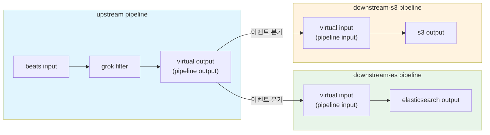
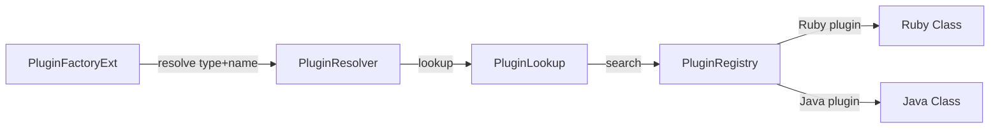

# Logstash 파이프라인 아키텍처

Logstash의 이벤트 처리 모델, Pipeline Worker Thread 구조, Persistent Queue 메커니즘, 메모리 관리와 Backpressure, 멀티 파이프라인 아키텍처를 심층적으로 다룬다.

## 목차
- [1. 핵심 개념 (What)](#1-핵심-개념-what)
- [2. 왜 알아야 하는가 (Why)](#2-왜-알아야-하는가-why)
- [3. 내부 구현 분석 (How)](#3-내부-구현-분석-how)
- [4. 실전 예제](#4-실전-예제)
- [5. 정리](#5-정리)

---

## 1. 핵심 개념 (What)

### Logstash란

Logstash는 다양한 소스에서 데이터를 수집하고, 변환하여, 다양한 목적지로 전송하는 **서버 사이드 데이터 처리 파이프라인** 엔진이다. Input → Filter → Output의 3단계 파이프라인 모델을 기반으로 한다.

### 파이프라인 3단계



| 단계 | 역할 | 특징 |
|------|------|------|
| **Input** | 데이터 소스에서 이벤트 수집 | 자체 스레드에서 실행, codec으로 디코딩 |
| **Filter** | 이벤트 파싱, 변환, 보강 | Worker Thread에서 배치 처리 |
| **Output** | 목적지로 이벤트 전송 | Worker Thread에서 배치 전송 |

### 이벤트(Event) 구조

Logstash에서 처리하는 데이터의 기본 단위:

```ruby
{
  "@timestamp" => 2024-01-15T10:30:00.000Z,  # 이벤트 타임스탬프
  "@version"   => "1",                         # 이벤트 버전
  "@metadata"  => { ... },                     # 출력에 포함되지 않는 메타데이터
  "message"    => "원본 메시지",                # 원본 데이터
  "host"       => { "name" => "server-01" },   # 호스트 정보
  "tags"       => [],                          # 태그 배열
  # ... 사용자 정의 필드
}
```

## 2. 왜 알아야 하는가 (Why)

### 데이터 유실 방지

- 기본 In-Memory Queue 사용 시 Logstash 장애로 큐 내 이벤트가 유실됨
- Persistent Queue 활성화와 적절한 설정이 데이터 안정성의 핵심

### 성능 튜닝의 기반

- Pipeline Worker 수, Batch Size 등 파라미터가 처리량(throughput)을 직접 결정
- 리소스(CPU, 메모리, 디스크 I/O)에 맞는 설정을 하려면 내부 구조를 이해해야 함

### 운영 환경 설계

- 단일 파이프라인 vs 멀티 파이프라인 결정
- Backpressure 메커니즘을 이해해야 안정적인 데이터 파이프라인 설계 가능
- 장애 격리와 독립 스케일링이 필요한 경우 파이프라인 분리 전략

## 3. 내부 구현 분석 (How)

### 3.1 이벤트 처리 모델

Logstash의 이벤트 처리는 **배치 기반**으로 동작한다.



**처리 흐름:**
1. Input Plugin이 자체 스레드에서 데이터 수집
2. Codec이 원시 데이터를 Logstash Event로 디코딩
3. Event를 Queue(In-Memory 또는 Persistent)에 적재
4. Pipeline Worker Thread가 Queue에서 `batch_size`만큼 이벤트를 가져옴
5. Filter 체인을 순서대로 적용
6. Output Plugin으로 배치 전송

### 3.2 Pipeline Worker Thread 구조



**핵심 파라미터:**

| 파라미터 | 기본값 | 설명 |
|----------|--------|------|
| `pipeline.workers` | CPU 코어 수 | Filter + Output을 실행하는 워커 스레드 수 |
| `pipeline.batch.size` | 125 | 워커당 한 번에 처리하는 이벤트 수 |
| `pipeline.batch.delay` | 50 (ms) | 배치가 가득 차지 않아도 처리를 시작하는 대기 시간 |

**튜닝 가이드라인:**
- **CPU 바운드** (grok 등 복잡한 파싱): `pipeline.workers` 증가
- **I/O 바운드** (Elasticsearch 출력 대기): `pipeline.batch.size` 증가
- `pipeline.workers * pipeline.batch.size`가 inflight 이벤트 수의 최대치

### 3.3 Persistent Queue (PQ) 메커니즘

Persistent Queue는 이벤트를 디스크에 기록하여 Logstash 재시작 시에도 데이터 유실을 방지한다.



**PQ 동작 원리:**
1. Input이 이벤트를 **Head Page**에 기록 (현재 활성 페이지)
2. Head Page가 `page_capacity`(기본 64MB)에 도달하면 **Tail Page**로 전환
3. Worker Thread가 Tail Page에서 이벤트를 순서대로 읽어 처리
4. 처리 완료(Output 성공) 후 **Checkpoint**에 ACK 기록
5. 모든 이벤트가 ACK된 Tail Page는 삭제

**PQ 관련 설정:**

| 설정 | 기본값 | 설명 |
|------|--------|------|
| `queue.type` | `memory` | `persisted`로 변경하여 PQ 활성화 |
| `queue.max_bytes` | 1024MB | PQ 전체 최대 크기 |
| `queue.page_capacity` | 64MB | 단일 페이지 크기 |
| `queue.drain` | false | 종료 시 큐의 모든 이벤트 처리 완료 후 종료 |
| `queue.checkpoint.writes` | 1024 | 체크포인트 기록 간격 (이벤트 수) |
| `queue.checkpoint.acks` | 1024 | ACK 체크포인트 간격 |

### 3.4 메모리 관리와 Backpressure

#### In-Memory Queue의 Backpressure



**Backpressure 메커니즘:**
1. Output이 느려지면 Worker의 처리 속도 감소
2. Worker가 Queue에서 이벤트를 느리게 소비
3. Queue가 가득 차면 Input Thread가 **블로킹**됨
4. Input이 블로킹되면 소스(Beats, Kafka 등)에 대한 수신도 중단
5. 이를 통해 시스템 전체의 메모리 폭발 방지

#### JVM 힙 메모리 설정

```bash
# jvm.options 파일
-Xms4g    # 초기 힙 크기
-Xmx4g    # 최대 힙 크기 (초기와 동일하게 설정 권장)
```

**메모리 배분 가이드:**

| 항목 | 메모리 용도 |
|------|-------------|
| In-Memory Queue | `pipeline.workers * pipeline.batch.size * 이벤트 평균 크기` |
| Filter 처리 | grok 패턴 컴파일, geoip DB 로드 등 |
| Output 버퍼 | Elasticsearch bulk 요청 버퍼 등 |
| PQ (사용 시) | 디스크 기반이지만 mmap으로 페이지 캐시 활용 |

### 3.5 멀티 파이프라인 아키텍처

단일 Logstash 인스턴스에서 여러 독립 파이프라인을 실행할 수 있다.



**멀티 파이프라인의 장점:**
- **장애 격리**: 한 파이프라인의 Output 장애가 다른 파이프라인에 영향을 주지 않음
- **독립 튜닝**: 파이프라인별로 `workers`, `batch_size` 개별 설정
- **리소스 제어**: 각 파이프라인에 적절한 리소스 할당
- **코드 관리**: 파이프라인 설정 파일을 독립적으로 관리/배포

#### Pipeline-to-Pipeline 통신



## 4. 실전 예제

### 4.1 기본 파이프라인 설정 (logstash.yml)

```yaml
# logstash.yml - 글로벌 설정
pipeline.workers: 4
pipeline.batch.size: 250
pipeline.batch.delay: 50
pipeline.ecs_compatibility: v8

# Persistent Queue 활성화
queue.type: persisted
queue.max_bytes: 4gb
queue.page_capacity: 64mb
queue.drain: true
queue.checkpoint.writes: 1024

# 모니터링
monitoring.enabled: true
monitoring.elasticsearch.hosts: ["https://monitor-es:9200"]

# 로깅
log.level: info
path.logs: /var/log/logstash
```

### 4.2 멀티 파이프라인 설정 (pipelines.yml)

```yaml
# pipelines.yml
- pipeline.id: web-access-logs
  path.config: "/etc/logstash/pipelines/web-access.conf"
  pipeline.workers: 4
  pipeline.batch.size: 250
  queue.type: persisted
  queue.max_bytes: 2gb

- pipeline.id: application-logs
  path.config: "/etc/logstash/pipelines/app-logs.conf"
  pipeline.workers: 2
  pipeline.batch.size: 125
  queue.type: persisted
  queue.max_bytes: 1gb

- pipeline.id: metrics-pipeline
  path.config: "/etc/logstash/pipelines/metrics.conf"
  pipeline.workers: 1
  pipeline.batch.size: 500
  queue.type: memory
```

### 4.3 프로덕션급 웹 로그 파이프라인

```ruby
# /etc/logstash/pipelines/web-access.conf

input {
  beats {
    port => 5044
    ssl_enabled => true
    ssl_certificate => "/etc/logstash/certs/logstash.crt"
    ssl_key => "/etc/logstash/certs/logstash.key"
  }
}

filter {
  # Apache/Nginx 액세스 로그 파싱
  grok {
    match => {
      "message" => '%{IPORHOST:client_ip} - %{DATA:user_name} \[%{HTTPDATE:timestamp}\] "%{WORD:method} %{URIPATHPARAM:request} HTTP/%{NUMBER:http_version}" %{NUMBER:status:int} %{NUMBER:bytes:int} "%{DATA:referrer}" "%{DATA:user_agent}"'
    }
    tag_on_failure => ["_grokparsefailure"]
  }

  # 파싱 실패 시 DLQ로 보내기 위한 태깅
  if "_grokparsefailure" in [tags] {
    mutate {
      add_tag => ["parse_error"]
    }
  }

  # 타임스탬프 파싱
  date {
    match => ["timestamp", "dd/MMM/yyyy:HH:mm:ss Z"]
    target => "@timestamp"
    remove_field => ["timestamp"]
  }

  # GeoIP 보강
  geoip {
    source => "client_ip"
    target => "geo"
    database => "/etc/logstash/GeoLite2-City.mmdb"
    tag_on_failure => ["_geoip_lookup_failure"]
  }

  # User-Agent 파싱
  useragent {
    source => "user_agent"
    target => "ua"
  }

  # 불필요한 필드 제거 및 타입 변환
  mutate {
    remove_field => ["message", "agent", "ecs", "input", "log"]
    convert => {
      "status" => "integer"
      "bytes" => "integer"
    }
  }
}

output {
  # 정상 이벤트
  if "parse_error" not in [tags] {
    elasticsearch {
      hosts => ["https://es-node1:9200", "https://es-node2:9200"]
      index => "web-logs-%{+YYYY.MM.dd}"
      user => "logstash_writer"
      password => "${ES_PASSWORD}"
      ssl_enabled => true
      ssl_certificate_authorities => ["/etc/logstash/certs/ca.crt"]

      # 성능 튜닝
      bulk_max_size => 500
      http_compression => true
    }
  }

  # 파싱 실패 이벤트 → 별도 인덱스
  if "parse_error" in [tags] {
    elasticsearch {
      hosts => ["https://es-node1:9200"]
      index => "web-logs-errors-%{+YYYY.MM.dd}"
      user => "logstash_writer"
      password => "${ES_PASSWORD}"
      ssl_enabled => true
      ssl_certificate_authorities => ["/etc/logstash/certs/ca.crt"]
    }
  }
}
```

### 4.4 Pipeline-to-Pipeline 패턴

```yaml
# pipelines.yml - Fan-out 패턴
- pipeline.id: intake
  path.config: "/etc/logstash/pipelines/intake.conf"
  pipeline.workers: 4

- pipeline.id: es-output
  path.config: "/etc/logstash/pipelines/es-output.conf"
  pipeline.workers: 2

- pipeline.id: s3-archive
  path.config: "/etc/logstash/pipelines/s3-archive.conf"
  pipeline.workers: 1
```

```ruby
# intake.conf - 수집 및 분기
input {
  beats { port => 5044 }
}

filter {
  grok { match => { "message" => "%{COMBINEDAPACHELOG}" } }
}

output {
  pipeline {
    send_to => ["es-ingest", "s3-archive"]
  }
}
```

```ruby
# es-output.conf - Elasticsearch 전송
input {
  pipeline { address => "es-ingest" }
}

output {
  elasticsearch {
    hosts => ["https://es:9200"]
    index => "logs-%{+YYYY.MM.dd}"
  }
}
```

```ruby
# s3-archive.conf - S3 아카이빙
input {
  pipeline { address => "s3-archive" }
}

output {
  s3 {
    region => "ap-northeast-2"
    bucket => "log-archive"
    prefix => "raw-logs/%{+YYYY/MM/dd}/"
    time_file => 15
    codec => json_lines
  }
}
```

### 4.5 Dead Letter Queue (DLQ) 설정

처리 실패 이벤트를 별도 큐에 보관하여 나중에 재처리:

```yaml
# logstash.yml
dead_letter_queue.enable: true
dead_letter_queue.max_bytes: 1gb
dead_letter_queue.storage_policy: drop_newer
dead_letter_queue.retain.age: 7d
```

```ruby
# dlq-reprocess.conf - DLQ 재처리 파이프라인
input {
  dead_letter_queue {
    path => "/var/lib/logstash/dead_letter_queue"
    pipeline_id => "web-access-logs"
    commit_offsets => true
  }
}

filter {
  # 원본 이벤트의 실패 원인 분석 및 재처리 로직
  mutate {
    add_tag => ["dlq_reprocessed"]
  }
}

output {
  elasticsearch {
    hosts => ["https://es:9200"]
    index => "recovered-events-%{+YYYY.MM.dd}"
  }
}
```

## 보충: 플러그인 시스템 내부 구현

Logstash의 확장성은 플러그인 시스템에 기반한다. PluginFactory 패턴으로 런타임에 인스턴스화되며, 표준화된 인터페이스를 통해 파이프라인에 조립된다.

### 플러그인 유형과 기반 클래스

| 유형 | 기반 클래스 | 역할 | 예시 |
|------|------------|------|------|
| **Input** | `LogStash::Inputs::Base` | 외부 소스에서 이벤트 수집 | beats, kafka, file, stdin |
| **Filter** | `LogStash::Filters::Base` | 이벤트 변환, 보강, 필터링 | grok, mutate, date, geoip |
| **Output** | `LogStash::Outputs::Base` | 처리된 이벤트를 목적지로 전송 | elasticsearch, stdout, s3 |
| **Codec** | `LogStash::Codecs::Base` | Input/Output의 데이터 인코딩/디코딩 | json, plain, multiline |

### LogStash::Plugin - 최상위 기반 클래스

모든 플러그인의 공통 기능을 정의한다:

```ruby
class LogStash::Plugin
  include LogStash::Config::Mixin               # 설정 파싱
  include LogStash::Plugins::ECSCompatibilitySupport  # ECS 호환성
  include LogStash::Plugins::EventFactorySupport      # 이벤트 생성

  config :enable_metric, :validate => :boolean, :default => true
  config :id, :validate => :string

  def initialize(params = {})
    @params = LogStash::Util.deep_clone(params)
    @params["id"] ||= "#{self.class.config_name}_#{SecureRandom.uuid}"
  end

  def do_close
    @logger.debug("Closing", :plugin => self.class.name)
    begin
      close
    ensure
      LogStash::PluginMetadata.delete_for_plugin(self.id)
    end
  end

  def self.lookup(type, name)
    LogStash::PLUGIN_REGISTRY.lookup_pipeline_plugin(type, name)
  end
end
```

핵심 포인트:
- **ID 자동 생성**: 사용자가 `id`를 지정하지 않으면 `config_name_UUID` 형태로 자동 생성
- **메트릭 비활성화**: `enable_metric: false`로 개별 플러그인의 메트릭 수집 비활성화 가능
- **PluginMetadata**: 플러그인별 키-값 메타데이터 저장소

### Output Concurrency 모델

| 모델 | 동작 | 사용 사례 |
|------|------|----------|
| `:legacy` | 기본값. Worker당 별도 인스턴스 | 이전 버전 호환 |
| `:single` | 단일 인스턴스, Mutex로 직렬화 | Thread-unsafe Output |
| `:shared` | 단일 인스턴스, 동시 접근 허용 | Thread-safe Output (elasticsearch 등) |

### PluginFactoryExt - 플러그인 팩토리

`PluginFactoryExt`는 PipelineIR의 플러그인 정의를 실제 플러그인 인스턴스로 변환하는 팩토리 클래스다:

```java
@JRubyClass(name = "PluginFactory")
public final class PluginFactoryExt extends RubyBasicObject
    implements RubyIntegration.PluginFactory {

    private final transient Collection<String> pluginsById = ConcurrentHashMap.newKeySet();
    private transient PipelineIR lir;
    private transient PluginResolver pluginResolver;

    // 유형별 플러그인 생성자 레지스트리
    private final transient Map<PluginLookup.PluginType, AbstractPluginCreator<? extends Plugin>>
        pluginCreatorsRegistry = new HashMap<>(4);
```

초기화 시 유형별 Creator를 등록한다:

```java
PluginFactoryExt init(final PipelineIR lir, ...) {
    this.pluginCreatorsRegistry.put(PluginLookup.PluginType.INPUT,  new InputPluginCreator(this));
    this.pluginCreatorsRegistry.put(PluginLookup.PluginType.CODEC,  new CodecPluginCreator());
    this.pluginCreatorsRegistry.put(PluginLookup.PluginType.FILTER, new FilterPluginCreator());
    this.pluginCreatorsRegistry.put(PluginLookup.PluginType.OUTPUT, new OutputPluginCreator(this));
    return this;
}
```

### PluginResolver와 PluginRegistry

플러그인 해석 체인:



`PluginRegistry`는 설치된 모든 플러그인의 싱글턴 레지스트리로, Ruby Gem과 Java SPI 두 가지 경로로 플러그인을 발견한다.

### FilterDelegator

Filter 플러그인은 `FilterDelegator`로 래핑되어 메트릭 수집, 스레드 안전성 관리가 추가된다. 플러그인 인스턴스 생성 시 `ExecutionContext`가 주입되고, 메트릭 네임스페이스가 설정된다.

### Java 기반 커스텀 Filter 플러그인

```java
@LogstashPlugin(name = "enrich_company")
public class EnrichCompanyFilter implements Filter {

    public static final PluginConfigSpec<String> SOURCE_FIELD =
        PluginConfigSpec.stringSetting("source_field", "company_id");

    public static final PluginConfigSpec<String> TARGET_FIELD =
        PluginConfigSpec.stringSetting("target_field", "company_info");

    private String sourceField;
    private String targetField;
    private final String id;

    public EnrichCompanyFilter(String id, Configuration config, Context context) {
        this.id = id;
        this.sourceField = config.get(SOURCE_FIELD);
        this.targetField = config.get(TARGET_FIELD);
    }

    @Override
    public Collection<Event> filter(Collection<Event> events, FilterMatchListener matchListener) {
        for (Event event : events) {
            String companyId = (String) event.getField(sourceField);
            if (companyId != null) {
                Map<String, Object> companyInfo = lookupService.lookup(companyId);
                if (companyInfo != null) {
                    event.setField(targetField, companyInfo);
                    matchListener.filterMatched(event);
                }
            }
        }
        return events;
    }

    @Override
    public Collection<PluginConfigSpec<?>> configSchema() {
        return Arrays.asList(SOURCE_FIELD, TARGET_FIELD);
    }

    @Override
    public String getId() { return this.id; }
}
```

### 플러그인 메트릭 모니터링

```bash
curl -s localhost:9600/_node/stats/pipelines?pretty | jq '
  .pipelines["main-pipeline"].plugins | {
    inputs: [.inputs[] | {
      id: .id, name: .name,
      events_out: .events.out,
      queue_push_duration_ms: .events.queue_push_duration_in_millis
    }],
    filters: [.filters[] | {
      id: .id, name: .name,
      events_in: .events.in,
      events_out: .events.out,
      duration_ms: .events.duration_in_millis,
      failures: .failures
    }],
    outputs: [.outputs[] | {
      id: .id, name: .name,
      events_in: .events.in,
      events_out: .events.out,
      duration_ms: .events.duration_in_millis
    }]
  }'
```

플러그인 성능 진단 기준:

| 메트릭 | 의미 | 대응 방안 |
|--------|------|----------|
| Filter의 `duration_in_millis` 높음 | CPU-bound 처리 병목 | grok 패턴 최적화 또는 dissect로 대체 |
| Output의 `duration_in_millis` 높음 | I/O 병목 (네트워크/디스크) | batch size 증가 또는 Output 분리 |
| Input의 `queue_push_duration` 높음 | Queue 포화 | Worker 수 증가 또는 Queue 크기 확대 |
| Filter의 `failures` 증가 | 파싱 오류 또는 예외 | 로그 확인 후 패턴 또는 입력 데이터 수정 |

## 5. 정리

| 구분 | 핵심 내용 |
|------|-----------|
| **파이프라인 구조** | Input(자체 스레드) → Queue → Worker Thread(Filter + Output) |
| **Worker Thread** | 배치 기반 처리. `pipeline.workers` × `pipeline.batch.size` = inflight 이벤트 수 |
| **Persistent Queue** | 디스크 기반 큐로 데이터 유실 방지. Head Page(쓰기) → Tail Page(읽기) → ACK → 삭제 |
| **Backpressure** | Queue 포화 시 Input 블로킹 → 소스 수신 중단으로 메모리 폭발 방지 |
| **멀티 파이프라인** | `pipelines.yml`로 독립 파이프라인 구성. 장애 격리, 개별 튜닝 가능 |
| **Pipeline-to-Pipeline** | virtual input/output으로 파이프라인 간 이벤트 전달. Fan-out 패턴 |
| **Dead Letter Queue** | 처리 실패 이벤트를 별도 보관하여 나중에 재처리 가능 |
| **튜닝 핵심** | CPU 바운드 → workers 증가, I/O 바운드 → batch_size 증가 |
| **LogStash::Plugin** | 모든 플러그인의 최상위 기반 클래스. ID, 메트릭, 설정 처리 공통 기능 제공 |
| **PluginFactoryExt** | PipelineIR 정의를 플러그인 인스턴스로 변환. 유형별 Creator 패턴 |
| **PluginRegistry** | 설치된 모든 플러그인의 싱글턴 레지스트리. Ruby Gem + Java SPI 탐색 |
| **Output Concurrency** | `:legacy`/`:single`/`:shared` 세 가지 모델로 스레드 안전성 관리 |

---
*참고: Logstash 8.x 기준*
