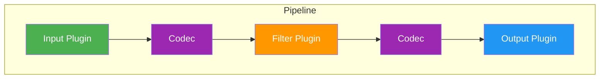
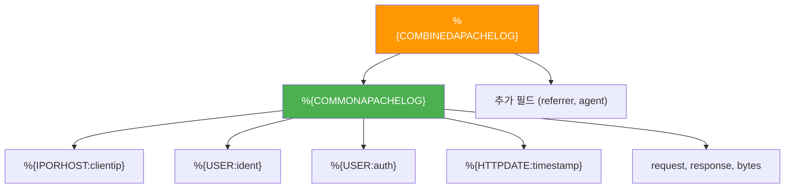
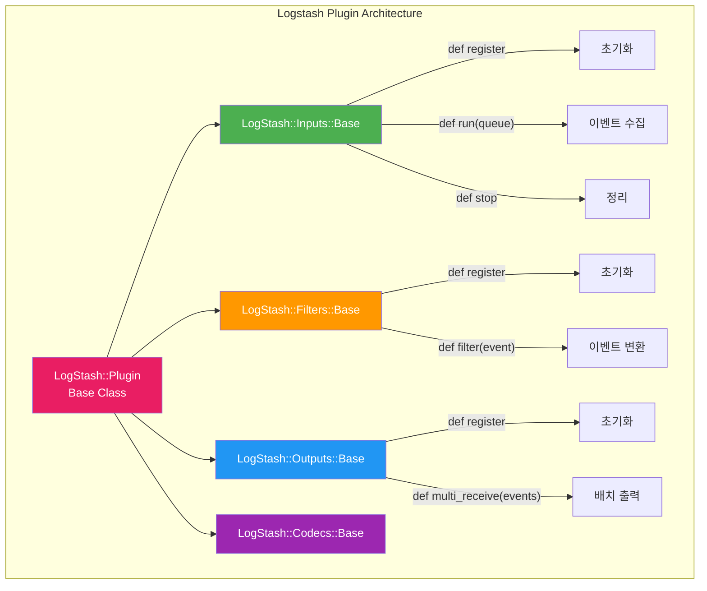

# Logstash 플러그인 시스템

Logstash의 핵심 강점은 200개 이상의 플러그인으로 구성된 확장 가능한 파이프라인 아키텍처에 있다. 이 문서에서는 플러그인 유형별 구조, Grok 패턴 문법, 주요 Filter 플러그인, 그리고 커스텀 플러그인 개발 방법을 다룬다.

## 목차
- [1. 핵심 개념 (What)](#1-핵심-개념-what)
- [2. 왜 알아야 하는가 (Why)](#2-왜-알아야-하는가-why)
- [3. 내부 구현 분석 (How)](#3-내부-구현-분석-how)
- [4. 실전 예제](#4-실전-예제)
- [5. 정리](#5-정리)

---

## 1. 핵심 개념 (What)

### 플러그인 4대 카테고리

Logstash 파이프라인은 4가지 유형의 플러그인으로 구성된다.



| 카테고리 | 역할 | 대표 플러그인 |
|---------|------|-------------|
| **Input** | 데이터 소스에서 이벤트 수집 | `beats`, `kafka`, `file`, `jdbc`, `syslog`, `http` |
| **Filter** | 이벤트 변환/가공/강화 | `grok`, `mutate`, `date`, `geoip`, `dissect`, `ruby` |
| **Output** | 가공된 이벤트를 목적지로 전송 | `elasticsearch`, `kafka`, `file`, `stdout`, `s3` |
| **Codec** | Input/Output의 직렬화/역직렬화 | `json`, `plain`, `multiline`, `rubydebug` |

### 플러그인 생명주기

모든 Logstash 플러그인은 공통 생명주기를 따른다:

1. **register** - 초기화 (연결 설정, 리소스 할당)
2. **run** (Input) / **filter** (Filter) / **encode/decode** (Codec) - 핵심 처리
3. **close** - 정리 (연결 해제, 리소스 반환)

각 플러그인은 `logstash-core`의 `LogStash::Plugin` 기본 클래스를 상속하며, JRuby 기반으로 동작한다.

---

## 2. 왜 알아야 하는가 (Why)

### 실무 동기

- **비정형 로그 파싱**: 애플리케이션마다 로그 형식이 다르다. Grok/Dissect 없이는 Elasticsearch에서 의미 있는 필드 검색이 불가능하다.
- **데이터 품질 제어**: Filter 플러그인 조합으로 누락 필드 보정, 타임스탬프 정규화, 민감정보 마스킹을 파이프라인 레벨에서 처리할 수 있다.
- **확장성**: 내장 플러그인으로 해결되지 않는 경우 커스텀 플러그인을 개발하여 기존 파이프라인에 끊김 없이 통합할 수 있다.
- **성능 최적화**: Grok과 Dissect의 성능 차이를 이해하면 파이프라인 처리량을 10배 이상 개선할 수 있다.

### 플러그인 선택이 파이프라인 성능에 미치는 영향

```
[Grok 정규식 파싱]    ~2,000 events/sec
[Dissect 토큰 파싱]   ~20,000 events/sec  (10x 빠름)
[Ruby Filter 커스텀]  ~5,000 events/sec   (유연하지만 중간 성능)
```

동일한 로그를 파싱하더라도 플러그인 선택에 따라 처리량이 크게 달라진다.

---

## 3. 내부 구현 분석 (How)

### 3.1 Grok 패턴 시스템

Grok은 Logstash에서 가장 많이 사용되는 Filter 플러그인이다. 내부적으로 Oniguruma 정규식 엔진을 사용하며, 명명된 캡처 그룹을 재사용 가능한 패턴으로 추상화한다.

#### Grok 패턴 문법

```
%{PATTERN_NAME:field_name:data_type}
```

- `PATTERN_NAME`: 미리 정의된 또는 커스텀 패턴 이름
- `field_name`: 추출된 값이 저장될 필드명
- `data_type`: (선택) `int` 또는 `float`로 타입 변환

#### 내장 패턴 구조

Logstash는 `vendor/bundle/jruby/*/gems/logstash-patterns-core-*/patterns/` 경로에 약 120개의 기본 패턴을 제공한다.

```
# grok-patterns (기본 패턴 파일)
USERNAME [a-zA-Z0-9._-]+
USER %{USERNAME}
EMAILLOCALPART [a-zA-Z][a-zA-Z0-9_.+-=:]+
EMAILADDRESS %{EMAILLOCALPART}@%{HOSTNAME}
INT (?:[+-]?(?:[0-9]+))
BASE10NUM (?:[+-]?(?:[0-9]+(?:\.[0-9]+)?))
NUMBER (?:%{BASE10NUM})
BASE16NUM (?:0[xX]?[0-9a-fA-F]+)
WORD \b\w+\b
NOTSPACE \S+
SPACE \s*
DATA .*?
GREEDYDATA .*
IP (?:%{IPV6}|%{IPV4})
HTTPDATE %{MONTHDAY}/%{MONTH}/%{YEAR}:%{TIME} %{INT}
```

#### Grok 패턴 조합 원리



패턴은 재귀적으로 확장된다. `%{COMBINEDAPACHELOG}`는 내부적으로 수십 개의 기본 패턴으로 풀어진다.

#### 커스텀 패턴 작성

```bash
# /etc/logstash/patterns/custom_patterns
CUSTOM_TIMESTAMP %{YEAR}-%{MONTHNUM}-%{MONTHDAY}[T ]%{HOUR}:?%{MINUTE}(?::?%{SECOND})?%{ISO8601_TIMEZONE}?
SERVICE_NAME [a-zA-Z][a-zA-Z0-9_-]{2,32}
CUSTOM_LOGLEVEL (?:DEBUG|INFO|WARN|ERROR|FATAL|TRACE)
CUSTOM_LOG %{CUSTOM_TIMESTAMP:timestamp} \[%{CUSTOM_LOGLEVEL:level}\] %{SERVICE_NAME:service} - %{GREEDYDATA:message}
```

### 3.2 주요 Filter 플러그인

#### mutate - 필드 조작의 스위스 아미 나이프

`mutate`는 필드 이름 변경, 타입 변환, 문자열 치환 등 범용 변환을 수행한다. 내부 처리 순서가 정해져 있다:

```
coerce → rename → update → replace → convert → gsub → 
uppercase → capitalize → lowercase → strip → remove → split → join → merge → copy
```

이 순서를 이해해야 의도하지 않은 결과를 방지할 수 있다.

#### date - 타임스탬프 정규화

`date` 필터는 문자열 타임스탬프를 `@timestamp` 필드로 파싱한다. Elasticsearch에서 시계열 분석의 기준점이 되므로, 파이프라인에서 가장 중요한 필터 중 하나다.

#### geoip - IP 주소 지리 정보 매핑

MaxMind GeoLite2 데이터베이스를 사용하여 IP 주소를 위도/경도, 국가, 도시 정보로 변환한다. Kibana Maps 시각화의 기반 데이터를 생성한다.

#### dissect - 고성능 구조적 파싱

Grok과 달리 정규식을 사용하지 않고 구분자 기반 토큰 분리를 수행한다. 구조가 일정한 로그에는 Grok 대비 10배 이상 빠르다.

```
# dissect 문법
%{field_name} - 기본 필드 추출
%{field_name->} - 오른쪽 패딩(연속 구분자) 무시
%{+field_name} - 기존 필드에 값 추가 (append)
%{?skip_field} - 추출하되 이벤트에 포함하지 않음
```

### 3.3 플러그인 내부 아키텍처



### 3.4 플러그인 관리 CLI

```bash
# 설치된 플러그인 목록 확인
bin/logstash-plugin list
bin/logstash-plugin list --verbose  # 버전 포함
bin/logstash-plugin list '*grok*'   # 패턴 검색

# 플러그인 설치/업데이트/제거
bin/logstash-plugin install logstash-filter-translate
bin/logstash-plugin update logstash-filter-grok
bin/logstash-plugin remove logstash-filter-example

# 오프라인 설치 (에어갭 환경)
bin/logstash-plugin prepare-offline-pack logstash-filter-translate
bin/logstash-plugin install file:///path/to/logstash-offline-plugins.zip
```

---

## 4. 실전 예제

### 4.1 복합 로그 파싱 파이프라인

Spring Boot 애플리케이션의 멀티라인 로그를 파싱하는 실전 파이프라인이다.

```ruby
input {
  beats {
    port => 5044
    codec => multiline {
      pattern => "^%{TIMESTAMP_ISO8601}"
      negate => true
      what => "previous"
    }
  }
}

filter {
  # 1단계: 기본 필드 추출 (dissect - 고속)
  dissect {
    mapping => {
      "message" => "%{timestamp} [%{thread}] %{level} %{logger} - %{msg}"
    }
    tag_on_failure => ["_dissect_failure"]
  }

  # 2단계: dissect 실패 시 grok 폴백
  if "_dissect_failure" in [tags] {
    grok {
      match => {
        "message" => "%{TIMESTAMP_ISO8601:timestamp}\s+\[%{DATA:thread}\]\s+%{LOGLEVEL:level}\s+%{JAVACLASS:logger}\s+-\s+%{GREEDYDATA:msg}"
      }
      tag_on_failure => ["_grok_failure"]
    }
    mutate {
      remove_tag => ["_dissect_failure"]
    }
  }

  # 3단계: 타임스탬프 정규화
  date {
    match => ["timestamp", "yyyy-MM-dd HH:mm:ss.SSS", "ISO8601"]
    target => "@timestamp"
    timezone => "Asia/Seoul"
  }

  # 4단계: 필드 정리 및 타입 변환
  mutate {
    strip => ["level", "thread", "logger"]
    uppercase => ["level"]
    remove_field => ["timestamp", "host", "agent"]
  }

  # 5단계: ERROR 레벨 로그에서 스택 트레이스 추출
  if [level] == "ERROR" {
    grok {
      match => {
        "msg" => "(?<exception_class>[a-zA-Z.]+Exception): %{GREEDYDATA:exception_message}"
      }
      tag_on_failure => []  # 실패해도 태그 추가 안 함
    }
  }

  # 6단계: GeoIP 처리 (IP 필드가 있는 경우)
  if [client_ip] {
    geoip {
      source => "client_ip"
      target => "geo"
      fields => ["city_name", "country_name", "location", "region_name"]
    }
  }
}

output {
  elasticsearch {
    hosts => ["https://es-node1:9200", "https://es-node2:9200"]
    index => "app-logs-%{+YYYY.MM.dd}"
    user => "${ES_USER}"
    password => "${ES_PASSWORD}"
    ssl_certificate_authorities => ["/etc/logstash/certs/ca.crt"]
  }
}
```

### 4.2 커스텀 Filter 플러그인 개발

비즈니스 로직에 특화된 커스텀 Filter 플러그인 작성 예시이다.

```bash
# 플러그인 스캐폴딩 생성
bin/logstash-plugin generate --type filter --name business_enrichment --path /opt/plugins
```

```ruby
# logstash-filter-business_enrichment/lib/logstash/filters/business_enrichment.rb
# encoding: utf-8
require "logstash/filters/base"
require "logstash/namespace"
require "json"

class LogStash::Filters::BusinessEnrichment < LogStash::Filters::Base
  config_name "business_enrichment"

  # 설정 파라미터 선언
  config :lookup_file, :validate => :path, :required => true
  config :source_field, :validate => :string, :default => "user_id"
  config :target_field, :validate => :string, :default => "user_tier"
  config :refresh_interval, :validate => :number, :default => 300

  public
  def register
    @lookup_data = load_lookup_file
    @last_refresh = Time.now
    @logger.info("Business enrichment filter initialized",
                 :lookup_file => @lookup_file,
                 :entries => @lookup_data.size)
  end

  public
  def filter(event)
    # 주기적 데이터 갱신
    refresh_lookup_if_needed

    source_value = event.get(@source_field)
    return unless source_value

    enrichment = @lookup_data[source_value.to_s]
    if enrichment
      event.set(@target_field, enrichment["tier"])
      event.set("user_segment", enrichment["segment"])
      filter_matched(event)
    else
      event.tag("_enrichment_not_found")
    end
  end

  private
  def load_lookup_file
    JSON.parse(File.read(@lookup_file))
  rescue => e
    @logger.error("Failed to load lookup file", :error => e.message)
    {}
  end

  private
  def refresh_lookup_if_needed
    if Time.now - @last_refresh > @refresh_interval
      @lookup_data = load_lookup_file
      @last_refresh = Time.now
      @logger.info("Refreshed lookup data", :entries => @lookup_data.size)
    end
  end
end
```

### 4.3 Nginx 액세스 로그 실전 파이프라인

```ruby
filter {
  # 커스텀 Nginx 로그 포맷 파싱
  grok {
    patterns_dir => ["/etc/logstash/patterns"]
    match => {
      "message" => '%{IPORHOST:client_ip} - %{DATA:user_name} \[%{HTTPDATE:access_time}\] "%{WORD:http_method} %{URIPATHPARAM:request_uri} HTTP/%{NUMBER:http_version}" %{NUMBER:response_code:int} %{NUMBER:body_bytes:int} "%{DATA:referrer}" "%{DATA:user_agent}" %{NUMBER:request_time:float}'
    }
  }

  # User-Agent 파싱
  useragent {
    source => "user_agent"
    target => "ua"
  }

  # 응답 코드 기반 분류
  if [response_code] >= 500 {
    mutate { add_tag => ["server_error"] }
  } else if [response_code] >= 400 {
    mutate { add_tag => ["client_error"] }
  }

  # 느린 요청 태깅
  if [request_time] and [request_time] > 1.0 {
    mutate { add_tag => ["slow_request"] }
  }

  # 민감 정보 마스킹
  mutate {
    gsub => [
      "request_uri", "(?<=token=)[^&]+", "***MASKED***",
      "request_uri", "(?<=password=)[^&]+", "***MASKED***"
    ]
  }
}
```

---

## 5. 정리

| 항목 | 핵심 내용 |
|------|----------|
| **플러그인 유형** | Input(수집), Filter(변환), Output(전송), Codec(직렬화) 4가지 |
| **Grok** | Oniguruma 정규식 기반, 유연하지만 CPU 집약적 |
| **Dissect** | 구분자 기반 토큰 파싱, Grok 대비 10x 빠름, 고정 포맷 한정 |
| **mutate** | 필드 조작 범용 플러그인, 내부 처리 순서 고정 |
| **date** | 문자열 타임스탬프를 @timestamp로 정규화 |
| **geoip** | IP → 위치 변환, MaxMind DB 사용 |
| **커스텀 플러그인** | `LogStash::Filters::Base` 상속, `register`/`filter` 구현 |
| **성능 전략** | dissect 우선, grok 폴백 패턴 권장 |
| **플러그인 관리** | `logstash-plugin` CLI로 설치/업데이트/오프라인 배포 |

---
*참고: Elasticsearch 8.x / Logstash 8.x / Kibana 8.x 기준*
