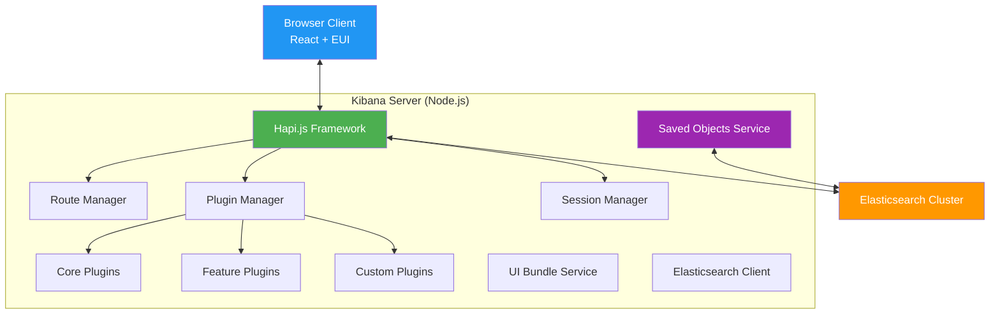
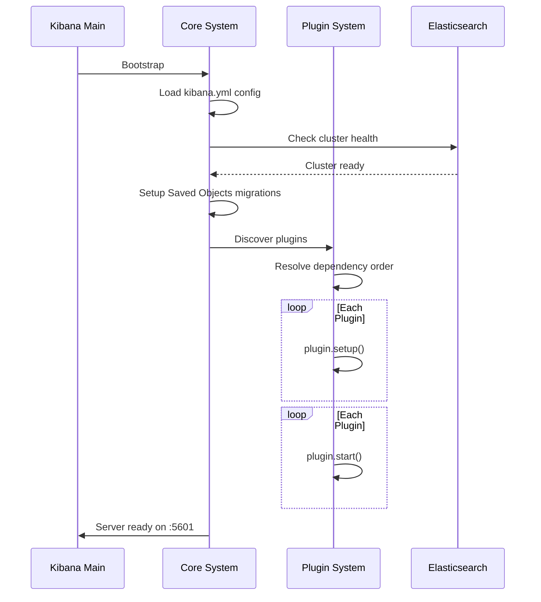
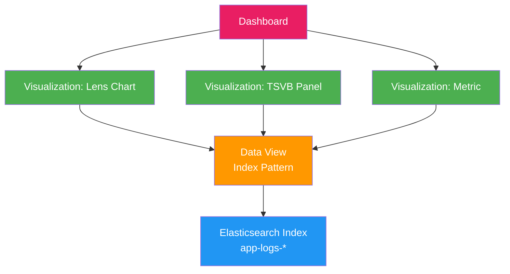
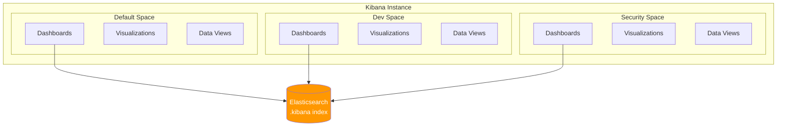

# Kibana 아키텍처와 시각화 엔진

Kibana는 Elasticsearch 데이터를 탐색하고 시각화하는 분석 플랫폼이다. 이 문서에서는 Kibana의 서버 아키텍처, Saved Objects 시스템, 시각화 엔진, 멀티테넌시, 그리고 Plugin 아키텍처를 분석한다.

## 목차
- [1. 핵심 개념 (What)](#1-핵심-개념-what)
- [2. 왜 알아야 하는가 (Why)](#2-왜-알아야-하는가-why)
- [3. 내부 구현 분석 (How)](#3-내부-구현-분석-how)
- [4. 실전 예제](#4-실전-예제)
- [5. 정리](#5-정리)

---

## 1. 핵심 개념 (What)

### Kibana의 역할

Kibana는 ELK 스택의 **시각화 및 관리 계층**으로, 단순한 대시보드 도구를 넘어서 다음 역할을 수행한다:

- **데이터 탐색**: Discover에서 로그/이벤트를 실시간 검색
- **시각화**: 다양한 차트, 맵, 테이블로 데이터를 표현
- **대시보드**: 여러 시각화를 조합한 모니터링 화면 구성
- **관리**: Elasticsearch 클러스터 상태, 인덱스, ILM 정책 관리
- **보안**: 사용자/역할 기반 접근 제어 (Elastic Security)
- **알림**: Alerting 룰 생성 및 관리

### 핵심 구성 요소



---

## 2. 왜 알아야 하는가 (Why)

### 실무 동기

- **대시보드 성능 최적화**: Kibana 시각화 엔진의 동작 원리를 이해해야 느린 대시보드를 진단하고 개선할 수 있다.
- **Saved Objects 관리**: 대시보드, 시각화, Index Pattern은 모두 Saved Objects다. 환경 간 마이그레이션, 백업, 버전 관리를 위해 내부 구조를 알아야 한다.
- **멀티테넌시 설계**: 여러 팀이 하나의 Kibana를 공유할 때 Spaces를 활용한 격리 전략이 필수적이다.
- **커스텀 플러그인**: 내장 시각화로 해결되지 않는 비즈니스 요구사항에 대응하려면 Kibana Plugin 아키텍처를 이해해야 한다.

### Kibana가 "무거운" 이유

Kibana 대시보드가 느려지는 주요 원인을 이해하면 최적화 방향이 보인다:

```
[대시보드 로드 시 발생하는 요청]
1. Saved Object 로드 (대시보드 + 패널 메타데이터)
2. 각 패널별 Elasticsearch 쿼리 (N개 패널 = N개 쿼리)
3. 시각화 렌더링 (브라우저 측 연산)
4. 시간 범위가 넓을수록 aggregation 비용 증가
```

---

## 3. 내부 구현 분석 (How)

### 3.1 서버 구조

Kibana 서버는 Node.js 위에 **Hapi.js** 프레임워크를 기반으로 구축되어 있다 (8.x부터 내부적으로 Hapi 20.x 사용).

#### 서버 부팅 시퀀스



#### 핵심 서비스

| 서비스 | 역할 |
|--------|------|
| **HttpService** | Hapi 서버 관리, 라우트 등록, CORS/CSP 설정 |
| **ElasticsearchService** | ES 클라이언트 풀 관리, 클러스터 헬스체크 |
| **SavedObjectsService** | Saved Objects CRUD, 마이그레이션, 직렬화 |
| **UiSettingsService** | 사용자별/글로벌 UI 설정 관리 |
| **PluginService** | 플러그인 발견, 의존성 해석, 생명주기 관리 |
| **SecurityService** | 인증(SAML/OIDC/LDAP), 권한, 세션 관리 |

### 3.2 Saved Objects 시스템

Saved Objects는 Kibana의 **영속 상태 저장 메커니즘**이다. 대시보드, 시각화, Index Pattern, 검색, 알림 룰 등 모든 사용자 생성 컨텐츠가 Saved Object로 관리된다.

#### 저장 구조

Saved Objects는 `.kibana` 시스템 인덱스에 JSON 문서로 저장된다.

```json
{
  "_index": ".kibana_8.12.0_001",
  "_id": "dashboard:a1b2c3d4-e5f6-7890-abcd-ef1234567890",
  "_source": {
    "type": "dashboard",
    "dashboard": {
      "title": "Application Overview",
      "description": "Main monitoring dashboard",
      "panelsJSON": "[{\"gridData\":{\"x\":0,\"y\":0,\"w\":24,\"h\":15},\"panelIndex\":\"1\",\"type\":\"lens\",\"embeddableConfig\":{}}]",
      "timeRestore": true,
      "timeTo": "now",
      "timeFrom": "now-24h",
      "version": 1
    },
    "references": [
      {
        "id": "vis-uuid-001",
        "name": "panel_1",
        "type": "lens"
      }
    ],
    "updated_at": "2024-01-15T10:30:00.000Z",
    "namespaces": ["default"]
  }
}
```

#### Saved Object 참조 체계



Saved Objects는 `references` 배열을 통해 서로를 참조한다. Dashboard는 Visualization을 참조하고, Visualization은 Data View(Index Pattern)를 참조한다. 이 참조 체계 덕분에 Export/Import 시 의존성을 자동으로 추적한다.

#### Saved Objects 마이그레이션

Kibana 버전 업그레이드 시 Saved Objects 스키마가 변경될 수 있다. 마이그레이션은 다음 과정으로 수행된다:

1. 새 인덱스 `.kibana_8.x.x_001` 생성
2. 이전 인덱스에서 문서 읽기
3. 각 문서에 등록된 마이그레이션 함수 순차 적용
4. 변환된 문서를 새 인덱스에 쓰기
5. alias `.kibana` 를 새 인덱스로 전환

### 3.3 시각화 엔진

Kibana는 3가지 주요 시각화 엔진을 제공한다.

#### Lens - 드래그 앤 드롭 시각화 (권장)

Lens는 Kibana 7.5에서 도입된 차세대 시각화 도구로, 현재 기본 시각화 엔진이다.

**내부 동작 방식**:
1. 사용자가 필드를 드래그하면 Lens는 데이터 타입을 분석하여 적합한 차트 유형을 자동 추천
2. 시각화 설정을 `expression` 언어로 변환
3. Expression은 서버 사이드에서 Elasticsearch DSL 쿼리로 변환
4. 결과를 클라이언트에서 렌더링

```
[사용자 조작]
    → Lens State (React State)
    → Expression AST
    → Elasticsearch Query DSL
    → Aggregation Results
    → Chart Rendering (Elastic Charts)
```

#### TSVB (Time Series Visual Builder)

시계열 데이터에 특화된 시각화 도구. 패널별로 독립적인 인덱스 패턴과 시간 범위를 설정할 수 있다. Lens로 마이그레이션이 권장되지만, 수학적 집계(Derivative, Serial Diff)가 필요한 경우 여전히 유용하다.

#### Vega / Vega-Lite

선언적 JSON 문법으로 완전 커스텀 시각화를 작성할 수 있다. Elasticsearch 쿼리를 직접 작성하며, D3.js 기반 렌더링으로 사실상 모든 형태의 차트가 가능하다.

### 3.4 Spaces와 멀티테넌시

Spaces는 Kibana의 **논리적 격리** 메커니즘이다. 각 Space는 독립된 Saved Objects 네임스페이스를 가진다.



**Space의 핵심 특성**:
- 각 Space는 URL 네임스페이스로 구분: `/s/{space-id}/app/...`
- Saved Objects는 `namespaces` 필드로 소속 Space를 구분
- Feature visibility: Space별로 사용 가능한 Kibana 앱(Discover, Dashboard, Maps 등)을 제한 가능
- RBAC과 연동: Elastic Security의 Role에서 Space별 권한(read/all/none) 설정

### 3.5 Kibana Plugin 아키텍처

Kibana 8.x는 **New Platform** 플러그인 아키텍처를 사용한다. 플러그인은 server와 public(브라우저) 두 영역에서 동작한다.

```
my-plugin/
├── kibana.json          # 플러그인 메타데이터
├── server/
│   ├── index.ts         # 서버 사이드 진입점
│   ├── plugin.ts        # 플러그인 클래스 (setup/start)
│   └── routes/          # API 라우트 정의
├── public/
│   ├── index.ts         # 브라우저 사이드 진입점
│   ├── plugin.ts        # 클라이언트 플러그인 클래스
│   └── components/      # React 컴포넌트
└── common/
    └── index.ts         # 공유 타입/상수
```

#### 플러그인 생명주기

```typescript
// server/plugin.ts
import { Plugin, CoreSetup, CoreStart, PluginInitializerContext } from '@kbn/core/server';

export class MyPlugin implements Plugin {
  private readonly logger;

  constructor(initializerContext: PluginInitializerContext) {
    this.logger = initializerContext.logger.get();
  }

  // 1단계: 다른 플러그인에 기능을 등록하는 단계
  public setup(core: CoreSetup) {
    this.logger.info('MyPlugin setup');

    // HTTP 라우트 등록
    const router = core.http.createRouter();
    router.get(
      { path: '/api/my_plugin/status', validate: false },
      async (context, request, response) => {
        return response.ok({ body: { status: 'healthy' } });
      }
    );

    // Saved Object 타입 등록
    core.savedObjects.registerType({
      name: 'my-custom-object',
      hidden: false,
      namespaceType: 'single',
      mappings: {
        properties: {
          title: { type: 'text' },
          config: { type: 'object', dynamic: false },
        },
      },
    });

    return {};
  }

  // 2단계: 모든 플러그인의 setup 완료 후 실행
  public start(core: CoreStart) {
    this.logger.info('MyPlugin started');
    return {};
  }

  public stop() {
    this.logger.info('MyPlugin stopped');
  }
}
```

---

## 4. 실전 예제

### 4.1 Saved Objects API를 통한 대시보드 관리

```bash
# 대시보드 Export (의존성 포함)
curl -X POST "http://localhost:5601/api/saved_objects/_export" \
  -H "kbn-xsrf: true" \
  -H "Content-Type: application/json" \
  -d '{
    "type": "dashboard",
    "objects": [
      { "type": "dashboard", "id": "a1b2c3d4-e5f6-7890-abcd-ef1234567890" }
    ],
    "includeReferencesDeep": true
  }' \
  -o dashboard-export.ndjson

# 대시보드 Import (다른 환경)
curl -X POST "http://localhost:5601/api/saved_objects/_import?overwrite=true" \
  -H "kbn-xsrf: true" \
  --form file=@dashboard-export.ndjson

# 특정 Saved Object 조회
curl -X GET "http://localhost:5601/api/saved_objects/dashboard/a1b2c3d4" \
  -H "kbn-xsrf: true"

# Saved Object 검색
curl -X GET "http://localhost:5601/api/saved_objects/_find?type=dashboard&search=Application*&per_page=20" \
  -H "kbn-xsrf: true"
```

### 4.2 Vega 커스텀 시각화

Elasticsearch 데이터를 Vega-Lite로 시각화하는 예제. 시간대별 HTTP 상태 코드 분포를 히트맵으로 표현한다.

```json
{
  "$schema": "https://vega.github.io/schema/vega-lite/v5.json",
  "title": "HTTP Status Code Heatmap",
  "data": {
    "url": {
      "%context%": true,
      "%timefield%": "@timestamp",
      "index": "nginx-access-*",
      "body": {
        "aggs": {
          "time_buckets": {
            "date_histogram": {
              "field": "@timestamp",
              "fixed_interval": "1h"
            },
            "aggs": {
              "status_codes": {
                "terms": {
                  "field": "response_code",
                  "size": 10
                }
              }
            }
          }
        },
        "size": 0
      }
    },
    "format": {
      "property": "aggregations.time_buckets.buckets"
    }
  },
  "transform": [
    { "flatten": ["status_codes.buckets"], "as": ["status_bucket"] },
    {
      "calculate": "datum.status_bucket.key",
      "as": "status_code"
    },
    {
      "calculate": "datum.status_bucket.doc_count",
      "as": "count"
    },
    {
      "calculate": "toDate(datum.key)",
      "as": "timestamp"
    }
  ],
  "mark": "rect",
  "encoding": {
    "x": {
      "field": "timestamp",
      "type": "temporal",
      "axis": { "title": "Time", "format": "%H:%M" }
    },
    "y": {
      "field": "status_code",
      "type": "ordinal",
      "axis": { "title": "Status Code" }
    },
    "color": {
      "field": "count",
      "type": "quantitative",
      "scale": { "scheme": "reds" },
      "legend": { "title": "Request Count" }
    }
  }
}
```

### 4.3 Spaces 관리 API

```bash
# Space 생성
curl -X POST "http://localhost:5601/api/spaces/space" \
  -H "kbn-xsrf: true" \
  -H "Content-Type: application/json" \
  -d '{
    "id": "team-backend",
    "name": "Backend Team",
    "description": "Backend 팀 전용 워크스페이스",
    "color": "#5C6BC0",
    "initials": "BE",
    "disabledFeatures": ["canvas", "maps", "graph"]
  }'

# Space 목록 조회
curl -X GET "http://localhost:5601/api/spaces/space" \
  -H "kbn-xsrf: true"

# Space 간 Saved Object 복사
curl -X POST "http://localhost:5601/api/spaces/_copy_saved_objects" \
  -H "kbn-xsrf: true" \
  -H "Content-Type: application/json" \
  -d '{
    "spaces": ["team-backend", "team-frontend"],
    "objects": [
      { "type": "dashboard", "id": "shared-dashboard-id" }
    ],
    "includeReferences": true,
    "overwrite": true
  }'
```

### 4.4 kibana.yml 프로덕션 설정

```yaml
# 서버 설정
server.host: "0.0.0.0"
server.port: 5601
server.name: "kibana-prod-01"
server.publicBaseUrl: "https://kibana.example.com"
server.maxPayload: 1048576

# Elasticsearch 연결
elasticsearch.hosts: ["https://es-node1:9200", "https://es-node2:9200"]
elasticsearch.username: "kibana_system"
elasticsearch.password: "${KIBANA_ES_PASSWORD}"
elasticsearch.ssl.certificateAuthorities: ["/etc/kibana/certs/ca.crt"]
elasticsearch.requestTimeout: 30000

# 보안 설정
server.ssl.enabled: true
server.ssl.certificate: "/etc/kibana/certs/kibana.crt"
server.ssl.key: "/etc/kibana/certs/kibana.key"
xpack.security.encryptionKey: "${KIBANA_ENCRYPTION_KEY}"
xpack.encryptedSavedObjects.encryptionKey: "${KIBANA_SO_ENCRYPTION_KEY}"

# 성능 튜닝
elasticsearch.shardTimeout: 30000
elasticsearch.requestHeadersWhitelist: ["authorization", "securitytenant"]
server.maxPayload: 2097152

# 로깅
logging.root.level: warn
logging.appenders.file:
  type: file
  fileName: /var/log/kibana/kibana.log
  layout:
    type: json

# Spaces 기본 설정
xpack.spaces.maxSpaces: 100
```

---

## 5. 정리

| 항목 | 핵심 내용 |
|------|----------|
| **서버 기반** | Node.js + Hapi.js, 단일 프로세스 아키텍처 |
| **Saved Objects** | `.kibana` 인덱스에 JSON 문서로 저장, 참조 기반 의존성 관리 |
| **시각화 엔진** | Lens(권장/자동추천), TSVB(시계열 특화), Vega(완전 커스텀) |
| **Spaces** | 논리적 멀티테넌시, URL 네임스페이스 + RBAC 연동 |
| **Plugin 아키텍처** | New Platform, server/public 이중 구조, setup/start 생명주기 |
| **마이그레이션** | 버전 업그레이드 시 Saved Objects 자동 스키마 마이그레이션 |
| **대시보드 최적화** | 패널 수 최소화, 시간 범위 축소, Data View 최적화 |
| **관리 API** | Saved Objects API, Spaces API로 자동화 가능 |

---
*참고: Elasticsearch 8.x / Logstash 8.x / Kibana 8.x 기준*
