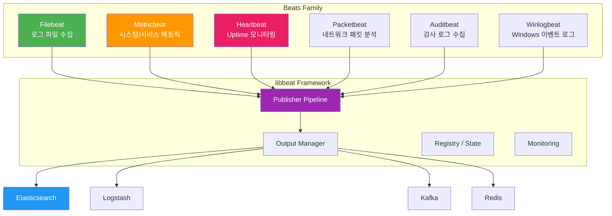
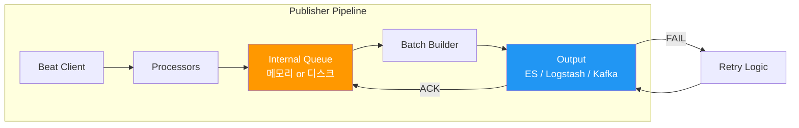
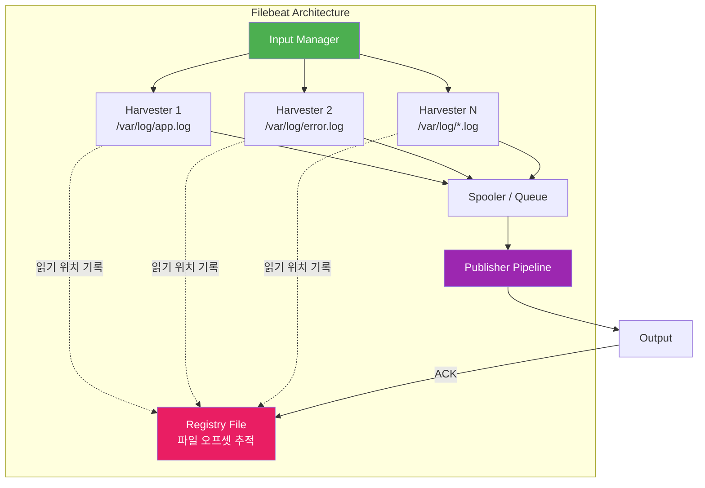
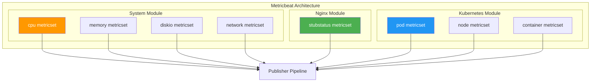
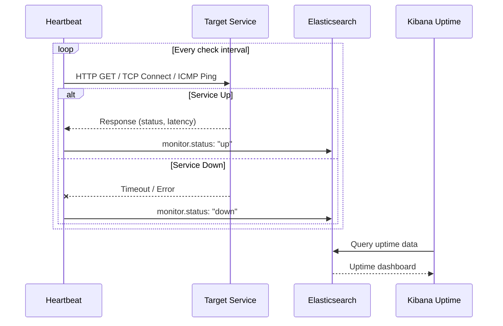
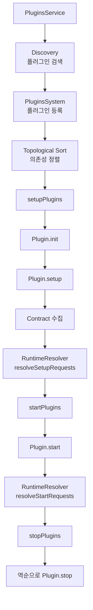

# Beats 에코시스템

Beats는 Elastic에서 제공하는 경량 데이터 수집기(Data Shipper) 제품군이다. 이 문서에서는 Beats의 공통 프레임워크인 libbeat, 주요 Beat 제품(Filebeat, Metricbeat, Heartbeat)의 내부 구조, 그리고 데이터 보장 메커니즘을 분석한다.

## 목차
- [1. 핵심 개념 (What)](#1-핵심-개념-what)
- [2. 왜 알아야 하는가 (Why)](#2-왜-알아야-하는가-why)
- [3. 내부 구현 분석 (How)](#3-내부-구현-분석-how)
- [4. 실전 예제](#4-실전-예제)
- [5. 정리](#5-정리)

---

## 1. 핵심 개념 (What)

### Beats란 무엇인가

Beats는 서버에 에이전트로 설치되어 데이터를 수집하고 Elasticsearch 또는 Logstash로 전송하는 **경량 단일 목적 데이터 수집기**다. Go 언어로 작성되어 리소스 사용량이 극히 낮다.

### Beats 제품군



| Beat | 수집 대상 | 주요 사용 사례 |
|------|----------|--------------|
| **Filebeat** | 로그 파일, stdin, 컨테이너 로그 | 애플리케이션/시스템 로그 수집 |
| **Metricbeat** | CPU, 메모리, 디스크, 네트워크, 서비스 메트릭 | 인프라 모니터링 |
| **Heartbeat** | HTTP/TCP/ICMP 엔드포인트 | Uptime/Availability 모니터링 |
| **Packetbeat** | 네트워크 패킷 (HTTP, MySQL, DNS 등) | 네트워크 분석, APM |
| **Auditbeat** | 파일 무결성, 시스템 콜 | 보안 감사 |
| **Winlogbeat** | Windows Event Log | Windows 서버 모니터링 |

### libbeat - 공통 프레임워크

모든 Beat는 `libbeat` 프레임워크를 기반으로 만들어진다. libbeat가 제공하는 공통 기능:

- **Publisher Pipeline**: 이벤트 큐잉, 배치 처리, 재시도
- **Output**: Elasticsearch, Logstash, Kafka, Redis 등
- **Processor**: 이벤트 필터링/변환 (add_fields, drop_event, decode_json 등)
- **Monitoring**: 내부 메트릭 수집 및 보고
- **Configuration**: YAML 설정, 자동 reloading
- **Keystore**: 민감 정보 암호화 저장

---

## 2. 왜 알아야 하는가 (Why)

### Beats vs Logstash - 언제 무엇을 쓰는가

```
[수집 노드에서]
Beats (경량)          Logstash (중량)
- 메모리: ~30MB       - 메모리: ~500MB+
- CPU: 최소           - CPU: JVM 기반
- 변환: 기본 프로세서   - 변환: 200+ 플러그인
- 배포: 단일 바이너리   - 배포: JVM + 플러그인
```

**결론**: 수집 노드에는 Beats, 중앙 집중 변환에는 Logstash. 이것이 `Beats → Logstash → Elasticsearch` 표준 아키텍처의 근거다.

### 실무 동기

- **로그 유실 방지**: Filebeat의 Registry 메커니즘과 at-least-once 보장을 이해해야 운영 환경에서 데이터 유실을 방지할 수 있다.
- **리소스 효율성**: 수백 대의 서버에 Logstash를 설치하면 리소스 낭비가 심각하다. Beats는 에이전트 레벨에서 최소한의 리소스로 데이터를 수집한다.
- **Backpressure 대응**: 다운스트림(ES/Logstash)이 느려질 때 Beats의 동작을 이해해야 파이프라인 장애를 예방할 수 있다.
- **컨테이너 환경**: Kubernetes에서 DaemonSet으로 Filebeat/Metricbeat를 배포하는 것이 표준 패턴이다.

---

## 3. 내부 구현 분석 (How)

### 3.1 libbeat Publisher Pipeline

Publisher Pipeline은 모든 Beat의 이벤트 처리 핵심이다.



#### Internal Queue

```yaml
# 메모리 큐 (기본값)
queue.mem:
  events: 3200          # 큐 크기
  flush.min_events: 1600 # 최소 배치 크기
  flush.timeout: 10s     # 최대 대기 시간

# 디스크 큐 (내구성 향상)
queue.disk:
  max_size: 10GB
  segment_size: 100MB
  read_ahead: 512
  write_ahead: 2048
```

메모리 큐는 빠르지만 프로세스 재시작 시 데이터가 유실된다. 디스크 큐(8.x에서 추가)는 내구성을 제공하지만 I/O 오버헤드가 있다.

### 3.2 Filebeat 내부 구조

Filebeat는 가장 널리 사용되는 Beat로, 로그 파일 수집에 특화되어 있다.



#### Harvester

Harvester는 **하나의 파일을 담당하는 고루틴(goroutine)**이다. 각 Harvester는:

1. 파일을 열고 지정된 오프셋부터 읽기 시작
2. 새 라인이 추가될 때까지 대기 (tail -f 방식)
3. 읽은 이벤트를 Publisher Pipeline으로 전달
4. 파일이 삭제/회전되면 정리 후 종료

```go
// Harvester 핵심 루프 (개념적)
func (h *Harvester) Run() {
    reader := h.newLogFileReader(h.state.Offset)
    for {
        message, err := reader.Next()
        if err == io.EOF {
            time.Sleep(h.config.BackoffDuration)
            continue
        }
        h.forwardEvent(message)
        h.state.Offset = reader.Offset()
    }
}
```

#### Registry (레지스트리)

Registry는 Filebeat의 **체크포인팅 메커니즘**이다. `data/registry/filebeat/` 디렉토리에 저장되며, 각 파일의 inode, device, 읽기 오프셋을 추적한다.

```json
[
  {
    "source": "/var/log/app.log",
    "offset": 1048576,
    "inode": 12345678,
    "device": 64768,
    "timestamp": "2024-01-15T10:30:00Z",
    "ttl": -1,
    "type": "log"
  }
]
```

**At-least-once 보장 흐름**:

```
1. Harvester가 라인 읽기
2. Publisher Pipeline으로 전달
3. Output이 ES/Logstash에 전송
4. ES/Logstash에서 ACK 수신
5. ACK 받은 후에만 Registry 오프셋 갱신
```

이 흐름 덕분에 Filebeat가 중간에 재시작되더라도 ACK되지 않은 이벤트를 다시 읽는다. 대신 중복 이벤트가 발생할 수 있다 (at-least-once).

### 3.3 Metricbeat 내부 구조

Metricbeat는 **Module/Metricset** 2계층 구조로 메트릭을 수집한다.



#### Module과 Metricset

- **Module**: 모니터링 대상 서비스 단위 (system, nginx, mysql, kubernetes...)
- **Metricset**: Module 내의 개별 메트릭 수집 단위 (cpu, memory, stubstatus...)

각 Metricset은 독립적인 수집 주기(`period`)를 가진다.

```go
// Metricset 인터페이스 (개념적)
type MetricSet interface {
    Fetch(report mb.ReporterV2) error
}

// System CPU Metricset 구현
func (m *MetricSet) Fetch(report mb.ReporterV2) error {
    cpuTimes, err := cpu.Times(true)
    if err != nil {
        return err
    }
    for _, ct := range cpuTimes {
        report.Event(mb.Event{
            MetricSetFields: mapstr.M{
                "user.pct":   ct.User,
                "system.pct": ct.System,
                "idle.pct":   ct.Idle,
                "iowait.pct": ct.Iowait,
            },
        })
    }
    return nil
}
```

### 3.4 Heartbeat - Uptime 모니터링

Heartbeat는 외부에서 서비스 가용성을 확인하는 **능동적 모니터링** Beat다.

지원 프로토콜:
- **HTTP/HTTPS**: 상태 코드, 응답 시간, TLS 인증서 만료 확인
- **TCP**: 포트 연결 가능 여부, 응답 패턴 검증
- **ICMP**: Ping 기반 호스트 가용성



### 3.5 Backpressure 처리

다운스트림(Elasticsearch, Logstash)이 느려지거나 장애가 발생하면, Beats는 계층적 backpressure 메커니즘을 작동시킨다.

```
[Backpressure Chain]

Output 전송 실패/느림
    → Internal Queue가 차기 시작
    → Queue가 가득 참 (queue.mem.events)
    → Harvester/Metricset이 블록됨 (이벤트 전달 불가)
    → 파일 읽기/메트릭 수집이 일시 중단
    
Output 복구 시
    → Queue에서 배치 전송 재개
    → Queue에 빈 공간 확보
    → Harvester/Metricset 재개
    → Registry 오프셋 갱신
```

이 체인 덕분에:
- 메모리가 무한히 증가하지 않음
- Filebeat: 파일 오프셋이 ACK 전까지 갱신되지 않아 데이터 유실 방지
- Metricbeat: 수집 간격이 밀려날 수 있지만 OOM은 방지

---

## 4. 실전 예제

### 4.1 Filebeat - 멀티 애플리케이션 로그 수집

```yaml
# filebeat.yml
filebeat.inputs:
  # Spring Boot 애플리케이션 로그
  - type: filestream
    id: spring-app-logs
    paths:
      - /var/log/spring-app/*.log
    parsers:
      - multiline:
          type: pattern
          pattern: '^\d{4}-\d{2}-\d{2}'
          negate: true
          match: after
    fields:
      app: spring-app
      env: production
    fields_under_root: true

  # Nginx 액세스 로그
  - type: filestream
    id: nginx-access
    paths:
      - /var/log/nginx/access.log
    fields:
      app: nginx
      log_type: access
    fields_under_root: true

  # JSON 형식 로그 (직접 파싱)
  - type: filestream
    id: json-app-logs
    paths:
      - /var/log/json-app/*.log
    parsers:
      - ndjson:
          target: ""
          add_error_key: true
          message_key: msg

# 프로세서 (경량 변환)
processors:
  - add_host_metadata:
      when.not.contains.tags: forwarded
  - add_cloud_metadata: ~
  - add_docker_metadata: ~
  - drop_event:
      when:
        regexp:
          message: "^\\s*$"  # 빈 줄 제거
  - dissect:
      tokenizer: '%{log.level} [%{trace.id}]'
      field: "message"
      target_prefix: ""
      when:
        has_fields: ["trace.id"]

# Output 설정
output.elasticsearch:
  hosts: ["https://es-node1:9200", "https://es-node2:9200"]
  protocol: "https"
  username: "${ES_USERNAME}"
  password: "${ES_PASSWORD}"
  ssl.certificate_authorities: ["/etc/filebeat/certs/ca.crt"]
  indices:
    - index: "spring-logs-%{+yyyy.MM.dd}"
      when.equals:
        app: "spring-app"
    - index: "nginx-logs-%{+yyyy.MM.dd}"
      when.equals:
        app: "nginx"
    - index: "app-logs-%{+yyyy.MM.dd}"

# 큐 및 성능 설정
queue.mem:
  events: 3200
  flush.min_events: 1600
  flush.timeout: 10s

# 모니터링
monitoring.enabled: true
monitoring.elasticsearch:
  hosts: ["https://es-monitoring:9200"]
```

### 4.2 Metricbeat - 인프라 + 서비스 모니터링

```yaml
# metricbeat.yml
metricbeat.modules:
  # 시스템 메트릭
  - module: system
    period: 10s
    metricsets:
      - cpu
      - load
      - memory
      - network
      - process
      - socket_summary
    process.include_top_n:
      by_cpu: 10
      by_memory: 10
    cpu.metrics: ["percentages", "normalized_percentages"]

  # 시스템 디스크 (30초 간격 - 변화가 느림)
  - module: system
    period: 30s
    metricsets:
      - filesystem
      - fsstat
    processors:
      - drop_event.when.regexp:
          system.filesystem.mount_point: '^/(sys|proc|dev|host)'

  # Nginx 모니터링
  - module: nginx
    period: 10s
    metricsets:
      - stubstatus
    hosts: ["http://localhost:8080"]
    server_status_path: "nginx_status"

  # Redis 모니터링
  - module: redis
    period: 10s
    metricsets:
      - info
      - keyspace
    hosts: ["redis://localhost:6379"]
    password: "${REDIS_PASSWORD}"

  # Docker 컨테이너 모니터링
  - module: docker
    period: 10s
    metricsets:
      - container
      - cpu
      - diskio
      - memory
      - network
    hosts: ["unix:///var/run/docker.sock"]

# 공통 프로세서
processors:
  - add_host_metadata:
      netinfo.enabled: true
  - add_cloud_metadata: ~

# Output
output.elasticsearch:
  hosts: ["https://es-node1:9200"]
  username: "${ES_USERNAME}"
  password: "${ES_PASSWORD}"
  ssl.certificate_authorities: ["/etc/metricbeat/certs/ca.crt"]

# Setup (최초 1회)
setup.template.settings:
  index.number_of_shards: 1
  index.codec: best_compression
setup.dashboards.enabled: true
setup.kibana:
  host: "https://kibana:5601"
```

### 4.3 Heartbeat - 서비스 가용성 모니터링

```yaml
# heartbeat.yml
heartbeat.monitors:
  # Production API 헬스체크
  - type: http
    id: prod-api-health
    name: "Production API"
    schedule: "@every 30s"
    urls:
      - "https://api.example.com/health"
    check.response:
      status: [200]
      body:
        - '{"status":"UP"}'
    ssl:
      certificate_authorities: ["/etc/heartbeat/certs/ca.crt"]
    timeout: 10s
    tags: ["prod", "api", "critical"]

  # Database 연결 확인
  - type: tcp
    id: prod-db-check
    name: "Production Database"
    schedule: "@every 60s"
    hosts: ["db-primary.internal:5432"]
    timeout: 5s
    tags: ["prod", "database", "critical"]

  # 내부 서비스 Ping
  - type: icmp
    id: internal-hosts
    name: "Internal Hosts"
    schedule: "@every 60s"
    hosts:
      - "10.0.1.10"
      - "10.0.1.11"
      - "10.0.1.12"
    timeout: 3s
    tags: ["internal", "infra"]

  # TLS 인증서 만료 모니터링
  - type: http
    id: tls-cert-check
    name: "TLS Certificate Expiry"
    schedule: "@every 12h"
    urls:
      - "https://www.example.com"
      - "https://api.example.com"
      - "https://admin.example.com"
    check.response:
      status: [200, 301, 302]
    ssl:
      certificate_authorities: ["/etc/heartbeat/certs/ca.crt"]
    tags: ["tls", "certificate"]

# Output
output.elasticsearch:
  hosts: ["https://es-node1:9200"]
  username: "${ES_USERNAME}"
  password: "${ES_PASSWORD}"
```

### 4.4 Kubernetes DaemonSet 배포

```yaml
# filebeat-kubernetes.yml
apiVersion: apps/v1
kind: DaemonSet
metadata:
  name: filebeat
  namespace: elastic
  labels:
    app: filebeat
spec:
  selector:
    matchLabels:
      app: filebeat
  template:
    metadata:
      labels:
        app: filebeat
    spec:
      serviceAccountName: filebeat
      terminationGracePeriodSeconds: 30
      containers:
        - name: filebeat
          image: docker.elastic.co/beats/filebeat:8.12.0
          args: ["-c", "/etc/filebeat.yml", "-e"]
          env:
            - name: NODE_NAME
              valueFrom:
                fieldRef:
                  fieldPath: spec.nodeName
            - name: ES_USERNAME
              valueFrom:
                secretKeyRef:
                  name: elastic-credentials
                  key: username
            - name: ES_PASSWORD
              valueFrom:
                secretKeyRef:
                  name: elastic-credentials
                  key: password
          resources:
            limits:
              memory: 200Mi
              cpu: 200m
            requests:
              memory: 100Mi
              cpu: 100m
          volumeMounts:
            - name: config
              mountPath: /etc/filebeat.yml
              readOnly: true
              subPath: filebeat.yml
            - name: data
              mountPath: /usr/share/filebeat/data
            - name: varlog
              mountPath: /var/log
              readOnly: true
            - name: containerlog
              mountPath: /var/lib/docker/containers
              readOnly: true
      volumes:
        - name: config
          configMap:
            name: filebeat-config
        - name: data
          hostPath:
            path: /var/lib/filebeat-data
            type: DirectoryOrCreate
        - name: varlog
          hostPath:
            path: /var/log
        - name: containerlog
          hostPath:
            path: /var/lib/docker/containers
```

---

## 보충: Kibana 플러그인 시스템

Kibana의 플러그인 시스템은 Core Platform 위에서 동작하며, Plugin Lifecycle(setup/start/stop)과 Contract 패턴을 통해 플러그인 간 느슨한 결합을 실현한다. 위상 정렬(topological sort)로 의존성 순서를 보장하고, 런타임 Contract Resolver로 동적 의존성도 지원한다.

### Plugin Lifecycle

모든 Kibana 플러그인은 세 가지 Lifecycle 메서드를 구현한다.

| 메서드 | 시점 | 역할 |
|--------|------|------|
| `setup(core, plugins)` | 서버 초기화 | 라우트 등록, SavedObject 타입 등록, 타 플러그인 Contract 소비 |
| `start(core, plugins)` | ES 연결 완료 후 | 서비스 시작, ES 클라이언트 사용, SavedObjects CRUD |
| `stop()` | 서버 종료 시 | 리소스 정리, 타이머 해제 |

### Contract 패턴

각 플러그인은 `setup`과 `start`에서 Contract 객체를 반환한다. 이 Contract는 다른 플러그인이 의존성으로 소비할 수 있는 Public API이다.

```typescript
export interface Plugin<TSetup, TStart, TPluginsSetup, TPluginsStart> {
  setup(core: CoreSetup<TPluginsStart, TStart>, plugins: TPluginsSetup): TSetup;
  start(core: CoreStart, plugins: TPluginsStart): TStart;
  stop?(): MaybePromise<void>;
}
```

### Plugin Manifest (kibana.jsonc)

주요 매니페스트 필드:
- `id`: 플러그인 식별자 (camelCase)
- `type`: `standard` 또는 `preboot`
- `requiredPlugins`: 필수 의존 플러그인 목록
- `optionalPlugins`: 선택적 의존 플러그인 목록
- `runtimePluginDependencies`: 런타임에 동적으로 해결되는 의존성
- `server`: 서버사이드 코드 포함 여부
- `ui`: 클라이언트사이드 코드 포함 여부

### 주요 내장 플러그인

| 플러그인 | 역할 |
|----------|------|
| **data** | 검색, 쿼리, 필터, 인덱스 패턴 서비스 |
| **discover** | 문서 탐색 UI |
| **dashboard** | 대시보드 생성/관리 |
| **visualizations** | 차트/시각화 프레임워크 |
| **lens** | 드래그앤드롭 시각화 도구 |
| **maps** | 지도 기반 시각화 |
| **alerting** | 알림 규칙 및 액션 |
| **security** | RBAC, 인증/인가 |

### PluginsSystem - 위상 정렬과 Lifecycle 관리



위상 정렬된 순서로 plugin setup을 실행하며, 비동기 setup은 10초 타임아웃이 적용된다. Stop은 setup의 역순으로 실행되며 15초 타임아웃이 적용된다.

### Kahn's Algorithm 기반 위상 정렬

의존성이 없는 노드부터 시작하여 순차적으로 정렬하며, 그래프에 남은 노드가 있으면 순환 의존성으로 감지한다.

### 플러그인 구현 - Contract 패턴 활용

```typescript
// Setup Contract: 다른 플러그인에게 제공하는 API
interface MyPluginSetup {
  registerCustomProcessor: (name: string, handler: Function) => void;
}

export class MyPlugin implements Plugin<MyPluginSetup, MyPluginStart, PluginsSetup> {
  private readonly processors = new Map<string, Function>();

  setup(core: CoreSetup, plugins: PluginsSetup): MyPluginSetup {
    // data 플러그인의 검색 기능 활용
    plugins.data.search.registerSearchStrategy('myStrategy', {
      search: async (request, options, deps) => { /* ... */ },
    });

    // HTTP 라우트 등록
    const router = core.http.createRouter();
    router.post(
      { path: '/api/my_plugin/process', validate: { body: schema.any() } },
      async (context, request, response) => {
        return response.ok({ body: { processed: true } });
      }
    );

    // Setup Contract 반환 - 다른 플러그인이 사용 가능
    return {
      registerCustomProcessor: (name, handler) => {
        this.processors.set(name, handler);
      },
    };
  }

  start(core: CoreStart): MyPluginStart {
    return { getProcessors: () => this.processors };
  }

  stop() { this.processors.clear(); }
}
```

## 5. 정리

| 항목 | 핵심 내용 |
|------|----------|
| **libbeat** | 모든 Beat의 공통 프레임워크 (Publisher Pipeline, Output, Processor) |
| **Filebeat** | 로그 파일 수집, Harvester + Registry 구조, at-least-once 보장 |
| **Registry** | 파일 inode/오프셋 추적, ACK 후에만 갱신하여 유실 방지 |
| **Metricbeat** | Module/Metricset 2계층, 서비스별 독립 수집 주기 |
| **Heartbeat** | HTTP/TCP/ICMP 능동 모니터링, TLS 인증서 만료 감시 |
| **Backpressure** | Queue → Harvester/Metricset 역방향 블로킹 체인 |
| **Internal Queue** | 메모리 큐(기본, 빠름) vs 디스크 큐(8.x, 내구성) |
| **Kubernetes** | DaemonSet 배포, hostPath로 노드 로그 접근 |
| **리소스** | ~30MB 메모리, Logstash 대비 1/15 수준 |
| **Kibana Plugin Lifecycle** | `init()` → `setup()` → `start()` → `stop()`, 위상 정렬로 의존성 순서 보장 |
| **Contract 패턴** | setup/start 반환값이 다른 플러그인의 의존성으로 주입됨 |
| **PluginsSystem** | Kahn's Algorithm 기반 위상 정렬, 비동기 setup 10초/stop 15초 타임아웃 |

---
*참고: Elasticsearch 8.x / Logstash 8.x / Kibana 8.x 기준*
