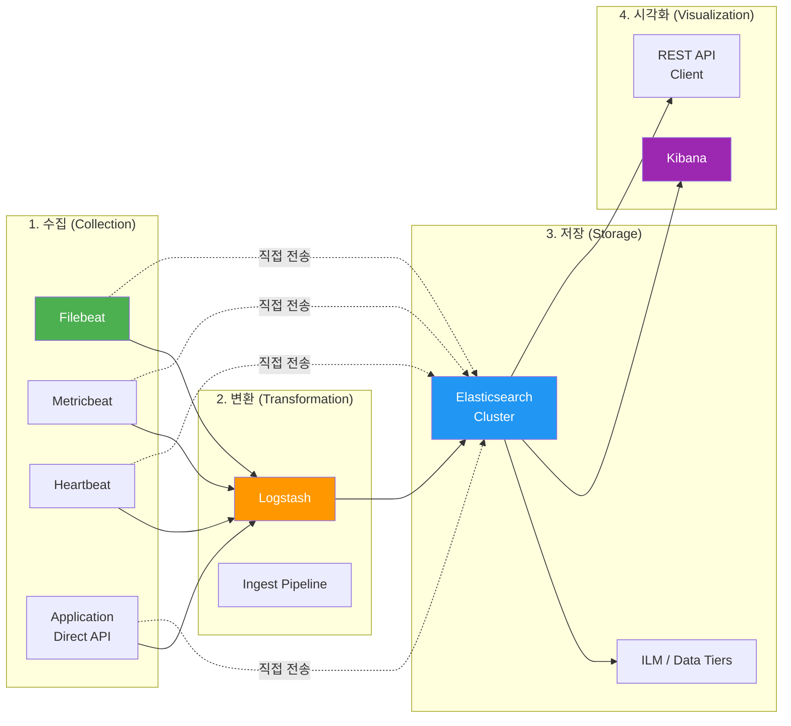
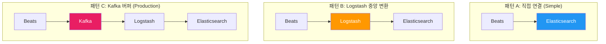
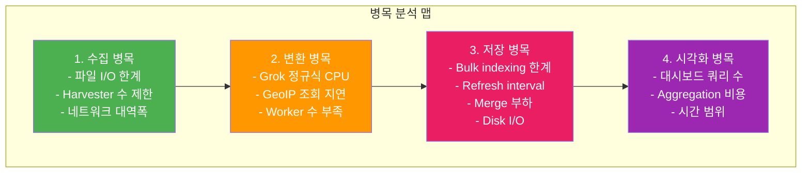
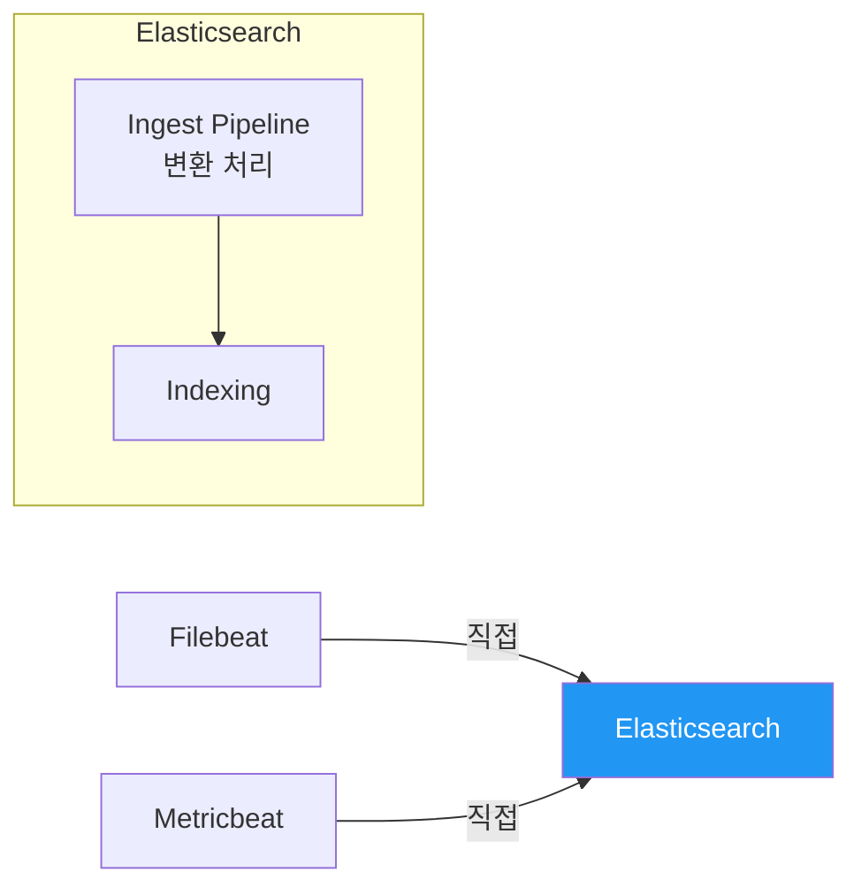
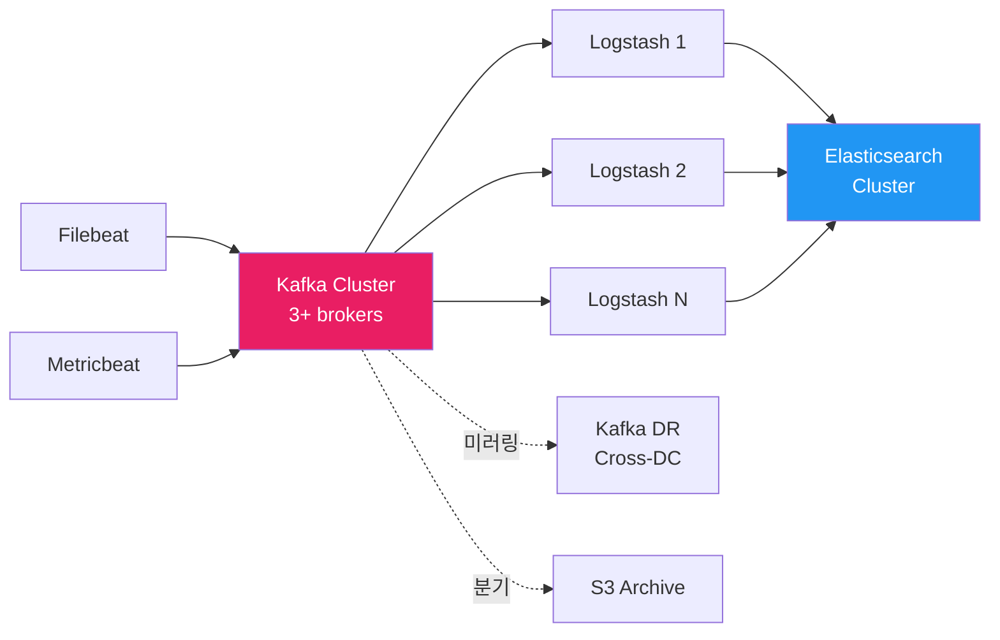
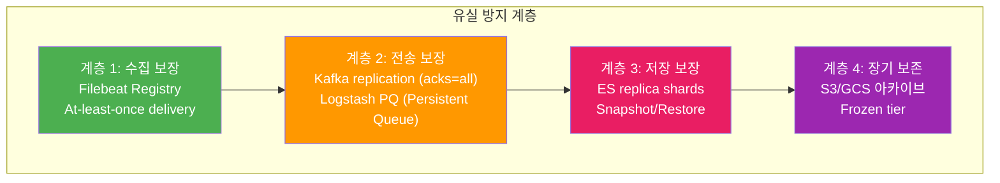
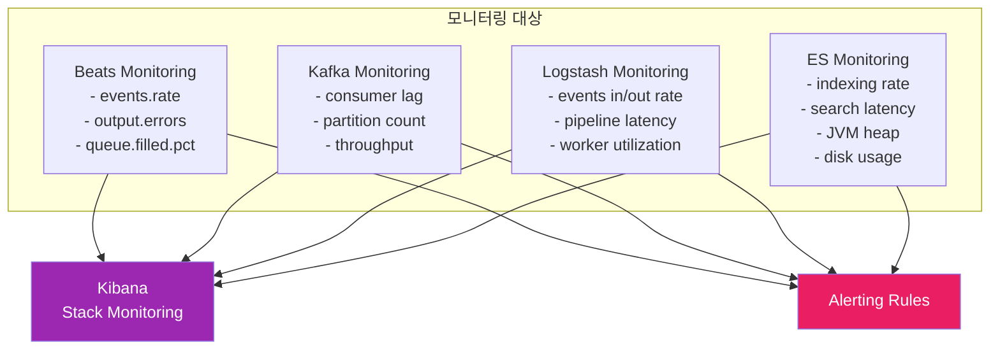

# ELK 전체 데이터 파이프라인

ELK 스택의 진정한 가치는 개별 컴포넌트가 아니라 전체 데이터 파이프라인의 설계에 있다. 이 문서에서는 수집부터 시각화까지의 End-to-End 흐름, 각 단계별 병목 포인트, 아키텍처 패턴, 데이터 유실 방지 전략, 그리고 파이프라인 모니터링 방법을 다룬다.

## 목차
- [1. 핵심 개념 (What)](#1-핵심-개념-what)
- [2. 왜 알아야 하는가 (Why)](#2-왜-알아야-하는가-why)
- [3. 내부 구현 분석 (How)](#3-내부-구현-분석-how)
- [4. 실전 예제](#4-실전-예제)
- [5. 정리](#5-정리)

---

## 1. 핵심 개념 (What)

### End-to-End 데이터 흐름

ELK 데이터 파이프라인은 4단계로 구성된다: **수집(Collection) → 변환(Transformation) → 저장(Storage) → 시각화(Visualization)**.



### 각 단계의 책임

| 단계 | 컴포넌트 | 핵심 책임 |
|------|---------|----------|
| **수집** | Beats, Application SDK | 원본 데이터를 안전하게 읽고 전달 |
| **변환** | Logstash, Ingest Pipeline | 파싱, 강화(enrichment), 필터링, 정규화 |
| **저장** | Elasticsearch | 인덱싱, 검색, 집계, 생명주기 관리 |
| **시각화** | Kibana | 탐색, 대시보드, 알림, 리포팅 |

### 파이프라인 아키텍처 패턴

실무에서 사용되는 3가지 대표 아키텍처 패턴이 있다.



| 패턴 | 처리량 | 내구성 | 복잡도 | 적합한 환경 |
|------|-------|--------|--------|-----------|
| **A. 직접 연결** | 낮음 | 보통 | 낮음 | 소규모, PoC, 변환 불필요 시 |
| **B. Logstash 중앙** | 중간 | 보통 | 중간 | 중규모, 복잡한 변환 필요 시 |
| **C. Kafka 버퍼** | 높음 | 높음 | 높음 | 대규모, 고가용성, 다중 소비자 |

---

## 2. 왜 알아야 하는가 (Why)

### 파이프라인 설계가 곧 운영 품질이다

- **데이터 유실**: 파이프라인 중간에 컴포넌트가 장애를 겪으면 로그가 영구 손실될 수 있다. 설계 단계에서 버퍼링과 재시도 전략을 포함해야 한다.
- **병목 전파**: 한 단계의 병목이 전체 파이프라인을 멈추게 할 수 있다. 각 단계의 처리 용량과 backpressure 동작을 이해해야 한다.
- **비용 최적화**: Elasticsearch 노드 비용이 전체의 70~80%를 차지한다. 파이프라인에서 불필요한 데이터를 사전 필터링하면 저장 비용을 대폭 절감할 수 있다.
- **확장성**: 트래픽이 10배 증가했을 때 어떤 컴포넌트를 스케일아웃할지, 어디에 버퍼를 추가할지 결정하려면 전체 흐름을 이해해야 한다.

### 실패 비용

```
[파이프라인 장애의 실제 영향]

Beats 장애     → 해당 호스트 로그만 유실 (격리됨)
Logstash 장애  → 전체 변환 중단, Beats Queue 포화
Kafka 장애     → 버퍼 소실 (replication으로 방어)
ES 장애        → 인덱싱 중단 + Kibana 검색 불가
Kibana 장애    → 시각화만 불가 (데이터는 안전)
```

장애 영향 범위가 넓은 컴포넌트(Logstash, ES)일수록 고가용성 설계가 중요하다.

---

## 3. 내부 구현 분석 (How)

### 3.1 단계별 병목 포인트 분석



#### 수집 단계 병목

| 병목 원인 | 증상 | 해결 방안 |
|----------|------|----------|
| Harvester 수 초과 | 파일 핸들 부족, 메모리 증가 | `close_inactive`, `clean_inactive` 튜닝 |
| 네트워크 대역폭 | Output 큐 포화 | compression 활성화, 배치 크기 조정 |
| 디스크 I/O | Harvester 읽기 지연 | SSD 사용, 로그 로테이션 최적화 |

#### 변환 단계 병목

| 병목 원인 | 증상 | 해결 방안 |
|----------|------|----------|
| Grok CPU 과부하 | Worker 100% CPU | dissect 전환, anchored 패턴 사용 |
| Worker 수 부족 | 이벤트 큐 포화 | `pipeline.workers` 증가 (기본: CPU 코어 수) |
| External lookup | 필터 지연 | translate 플러그인 로컬 캐시, 비동기 조회 |

#### 저장 단계 병목

| 병목 원인 | 증상 | 해결 방안 |
|----------|------|----------|
| Bulk rejection | `429 Too Many Requests` | Bulk queue size 증가, 노드 추가 |
| Refresh 부하 | 인덱싱 속도 저하 | `refresh_interval: 30s` (기본 1s) |
| Merge 병목 | 디스크 I/O 포화 | SSD 필수, `max_merge_count` 조정 |
| Shard 수 과다 | 힙 메모리 부족 | 인덱스당 적절한 shard 수 설계 |

#### 시각화 단계 병목

| 병목 원인 | 증상 | 해결 방안 |
|----------|------|----------|
| 대시보드 패널 과다 | 동시 쿼리 폭발 | 패널 수 최소화, 탭으로 분리 |
| 넓은 시간 범위 | Aggregation 타임아웃 | 기본 시간 범위 축소, downsampling |
| 비효율 쿼리 | ES slow log 빈발 | Data View 필드 제한, 쿼리 최적화 |

### 3.2 직접 연결 vs Kafka 버퍼 아키텍처

#### 패턴 A: 직접 연결



**장점**: 구조 단순, 운영 비용 낮음, Logstash 불필요
**단점**: ES가 변환+저장 모두 담당하여 부하 집중, 복잡한 변환 어려움, ES 장애 시 Beats Queue만으로 버퍼링

**적합 사례**: 일일 10GB 이하, 변환이 단순한 환경

#### 패턴 C: Kafka 버퍼



**장점**:
- **디커플링**: 수집과 변환이 완전 분리, 독립적 확장
- **버퍼링**: Kafka의 디스크 기반 보존으로 수일~수주 분량 버퍼 가능
- **다중 소비자**: 같은 데이터를 ES, S3, 분석 시스템으로 동시 전달
- **재처리**: Consumer offset 되감기로 과거 데이터 재변환 가능
- **Backpressure 흡수**: ES 장애 시에도 Kafka에서 데이터 보존

**단점**: 운영 복잡도 증가 (Kafka + ZooKeeper/KRaft 관리), 지연 시간 약간 증가

**적합 사례**: 일일 100GB 이상, 고가용성 필수, 다중 소비자 필요

### 3.3 데이터 유실 방지 전략

데이터 유실은 파이프라인의 각 연결 지점(hop)에서 발생할 수 있다. 단계별 방어 전략을 설계해야 한다.



#### 계층 1: 수집 보장 (Beats)

```yaml
# Filebeat - at-least-once 강화 설정
filebeat.inputs:
  - type: filestream
    id: app-logs
    paths: ["/var/log/app/*.log"]
    close.on_state_change.inactive: 5m  # 비활성 파일 핸들 정리
    clean_inactive: 72h                 # 72시간 미활성 파일 Registry 정리
    ignore_older: 48h                   # 48시간 이상 오래된 파일 무시

# 디스크 큐 활성화 (프로세스 재시작 시 유실 방지)
queue.disk:
  max_size: 5GB
```

#### 계층 2: 전송 보장

```yaml
# Logstash Persistent Queue
queue.type: persisted
queue.max_bytes: 8gb
queue.checkpoint.writes: 1024
queue.drain: true    # 종료 시 큐 비우기
```

```properties
# Kafka Producer (Beats → Kafka)
acks=all                    # 모든 ISR에 복제 확인 후 ACK
retries=2147483647          # 무한 재시도
max.in.flight.requests.per.connection=5
enable.idempotence=true     # 정확히 한 번 전송
```

#### 계층 3: 저장 보장

```json
// Elasticsearch Index 설정
{
  "settings": {
    "number_of_replicas": 1,
    "translog.durability": "request",
    "translog.flush_threshold_size": "512mb"
  }
}
```

#### 계층 4: 장기 보존

```json
// Snapshot Repository (S3)
PUT _snapshot/s3_backup
{
  "type": "s3",
  "settings": {
    "bucket": "elk-backup-prod",
    "region": "ap-northeast-2",
    "base_path": "elasticsearch/snapshots",
    "compress": true,
    "server_side_encryption": true
  }
}

// SLM (Snapshot Lifecycle Management)
PUT _slm/policy/daily-snapshots
{
  "schedule": "0 30 2 * * ?",
  "name": "<daily-snap-{now/d}>",
  "repository": "s3_backup",
  "config": {
    "indices": ["*"],
    "ignore_unavailable": true,
    "include_global_state": false
  },
  "retention": {
    "expire_after": "30d",
    "min_count": 7,
    "max_count": 60
  }
}
```

### 3.4 Elasticsearch REST API 계층

모든 외부 요청은 Elasticsearch의 REST API 계층을 통해 처리된다.

```
 REST Request Flow
 ┌──────────────────────────────────────────────────────┐
 │  HTTP Request                                        │
 │       │                                              │
 │       ▼                                              │
 │  RestController (PathTrie 기반 라우팅)                │
 │       │                                              │
 │       ▼                                              │
 │  RestHandler (e.g. RestIndexAction, RestSearchAction) │
 │       │                                              │
 │       ▼                                              │
 │  NodeClient.execute(ActionType, Request)              │
 │       │                                              │
 │       ▼                                              │
 │  TransportAction (e.g. TransportIndexAction)          │
 │       │                                              │
 │       ▼                                              │
 │  Internal Processing (인덱싱/검색/집계)               │
 └──────────────────────────────────────────────────────┘
```

#### ActionModule - 주요 Action 매핑

```
 REST Handler          →  Transport Action
 RestIndexAction       →  TransportIndexAction
 RestBulkAction        →  TransportBulkAction
 RestSearchAction      →  TransportSearchAction
 RestGetAction         →  TransportGetAction
 RestDeleteAction      →  TransportDeleteAction
 RestUpdateAction      →  TransportUpdateAction
 RestClusterHealthAct  →  TransportClusterHealth
```

#### Bulk Indexing 내부 흐름

Logstash의 elasticsearch output은 Bulk API를 사용한다. 내부 처리 흐름:

```
 Bulk Indexing Flow
 ┌──────────────────────────────────────────────────────┐
 │  POST /_bulk                                         │
 │       │                                              │
 │       ▼                                              │
 │  RestBulkAction.handleRequest()                      │
 │       │ BulkRequest 파싱                             │
 │       ▼                                              │
 │  NodeClient.execute(BulkAction, BulkRequest)         │
 │       │                                              │
 │       ▼                                              │
 │  TransportBulkAction                                 │
 │       │ 1. 인덱스 존재 확인 (AutoCreate)             │
 │       │ 2. 라우팅 → 샤드별 요청 분배                │
 │       ▼                                              │
 │  TransportShardBulkAction                            │
 │       │ 3. Primary Shard에서 Lucene 인덱싱          │
 │       │ 4. Translog 기록                             │
 │       │ 5. Replica Shard에 복제                     │
 │       ▼                                              │
 │  BulkResponse (각 아이템별 성공/실패)                │
 └──────────────────────────────────────────────────────┘
```

#### 검색 흐름 상세

```
 ES Search Internal Flow
 ┌──────────────────────────────────────────────────────┐
 │  Coordinating Node                                   │
 │    │                                                 │
 │    ├─ Query Phase (scatter)                          │
 │    │   ├──▶ Shard 1: Lucene query → top N docIds    │
 │    │   ├──▶ Shard 2: Lucene query → top N docIds    │
 │    │   └──▶ Shard 3: Lucene query → top N docIds    │
 │    │                                                 │
 │    ├─ Merge: 전체 top N docIds 선별                  │
 │    │                                                 │
 │    ├─ Fetch Phase (gather)                           │
 │    │   ├──▶ Shard 1: docId → _source 반환           │
 │    │   └──▶ Shard 3: docId → _source 반환           │
 │    │                                                 │
 │    └─ Final Response 조합                            │
 └──────────────────────────────────────────────────────┘
```

### 3.5 Kibana 데이터 조회 흐름

```
 Kibana Data Retrieval Flow
 ┌──────────────────────────────────────────────────────┐
 │  User: Dashboard 조회                                │
 │       │                                              │
 │       ▼                                              │
 │  Dashboard Plugin                                    │
 │       │ SavedObject에서 대시보드 정의 로드            │
 │       │ (.kibana 인덱스)                             │
 │       ▼                                              │
 │  각 Panel(Visualization/Lens)                        │
 │       │                                              │
 │       ▼                                              │
 │  Data Plugin - Search Service                        │
 │       │ ES Query DSL 생성                            │
 │       │ 시간 범위, 필터 적용                         │
 │       ▼                                              │
 │  Elasticsearch Client (asScoped)                     │
 │       │ POST /my-index/_search                       │
 │       │   { query, aggs, size }                      │
 │       ▼                                              │
 │  ES RestController → TransportSearchAction           │
 │       │                                              │
 │       ▼                                              │
 │  Search Results → Aggregation 결과                   │
 │       │                                              │
 │       ▼                                              │
 │  Visualization Renderer (차트 렌더링)                │
 └──────────────────────────────────────────────────────┘
```

Kibana는 사용자의 인증 정보를 그대로 ES에 전달하여(`asScoped`) 사용자별 권한에 따른 데이터 접근을 보장한다.

### 3.6 파이프라인 모니터링 방법

파이프라인의 각 컴포넌트를 모니터링하여 병목과 장애를 사전에 감지해야 한다.



#### 핵심 모니터링 지표

| 컴포넌트 | 핵심 지표 | 경고 임계치 (참고) |
|---------|----------|------------------|
| **Filebeat** | `filebeat.events.active` | Queue 80% 이상 지속 시 |
| **Filebeat** | `libbeat.output.events.failed` | 0이 아닌 경우 |
| **Kafka** | Consumer Lag | 토픽별 기준치의 2배 초과 시 |
| **Logstash** | `events.out` / `events.in` 비율 | 1.0 미만 지속 시 (이벤트 드롭) |
| **Logstash** | `queue.events.count` | 큐 용량의 80% 초과 시 |
| **Elasticsearch** | `indexing.index_total` rate | 급격한 하락 또는 0 |
| **Elasticsearch** | `thread_pool.write.rejected` | 0이 아닌 경우 |
| **Elasticsearch** | JVM Heap Used % | 75% 초과 시 |
| **Elasticsearch** | Disk Watermark | High watermark(90%) 도달 시 |

---

## 4. 실전 예제

### 4.1 프로덕션 Kafka 버퍼 파이프라인 전체 구성

#### Filebeat → Kafka

```yaml
# filebeat.yml (각 애플리케이션 서버)
filebeat.inputs:
  - type: filestream
    id: app-logs
    paths:
      - /var/log/app/*.log
    parsers:
      - multiline:
          type: pattern
          pattern: '^\d{4}-\d{2}-\d{2}'
          negate: true
          match: after

processors:
  - add_host_metadata: ~
  - add_cloud_metadata: ~
  - add_fields:
      target: ""
      fields:
        pipeline_id: "prod-v2"

output.kafka:
  hosts: ["kafka1:9092", "kafka2:9092", "kafka3:9092"]
  topic: "app-logs-%{[agent.hostname]}"
  partition.round_robin:
    reachable_only: true
  required_acks: -1        # all ISR
  compression: lz4
  max_message_bytes: 1000000
  bulk_max_size: 2048

  # TLS 설정
  ssl.certificate_authorities: ["/etc/filebeat/certs/ca.crt"]
  ssl.certificate: "/etc/filebeat/certs/filebeat.crt"
  ssl.key: "/etc/filebeat/certs/filebeat.key"

queue.disk:
  max_size: 2GB

monitoring.enabled: true
monitoring.elasticsearch:
  hosts: ["https://es-monitoring:9200"]
```

#### Kafka → Logstash → Elasticsearch

```ruby
# logstash-kafka-to-es.conf
input {
  kafka {
    bootstrap_servers => "kafka1:9092,kafka2:9092,kafka3:9092"
    topics_pattern => "app-logs-.*"
    group_id => "logstash-consumer-group"
    consumer_threads => 6
    codec => json
    decorate_events => "basic"

    # 오프셋 관리
    auto_offset_reset => "latest"
    enable_auto_commit => true
    auto_commit_interval_ms => "5000"

    # TLS
    security_protocol => "SSL"
    ssl_truststore_location => "/etc/logstash/certs/truststore.jks"
    ssl_truststore_password => "${TRUSTSTORE_PASSWORD}"
  }
}

filter {
  # 타임스탬프 파싱
  date {
    match => ["timestamp", "yyyy-MM-dd HH:mm:ss.SSS", "ISO8601"]
    target => "@timestamp"
    timezone => "Asia/Seoul"
  }

  # 로그 레벨별 처리
  if [level] == "ERROR" or [level] == "FATAL" {
    # 스택 트레이스 파싱
    grok {
      match => {
        "msg" => "(?<exception_class>[a-zA-Z.]+(?:Exception|Error)): %{GREEDYDATA:exception_message}"
      }
      tag_on_failure => []
    }
    mutate {
      add_tag => ["alert_candidate"]
    }
  }

  # 불필요한 필드 정리
  mutate {
    remove_field => ["timestamp", "@version", "agent", "ecs", "input", "log"]
  }

  # DEBUG 로그 드롭 (프로덕션)
  if [level] == "DEBUG" {
    drop {}
  }

  # 메트릭 추가
  metrics {
    meter => "events"
    add_tag => "metric"
    flush_interval => 30
  }
}

output {
  if "metric" not in [tags] {
    elasticsearch {
      hosts => ["https://es-data1:9200", "https://es-data2:9200", "https://es-data3:9200"]
      index => "app-logs-%{+YYYY.MM.dd}"
      user => "${ES_USER}"
      password => "${ES_PASSWORD}"
      ssl_certificate_authorities => ["/etc/logstash/certs/ca.crt"]

      # 성능 튜닝
      manage_template => true
      template_name => "app-logs"
      template_overwrite => true

      # 재시도 설정
      retry_initial_interval => 2
      retry_max_interval => 64
      retry_on_conflict => 3
    }
  }
}
```

#### Logstash 파이프라인 설정

```yaml
# pipelines.yml (다중 파이프라인)
- pipeline.id: app-logs
  path.config: "/etc/logstash/conf.d/app-logs.conf"
  pipeline.workers: 4
  pipeline.batch.size: 1000
  pipeline.batch.delay: 50
  queue.type: persisted
  queue.max_bytes: 4gb

- pipeline.id: metrics
  path.config: "/etc/logstash/conf.d/metrics.conf"
  pipeline.workers: 2
  pipeline.batch.size: 500
  queue.type: persisted
  queue.max_bytes: 1gb

- pipeline.id: dead-letter
  path.config: "/etc/logstash/conf.d/dead-letter.conf"
  pipeline.workers: 1
```

### 4.2 Ingest Pipeline을 활용한 ES 직접 변환

Logstash 없이 Elasticsearch Ingest Pipeline으로 변환하는 경량 패턴이다.

```json
// Ingest Pipeline 정의
PUT _ingest/pipeline/app-logs-pipeline
{
  "description": "Application log processing pipeline",
  "processors": [
    {
      "grok": {
        "field": "message",
        "patterns": [
          "%{TIMESTAMP_ISO8601:timestamp} \\[%{DATA:thread}\\] %{LOGLEVEL:level} %{JAVACLASS:logger} - %{GREEDYDATA:msg}"
        ],
        "ignore_failure": true
      }
    },
    {
      "date": {
        "field": "timestamp",
        "formats": ["yyyy-MM-dd HH:mm:ss.SSS", "ISO8601"],
        "timezone": "Asia/Seoul",
        "target_field": "@timestamp"
      }
    },
    {
      "remove": {
        "field": ["timestamp", "host", "agent"],
        "ignore_missing": true
      }
    },
    {
      "uppercase": {
        "field": "level",
        "ignore_missing": true
      }
    },
    {
      "set": {
        "field": "pipeline.version",
        "value": "2.1.0"
      }
    },
    {
      "drop": {
        "if": "ctx.level == 'DEBUG'"
      }
    },
    {
      "pipeline": {
        "name": "geoip-enrichment",
        "if": "ctx.containsKey('client_ip')"
      }
    }
  ],
  "on_failure": [
    {
      "set": {
        "field": "_index",
        "value": "failed-logs-{{{_index}}}"
      }
    },
    {
      "set": {
        "field": "error.message",
        "value": "{{_ingest.on_failure_message}}"
      }
    },
    {
      "set": {
        "field": "error.processor",
        "value": "{{_ingest.on_failure_processor_type}}"
      }
    }
  ]
}
```

```yaml
# Filebeat에서 Ingest Pipeline 지정
output.elasticsearch:
  hosts: ["https://es-node1:9200"]
  pipeline: "app-logs-pipeline"
  indices:
    - index: "app-logs-%{+yyyy.MM.dd}"
```

### 4.3 Dead Letter Queue (DLQ) 처리

변환 실패 이벤트를 별도 경로로 처리하여 데이터 유실을 방지한다.

```ruby
# logstash.yml
dead_letter_queue.enable: true
dead_letter_queue.max_bytes: 4096mb
dead_letter_queue.storage_policy: drop_older
dead_letter_queue.retain.age: 7d

# dead-letter-pipeline.conf
input {
  dead_letter_queue {
    path => "/var/lib/logstash/data/dead_letter_queue"
    commit_offsets => true
    pipeline_id => "app-logs"
  }
}

filter {
  # DLQ 메타데이터 추출
  mutate {
    add_field => {
      "dlq_reason" => "%{[@metadata][dead_letter_queue][reason]}"
      "dlq_timestamp" => "%{[@metadata][dead_letter_queue][entry_time]}"
      "dlq_plugin_id" => "%{[@metadata][dead_letter_queue][plugin_id]}"
    }
  }

  # 원본 메시지를 그대로 보존하여 재처리 가능하게
  ruby {
    code => '
      event.set("reprocess_attempts", (event.get("reprocess_attempts") || 0) + 1)
    '
  }
}

output {
  elasticsearch {
    hosts => ["https://es-node1:9200"]
    index => "dlq-events-%{+YYYY.MM.dd}"
    user => "${ES_USER}"
    password => "${ES_PASSWORD}"
  }
}
```

### 4.4 파이프라인 헬스체크 대시보드 쿼리

Kibana에서 파이프라인 전체 상태를 모니터링하는 핵심 쿼리들이다.

```json
// 1. 시간당 인덱싱 속도 추적
GET _cat/indices/app-logs-*?v&s=index:desc&h=index,docs.count,store.size

// 2. Logstash 파이프라인 통계
GET _node/stats/pipelines

// 3. Elasticsearch Write Thread Pool 상태
GET _nodes/stats/thread_pool/write
// rejected가 0이 아니면 인덱싱 병목

// 4. Bulk Rejection 모니터링 쿼리
POST .monitoring-es-*/_search
{
  "size": 0,
  "query": {
    "bool": {
      "filter": [
        { "range": { "timestamp": { "gte": "now-1h" } } },
        { "term": { "type": "node_stats" } }
      ]
    }
  },
  "aggs": {
    "per_node": {
      "terms": { "field": "source_node.name" },
      "aggs": {
        "write_rejected": {
          "max": {
            "field": "node_stats.thread_pool.write.rejected"
          }
        }
      }
    }
  }
}

// 5. 인덱싱 지연 감지 (5분 이상 지연된 이벤트)
POST app-logs-*/_search
{
  "size": 0,
  "query": {
    "range": {
      "@timestamp": { "gte": "now-1h" }
    }
  },
  "aggs": {
    "ingestion_delay": {
      "scripted_metric": {
        "init_script": "state.delays = []",
        "map_script": """
          long eventTime = doc['@timestamp'].value.toInstant().toEpochMilli();
          long ingestTime = doc['event.ingested'].value.toInstant().toEpochMilli();
          state.delays.add(ingestTime - eventTime);
        """,
        "combine_script": "return state.delays",
        "reduce_script": """
          long sum = 0; long count = 0;
          for (s in states) { for (d in s) { sum += d; count++; } }
          return count > 0 ? sum / count : 0;
        """
      }
    }
  }
}
```

---

## 5. 정리

| 항목 | 핵심 내용 |
|------|----------|
| **파이프라인 4단계** | 수집(Beats) → 변환(Logstash/Ingest) → 저장(ES) → 시각화(Kibana) |
| **직접 연결 패턴** | 단순, 소규모 적합, ES가 변환+저장 모두 담당 |
| **Kafka 버퍼 패턴** | 디커플링, 고가용성, 다중 소비자, 재처리 가능 |
| **수집 병목** | Harvester 수, 디스크 I/O, 네트워크 대역폭 |
| **변환 병목** | Grok CPU, Worker 수, External lookup 지연 |
| **저장 병목** | Bulk rejection, Refresh interval, Merge 부하, Shard 수 |
| **REST API 계층** | RestController(PathTrie 라우팅) → RestHandler → TransportAction 체인 |
| **Bulk Indexing** | TransportBulkAction → 샤드별 분배 → Primary 인덱싱 → Translog → Replica 복제 |
| **검색 흐름** | Query Phase(scatter, 각 샤드 top N) → Merge → Fetch Phase(gather, _source 반환) |
| **Kibana 조회** | SavedObject 로드 → Panel별 ES Query DSL → asScoped 클라이언트 → 렌더링 |
| **유실 방지** | Registry(Beats) + PQ(Logstash) + Kafka replication + ES replica + Snapshot |
| **DLQ** | 변환 실패 이벤트를 별도 인덱스로 분리, 재처리 가능 |
| **핵심 모니터링** | Consumer Lag, Write Rejected, Ingestion Delay, Queue Fill % |

---
*참고: Elasticsearch 8.x / Logstash 8.x / Kibana 8.x 기준*
