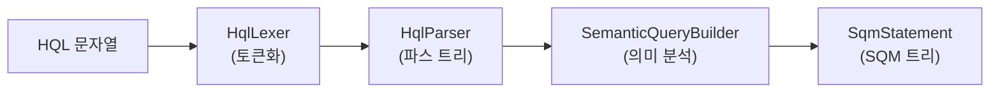
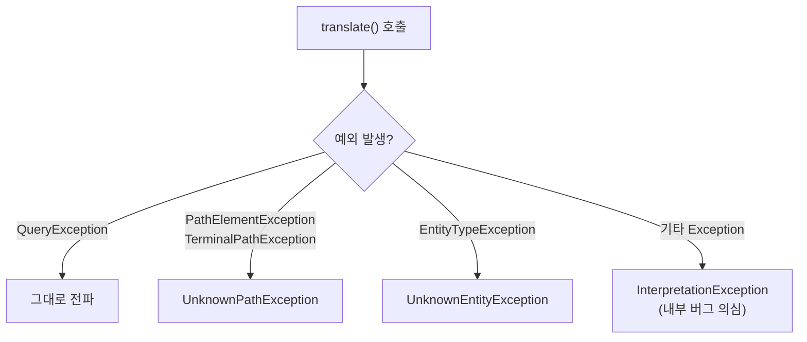
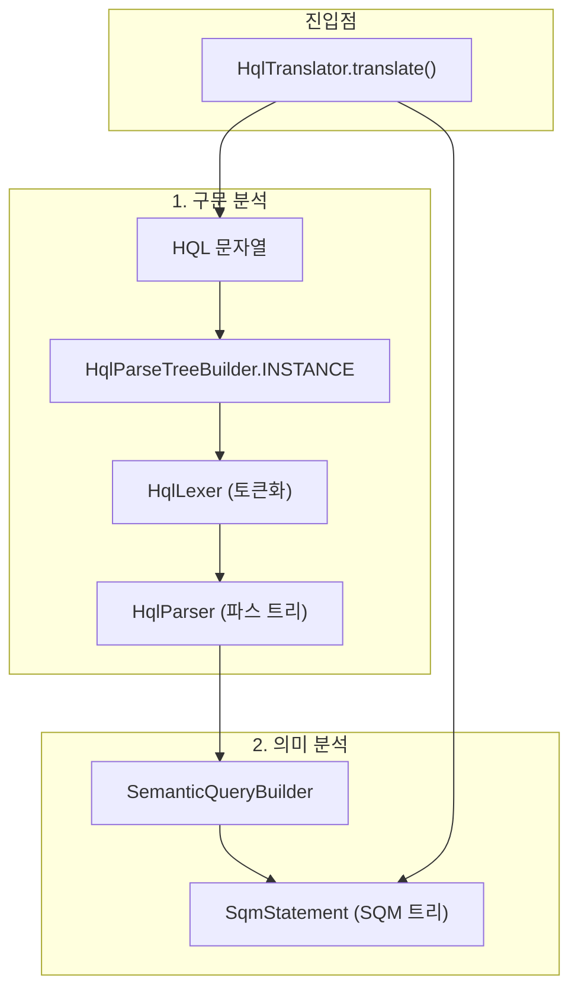

# HQL/JPQL 파싱과 SQM 트리 생성

Hibernate는 HQL/JPQL 문자열을 ANTLR 파서로 구문 분석한 뒤, SemanticQueryBuilder를 통해 의미 분석을 수행하여 SQM(Semantic Query Model) 트리를 생성한다.

## 목차
- [1. 핵심 개념 (What)](#1-핵심-개념-what)
- [2. 왜 알아야 하는가 (Why)](#2-왜-알아야-하는가-why)
- [3. 내부 구현 분석 (How)](#3-내부-구현-분석-how)
- [4. 실전 예제](#4-실전-예제)
- [5. 정리](#5-정리)

---

## 1. 핵심 개념 (What)

### HQL에서 SQM까지의 변환 파이프라인

HQL/JPQL 쿼리 문자열이 실행 가능한 SQL로 변환되기까지 첫 번째 단계는 **SQM 트리 생성**이다. 이 과정은 두 단계로 나뉜다:

1. **구문 분석 (Syntactic Parsing)**: ANTLR4가 HQL 문자열을 파스 트리(CST)로 변환
2. **의미 분석 (Semantic Analysis)**: SemanticQueryBuilder가 파스 트리를 SQM 트리(AST)로 변환



### 주요 클래스 요약

| 클래스 | 역할 |
|--------|------|
| `HqlTranslator` | HQL -> SQM 변환의 진입점 인터페이스 |
| `StandardHqlTranslator` | HqlTranslator의 표준 구현체 |
| `HqlParseTreeBuilder` | ANTLR HqlLexer/HqlParser 생성 팩토리 |
| `SemanticQueryBuilder` | ANTLR 파스 트리를 방문하여 SQM 노드를 생성하는 비지터 |
| `SqmStatement` | 생성된 SQM 트리의 루트 인터페이스 |

## 2. 왜 알아야 하는가 (Why)

### 쿼리 오류 디버깅

HQL 쿼리에서 발생하는 오류는 대부분 이 단계에서 발생한다. `SyntaxException`은 ANTLR 파싱 단계에서, `SemanticException`은 의미 분석 단계에서 발생한다. 파이프라인을 이해하면 에러 메시지의 원인을 정확히 파악할 수 있다.

### 성능 최적화 이해

StandardHqlTranslator는 SLL(k) 예측 모드를 먼저 시도하고 실패 시 LL(k)로 폴백하는 2단계 전략을 사용한다. 이 설계가 왜 필요한지, 복잡한 쿼리가 왜 더 느리게 파싱되는지를 이해할 수 있다.

### Criteria API와의 관계

Criteria API로 작성한 쿼리도 결국 SQM 트리로 변환된다. `SqmQuerySource` enum이 `HQL`, `CRITERIA`, `OTHER`를 구분하며, 두 경로 모두 동일한 SQM 트리 구조를 공유한다.

## 3. 내부 구현 분석 (How)

### 3.1 진입점: HqlTranslator 인터페이스

```java
// org.hibernate.query.hql.HqlTranslator
public interface HqlTranslator {
    <R> SqmStatement<R> translate(String hql, Class<R> expectedResultType);
}
```

단일 메서드 인터페이스로, HQL 문자열과 기대 결과 타입을 받아 `SqmStatement`를 반환한다. `SessionFactoryImplementor.getQueryEngine().getHqlTranslator()`로 접근할 수 있다.

### 3.2 StandardHqlTranslator의 2단계 파싱 전략

`StandardHqlTranslator.translate()` 메서드는 두 가지 작업을 순서대로 수행한다:

```java
// StandardHqlTranslator.java:57-90
public <R> SqmStatement<R> translate(String query, Class<R> expectedResultType) {
    // 1단계: ANTLR 파싱
    final HqlParser.StatementContext hqlParseTree = parseHql(query);

    // 2단계: 의미 분석 -> SQM 트리 생성
    final SqmStatement<R> sqmStatement = SemanticQueryBuilder.buildSemanticModel(
            hqlParseTree, expectedResultType,
            sqmCreationOptions, sqmCreationContext, query
    );

    SqmTreePrinter.logTree(sqmStatement);
    return sqmStatement;
}
```

#### ANTLR 파싱의 2단계 예측 모드

`parseHql()` 메서드는 성능을 위해 SLL(k) 모드를 먼저 시도한다:

```java
// StandardHqlTranslator.java:92-136
private HqlParser.StatementContext parseHql(String hql) {
    final HqlLexer hqlLexer = HqlParseTreeBuilder.INSTANCE.buildHqlLexer(hql);
    final HqlParser hqlParser = HqlParseTreeBuilder.INSTANCE.buildHqlParser(hql, hqlLexer);

    // 1차 시도: SLL(k) - 빠르지만 모든 문법을 처리하지 못함
    hqlParser.getInterpreter().setPredictionMode(PredictionMode.SLL);
    hqlParser.setErrorHandler(new BailErrorStrategy());
    try {
        return hqlParser.statement();
    }
    catch (ParseCancellationException e) {
        hqlParser.reset();
        // 2차 시도: LL(k) - 느리지만 정확함
        hqlParser.getInterpreter().setPredictionMode(PredictionMode.LL);
        hqlParser.setErrorHandler(new DefaultErrorStrategy());
        // ... 에러 리스너 등록 ...
        return hqlParser.statement();
    }
}
```

**SLL vs LL 전략의 이유**: SLL(k)는 LL(k)보다 빠르지만 ambiguous한 문법을 처리하지 못한다. 대부분의 HQL 쿼리는 SLL로 충분하므로, 이 전략은 일반적인 경우의 성능을 최적화하면서 복잡한 쿼리도 올바르게 파싱할 수 있도록 보장한다.

### 3.3 HqlParseTreeBuilder: 렉서와 파서 생성

```java
// HqlParseTreeBuilder.java
public class HqlParseTreeBuilder {
    public static final HqlParseTreeBuilder INSTANCE = new HqlParseTreeBuilder();

    public HqlLexer buildHqlLexer(String hql) {
        return new HqlLexer(CharStreams.fromString(hql));
    }

    public HqlParser buildHqlParser(String hql, HqlLexer hqlLexer) {
        return new HqlParser(new CommonTokenStream(hqlLexer));
    }
}
```

싱글턴 패턴으로 구현되며, ANTLR의 `CharStreams`와 `CommonTokenStream`을 사용하여 렉서와 파서를 생성한다. `HqlLexer`와 `HqlParser`는 Hibernate의 HQL 문법 파일(`.g4`)에서 ANTLR가 자동 생성한 클래스다.

### 3.4 SemanticQueryBuilder: 파스 트리에서 SQM으로

SemanticQueryBuilder는 ANTLR가 생성한 `HqlParserBaseVisitor`를 상속하며, 동시에 `SqmCreationState`를 구현한다:

```java
// SemanticQueryBuilder.java:247
public class SemanticQueryBuilder<R> extends HqlParserBaseVisitor<Object>
        implements SqmCreationState {

    // 정적 팩토리 메서드 - 진입점
    public static <R> SqmStatement<R> buildSemanticModel(
            HqlParser.StatementContext hqlParseTree,
            Class<R> expectedResultType,
            SqmCreationOptions creationOptions,
            SqmCreationContext creationContext,
            String query) {
        return new SemanticQueryBuilder<>(expectedResultType, creationOptions,
                                          creationContext, query)
                .visitStatement(hqlParseTree);
    }
    // ...
}
```

#### 핵심 내부 상태

```java
// 도트 경로(예: e.department.name) 처리를 위한 스택
private final Stack<DotIdentifierConsumer> dotIdentifierConsumerStack;

// 파라미터 선언 컨텍스트 스택
private final Stack<ParameterDeclarationContext> parameterDeclarationContextStack;

// SQM 생성 처리 상태 스택 (서브쿼리 중첩 지원)
private final Stack<SqmCreationProcessingState> processingStateStack;

// 파라미터 수집기
private ParameterCollector parameterCollector;
```

### 3.5 예외 처리 계층

StandardHqlTranslator는 다양한 예외를 적절한 쿼리 예외로 변환한다:



## 4. 실전 예제

### 간단한 SELECT 쿼리의 변환 과정

```java
// 입력 HQL
String hql = "SELECT e FROM Employee e WHERE e.salary > :minSalary";
```

**1단계: 토큰화 (HqlLexer)**
```
SELECT -> KW_SELECT
e -> IDENTIFIER
FROM -> KW_FROM
Employee -> IDENTIFIER
e -> IDENTIFIER
WHERE -> KW_WHERE
e -> IDENTIFIER
. -> DOT
salary -> IDENTIFIER
> -> GREATER
: -> COLON
minSalary -> IDENTIFIER
```

**2단계: 파스 트리 (HqlParser)**
```
StatementContext
  └── SelectStatementContext
        ├── QueryExpressionContext
        │     └── QuerySpecContext
        │           ├── SelectClauseContext: "e"
        │           └── FromClauseContext: "Employee e"
        └── WhereClauseContext
              └── ComparisonPredicate: "e.salary > :minSalary"
```

**3단계: SQM 트리 (SemanticQueryBuilder)**
```
SqmSelectStatement<Employee>
  └── SqmQuerySpec
        ├── SqmFromClause
        │     └── SqmRoot<Employee> (alias: "e")
        ├── SqmSelectClause
        │     └── SqmSelection -> SqmRoot<Employee>
        └── SqmWhereClause
              └── SqmComparisonPredicate(GREATER_THAN)
                    ├── SqmBasicValuedSimplePath(e.salary)
                    └── SqmNamedParameter(:minSalary)
```

### SqmQuerySource에 따른 분기

```java
public enum SqmQuerySource {
    HQL,      // HQL/JPQL로 작성된 쿼리
    CRITERIA,  // Criteria API로 작성된 쿼리
    OTHER      // 기타
}
```

SqmSelectStatement 내부에서 파라미터 수집 방식이 달라진다:

```java
// SqmSelectStatement.java:234-242
public Set<SqmParameter<?>> getSqmParameters() {
    if (querySource == CRITERIA) {
        // Criteria는 매번 재계산
        return collectParameters(this);
    } else {
        // HQL은 파싱 시점에 수집된 것 반환
        return parameters == null ? emptySet() : unmodifiableSet(parameters);
    }
}
```

## 5. 정리

### 변환 파이프라인 전체 흐름



### 핵심 포인트

| 항목 | 설명 |
|------|------|
| 2단계 예측 전략 | SLL(k) 먼저 시도, 실패 시 LL(k)로 폴백하여 성능과 정확성 균형 |
| SemanticQueryBuilder | HqlParserBaseVisitor 상속으로 ANTLR 파스 트리를 SQM 노드로 변환 |
| SqmStatement | 변환 결과의 루트 노드, SqmQuerySource로 HQL/Criteria 구분 |
| 에러 처리 | 구문 에러(SyntaxException)와 의미 에러(SemanticException) 분리 |
| 경로 해석 | DotIdentifierConsumer 스택으로 `e.department.name` 같은 경로 해석 |

---
*참고: Hibernate ORM 6.5.x 기준*
