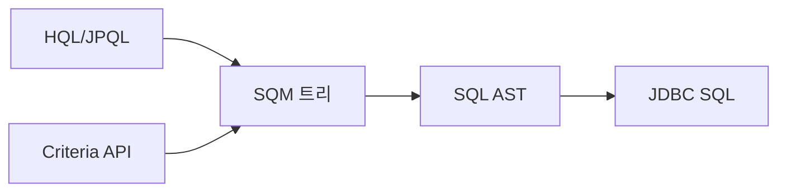
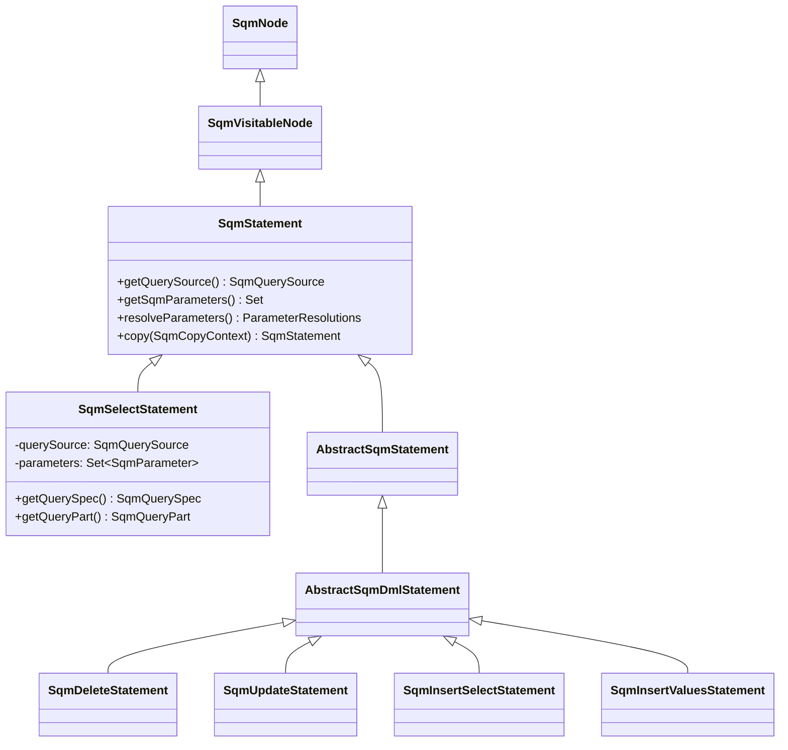
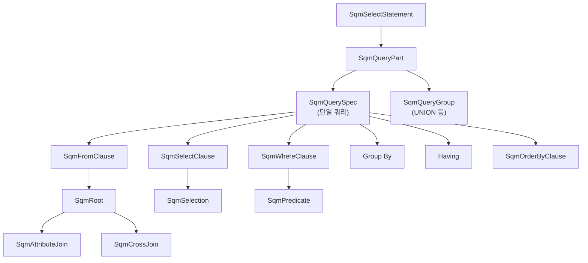
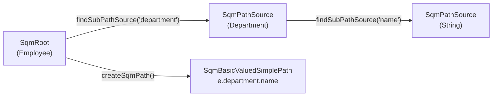
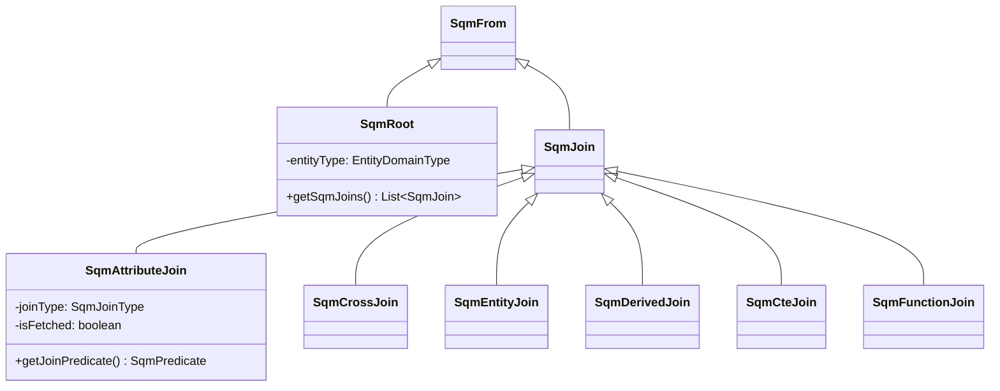
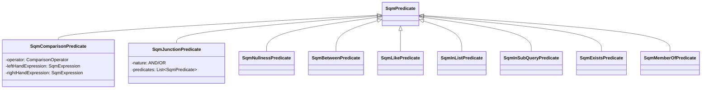
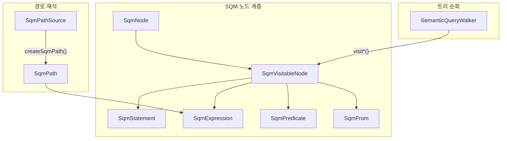

# SQM 아키텍처 심화

SQM(Semantic Query Model)은 Hibernate의 쿼리 표현을 위한 중간 표현(IR)으로, HQL/JPQL과 Criteria API 모두의 공통 추상 구문 트리 역할을 한다.

## 목차
- [1. 핵심 개념 (What)](#1-핵심-개념-what)
- [2. 왜 알아야 하는가 (Why)](#2-왜-알아야-하는가-why)
- [3. 내부 구현 분석 (How)](#3-내부-구현-분석-how)
- [4. 실전 예제](#4-실전-예제)
- [5. 정리](#5-정리)

---

## 1. 핵심 개념 (What)

### SQM이란 무엇인가

SQM은 Hibernate 6에서 도입된 쿼리 표현의 중간 계층이다. HQL/JPQL 문자열 파싱 결과와 Criteria API 빌드 결과 모두 SQM 트리로 표현되며, 이후 SQL AST로 변환된다.



### SQM의 핵심 특성

- **도메인 모델 기반**: 테이블/컬럼이 아닌 엔티티/속성 수준의 추상화
- **타입 안전**: 모든 노드가 도메인 타입 정보를 보유
- **쿼리 소스 독립적**: HQL, JPQL, Criteria 어디서 왔든 동일한 트리 구조
- **비지터 패턴 지원**: SemanticQueryWalker를 통한 트리 순회

## 2. 왜 알아야 하는가 (Why)

### 쿼리 최적화의 기반

SQM 트리를 이해하면 Hibernate가 쿼리를 어떻게 해석하고 최적화하는지 파악할 수 있다. fetch join, subquery, CTE 등 고급 쿼리 기능이 트리 구조에서 어떻게 표현되는지 이해하는 것이 중요하다.

### Criteria API의 실체

JPA Criteria API로 작성하는 모든 쿼리 빌딩 작업은 실제로 SQM 노드를 조립하는 것이다. `CriteriaBuilder.createQuery()`가 반환하는 객체는 `SqmSelectStatement`의 인스턴스다.

### 디버깅과 로깅

`SqmTreePrinter`를 통해 SQM 트리를 로그로 출력할 수 있다. 복잡한 쿼리 문제를 디버깅할 때 SQM 트리 구조를 읽을 수 있어야 한다.

## 3. 내부 구현 분석 (How)

### 3.1 SqmStatement 계층 구조

SQM 트리의 루트는 항상 `SqmStatement`이다:



#### SqmStatement 인터페이스

```java
// org.hibernate.query.sqm.tree.SqmStatement
public interface SqmStatement<T> extends SqmQuery<T>,
        JpaQueryableCriteria<T>, SqmVisitableNode {
    SqmQuerySource getQuerySource();
    Set<SqmParameter<?>> getSqmParameters();
    ParameterResolutions resolveParameters();
    SqmStatement<T> copy(SqmCopyContext context);
}
```

`SqmQuery`는 top-level 쿼리와 서브쿼리의 공통 인터페이스다:

```java
// org.hibernate.query.sqm.tree.SqmQuery
public interface SqmQuery<T> extends JpaCriteriaBase, SqmNode {
    SqmQuery<T> copy(SqmCopyContext context);
    String generateAlias();
}
```

### 3.2 SqmSelectStatement의 내부 구조

SELECT 쿼리의 SQM 트리 내부는 다음과 같이 계층화된다:



#### SqmQuerySpec: 쿼리의 핵심 구조체

```java
// SqmQuerySpec.java:63-71
public class SqmQuerySpec<T> extends SqmQueryPart<T>
        implements SqmNode, SqmFromClauseContainer, SqmWhereClauseContainer {
    private SqmFromClause fromClause;
    private SqmSelectClause selectClause;
    private SqmWhereClause whereClause;
    private List<SqmExpression<?>> groupByClauseExpressions;
    private SqmPredicate havingClausePredicate;
}
```

SQL의 SELECT 쿼리를 구성하는 모든 절(FROM, SELECT, WHERE, GROUP BY, HAVING, ORDER BY)을 포함한다.

### 3.3 SemanticQueryWalker: 비지터 패턴

SQM 트리를 순회하기 위한 비지터 인터페이스:

```java
// org.hibernate.query.sqm.SemanticQueryWalker
public interface SemanticQueryWalker<T> {
    T visitSelectStatement(SqmSelectStatement<?> statement);
    T visitUpdateStatement(SqmUpdateStatement<?> statement);
    T visitDeleteStatement(SqmDeleteStatement<?> statement);
    T visitInsertSelectStatement(SqmInsertSelectStatement<?> statement);
    T visitInsertValuesStatement(SqmInsertValuesStatement<?> statement);
    T visitQuerySpec(SqmQuerySpec<?> querySpec);
    T visitFromClause(SqmFromClause fromClause);
    T visitSelectClause(SqmSelectClause selectClause);
    // ... 수십 개의 visit 메서드
}
```

각 SQM 노드는 `SqmVisitableNode`을 구현하여 비지터를 받아들인다:

```java
// SqmVisitableNode.java
public interface SqmVisitableNode extends SqmNode {
    <X> X accept(SemanticQueryWalker<X> walker);
    void appendHqlString(StringBuilder hql, SqmRenderContext context);
}
```

**Double Dispatch 패턴**: 각 SQM 노드의 `accept()` 메서드가 walker의 적절한 visit 메서드를 호출한다:

```java
// SqmSelectStatement.java:250-252
public <X> X accept(SemanticQueryWalker<X> walker) {
    return walker.visitSelectStatement(this);
}
```

### 3.4 SqmPathSource: 경로 탐색의 핵심

`SqmPathSource`는 도메인 모델에서 경로를 생성할 수 있는 모든 요소를 나타낸다:

```java
// org.hibernate.query.sqm.SqmPathSource
public interface SqmPathSource<J>
        extends SqmExpressible<J>, Bindable<J>, SqmExpressibleAccessor<J> {
    // 이 소스가 생성하는 경로의 타입
    SqmDomainType<J> getPathType();

    // 하위 경로 소스 탐색 (예: Employee -> department)
    SqmPathSource<?> findSubPathSource(String name);

    // SQM 경로 노드 생성
    SqmPath<J> createSqmPath(SqmPath<?> lhs, SqmPathSource<?> intermediatePathSource);
}
```

경로 해석 예시 (`e.department.name`):



### 3.5 FROM 절의 트리 구조



`SqmRoot`는 FROM 절의 루트 엔티티를, `SqmAttributeJoin`은 연관 관계를 통한 조인을 나타낸다. `isFetched` 플래그로 fetch join을 구분한다.

### 3.6 Predicate 트리 구조

WHERE, HAVING 절의 조건은 `SqmPredicate` 트리로 표현된다:



## 4. 실전 예제

### 복잡한 쿼리의 SQM 트리 구조

```java
String hql = """
    SELECT d.name, AVG(e.salary)
    FROM Employee e
    JOIN e.department d
    WHERE e.hireDate > :startDate
    GROUP BY d.name
    HAVING AVG(e.salary) > 50000
    ORDER BY d.name
    """;
```

이 쿼리의 SQM 트리:

```
SqmSelectStatement
  querySource: HQL
  queryPart: SqmQuerySpec
    fromClause: SqmFromClause
      roots:
        SqmRoot<Employee> (alias: "e")
          joins:
            SqmSingularJoin<Department> (alias: "d", type: INNER)
    selectClause: SqmSelectClause
      selections:
        SqmSelection -> SqmBasicValuedSimplePath(d.name)
        SqmSelection -> SqmFunction(AVG, [SqmBasicValuedSimplePath(e.salary)])
    whereClause: SqmWhereClause
      predicate: SqmComparisonPredicate(GREATER_THAN)
        left: SqmBasicValuedSimplePath(e.hireDate)
        right: SqmNamedParameter(:startDate)
    groupByExpressions:
      SqmBasicValuedSimplePath(d.name)
    havingPredicate: SqmComparisonPredicate(GREATER_THAN)
      left: SqmFunction(AVG, [SqmBasicValuedSimplePath(e.salary)])
      right: SqmLiteral(50000)
    orderByClause: SqmOrderByClause
      SqmSortSpecification(d.name, ASC)
```

### SqmCopyContext를 활용한 트리 복제

SQM 트리는 불변이 아니며, `copy()` 메서드로 깊은 복사가 가능하다:

```java
// SqmSelectStatement.java:124-157
public SqmSelectStatement<T> copy(SqmCopyContext context) {
    final var existing = context.getCopy(this);
    return existing != null ? existing : createCopy(context, getResultType());
}
```

`SqmCopyContext`는 이미 복사된 노드를 캐시하여 순환 참조를 방지한다. 이 기능은 `createCountQuery()`나 `createExistsQuery()` 같은 파생 쿼리를 생성할 때 사용된다.

### SqmQuerySource에 따른 동작 차이

```java
// HQL에서 생성
SqmSelectStatement<Employee> hqlStatement =
    new SqmSelectStatement<>(SqmQuerySource.HQL, nodeBuilder);

// Criteria API에서 생성
SqmSelectStatement<Employee> criteriaStatement =
    new SqmSelectStatement<>(Employee.class, nodeBuilder);
    // 내부적으로 querySource = CRITERIA
```

파라미터 처리에서 차이가 발생한다:
- **HQL**: 파싱 시점에 파라미터가 수집되어 `Set<SqmParameter<?>>`에 저장
- **Criteria**: 트리가 동적으로 수정될 수 있으므로 매번 트리를 순회하여 재계산

## 5. 정리

### SQM 아키텍처 전체 구조



### 핵심 포인트

| 항목 | 설명 |
|------|------|
| SqmStatement | 모든 SQM 트리의 루트, HQL/Criteria 공통 |
| SqmQuerySpec | SELECT 쿼리의 FROM/SELECT/WHERE/GROUP BY/HAVING 통합 |
| SqmQueryGroup | UNION/INTERSECT/EXCEPT 연산을 위한 쿼리 그룹 |
| SemanticQueryWalker | 비지터 패턴으로 SQM 트리 순회 (Double Dispatch) |
| SqmPathSource | 도메인 모델 기반 경로 탐색의 핵심 인터페이스 |
| SqmCopyContext | 트리 복제 시 순환 참조 방지를 위한 캐시 컨텍스트 |
| SqmQuerySource | HQL/CRITERIA/OTHER 구분으로 파라미터 처리 방식 결정 |

---
*참고: Hibernate ORM 6.5.x 기준*
