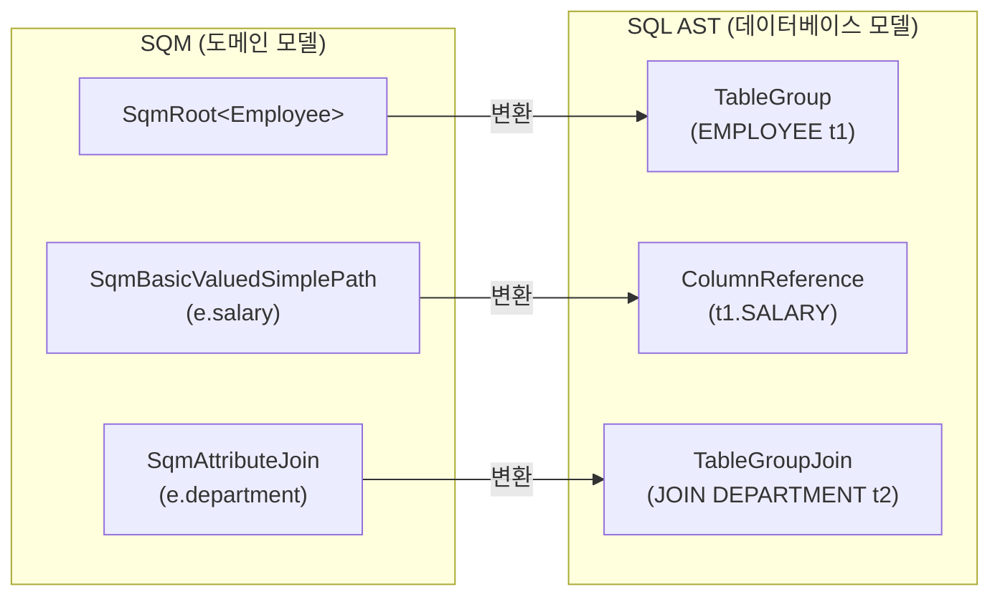
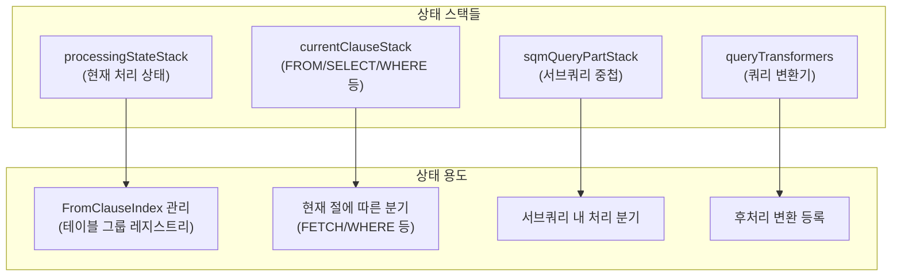
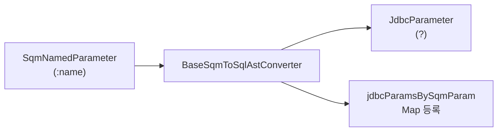
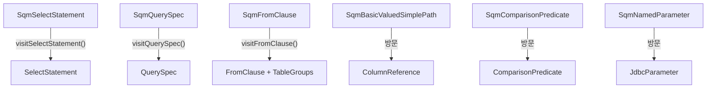

# SQM에서 SQL AST로의 변환 과정

BaseSqmToSqlAstConverter는 SemanticQueryWalker를 구현하여 도메인 모델 기반의 SQM 트리를 데이터베이스 지향적인 SQL AST 트리로 변환하는 핵심 컴포넌트다.

## 목차
- [1. 핵심 개념 (What)](#1-핵심-개념-what)
- [2. 왜 알아야 하는가 (Why)](#2-왜-알아야-하는가-why)
- [3. 내부 구현 분석 (How)](#3-내부-구현-분석-how)
- [4. 실전 예제](#4-실전-예제)
- [5. 정리](#5-정리)

---

## 1. 핵심 개념 (What)

### SQM과 SQL AST의 차이

SQM은 **도메인 모델**(엔티티, 속성, 연관 관계) 수준에서 쿼리를 표현하고, SQL AST는 **데이터베이스 모델**(테이블, 컬럼, 조인) 수준에서 쿼리를 표현한다.



### 핵심 클래스

| 클래스 | 역할 |
|--------|------|
| `SqmToSqlAstConverter` | 변환 인터페이스 (SemanticQueryWalker + SqlAstCreationState) |
| `BaseSqmToSqlAstConverter` | 핵심 변환 로직 구현 (추상 클래스, ~10,000줄) |
| `SelectStatement` | SQL AST의 SELECT 문 루트 노드 |
| `QuerySpec` | SQL AST의 쿼리 명세 (FROM, SELECT, WHERE 등) |
| `TableGroup` | SQL AST의 테이블 참조 단위 |
| `ColumnReference` | SQL AST의 컬럼 참조 |

## 2. 왜 알아야 하는가 (Why)

### N+1 문제의 근본 원인 이해

SQM에서 SQL AST로의 변환 과정에서 fetch 전략, entity graph, 조인 방식이 결정된다. 이 과정을 이해하면 N+1 문제가 어디서 발생하는지 근본적으로 파악할 수 있다.

### 매핑 메타모델과의 연결

SQM 트리의 `SqmPathSource`(도메인 모델)가 SQL AST의 `ModelPart`(매핑 모델)로 해석되는 과정을 이해하면, 복잡한 매핑(상속, 컴포지트 키, Any 타입) 관련 쿼리 문제를 진단할 수 있다.

### 암묵적 조인의 발생 지점

`e.department.name` 같은 경로 표현식은 이 단계에서 실제 JOIN으로 확장된다. 불필요한 암묵적 조인이 성능 문제를 일으키는 경우를 이해하는 데 필수적이다.

## 3. 내부 구현 분석 (How)

### 3.1 SqmToSqlAstConverter 인터페이스

```java
// org.hibernate.query.sqm.sql.SqmToSqlAstConverter
public interface SqmToSqlAstConverter
        extends SemanticQueryWalker<Object>, SqlAstCreationState {

    Stack<Clause> getCurrentClauseStack();
    Stack<SqmQueryPart> getSqmQueryPartStack();

    void registerQueryTransformer(QueryTransformer transformer);
    SqlAstJoinType getCurrentlyProcessingJoinType();
    boolean isInTypeInference();
    MappingModelExpressible<?> resolveFunctionImpliedReturnType();
    MappingModelExpressible<?> determineValueMapping(SqmExpression<?> sqmExpression);
}
```

`SemanticQueryWalker<Object>`를 반환 타입 `Object`로 구현하여, 각 visit 메서드가 해당하는 SQL AST 노드를 반환하도록 한다.

### 3.2 BaseSqmToSqlAstConverter의 구조

```java
// BaseSqmToSqlAstConverter.java:468-469
public abstract class BaseSqmToSqlAstConverter<T extends Statement>
        extends BaseSemanticQueryWalker
        implements SqmTranslator<T>, DomainResultCreationState, JdbcTypeIndicators {

    private final SqlAstCreationContext creationContext;
    private final SqmStatement<?> statement;
    private final QueryOptions queryOptions;
    private final LoadQueryInfluencers loadQueryInfluencers;

    // SQM 파라미터 -> JDBC 파라미터 매핑
    private final Map<SqmParameter<?>, List<List<JdbcParameter>>> jdbcParamsBySqmParam;

    // 도메인 결과(DomainResult) 수집
    private final List<DomainResult<?>> domainResults;

    // Entity Graph 처리 상태
    private final EntityGraphTraversalState entityGraphTraversalState;

    // 현재 처리 중인 SQM 쿼리 파트 스택
    private final Stack<SqmQueryPart> sqmQueryPartStack;

    // CTE 컨테이너
    private CteContainer cteContainer;
}
```

### 3.3 visitSelectStatement: SELECT 쿼리 변환

```java
// BaseSqmToSqlAstConverter.java:1643-1659
public SelectStatement visitSelectStatement(SqmSelectStatement<?> statement) {
    final var oldCteContainer = cteContainer;
    final var cteContainer = this.visitCteContainer(statement);
    final var oldSqmStatement = this.currentSqmStatement;

    this.currentSqmStatement = statement;
    final var queryPart = visitQueryPart(statement.getQueryPart());
    final List<DomainResult<?>> domainResults =
            queryPart.isRoot() ? this.domainResults : emptyList();
    try {
        return new SelectStatement(cteContainer, queryPart, domainResults);
    }
    finally {
        this.currentSqmStatement = oldSqmStatement;
        this.cteContainer = oldCteContainer;
    }
}
```

CTE를 먼저 처리하고, 쿼리 파트를 방문한 뒤, 최종 `SelectStatement`(SQL AST)를 조립한다.

### 3.4 visitQuerySpec: 쿼리 명세 변환의 핵심

```java
// BaseSqmToSqlAstConverter.java:2029-2080
public QuerySpec visitQuerySpec(SqmQuerySpec<?> sqmQuerySpec) {
    final boolean topLevel = getProcessingStateStack().isEmpty();
    final QuerySpec sqlQuerySpec =
            new QuerySpec(topLevel, sqmQuerySpec.getFromClause().getNumberOfRoots());

    // 처리 상태 설정
    pushProcessingState(processingState);
    queryTransformers.push(new ArrayList<>());

    try {
        return querySpec(sqmQuerySpec, sqlQuerySpec, topLevel, processingState);
    }
    finally {
        popProcessingStateStack();
        queryTransformers.pop();
        sqmQueryPartStack.pop();
    }
}
```

실제 변환은 `querySpec()` 내부 메서드에서 수행된다:

```java
// BaseSqmToSqlAstConverter.java:2082-2104
private QuerySpec querySpec(SqmQuerySpec<?> sqmQuerySpec, QuerySpec sqlQuerySpec,
                            boolean topLevel, ...) {
    // 1. FROM 절 먼저 방문 (테이블 그룹 등록)
    visitFromClause(sqmQuerySpec.getFromClause());

    // 2. SELECT 절 방문
    visitSelectClause(sqmQuerySpec.getSelectClause());

    // 3. WHERE 절 방문
    final SqmWhereClause whereClause = sqmQuerySpec.getWhereClause();
    if (whereClause != null) {
        sqlQuerySpec.applyPredicate(visitWhereClause(whereClause.getPredicate()));
    }

    // 4. GROUP BY 절 방문
    sqlQuerySpec.setGroupByClauseExpressions(
            visitGroupByClause(sqmQuerySpec.getGroupByClauseExpressions()));

    // 5. HAVING 절 방문
    if (havingClausePredicate != null) {
        sqlQuerySpec.setHavingClauseRestrictions(visitHavingClause(havingClausePredicate));
    }

    // 6. ORDER BY, OFFSET, FETCH 방문
    visitOrderByOffsetAndFetch(sqmQuerySpec, sqlQuerySpec);
}
```

**FROM 절을 먼저 방문하는 이유**: FROM 절에서 `TableGroup`이 등록되어야 SELECT, WHERE 등 다른 절에서 컬럼 참조를 해석할 수 있다.

### 3.5 FROM 절 변환: SqmRoot -> TableGroup

```java
// BaseSqmToSqlAstConverter.java:2641-2655
public Void visitFromClause(SqmFromClause sqmFromClause) {
    currentClauseStack.push(Clause.FROM);
    try {
        // 상관 서브쿼리 루트 먼저 처리
        sqmFromClause.visitRoots(this::consumeFromClauseCorrelatedRoot);
        // 일반 루트 처리
        sqmFromClause.visitRoots(this::consumeFromClauseRoot);
    }
    finally {
        currentClauseStack.pop();
    }
    return null;
}
```

상관 서브쿼리의 루트를 먼저 처리하는 이유는, 이 테이블 그룹들이 다른 FROM 노드의 조인 조건에서 참조될 수 있기 때문이다.

### 3.6 변환 과정의 상태 관리

변환 과정은 여러 상태를 스택으로 관리한다:



#### currentClauseStack의 중요성

현재 어떤 절을 처리 중인지에 따라 동작이 달라진다:
- **FROM 절**: 새로운 TableGroup을 생성하고 등록
- **SELECT 절**: DomainResult를 생성
- **WHERE 절**: Predicate 트리를 SQL AST Predicate로 변환

### 3.7 파라미터 변환

SQM 파라미터는 SQL AST의 JDBC 파라미터로 변환된다:



하나의 SQM 파라미터가 여러 JDBC 파라미터로 확장될 수 있다. 예를 들어, 복합 키를 가진 엔티티 파라미터는 키의 각 컬럼에 대해 별도의 JDBC 파라미터가 필요하다.

## 4. 실전 예제

### 변환 전후 비교

```java
// 입력: SQM 트리
// "SELECT e.name FROM Employee e JOIN e.department d WHERE d.name = :deptName"
```

**SQM 트리 (도메인 모델 수준)**:
```
SqmSelectStatement
  SqmQuerySpec
    fromClause:
      SqmRoot<Employee> (alias: "e")
        SqmSingularJoin<Department> (alias: "d", INNER)
    selectClause:
      SqmBasicValuedSimplePath(e.name)
    whereClause:
      SqmComparisonPredicate(EQUAL)
        SqmBasicValuedSimplePath(d.name)
        SqmNamedParameter(:deptName)
```

**SQL AST (데이터베이스 모델 수준)**:
```
SelectStatement
  QuerySpec (root: true)
    fromClause:
      TableGroup (EMPLOYEE t1)
        TableGroupJoin (INNER JOIN)
          TableGroup (DEPARTMENT t2)
            ON: t1.DEPT_ID = t2.ID
    selectClause:
      SqlSelection -> ColumnReference(t1.NAME)
    whereClause:
      ComparisonPredicate(EQUAL)
        ColumnReference(t2.NAME)
        JdbcParameter(?)
    domainResults:
      BasicResult<String>
```

### 변환에서 일어나는 주요 작업

1. **엔티티 -> 테이블 매핑**: `SqmRoot<Employee>` -> `TableGroup(EMPLOYEE)`
2. **속성 -> 컬럼 매핑**: `e.name` -> `t1.NAME`
3. **연관 관계 -> 조인 조건**: `e.department` -> `JOIN DEPARTMENT t2 ON t1.DEPT_ID = t2.ID`
4. **파라미터 변환**: `SqmNamedParameter(:deptName)` -> `JdbcParameter(?)`
5. **DomainResult 생성**: SELECT 절의 각 선택에 대한 결과 매핑 정보

### 암묵적 조인의 해석

```java
// HQL: "SELECT e.department.name FROM Employee e"
// SQM 시점에는 경로 표현식
// SQL AST 변환 시 암묵적 JOIN이 생성됨
```

BaseSqmToSqlAstConverter가 `e.department.name` 경로를 처리할 때:
1. `e` -> Employee의 TableGroup 조회
2. `department` -> Employee -> Department 연관 관계 확인 -> 암묵적 JOIN 생성
3. `name` -> Department 테이블의 NAME 컬럼 참조 생성

## 5. 정리

### 변환 파이프라인 요약



### 핵심 포인트

| 항목 | 설명 |
|------|------|
| BaseSqmToSqlAstConverter | SemanticQueryWalker 구현으로 SQM 노드를 SQL AST 노드로 1:1 변환 |
| FROM 절 우선 처리 | TableGroup이 먼저 등록되어야 SELECT/WHERE에서 컬럼 참조 가능 |
| 상태 스택 관리 | 서브쿼리 중첩, 현재 절 추적을 위한 다중 스택 구조 |
| 파라미터 확장 | 하나의 SQM 파라미터가 복합 키 등으로 인해 여러 JDBC 파라미터로 확장 가능 |
| 암묵적 조인 생성 | 경로 표현식(e.department.name)이 이 단계에서 실제 JOIN으로 해석 |
| DomainResult | SELECT 절 항목에 대한 결과 매핑 정보가 이 단계에서 생성 |

---
*참고: Hibernate ORM 6.5.x 기준*
