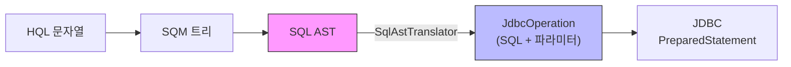
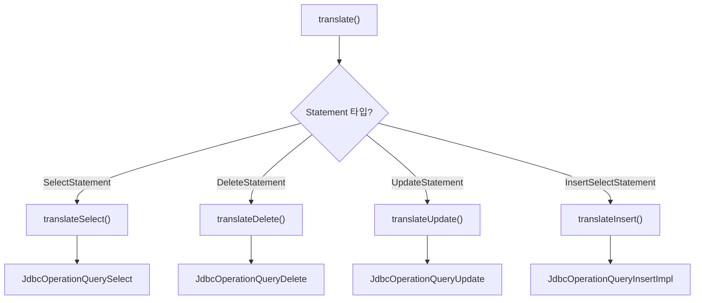
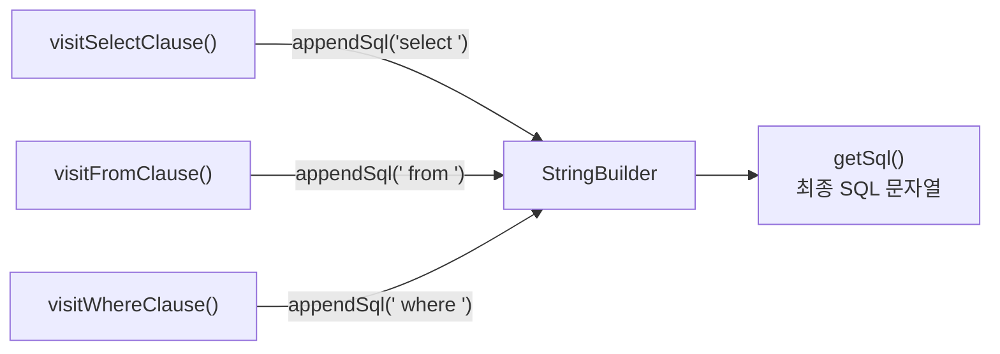
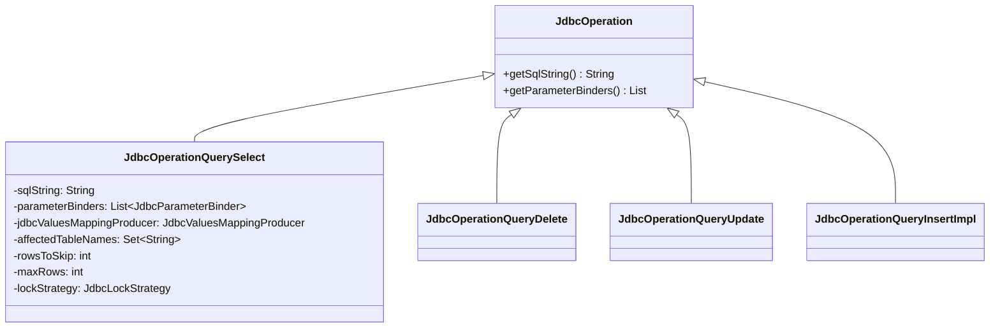
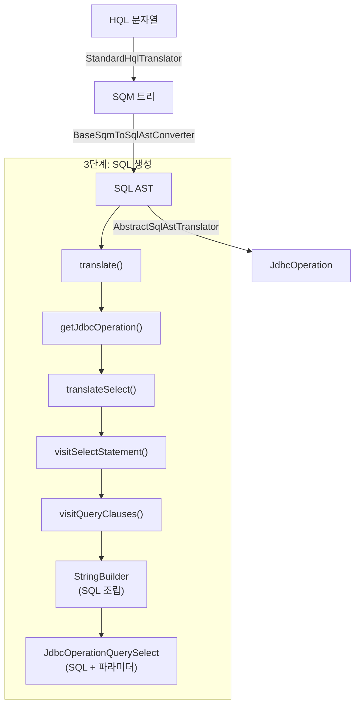

# SqlAstTranslator와 최종 SQL 생성

AbstractSqlAstTranslator는 SQL AST 트리를 순회하며 방언(Dialect)별 SQL 문자열을 생성하고, JdbcOperation 객체로 패키징하여 JDBC 실행 준비를 완료한다.

## 목차
- [1. 핵심 개념 (What)](#1-핵심-개념-what)
- [2. 왜 알아야 하는가 (Why)](#2-왜-알아야-하는가-why)
- [3. 내부 구현 분석 (How)](#3-내부-구현-분석-how)
- [4. 실전 예제](#4-실전-예제)
- [5. 정리](#5-정리)

---

## 1. 핵심 개념 (What)

### SQL 생성 단계의 위치

쿼리 처리 파이프라인의 최종 단계로, SQL AST를 실행 가능한 JDBC SQL로 변환한다:



### 핵심 클래스

| 클래스 | 역할 |
|--------|------|
| `SqlAstTranslator<T>` | SQL AST -> JdbcOperation 변환 인터페이스 |
| `AbstractSqlAstTranslator<T>` | SQL 렌더링 핵심 로직 (~8,000줄) |
| `StandardSqlAstTranslator<T>` | AbstractSqlAstTranslator의 표준 구현 |
| `JdbcOperation` | 최종 산출물: SQL 문자열 + 파라미터 바인더 |
| `JdbcOperationQuerySelect` | SELECT 쿼리용 JdbcOperation |

## 2. 왜 알아야 하는가 (Why)

### 방언별 SQL 차이의 원인

동일한 HQL이 MySQL, PostgreSQL, Oracle에서 다른 SQL을 생성하는 이유가 바로 이 단계에 있다. AbstractSqlAstTranslator가 Dialect를 참조하여 데이터베이스별 문법(페이징, 잠금, 함수 등)을 적용한다.

### 생성된 SQL 분석

`hibernate.show_sql=true`로 출력되는 SQL이 어떤 과정을 거쳐 만들어졌는지 이해할 수 있다. SQL이 예상과 다를 때 원인을 추적하는 데 필수적이다.

### 성능 관련 SQL 특성

OFFSET/FETCH 처리, 잠금 전략, ROW_NUMBER 래핑 등 성능에 영향을 미치는 SQL 생성 결정이 이 단계에서 이루어진다.

## 3. 내부 구현 분석 (How)

### 3.1 SqlAstTranslator 인터페이스

```java
// org.hibernate.sql.ast.SqlAstTranslator
public interface SqlAstTranslator<T extends JdbcOperation> extends SqlAstWalker {
    // 핵심: SQL AST를 JdbcOperation으로 변환
    T translate(JdbcParameterBindings jdbcParameterBindings, QueryOptions queryOptions);

    // SQL AST 접근
    Statement getSqlAst();

    // SessionFactory 접근
    SessionFactoryImplementor getSessionFactory();

    // SQL AST 노드 렌더링
    void render(SqlAstNode sqlAstNode, SqlAstNodeRenderingMode renderingMode);

    // 현재 처리 중인 쿼리 파트
    QueryPart getCurrentQueryPart();

    // 영향받는 테이블 이름 수집
    Set<String> getAffectedTableNames();
}
```

`SqlAstWalker`를 확장하여 SQL AST의 모든 노드 유형에 대한 visit 메서드를 제공한다.

### 3.2 StandardSqlAstTranslator

```java
// org.hibernate.sql.ast.spi.StandardSqlAstTranslator
public class StandardSqlAstTranslator<T extends JdbcOperation>
        extends AbstractSqlAstTranslator<T> {

    public StandardSqlAstTranslator(SessionFactoryImplementor sessionFactory,
                                     Statement statement) {
        super(sessionFactory, statement);
    }
}
```

모든 실제 로직은 `AbstractSqlAstTranslator`에 있으며, StandardSqlAstTranslator는 단순한 구체화 클래스다. 특정 Dialect가 커스텀 Translator를 제공할 수도 있다.

### 3.3 translate() 메서드: 변환의 진입점

```java
// AbstractSqlAstTranslator.java:775-793
public T translate(JdbcParameterBindings jdbcParameterBindings, QueryOptions queryOptions) {
    try {
        this.jdbcParameterBindings = jdbcParameterBindings;
        final Statement statement = statementStack.pop();

        if (statement instanceof TableMutation<?> tableMutation) {
            return translateTableMutation(tableMutation);
        }
        else {
            this.lockOptions = queryOptions.getLockOptions().makeCopy();
            this.limit = queryOptions.getLimit() == null
                    ? null : queryOptions.getLimit().makeCopy();
            final JdbcOperation jdbcOperation = getJdbcOperation(statement);
            return (T) jdbcOperation;
        }
    }
    finally {
        cleanup();
    }
}
```

### 3.4 Statement 유형별 분기

```java
// AbstractSqlAstTranslator.java:795-811
private JdbcOperation getJdbcOperation(Statement statement) {
    if (statement instanceof DeleteStatement deleteStatement) {
        return translateDelete(deleteStatement);
    }
    else if (statement instanceof UpdateStatement updateStatement) {
        return translateUpdate(updateStatement);
    }
    else if (statement instanceof InsertSelectStatement insertStatement) {
        return translateInsert(insertStatement);
    }
    else if (statement instanceof SelectStatement selectStatement) {
        return translateSelect(selectStatement);
    }
    else {
        throw new IllegalArgumentException("Unexpected statement");
    }
}
```



### 3.5 translateSelect: SELECT 쿼리 생성

```java
// AbstractSqlAstTranslator.java:860-900
protected JdbcSelect translateSelect(SelectStatement selectStatement) {
    logDomainResultGraph(selectStatement.getDomainResultDescriptors());
    logSqlAst(selectStatement);

    final LockOptions lockOptions = this.lockOptions;

    // SQL AST를 방문하면서 SQL 문자열 생성
    visitSelectStatement(selectStatement);

    // JdbcOperationQuerySelect 조립
    final JdbcOperationQuerySelect jdbcSelect = new JdbcOperationQuerySelect(
            getSql(),                      // 생성된 SQL 문자열
            getParameterBinders(),         // 파라미터 바인더 목록
            buildJdbcValuesMappingProducer(selectStatement),  // 결과 매핑
            getAffectedTableNames(),       // 영향받는 테이블
            rowsToSkip,                    // OFFSET 처리
            getMaxRows(...),               // LIMIT 처리
            getAppliedParameterBindings(), // 적용된 파라미터 바인딩
            getJdbcLockStrategy(),         // 잠금 전략
            getOffsetParameter(),
            getLimitParameter()
    );

    // 비관적 잠금 후처리
    if (lockOptions != null && lockOptions.getLockMode().isPessimistic()) {
        // 잠금 전략에 따른 추가 처리
    }

    return jdbcSelect;
}
```

### 3.6 visitSelectStatement: SQL 문자열 렌더링

```java
// AbstractSqlAstTranslator.java:1020-1039
public void visitSelectStatement(SelectStatement statement) {
    final SqlAstNodeRenderingMode oldMode = getParameterRenderingMode();
    try {
        statementStack.push(statement);
        parameterRenderingMode = SqlAstNodeRenderingMode.DEFAULT;

        final boolean needsParenthesis = !statement.getQueryPart().isRoot();
        if (needsParenthesis) {
            appendSql(OPEN_PARENTHESIS);
        }

        // CTE 렌더링 (WITH 절)
        visitCteContainer(statement);

        // 쿼리 파트 렌더링 (SELECT ... FROM ... WHERE ...)
        statement.getQueryPart().accept(this);

        if (needsParenthesis) {
            appendSql(CLOSE_PARENTHESIS);
        }
    }
    finally {
        parameterRenderingMode = oldMode;
        statementStack.pop();
    }
}
```

### 3.7 visitQuerySpec: 절별 SQL 렌더링

```java
// AbstractSqlAstTranslator.java:3635-3683
public void visitQuerySpec(QuerySpec querySpec) {
    // 잠금 전략 결정
    if (lockingClauseStrategy == null) {
        lockingClauseStrategy =
                dialect.getLockingClauseStrategy(querySpec, getLockOptions());
    }

    // ROW_NUMBER 래핑 필요 여부 판단
    // ...

    queryPartStack.push(querySpec);

    // 핵심: 각 절을 순서대로 렌더링
    visitQueryClauses(querySpec);

    // FOR UPDATE 절
    visitForUpdateClause(querySpec);
}
```

`visitQueryClauses()`가 SQL의 각 절을 표준 순서로 렌더링한다:

```java
// AbstractSqlAstTranslator.java:3719-3727
protected void visitQueryClauses(QuerySpec querySpec) {
    visitSelectClause(querySpec.getSelectClause());    // SELECT ...
    visitFromClause(querySpec.getFromClause());         // FROM ...
    visitWhereClause(querySpec.getWhereClauseRestrictions()); // WHERE ...
    visitGroupByClause(querySpec, ...);                 // GROUP BY ...
    visitHavingClause(querySpec);                       // HAVING ...
    visitOrderBy(querySpec.getSortSpecifications());    // ORDER BY ...
    visitOffsetFetchClause(querySpec);                  // OFFSET ... FETCH ...
}
```

### 3.8 SQL 문자열 조립 메커니즘

AbstractSqlAstTranslator는 `SqlAppender` 인터페이스를 구현하여 내부 `StringBuilder`에 SQL 조각을 추가한다:



WHERE 절 렌더링 예시:

```java
// AbstractSqlAstTranslator.java:3740-3764
protected final void visitWhereClause(Predicate whereClauseRestrictions) {
    if (hasWhere(whereClauseRestrictions)) {
        appendSql(" where ");
        clauseStack.push(Clause.WHERE);
        try {
            if (whereClauseRestrictions != null && !whereClauseRestrictions.isEmpty()) {
                whereClauseRestrictions.accept(this);
                if (additionalWherePredicate != null) {
                    appendSql(" and ");
                    additionalWherePredicate.accept(this);
                }
            }
        }
        finally {
            clauseStack.pop();
        }
    }
}
```

### 3.9 JdbcOperation: 최종 산출물



`JdbcOperationQuerySelect`는 다음을 포함한다:
- **SQL 문자열**: 실행할 SQL
- **파라미터 바인더**: `PreparedStatement`에 파라미터를 바인딩하는 객체 목록
- **결과 매핑 프로듀서**: `ResultSet` -> 도메인 객체 변환 정보
- **영향받는 테이블**: 쿼리 캐시 무효화에 사용

## 4. 실전 예제

### 전체 파이프라인 예시

```java
// 입력 HQL
"SELECT e.name FROM Employee e WHERE e.salary > :minSalary ORDER BY e.name"
```

**AbstractSqlAstTranslator의 SQL 생성 과정**:

```
1. visitSelectStatement() 진입
2.   visitCteContainer() -> (CTE 없음)
3.   queryPart.accept(this) -> visitQuerySpec()
4.     visitQueryClauses()
5.       visitSelectClause() -> "select e1_0.name"
6.       visitFromClause()  -> " from employee e1_0"
7.       visitWhereClause() -> " where e1_0.salary>?"
8.       visitOrderBy()     -> " order by e1_0.name"
9.       visitOffsetFetchClause() -> (없음)
```

**최종 JdbcOperationQuerySelect**:
```
SQL: "select e1_0.name from employee e1_0 where e1_0.salary>? order by e1_0.name"
ParameterBinders: [JdbcParameterBinder for :minSalary]
AffectedTableNames: {"employee"}
```

### Dialect에 따른 페이징 SQL 차이

```java
// HQL: "FROM Employee e ORDER BY e.id"
// + QueryOptions: offset=10, limit=20
```

**MySQL (LIMIT/OFFSET)**:
```sql
select e1_0.id, e1_0.name from employee e1_0
  order by e1_0.id limit ? offset ?
```

**Oracle (OFFSET FETCH)**:
```sql
select e1_0.id, e1_0.name from employee e1_0
  order by e1_0.id offset ? rows fetch first ? rows only
```

**SQL Server (ROW_NUMBER 래핑)**:
```sql
select * from (
  select e1_0.id, e1_0.name,
         row_number() over(order by e1_0.id) as rn_
  from employee e1_0
) t where rn_ > ? and rn_ <= ?
```

이 차이는 `visitOffsetFetchClause()`와 `visitQuerySpec()` 내부의 ROW_NUMBER 래핑 로직에서 결정된다.

### 잠금 전략 렌더링

```java
// HQL + LockMode.PESSIMISTIC_WRITE
"SELECT e FROM Employee e WHERE e.id = :id"
```

**PostgreSQL**:
```sql
select e1_0.id, e1_0.name from employee e1_0
  where e1_0.id=? for update
```

**Oracle**:
```sql
select e1_0.id, e1_0.name from employee e1_0
  where e1_0.id=? for update
```

`visitForUpdateClause()`에서 Dialect의 `getLockingClauseStrategy()`를 통해 적절한 잠금 구문을 생성한다.

## 5. 정리

### 전체 쿼리 변환 파이프라인



### 핵심 포인트

| 항목 | 설명 |
|------|------|
| StandardSqlAstTranslator | AbstractSqlAstTranslator의 단순 구체화, 실제 로직은 부모 클래스 |
| translate() | 진입점. Statement 타입에 따라 translateSelect/Delete/Update/Insert 분기 |
| visitQueryClauses() | SELECT/FROM/WHERE/GROUP BY/HAVING/ORDER BY/OFFSET FETCH 순서로 렌더링 |
| Dialect 연동 | 페이징, 잠금, 함수 등 데이터베이스별 SQL 문법을 Dialect에서 결정 |
| JdbcOperation | 최종 산출물. SQL 문자열, 파라미터 바인더, 결과 매핑 정보 포함 |
| SqlAppender 패턴 | 내부 StringBuilder에 SQL 조각을 점진적으로 추가하는 방식 |

---
*참고: Hibernate ORM 6.5.x 기준*
