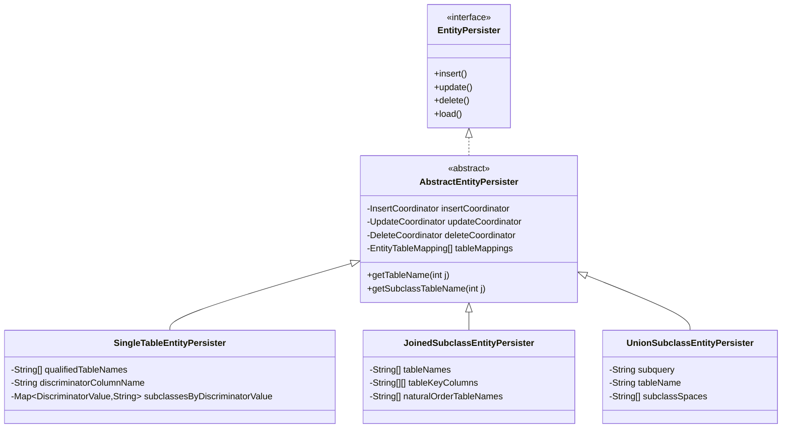
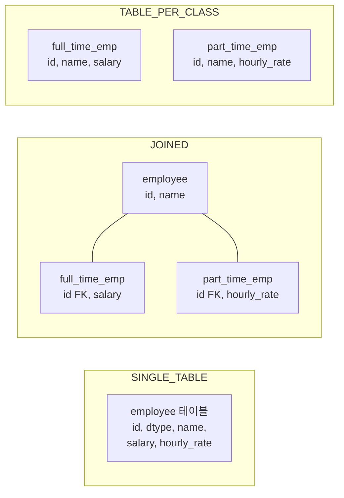

# EntityPersister 계층과 상속 전략

Hibernate가 JPA의 세 가지 상속 매핑 전략(SINGLE_TABLE, JOINED, TABLE_PER_CLASS)을 EntityPersister 계층 구조를 통해 어떻게 구현하는지 내부 소스 코드 수준에서 분석한다.

## 목차
- [1. 핵심 개념 (What)](#1-핵심-개념-what)
- [2. 왜 알아야 하는가 (Why)](#2-왜-알아야-하는가-why)
- [3. 내부 구현 분석 (How)](#3-내부-구현-분석-how)
- [4. 실전 예제](#4-실전-예제)
- [5. 정리](#5-정리)

---

## 1. 핵심 개념 (What)

EntityPersister는 Hibernate에서 엔티티 하나의 CRUD를 책임지는 핵심 인터페이스다. 상속 전략에 따라 테이블 구조가 달라지므로, 각 전략별로 별도의 Persister 구현체가 존재한다.

### 계층 구조



## 2. 왜 알아야 하는가 (Why)

- **성능 튜닝**: 상속 전략에 따라 생성되는 SQL이 완전히 다르다. JOIN 수, UNION 서브쿼리, discriminator 컬럼 존재 여부가 쿼리 성능에 직접적인 영향을 미친다.
- **디버깅**: `Hibernate SQL` 로그에 나타나는 복잡한 JOIN이나 CASE문의 근원을 이해할 수 있다.
- **설계 판단**: 프로젝트 초기에 상속 전략을 선택할 때, 각 전략이 내부적으로 어떻게 동작하는지 알면 합리적인 결정을 내릴 수 있다.

## 3. 내부 구현 분석 (How)

### 3.1 AbstractEntityPersister — 공통 기반

`AbstractEntityPersister`는 모든 상속 전략의 부모 클래스다. 핵심 필드를 살펴보면:

```java
// AbstractEntityPersister.java (line 377~380)
private EntityTableMapping[] tableMappings;
private InsertCoordinator insertCoordinator;
private UpdateCoordinator updateCoordinator;
private DeleteCoordinator deleteCoordinator;
private UpdateCoordinator mergeCoordinator;
```

이 클래스는 `EntityPersister`, `InFlightEntityMappingType`, `EntityMutationTarget` 등 다수의 인터페이스를 구현하며, 테이블 매핑 정보와 mutation 조율자를 보유한다. 하위 클래스는 **테이블 수, JOIN 방식, discriminator 처리** 같은 전략별 차이만 오버라이드한다.

### 3.2 SingleTableEntityPersister — 단일 테이블 전략

`@Inheritance(strategy = SINGLE_TABLE)` 전략의 구현체이다.

**핵심 특징:**
- 계층 구조 전체가 **하나의 테이블**에 매핑된다
- **discriminator 컬럼**으로 구체 타입을 구분한다
- 서브클래스 고유 컬럼은 nullable이어야 한다

```java
// SingleTableEntityPersister.java (line 56~99)
public class SingleTableEntityPersister extends AbstractEntityPersister {
    private final int joinSpan;
    private final String[] qualifiedTableNames;
    private final boolean[] isInverseTable;
    private final boolean[] isNullableTable;
    private final String[][] keyColumnNames;

    // discriminator 관련
    private final Map<DiscriminatorValue, String> subclassesByDiscriminatorValue;
    private final String discriminatorColumnName;
    private final BasicType<?> discriminatorType;
    private final DiscriminatorValue discriminatorValue;
    private final String discriminatorSQLValue;
    private final boolean discriminatorInsertable;
    ...
}
```

**SQL 특성:** SELECT 시 단일 테이블에서 조회하므로 JOIN이 없다. WHERE 절에 discriminator 조건이 추가된다.

```sql
-- SingleTable 전략의 전형적인 SELECT
SELECT id, name, dtype, salary, department
FROM employee
WHERE dtype = 'FullTimeEmployee' AND id = ?
```

### 3.3 JoinedSubclassEntityPersister — 조인 전략

`@Inheritance(strategy = JOINED)` 전략의 구현체이다.

**핵심 특징:**
- 각 클래스마다 **별도 테이블**을 가진다
- 공통 속성은 루트 테이블에, 고유 속성은 각 서브클래스 테이블에 저장된다
- PK를 FK로 사용하여 JOIN한다

```java
// JoinedSubclassEntityPersister.java (line 80~117)
public class JoinedSubclassEntityPersister extends AbstractEntityPersister {
    private final int tableSpan;
    private final String[] tableNames;
    private final String[] naturalOrderTableNames;
    private final String[][] tableKeyColumns;
    private final String[][] naturalOrderTableKeyColumns;
    private final boolean[] naturalOrderCascadeDeleteEnabled;

    // 서브클래스를 포함한 전체 테이블 클로저
    private final String[] subclassTableNameClosure;
    private final String[][] subclassTableKeyColumnClosure;
    private final boolean[] isClassOrSuperclassTable;
    ...
}
```

**discriminator 처리:** JoinedSubclass 전략은 명시적 discriminator 컬럼 대신, SQL CASE 문을 이용한 **암시적 discriminator**를 사용할 수 있다. `CaseStatementDiscriminatorMappingImpl`이 이를 담당한다.

```java
// JoinedSubclassEntityPersister.java (line 83)
private static final String IMPLICIT_DISCRIMINATOR_ALIAS = "clazz_";
```

**SQL 특성:** SELECT 시 루트 테이블과 서브클래스 테이블을 LEFT JOIN으로 연결한다.

```sql
-- Joined 전략의 전형적인 SELECT
SELECT e.id, e.name, f.salary, p.hourly_rate,
       CASE WHEN f.id IS NOT NULL THEN 1
            WHEN p.id IS NOT NULL THEN 2
            ELSE 0 END AS clazz_
FROM employee e
LEFT JOIN full_time_employee f ON e.id = f.id
LEFT JOIN part_time_employee p ON e.id = p.id
WHERE e.id = ?
```

### 3.4 UnionSubclassEntityPersister — 테이블 퍼 클래스 전략

`@Inheritance(strategy = TABLE_PER_CLASS)` 전략의 구현체이다.

**핵심 특징:**
- 각 **구체 클래스마다 독립적인 테이블**을 가진다
- 상속받은 속성도 각 테이블에 중복 저장된다
- 다형적 쿼리 시 **UNION ALL 서브쿼리**를 사용한다

```java
// UnionSubclassEntityPersister.java (line 71~88)
public class UnionSubclassEntityPersister extends AbstractEntityPersister {
    private final String subquery;          // UNION ALL 서브쿼리
    private final String tableName;         // 구체 클래스의 테이블명
    private final String[] subclassTableNames;
    private final String[] subclassSpaces;  // 모든 서브클래스 테이블 공간
    private final DiscriminatorValue discriminatorValue;
    private final String discriminatorSQLValue;
    private final BasicType<?> discriminatorType;
    private final Map<DiscriminatorValue, String> subclassByDiscriminatorValue;
    ...
}
```

**제약사항:** IDENTITY 전략의 ID 생성기를 사용할 수 없다. 생성자에서 `validateGenerator()`를 호출하여 이를 검증한다.

```sql
-- TABLE_PER_CLASS 전략의 다형적 SELECT
SELECT id, name, salary, hourly_rate, clazz_
FROM (
    SELECT id, name, salary, NULL AS hourly_rate, 1 AS clazz_ FROM full_time_employee
    UNION ALL
    SELECT id, name, NULL, hourly_rate, 2 AS clazz_ FROM part_time_employee
) AS union_table
WHERE id = ?
```

### 3.5 전략별 테이블 매핑 비교



| 비교 항목 | SingleTable | Joined | UnionSubclass |
|-----------|-------------|--------|---------------|
| 테이블 수 | 1 | 클래스 수만큼 | 구체 클래스 수만큼 |
| NULL 컬럼 | 많음 | 없음 | 없음 |
| 다형적 SELECT | 빠름 (단일 테이블) | JOIN 필요 | UNION ALL 필요 |
| INSERT | 1회 | 클래스 수만큼 | 1회 |
| Discriminator | 명시적 컬럼 | CASE/명시적 | 서브쿼리 내 CASE |
| ID 전략 제한 | 없음 | 없음 | IDENTITY 불가 |

## 4. 실전 예제

### Persister 선택 확인하기

Hibernate는 부팅 시 `PersisterFactory`를 통해 상속 전략에 맞는 Persister를 자동 선택한다. 디버그 로그로 확인할 수 있다.

```java
@Entity
@Inheritance(strategy = InheritanceType.SINGLE_TABLE)
@DiscriminatorColumn(name = "emp_type")
public abstract class Employee {
    @Id @GeneratedValue
    private Long id;
    private String name;
}

@Entity
@DiscriminatorValue("FT")
public class FullTimeEmployee extends Employee {
    private BigDecimal salary;
}
```

위 매핑에서 Hibernate는 `SingleTableEntityPersister`를 사용한다. 이 Persister의 `discriminatorColumnName`은 `"emp_type"`, `discriminatorSQLValue`는 `"'FT'"`가 된다.

### Joined 전략에서 INSERT 동작

Joined 전략에서 서브클래스 엔티티를 INSERT하면, `InsertCoordinator`가 루트 테이블부터 순서대로 INSERT를 실행한다:

```
1. INSERT INTO employee (id, name) VALUES (?, ?)
2. INSERT INTO full_time_employee (id, salary) VALUES (?, ?)
```

이 순서는 `AbstractEntityPersister`의 `tableMappings` 배열 순서를 따른다.

## 5. 정리

| 개념 | 핵심 내용 |
|------|-----------|
| AbstractEntityPersister | 모든 전략의 공통 기반. InsertCoordinator/UpdateCoordinator/DeleteCoordinator 보유 |
| SingleTableEntityPersister | 단일 테이블 + discriminator 컬럼. JOIN 없이 가장 빠른 SELECT |
| JoinedSubclassEntityPersister | 클래스별 테이블 + PK-FK JOIN. 정규화되지만 JOIN 비용 발생 |
| UnionSubclassEntityPersister | 구체 클래스별 독립 테이블 + UNION ALL. IDENTITY 제한 |
| 전략 선택 기준 | 읽기 성능 우선이면 SINGLE_TABLE, 정규화 우선이면 JOINED, 독립 테이블이면 TABLE_PER_CLASS |

---
*참고: Hibernate ORM 6.5.x 기준*
