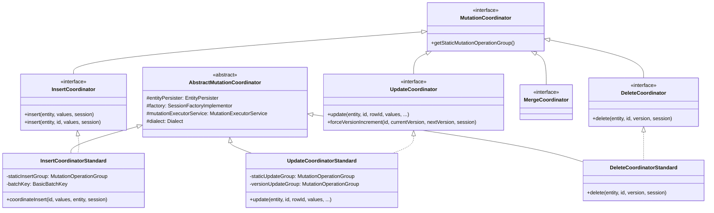
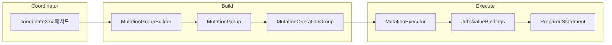

# MutationCoordinator 패턴

Hibernate가 엔티티의 INSERT, UPDATE, DELETE를 실행할 때 사용하는 MutationCoordinator 패턴의 내부 구조와 실행 흐름을 분석한다.

## 목차
- [1. 핵심 개념 (What)](#1-핵심-개념-what)
- [2. 왜 알아야 하는가 (Why)](#2-왜-알아야-하는가-why)
- [3. 내부 구현 분석 (How)](#3-내부-구현-분석-how)
- [4. 실전 예제](#4-실전-예제)
- [5. 정리](#5-정리)

---

## 1. 핵심 개념 (What)

MutationCoordinator는 엔티티의 데이터 변경(mutation)을 조율하는 패턴이다. AbstractEntityPersister가 직접 SQL을 구성하고 실행하던 구조에서 벗어나, **변경 유형별 전담 조율자(Coordinator)**에게 책임을 위임한다.

### 인터페이스 계층 구조



## 2. 왜 알아야 하는가 (Why)

- **dynamic-insert/update 동작 원리 이해**: `@DynamicInsert`, `@DynamicUpdate` 설정이 Coordinator 내부에서 어떻게 분기되는지 파악할 수 있다.
- **배치 처리 최적화**: Coordinator가 BatchKey를 어떻게 관리하는지 알면 JDBC 배치 성능을 제어할 수 있다.
- **Optimistic Locking 디버깅**: StaleObjectStateException이 발생하는 정확한 지점을 추적할 수 있다.
- **값 생성기 흐름**: `@Generated`, `@CreationTimestamp` 같은 값 생성기가 mutation 과정에서 어디에서 적용되는지 이해할 수 있다.

## 3. 내부 구현 분석 (How)

### 3.1 AbstractEntityPersister에서의 Coordinator 보유

AbstractEntityPersister는 네 가지 Coordinator를 필드로 보유한다:

```java
// AbstractEntityPersister.java (line 377~380)
private InsertCoordinator insertCoordinator;
private UpdateCoordinator updateCoordinator;
private DeleteCoordinator deleteCoordinator;
private UpdateCoordinator mergeCoordinator;
```

EntityPersister의 `insert()`, `update()`, `delete()` 호출은 이 Coordinator들에게 위임된다.

### 3.2 AbstractMutationCoordinator — 공통 기반

모든 Coordinator의 공통 로직을 담는 추상 클래스다:

```java
// AbstractMutationCoordinator.java (line 46~57)
public abstract class AbstractMutationCoordinator {
    protected final EntityPersister entityPersister;
    protected final SessionFactoryImplementor factory;
    protected final MutationExecutorService mutationExecutorService;
    protected final Dialect dialect;

    public AbstractMutationCoordinator(EntityPersister entityPersister,
                                       SessionFactoryImplementor factory) {
        this.entityPersister = entityPersister;
        this.factory = factory;
        dialect = factory.getJdbcServices().getDialect();
        mutationExecutorService = factory.getServiceRegistry()
                .getService(MutationExecutorService.class);
    }
}
```

`MutationExecutorService`는 실제 JDBC PreparedStatement 실행을 담당하는 서비스로, 배치 처리 여부를 결정한다.

### 3.3 InsertCoordinatorStandard — INSERT 흐름

INSERT의 핵심 메서드는 `coordinateInsert()`이다:

```java
// InsertCoordinatorStandard.java (line 110~124)
public GeneratedValues coordinateInsert(
        Object id,
        Object[] values,
        Object entity,
        SharedSessionContractImplementor session) {
    // 1단계: pre-insert 값 생성 (@CreationTimestamp 등)
    final boolean needsDynamicInsert =
        preInsertInMemoryValueGeneration(values, entity, session);

    final boolean forceIdentifierBinding =
        persister.getGenerator().generatedOnExecution() && id != null;

    // 2단계: dynamic/static 분기
    return persister.isDynamicInsert()
        || needsDynamicInsert
        || forceIdentifierBinding
            ? doDynamicInserts(id, values, entity, session, forceIdentifierBinding)
            : doStaticInserts(id, values, entity, session);
}
```

#### INSERT 실행 흐름도

```mermaid
flowchart TD
    A[coordinateInsert 호출] --> B[preInsertInMemoryValueGeneration<br/>@CreationTimestamp 등 값 생성]
    B --> C{dynamic INSERT 필요?}
    C -->|Yes| D[doDynamicInserts<br/>- MutationGroupBuilder로 동적 SQL 생성<br/>- null이 아닌 컬럼만 포함]
    C -->|No| E[doStaticInserts<br/>- staticInsertGroup 사용<br/>- 부팅 시 미리 준비된 SQL]
    D --> F[MutationExecutor 생성]
    E --> F
    F --> G[decomposeForInsert<br/>- 속성별 JDBC 값 바인딩<br/>- 테이블별 분해]
    G --> H[mutationExecutor.execute<br/>- PreparedStatement 실행<br/>- 배치 또는 즉시 실행]
    H --> I[GeneratedValues 반환<br/>- DB 생성 값 회수]
```

**Static vs Dynamic INSERT:**
- **Static**: 부팅 시 `generateStaticOperationGroup()`으로 미리 SQL을 만든다. `@DynamicInsert`가 아닌 경우 사용.
- **Dynamic**: 매 INSERT마다 null이 아닌 속성만 포함한 SQL을 동적으로 생성한다.

**배치 처리:**
```java
// InsertCoordinatorStandard.java (line 61~65)
batchKey = entityPersister.isIdentifierAssignedByInsert()
        || entityPersister.hasInsertGeneratedProperties()
        ? null  // IDENTITY나 생성 속성이 있으면 배치 비활성화
        : new BasicBatchKey(entityPersister.getEntityName() + "#INSERT");
```

### 3.4 UpdateCoordinatorStandard — UPDATE 흐름

UPDATE는 INSERT보다 복잡하다. dirty checking, optimistic locking, version increment를 모두 처리해야 한다.

```java
// UpdateCoordinatorStandard.java (line 156~181)
public GeneratedValues update(
        Object entity, Object id, Object rowId,
        Object[] values, Object oldVersion,
        Object[] incomingOldValues,
        int[] incomingDirtyAttributeIndexes,
        boolean hasDirtyCollection,
        SharedSessionContractImplementor session) {

    // 1단계: 암시적 버전 증가 처리
    final var versionMapping = entityPersister().getVersionMapping();
    if (versionMapping != null) {
        handlePotentialImplicitForcedVersionIncrement(...);
    }

    // 2단계: immutable 엔티티 검증
    final var entry = session.getPersistenceContextInternal().getEntry(entity);

    // 3단계: pre-update 값 생성 (@UpdateTimestamp 등)
    final int[] preUpdateGeneratedAttributeIndexes =
        preUpdateInMemoryValueGeneration(entity, values, session);

    // 4단계: dynamic-update 또는 dirty 속성 기반 분기
    if (entityPersister().isDynamicUpdate() && dirtyAttributeIndexes != null) {
        attributeUpdateability = getPropertiesToUpdate(dirtyAttributeIndexes, hasDirtyCollection);
        forceDynamicUpdate = true;
    }
    ...
}
```

#### UPDATE 판단 로직

| 조건 | 동작 |
|------|------|
| `@DynamicUpdate` + dirty 속성 있음 | dirty 속성만 포함한 동적 UPDATE |
| immutable 또는 read-only 엔티티 | dirty 속성만 포함한 동적 UPDATE |
| lazy 속성이 dirty | 동적 UPDATE (초기화되지 않은 lazy 속성 제외) |
| 위에 해당 없음 | 정적(static) UPDATE (모든 컬럼 포함) |

### 3.5 DeleteCoordinatorStandard — DELETE 흐름

DELETE는 테이블을 **역순으로** 처리한다 (FK 제약조건 때문):

```java
// DeleteCoordinatorStandard.java (line 37~49)
@Override
protected MutationOperationGroup generateOperationGroup(...) {
    final var deleteGroupBuilder =
        new MutationGroupBuilder(MutationType.DELETE, entityPersister());

    // 역순으로 테이블 순회 — FK 제약조건 존중
    entityPersister().forEachMutableTableReverse((tableMapping) -> {
        final var tableDeleteBuilder = tableMapping.isCascadeDeleteEnabled()
                ? new TableDeleteBuilderSkipped(tableMapping)
                : new TableDeleteBuilderStandard(entityPersister(), tableMapping, factory());
        deleteGroupBuilder.addTableDetailsBuilder(tableDeleteBuilder);
    });

    applyTableDeleteDetails(deleteGroupBuilder, rowId, loadedState, applyVersion, session);
    return createOperationGroup(null, deleteGroupBuilder.buildMutationGroup());
}
```

**핵심 포인트:**
- `forEachMutableTableReverse()`: Joined 전략에서 자식 테이블을 먼저 삭제하고 부모 테이블을 나중에 삭제
- `cascadeDeleteEnabled`: DB의 ON DELETE CASCADE가 설정된 테이블은 `TableDeleteBuilderSkipped`로 건너뜀
- Optimistic Lock이 활성화되면 DELETE의 WHERE 절에 version 조건 추가

### 3.6 MutationOperationGroup과 실행 흐름

Coordinator들이 공통적으로 사용하는 핵심 구조:



- **MutationGroupBuilder**: 테이블별 mutation 빌더를 모아서 그룹을 구성
- **MutationOperationGroup**: 그룹에 속한 JDBC 연산들의 불변 컨테이너
- **MutationExecutor**: 실제 JDBC 실행 담당. 배치/즉시 실행 결정

## 4. 실전 예제

### @DynamicInsert의 내부 동작

```java
@Entity
@DynamicInsert
public class Product {
    @Id @GeneratedValue
    private Long id;
    private String name;

    @Column(columnDefinition = "varchar(255) default 'ACTIVE'")
    private String status;  // null로 두면 DB 기본값 사용
}
```

`@DynamicInsert`가 설정되면 InsertCoordinatorStandard의 생성자에서:

```java
// InsertCoordinatorStandard.java (line 67~72)
staticInsertGroup =
    entityPersister.isDynamicInsert()
        ? null  // static 그룹을 만들지 않음
        : generateStaticOperationGroup();
```

`staticInsertGroup`이 null이 되므로 매번 `doDynamicInserts()`를 호출하고, null 값인 `status`를 INSERT 문에서 제외한다:

```sql
-- status가 null일 때
INSERT INTO product (name) VALUES (?)
-- DB 기본값 'ACTIVE'가 적용됨
```

### Optimistic Locking과 UPDATE

```java
@Entity
public class Account {
    @Id private Long id;
    @Version private int version;
    private BigDecimal balance;
}
```

UpdateCoordinatorStandard는 version 컬럼을 WHERE 절에 포함시킨다:

```sql
UPDATE account SET balance = ?, version = ?
WHERE id = ? AND version = ?
```

영향받은 행이 0이면 `StaleObjectStateException`이 발생한다.

### Joined 상속에서의 다중 테이블 INSERT/DELETE

```java
@Entity @Inheritance(strategy = JOINED)
public class Animal { ... }

@Entity
public class Cat extends Animal { ... }
```

Cat을 persist하면 InsertCoordinatorStandard가 두 개의 INSERT를 순서대로 실행:

```
INSERT INTO animal (id, name) VALUES (?, ?)
INSERT INTO cat (id, indoor) VALUES (?, ?)
```

삭제 시에는 DeleteCoordinatorStandard가 역순으로:

```
DELETE FROM cat WHERE id = ?
DELETE FROM animal WHERE id = ?
```

## 5. 정리

| 개념 | 핵심 내용 |
|------|-----------|
| MutationCoordinator | 엔티티 변경을 조율하는 최상위 인터페이스. `getStaticMutationOperationGroup()` 제공 |
| AbstractMutationCoordinator | 공통 기반. EntityPersister, MutationExecutorService, Dialect 보유 |
| InsertCoordinatorStandard | static/dynamic INSERT 분기. pre-insert 값 생성 → decompose → execute |
| UpdateCoordinatorStandard | dirty checking + optimistic locking + version increment 처리 |
| DeleteCoordinatorStandard | 테이블 역순 삭제. cascade delete, optimistic lock 지원 |
| MutationOperationGroup | JDBC 연산들의 불변 컨테이너. static 또는 dynamic으로 생성 |
| BatchKey | JDBC 배치 실행 단위 식별. 생성 속성이 있으면 배치 비활성화 |

---
*참고: Hibernate ORM 6.5.x 기준*
