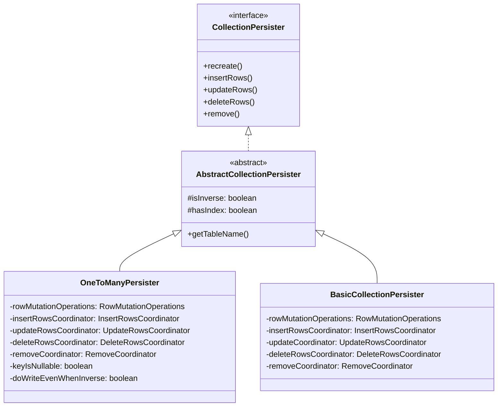
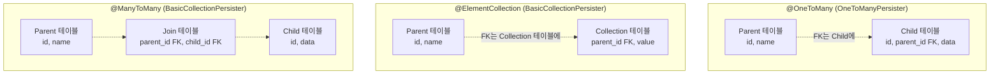
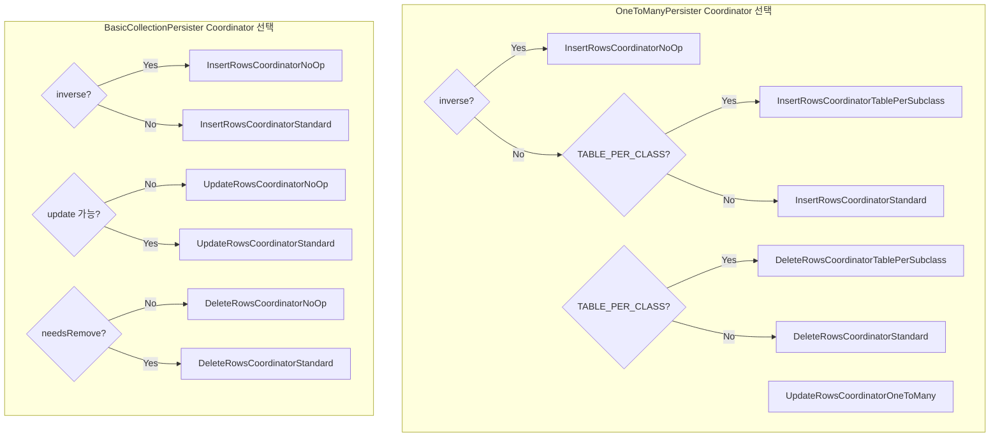

# OneToManyPersister vs BasicCollectionPersister

Hibernate가 컬렉션 관계를 영속화할 때 사용하는 두 핵심 CollectionPersister 구현체의 설계 차이, FK 소유 방향에 따른 SQL 생성 차이, 그리고 Coordinator 패턴을 비교 분석한다.

## 목차
- [1. 핵심 개념 (What)](#1-핵심-개념-what)
- [2. 왜 알아야 하는가 (Why)](#2-왜-알아야-하는가-why)
- [3. 내부 구현 분석 (How)](#3-내부-구현-분석-how)
- [4. 실전 예제](#4-실전-예제)
- [5. 정리](#5-정리)

---

## 1. 핵심 개념 (What)

Hibernate는 엔티티의 컬렉션(List, Set, Map 등)을 영속화하기 위해 `CollectionPersister`를 사용한다. 관계 유형에 따라 두 가지 구현체로 나뉜다:

- **OneToManyPersister**: `@OneToMany` 관계 전용. FK가 **자식 엔티티 테이블**에 존재
- **BasicCollectionPersister**: `@ElementCollection`과 `@ManyToMany` 관계용. FK가 **중간 테이블(join table)** 또는 **컬렉션 테이블**에 존재



## 2. 왜 알아야 하는가 (Why)

- **SQL 최적화**: 같은 `@OneToMany`라도 inverse 설정 여부에 따라 추가 UPDATE 발생 여부가 달라진다.
- **N+1 방지**: 컬렉션 변경 시 발생하는 SQL 패턴을 이해해야 불필요한 쿼리를 줄일 수 있다.
- **@ElementCollection vs @OneToMany 선택**: 각각의 내부 Persister 동작이 다르므로, 성능 특성을 알고 선택해야 한다.
- **inverse 동작 디버깅**: `mappedBy`를 설정했을 때와 안 했을 때의 SQL 차이를 명확히 이해할 수 있다.

## 3. 내부 구현 분석 (How)

### 3.1 FK 소유 방향의 근본적 차이

두 Persister의 가장 큰 차이는 **FK가 어디에 있느냐**이다.



### 3.2 OneToManyPersister의 특이한 동작

OneToManyPersister는 FK가 자식 엔티티 테이블에 있기 때문에, 컬렉션 조작 시 자식 테이블의 FK 컬럼을 **UPDATE**로 변경한다.

```java
// OneToManyPersister.java (line 81~116)
public class OneToManyPersister extends AbstractCollectionPersister {
    private final RowMutationOperations rowMutationOperations;
    private final InsertRowsCoordinator insertRowsCoordinator;
    private final UpdateRowsCoordinator updateRowsCoordinator;
    private final DeleteRowsCoordinator deleteRowsCoordinator;
    private final RemoveCoordinator removeCoordinator;

    private final boolean keyIsNullable;
    final boolean doWriteEvenWhenInverse;  // JPA 의도에 반하는 특수 케이스
    ...
}
```

**테이블 이름 결정 방식:**

```java
// OneToManyPersister.java (line 248~249)
@Override
public String getTableName() {
    return getElementPersister().getTableName();
    // 자식 엔티티의 테이블명을 반환 (자기 테이블이 아님!)
}
```

OneToManyPersister의 `getTableName()`은 **자식 엔티티(element)의 테이블명**을 반환한다. FK가 자식 테이블에 있기 때문이다.

**컬렉션 삭제(remove all) 시 SQL:**

OneToManyPersister는 DELETE가 아니라 **UPDATE SET null**을 사용한다:

```java
// OneToManyPersister.java — generateDeleteAllAst 메서드 (line 278~318)
// FK 컬럼을 null로 설정하는 UPDATE 문을 생성
valueBindings.add(
    new ColumnValueBinding(columnReference,
        new ColumnWriteFragment("null", selectableMapping))
);
```

결과 SQL:
```sql
-- OneToMany 컬렉션 전체 삭제 시
UPDATE child SET parent_id = NULL, order_col = NULL
WHERE parent_id = ?

-- 반면 BasicCollectionPersister는 진짜 DELETE
DELETE FROM collection_table WHERE parent_id = ?
```

### 3.3 BasicCollectionPersister의 직관적 동작

BasicCollectionPersister는 자체 테이블(join table 또는 collection table)에 대해 직접 INSERT/UPDATE/DELETE를 수행한다.

```java
// BasicCollectionPersister.java (line 66~84)
public class BasicCollectionPersister extends AbstractCollectionPersister {
    private final RowMutationOperations rowMutationOperations;
    private final InsertRowsCoordinator insertRowsCoordinator;
    private final UpdateRowsCoordinator updateCoordinator;
    private final DeleteRowsCoordinator deleteRowsCoordinator;
    private final RemoveCoordinator removeCoordinator;

    public BasicCollectionPersister(...) {
        super(collectionBinding, cacheAccessStrategy, creationContext);
        this.rowMutationOperations = buildRowMutationOperations();
        this.insertRowsCoordinator = buildInsertRowCoordinator();
        this.updateCoordinator = buildUpdateRowCoordinator();
        this.deleteRowsCoordinator = buildDeleteRowCoordinator();
        this.removeCoordinator = buildDeleteAllCoordinator();
    }
}
```

### 3.4 RowMutationOperations — 공통 조작 프레임워크

두 Persister 모두 `RowMutationOperations`를 사용하여 행 단위 변경 연산을 정의한다:

```java
// RowMutationOperations.java (line 27~74)
public class RowMutationOperations {
    private final CollectionMutationTarget target;

    private final OperationProducer insertRowOperationProducer;
    private final Values insertRowValues;

    private final OperationProducer updateRowOperationProducer;
    private final Values updateRowValues;
    private final Restrictions updateRowRestrictions;

    private final OperationProducer deleteRowOperationProducer;
    private final Restrictions deleteRowRestrictions;

    private JdbcMutationOperation insertRowOperation;
    private JdbcMutationOperation updateRowOperation;
    private JdbcMutationOperation deleteRowOperation;
    ...
}
```

**핵심 함수형 인터페이스:**
- `OperationProducer`: `MutatingTableReference` -> `JdbcMutationOperation` (SQL 생성)
- `Values`: 컬렉션 요소의 값을 JDBC 바인딩에 분해
- `Restrictions`: WHERE 절 조건을 JDBC 바인딩에 적용

### 3.5 Coordinator 패턴 비교



**주요 차이점:**

| Coordinator 유형 | OneToManyPersister | BasicCollectionPersister |
|---|---|---|
| Update Coordinator | `UpdateRowsCoordinatorOneToMany` | `UpdateRowsCoordinatorStandard` |
| TABLE_PER_CLASS 지원 | `TablePerSubclass` 변종 있음 | 없음 |
| inverse 처리 | `doWriteEvenWhenInverse` 특수 로직 | 단순 NoOp |
| Delete All 방식 | UPDATE SET null | DELETE |

### 3.6 doWriteEvenWhenInverse 특수 케이스

OneToManyPersister에는 JPA 스펙에 반하는 특수 동작이 있다:

```java
// OneToManyPersister.java (line 102~107)
doWriteEvenWhenInverse =
    isInverse
        && hasIndex()
        && !indexContainsFormula
        && isAnyTrue(indexColumnIsSettable)
        && !getElementPersisterInternal().managesColumns(indexColumnNames);
```

이 조건은: inverse이면서 `@OrderColumn`이 있고, 자식 엔티티 쪽에서 해당 컬럼을 매핑하지 않는 경우에 해당한다. 이 경우 Hibernate는 inverse임에도 불구하고 `@OrderColumn` 값을 직접 업데이트한다.

```java
// OneToManyPersister.java (line 176~191)
private void writeIndex(...) {
    // "If one-to-many and inverse, still need to create the index."
    // In fact this is wrong: JPA is very clear that bidirectional
    // associations are persisted from the owning side. However,
    // since this is a very ancient mistake, I have fixed it in a
    // backward-compatible way
    if (doWriteEvenWhenInverse && entries.hasNext()) {
        // index 컬럼 UPDATE 실행
    }
}
```

## 4. 실전 예제

### @OneToMany(mappedBy) — inverse 설정 시

```java
@Entity
public class Team {
    @OneToMany(mappedBy = "team")
    private List<Player> players;
}

@Entity
public class Player {
    @ManyToOne
    @JoinColumn(name = "team_id")
    private Team team;
}
```

이 경우 OneToManyPersister는 inverse로 설정되어, INSERT/UPDATE/DELETE Coordinator가 모두 **NoOp**이 된다. 실제 FK 관리는 Player 엔티티의 EntityPersister가 담당한다.

### @OneToMany (owning side) — inverse 아닌 경우

```java
@Entity
public class Team {
    @OneToMany
    @JoinColumn(name = "team_id")
    private List<Player> players;
}
```

inverse가 아니므로 OneToManyPersister가 직접 관리:

```sql
-- Player 추가 시
INSERT INTO player (id, name) VALUES (?, ?)
UPDATE player SET team_id = ? WHERE id = ?

-- Player 제거 시
UPDATE player SET team_id = NULL WHERE id = ?

-- 전체 삭제 시
UPDATE player SET team_id = NULL WHERE team_id = ?
```

### @ManyToMany — BasicCollectionPersister 사용

```java
@Entity
public class Student {
    @ManyToMany
    @JoinTable(name = "student_course",
        joinColumns = @JoinColumn(name = "student_id"),
        inverseJoinColumns = @JoinColumn(name = "course_id"))
    private Set<Course> courses;
}
```

BasicCollectionPersister가 `student_course` 조인 테이블을 직접 관리:

```sql
-- 관계 추가
INSERT INTO student_course (student_id, course_id) VALUES (?, ?)

-- 관계 제거
DELETE FROM student_course WHERE student_id = ? AND course_id = ?

-- 전체 관계 삭제
DELETE FROM student_course WHERE student_id = ?
```

### @ElementCollection — BasicCollectionPersister 사용

```java
@Entity
public class Person {
    @ElementCollection
    @CollectionTable(name = "phone_numbers",
        joinColumns = @JoinColumn(name = "person_id"))
    @Column(name = "phone")
    private Set<String> phoneNumbers;
}
```

```sql
-- 값 추가
INSERT INTO phone_numbers (person_id, phone) VALUES (?, ?)

-- 값 제거
DELETE FROM phone_numbers WHERE person_id = ? AND phone = ?
```

## 5. 정리

| 비교 항목 | OneToManyPersister | BasicCollectionPersister |
|-----------|-------------------|------------------------|
| 대상 관계 | `@OneToMany` | `@ElementCollection`, `@ManyToMany` |
| FK 위치 | 자식 엔티티 테이블 | 별도 테이블 (join/collection table) |
| `getTableName()` | 자식 엔티티 테이블명 반환 | 자체 컬렉션 테이블명 반환 |
| 삭제 SQL | `UPDATE ... SET fk = NULL` | `DELETE FROM ...` |
| inverse 시 동작 | 기본 NoOp + `doWriteEvenWhenInverse` 예외 | 단순 NoOp |
| Update Coordinator | `UpdateRowsCoordinatorOneToMany` | `UpdateRowsCoordinatorStandard` |
| TABLE_PER_CLASS 지원 | `TablePerSubclass` 변종 존재 | 없음 |
| 핵심 공통 구조 | `RowMutationOperations` | `RowMutationOperations` |

---
*참고: Hibernate ORM 6.5.x 기준*
