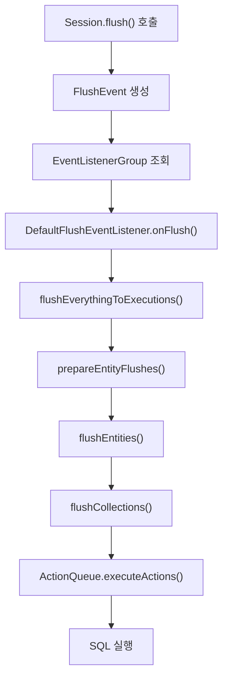
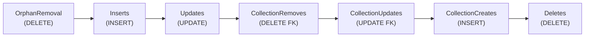

# Flush 이벤트 파이프라인 전체 흐름

Hibernate에서 Flush는 PersistenceContext의 변경 사항을 데이터베이스에 동기화하는 핵심 메커니즘이다. 이 문서에서는 FlushEvent 발생부터 ActionQueue 실행까지의 전체 파이프라인을 소스 코드 레벨에서 분석한다.

## 목차
- [1. 핵심 개념 (What)](#1-핵심-개념-what)
- [2. 왜 알아야 하는가 (Why)](#2-왜-알아야-하는가-why)
- [3. 내부 구현 분석 (How)](#3-내부-구현-분석-how)
- [4. 실전 예제](#4-실전-예제)
- [5. 정리](#5-정리)

---

## 1. 핵심 개념 (What)

### Flush의 정의

Flush는 영속성 컨텍스트(PersistenceContext)에 쌓인 변경 사항을 데이터베이스에 반영하는 과정이다. 트랜잭션 커밋 시점, JPQL 쿼리 실행 전, 또는 명시적 `flush()` 호출 시 발생한다.

### Flush 파이프라인 개요



### 핵심 참여 클래스

| 클래스 | 패키지 | 역할 |
|--------|--------|------|
| `SessionImpl` | `org.hibernate.internal` | flush() 진입점 |
| `FlushEvent` | `org.hibernate.event.spi` | Flush 이벤트 객체 |
| `DefaultFlushEventListener` | `org.hibernate.event.internal` | Flush 이벤트 처리 |
| `AbstractFlushingEventListener` | `org.hibernate.event.internal` | Flush 공통 로직 |
| `ActionQueue` | `org.hibernate.engine.spi` | Action 스케줄링 및 실행 |
| `FlushEntityEventListener` | `org.hibernate.event.internal` | 엔티티별 Flush 처리 |

---

## 2. 왜 알아야 하는가 (Why)

### 2.1 성능 최적화

Flush 타이밍을 이해하면 불필요한 SQL 실행을 방지할 수 있다:
- Auto flush가 발생하는 시점 파악
- FlushMode 설정을 통한 flush 빈도 제어
- Batch insert/update 최적화

### 2.2 트랜잭션 무결성

Flush 순서는 데이터베이스 제약조건 충족에 직결된다:
- FK 제약조건 위반 방지 (INSERT → UPDATE 순서)
- Unique 제약조건 고려
- Cascade 전파 시점 이해

### 2.3 디버깅 능력

"왜 이 시점에 SQL이 실행되는가?"를 설명할 수 있어야 한다:
- JPQL 실행 전 auto flush
- 트랜잭션 커밋 시 flush
- Session.flush() 명시 호출

---

## 3. 내부 구현 분석 (How)

### 3.1 Flush 트리거 시점

Hibernate에서 Flush가 발생하는 세 가지 경로:

```java
// 1. 명시적 호출
session.flush();

// 2. 트랜잭션 커밋 시
transaction.commit(); // 내부에서 flush() 호출

// 3. JPQL/HQL 쿼리 실행 전 (AUTO 모드)
session.createQuery("SELECT e FROM Entity e").getResultList();
```

### 3.2 SessionImpl.flush() 진입점

```java
// SessionImpl.java
@Override
public void flush() throws HibernateException {
    checkOpen();
    doFlush();
}

private void doFlush() {
    pulseTransactionCoordinator();

    try {
        // FlushEvent 생성 및 발행
        FlushEvent event = new FlushEvent( this );
        fastSessionServices.eventListenerGroup_FLUSH
            .fireEventOnEachListener( event, FlushEventListener::onFlush );
    }
    catch (RuntimeException e) {
        throw getExceptionConverter().convert( e );
    }
}
```

### 3.3 DefaultFlushEventListener 처리

```java
// DefaultFlushEventListener.java
public class DefaultFlushEventListener
    extends AbstractFlushingEventListener
    implements FlushEventListener {

    @Override
    public void onFlush(FlushEvent event) throws HibernateException {
        final EventSource source = event.getSession();
        final PersistenceContext persistenceContext = source.getPersistenceContextInternal();

        if ( persistenceContext.getNumberOfManagedEntities() > 0 ||
             persistenceContext.getCollectionEntriesSize() > 0 ) {

            // 핵심 Flush 로직 실행
            flushEverythingToExecutions( event );
            performExecutions( source );
            postFlush( source );
        }
    }
}
```

### 3.4 flushEverythingToExecutions() 상세

이 메서드가 Flush의 핵심이다. 변경 감지 → Action 생성 → 큐잉까지 처리한다.

```java
// AbstractFlushingEventListener.java
protected void flushEverythingToExecutions(FlushEvent event) {
    final EventSource session = event.getSession();
    final PersistenceContext persistenceContext = session.getPersistenceContextInternal();

    // 1단계: Flush 전처리
    persistenceContext.preFlush();

    // 2단계: 엔티티 Flush 준비 (새로 persist된 엔티티 처리)
    prepareEntityFlushes( session, persistenceContext );

    // 3단계: Cascade 적용
    prepareCollectionFlushes( persistenceContext );

    // 4단계: Dirty Checking 및 Action 생성
    flushEntities( event, persistenceContext );
    flushCollections( event, persistenceContext );

    // 5단계: ActionQueue 정렬
    session.getActionQueue().sortActions();
}
```

### 3.5 flushEntities() - Dirty Checking 핵심

```java
// AbstractFlushingEventListener.java
private void flushEntities(final FlushEvent event, final PersistenceContext persistenceContext) {
    final EventSource source = event.getSession();
    final Iterable<FlushEntityEventListener> listeners =
        source.getFactory()
            .getFastSessionServices()
            .eventListenerGroup_FLUSH_ENTITY
            .listeners();

    // 모든 관리 엔티티를 순회
    for ( Map.Entry<Object, EntityEntry> me : persistenceContext.reentrantSafeEntityEntries() ) {
        EntityEntry entry = me.getValue();
        Status status = entry.getStatus();

        if ( status != Status.LOADING && status != Status.GONE ) {
            // FlushEntityEvent 발생
            FlushEntityEvent entityEvent = new FlushEntityEvent( source, me.getKey(), entry );

            for ( FlushEntityEventListener listener : listeners ) {
                listener.onFlushEntity( entityEvent );
            }
        }
    }
}
```

### 3.6 DefaultFlushEntityEventListener - Action 생성

```java
// DefaultFlushEntityEventListener.java
@Override
public void onFlushEntity(FlushEntityEvent event) throws HibernateException {
    final Object entity = event.getEntity();
    final EntityEntry entry = event.getEntityEntry();
    final Status status = entry.getStatus();

    // Dirty Checking 수행
    final Object[] values = event.getPropertyValues();
    final boolean mightBeDirty = entry.requiresDirtyCheck( entity );

    if ( mightBeDirty ) {
        // 스냅샷과 현재 상태 비교
        dirtyCheck( event );

        if ( event.isDirty() ) {
            // EntityUpdateAction 생성 및 큐잉
            scheduleUpdate( event );
        }
    }
}

private void scheduleUpdate(FlushEntityEvent event) {
    final EventSource session = event.getSession();
    final EntityEntry entry = event.getEntityEntry();
    final EntityPersister persister = entry.getPersister();

    // UPDATE Action 생성
    session.getActionQueue().addAction(
        new EntityUpdateAction(
            entry.getId(),
            event.getPropertyValues(),
            event.getDirtyProperties(),
            event.hasDirtyCollection(),
            entry.getLoadedState(),
            entry.getVersion(),
            entity,
            entry.getRowId(),
            persister,
            session
        )
    );
}
```

### 3.7 ActionQueue 실행 순서

ActionQueue는 FK 제약조건을 만족시키기 위해 엄격한 순서로 Action을 실행한다:



```java
// ActionQueue.java
public void executeActions() throws HibernateException {
    // 1. OrphanRemoval 삭제
    executeOrphanRemovals();

    // 2. 엔티티 INSERT (부모 먼저)
    executeInserts();

    // 3. 엔티티 UPDATE
    executeUpdates();

    // 4. Collection 요소 제거 (FK null 설정)
    executeCollectionRemovals();

    // 5. Collection 업데이트 (FK 설정)
    executeCollectionUpdates();

    // 6. Collection 요소 추가
    executeCollectionCreations();

    // 7. 엔티티 DELETE (자식 먼저)
    executeDeletions();
}
```

### 3.8 sortActions() - 실행 순서 최적화

```java
// ActionQueue.java
public void sortActions() {
    // INSERT: 부모 → 자식 순서로 정렬 (FK 제약조건)
    if ( insertions.size() > 1 ) {
        insertions.sort( InsertActionSorter.INSTANCE );
    }

    // DELETE: 자식 → 부모 순서로 정렬
    if ( deletions.size() > 1 ) {
        deletions.sort( DeleteActionSorter.INSTANCE );
    }
}

// InsertActionSorter.java
public class InsertActionSorter implements Comparator<EntityInsertAction> {
    @Override
    public int compare(EntityInsertAction a1, EntityInsertAction a2) {
        // 상속 계층과 연관관계를 고려한 정렬
        EntityPersister p1 = a1.getPersister();
        EntityPersister p2 = a2.getPersister();

        // p2가 p1의 자식이면 p1을 먼저 INSERT
        if ( p1.isSubclassEntityPersister( p2 ) ) {
            return -1;
        }
        // p1이 p2를 참조하면 p2를 먼저 INSERT
        if ( p1.hasAssociationTo( p2 ) ) {
            return 1;
        }
        return 0;
    }
}
```

### 3.9 FlushMode와 Auto Flush

```java
// SessionImpl.java
public void autoFlushIfRequired(Set<String> querySpaces) {
    if ( !isTransactionInProgress() ) {
        return;
    }

    AutoFlushEvent event = new AutoFlushEvent( querySpaces, this );
    fastSessionServices.eventListenerGroup_AUTO_FLUSH
        .fireEventOnEachListener( event, AutoFlushEventListener::onAutoFlush );
}

// DefaultAutoFlushEventListener.java
@Override
public void onAutoFlush(AutoFlushEvent event) {
    final EventSource source = event.getSession();

    // 쿼리 대상 테이블과 변경된 엔티티 테이블이 겹치는지 확인
    if ( flushMightBeNeeded( source, event.getQuerySpaces() ) ) {
        // flush 실행
        flushEverythingToExecutions( event );
        performExecutions( source );
        postFlush( source );
    }
}
```

---

## 4. 실전 예제

### 4.1 Flush 타이밍 제어

```java
@Transactional
public void batchInsertWithFlush(List<Item> items) {
    for (int i = 0; i < items.size(); i++) {
        entityManager.persist(items.get(i));

        // 50건마다 flush & clear로 메모리 관리
        if (i % 50 == 0) {
            entityManager.flush();
            entityManager.clear();
        }
    }
}
```

### 4.2 FlushMode 설정

```java
// AUTO (기본값) - 쿼리 전 자동 flush
session.setHibernateFlushMode(FlushMode.AUTO);

// COMMIT - 트랜잭션 커밋 시에만 flush
session.setHibernateFlushMode(FlushMode.COMMIT);

// MANUAL - 명시적 flush() 호출 시에만
session.setHibernateFlushMode(FlushMode.MANUAL);
```

### 4.3 Flush 이벤트 리스너 커스터마이징

```java
public class AuditFlushEventListener implements FlushEventListener {

    @Override
    public void onFlush(FlushEvent event) throws HibernateException {
        PersistenceContext pc = event.getSession().getPersistenceContextInternal();

        // Flush 전 감사 로깅
        log.info("Flushing {} entities, {} collections",
            pc.getNumberOfManagedEntities(),
            pc.getCollectionEntriesSize());
    }
}

// 리스너 등록
configuration.setListener(EventType.FLUSH, new AuditFlushEventListener());
```

### 4.4 Batch Insert 최적화

```java
@Entity
public class Product {
    @Id
    @GeneratedValue(strategy = GenerationType.SEQUENCE, generator = "product_seq")
    @SequenceGenerator(name = "product_seq", sequenceName = "product_seq", allocationSize = 50)
    private Long id;
}

// application.properties
spring.jpa.properties.hibernate.jdbc.batch_size=50
spring.jpa.properties.hibernate.order_inserts=true
spring.jpa.properties.hibernate.order_updates=true
```

---

## 5. 정리

### Flush 파이프라인 핵심 정리

| 단계 | 클래스 | 주요 작업 |
|------|--------|----------|
| 1. 이벤트 발생 | `SessionImpl` | `FlushEvent` 생성 |
| 2. 이벤트 처리 | `DefaultFlushEventListener` | Flush 로직 시작 |
| 3. 엔티티 처리 | `AbstractFlushingEventListener` | Dirty Checking |
| 4. Action 생성 | `DefaultFlushEntityEventListener` | INSERT/UPDATE/DELETE Action |
| 5. 정렬 | `ActionQueue` | FK 제약조건 고려 정렬 |
| 6. 실행 | `ActionQueue` | SQL 실행 |

### FlushMode 비교

| FlushMode | flush 시점 | 사용 시나리오 |
|-----------|-----------|--------------|
| `AUTO` | 쿼리 전 + 커밋 시 | 일반적인 CRUD |
| `COMMIT` | 커밋 시에만 | 읽기 위주 트랜잭션 |
| `MANUAL` | 명시적 호출만 | 배치 처리 |

### Action 실행 순서

```
OrphanRemoval → INSERT → UPDATE → CollectionRemove → CollectionUpdate → CollectionCreate → DELETE
```

---
*참고: Hibernate ORM 6.x 기준*
