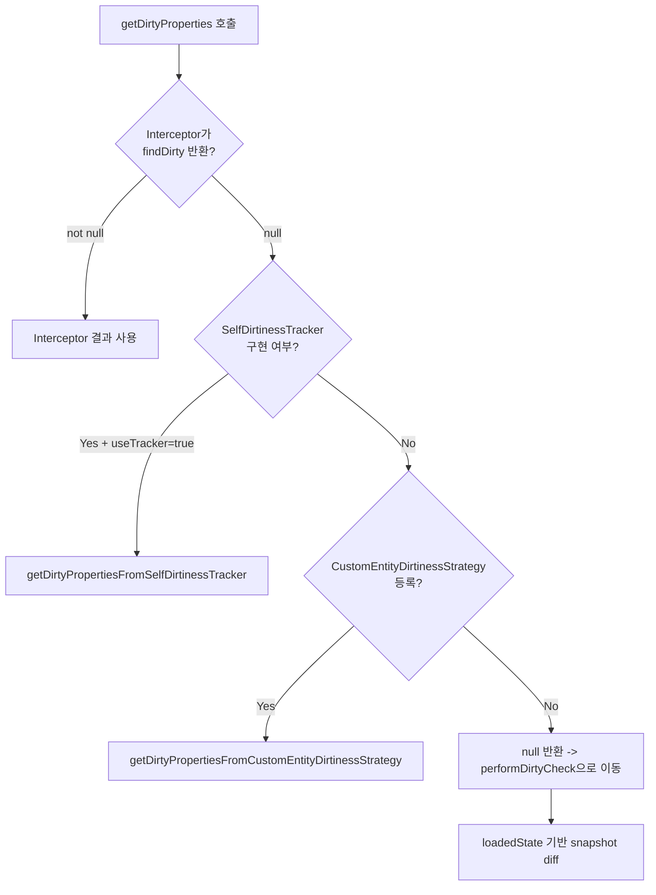
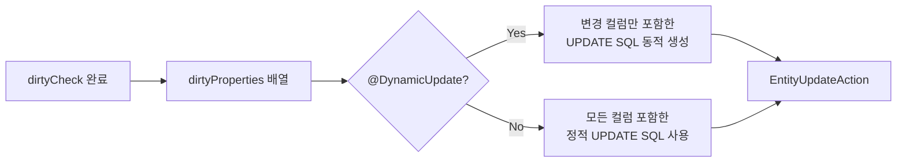

# Dirty Checking 심화

Hibernate의 Dirty Checking은 엔티티의 속성 변경을 감지하여 필요한 UPDATE SQL만 생성하는 핵심 메커니즘이다. 이 문서에서는 속성 수준 변경 감지의 내부 구현, 비교 전략, 그리고 `@DynamicUpdate`와의 연동을 분석한다.

## 목차
- [1. 핵심 개념 (What)](#1-핵심-개념-what)
- [2. 왜 알아야 하는가 (Why)](#2-왜-알아야-하는가-why)
- [3. 내부 구현 분석 (How)](#3-내부-구현-분석-how)
- [4. 실전 예제](#4-실전-예제)
- [5. 정리](#5-정리)

---

## 1. 핵심 개념 (What)

Dirty Checking이란 flush 시점에 영속성 컨텍스트가 관리하는 엔티티의 **현재 상태(current state)**와 **스냅샷(loaded state)**을 비교하여 변경된 속성을 찾아내는 과정이다.

### 세 가지 Dirty Checking 전략

| 전략 | 결정 주체 | 성능 |
|------|-----------|------|
| **Snapshot 비교** | `EntityPersister.findDirty()` | 모든 속성 순회 비교 (기본) |
| **SelfDirtinessTracker** | Bytecode Enhancement가 주입한 트래커 | 변경된 속성명만 기록 (최적) |
| **CustomEntityDirtinessStrategy** | 사용자 정의 전략 | 애플리케이션 특화 로직 가능 |

### Dirty Checking의 진입점

flush 시 `DefaultFlushEntityEventListener.onFlushEntity()`가 각 엔티티마다 호출된다. 이 메서드에서 `EntityEntry.requiresDirtyCheck()`를 통해 dirty check가 필요한지 먼저 판단한다.

```java
// DefaultFlushEntityEventListener.java:135
final boolean mightBeDirty = entry.requiresDirtyCheck( entity );
```

## 2. 왜 알아야 하는가 (Why)

- **성능 병목 진단**: 수백 개의 엔티티가 flush될 때 dirty checking이 주요 병목이 될 수 있다. 전략 선택에 따라 성능이 크게 달라진다.
- **불필요한 UPDATE 방지**: `@DynamicUpdate`를 사용하면 변경된 컬럼만 UPDATE하지만, dirty checking 비용과의 트레이드오프를 이해해야 한다.
- **커스텀 타입 문제 해결**: `UserType`이나 `@Embeddable`의 동등성 비교가 올바르지 않으면 매 flush마다 불필요한 UPDATE가 발생한다.

## 3. 내부 구현 분석 (How)

### 3.1 EntityEntry와 스냅샷 관리

`EntityEntry`는 엔티티의 영속 상태 메타데이터를 보관하는 인터페이스다.

```java
// EntityEntry.java (핵심 메서드)
public interface EntityEntry {
    Object[] getLoadedState();          // 로딩 시점의 스냅샷
    Object[] getDeletedState();         // 삭제 예정 상태
    Status getStatus();                 // MANAGED, READ_ONLY, DELETED 등
    boolean requiresDirtyCheck(Object entity);  // dirty check 필요 여부
    void postUpdate(Object entity, Object[] updatedState, Object nextVersion);
}
```

`getLoadedState()`가 반환하는 배열은 엔티티가 데이터베이스에서 로딩되거나 persist될 때 캡처된 **속성 값 스냅샷**이다. 이 스냅샷이 dirty checking의 비교 기준이 된다.

### 3.2 Dirty Check 우선순위 체인

`DefaultFlushEntityEventListener.getDirtyProperties()`는 다음 순서로 dirty 속성을 결정한다.



소스 코드에서 이 우선순위는 명확히 드러난다:

```java
// DefaultFlushEntityEventListener.java:539-549
private static int[] getDirtyProperties(FlushEntityEvent event) {
    final int[] dirtyProperties = getDirtyPropertiesFromInterceptor( event );
    if ( dirtyProperties != null ) {
        return dirtyProperties;
    }
    else {
        final Object entity = event.getEntity();
        return isSelfDirtinessTracker( entity )
                && asManagedEntity( entity ).$$_hibernate_useTracker()
                ? getDirtyPropertiesFromSelfDirtinessTracker(
                        asSelfDirtinessTracker( entity ), event )
                : getDirtyPropertiesFromCustomEntityDirtinessStrategy( event );
    }
}
```

### 3.3 Snapshot 기반 Dirty Check (기본 전략)

위의 체인에서 dirty 속성을 찾지 못하면 `performDirtyCheck()`가 실행된다. 이 메서드는 세 가지 경우를 구분한다:

**경우 1: loadedState가 존재하는 경우 (일반적)**

```java
// DefaultFlushEntityEventListener.java:489-492
if ( loadedState != null ) {
    dirtyProperties = persister.findDirty( values, loadedState, entity, session );
    dirtyCheckPossible = true;
}
```

`EntityPersister.findDirty()`는 내부적으로 각 속성의 `Type.isDirty()`를 호출하여 현재 값과 스냅샷을 비교한다.

**경우 2: DELETED 상태의 non-modifiable 엔티티**

```java
// DefaultFlushEntityEventListener.java:494-510
else if ( entry.getStatus() == Status.DELETED && !entry.isModifiableEntity() ) {
    final Object[] currentState = persister.getValues( event.getEntity() );
    dirtyProperties = persister.findDirty(
            entry.getDeletedState(), currentState, entity, session );
}
```

**경우 3: loadedState가 없는 경우**

데이터베이스 스냅샷을 직접 조회하여 비교한다. `selectBeforeUpdate`가 설정된 경우에 해당한다.

### 3.4 SelfDirtinessTracker를 통한 최적화

Bytecode Enhancement가 활성화되면 엔티티 클래스에 `SelfDirtinessTracker` 인터페이스가 주입된다. 이 인터페이스는 setter 호출 시 변경된 속성명을 자동으로 기록한다.

```java
// SelfDirtinessTracker.java
public interface SelfDirtinessTracker {
    boolean $$_hibernate_hasDirtyAttributes();
    String[] $$_hibernate_getDirtyAttributes();
    void $$_hibernate_trackChange(String attributes);
    void $$_hibernate_clearDirtyAttributes();
}
```

`getDirtyPropertiesFromSelfDirtinessTracker()`에서는 트래커가 보고한 dirty 속성명을 인덱스 배열로 변환한다:

```java
// DefaultFlushEntityEventListener.java:583-588
private static int[] getDirtyPropertiesFromSelfDirtinessTracker(
        SelfDirtinessTracker tracker, FlushEntityEvent event) {
    final var entry = event.getEntityEntry();
    final var persister = entry.getPersister();
    return tracker.$$_hibernate_hasDirtyAttributes()
                || persister.hasMutableProperties()
            ? resolveDirtyAttributeIndex( tracker, event, persister, entry )
            : EMPTY_INT_ARRAY;
}
```

`hasMutableProperties()`가 `true`인 경우에도 인덱스를 확인하는 이유는, mutable 타입(예: `Date`, `Collection`)은 내부 상태가 변경되어도 setter가 호출되지 않아 트래커가 감지하지 못하기 때문이다.

### 3.5 Type.isDirty()와 비교 전략

각 Hibernate Type은 자체적인 동등성 비교 로직을 가진다:

```java
// DefaultFlushEntityEventListener.java:372-375 (내부 유틸)
private static boolean isDirty(Type types, Object state, Object newState) {
    return state == UNFETCHED_PROPERTY && newState != UNFETCHED_PROPERTY
        || state != newState && !types.isEqual( state, newState );
}
```

- **참조 비교 우선**: `state != newState`로 빠르게 동일 객체를 걸러낸다
- **UNFETCHED_PROPERTY 처리**: lazy 로딩되지 않은 속성이 새로 로딩되면 dirty로 판단
- **Type.isEqual() 위임**: 각 타입별 구체적인 동등성 비교 수행

### 3.6 @DynamicUpdate와의 연동

`@DynamicUpdate`가 적용된 엔티티는 dirty checking 결과인 `dirtyProperties` 배열을 활용하여 변경된 컬럼만 포함하는 UPDATE SQL을 동적으로 생성한다.



`scheduleUpdate()` 메서드에서 `dirtyProperties`를 `EntityUpdateAction`에 전달한다:

```java
// DefaultFlushEntityEventListener.java:264-283
session.getActionQueue().addAction(
    new EntityUpdateAction(
        entry.getId(),
        values,
        dirtyProperties,        // dirty 속성 인덱스 배열
        event.hasDirtyCollection(),
        entry.getLoadedState(),
        entry.getVersion(),
        nextVersion,
        entity,
        entry.getRowId(),
        persister,
        session
    )
);
```

### 3.7 Collection Dirty Check

컬렉션은 엔티티와 별도로 dirty check된다. `isCollectionDirtyCheckNecessary()`는 versioned 엔티티의 컬렉션에 대해서만 dirty check를 수행한다:

```java
// DefaultFlushEntityEventListener.java:449-453
private boolean isCollectionDirtyCheckNecessary(
        EntityPersister persister, Status status) {
    return ( status == Status.MANAGED || status == Status.READ_ONLY )
        && persister.isVersioned()
        && persister.hasCollections();
}
```

## 4. 실전 예제

### 4.1 불필요한 UPDATE 디버깅

로그에서 dirty check 결과를 확인하려면:

```properties
# Dirty checking 관련 로그 활성화
logging.level.org.hibernate.event.internal=TRACE
```

`logDirtyProperties()`에서 변경된 속성명이 출력된다:

```
TRACE o.h.e.i.DefaultFlushEntityEventListener -
  Found dirty properties [com.example.Order#1] : [status, modifiedDate]
```

### 4.2 커스텀 타입의 Dirty Checking 주의사항

```java
@Entity
public class Product {
    @Type(MoneyType.class)
    private Money price;  // 커스텀 UserType
}
```

`MoneyType`이 `equals()`를 올바르게 구현하지 않으면 매 flush마다 UPDATE가 발생한다. `UserType.equals()` 메서드가 Hibernate의 dirty check에서 호출되기 때문이다.

### 4.3 Enhancement vs Snapshot 비교 성능

```java
// Enhancement 활성화 (Gradle)
plugins {
    id 'org.hibernate.orm' version '6.5.x'
}
hibernate {
    enhancement {
        enableDirtyTracking = true  // SelfDirtinessTracker 주입
    }
}
```

Enhancement가 활성화되면 setter 호출 시 `$$_hibernate_trackChange(fieldName)`이 자동 삽입되어, flush 시 전체 속성을 순회하지 않고 변경된 속성만 즉시 파악할 수 있다.

## 5. 정리

| 항목 | 내용 |
|------|------|
| **진입점** | `DefaultFlushEntityEventListener.onFlushEntity()` |
| **스냅샷 저장소** | `EntityEntry.getLoadedState()` |
| **우선순위** | Interceptor > SelfDirtinessTracker > CustomEntityDirtinessStrategy > Snapshot Diff |
| **비교 방식** | 참조 비교 우선, `Type.isEqual()` 위임 |
| **Enhancement 효과** | setter 인터셉트로 O(dirty) 복잡도 달성 |
| **@DynamicUpdate** | `dirtyProperties` 배열 기반 동적 SQL 생성 |
| **핵심 주의사항** | 커스텀 타입의 `equals()` 구현, mutable 타입의 트래커 한계 |

---
*참고: Hibernate ORM 6.5.x 기준*
