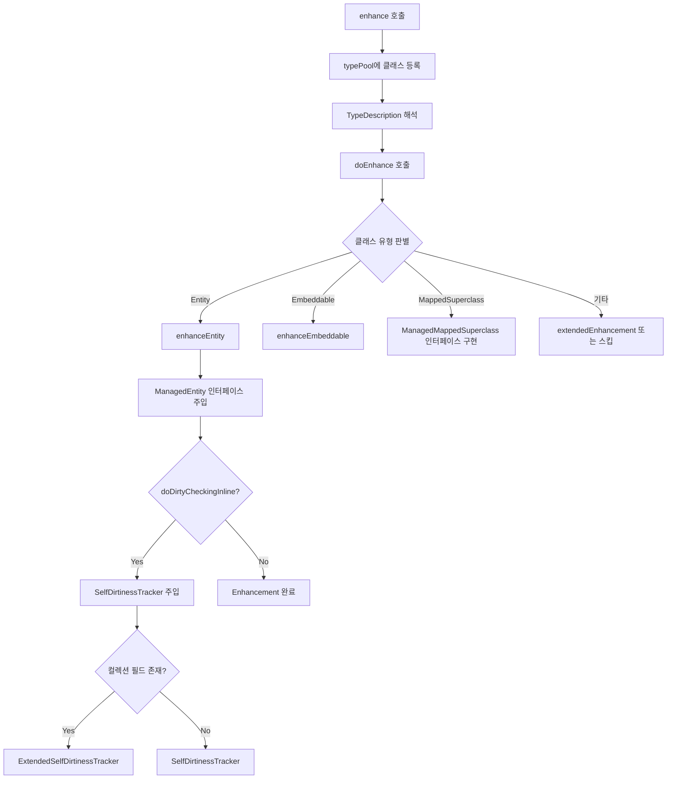
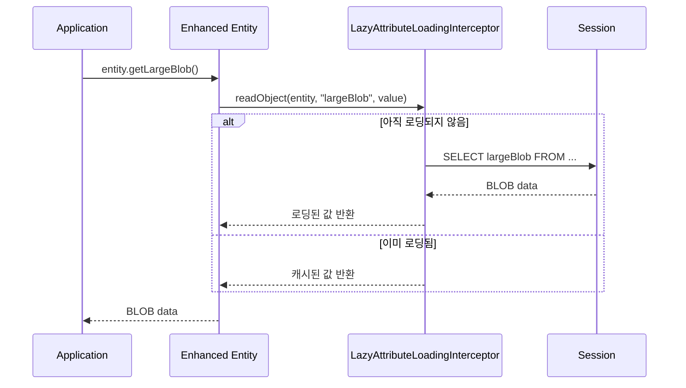

# Bytecode Enhancement 심화

Hibernate의 Bytecode Enhancement는 빌드 또는 런타임에 엔티티 클래스의 바이트코드를 변환하여 dirty tracking, lazy 로딩, 양방향 연관관계 관리 등의 기능을 주입하는 메커니즘이다.

## 목차
- [1. 핵심 개념 (What)](#1-핵심-개념-what)
- [2. 왜 알아야 하는가 (Why)](#2-왜-알아야-하는가-why)
- [3. 내부 구현 분석 (How)](#3-내부-구현-분석-how)
- [4. 실전 예제](#4-실전-예제)
- [5. 정리](#5-정리)

---

## 1. 핵심 개념 (What)

Bytecode Enhancement는 엔티티 클래스에 Hibernate 내부 인터페이스 구현을 삽입하는 과정이다. 두 가지 접근 방식이 존재한다:

| 방식 | 시점 | 도구 | 특징 |
|------|------|------|------|
| **빌드타임 Enhancement** | 컴파일 후 | Gradle/Maven 플러그인 | `.class` 파일 직접 수정, 배포 시 추가 비용 없음 |
| **런타임 프록시** | 로딩 시 | ByteBuddy 동적 서브클래싱 | 지연 로딩용 프록시, 원본 클래스 변경 없음 |

### Enhancement가 주입하는 인터페이스

- `ManagedEntity`: EntityEntry, prev/next 링크 관리 (영속성 컨텍스트 연결 리스트)
- `SelfDirtinessTracker`: 변경 속성 자체 추적
- `PersistentAttributeInterceptable`: 필드 수준 lazy 로딩 인터셉터

## 2. 왜 알아야 하는가 (Why)

- **필드 수준 Lazy 로딩**: `@Basic(fetch = LAZY)`는 Enhancement 없이는 동작하지 않는다. BLOB/CLOB 컬럼을 포함한 엔티티에서 필수적이다.
- **Dirty Tracking 최적화**: 수백 개 속성을 가진 엔티티의 snapshot diff 비용을 O(1) 수준으로 줄인다.
- **디버깅**: Enhanced 엔티티는 디버거에서 `$$_hibernate_` 접두사 필드가 보이며, 예상치 못한 동작의 원인이 될 수 있다.
- **Quarkus/Spring Native 호환**: 빌드타임 Enhancement는 네이티브 이미지 빌드에서 런타임 프록시의 한계를 극복한다.

## 3. 내부 구현 분석 (How)

### 3.1 BytecodeProviderImpl - Enhancement의 진입점

`BytecodeProviderImpl`은 Hibernate의 `BytecodeProvider` SPI 구현체로, ByteBuddy를 사용한다.

```java
// BytecodeProviderImpl.java:57
public class BytecodeProviderImpl implements BytecodeProvider {
    private final ByteBuddyState byteBuddyState;
    private final EnhancerImplConstants constants;
    private final ByteBuddyProxyHelper byteBuddyProxyHelper;
}
```

Enhancer 생성 팩토리 메서드:

```java
// BytecodeProviderImpl.java:550-552
@Override
public Enhancer getEnhancer(EnhancementContext enhancementContext) {
    return new EnhancerImpl( enhancementContext, byteBuddyState );
}
```

`ReflectionOptimizer`도 ByteBuddy로 생성하여 리플렉션 대신 직접 필드 접근 코드를 생성한다:

```java
// BytecodeProviderImpl.java:169-176 (핵심 부분)
return new ReflectionOptimizerImpl(
    fastClass != null
        ? (ReflectionOptimizer.InstantiationOptimizer) fastClass.newInstance()
        : null,
    (ReflectionOptimizer.AccessOptimizer) bulkAccessor.newInstance()
);
```

### 3.2 EnhancerImpl - 바이트코드 변환 엔진

`EnhancerImpl`은 `Enhancer` 인터페이스의 핵심 구현체다.



`enhance()` 메서드의 핵심 흐름:

```java
// EnhancerImpl.java:146-168
@Override
public byte[] enhance(String className, byte[] originalBytes)
        throws EnhancementException {
    final String safeClassName = className.replace( '/', '.' );
    typePool.registerClassNameAndBytes( safeClassName, originalBytes );
    try {
        final var typeDescription = typePool.describe( safeClassName ).resolve();
        return byteBuddyState.rewrite( typePool, safeClassName, byteBuddy ->
            doEnhance(
                () -> byteBuddy.ignore( constants.defaultFinalizer() )
                    .redefine( typeDescription, typePool.asClassFileLocator() )
                    .annotateType( infoAnnotationList ),
                typeDescription
            )
        );
    }
    // ...
}
```

### 3.3 엔티티 Enhancement 상세

`enhanceEntity()`가 주입하는 필드와 메서드:

```java
// EnhancerImpl.java:312-384 (핵심 구조)
private DynamicType.Builder<?> enhanceEntity(
        DynamicType.Builder<?> builder, TypeDescription entityClass) {

    // 1. ManagedEntity 인터페이스 구현
    builder = builder
        .implement( constants.INTERFACES_for_ManagedEntity )
        .defineMethod( ENTITY_INSTANCE_GETTER_NAME, constants.TypeObject,
                       constants.modifierPUBLIC )
        .intercept( FixedValue.self() );

    // 2. EntityEntry 필드 + getter/setter
    builder = addFieldWithGetterAndSetter( builder,
        constants.TypeEntityEntry,
        "$$_hibernate_entityEntryHolder", ... );

    // 3. 영속성 컨텍스트 연결 리스트용 prev/next
    builder = addFieldWithGetterAndSetter( builder,
        constants.TypeManagedEntity,
        "$$_hibernate_previousManagedEntity", ... );
    builder = addFieldWithGetterAndSetter( builder,
        constants.TypeManagedEntity,
        "$$_hibernate_nextManagedEntity", ... );

    // 4. lazy 로딩 인터셉터 (lazy 속성이 있을 때만)
    builder = addInterceptorHandling( builder, entityClass );

    // 5. Dirty Tracking (설정에 따라)
    if ( enhancementContext.doDirtyCheckingInline() ) {
        // 컬렉션 필드 유무에 따라 분기
        final var collectionFields = collectCollectionFields( entityClass );
        if ( collectionFields.isEmpty() ) {
            return implementSelfDirtinessTracker( builder );
        } else {
            return enhanceCollectionFields( entityClass, collectionFields,
                implementExtendedSelfDirtinessTracker( builder ) );
        }
    }
}
```

### 3.4 SelfDirtinessTracker 주입 상세

Enhancement는 다음 필드와 메서드를 엔티티에 삽입한다:

```java
// EnhancerImpl.java:408-426 (SelfDirtinessTracker 주입)
private DynamicType.Builder<?> implementSelfDirtinessTracker(
        DynamicType.Builder<?> builder) {
    return builder.implement( constants.INTERFACES_for_SelfDirtinessTracker )
        // dirty 속성 추적 필드
        .defineField( "$$_hibernate_tracker",
            DirtyTracker.class, PRIVATE_TRANSIENT )
        // 변경 알림 메서드
        .defineMethod( "$$_hibernate_trackChange", void.class, PUBLIC )
            .withParameter( String.class )
            .intercept( implementationTrackChange )
        // dirty 속성 조회
        .defineMethod( "$$_hibernate_getDirtyAttributes",
            String[].class, PUBLIC )
            .intercept( implementationGetDirtyAttributes )
        // dirty 여부 확인
        .defineMethod( "$$_hibernate_hasDirtyAttributes",
            boolean.class, PUBLIC )
            .intercept( implementationAreFieldsDirty )
        // dirty 속성 초기화
        .defineMethod( "$$_hibernate_clearDirtyAttributes",
            void.class, PUBLIC )
            .intercept( implementationClearDirtyAttributes );
}
```

### 3.5 ByteBuddyEnhancementContext - 컨텍스트 위임자

`ByteBuddyEnhancementContext`는 사용자가 제공한 `EnhancementContext`를 ByteBuddy의 타입 시스템과 연결하는 어댑터다.

```java
// ByteBuddyEnhancementContext.java:32-45
class ByteBuddyEnhancementContext {
    private final EnhancementContext enhancementContext;
    private final EnhancerImplConstants constants;
    // getter 캐시 (대규모 모델 최적화)
    private final ConcurrentHashMap<TypeDescription,
        Map<String, MethodDescription>> getterByTypeMap;
}
```

getter 해석에서 lock striping 기법을 사용하여 대규모 모델의 동시성 문제를 해결한다:

```java
// ByteBuddyEnhancementContext.java:170-194
private Map<String, MethodDescription> getGetters(TypeDescription erasure) {
    var getters = getterByTypeMap.get( erasure );
    if ( getters == null ) {
        // ConcurrentHashMap.computeIfAbsent의 과도한 lock 대신
        // 수동 lock striping 사용
        final Object candidateLock = new Object();
        final Object existingLock =
            locksMap.putIfAbsent( lockKey, candidateLock );
        synchronized (lock) {
            getters = MethodGraph.Compiler.DEFAULT.compile( erasure )
                .listNodes().asMethodList()
                .filter( IS_GETTER ).stream()
                .collect( toMap( MethodDescription::getActualName,
                                 identity() ) );
            getterByTypeMap.put( erasure, getters );
        }
    }
    return getters;
}
```

### 3.6 필드 수준 Lazy 로딩

Enhancement로 `PersistentAttributeInterceptable`이 주입되면, 필드 접근 시 인터셉터가 개입하여 lazy 로딩을 수행한다.



인터셉터 주입 조건:

```java
// EnhancerImpl.java:778-793
private DynamicType.Builder<?> addInterceptorHandling(
        DynamicType.Builder<?> builder, TypeDescription managedCtClass) {
    if ( enhancementContext.hasLazyLoadableAttributes( managedCtClass ) ) {
        return addFieldWithGetterAndSetter(
            builder.implement( INTERFACES_for_PersistentAttributeInterceptable ),
            TypePersistentAttributeInterceptor,
            "$$_hibernate_attributeInterceptor", ...
        );
    }
    return builder;
}
```

### 3.7 이미 Enhanced된 클래스 처리

`EnhancerImpl`은 `@EnhancementInfo` 어노테이션으로 이미 enhancement된 클래스를 감지한다:

```java
// EnhancerImpl.java:191-209
if ( alreadyEnhanced( managedCtClass ) ) {
    final var infoAnnotation =
        managedCtClass.getDeclaredAnnotations()
            .ofType( EnhancementInfo.class );
    if ( infoAnnotation != null ) {
        verifyReEnhancement( managedCtClass, infoAnnotation.load(),
                             enhancementContext );
    }
    return null;  // 스킵
}
```

버전 불일치 시 `VersionMismatchException`이 발생한다.

## 4. 실전 예제

### 4.1 빌드타임 Enhancement 설정 (Gradle)

```groovy
plugins {
    id 'org.hibernate.orm' version '6.5.x'
}

hibernate {
    enhancement {
        enableDirtyTracking = true
        enableLazyInitialization = true
        enableAssociationManagement = true
    }
}
```

### 4.2 필드 수준 Lazy 로딩

```java
@Entity
public class Document {
    @Id
    private Long id;
    private String title;

    @Basic(fetch = FetchType.LAZY)
    @Lob
    private byte[] content;  // Enhancement 없이는 EAGER로 동작
}
```

Enhancement 활성화 후 `content` 필드는 실제 접근 시점까지 로딩이 지연된다.

### 4.3 Enhanced 클래스의 구조 확인

Enhanced 엔티티를 디컴파일하면 다음과 같은 필드가 추가된다:

```java
// Enhancement 후 (개념적)
public class Product implements ManagedEntity, SelfDirtinessTracker,
                                PersistentAttributeInterceptable {
    // 원본 필드
    private Long id;
    private String name;

    // Enhancement가 추가한 필드
    @Transient private transient EntityEntry $$_hibernate_entityEntryHolder;
    @Transient private transient ManagedEntity $$_hibernate_previousManagedEntity;
    @Transient private transient ManagedEntity $$_hibernate_nextManagedEntity;
    @Transient private transient DirtyTracker $$_hibernate_tracker;
    @Transient private transient PersistentAttributeInterceptor
                                     $$_hibernate_attributeInterceptor;

    // setter에 dirty tracking 코드 삽입
    public void setName(String name) {
        $$_hibernate_trackChange("name");
        this.name = name;
    }
}
```

## 5. 정리

| 항목 | 내용 |
|------|------|
| **핵심 클래스** | `BytecodeProviderImpl`, `EnhancerImpl`, `ByteBuddyEnhancementContext` |
| **바이트코드 라이브러리** | ByteBuddy (런타임 서브클래싱 + 빌드타임 리디파인) |
| **빌드타임 vs 런타임** | 빌드타임은 `.class` 직접 수정, 런타임은 프록시 서브클래싱 |
| **주입 인터페이스** | `ManagedEntity`, `SelfDirtinessTracker`, `PersistentAttributeInterceptable` |
| **Dirty Tracking** | setter에 `$$_hibernate_trackChange()` 삽입 |
| **필드 Lazy** | `PersistentAttributeInterceptor`가 필드 접근 인터셉트 |
| **대규모 모델 최적화** | getter 캐시 + lock striping으로 동시성 처리 |

---
*참고: Hibernate ORM 6.5.x 기준*
