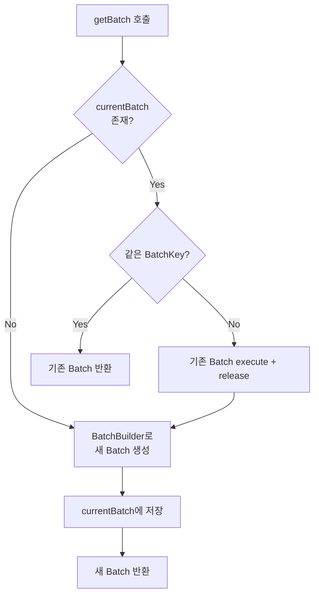
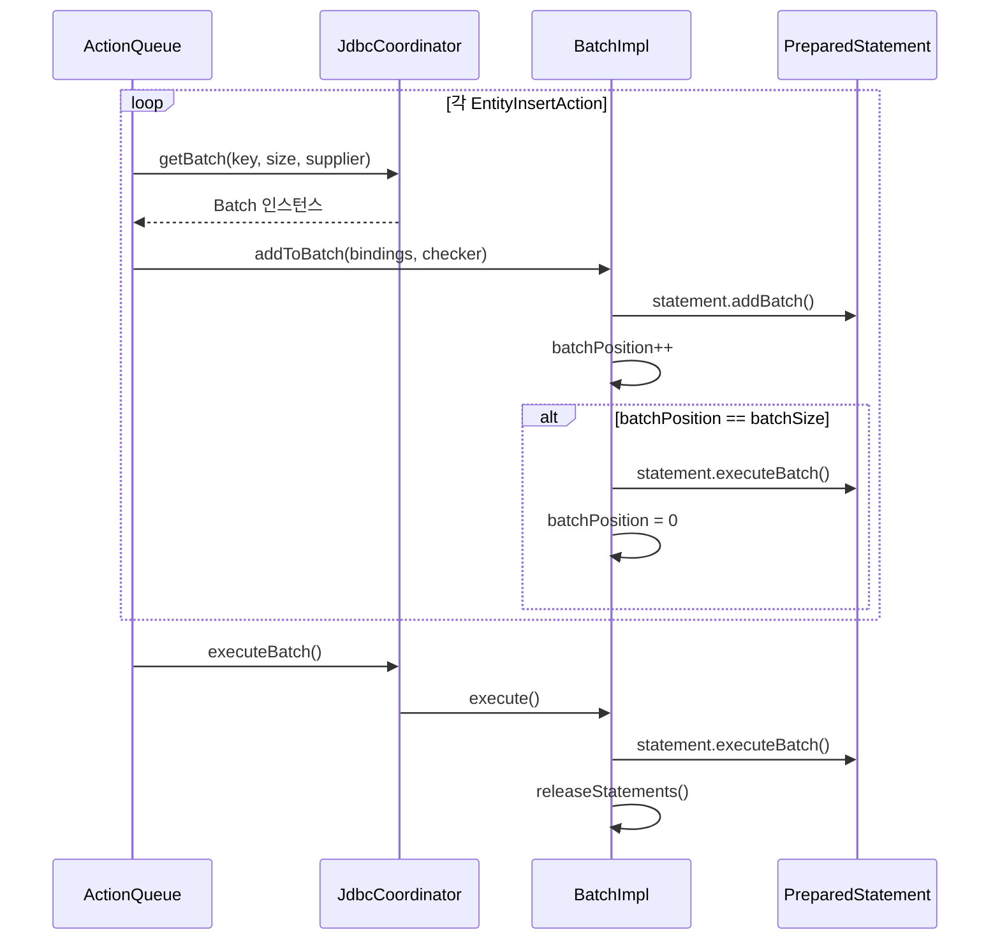

# Batch Processing 내부 구현

Hibernate의 Batch Processing은 여러 DML 문을 JDBC의 `addBatch()`/`executeBatch()`를 통해 한꺼번에 데이터베이스로 전송하는 메커니즘이다. 이 문서에서는 `BatchImpl`, `JdbcCoordinatorImpl`, `BatchBuilder`의 내부 협업 구조를 분석한다.

## 목차
- [1. 핵심 개념 (What)](#1-핵심-개념-what)
- [2. 왜 알아야 하는가 (Why)](#2-왜-알아야-하는가-why)
- [3. 내부 구현 분석 (How)](#3-내부-구현-분석-how)
- [4. 실전 예제](#4-실전-예제)
- [5. 정리](#5-정리)

---

## 1. 핵심 개념 (What)

JDBC Batch는 동일한 SQL 문에 대해 여러 파라미터 세트를 모아 한 번의 네트워크 라운드트립으로 전송하는 기법이다. Hibernate는 이를 `Batch` 인터페이스로 추상화하고, ActionQueue와 협업하여 엔티티 변경 작업을 일괄 처리한다.

### 핵심 구성 요소

| 컴포넌트 | 역할 |
|----------|------|
| `Batch` (SPI) | 배치 문장 그룹의 추상화 |
| `BatchImpl` | `Batch`의 표준 구현체 |
| `BatchBuilder` (SPI) | `Batch` 인스턴스를 생성하는 팩토리 |
| `BatchBuilderImpl` | `BatchBuilder`의 표준 구현체 |
| `JdbcCoordinatorImpl` | 배치 생명주기를 관리하는 JDBC 코디네이터 |
| `BatchKey` | 배치를 고유하게 식별하는 키 |

### ActionQueue와의 관계

ActionQueue가 flush 시 `EntityInsertAction`, `EntityUpdateAction`, `EntityDeleteAction`을 실행하면, 각 액션은 `JdbcCoordinator`를 통해 현재 배치에 SQL 문을 추가한다.

## 2. 왜 알아야 하는가 (Why)

- **대량 데이터 처리 성능**: 10,000건의 INSERT를 개별 실행하면 10,000번의 네트워크 왕복이 필요하지만, batch_size=50이면 200번으로 줄어든다.
- **배치 깨짐 이해**: 서로 다른 SQL 문이 번갈아 실행되면 배치가 분리된다. INSERT/UPDATE 순서가 바뀌면 배치 효율이 급격히 떨어진다.
- **IDENTITY 전략의 제약**: `GenerationType.IDENTITY`는 INSERT 즉시 ID를 반환받아야 하므로 배치 처리가 불가능하다.
- **메모리 관리**: 대량 배치 시 영속성 컨텍스트 메모리와 배치 크기의 균형을 맞춰야 한다.

## 3. 내부 구현 분석 (How)

### 3.1 JdbcCoordinatorImpl - 배치 관리의 중심

`JdbcCoordinatorImpl`은 현재 활성 배치를 `currentBatch` 필드로 관리한다.

```java
// JdbcCoordinatorImpl.java:48-56
public class JdbcCoordinatorImpl implements JdbcCoordinator {
    private transient final LogicalConnectionImplementor logicalConnection;
    private transient final JdbcSessionOwner owner;
    private transient final JdbcServices jdbcServices;
    private transient Batch currentBatch;
    private transient long transactionTimeOutInstant = -1;
}
```

### 3.2 배치 획득: getBatch()

`getBatch()`는 배치를 가져오거나 새로 생성하는 핵심 메서드다. **BatchKey가 다르면 기존 배치를 먼저 실행**한다.

```java
// JdbcCoordinatorImpl.java:166-188
@Override
public Batch getBatch(BatchKey key, Integer batchSize,
        Supplier<PreparedStatementGroup> statementGroupSupplier) {
    if ( currentBatch != null ) {
        if ( currentBatch.getKey().equals( key ) ) {
            return currentBatch;  // 같은 키면 기존 배치 재사용
        }
        else {
            // 다른 키면 기존 배치 실행 후 새 배치 생성
            try {
                currentBatch.execute();
            }
            finally {
                if ( currentBatch != null ) {
                    currentBatch.release();
                    currentBatch = null;
                }
            }
        }
    }
    // 새 배치 생성
    currentBatch = owner.getJdbcSessionContext().getBatchBuilder()
        .buildBatch( key, batchSize, statementGroupSupplier, this );
    return currentBatch;
}
```



### 3.3 BatchBuilderImpl - 배치 팩토리

`BatchBuilderImpl`은 글로벌 `batch_size` 설정을 기본값으로 사용하되, 명시적 크기를 오버라이드할 수 있다.

```java
// BatchBuilderImpl.java:29-64
public class BatchBuilderImpl implements BatchBuilder {
    private final int globalBatchSize;

    public BatchBuilderImpl(int globalBatchSize) {
        if ( globalBatchSize > 1 ) {
            BATCH_MESSAGE_LOGGER.batchingEnabled( globalBatchSize );
        }
        this.globalBatchSize = globalBatchSize;
    }

    @Override
    public Batch buildBatch(
            BatchKey key, Integer explicitBatchSize,
            Supplier<PreparedStatementGroup> statementGroupSupplier,
            JdbcCoordinator jdbcCoordinator) {
        final int batchSize = explicitBatchSize != null
            ? explicitBatchSize : globalBatchSize;
        assert batchSize > 1;
        return new BatchImpl( key, statementGroupSupplier.get(),
                              batchSize, jdbcCoordinator );
    }
}
```

### 3.4 BatchImpl - 배치 실행 엔진

`BatchImpl`은 `Batch` 인터페이스의 표준 구현체다.

```java
// BatchImpl.java:34-48
public class BatchImpl implements Batch {
    private final BatchKey key;
    private final int batchSizeToUse;
    private final PreparedStatementGroup statementGroup;
    private final JdbcCoordinator jdbcCoordinator;
    private final LinkedHashSet<BatchObserver> observers;

    private int batchPosition;        // 현재 배치에 추가된 항목 수
    private boolean batchExecuted;    // 한 번이라도 실행됐는지
}
```

### 3.5 addToBatch() - 배치에 항목 추가

```java
// BatchImpl.java:104-162
@Override
public void addToBatch(JdbcValueBindings jdbcValueBindings,
                       TableInclusionChecker inclusionChecker) {
    // 1. 각 테이블별 PreparedStatement에 바인딩
    getStatementGroup().forEachStatement( (tableName, statementDetails) -> {
        if ( inclusionChecker != null
                && !inclusionChecker.include(
                    statementDetails.getMutatingTableDetails() ) ) {
            // 테이블 제외
        }
        else {
            final var statement = statementDetails.resolveStatement();
            sqlStatementLogger.logStatement( statementDetails.getSqlString() );
            jdbcValueBindings.beforeStatement( statementDetails );
            try {
                statement.addBatch();  // JDBC addBatch
            }
            finally {
                jdbcValueBindings.afterStatement(
                    statementDetails.getMutatingTableDetails() );
            }
        }
    } );

    // 2. 배치 위치 증가, 꽉 차면 자동 실행
    batchPosition++;
    if ( batchPosition == batchSizeToUse ) {
        notifyObserversImplicitExecution();
        performExecution();
    }
}
```

핵심 포인트: `batchPosition`이 `batchSizeToUse`에 도달하면 **암묵적 실행(implicit execution)**이 발생한다.



### 3.6 performExecution() - 실제 JDBC 배치 실행

```java
// BatchImpl.java:235-290
protected void performExecution() {
    final var jdbcSessionOwner = jdbcCoordinator.getJdbcSessionOwner();
    try {
        getStatementGroup().forEachStatement( (tableName, statementDetails) -> {
            final var statement = statementDetails.getStatement();
            if ( statement != null ) {
                if ( statementDetails.getMutatingTableDetails()
                        .isIdentifierTable() ) {
                    // identifier 테이블은 row count 검증 수행
                    final int[] rowCounts = statement.executeBatch();
                    checkRowCounts( rowCounts, statementDetails );
                }
                else {
                    statement.executeBatch();
                }
            }
        } );
        batchExecuted = true;
    }
    finally {
        jdbcCoordinator.afterStatementExecution();
        batchPosition = 0;  // 위치 리셋
    }
}
```

`checkRowCounts()`는 각 row의 업데이트 수를 검증하여 `StaleStateException`을 감지한다:

```java
// BatchImpl.java:292-315
private void checkRowCounts(int[] rowCounts,
        PreparedStatementDetails statementDetails) {
    for ( int i = 0; i < rowCounts.length; i++ ) {
        try {
            statementDetails.getExpectation()
                .verifyOutcome( rowCounts[i],
                    statementDetails.getStatement(), i,
                    statementDetails.getSqlString() );
        }
        catch ( StaleStateException staleStateException ) {
            if ( staleStateMappers != null ) {
                throw staleStateMappers[i].map( staleStateException );
            }
        }
    }
}
```

### 3.7 Flush 시의 배치 제어

`JdbcCoordinatorImpl`은 flush 중 connection release를 방지한다:

```java
// JdbcCoordinatorImpl.java:126-144
@Override
public void flushBeginning() {
    if ( flushDepth == 0 ) {
        releasesEnabled = false;  // flush 중 connection 해제 방지
    }
    flushDepth++;
}

@Override
public void flushEnding() {
    flushDepth--;
    if ( flushDepth == 0 ) {
        releasesEnabled = true;
    }
    afterStatementExecution();
}
```

### 3.8 conditionallyExecuteBatch - 배치 전환

서로 다른 BatchKey를 가진 작업이 들어오면 기존 배치를 실행하고 새 배치로 전환한다:

```java
// JdbcCoordinatorImpl.java:206-222
@Override
public void conditionallyExecuteBatch(BatchKey key) {
    if ( currentBatch != null && !currentBatch.getKey().equals( key ) ) {
        try {
            currentBatch.execute();
        }
        finally {
            if ( currentBatch != null ) {
                currentBatch.release();
                currentBatch = null;
            }
        }
    }
}
```

## 4. 실전 예제

### 4.1 기본 배치 설정

```properties
# application.properties
spring.jpa.properties.hibernate.jdbc.batch_size=50
spring.jpa.properties.hibernate.order_inserts=true
spring.jpa.properties.hibernate.order_updates=true
```

`hibernate.order_inserts`와 `hibernate.order_updates`는 ActionQueue 내의 액션을 엔티티 타입별로 정렬하여 동일 SQL끼리 모이게 함으로써 배치 효율을 극대화한다.

### 4.2 대량 INSERT 처리 패턴

```java
@Transactional
public void bulkInsert(List<Product> products) {
    for (int i = 0; i < products.size(); i++) {
        entityManager.persist(products.get(i));

        if (i % 50 == 0 && i > 0) {
            entityManager.flush();   // 배치 실행 트리거
            entityManager.clear();   // 영속성 컨텍스트 메모리 해제
        }
    }
}
```

### 4.3 배치가 깨지는 경우

```java
// 안 좋은 예: INSERT와 UPDATE가 번갈아 실행되어 배치 분리
for (Order order : orders) {
    entityManager.persist(order);           // INSERT 배치
    order.setStatus(Status.PROCESSING);     // flush 시 UPDATE 배치 -> 배치 전환!
}
```

### 4.4 IDENTITY 전략의 제약

```java
@Entity
public class Item {
    @Id
    @GeneratedValue(strategy = GenerationType.IDENTITY)
    private Long id;  // INSERT 즉시 ID 반환 필요 -> 배치 불가
}
```

IDENTITY 전략은 `Statement.RETURN_GENERATED_KEYS`로 ID를 즉시 얻어야 하므로 배치 INSERT가 비활성화된다. 대안으로 `SEQUENCE` 전략을 사용하면 ID를 미리 할당받아 배치가 가능하다.

### 4.5 배치 로그 확인

```properties
logging.level.org.hibernate.engine.jdbc.batch=TRACE
```

출력 예시:
```
TRACE o.h.e.j.b.i.BatchImpl -
  Executing batch [5/50 INSERT INTO product ...]
TRACE o.h.e.j.b.i.BatchImpl -
  Executing batch [50/50 INSERT INTO product ...] (implicit)
```

## 5. 정리

| 항목 | 내용 |
|------|------|
| **핵심 클래스** | `BatchImpl`, `BatchBuilderImpl`, `JdbcCoordinatorImpl` |
| **설정 키** | `hibernate.jdbc.batch_size` (기본: 비활성) |
| **배치 생명주기** | `getBatch()` -> `addToBatch()` x N -> `execute()` -> `release()` |
| **암묵적 실행** | `batchPosition == batchSizeToUse` 도달 시 자동 실행 |
| **배치 전환** | BatchKey가 바뀌면 기존 배치 execute 후 새 배치 생성 |
| **성능 필수 설정** | `order_inserts=true`, `order_updates=true` |
| **IDENTITY 제약** | IDENTITY 전략은 배치 INSERT 불가 -> SEQUENCE 권장 |
| **메모리 관리** | 주기적 `flush()` + `clear()` 필수 |

---
*참고: Hibernate ORM 6.5.x 기준*
