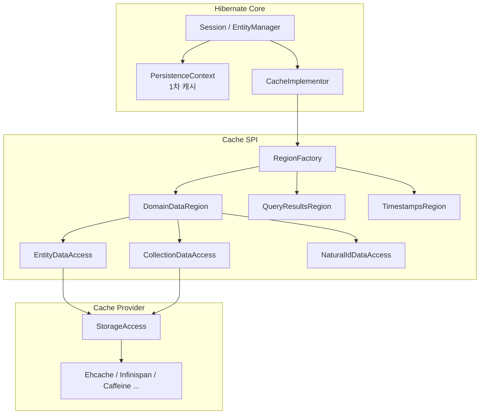
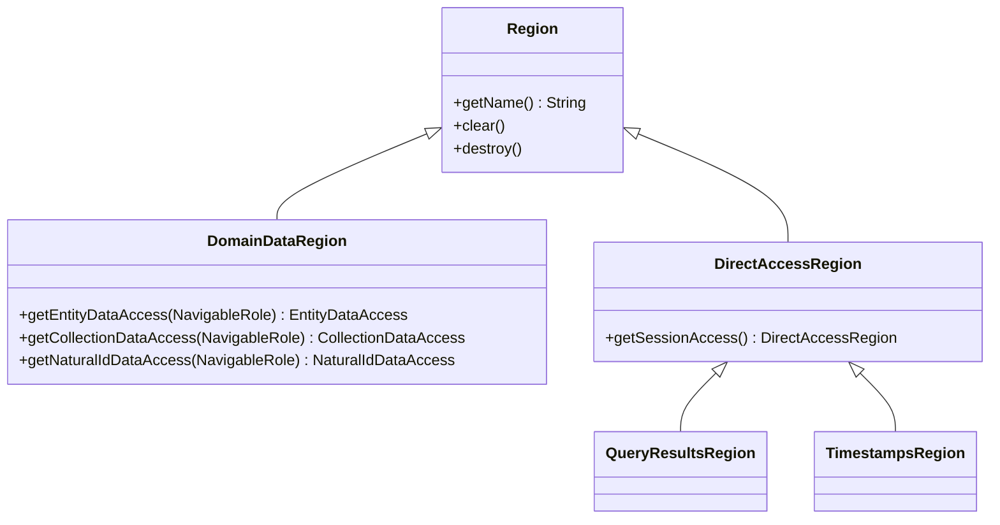
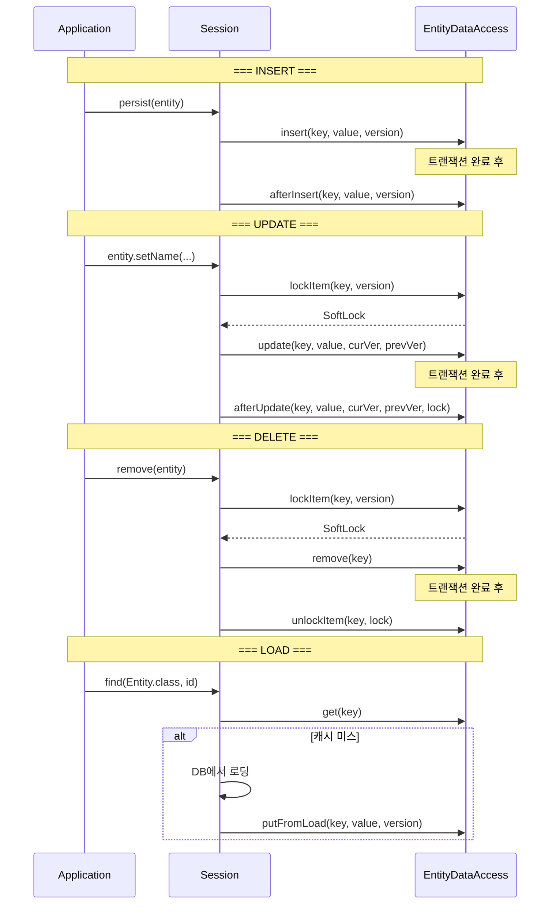
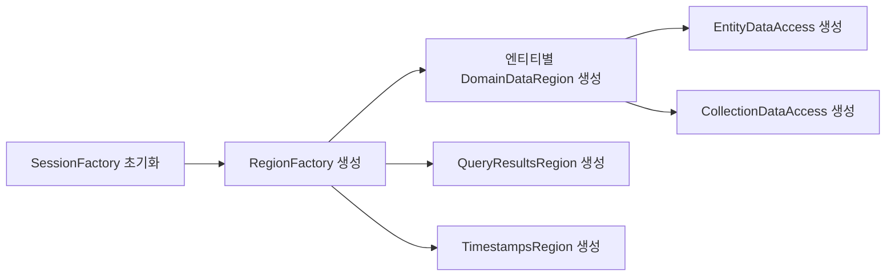

# 2차 캐시 아키텍처

Hibernate의 2차 캐시(Second-Level Cache)는 SessionFactory 범위에서 엔티티, 컬렉션, 쿼리 결과를 캐싱하여 데이터베이스 접근을 줄이는 아키텍처다. 이 문서에서는 Region, ConcurrencyStrategy, DataAccess 인터페이스의 내부 구조를 분석한다.

## 목차
- [1. 핵심 개념 (What)](#1-핵심-개념-what)
- [2. 왜 알아야 하는가 (Why)](#2-왜-알아야-하는가-why)
- [3. 내부 구현 분석 (How)](#3-내부-구현-분석-how)
- [4. 실전 예제](#4-실전-예제)
- [5. 정리](#5-정리)

---

## 1. 핵심 개념 (What)

### 1차 캐시 vs 2차 캐시

| 특성 | 1차 캐시 | 2차 캐시 |
|------|----------|----------|
| **범위** | Session (EntityManager) | SessionFactory (전체 애플리케이션) |
| **수명** | 트랜잭션/세션 종료 시 소멸 | SessionFactory 수명 동안 유지 |
| **저장 형태** | 엔티티 객체 참조 | **분해된(destructured) 상태 배열** |
| **동시성** | 단일 스레드 | 다중 스레드 (동시성 전략 필요) |
| **설정** | 자동 활성화 | 명시적 활성화 필요 |

### 아키텍처 계층



## 2. 왜 알아야 하는가 (Why)

- **캐시 전략 선택**: READ_ONLY, READ_WRITE, NONSTRICT_READ_WRITE, TRANSACTIONAL 중 데이터 특성에 맞는 전략을 선택해야 한다.
- **일관성 보장**: 동시 수정 시 캐시와 데이터베이스 간 불일치 방지 방법을 이해해야 한다.
- **Region 구성**: 엔티티별 캐시 크기, TTL, 만료 정책을 Region 단위로 세밀하게 설정할 수 있다.
- **성능 디버깅**: 캐시 히트율, 미스율, 풋 횟수를 모니터링하여 캐시 효과를 측정한다.

## 3. 내부 구현 분석 (How)

### 3.1 Region - 캐시 영역의 추상화

`Region`은 이름으로 식별되는 캐시 영역의 기본 인터페이스다.

```java
// Region.java
public interface Region {
    String getName();              // 영역 이름 (보통 엔티티 FQCN)
    RegionFactory getRegionFactory();
    void clear();                  // 전체 데이터 삭제
    void destroy() throws CacheException;
}
```

Region의 하위 타입:



### 3.2 DomainDataRegion - 도메인 데이터 영역

`DomainDataRegion`은 엔티티, 컬렉션, Natural ID 데이터를 저장하는 영역이다. 각 데이터 유형에 대한 접근 객체를 생성한다.

```java
// DomainDataRegion.java
public interface DomainDataRegion extends Region {
    EntityDataAccess getEntityDataAccess(NavigableRole rootEntityRole);
    CollectionDataAccess getCollectionDataAccess(NavigableRole collectionRole);
    NaturalIdDataAccess getNaturalIdDataAccess(NavigableRole rootEntityRole);
}
```

### 3.3 AccessType - 동시성 전략

`AccessType`은 4가지 캐시 동시성 정책을 정의한다.

```java
// AccessType.java
public enum AccessType {
    READ_ONLY,              // 읽기 전용, 불변 데이터
    READ_WRITE,             // SoftLock 기반 동시성 제어
    NONSTRICT_READ_WRITE,   // 트랜잭션 전후 무효화
    TRANSACTIONAL;          // JTA 기반 하드 락
}
```

각 전략의 특성:

| 전략 | 읽기 | 쓰기 | 일관성 | 성능 | 적합한 데이터 |
|------|------|------|--------|------|--------------|
| `READ_ONLY` | O | X (삭제만) | 완벽 | 최고 | 코드 테이블, 설정값 |
| `READ_WRITE` | O | O | 높음 | 보통 | 자주 읽히고 가끔 수정되는 데이터 |
| `NONSTRICT_READ_WRITE` | O | O | 낮음 | 높음 | 일시적 불일치 허용 데이터 |
| `TRANSACTIONAL` | O | O | 완벽 | 낮음 | JTA 환경의 중요 데이터 |

### 3.4 CachedDomainDataAccess - 캐시 접근의 기본 계약

모든 도메인 데이터 접근의 기본 인터페이스로, 트랜잭셔널/비트랜잭셔널 작업을 정의한다.

```java
// CachedDomainDataAccess.java
public interface CachedDomainDataAccess {
    DomainDataRegion getRegion();
    AccessType getAccessType();

    // === 트랜잭셔널 작업 ===
    Object get(SharedSessionContractImplementor session, Object key);
    boolean putFromLoad(SharedSessionContractImplementor session,
                        Object key, Object value, Object version);
    SoftLock lockItem(SharedSessionContractImplementor session,
                      Object key, Object version);
    void unlockItem(SharedSessionContractImplementor session,
                    Object key, SoftLock lock);
    void remove(SharedSessionContractImplementor session, Object key);

    // === 비트랜잭셔널 작업 ===
    boolean contains(Object key);
    SoftLock lockRegion();
    void unlockRegion(SoftLock lock);
    void evict(Object key);
    void evictAll();
}
```

### 3.5 EntityDataAccess - 엔티티 캐시 접근

`EntityDataAccess`는 엔티티 데이터에 대한 캐시 접근을 관리한다. 핵심은 CRUD 작업별 호출 시퀀스다.

```java
// EntityDataAccess.java
public interface EntityDataAccess extends CachedDomainDataAccess {
    Object generateCacheKey(Object id, EntityPersister rootEntityDescriptor,
                            SessionFactoryImplementor factory,
                            String tenantIdentifier);
    Object getCacheKeyId(Object cacheKey);

    // INSERT: insert() -> afterInsert()
    boolean insert(SharedSessionContractImplementor session,
                   Object key, Object value, Object version);
    boolean afterInsert(SharedSessionContractImplementor session,
                        Object key, Object value, Object version);

    // UPDATE: lockItem() -> update() -> afterUpdate()
    boolean update(SharedSessionContractImplementor session,
                   Object key, Object value,
                   Object currentVersion, Object previousVersion);
    boolean afterUpdate(SharedSessionContractImplementor session,
                        Object key, Object value,
                        Object currentVersion, Object previousVersion,
                        SoftLock lock);
}
```

작업별 호출 시퀀스:



### 3.6 CollectionDataAccess - 컬렉션 캐시 접근

컬렉션은 엔티티와 달리 **수정 시 항상 무효화(invalidation)** 전략을 사용한다.

```java
// CollectionDataAccess.java
public interface CollectionDataAccess extends CachedDomainDataAccess {
    Object generateCacheKey(Object id,
                            CollectionPersister collectionDescriptor,
                            SessionFactoryImplementor factory,
                            String tenantIdentifier);
    Object getCacheKeyId(Object cacheKey);
}
```

컬렉션은 `insert()`나 `update()` 메서드가 없다. 변경이 감지되면 다음 시퀀스만 실행된다:
- `lockItem()` -> `remove()` -> `unlockItem()`

이는 컬렉션 전체를 캐시에서 제거하고, 다음 접근 시 DB에서 다시 로딩하도록 한다.

### 3.7 RegionFactory - 캐시 영역 생성 팩토리



`RegionFactory`는 캐시 프로바이더(Ehcache, Infinispan 등)별로 구현된다. 이를 통해 Hibernate의 캐시 SPI와 실제 캐시 엔진이 분리된다.

### 3.8 캐시 데이터 저장 형식

2차 캐시는 엔티티 객체를 직접 저장하지 않고, **분해된(destructured) 상태 배열**을 저장한다.

```
캐시 키: CacheKey(id=1, entityName="com.example.Order", tenantId=null)
캐시 값: StandardCacheEntryImpl {
    disassembledState: ["PENDING", 1500, "2024-01-01", ...]
    subclass: "com.example.Order"
    version: 3
}
```

이 방식의 장점:
- 엔티티 객체 참조가 유출되지 않아 스레드 안전
- 직렬화 가능하여 분산 캐시 지원
- 1차 캐시와 독립적인 수명주기

### 3.9 SoftLock 메커니즘

`READ_WRITE` 전략에서 `SoftLock`은 동시 수정을 제어하는 낙관적 락이다:

1. UPDATE 시작 시 `lockItem()`이 `SoftLock` 생성
2. lock이 걸린 동안 다른 트랜잭션의 `putFromLoad()`는 거부됨
3. 트랜잭션 완료 후 `afterUpdate()` 또는 `unlockItem()`으로 잠금 해제
4. 잠금 해제 후 새로운 `putFromLoad()` 허용

## 4. 실전 예제

### 4.1 기본 2차 캐시 설정

```properties
# application.properties
spring.jpa.properties.hibernate.cache.use_second_level_cache=true
spring.jpa.properties.hibernate.cache.use_query_cache=true
spring.jpa.properties.hibernate.cache.region.factory_class=\
    org.hibernate.cache.jcache.internal.JCacheRegionFactory
spring.jpa.properties.hibernate.javax.cache.provider=\
    org.ehcache.jsr107.EhcacheCachingProvider
```

### 4.2 엔티티에 2차 캐시 적용

```java
@Entity
@Cacheable
@Cache(usage = CacheConcurrencyStrategy.READ_WRITE, region = "products")
public class Product {
    @Id
    private Long id;
    private String name;
    private BigDecimal price;

    @Cache(usage = CacheConcurrencyStrategy.READ_WRITE)
    @OneToMany(mappedBy = "product")
    private List<Review> reviews;
}
```

### 4.3 캐시 통계 모니터링

```properties
spring.jpa.properties.hibernate.generate_statistics=true
```

```java
Statistics stats = sessionFactory.getStatistics();
log.info("캐시 히트율: {}/{} ({}%)",
    stats.getSecondLevelCacheHitCount(),
    stats.getSecondLevelCacheHitCount() + stats.getSecondLevelCacheMissCount(),
    stats.getSecondLevelCacheHitCount() * 100.0 /
        (stats.getSecondLevelCacheHitCount()
            + stats.getSecondLevelCacheMissCount()));

log.info("캐시 풋 횟수: {}", stats.getSecondLevelCachePutCount());
```

### 4.4 전략 선택 가이드

```java
// 코드 테이블 - 절대 변경되지 않는 데이터
@Cache(usage = CacheConcurrencyStrategy.READ_ONLY)
public class Country { ... }

// 자주 읽히지만 가끔 수정되는 데이터
@Cache(usage = CacheConcurrencyStrategy.READ_WRITE)
public class Product { ... }

// 일시적 불일치를 허용할 수 있는 데이터
@Cache(usage = CacheConcurrencyStrategy.NONSTRICT_READ_WRITE)
public class UserPreference { ... }
```

### 4.5 쿼리 캐시와의 결합

```java
List<Product> products = em.createQuery(
        "SELECT p FROM Product p WHERE p.category = :cat", Product.class)
    .setParameter("cat", category)
    .setHint("org.hibernate.cacheable", true)
    .setHint("org.hibernate.cacheRegion", "query.products.byCategory")
    .getResultList();
```

쿼리 캐시는 쿼리 결과의 **ID 목록**만 저장하고, 실제 엔티티 데이터는 엔티티 2차 캐시에서 가져온다. 따라서 쿼리 캐시는 엔티티 2차 캐시와 함께 사용해야 효과적이다.

## 5. 정리

| 항목 | 내용 |
|------|------|
| **핵심 인터페이스** | `Region`, `DomainDataRegion`, `EntityDataAccess`, `CollectionDataAccess` |
| **동시성 전략** | `READ_ONLY`, `READ_WRITE`, `NONSTRICT_READ_WRITE`, `TRANSACTIONAL` |
| **저장 형태** | 분해된 상태 배열 (`StandardCacheEntryImpl`) |
| **엔티티 UPDATE** | `lockItem()` -> `update()` -> `afterUpdate()` |
| **컬렉션 변경** | 항상 무효화: `lockItem()` -> `remove()` -> `unlockItem()` |
| **SoftLock** | `READ_WRITE`에서 동시 수정 제어, lock 중 `putFromLoad` 거부 |
| **쿼리 캐시** | ID 목록만 저장, 엔티티 캐시와 결합 필수 |
| **캐시 프로바이더** | Ehcache, Infinispan, Caffeine 등 `RegionFactory` 구현 |

---
*참고: Hibernate ORM 6.5.x 기준*
