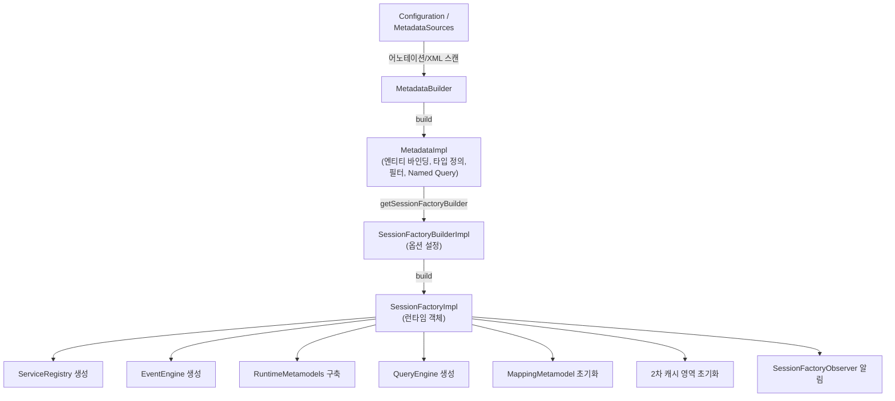
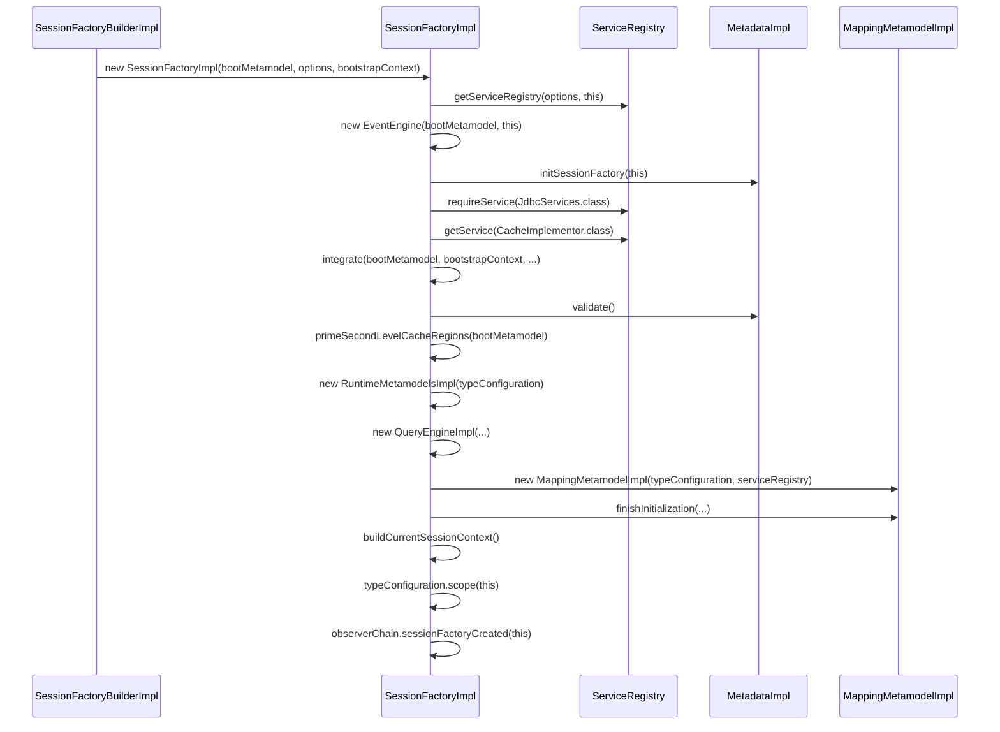

# SessionFactory 부트스트랩과 초기화

Hibernate ORM에서 SessionFactory는 애플리케이션 전체에서 하나만 생성되는 무거운 싱글턴 객체로, 모든 매핑 메타데이터와 서비스를 캡슐화한다. 이 문서에서는 Configuration에서 시작하여 MetadataSources, Metadata, SessionFactory로 이어지는 부트스트랩 체인의 내부 구현을 분석한다.

## 목차
- [1. 핵심 개념 (What)](#1-핵심-개념-what)
- [2. 왜 알아야 하는가 (Why)](#2-왜-알아야-하는가-why)
- [3. 내부 구현 분석 (How)](#3-내부-구현-분석-how)
- [4. 실전 예제](#4-실전-예제)
- [5. 정리](#5-정리)

---

## 1. 핵심 개념 (What)

SessionFactory는 Hibernate의 핵심 진입점이다. JDBC의 `DataSource`와 유사한 역할을 하지만, 단순한 커넥션 팩토리를 넘어서 **엔티티 매핑 메타데이터**, **쿼리 엔진**, **2차 캐시**, **이벤트 리스너** 등 ORM 런타임에 필요한 모든 인프라를 보유한다.

부트스트랩은 다음 단계를 거친다:

1. **Configuration / MetadataSources** -- 매핑 정보 수집
2. **Metadata (MetadataImpl)** -- 수집된 정보를 정규화하여 보관
3. **SessionFactoryBuilder (SessionFactoryBuilderImpl)** -- 빌더 패턴으로 옵션 설정
4. **SessionFactory (SessionFactoryImpl)** -- 최종 런타임 객체 생성

### 핵심 클래스

| 클래스 | 패키지 | 역할 |
|--------|--------|------|
| `MetadataImpl` | `org.hibernate.boot.internal` | 엔티티/컬렉션 바인딩, 필터, Named Query 등 보관 |
| `SessionFactoryBuilderImpl` | `org.hibernate.boot.internal` | SessionFactory 생성 옵션 설정 |
| `SessionFactoryImpl` | `org.hibernate.internal` | 최종 런타임 SessionFactory 구현체 |

## 2. 왜 알아야 하는가 (Why)

- **부트스트랩 시간 최적화**: 대규모 엔티티(수백 개)가 있는 프로젝트에서 부팅 시간이 수십 초에 달할 수 있다. 어떤 단계에서 병목이 발생하는지 이해해야 최적화가 가능하다.
- **커스텀 확장**: `SessionFactoryBuilderFactory`, `Integrator`, `SessionFactoryObserver` 등을 통한 확장 시 내부 초기화 순서를 이해해야 한다.
- **트러블슈팅**: "Schema validation failed", "Named query not found" 등의 에러는 부트스트랩 과정에서 발생하며, 원인 파악에 내부 흐름 이해가 필수다.

## 3. 내부 구현 분석 (How)

### 3.1 부트스트랩 전체 흐름



### 3.2 MetadataImpl -- 메타데이터 컨테이너

`MetadataImpl`은 부트스트랩 과정에서 수집된 모든 매핑 정보를 담는 컨테이너다. 실제 소스를 보면 다음과 같은 필드가 있다:

```java
// MetadataImpl.java
public class MetadataImpl implements MetadataImplementor, Serializable {
    private final Map<String, PersistentClass> entityBindingMap;
    private final Map<String, Collection> collectionBindingMap;
    private final Map<String, TypeDefinition> typeDefinitionMap;
    private final Map<String, FilterDefinition> filterDefinitionMap;
    private final Map<String, FetchProfile> fetchProfileMap;
    private final Map<String, NamedHqlQueryDefinition<?>> namedQueryMap;
    private final Map<String, NamedNativeQueryDefinition<?>> namedNativeQueryMap;
    private final Database database;
    // ...
}
```

`MetadataImpl.getSessionFactoryBuilder()` 메서드는 `SessionFactoryBuilderFactory` SPI를 통해 커스텀 빌더를 사용할 수 있도록 확장 포인트를 제공한다:

```java
// MetadataImpl.getSessionFactoryBuilder()
public SessionFactoryBuilder getSessionFactoryBuilder() {
    final var defaultBuilder = getFactoryBuilder();
    // SessionFactoryBuilderFactory SPI를 통해 커스텀 빌더 탐색
    for (var discoveredBuilderFactory : getSessionFactoryBuilderFactories()) {
        final SessionFactoryBuilder returnedBuilder =
            discoveredBuilderFactory.getSessionFactoryBuilder(this, defaultBuilder);
        if (returnedBuilder != null) {
            builder = returnedBuilder;
        }
    }
    return builder == null ? defaultBuilder : builder;
}
```

`MetadataImpl.buildSessionFactory()`는 단순히 빌더를 얻어 `build()`를 호출한다:

```java
// MetadataImpl.buildSessionFactory()
public SessionFactoryImplementor buildSessionFactory() {
    return (SessionFactoryImplementor) getSessionFactoryBuilder().build();
}
```

### 3.3 SessionFactoryBuilderImpl -- 빌더 패턴

`SessionFactoryBuilderImpl`은 `MetadataImplementor`와 `BootstrapContext`를 받아 옵션을 설정한다. 생성자에서 주목할 점은 여러 `SessionFactoryObserver`를 자동 등록한다는 것이다:

```java
// SessionFactoryBuilderImpl 생성자
public SessionFactoryBuilderImpl(MetadataImplementor metadata,
                                  SessionFactoryOptionsBuilder optionsBuilder,
                                  BootstrapContext context) {
    this.metadata = metadata;
    this.optionsBuilder = optionsBuilder;
    this.bootstrapContext = context;

    // SQL 함수 등록
    if (metadata.getSqlFunctionMap() != null) {
        for (var entry : metadata.getSqlFunctionMap().entrySet()) {
            applySqlFunction(entry.getKey(), entry.getValue());
        }
    }

    // Observer 자동 등록
    addSessionFactoryObservers(new SessionFactoryObserverForBytecodeEnhancer(bytecodeProvider));
    addSessionFactoryObservers(new SessionFactoryObserverForNamedQueryValidation(metadata));
    addSessionFactoryObservers(new SessionFactoryObserverForSchemaExport(metadata));
    addSessionFactoryObservers(new SessionFactoryObserverForRegistration());
}
```

### 3.4 SessionFactoryImpl -- 핵심 초기화 과정

`SessionFactoryImpl` 생성자는 부트스트랩의 최종 단계다. 소스 코드 기반으로 초기화 순서를 분석하면:



#### 핵심 필드 초기화

`SessionFactoryImpl`의 핵심 필드를 소스 코드에서 확인하면:

```java
// SessionFactoryImpl.java
public class SessionFactoryImpl implements SessionFactoryImplementor {
    private final String name;
    private final String uuid;
    private transient volatile Status status = Status.OPEN;

    private final transient SessionFactoryOptions sessionFactoryOptions;
    private final transient SessionFactoryServiceRegistry serviceRegistry;
    private final transient EventEngine eventEngine;
    private final transient JdbcServices jdbcServices;
    private final transient RuntimeMetamodelsImplementor runtimeMetamodels;
    private final transient CacheImplementor cacheAccess;
    private final transient QueryEngine queryEngine;
    private final transient TypeConfiguration typeConfiguration;
    private final transient CurrentSessionContext currentSessionContext;
    private final transient Map<String, FilterDefinition> filters;
    private final transient EventListenerGroups eventListenerGroups;
    // ...
}
```

특히 주목할 점은 **스레드 안전성**이다. Javadoc에 다음과 같이 명시되어 있다:

> *This class is thread-safe. This class must appear immutable to clients. Synchronization must be used extremely sparingly.*

### 3.5 에러 처리와 롤백

생성자에서 예외가 발생하면 자원 정리가 수행된다:

```java
// SessionFactoryImpl 생성자의 catch 블록
catch (Exception e) {
    disintegrate(e, integratorObserver);
    try {
        close();
    } catch (Exception closeException) {
        SESSION_FACTORY_LOGGER.eatingErrorClosingFactoryAfterFailedInstantiation();
    }
    throw e;
}
```

## 4. 실전 예제

### 예제 1: 기본 부트스트랩 (JPA 표준)

```java
// persistence.xml 기반 표준 JPA 부트스트랩
EntityManagerFactory emf = Persistence.createEntityManagerFactory("myPU");

// 내부적으로 다음 체인이 실행된다:
// 1. MetadataSources 수집 (persistence.xml + 어노테이션 스캔)
// 2. MetadataImpl 생성
// 3. SessionFactoryBuilderImpl 생성
// 4. SessionFactoryImpl 생성
```

### 예제 2: 프로그래밍 방식 부트스트랩

```java
// Hibernate Native API를 사용한 프로그래밍 방식 부트스트랩
StandardServiceRegistry serviceRegistry = new StandardServiceRegistryBuilder()
    .applySetting("hibernate.connection.url", "jdbc:h2:mem:test")
    .applySetting("hibernate.dialect", "org.hibernate.dialect.H2Dialect")
    .applySetting("hibernate.hbm2ddl.auto", "create-drop")
    .build();

MetadataSources metadataSources = new MetadataSources(serviceRegistry);
metadataSources.addAnnotatedClass(Member.class);
metadataSources.addAnnotatedClass(Order.class);

// MetadataImpl 생성
Metadata metadata = metadataSources.buildMetadata();

// SessionFactoryBuilderImpl을 통한 커스텀 설정
SessionFactory sessionFactory = metadata.getSessionFactoryBuilder()
    .applyStatisticsSupport(true)
    .applyAutoClosing(true)
    .build();
```

### 예제 3: SessionFactoryObserver를 활용한 초기화 확인

```java
SessionFactory sessionFactory = metadata.getSessionFactoryBuilder()
    .addSessionFactoryObservers(new SessionFactoryObserver() {
        @Override
        public void sessionFactoryCreated(SessionFactory factory) {
            System.out.println("SessionFactory 생성 완료: " + factory.getName());
            // 커넥션 풀 워밍업, 캐시 프리로딩 등 수행 가능
        }

        @Override
        public void sessionFactoryClosed(SessionFactory factory) {
            System.out.println("SessionFactory 종료: " + factory.getName());
        }
    })
    .build();
```

## 5. 정리

| 단계 | 클래스 | 핵심 역할 |
|------|--------|-----------|
| 1. 매핑 수집 | `MetadataSources` | 엔티티 클래스, XML 매핑 파일 등록 |
| 2. 메타데이터 빌드 | `MetadataImpl` | 엔티티 바인딩, 타입 정의, 필터, Named Query 등 정규화 |
| 3. 빌더 설정 | `SessionFactoryBuilderImpl` | Interceptor, Observer, 통계 지원 등 옵션 설정 |
| 4. 팩토리 생성 | `SessionFactoryImpl` | ServiceRegistry, EventEngine, RuntimeMetamodels, QueryEngine, 2차 캐시 초기화 |

**핵심 포인트**:
- `SessionFactoryImpl`은 **스레드 안전**하며 애플리케이션 전체에서 하나만 생성해야 한다.
- 생성자에서 예외 발생 시 `close()`를 호출하여 자원을 정리한다.
- `SessionFactoryObserver`를 통해 생성/종료 이벤트를 가로챌 수 있다.
- `SessionFactoryBuilderFactory` SPI로 빌더 자체를 교체하는 확장이 가능하다.

---
*참고: Hibernate ORM 6.5.x 기준*
