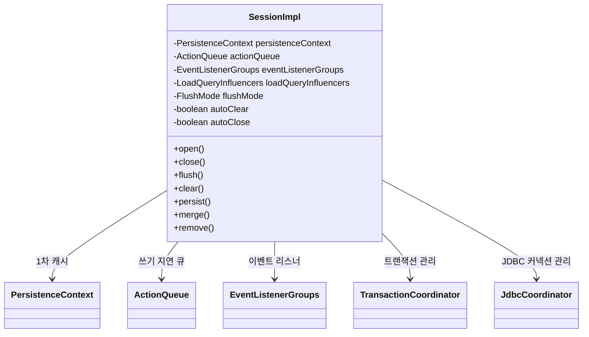
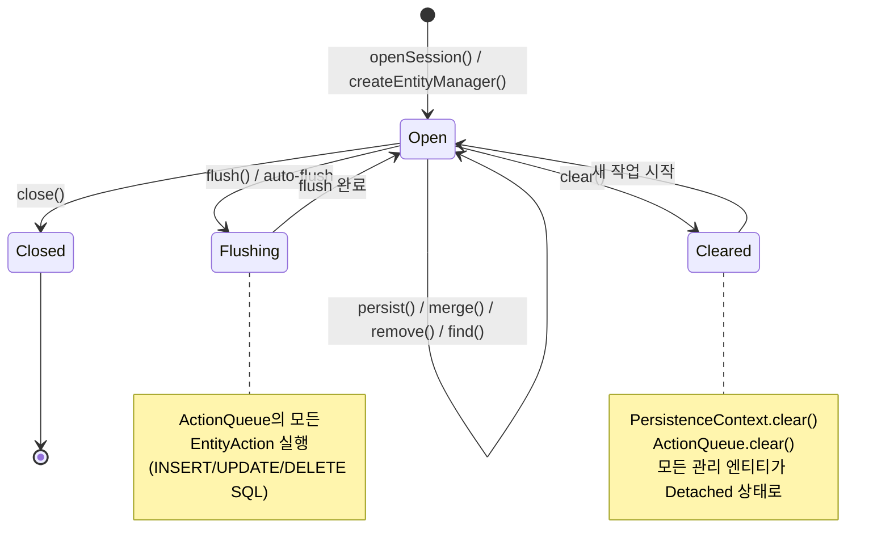
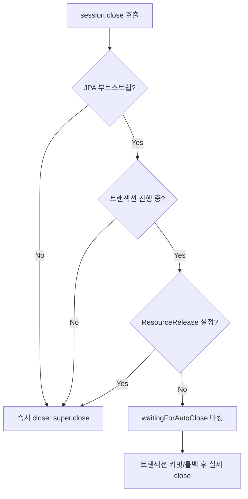
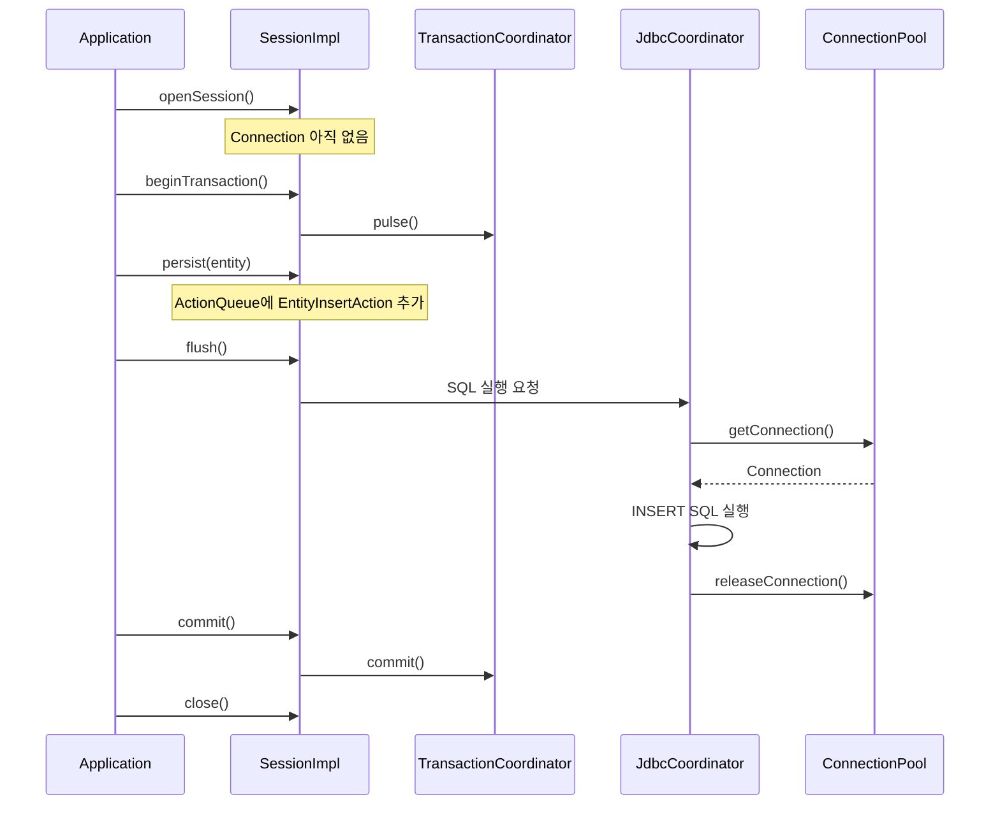

# Session 생명주기와 트랜잭션 관리

Hibernate의 Session은 영속성 컨텍스트를 감싸는 작업 단위(Unit of Work)로, 엔티티의 CRUD 작업과 트랜잭션 관리를 담당한다. 이 문서에서는 SessionImpl의 open/close/flush/clear 동작과 JDBC Connection과의 관계를 내부 소스 코드 수준에서 분석한다.

## 목차
- [1. 핵심 개념 (What)](#1-핵심-개념-what)
- [2. 왜 알아야 하는가 (Why)](#2-왜-알아야-하는가-why)
- [3. 내부 구현 분석 (How)](#3-내부-구현-분석-how)
- [4. 실전 예제](#4-실전-예제)
- [5. 정리](#5-정리)

---

## 1. 핵심 개념 (What)

`SessionImpl`은 JPA의 `EntityManager`와 Hibernate의 `Session` 인터페이스를 모두 구현하는 핵심 클래스다. 소스 코드의 Javadoc에서 그 본질을 명확히 설명한다:

> *The SessionImpl does not directly perform operations against the database or second-level cache. Instead, it is an EventSource, raising events which are processed by various implementations of the listener interfaces. These listeners typically place EntityAction instances on the ActionQueue associated with the session, and such actions are executed asynchronously when the session is flushed.*

즉, Session은 직접 DB 작업을 수행하지 않고 **이벤트를 발행하는 이벤트 소스**이며, 실제 작업은 **ActionQueue에 대기했다가 flush 시점에 실행**된다.

### Session의 핵심 구성 요소



## 2. 왜 알아야 하는가 (Why)

- **커넥션 누수 방지**: Session이 열린 채로 방치되면 JDBC Connection이 반환되지 않아 커넥션 풀이 고갈된다.
- **flush 타이밍 이해**: auto-flush와 manual flush의 차이, 트랜잭션 커밋 시 flush 동작을 이해해야 데이터 정합성을 보장할 수 있다.
- **메모리 관리**: Session에 대량의 엔티티가 쌓이면 OutOfMemoryError가 발생할 수 있으며, clear()의 적절한 사용이 필요하다.
- **트랜잭션 경계 설계**: OSIV(Open Session in View) 패턴이나 서비스 계층의 트랜잭션 경계를 올바르게 설계하려면 Session의 생명주기를 이해해야 한다.

## 3. 내부 구현 분석 (How)

### 3.1 Session 생성 (Open)

`SessionImpl` 생성자는 `SessionFactoryImpl.openSession()`에 의해 호출된다:

```java
// SessionImpl 생성자
public SessionImpl(SessionFactoryImpl factory, SessionCreationOptions options) {
    super(factory, options);

    // 1. PersistenceContext 생성 (1차 캐시)
    persistenceContext = createPersistenceContext(options);

    // 2. ActionQueue 생성 (쓰기 지연 저장소)
    actionQueue = createActionQueue();

    // 3. EventListenerGroups 참조
    eventListenerGroups = factory.getEventListenerGroups();

    // 4. 자동 클리어/닫기 설정
    autoClear = options.shouldAutoClear();
    autoClose = options.shouldAutoClose();

    // 5. 트랜잭션 관련 설정
    setUpTransactionCompletionProcesses(options, actionQueue, this);
    loadQueryInfluencers = new LoadQueryInfluencers(factory, options);

    // 6. 트랜잭션 코디네이터 활성화
    getTransactionCoordinator().pulse();

    // 7. FlushMode 결정
    flushMode = getInitialFlushMode(options);
}
```

#### PersistenceContext 생성

```java
// SessionImpl.createPersistenceContext()
protected PersistenceContext createPersistenceContext(SessionCreationOptions options) {
    final var persistenceContext = PersistenceContexts.createPersistenceContext(this);
    persistenceContext.setDefaultReadOnly(options.isReadOnly());
    return persistenceContext;
}
```

### 3.2 Session 생명주기 다이어그램



### 3.3 Flush 동작

`SessionImpl.flush()`는 최종적으로 `fireFlush()`를 호출한다:

```java
// SessionImpl.fireFlush()
private void fireFlush() {
    if (!isReadOnly()) {
        pulseTransactionCoordinator();
        checkTransactionNeededForUpdateOperation();
        if (persistenceContext.getCascadeLevel() > 0) {
            throw new HibernateException("Flush during cascade is dangerous");
        }
        eventListenerGroups.eventListenerGroup_FLUSH
            .fireEventOnEachListener(new FlushEvent(this),
                FlushEventListener::onFlush);
        delayedAfterCompletion();
    }
}
```

핵심 포인트:
- flush는 **이벤트 기반**으로 동작한다 (`FlushEvent` -> `FlushEventListener`)
- cascade 중에 flush가 발생하면 예외를 던진다
- read-only Session에서는 flush를 건너뛴다

#### Auto-Flush 트리거

```java
// SessionImpl.managedFlush() -- 트랜잭션 커밋 시 호출
private void managedFlush() {
    if (!isOpenOrWaitingForAutoClose()) {
        SESSION_LOGGER.skippingAutoFlushSessionClosed();
    } else {
        SESSION_LOGGER.automaticallyFlushingSession();
        fireFlush();
    }
}
```

### 3.4 Clear 동작

`clear()`는 1차 캐시와 ActionQueue를 모두 초기화한다:

```java
// SessionImpl.clear()
public void clear() {
    checkOpen();
    pulseTransactionCoordinator();
    internalClear();
}

private void internalClear() {
    persistenceContext.clear();  // 1차 캐시 초기화
    actionQueue.clear();         // 쓰기 지연 큐 초기화
    // ClearEvent 발행
    eventListenerGroups.eventListenerGroup_CLEAR
        .fireLazyEventOnEachListener(this::createClearEvent, ClearEventListener::onClear);
}
```

### 3.5 Close 동작

`close()`는 JPA 부트스트랩 여부에 따라 동작이 달라진다:

```java
// SessionImpl.closeWithoutOpenChecks()
public void closeWithoutOpenChecks() {
    if (isJpaBootstrap()) {
        // JPA 모드: 트랜잭션 진행 중이면 마킹만 하고 실제 종료는 나중에
        if (getSessionFactoryOptions().isReleaseResourcesOnCloseEnabled()
                || !isTransactionInProgressAndNotMarkedForRollback()) {
            super.close();
        } else {
            prepareForAutoClose();  // waitingForAutoClose = true
        }
    } else {
        // Hibernate 네이티브 모드: 즉시 종료
        super.close();
    }
}
```



### 3.6 JDBC Connection과의 관계

Session은 JDBC Connection을 직접 관리하지 않는다. 대신 `JdbcCoordinator`가 Connection의 획득과 반환을 담당한다. 기본 설정은 `DELAYED_ACQUISITION_AND_RELEASE_AFTER_STATEMENT`로, **SQL을 실행할 때만 커넥션을 획득하고 실행 직후 반환**한다.



## 4. 실전 예제

### 예제 1: 기본 Session 생명주기

```java
// 기본적인 Session 사용 패턴
try (Session session = sessionFactory.openSession()) {
    Transaction tx = session.beginTransaction();
    try {
        Member member = new Member("홍길동", "hong@example.com");
        session.persist(member);  // ActionQueue에 INSERT 예약

        member.setEmail("newhong@example.com");
        // Dirty Checking이 flush 시점에 UPDATE 생성

        session.flush();  // INSERT + UPDATE SQL 실행
        tx.commit();      // 트랜잭션 커밋 (auto-flush가 선행)
    } catch (Exception e) {
        tx.rollback();
        throw e;
    }
}  // try-with-resources로 close 보장
```

### 예제 2: 대량 데이터 처리 시 clear() 활용

```java
try (Session session = sessionFactory.openSession()) {
    Transaction tx = session.beginTransaction();

    for (int i = 0; i < 100_000; i++) {
        session.persist(new LogEntry("event-" + i));

        if (i % 1000 == 0) {
            session.flush();   // 1000건씩 SQL 실행
            session.clear();   // 1차 캐시 비워서 메모리 절약
        }
    }

    tx.commit();
}
```

## 5. 정리

| 메서드 | 동작 | 주의사항 |
|--------|------|----------|
| `openSession()` | PersistenceContext, ActionQueue 생성. Connection은 미획득 | Session당 하나의 스레드에서만 사용 |
| `flush()` | ActionQueue의 모든 EntityAction을 SQL로 변환/실행 | cascade 중에는 호출 불가 |
| `clear()` | PersistenceContext + ActionQueue 초기화 | flush 전에 호출하면 변경 사항 유실 |
| `close()` | 자원 해제. JPA 모드에서 트랜잭션 중이면 지연 종료 | 반드시 try-with-resources 사용 |

**핵심 포인트**:
- `SessionImpl`은 **스레드 안전하지 않다** (not thread-safe).
- Session은 **EventSource** 역할을 하며, 실제 DB 작업은 이벤트 리스너가 수행한다.
- JDBC Connection은 **지연 획득(lazy acquisition)** 방식으로, SQL 실행 시에만 풀에서 가져온다.
- `flush()` -> `clear()` 패턴은 대량 처리 시 메모리 관리의 핵심이다.

---
*참고: Hibernate ORM 6.5.x 기준*
