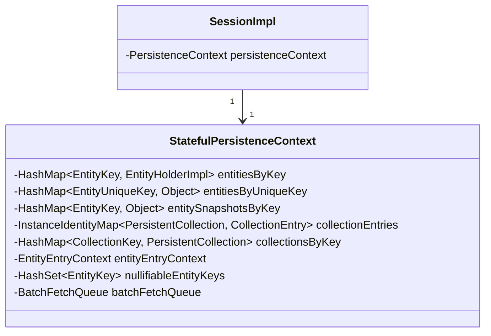
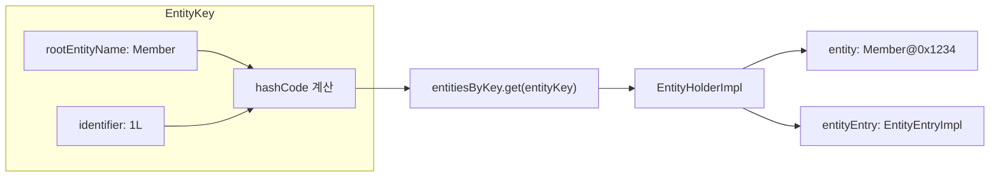
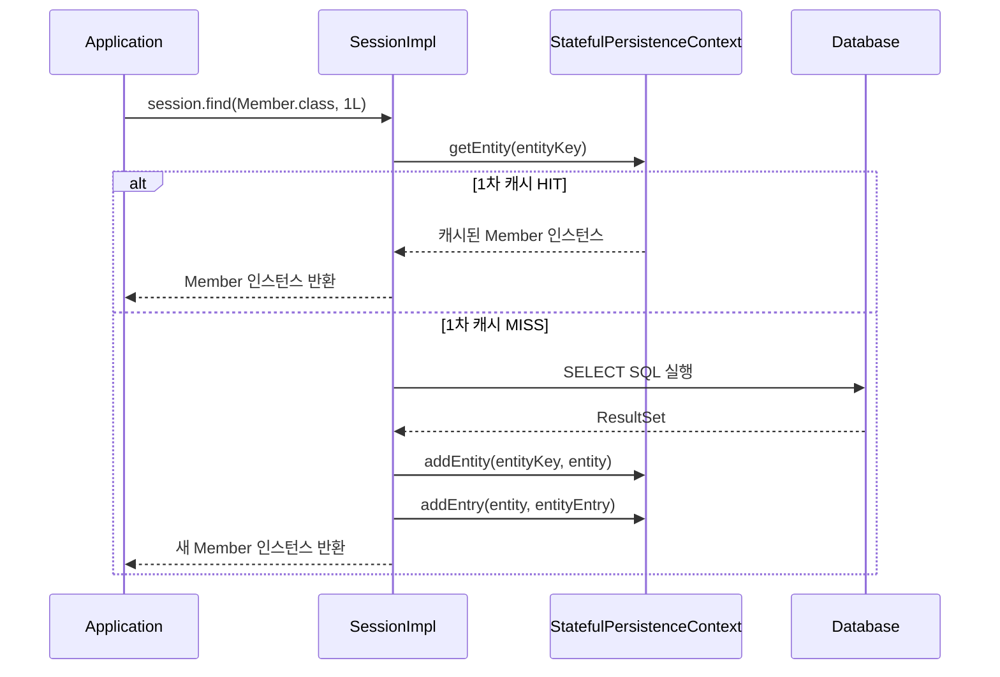
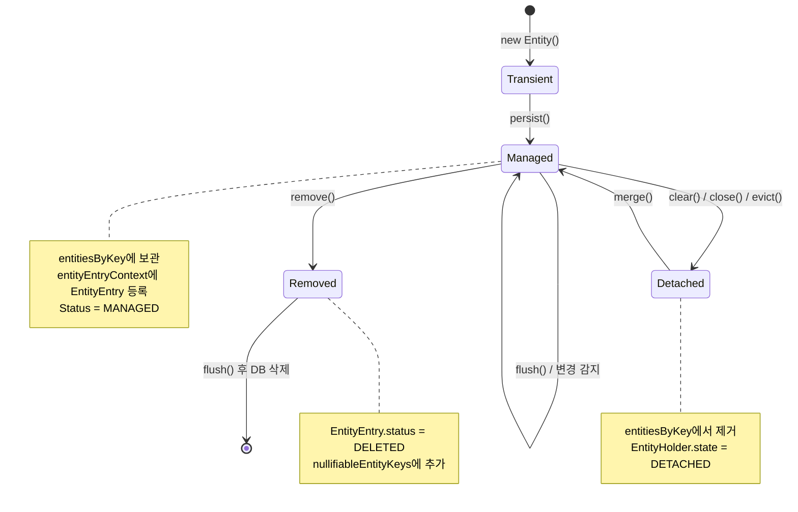

# PersistenceContext(1차 캐시) 내부 구조

PersistenceContext는 Hibernate Session이 관리하는 엔티티 인스턴스와 컬렉션의 상태를 추적하는 핵심 자료구조다. 이 문서에서는 `StatefulPersistenceContext`의 내부 Map 구조, EntityKey/CollectionKey 기반 관리 메커니즘을 소스 코드 수준에서 분석한다.

## 목차
- [1. 핵심 개념 (What)](#1-핵심-개념-what)
- [2. 왜 알아야 하는가 (Why)](#2-왜-알아야-하는가-why)
- [3. 내부 구현 분석 (How)](#3-내부-구현-분석-how)
- [4. 실전 예제](#4-실전-예제)
- [5. 정리](#5-정리)

---

## 1. 핵심 개념 (What)

PersistenceContext(영속성 컨텍스트)는 흔히 "1차 캐시"라고 불리지만, 단순한 캐시 그 이상이다. 다음 역할을 수행한다:

1. **동일성 보장 (Identity Map)**: 같은 EntityKey로 조회하면 항상 같은 인스턴스를 반환
2. **변경 감지 (Dirty Checking)**: 엔티티의 현재 상태와 로드 시점 스냅샷을 비교
3. **쓰기 지연 (Transactional Write-Behind)**: flush 전까지 SQL 실행을 지연
4. **지연 로딩 지원**: 프록시와 미초기화 컬렉션 추적

소스 코드의 Javadoc:

> *A stateful implementation of the PersistenceContext contract, meaning that we maintain this state throughout the life of the persistence context. There is meant to be a one-to-one correspondence between a SessionImpl and a PersistenceContext.*

### 핵심 관계



## 2. 왜 알아야 하는가 (Why)

- **메모리 사용량 이해**: 모든 영속 엔티티가 PersistenceContext에 보관되므로, 대량 조회 시 메모리 폭증의 원인이 된다.
- **동일성 보장 메커니즘**: `session.find()`로 같은 엔티티를 여러 번 조회해도 동일한 인스턴스가 반환되는 이유를 이해해야 한다.
- **N+1 문제 분석**: BatchFetchQueue와의 연관성을 이해하면 N+1 문제의 해결 방법이 보인다.
- **clear() 호출의 영향**: `clear()`가 내부적으로 어떤 자료구조를 초기화하는지 알아야 부작용을 예측할 수 있다.

## 3. 내부 구현 분석 (How)

### 3.1 핵심 자료구조

`StatefulPersistenceContext`의 내부 필드를 소스 코드에서 직접 확인하면:

```java
// StatefulPersistenceContext.java
class StatefulPersistenceContext implements PersistenceContext {
    private static final int INIT_COLL_SIZE = 8;

    // Session 참조
    private final SharedSessionContractImplementor session;

    // EntityEntry 관리 (엔티티 인스턴스 -> EntityEntry 매핑)
    private EntityEntryContext entityEntryContext;

    // 엔티티 인스턴스 보관: EntityKey -> EntityHolderImpl
    private HashMap<EntityKey, EntityHolderImpl> entitiesByKey;

    // 유니크 키 기반 엔티티 조회: EntityUniqueKey -> Object
    private HashMap<EntityUniqueKey, Object> entitiesByUniqueKey;

    // 로드되지 않은 엔티티의 DB 스냅샷: EntityKey -> Object[]
    private HashMap<EntityKey, Object> entitySnapshotsByKey;

    // 배열 컬렉션 홀더
    private IdentityHashMap<Object, PersistentCollection<?>> arrayHolders;

    // 컬렉션 엔트리: PersistentCollection -> CollectionEntry
    private InstanceIdentityMap<PersistentCollection<?>, CollectionEntry> collectionEntries;

    // 컬렉션 키 기반 조회: CollectionKey -> PersistentCollection
    private HashMap<CollectionKey, PersistentCollection<?>> collectionsByKey;

    // 삭제된 엔티티 키 집합
    private HashSet<EntityKey> nullifiableEntityKeys;

    // 삭제된 미로드 프록시 키 집합
    private HashSet<EntityKey> deletedUnloadedEntityKeys;

    // null 연관관계 캐시
    private HashSet<AssociationKey> nullAssociations;
}
```

**핵심 설계 원칙**: 모든 컬렉션 필드는 `null`로 시작하며 **필요할 때만 초기화**된다. 소스 코드의 주석:

> *Everything else below should be carefully initialized only on first need. This optimization is very effective as null checks are free, while allocation costs are very often the dominating cost.*

### 3.2 EntityKey -- 엔티티 식별의 핵심

`EntityKey`는 PersistenceContext에서 엔티티를 찾는 키다:

```java
// EntityKey.java
public final class EntityKey implements Serializable {
    private final Object identifier;       // 엔티티의 ID 값
    private final int hashCode;            // 미리 계산된 해시코드
    private final EntityPersister persister; // 엔티티 메타정보

    public EntityKey(Object id, EntityPersister persister) {
        this.persister = persister;
        if (id == null) {
            throw new AssertionFailure("null identifier (" + persister.getEntityName() + ")");
        }
        this.identifier = id;
        this.hashCode = generateHashCode();
    }

    private int generateHashCode() {
        int result = 17;
        final String rootEntityName = persister.getRootEntityName();
        result = 37 * result + rootEntityName.hashCode();
        final Type identifierType = persister.getIdentifierType().getTypeForEqualsHashCode();
        result = 37 * result + (identifierType == null
            ? identifier.hashCode()
            : identifierType.getHashCode(identifier, persister.getFactory()));
        return result;
    }
}
```

`equals()` 구현을 보면 **rootEntityName + identifier**로 동일성을 판단한다:

```java
// EntityKey.equals()
public boolean equals(Object other) {
    if (this == other) return true;
    if (other == null || EntityKey.class != other.getClass()) return false;
    final EntityKey otherKey = (EntityKey) other;
    return samePersistentType(otherKey) && sameIdentifier(otherKey);
}
```



### 3.3 엔티티 조회 흐름

PersistenceContext에서 엔티티를 조회하는 과정:



### 3.4 clear() 내부 동작

`clear()` 호출 시 모든 내부 자료구조가 초기화된다:

```java
// StatefulPersistenceContext.clear()
public void clear() {
    // 1. 모든 EntityHolder의 상태를 DETACHED로 변경
    if (entitiesByKey != null) {
        for (var value : entitiesByKey.values()) {
            if (value != null) {
                value.state = EntityHolderState.DETACHED;
                // 프록시의 Session 참조 해제
                if (value.proxy != null) {
                    final var lazyInitializer = extractLazyInitializer(value.proxy);
                    if (lazyInitializer != null) {
                        lazyInitializer.unsetSession();
                    }
                }
            }
        }
    }

    // 2. 컬렉션의 Session 참조 해제
    if (collectionEntries != null) {
        collectionEntries.forEach((k, v) -> {
            k.$$_hibernate_setInstanceId(0);
            k.unsetSession(session);
        });
    }

    // 3. 모든 내부 Map을 null로 설정
    arrayHolders = null;
    entitiesByKey = null;
    entitiesByUniqueKey = null;
    entityEntryContext.clear();
    parentsByChild = null;
    entitySnapshotsByKey = null;
    collectionsByKey = null;
    nonlazyCollections = null;
    collectionEntries = null;
    unownedCollections = null;
    nullifiableEntityKeys = null;
    deletedUnloadedEntityKeys = null;

    // 4. BatchFetchQueue 초기화
    if (batchFetchQueue != null) {
        batchFetchQueue.clear();
    }

    // defaultReadOnly는 clear()에 영향받지 않음
    hasNonReadOnlyEntities = false;

    if (loadContexts != null) {
        loadContexts.cleanup();
    }
    naturalIdResolutions = null;
}
```

### 3.5 DB 스냅샷 관리

`entitySnapshotsByKey`는 아직 로드되지 않은 엔티티의 DB 상태를 캐시한다:

```java
// StatefulPersistenceContext.getDatabaseSnapshot()
public Object[] getDatabaseSnapshot(Object id, EntityPersister persister) {
    final var key = session.generateEntityKey(id, persister);
    final Object cached = entitySnapshotsByKey == null ? null : entitySnapshotsByKey.get(key);
    if (cached != null) {
        return cached == NO_ROW ? null : (Object[]) cached;
    } else {
        // DB에서 스냅샷 조회
        final Object[] snapshot = persister.getDatabaseSnapshot(id, session);
        getOrInitializeEntitySnapshotsByKey()
            .put(key, snapshot == null ? NO_ROW : snapshot);
        return snapshot;
    }
}
```

`NO_ROW` 마커 객체는 "DB에 해당 행이 없음"을 나타내는 센티넬 값이다:

```java
private static final Serializable NO_ROW = new Serializable() {
    @Override
    public String toString() {
        return "NO_ROW";
    }
};
```

### 3.6 엔티티 상태 전이와 PersistenceContext



## 4. 실전 예제

### 예제 1: 동일성 보장 확인

```java
try (Session session = sessionFactory.openSession()) {
    // 첫 번째 조회: DB에서 로드 -> PersistenceContext에 캐시
    Member member1 = session.find(Member.class, 1L);

    // 두 번째 조회: PersistenceContext에서 반환 (SQL 미발생)
    Member member2 = session.find(Member.class, 1L);

    // 동일한 인스턴스 (Identity Map 패턴)
    assert member1 == member2;  // true (== 비교)
}
```

### 예제 2: clear()에 의한 Detach와 재조회

```java
try (Session session = sessionFactory.openSession()) {
    Member member1 = session.find(Member.class, 1L);

    session.clear();  // PersistenceContext 초기화

    // member1은 이제 Detached 상태
    // 새로운 SELECT SQL이 발생한다
    Member member2 = session.find(Member.class, 1L);

    assert member1 != member2;  // 서로 다른 인스턴스
    assert member1.getId().equals(member2.getId());  // 같은 데이터
}
```

## 5. 정리

| 자료구조 | 키 | 값 | 역할 |
|----------|-----|-----|------|
| `entitiesByKey` | `EntityKey` | `EntityHolderImpl` | 영속 엔티티 인스턴스 보관 (1차 캐시) |
| `entityEntryContext` | entity instance | `EntityEntry` | 엔티티 상태(Status, loadedState 등) 추적 |
| `entitySnapshotsByKey` | `EntityKey` | `Object[]` | 미로드 엔티티의 DB 스냅샷 |
| `collectionsByKey` | `CollectionKey` | `PersistentCollection` | 영속 컬렉션 보관 |
| `collectionEntries` | `PersistentCollection` | `CollectionEntry` | 컬렉션 상태 추적 |
| `nullifiableEntityKeys` | `EntityKey` | -- | 삭제 대상 엔티티 키 집합 |

**핵심 포인트**:
- 모든 내부 Map은 **지연 초기화(lazy initialization)** 되어 메모리를 절약한다.
- `EntityKey`는 **rootEntityName + identifier**로 엔티티를 고유하게 식별한다.
- `clear()`는 모든 엔티티를 Detached 상태로 만들고, 프록시와 컬렉션의 Session 참조를 해제한다.
- `StatefulPersistenceContext`는 `SessionImpl`과 1:1 관계이며, Session의 수명과 동일하게 살아간다.

---
*참고: Hibernate ORM 6.5.x 기준*
