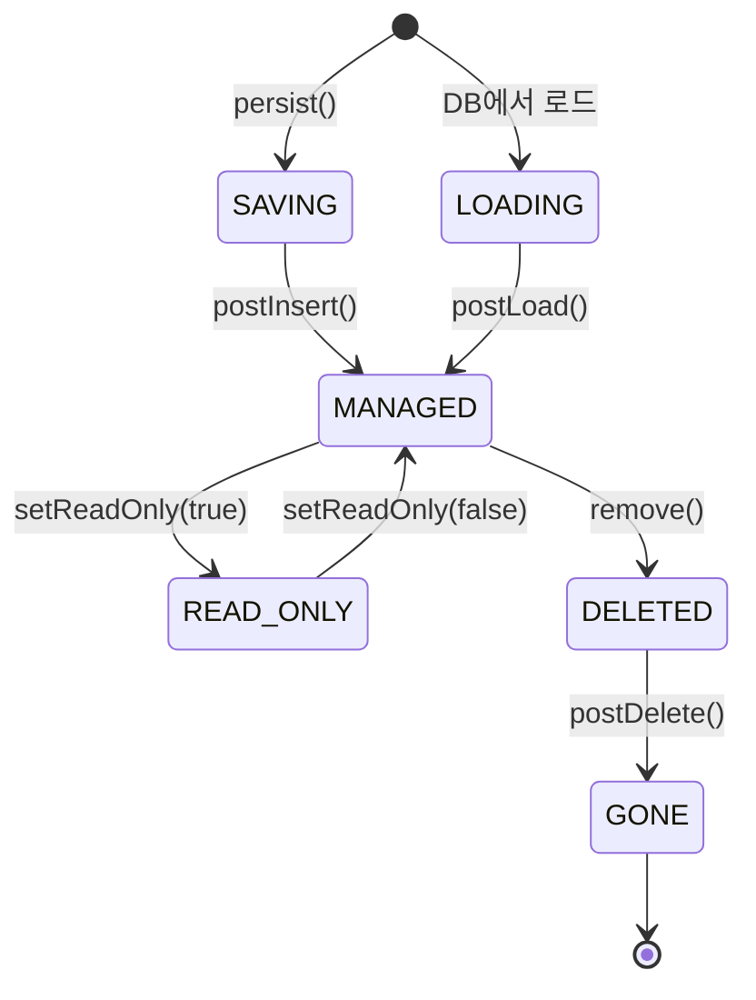
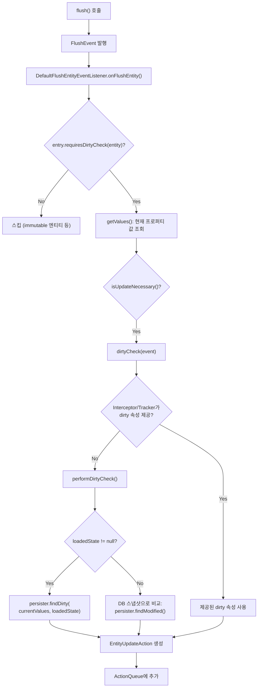
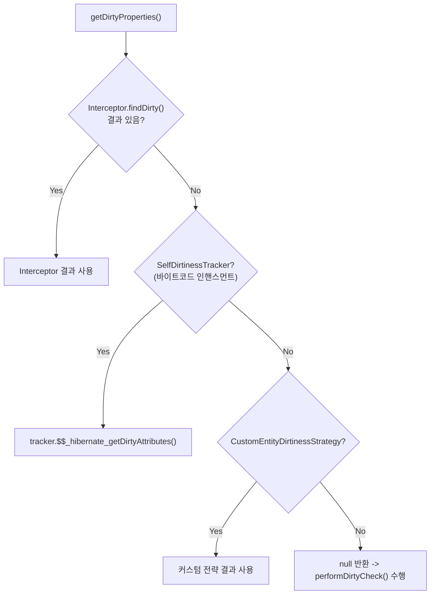

# EntityEntry와 스냅샷 기반 Dirty Checking

Hibernate의 Dirty Checking은 엔티티의 현재 상태와 로드 시점 스냅샷을 비교하여 변경된 필드를 자동으로 감지하는 메커니즘이다. 이 문서에서는 `EntityEntry`의 `loadedState` 스냅샷, `DefaultFlushEntityEventListener`의 Dirty Checking 알고리즘, 그리고 `Status` enum을 소스 코드 수준에서 분석한다.

## 목차
- [1. 핵심 개념 (What)](#1-핵심-개념-what)
- [2. 왜 알아야 하는가 (Why)](#2-왜-알아야-하는가-why)
- [3. 내부 구현 분석 (How)](#3-내부-구현-분석-how)
- [4. 실전 예제](#4-실전-예제)
- [5. 정리](#5-정리)

---

## 1. 핵심 개념 (What)

Hibernate에서 엔티티를 `persist()`하거나 DB에서 로드하면, 그 시점의 프로퍼티 값 배열이 **스냅샷(loadedState)** 으로 `EntityEntry`에 저장된다. `flush()` 시점에 엔티티의 현재 값과 이 스냅샷을 비교하여 변경된 프로퍼티를 자동으로 감지한다.

소스 코드의 Javadoc:

> *Information about the current state of a managed entity instance with respect to its persistent state. Hibernate instantiates very many instances of this type, and so we need to take care of its impact on memory consumption.*

### 핵심 구성 요소

| 구성 요소 | 역할 |
|-----------|------|
| `EntityEntry` (인터페이스) | 엔티티의 영속 상태 정보 정의 |
| `EntityEntryImpl` (구현체) | loadedState, Status, LockMode 등 보관 |
| `Status` (enum) | MANAGED, READ_ONLY, DELETED, GONE, LOADING, SAVING |
| `DefaultFlushEntityEventListener` | flush 시 Dirty Checking 수행 |

## 2. 왜 알아야 하는가 (Why)

- **성능 최적화**: Dirty Checking은 모든 프로퍼티를 비교하므로 프로퍼티가 많은 엔티티에서 병목이 될 수 있다. `@DynamicUpdate`나 바이트코드 인핸스먼트의 필요성을 판단하려면 내부 동작을 이해해야 한다.
- **불필요한 UPDATE 방지**: 값을 같은 값으로 다시 설정해도 Dirty Checking에 의해 UPDATE가 발생하지 않는 이유를 이해할 수 있다.
- **read-only 엔티티의 메모리 절약**: READ_ONLY 상태에서 loadedState가 null로 설정되어 메모리를 절약하는 최적화를 이해할 수 있다.
- **커스텀 Dirty Checking**: `SelfDirtinessTracker`, `CustomEntityDirtinessStrategy`, `Interceptor.findDirty()` 등의 확장 포인트를 이해하고 활용할 수 있다.

## 3. 내부 구현 분석 (How)

### 3.1 EntityEntryImpl -- 스냅샷 저장소

`EntityEntryImpl`은 `EntityEntry` 인터페이스의 핵심 구현체다:

```java
// EntityEntryImpl.java
public final class EntityEntryImpl implements Serializable, EntityEntry {
    private final Object id;
    private Object[] loadedState;     // <-- 로드 시점 스냅샷
    private Object version;
    private final EntityPersister persister;
    private transient EntityKey cachedEntityKey;
    private final transient Object rowId;
    private final transient PersistenceContext persistenceContext;
    private transient ImmutableBitSet maybeLazySet;
    private EntityEntryExtraState next;

    // 비트 필드로 Status, LockMode 등을 압축 저장
    private transient int compressedState;
}
```

**메모리 최적화 포인트**: `compressedState` 필드는 비트 연산으로 여러 enum/boolean 값을 하나의 int에 압축한다:

```
0000 0000 | 0000 0000 | 0654 3333 | 2222 1111
                        ^^^^ ^^^^   ^^^^  ^^^^
                        |  | ||||   ||||  LockMode (4비트)
                        |  | ||||   Status (4비트)
                        |  | PreviousStatus (4비트)
                        |  existsInDatabase (1비트)
                        isBeingReplicated (1비트)
```

#### 생성자에서의 스냅샷 저장

```java
// EntityEntryImpl 생성자
public EntityEntryImpl(
        final Status status,
        final Object[] loadedState,  // 로드 시점의 프로퍼티 값 배열
        final Object rowId,
        final Object id,
        final Object version,
        final LockMode lockMode,
        final boolean existsInDatabase,
        final EntityPersister persister,
        final boolean disableVersionIncrement,
        final PersistenceContext persistenceContext) {

    setCompressedValue(STATUS, status);
    setCompressedValue(PREVIOUS_STATUS, null);

    // READ_ONLY 상태에서는 loadedState를 저장하지 않는다 (메모리 최적화)
    if (status != READ_ONLY) {
        this.loadedState = loadedState;
    }

    this.id = id;
    this.version = version;
    // ...
}
```

### 3.2 Status enum -- 엔티티 상태

```java
// Status.java
public enum Status {
    MANAGED,    // 영속 상태 (변경 감지 대상)
    READ_ONLY,  // 읽기 전용 (loadedState = null, 변경 감지 미수행)
    DELETED,    // 삭제 예정 (flush 시 DELETE SQL)
    GONE,       // 삭제 완료
    LOADING,    // 로딩 중
    SAVING;     // 저장 중

    public boolean isDeletedOrGone() {
        return this == DELETED || this == GONE;
    }
}
```



#### Status 변경 시 loadedState 처리

```java
// EntityEntryImpl.setStatus()
public void setStatus(Status status) {
    if (status == READ_ONLY) {
        loadedState = null;  // 메모리 최적화: 읽기 전용은 스냅샷 불필요
    }
    final Status currentStatus = getStatus();
    if (currentStatus != status) {
        setCompressedValue(PREVIOUS_STATUS, currentStatus);
        setCompressedValue(STATUS, status);
    }
}
```

### 3.3 Dirty Checking 전체 흐름



### 3.4 DefaultFlushEntityEventListener -- 핵심 로직

#### onFlushEntity()

```java
// DefaultFlushEntityEventListener.onFlushEntity()
public void onFlushEntity(FlushEntityEvent event) {
    final Object entity = event.getEntity();
    final var entry = event.getEntityEntry();

    // immutable이고 컬렉션이 없으면 스킵
    if (!entry.getPersister().isMutable() && !entry.getPersister().hasCollections()) {
        return;
    }

    // 1. dirty check가 필요한지 판단
    final boolean mightBeDirty = entry.requiresDirtyCheck(entity);

    // 2. 현재 프로퍼티 값 조회
    final Object[] values = getValues(entity, entry, mightBeDirty, session);
    event.setPropertyValues(values);

    // 3. UPDATE가 필요한지 확인
    if (isUpdateNecessary(event, mightBeDirty)) {
        scheduleUpdate(event);  // EntityUpdateAction 생성 -> ActionQueue에 추가
    }
}
```

#### performDirtyCheck() -- 실제 비교 로직

```java
// DefaultFlushEntityEventListener.performDirtyCheck()
private static int[] performDirtyCheck(FlushEntityEvent event) {
    final var entry = event.getEntityEntry();
    final var persister = entry.getPersister();
    final Object[] values = event.getPropertyValues();
    final Object[] loadedState = entry.getLoadedState();
    final Object entity = event.getEntity();

    int[] dirtyProperties = null;
    boolean dirtyCheckPossible;

    if (loadedState != null) {
        // 일반적인 경우: loadedState 스냅샷과 비교
        dirtyProperties = persister.findDirty(values, loadedState, entity, session);
        dirtyCheckPossible = true;
    }
    else if (entry.getStatus() == Status.DELETED && !entry.isModifiableEntity()) {
        // 삭제된 읽기전용 엔티티: deletedState와 비교
        final Object[] currentState = persister.getValues(event.getEntity());
        dirtyProperties = persister.findDirty(entry.getDeletedState(), currentState, entity, session);
        dirtyCheckPossible = true;
    }
    else {
        // loadedState가 없는 경우: DB에서 스냅샷을 가져와서 비교
        final Object[] databaseSnapshot = getDatabaseSnapshot(persister, entry.getId(), session);
        if (databaseSnapshot != null) {
            dirtyProperties = persister.findModified(databaseSnapshot, values, entity, session);
            dirtyCheckPossible = true;
        } else {
            dirtyCheckPossible = false;
        }
    }

    return dirtyProperties;
}
```

### 3.5 Dirty Checking 전략 우선순위

Hibernate는 여러 Dirty Checking 전략을 지원하며, 다음 우선순위로 적용된다:

```java
// DefaultFlushEntityEventListener.getDirtyProperties()
private static int[] getDirtyProperties(FlushEntityEvent event) {
    // 1순위: Interceptor.findDirty()
    final int[] dirtyProperties = getDirtyPropertiesFromInterceptor(event);
    if (dirtyProperties != null) {
        return dirtyProperties;
    }

    // 2순위: SelfDirtinessTracker (바이트코드 인핸스먼트)
    final Object entity = event.getEntity();
    if (isSelfDirtinessTracker(entity) && asManagedEntity(entity).$$_hibernate_useTracker()) {
        return getDirtyPropertiesFromSelfDirtinessTracker(
            asSelfDirtinessTracker(entity), event);
    }

    // 3순위: CustomEntityDirtinessStrategy
    return getDirtyPropertiesFromCustomEntityDirtinessStrategy(event);
}
```



### 3.6 postUpdate() -- 스냅샷 갱신

UPDATE 실행 후 `EntityEntryImpl.postUpdate()`가 호출되어 loadedState를 갱신한다:

```java
// EntityEntryImpl.postUpdate()
public void postUpdate(Object entity, Object[] updatedState, Object nextVersion) {
    // 스냅샷을 업데이트된 상태로 교체
    loadedState = updatedState;

    // LockMode를 WRITE로 격상
    setLockMode(LockMode.WRITE);

    // 버전 갱신
    if (persister.isVersioned()) {
        version = nextVersion;
        persister.setValue(entity, persister.getVersionPropertyIndex(), nextVersion);
    }

    // 바이트코드 인핸스먼트 트래커 리셋
    processIfSelfDirtinessTracker(entity, EntityEntryImpl::clearDirtyAttributes);
    processIfManagedEntity(entity, EntityEntryImpl::useTracker);

    // 커스텀 전략 리셋
    session.getFactory().getCustomEntityDirtinessStrategy()
        .resetDirty(entity, persister, (SessionImplementor) session);
}
```

## 4. 실전 예제

### 예제 1: 기본 Dirty Checking

```java
try (Session session = sessionFactory.openSession()) {
    Transaction tx = session.beginTransaction();

    // DB에서 로드 -> loadedState = ["홍길동", "hong@mail.com"]
    Member member = session.find(Member.class, 1L);

    // 필드 변경
    member.setEmail("new@mail.com");
    // 현재 상태: ["홍길동", "new@mail.com"]

    // flush 시 loadedState와 현재 상태 비교
    // -> email 필드만 dirty -> UPDATE member SET email=? WHERE id=?
    tx.commit();
}
```

### 예제 2: read-only로 Dirty Checking 비활성화

```java
try (Session session = sessionFactory.openSession()) {
    Transaction tx = session.beginTransaction();

    Member member = session.find(Member.class, 1L);

    // read-only 설정 -> EntityEntry.status = READ_ONLY, loadedState = null
    session.setReadOnly(member, true);

    member.setEmail("changed@mail.com");  // 변경해도

    tx.commit();  // UPDATE SQL이 발생하지 않음 (loadedState가 null이므로)
}
```

## 5. 정리

| 구성 요소 | 핵심 역할 | 소스 위치 |
|-----------|-----------|-----------|
| `EntityEntryImpl.loadedState` | 로드 시점 프로퍼티 스냅샷 (Object[]) | `engine.internal.EntityEntryImpl` |
| `EntityEntryImpl.compressedState` | Status, LockMode 등을 비트 필드로 압축 | `engine.internal.EntityEntryImpl` |
| `Status` enum | MANAGED, READ_ONLY, DELETED, GONE, LOADING, SAVING | `engine.spi.Status` |
| `DefaultFlushEntityEventListener` | flush 시 dirty check 수행 및 EntityUpdateAction 생성 | `event.internal.DefaultFlushEntityEventListener` |
| `persister.findDirty()` | 현재 값과 loadedState를 프로퍼티별 비교 | `EntityPersister` 구현체 |

**핵심 포인트**:
- **스냅샷 기반**: 로드 시 `Object[]`로 프로퍼티 값을 복사해두고, flush 시 현재 값과 비교한다.
- **READ_ONLY 최적화**: `loadedState = null`로 설정하여 메모리를 절약하고 dirty check를 건너뛴다.
- **3단계 dirty 감지 전략**: Interceptor -> SelfDirtinessTracker -> CustomEntityDirtinessStrategy -> 기본 스냅샷 비교 순으로 시도한다.
- **비트 필드 압축**: `EntityEntryImpl`은 매우 많은 인스턴스가 생성되므로, `compressedState`로 메모리 사용을 최소화한다.

---
*참고: Hibernate ORM 6.5.x 기준*
