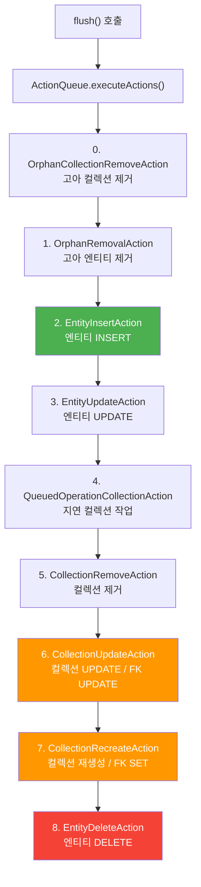
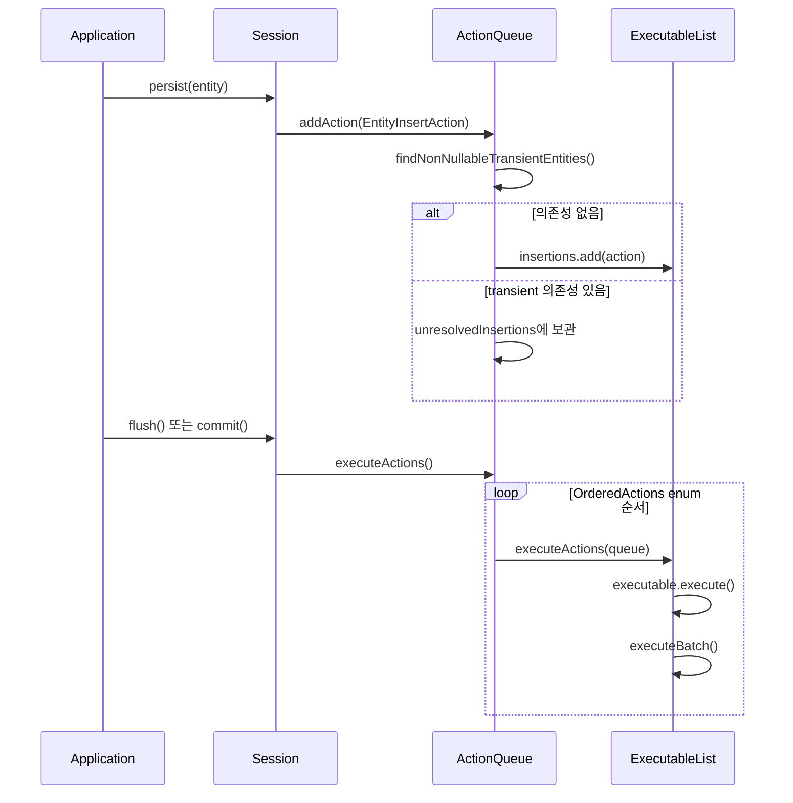

# ActionQueue와 Flush 실행 순서

Hibernate의 `ActionQueue`는 영속성 컨텍스트에서 발생한 모든 DML 작업을 큐에 저장하고, flush 시점에 **정해진 순서**로 실행한다. 이 순서는 `OrderedActions` enum의 선언 순서로 결정되며, 참조 무결성(referential integrity)을 보장하는 핵심 메커니즘이다.

## 목차
- [1. 핵심 개념 (What)](#1-핵심-개념-what)
- [2. 왜 알아야 하는가 (Why)](#2-왜-알아야-하는가-why)
- [3. 내부 구현 분석 (How)](#3-내부-구현-분석-how)
- [4. 실전 예제](#4-실전-예제)
- [5. 정리](#5-정리)

---

## 1. 핵심 개념 (What)

`ActionQueue`는 세션의 **transactional write-behind** 의미론을 구현하는 클래스다. 엔티티에 대한 persist, merge, remove 등의 작업은 즉시 DB에 반영되지 않고, `ActionQueue` 내부 큐에 `Executable` 액션으로 쌓인다. flush가 발생하면 이 큐의 액션들이 **특정 순서**로 실행된다.

핵심은 `OrderedActions` enum이다. 이 enum의 **선언 순서 자체가 flush 실행 순서**를 결정한다.

```java
// ActionQueue.java (line 110~225)
// The order of these operations is very important
private enum OrderedActions {
    OrphanCollectionRemoveAction,  // 0번: 고아 컬렉션 제거
    OrphanRemovalAction,           // 1번: 고아 엔티티 제거
    EntityInsertAction,            // 2번: 엔티티 INSERT
    EntityUpdateAction,            // 3번: 엔티티 UPDATE
    QueuedOperationCollectionAction, // 4번: 지연 컬렉션 작업
    CollectionRemoveAction,        // 5번: 컬렉션 제거
    CollectionUpdateAction,        // 6번: 컬렉션 UPDATE (FK UPDATE 포함)
    CollectionRecreateAction,      // 7번: 컬렉션 재생성 (FK UPDATE 포함)
    EntityDeleteAction;            // 8번: 엔티티 DELETE
}
```

## 2. 왜 알아야 하는가 (Why)

### FK 제약 조건 위반 방지

부모-자식 관계에서 자식 INSERT는 부모 INSERT 이후에 실행되어야 한다. 반대로 부모 DELETE는 자식 DELETE 이후에 실행되어야 한다. `OrderedActions`는 이 순서를 **INSERT -> UPDATE -> DELETE** 패턴으로 보장한다.

### one-to-many에서 FK UPDATE 시점 이해

`@OneToMany` 관계에서 부모 엔티티를 persist하면, 자식 엔티티의 FK 컬럼은 별도의 UPDATE SQL로 설정된다. 이 UPDATE는 `CollectionUpdateAction` 또는 `CollectionRecreateAction`에 의해 실행되며, 반드시 `EntityInsertAction` **이후에** 실행된다. 이 순서를 모르면 "왜 INSERT 후 UPDATE가 추가로 나가는지" 이해할 수 없다.

### 성능 최적화

같은 타입의 작업이 연속 실행되므로 JDBC batch가 효과적으로 동작한다. `isOrderInsertsEnabled()`, `isOrderUpdatesEnabled()` 설정에 따라 같은 엔티티 타입의 INSERT끼리 그룹핑이 가능하다.

## 3. 내부 구현 분석 (How)

### 3.1 executeActions() - flush의 핵심

```java
// ActionQueue.java (line 485~507)
public void executeActions() throws HibernateException {
    if ( hasUnresolvedEntityInsertActions() ) {
        // ... 미해결 transient 엔티티 의존성 처리 ...
        throw new TransientPropertyValueException(...);
    }

    for ( var action : ORDERED_OPERATIONS ) {
        executeActions( action.getActions( this ) );
    }
}
```

`ORDERED_OPERATIONS`는 `OrderedActions.values()`를 캐싱한 상수 배열이다. enum의 `values()` 메서드는 선언 순서대로 배열을 반환하므로, **enum 선언 순서 = flush 실행 순서**가 된다.

```java
// ActionQueue.java (line 107)
private static final OrderedActions[] ORDERED_OPERATIONS = OrderedActions.values();
```

### 3.2 Flush 실행 순서 흐름도



### 3.3 각 액션 큐와 필드 매핑

각 `OrderedActions` enum 값은 `ActionQueue`의 특정 `ExecutableList` 필드에 매핑된다.

```java
// ActionQueue.java (line 83~99)
private ExecutableList<AbstractEntityInsertAction> insertions;
private ExecutableList<EntityDeleteAction> deletions;
private ExecutableList<EntityUpdateAction> updates;
private ExecutableList<CollectionRecreateAction> collectionCreations;
private ExecutableList<CollectionUpdateAction> collectionUpdates;
private ExecutableList<QueuedOperationCollectionAction> collectionQueuedOps;
private ExecutableList<CollectionRemoveAction> collectionRemovals;
private ExecutableList<CollectionRemoveAction> orphanCollectionRemovals;
private ExecutableList<OrphanRemovalAction> orphanRemovals;
```

### 3.4 executeActions(ExecutableList) - 개별 큐 실행

```java
// ActionQueue.java (line 625~660)
private <E extends ComparableExecutable> void executeActions(
        @Nullable ExecutableList<E> queue) throws HibernateException {
    if ( queue != null && !queue.isEmpty() ) {
        try {
            for ( var executable : queue ) {
                try {
                    executable.execute();
                }
                finally {
                    // 트랜잭션 완료 콜백 등록
                    final var beforeCompletionProcess =
                            executable.getBeforeTransactionCompletionProcess();
                    if ( beforeCompletionProcess != null ) {
                        transactionCompletionCallbacks
                                .registerCallback( beforeCompletionProcess );
                    }
                    // ... afterCompletionProcess 등록 ...
                }
            }
        }
        finally {
            if ( getSessionFactoryOptions().isQueryCacheEnabled() ) {
                invalidateSpaces( queue.getQuerySpaces().toArray( new String[0] ) );
            }
        }
        queue.clear();
        session.getJdbcCoordinator().executeBatch();  // JDBC batch 실행
    }
}
```

각 `ExecutableList` 처리 후 `queue.clear()`와 `executeBatch()`가 호출된다. 이는 같은 종류의 작업을 배치로 묶어 실행하는 효과를 낸다.

### 3.5 INSERT 순서 최적화: InsertActionSorter

`EntityInsertAction` 큐는 `InsertActionSorter`를 통해 추가 정렬이 가능하다.

```java
// ActionQueue.java (line 135~149)
EntityInsertAction {
    @Override
    public void ensureInitialized(final ActionQueue instance) {
        if ( instance.insertions == null ) {
            instance.insertions = instance.isOrderInsertsEnabled()
                    ? new ExecutableList<>( InsertActionSorter.INSTANCE )
                    : new ExecutableList<>( false );
        }
    }
}
```

`hibernate.order_inserts=true`일 때, 같은 엔티티 타입의 INSERT를 그룹핑하여 JDBC batch 효율을 높인다. `InsertActionSorter`는 FK 의존성 그래프를 분석하여 제약 조건을 위반하지 않는 범위 내에서 재정렬한다.

### 3.6 addAction - 큐에 액션 추가

```java
// ActionQueue.java (line 255~258)
public void addAction(EntityInsertAction action) {
    ACTION_LOGGER.addingEntityInsertAction( action.getEntityName() );
    addInsertAction( action );
}
```

persist() 호출 시 `DefaultPersistEventListener`가 `EntityInsertAction`을 생성하고, `ActionQueue.addAction()`을 통해 큐에 등록한다. 이때 transient 엔티티 의존성이 있으면 `unresolvedInsertions`에 보관되고, 의존성이 해결될 때까지 대기한다.



## 4. 실전 예제

### 부모-자식 @OneToMany에서의 flush 순서

```java
@Entity
class Team {
    @Id @GeneratedValue
    private Long id;

    @OneToMany(mappedBy = "team", cascade = CascadeType.ALL)
    private List<Member> members = new ArrayList<>();
}

@Entity
class Member {
    @Id @GeneratedValue
    private Long id;

    @ManyToOne
    @JoinColumn(name = "team_id")
    private Team team;
}
```

```java
Team team = new Team();
Member m1 = new Member();
Member m2 = new Member();
m1.setTeam(team);
m2.setTeam(team);
team.getMembers().add(m1);
team.getMembers().add(m2);

em.persist(team);  // cascade로 m1, m2도 persist
em.flush();
```

실행되는 SQL 순서:

```
-- 2번: EntityInsertAction (엔티티 INSERT)
INSERT INTO team (id) VALUES (1)
INSERT INTO member (id, team_id) VALUES (1, 1)
INSERT INTO member (id, team_id) VALUES (2, 1)

-- 7번: CollectionRecreateAction (컬렉션 재생성)
-- mappedBy이므로 inverse=true, 추가 SQL 없음
```

만약 `mappedBy`가 없는 단방향 `@OneToMany`라면:

```
-- 2번: EntityInsertAction
INSERT INTO team (id) VALUES (1)
INSERT INTO member (id) VALUES (1)        -- team_id = NULL
INSERT INTO member (id) VALUES (2)        -- team_id = NULL

-- 7번: CollectionRecreateAction (FK UPDATE)
UPDATE member SET team_id = 1 WHERE id = 1
UPDATE member SET team_id = 1 WHERE id = 2
```

이것이 바로 `OrderedActions`의 순서가 보장하는 패턴이다. INSERT가 먼저 실행되고, FK UPDATE가 뒤따른다.

## 5. 정리

| 순서 | OrderedActions enum 값 | 역할 | SQL 유형 |
|:---:|:---|:---|:---|
| 0 | `OrphanCollectionRemoveAction` | 고아 객체의 컬렉션 제거 | UPDATE (FK null) / DELETE |
| 1 | `OrphanRemovalAction` | 고아 엔티티 제거 | DELETE |
| 2 | `EntityInsertAction` | 엔티티 삽입 | INSERT |
| 3 | `EntityUpdateAction` | 엔티티 수정 | UPDATE |
| 4 | `QueuedOperationCollectionAction` | 지연 컬렉션 작업 | 다양 |
| 5 | `CollectionRemoveAction` | 컬렉션 제거 | UPDATE (FK null) / DELETE |
| 6 | `CollectionUpdateAction` | 컬렉션 변경 (FK UPDATE 포함) | UPDATE / INSERT / DELETE |
| 7 | `CollectionRecreateAction` | 컬렉션 재생성 (FK SET 포함) | UPDATE / INSERT |
| 8 | `EntityDeleteAction` | 엔티티 삭제 | DELETE |

**핵심 원리**: INSERT(2번) -> Collection UPDATE/Recreate(6,7번) -> DELETE(8번) 순서가 보장되므로, FK 제약 조건이 자동으로 충족된다. 자식 INSERT 시 아직 FK가 null이어도, 이후 CollectionAction에서 FK를 UPDATE하므로 최종적으로 무결성이 보장된다.

---
*참고: Hibernate ORM 6.5.x 기준*
