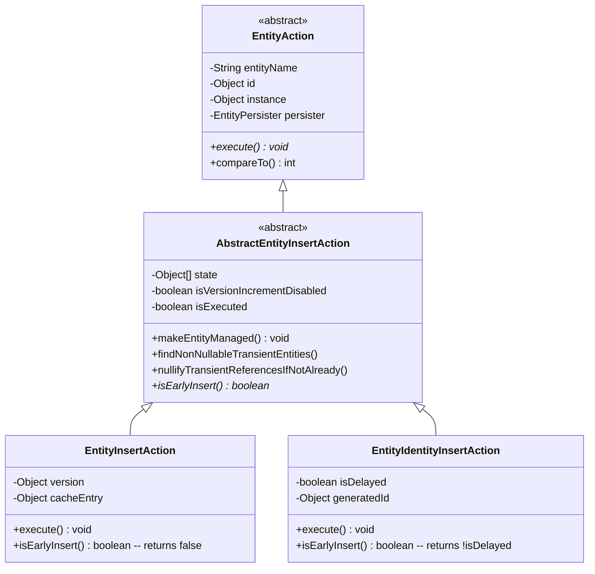
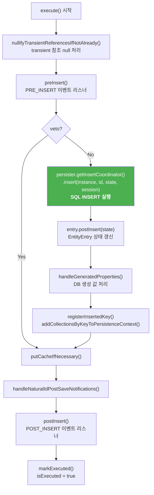
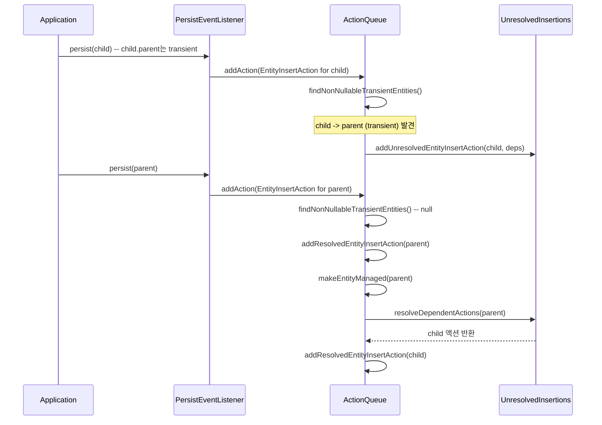

# EntityInsertAction의 INSERT 처리 흐름

`EntityInsertAction`은 Hibernate가 엔티티를 데이터베이스에 INSERT하는 핵심 액션 클래스다. `persist()` 호출부터 실제 SQL INSERT 실행까지의 전체 호출 체인을 분석하고, IDENTITY 전략을 위한 `EntityIdentityInsertAction`과의 차이를 살펴본다.

## 목차
- [1. 핵심 개념 (What)](#1-핵심-개념-what)
- [2. 왜 알아야 하는가 (Why)](#2-왜-알아야-하는가-why)
- [3. 내부 구현 분석 (How)](#3-내부-구현-분석-how)
- [4. 실전 예제](#4-실전-예제)
- [5. 정리](#5-정리)

---

## 1. 핵심 개념 (What)

Hibernate에서 `em.persist(entity)` 호출은 즉시 SQL INSERT를 실행하지 않는다. 대신 다음과 같은 단계를 거친다:

1. **persist() 이벤트** -> `DefaultPersistEventListener`가 처리
2. **Action 생성** -> `EntityInsertAction` 또는 `EntityIdentityInsertAction` 인스턴스 생성
3. **ActionQueue에 등록** -> flush 시점까지 대기
4. **flush 시 실행** -> `execute()` 메서드를 통해 실제 INSERT 수행

이 흐름의 클래스 계층 구조:

```
EntityAction (abstract)
  └── AbstractEntityInsertAction (abstract)
        ├── EntityInsertAction          -- SEQUENCE, TABLE 등 사전 ID 할당 전략
        └── EntityIdentityInsertAction  -- IDENTITY (auto-increment) 전략
```

## 2. 왜 알아야 하는가 (Why)

### IDENTITY vs SEQUENCE 전략의 동작 차이 이해

- `SEQUENCE` 전략: `EntityInsertAction`이 사용되며, flush 시점까지 INSERT를 지연할 수 있다.
- `IDENTITY` 전략: `EntityIdentityInsertAction`이 사용되며, persist() 시점에 **즉시** INSERT가 실행된다. ID를 DB에서 생성해야 하므로 지연이 불가능하다.

이 차이가 JDBC batch 성능에 직접적인 영향을 미친다.

### 영속성 컨텍스트 관리 메커니즘

`AbstractEntityInsertAction.makeEntityManaged()`는 엔티티를 영속 상태로 전환하는 핵심 메서드다. 이 메서드가 호출되는 시점과 조건을 알면, 엔티티 상태 전이를 정확히 이해할 수 있다.

### Transient 의존성 해결 과정

non-nullable FK가 아직 persist되지 않은 transient 엔티티를 참조할 때, Hibernate는 `UnresolvedEntityInsertActions`에 해당 액션을 보관하고, 의존 엔티티가 persist될 때 자동으로 해결한다.

## 3. 내부 구현 분석 (How)

### 3.1 클래스 계층과 역할



### 3.2 EntityInsertAction 생성자

```java
// EntityInsertAction.java (line 47~57)
public EntityInsertAction(
        final Object id,
        final Object[] state,
        final Object instance,
        final Object version,
        final EntityPersister persister,
        final boolean isVersionIncrementDisabled,
        final EventSource session) {
    super( id, state, instance, isVersionIncrementDisabled, persister, session );
    this.version = version;
}
```

생성 시 이미 `id`가 할당되어 있다 (SEQUENCE 등에서 미리 조회). 부모 클래스 `AbstractEntityInsertAction`의 생성자에서는 Natural ID 관련 사전 처리도 수행된다.

```java
// AbstractEntityInsertAction.java (line 48~64)
protected AbstractEntityInsertAction(
        Object id, Object[] state, Object instance,
        boolean isVersionIncrementDisabled,
        EntityPersister persister, EventSource session) {
    super( session, id, instance, persister );
    this.state = state;
    this.isVersionIncrementDisabled = isVersionIncrementDisabled;
    this.isExecuted = false;
    this.areTransientReferencesNullified = false;

    if ( id != null ) {
        handleNaturalIdPreSaveNotifications();
    }
}
```

### 3.3 EntityInsertAction.execute() - INSERT 실행의 핵심

```java
// EntityInsertAction.java (line 91~134)
@Override
public void execute() throws HibernateException {
    nullifyTransientReferencesIfNotAlready();  // (1)

    final var session = getSession();
    final Object id = getId();
    final boolean veto = preInsert();           // (2) 이벤트 리스너 호출

    if ( !veto ) {
        final var persister = getPersister();
        final Object instance = getInstance();
        final var eventMonitor = session.getEventMonitor();
        final var event = eventMonitor.beginEntityInsertEvent();
        boolean success = false;
        final GeneratedValues generatedValues;
        try {
            // (3) 핵심: 실제 SQL INSERT 실행
            generatedValues = persister.getInsertCoordinator()
                    .insert( instance, id, getState(), session );
            success = true;
        }
        finally {
            eventMonitor.completeEntityInsertEvent(
                    event, id, persister.getEntityName(), success, session );
        }
        final var persistenceContext = session.getPersistenceContextInternal();
        final var entry = persistenceContext.getEntry( instance );
        if ( entry == null ) {
            throw new AssertionFailure(
                    "possible non-threadsafe access to session" );
        }
        entry.postInsert( getState() );              // (4) EntityEntry 갱신
        handleGeneratedProperties(                    // (5) DB 생성 값 처리
                entry, generatedValues, persistenceContext );
        persistenceContext.registerInsertedKey(        // (6) INSERT 키 등록
                persister, id );
        addCollectionsByKeyToPersistenceContext(       // (7) 컬렉션 키 등록
                persistenceContext, getState() );
    }

    putCacheIfNecessary();                            // (8) 2차 캐시 갱신
    handleNaturalIdPostSaveNotifications( id );       // (9) Natural ID 처리
    postInsert();                                     // (10) POST_INSERT 이벤트

    final var statistics = session.getFactory().getStatistics();
    if ( statistics.isStatisticsEnabled() && !veto ) {
        statistics.insertEntity( getPersister().getEntityName() );
    }

    markExecuted();                                    // (11) 실행 완료 표시
}
```

### 3.4 execute() 실행 흐름도



### 3.5 EntityIdentityInsertAction과의 차이

`EntityIdentityInsertAction`은 IDENTITY (auto-increment) 전략에서 사용된다. 가장 큰 차이점은 **isEarlyInsert()**의 반환값이다.

```java
// EntityInsertAction.java (line 76~78)
@Override
public boolean isEarlyInsert() {
    return false;   // flush까지 지연 가능
}
```

```java
// EntityIdentityInsertAction.java (line 307~309)
@Override
public boolean isEarlyInsert() {
    return !isDelayed;  // 대부분 true -> 즉시 INSERT
}
```

`isEarlyInsert() == true`이면 `ActionQueue.addResolvedEntityInsertAction()`에서 큐에 넣지 않고 **즉시 실행**한다:

```java
// ActionQueue.java (line 286~297)
private void addResolvedEntityInsertAction(AbstractEntityInsertAction insert) {
    if ( insert.isEarlyInsert() ) {
        ACTION_LOGGER.executingInsertionsBeforeResolvedEarlyInsert();
        executeInserts();                       // 기존 큐 먼저 flush
        ACTION_LOGGER.executingIdentityInsertImmediately();
        execute( insert );                      // 즉시 실행!
    }
    else {
        ACTION_LOGGER.addingResolvedNonEarlyInsertAction();
        OrderedActions.EntityInsertAction.ensureInitialized( this );
        insertions.add( insert );               // 큐에 저장, flush 대기
    }
    // ...
}
```

또한 `EntityIdentityInsertAction.execute()`에서는 INSERT 실행 후 DB가 생성한 ID를 받아와 엔티티에 설정한다:

```java
// EntityIdentityInsertAction.java (line 86~121)
generatedValues = persister.getInsertCoordinator()
        .insert( instance, state, session );     // id 파라미터 없음!
generatedId = generatedValues == null
        ? null
        : generatedValues.getGeneratedValue( persister.getIdentifierMapping() );
// ...
persister.setIdentifier( instance, generatedId, session );
```

### 3.6 Transient 의존성 해결 메커니즘

```java
// AbstractEntityInsertAction.java (line 93~101)
public NonNullableTransientDependencies findNonNullableTransientEntities() {
    return ForeignKeys.findNonNullableTransientEntities(
            getPersister().getEntityName(),
            getInstance(),
            getState(),
            isEarlyInsert(),
            getSession()
    );
}
```

```java
// ActionQueue.java (line 260~283)
private void addInsertAction(AbstractEntityInsertAction insert) {
    if ( insert.isEarlyInsert() ) {
        executeInserts();
    }
    final var nonNullableTransientDependencies =
            insert.findNonNullableTransientEntities();
    if ( nonNullableTransientDependencies == null ) {
        addResolvedEntityInsertAction( insert );       // 의존성 없으면 바로 등록
    }
    else {
        // 미해결 의존성이 있으면 대기열에 보관
        if ( unresolvedInsertions == null ) {
            unresolvedInsertions = new UnresolvedEntityInsertActions();
        }
        unresolvedInsertions.addUnresolvedEntityInsertAction(
                insert, nonNullableTransientDependencies );
    }
}
```



### 3.7 makeEntityManaged() - 영속 상태 전환

```java
// AbstractEntityInsertAction.java (line 128~152)
public final void makeEntityManaged() {
    nullifyTransientReferencesIfNotAlready();
    final var persister = getPersister();
    final var key = getEntityKey();
    final Object[] state = getState();
    final Object version = getVersion( state, persister );
    final var persistenceContext = getSession().getPersistenceContextInternal();
    final var entityHolder = persistenceContext.addEntityHolder( key, getInstance() );
    final var entityEntry = persistenceContext.addEntry(
            getInstance(),
            persister.isMutable() ? Status.MANAGED : Status.READ_ONLY,
            state,
            getRowId(),
            key.getIdentifier(),
            version,
            LockMode.WRITE,        // INSERT 시 WRITE 락
            isExecuted,
            persister,
            isVersionIncrementDisabled
    );
    entityHolder.setEntityEntry( entityEntry );
    // ...
}
```

이 메서드는 `addResolvedEntityInsertAction()` 내에서 호출되며, 엔티티를 1차 캐시에 등록하고 `Status.MANAGED` 상태로 설정한다.

## 4. 실전 예제

### SEQUENCE 전략 - 지연 INSERT

```java
@Entity
class Product {
    @Id @GeneratedValue(strategy = GenerationType.SEQUENCE)
    private Long id;
    private String name;
}
```

```java
Product p1 = new Product("A");
Product p2 = new Product("B");
em.persist(p1);  // ActionQueue에 EntityInsertAction 추가 (SQL 없음)
em.persist(p2);  // ActionQueue에 EntityInsertAction 추가 (SQL 없음)
em.flush();
```

```sql
-- flush 시점에 한꺼번에 실행 (JDBC batch 가능)
SELECT nextval('product_seq')  -- p1 ID 할당 (persist 시점)
SELECT nextval('product_seq')  -- p2 ID 할당 (persist 시점)
INSERT INTO product (id, name) VALUES (1, 'A')  -- flush 시점
INSERT INTO product (id, name) VALUES (2, 'B')  -- flush 시점
```

### IDENTITY 전략 - 즉시 INSERT

```java
@Entity
class Product {
    @Id @GeneratedValue(strategy = GenerationType.IDENTITY)
    private Long id;
    private String name;
}
```

```java
Product p1 = new Product("A");
Product p2 = new Product("B");
em.persist(p1);  // 즉시 INSERT 실행! (EntityIdentityInsertAction)
em.persist(p2);  // 즉시 INSERT 실행!
// flush에서 추가 INSERT 없음
```

```sql
-- persist 시점에 즉시 실행 (JDBC batch 불가)
INSERT INTO product (name) VALUES ('A')  -- persist(p1) 시점
INSERT INTO product (name) VALUES ('B')  -- persist(p2) 시점
```

## 5. 정리

| 구분 | EntityInsertAction | EntityIdentityInsertAction |
|:---|:---|:---|
| ID 전략 | SEQUENCE, TABLE, UUID 등 | IDENTITY (auto-increment) |
| isEarlyInsert() | `false` | `!isDelayed` (대부분 `true`) |
| INSERT 시점 | flush 시 | persist() 시 즉시 |
| JDBC batch | 가능 | 불가 |
| 생성자 id 파라미터 | 필수 (미리 할당) | null 또는 DelayedPostInsertIdentifier |
| execute()에서 ID 처리 | 이미 있는 ID 사용 | INSERT 후 DB에서 generatedId 수신 |

| execute() 단계 | 설명 |
|:---|:---|
| nullifyTransientReferences | transient 참조를 null로 변환 |
| preInsert() | PRE_INSERT 이벤트, veto 가능 |
| persister.getInsertCoordinator().insert() | 실제 SQL INSERT 실행 |
| entry.postInsert() | EntityEntry 상태 갱신 |
| handleGeneratedProperties() | DB 생성 컬럼 값 처리 |
| registerInsertedKey() | 삽입된 키 등록 |
| putCacheIfNecessary() | 2차 캐시 저장 |
| postInsert() | POST_INSERT 이벤트 발행 |
| markExecuted() | 실행 완료 플래그 설정 |

---
*참고: Hibernate ORM 6.5.x 기준*
