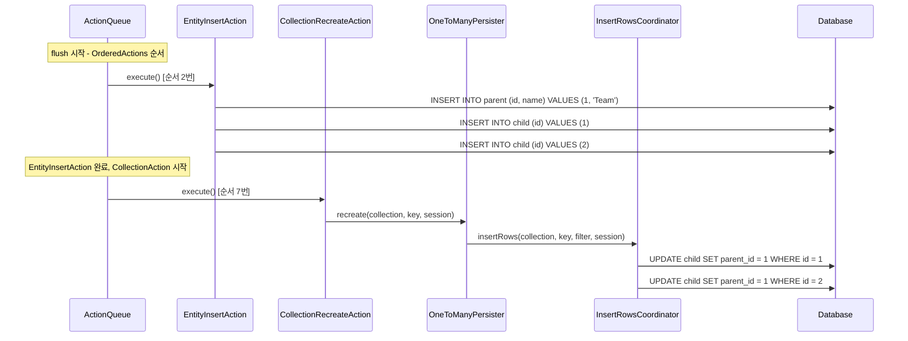
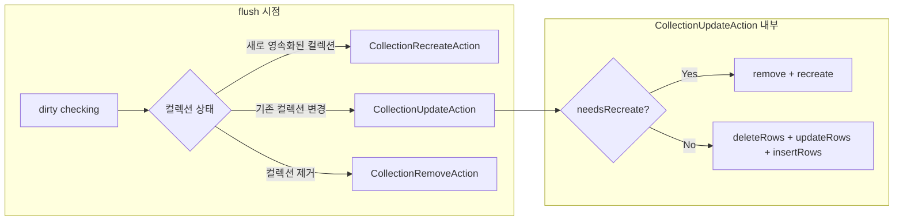

# CollectionUpdateAction과 FK UPDATE

`CollectionUpdateAction`과 `CollectionRecreateAction`은 컬렉션 상태 변경을 데이터베이스에 반영하는 액션이다. 특히 `@OneToMany` 관계에서 이 액션들이 FK UPDATE SQL을 생성하는 과정을 분석한다. 엔티티 INSERT 이후에 별도의 FK UPDATE가 실행되는 이유와 그 내부 메커니즘을 이해한다.

## 목차
- [1. 핵심 개념 (What)](#1-핵심-개념-what)
- [2. 왜 알아야 하는가 (Why)](#2-왜-알아야-하는가-why)
- [3. 내부 구현 분석 (How)](#3-내부-구현-분석-how)
- [4. 실전 예제](#4-실전-예제)
- [5. 정리](#5-정리)

---

## 1. 핵심 개념 (What)

Hibernate에서 컬렉션 관련 액션은 크게 세 가지다:

| 액션 | 역할 | 호출 시점 |
|:---|:---|:---|
| `CollectionRecreateAction` | 새로운 컬렉션 전체 생성 | 새 컬렉션이 영속화될 때 |
| `CollectionUpdateAction` | 기존 컬렉션의 변경사항 반영 | 컬렉션 요소 추가/제거/변경 시 |
| `CollectionRemoveAction` | 컬렉션 전체 제거 | 컬렉션이 null이 되거나 소유자 변경 시 |

이 액션들은 `ActionQueue`의 `OrderedActions`에서 `EntityInsertAction`(2번) **이후**에 실행된다:
- `CollectionUpdateAction` = 6번
- `CollectionRecreateAction` = 7번

이 순서 덕분에 "먼저 엔티티 INSERT -> 이후 FK UPDATE" 패턴이 자연스럽게 보장된다.

## 2. 왜 알아야 하는가 (Why)

### 예상치 못한 UPDATE SQL 이해

`@OneToMany` 단방향 관계에서 `persist()`를 호출하면, INSERT 이후 추가적인 UPDATE SQL이 실행된다. 이 UPDATE는 자식 테이블의 FK 컬럼을 부모 ID로 설정하는 것이며, `CollectionRecreateAction` 또는 `CollectionUpdateAction`에 의해 실행된다.

### deleteRows -> updateRows -> insertRows 순서

`CollectionUpdateAction.execute()` 내부에서는 `persister.deleteRows()` -> `persister.updateRows()` -> `persister.insertRows()` 순서로 호출된다. 이 순서를 이해하면 컬렉션 변경 시 발생하는 SQL 패턴을 예측할 수 있다.

### needsRecreate 분기 이해

컬렉션이 완전히 재생성되어야 하는 경우(예: `@OrderColumn` 사용 시 순서 변경), 기존 데이터를 삭제하고 `persister.recreate()`로 전체를 다시 삽입한다.

## 3. 내부 구현 분석 (How)

### 3.1 CollectionUpdateAction.execute()

```java
// CollectionUpdateAction.java (line 46~105)
@Override
public void execute() throws HibernateException {
    final Object key = getKey();
    final var session = getSession();
    final var persister = getPersister();
    final var collection = getCollection();
    final boolean affectedByFilters =
            persister.isAffectedByEnabledFilters( session );

    preUpdate();

    if ( !collection.wasInitialized() ) {
        if ( !collection.isDirty() ) {
            throw new AssertionFailure( "collection is not dirty" );
        }
        // 초기화되지 않은 컬렉션은 캐시 통지만 수행
    }
    else {
        if ( !affectedByFilters && collection.empty() ) {
            if ( !emptySnapshot ) {
                persister.remove( key, session );  // 전체 삭제
            }
        }
        else if ( collection.needsRecreate( persister ) ) {
            // 컬렉션 재생성이 필요한 경우
            if ( !emptySnapshot ) {
                persister.remove( key, session );  // 기존 데이터 삭제
            }
            persister.recreate( collection, key, session );  // 전체 재생성
        }
        else {
            // 일반적인 증분 업데이트
            persister.deleteRows( collection, key, session );   // 제거된 요소 삭제
            persister.updateRows( collection, key, session );   // 변경된 요소 업데이트
            persister.insertRows( collection, key, session );   // 추가된 요소 삽입
        }
    }

    session.getPersistenceContextInternal()
            .getCollectionEntry( collection ).afterAction( collection );
    evict();
    postUpdate();
    // ...
}
```

### 3.2 execute() 분기 흐름도

```mermaid
flowchart TD
    A["CollectionUpdateAction.execute()"] --> B["preUpdate()"]
    B --> C{collection.wasInitialized?}
    C -->|No| K["캐시 통지만 수행"]
    C -->|Yes| D{collection.empty() <br/>&& !affectedByFilters?}
    D -->|Yes| E{emptySnapshot?}
    E -->|Yes| K
    E -->|No| F["persister.remove(key)<br/>전체 삭제"]
    D -->|No| G{collection.needsRecreate?}
    G -->|Yes| H["persister.remove(key)<br/>+ persister.recreate()<br/>전체 재생성"]
    G -->|No| I["persister.deleteRows()<br/>persister.updateRows()<br/>persister.insertRows()<br/>증분 업데이트"]
    F --> K
    H --> K
    I --> K
    K --> L["collectionEntry.afterAction()<br/>evict() / postUpdate()"]

    style I fill:#FF9800,color:white
    style H fill:#f44336,color:white
```

### 3.3 CollectionRecreateAction.execute()

```java
// CollectionRecreateAction.java (line 37~64)
@Override
public void execute() throws HibernateException {
    // 새로운 non-null 컬렉션이 영속화되거나
    // 기존 컬렉션이 새 소유자에게 이동될 때 호출
    final var collection = getCollection();
    preRecreate();
    final var session = getSession();
    final var persister = getPersister();
    final Object key = getKey();

    persister.recreate( collection, key, session );  // 전체 생성

    session.getPersistenceContextInternal()
            .getCollectionEntry( collection ).afterAction( collection );
    evict();
    postRecreate();
    // ...
}
```

`CollectionRecreateAction`은 분기 없이 단순히 `persister.recreate()`를 호출한다. 새 컬렉션을 처음 영속화할 때 사용된다.

### 3.4 OneToManyPersister에서의 recreate와 insertRows

`@OneToMany` 관계에서 `persister`는 `OneToManyPersister`이다. 이 클래스의 `recreate()`와 `insertRows()` 메서드가 실제로 FK UPDATE를 수행한다.

```java
// OneToManyPersister.java (line 146~157)
@Override
public void recreate(PersistentCollection<?> collection, Object id,
        SharedSessionContractImplementor session) throws HibernateException {
    getInsertRowsCoordinator().insertRows(
            collection, id, collection::includeInRecreate, session );
    writeIndex( collection, collection.entries( this ), id, true, session );
}

@Override
public void insertRows(PersistentCollection<?> collection, Object id,
        SharedSessionContractImplementor session) throws HibernateException {
    getInsertRowsCoordinator().insertRows(
            collection, id, collection::includeInInsert, session );
    writeIndex( collection, collection.entries( this ), id, true, session );
}
```

여기서 핵심은 `getInsertRowsCoordinator().insertRows()`가 실제로는 **UPDATE SQL**을 실행한다는 점이다. (이 비밀은 08번 문서에서 상세히 다룬다.)

### 3.5 전체 SQL 실행 흐름 (OneToMany 단방향)



### 3.6 CollectionUpdateAction의 정렬: 삭제 우선

`CollectionUpdateAction`은 unique key 위반을 줄이기 위해, 삭제가 포함된 업데이트를 앞으로 정렬한다.

```java
// CollectionUpdateAction.java (line 112~126)
@Override
public int compareTo(ComparableExecutable executable) {
    if ( executable instanceof CollectionUpdateAction that
            && getPrimarySortClassifier()
                    .equals( executable.getPrimarySortClassifier() ) ) {
        final var persister = getPersister();
        final boolean hasDeletes =
                this.getCollection().hasDeletes( persister );
        final boolean otherHasDeletes =
                that.getCollection().hasDeletes( persister );
        if ( hasDeletes && !otherHasDeletes ) {
            return -1;  // 삭제가 있는 쪽이 앞으로
        }
        if ( otherHasDeletes && !hasDeletes ) {
            return 1;
        }
    }
    return super.compareTo( executable );
}
```

### 3.7 CollectionUpdateAction vs CollectionRecreateAction



## 4. 실전 예제

### 단방향 @OneToMany 컬렉션에 요소 추가

```java
@Entity
class Team {
    @Id @GeneratedValue
    private Long id;

    @OneToMany
    @JoinColumn(name = "team_id")
    private List<Member> members = new ArrayList<>();
}
```

```java
Team team = em.find(Team.class, 1L);
Member newMember = new Member();
em.persist(newMember);
team.getMembers().add(newMember);
em.flush();
```

실행되는 SQL:

```sql
-- EntityInsertAction (순서 2번)
INSERT INTO member (id) VALUES (3)

-- CollectionUpdateAction (순서 6번)
-- persister.deleteRows() -> 없음
-- persister.updateRows() -> 없음
-- persister.insertRows() -> FK UPDATE 실행
UPDATE member SET team_id = 1 WHERE id = 3
```

### 새 컬렉션 전체 생성

```java
Team team = new Team();
Member m1 = new Member();
Member m2 = new Member();
team.getMembers().add(m1);
team.getMembers().add(m2);
em.persist(team);  // cascade
em.flush();
```

```sql
-- EntityInsertAction (순서 2번)
INSERT INTO team (id) VALUES (1)
INSERT INTO member (id) VALUES (1)
INSERT INTO member (id) VALUES (2)

-- CollectionRecreateAction (순서 7번)
-- persister.recreate() -> FK UPDATE 실행
UPDATE member SET team_id = 1 WHERE id = 1
UPDATE member SET team_id = 1 WHERE id = 2
```

### mappedBy (양방향) 관계에서는 추가 SQL 없음

```java
@Entity
class Team {
    @OneToMany(mappedBy = "team", cascade = CascadeType.ALL)
    private List<Member> members = new ArrayList<>();
}

@Entity
class Member {
    @ManyToOne
    @JoinColumn(name = "team_id")
    private Team team;
}
```

```java
Team team = new Team();
Member m1 = new Member();
m1.setTeam(team);  // 소유 측에서 FK 설정
team.getMembers().add(m1);
em.persist(team);
em.flush();
```

```sql
-- EntityInsertAction만 실행
INSERT INTO team (id) VALUES (1)
INSERT INTO member (id, team_id) VALUES (1, 1)  -- FK가 INSERT에 포함

-- CollectionRecreateAction: inverse=true이므로 INSERT 좌표 생성이 NoOp
-- 추가 UPDATE 없음!
```

`mappedBy`로 설정하면 `OneToManyPersister.isInverse() == true`가 되어 `InsertRowsCoordinatorNoOp`이 사용된다. 따라서 별도의 FK UPDATE가 발생하지 않는다.

## 5. 정리

| 구분 | CollectionRecreateAction | CollectionUpdateAction |
|:---|:---|:---|
| 실행 순서 | 7번 | 6번 |
| 호출 시점 | 새 컬렉션 영속화 | 기존 컬렉션 변경 |
| 내부 동작 | `persister.recreate()` | deleteRows -> updateRows -> insertRows |
| needsRecreate 분기 | 없음 | 있음 (remove + recreate 가능) |
| 단방향 OneToMany | FK UPDATE 실행 | FK UPDATE 실행 |
| mappedBy (inverse) | NoOp (SQL 없음) | NoOp (SQL 없음) |

| CollectionUpdateAction 분기 | 조건 | 동작 |
|:---|:---|:---|
| 전체 삭제 | `collection.empty() && !emptySnapshot` | `persister.remove(key)` |
| 전체 재생성 | `collection.needsRecreate()` | remove + recreate |
| 증분 업데이트 | 기본 | deleteRows + updateRows + insertRows |
| 캐시만 통지 | `!collection.wasInitialized()` | SQL 없음, 캐시 무효화 |

---
*참고: Hibernate ORM 6.5.x 기준*
