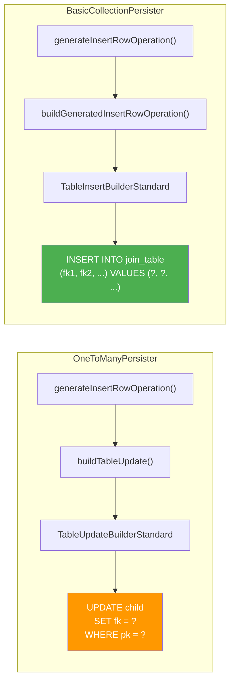
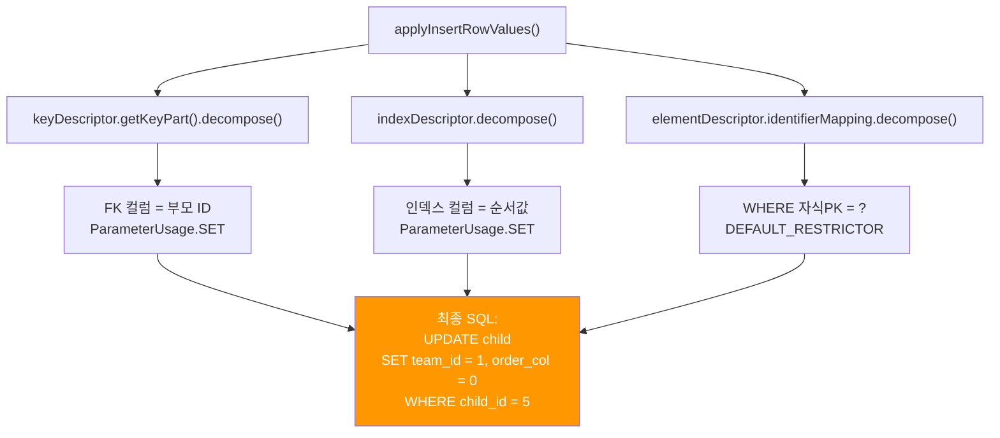
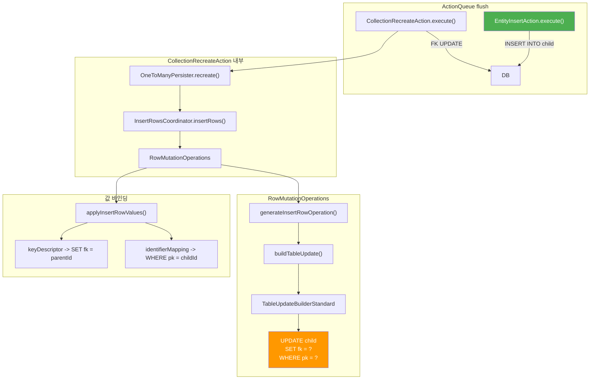

# OneToManyPersister: insertRows가 UPDATE를 실행하는 비밀

`OneToManyPersister`의 `insertRows()` 메서드는 이름과 달리 INSERT SQL이 아닌 **UPDATE SQL**을 실행한다. 이것은 one-to-many 관계의 특성에서 비롯된 설계적 결정이다. `buildTableUpdate()`가 INSERT가 아닌 UPDATE 구문을 생성하고, `applyInsertRowValues()`가 FK 값을 바인딩하는 전체 과정을 소스 코드 수준에서 분석한다.

## 목차
- [1. 핵심 개념 (What)](#1-핵심-개념-what)
- [2. 왜 알아야 하는가 (Why)](#2-왜-알아야-하는가-why)
- [3. 내부 구현 분석 (How)](#3-내부-구현-분석-how)
- [4. 실전 예제](#4-실전-예제)
- [5. 정리](#5-정리)

---

## 1. 핵심 개념 (What)

`@OneToMany` 단방향 관계에서 FK는 자식 테이블에 존재한다. 하지만 자식 엔티티의 INSERT 시점에는 부모와의 관계 정보가 자식 측에 없다 (자식이 `@ManyToOne`을 가지지 않으므로). 따라서 Hibernate는 다음 전략을 사용한다:

1. **EntityInsertAction**: 자식 엔티티를 FK=NULL 상태로 INSERT
2. **CollectionAction**: 이후 자식 테이블의 FK 컬럼을 부모 ID로 **UPDATE**

이때 두 번째 단계의 "컬렉션 행 삽입"(`insertRows`)이 실제로는 **UPDATE SQL**을 실행한다. 메서드 이름은 "insert"이지만, 생성하는 SQL은 `UPDATE child SET parent_id = ? WHERE child_id = ?`이다.

이것은 `BasicCollectionPersister`(many-to-many용)와의 핵심 차이점이다:
- `BasicCollectionPersister.insertRows()` -> **INSERT** SQL (조인 테이블에 행 추가)
- `OneToManyPersister.insertRows()` -> **UPDATE** SQL (자식 테이블의 FK 설정)

## 2. 왜 알아야 하는가 (Why)

### "왜 INSERT 후 UPDATE가 나가는가?"

가장 많이 받는 질문이다. 단방향 `@OneToMany`에서 persist() 후 로그를 보면:

```sql
INSERT INTO member (id) VALUES (1)         -- FK가 없다
UPDATE member SET team_id = 1 WHERE id = 1 -- 여기서 FK 설정
```

이 UPDATE는 버그가 아니라, `OneToManyPersister`의 의도된 동작이다.

### 단방향 @OneToMany의 성능 문제 인식

이 추가 UPDATE는 **모든 컬렉션 요소마다** 발생한다. N개의 자식이 있으면 N개의 INSERT + N개의 UPDATE = 2N개의 SQL이 실행된다. `mappedBy`를 사용하면 N개의 INSERT만으로 충분하다.

### BasicCollectionPersister와의 설계 차이 이해

many-to-many는 별도의 조인 테이블이 있으므로 `INSERT INTO join_table` 형태의 진짜 INSERT를 실행한다. one-to-many는 자식 테이블을 직접 수정하므로 UPDATE를 사용해야 한다. 같은 `insertRows()` 인터페이스 뒤에 완전히 다른 SQL 전략이 숨겨져 있다.

## 3. 내부 구현 분석 (How)

### 3.1 비밀의 핵심: generateInsertRowOperation()

`OneToManyPersister`에서 "insert row"를 위한 JDBC operation을 생성하는 메서드:

```java
// OneToManyPersister.java (line 537~541)
private JdbcMutationOperation generateInsertRowOperation(
        MutatingTableReference tableReference) {
    // NOTE: TableUpdateBuilderStandard and TableUpdate already handle custom-sql
    return buildTableUpdate( tableReference )
            .createMutationOperation( null, getFactory() );
}
```

메서드 이름은 `generateInsertRowOperation`이지만, 내부에서 `buildTableUpdate()`를 호출한다. **`TableInsertBuilder`가 아닌 `TableUpdateBuilder`를 사용한다**.

### 3.2 buildTableUpdate() - UPDATE SQL 생성

```java
// OneToManyPersister.java (line 543~557)
private TableUpdate<JdbcMutationOperation> buildTableUpdate(
        MutatingTableReference tableReference) {
    final TableUpdateBuilderStandard<JdbcMutationOperation> updateBuilder =
            new TableUpdateBuilderStandard<>(
                    this, tableReference, getFactory(), sqlWhereString );

    // SET 절: FK 컬럼에 부모 ID 설정
    final var attributeMapping = getAttributeMapping();
    attributeMapping.getKeyDescriptor().getKeyPart()
            .forEachUpdatable( updateBuilder );

    // SET 절: 인덱스 컬럼 설정 (@OrderColumn 등)
    final var indexDescriptor = attributeMapping.getIndexDescriptor();
    if ( indexDescriptor != null ) {
        indexDescriptor.forEachUpdatable( updateBuilder );
    }

    // WHERE 절: 자식 엔티티의 PK로 제한
    final var elementDescriptor =
            (EntityCollectionPart) attributeMapping.getElementDescriptor();
    final var elementType =
            elementDescriptor.getAssociatedEntityMappingType();
    updateBuilder.addKeyRestrictionsLeniently(
            elementType.getIdentifierMapping() );

    return (TableUpdate<JdbcMutationOperation>) updateBuilder.buildMutation();
}
```

생성되는 SQL의 구조:

```sql
UPDATE child_table
SET fk_column = ?          -- keyDescriptor (부모 ID)
    [, index_column = ?]   -- indexDescriptor (순서, 있는 경우)
WHERE child_pk = ?         -- elementDescriptor의 identifierMapping
```

### 3.3 BasicCollectionPersister와의 비교



`BasicCollectionPersister`의 구현을 비교하면:

```java
// BasicCollectionPersister.java (line 301~306)
private JdbcMutationOperation generateInsertRowOperation(
        MutatingTableReference tableReference) {
    return getIdentifierTableMapping().getInsertDetails().getCustomSql() != null
            ? buildCustomSqlInsertRowOperation( tableReference )
            : buildGeneratedInsertRowOperation( tableReference );
    // TableInsertBuilderStandard을 사용 -> 진짜 INSERT SQL 생성
}
```

`BasicCollectionPersister`는 `TableInsertBuilderStandard`를 사용하여 실제 INSERT SQL을 생성한다. 반면 `OneToManyPersister`는 `TableUpdateBuilderStandard`를 사용한다.

### 3.4 applyInsertRowValues() - FK 값 바인딩

```java
// OneToManyPersister.java (line 559~606)
private void applyInsertRowValues(
        PersistentCollection<?> collection,
        Object keyValue,           // 부모 엔티티의 ID
        Object rowValue,           // 컬렉션 요소 (entry)
        int rowPosition,
        SharedSessionContractImplementor session,
        JdbcValueBindings jdbcValueBindings) {

    final var attributeMapping = getAttributeMapping();

    // (1) SET 절 바인딩: FK 컬럼 = 부모 ID
    attributeMapping.getKeyDescriptor().getKeyPart().decompose(
            keyValue,               // 부모 ID 값
            0,
            jdbcValueBindings,
            null,
            (valueIndex, bindings, noop, value, jdbcValueMapping) -> {
                if ( jdbcValueMapping.isUpdateable()
                        && !jdbcValueMapping.isFormula() ) {
                    bindings.bindValue(
                            value, jdbcValueMapping,
                            ParameterUsage.SET );   // SET 절에 바인딩!
                }
            },
            session
    );

    // (2) SET 절 바인딩: 인덱스 컬럼 (@OrderColumn)
    final var indexDescriptor = attributeMapping.getIndexDescriptor();
    if ( indexDescriptor != null ) {
        indexDescriptor.decompose(
                incrementIndexByBase(
                        collection.getIndex( rowValue, rowPosition, this ) ),
                0,
                jdbcValueBindings,
                null,
                (valueIndex, bindings, noop, value, jdbcValueMapping) -> {
                    if ( jdbcValueMapping.isUpdateable() ) {
                        bindings.bindValue(
                                value, jdbcValueMapping,
                                ParameterUsage.SET );
                    }
                },
                session
        );
    }

    // (3) WHERE 절 바인딩: 자식 엔티티의 PK
    final Object elementValue = collection.getElement( rowValue );
    final var elementDescriptor =
            (EntityCollectionPart) attributeMapping.getElementDescriptor();
    final var identifierMapping =
            elementDescriptor.getAssociatedEntityMappingType()
                    .getIdentifierMapping();
    identifierMapping.decompose(
            identifierMapping.getIdentifier( elementValue ),
            0,
            jdbcValueBindings,
            null,
            DEFAULT_RESTRICTOR,          // WHERE 절에 바인딩
            session
    );
}
```

### 3.5 값 바인딩 흐름도



### 3.6 deleteRows도 UPDATE로 구현된다

놀랍게도 `OneToManyPersister`의 행 삭제도 실제로는 UPDATE SQL이다. FK를 NULL로 설정하는 방식이다.

```java
// OneToManyPersister.java (line 458~504)
public RestrictedTableMutation<JdbcMutationOperation> generateDeleteRowAst(
        MutatingTableReference tableReference) {
    final var updateBuilder =
            new CollectionRowDeleteByUpdateSetNullBuilder<>(
                    this, tableReference, getFactory(), sqlWhereString );

    // FK 컬럼을 NULL로 설정 + FK 값으로 WHERE 제한
    final var foreignKeyDescriptor =
            getAttributeMapping().getKeyDescriptor();
    for ( int i = 0; i < foreignKeyDescriptor.getJdbcTypeCount(); i++ ) {
        final var selectable = foreignKeyDescriptor.getSelectable( i );
        if ( !selectable.isFormula() ) {
            if ( selectable.isUpdateable() ) {
                updateBuilder.addValueColumn( NULL, selectable );  // SET fk = null
            }
            updateBuilder.addKeyRestrictionLeniently( selectable );  // WHERE fk = ?
        }
    }

    // 인덱스 컬럼도 NULL로 설정
    if ( hasIndex() && !indexContainsFormula ) {
        // ... SET index_col = null
    }

    // 자식 엔티티 PK로 WHERE 제한
    final var entityPart =
            (EntityCollectionPart) getAttributeMapping().getElementDescriptor();
    updateBuilder.addKeyRestrictionsLeniently(
            entityPart.getAssociatedEntityMappingType().getIdentifierMapping() );
    // ...
}
```

생성되는 SQL:

```sql
-- OneToManyPersister의 "delete row"
UPDATE child_table
SET fk_column = NULL, index_column = NULL
WHERE fk_column = ? AND child_pk = ?

-- BasicCollectionPersister의 "delete row" (비교)
DELETE FROM join_table
WHERE fk1 = ? AND fk2 = ?
```

### 3.7 RowMutationOperations 구성

`OneToManyPersister`의 `buildRowMutationOperations()`에서 각 operation의 생성자를 등록한다:

```java
// OneToManyPersister.java (line 334~381)
private RowMutationOperations buildRowMutationOperations() {
    final OperationProducer insertRowOperationProducer;
    final RowMutationOperations.Values insertRowValues;
    if ( !isInverse() && isRowInsertEnabled() ) {
        insertRowOperationProducer = this::generateInsertRowOperation;
        insertRowValues = this::applyInsertRowValues;
    }
    else {
        insertRowOperationProducer = null;   // inverse이면 NoOp
        insertRowValues = null;
    }
    // ... writeIndex, deleteEntry 설정 ...

    return new RowMutationOperations(
            this,
            insertRowOperationProducer,  // "insert" = UPDATE SQL
            insertRowValues,
            writeIndexOperationProducer,
            writeIndexValues,
            writeIndexRestrictions,
            deleteEntryOperationProducer, // "delete" = UPDATE SET NULL
            deleteEntryRestrictions
    );
}
```

`isInverse() == true` (즉, `mappedBy`가 설정된 경우) 이면 `insertRowOperationProducer`가 null이 되어 `InsertRowsCoordinatorNoOp`이 사용되고, **추가 UPDATE가 실행되지 않는다**.

### 3.8 전체 아키텍처



## 4. 실전 예제

### 단방향 @OneToMany: 2N SQL 문제

```java
@Entity
class Team {
    @Id @GeneratedValue
    private Long id;

    @OneToMany
    @JoinColumn(name = "team_id")
    private List<Member> members = new ArrayList<>();
}

@Entity
class Member {
    @Id @GeneratedValue
    private Long id;
    private String name;
}
```

```java
Team team = new Team();
for (int i = 0; i < 3; i++) {
    team.getMembers().add(new Member("M" + i));
}
em.persist(team);
em.flush();
```

실행되는 SQL (총 7개):

```sql
-- EntityInsertAction (1 + 3 = 4개)
INSERT INTO team (id) VALUES (1)
INSERT INTO member (id, name) VALUES (1, 'M0')   -- team_id = NULL
INSERT INTO member (id, name) VALUES (2, 'M1')   -- team_id = NULL
INSERT INTO member (id, name) VALUES (3, 'M2')   -- team_id = NULL

-- CollectionRecreateAction -> OneToManyPersister.recreate() (3개)
UPDATE member SET team_id = 1 WHERE id = 1        -- FK UPDATE
UPDATE member SET team_id = 1 WHERE id = 2        -- FK UPDATE
UPDATE member SET team_id = 1 WHERE id = 3        -- FK UPDATE
```

### 양방향 @OneToMany (mappedBy): N SQL로 해결

```java
@Entity
class Team {
    @OneToMany(mappedBy = "team", cascade = CascadeType.ALL)
    private List<Member> members = new ArrayList<>();
}

@Entity
class Member {
    @ManyToOne
    @JoinColumn(name = "team_id")
    private Team team;
}
```

```java
Team team = new Team();
for (int i = 0; i < 3; i++) {
    Member m = new Member("M" + i);
    m.setTeam(team);       // 소유 측에서 FK 설정
    team.getMembers().add(m);
}
em.persist(team);
em.flush();
```

실행되는 SQL (총 4개):

```sql
-- EntityInsertAction만 (FK가 INSERT에 포함)
INSERT INTO team (id) VALUES (1)
INSERT INTO member (id, name, team_id) VALUES (1, 'M0', 1)
INSERT INTO member (id, name, team_id) VALUES (2, 'M1', 1)
INSERT INTO member (id, name, team_id) VALUES (3, 'M2', 1)

-- CollectionRecreateAction: isInverse()=true -> NoOp, UPDATE 없음
```

## 5. 정리

| 비교 항목 | OneToManyPersister | BasicCollectionPersister |
|:---|:---|:---|
| 대상 관계 | `@OneToMany` | `@ManyToMany`, `@ElementCollection` |
| insertRows()의 실제 SQL | **UPDATE** (FK 설정) | **INSERT** (조인 테이블 행 추가) |
| deleteRows()의 실제 SQL | **UPDATE SET NULL** (FK 해제) | **DELETE** (조인 테이블 행 삭제) |
| SQL 생성 빌더 | `TableUpdateBuilderStandard` | `TableInsertBuilderStandard` |
| 대상 테이블 | 자식 엔티티 테이블 | 조인 테이블(중간 테이블) |
| inverse (mappedBy) 시 | NoOp (SQL 없음) | NoOp (SQL 없음) |

| "insert"의 진짜 의미 | OneToManyPersister |
|:---|:---|
| `insertRows()` | 컬렉션에 **논리적으로** 행을 추가 |
| `generateInsertRowOperation()` | UPDATE SQL operation 생성 |
| `buildTableUpdate()` | `TableUpdateBuilderStandard` 사용 |
| `applyInsertRowValues()` | SET: FK=부모ID, WHERE: PK=자식ID |
| 결과 SQL | `UPDATE child SET fk=? WHERE pk=?` |

**핵심 비밀**: one-to-many에서 FK는 자식 테이블에 있고, 자식 엔티티는 이미 INSERT된 상태다. 따라서 "컬렉션에 행을 추가"하는 것은 기존 자식 행의 FK 컬럼을 UPDATE하는 것이다. 메서드 이름의 "insert"는 컬렉션 관점에서의 논리적 삽입이지, SQL INSERT가 아니다.

---
*참고: Hibernate ORM 6.5.x 기준*
