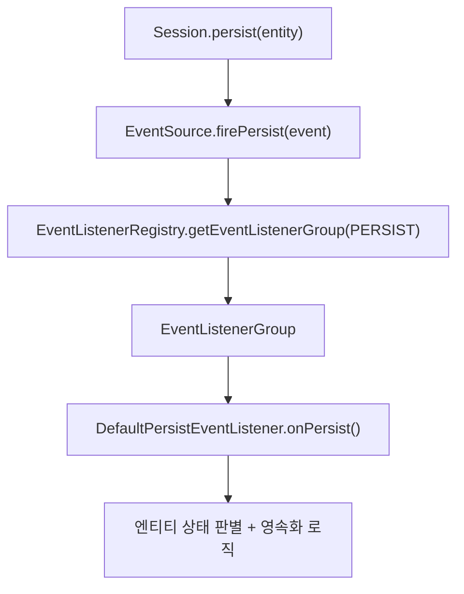
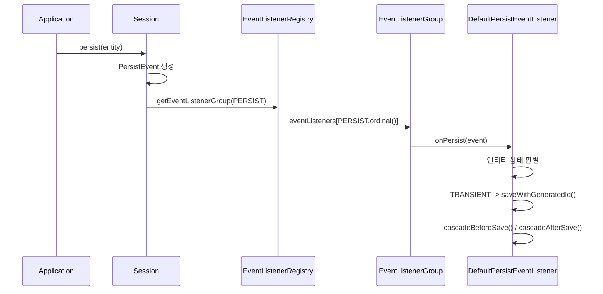

# Event/Listener 아키텍처

Hibernate ORM은 엔티티의 생명주기 전반을 이벤트 기반으로 처리한다. `persist()`, `merge()`, `flush()` 같은 모든 Session 메서드는 내부적으로 이벤트를 발생시키고, 등록된 리스너가 실제 로직을 수행하는 구조다.

## 목차
- [1. 핵심 개념 (What)](#1-핵심-개념-what)
- [2. 왜 알아야 하는가 (Why)](#2-왜-알아야-하는가-why)
- [3. 내부 구현 분석 (How)](#3-내부-구현-분석-how)
- [4. 실전 예제](#4-실전-예제)
- [5. 정리](#5-정리)

---

## 1. 핵심 개념 (What)

### EventType: 이벤트 타입 정의

`EventType<T>`는 Hibernate가 인식하는 모든 이벤트 종류를 열거형처럼 정의한 클래스다. 각 인스턴스는 이벤트 이름, 리스너 인터페이스 타입, ordinal 값을 갖는다.

```java
// EventType.java - 주요 이벤트 타입 정의
public static final EventType<PersistEventListener> PERSIST = create("create", PersistEventListener.class);
public static final EventType<MergeEventListener> MERGE = create("merge", MergeEventListener.class);
public static final EventType<DeleteEventListener> DELETE = create("delete", DeleteEventListener.class);
public static final EventType<FlushEventListener> FLUSH = create("flush", FlushEventListener.class);
public static final EventType<LoadEventListener> LOAD = create("load", LoadEventListener.class);
```

Hibernate 6.5 기준으로 **30개 이상의 표준 이벤트 타입**이 정의되어 있으며, 크게 5개 범주로 나뉜다:

| 범주 | 이벤트 타입 |
|------|------------|
| CRUD 핵심 | `PERSIST`, `MERGE`, `DELETE`, `LOAD`, `REFRESH` |
| Flush 관련 | `FLUSH`, `AUTO_FLUSH`, `PRE_FLUSH`, `DIRTY_CHECK`, `FLUSH_ENTITY` |
| 캐시/세션 | `CLEAR`, `EVICT`, `LOCK`, `REPLICATE` |
| Pre/Post 콜백 | `PRE_INSERT`, `POST_INSERT`, `PRE_UPDATE`, `POST_UPDATE`, `PRE_DELETE`, `POST_DELETE` |
| 컬렉션 콜백 | `PRE_COLLECTION_RECREATE`, `POST_COLLECTION_RECREATE` 등 |

### EventType 내부 구조

```java
private static final AtomicInteger STANDARD_TYPE_COUNTER = new AtomicInteger();

private static <T> EventType<T> create(String name, Class<T> listenerRole) {
    return new EventType<>(name, listenerRole, STANDARD_TYPE_COUNTER.getAndIncrement(), true);
}
```

`AtomicInteger` 카운터로 ordinal을 자동 증가시키며, 이 ordinal은 `EventListenerRegistryImpl`에서 **배열 인덱스**로 사용된다. `Map` 대신 배열을 써서 이벤트 디스패치 성능을 최적화한 것이다.

## 2. 왜 알아야 하는가 (Why)

1. **커스텀 로직 삽입 포인트**: 감사 로그, 검증, 캐시 무효화 같은 횡단 관심사를 이벤트 리스너로 구현할 수 있다
2. **프레임워크 확장 원리**: Envers(감사), Bean Validation(검증)이 모두 이 리스너 구조를 활용한다
3. **디버깅 기반**: `persist()` 호출 시 내부에서 어떤 순서로 무엇이 실행되는지 파악해야 문제를 진단할 수 있다
4. **성능 최적화**: 불필요한 리스너가 등록되면 flush 시 오버헤드가 발생한다. 구조를 알아야 최적화 가능하다

## 3. 내부 구현 분석 (How)

### 전체 아키텍처 흐름



### EventListenerRegistryImpl: 리스너 등록과 관리

`EventListenerRegistryImpl`은 모든 이벤트 리스너 그룹을 ordinal 기반 배열로 관리한다:

```java
public class EventListenerRegistryImpl implements EventListenerRegistry {
    @SuppressWarnings("rawtypes")
    private final EventListenerGroup[] eventListeners;

    public <T> EventListenerGroup<T> getEventListenerGroup(EventType<T> eventType) {
        // ordinal을 배열 인덱스로 직접 사용 -> O(1) 조회
        final EventListenerGroup<T> listeners = eventListeners[eventType.ordinal()];
        if (listeners == null) {
            throw new HibernateException("Unable to find listeners for type [" + eventType.eventName() + "]");
        }
        return listeners;
    }
}
```

### Builder 패턴과 기본 리스너 등록

`EventListenerRegistryImpl.Builder`가 부트스트랩 시점에 모든 기본 리스너를 등록한다:

```java
private void applyStandardListeners() {
    prepareListeners(PERSIST, new DefaultPersistEventListener());
    prepareListeners(DELETE, new DefaultDeleteEventListener());
    prepareListeners(MERGE, new DefaultMergeEventListener());
    prepareListeners(FLUSH, new DefaultFlushEventListener());
    prepareListeners(LOAD, new DefaultLoadEventListener());
    // ... 30+ 이벤트 타입 모두 등록
}
```

### 리스너 등록 API

```java
// 기존 리스너 뒤에 추가
registry.appendListeners(EventType.POST_INSERT, MyAuditListener.class);

// 기존 리스너 앞에 추가
registry.prependListeners(EventType.PRE_UPDATE, MyValidationListener.class);

// 기존 리스너를 완전히 교체
registry.setListeners(EventType.FLUSH, MyCustomFlushListener.class);
```

### DefaultFlushEventListener: 기본 리스너 구현 예시

```java
public class DefaultFlushEventListener
        extends AbstractFlushingEventListener
        implements FlushEventListener {

    public void onFlush(FlushEvent event) throws HibernateException {
        final var source = event.getSession();
        final var persistenceContext = source.getPersistenceContextInternal();

        if (persistenceContext.getNumberOfManagedEntities() > 0
                || persistenceContext.getCollectionEntriesSize() > 0) {
            // 1단계: dirty check + SQL 생성
            flushEverythingToExecutions(event);
            // 2단계: SQL 실행
            performExecutions(source);
            // 3단계: 후처리
            postFlush(source);
            postPostFlush(source);
        }
    }
}
```

### 이벤트 디스패치 시퀀스



### 리스너 체인과 실행 순서

하나의 EventType에 여러 리스너가 등록될 수 있다. `EventListenerGroup`은 등록 순서대로 리스너를 실행한다:

```
POST_DELETE 리스너 체인:
1. PostDeleteEventListenerStandardImpl (Hibernate 기본 - JPA 콜백 처리)
2. PostDeleteEventListenerEnvers (Envers가 추가 - 감사 이력 기록)
3. MyCustomPostDeleteListener (사용자 정의 - 알림 발송)
```

## 4. 실전 예제

### 커스텀 이벤트 리스너 등록

```java
// Integrator를 통한 리스너 등록
public class AuditIntegrator implements Integrator {
    @Override
    public void integrate(Metadata metadata,
                          BootstrapContext bootstrapContext,
                          SessionFactoryImplementor sessionFactory) {
        final var registry = sessionFactory
                .getServiceRegistry()
                .getService(EventListenerRegistry.class);

        registry.appendListeners(EventType.POST_INSERT, new AuditInsertListener());
        registry.appendListeners(EventType.POST_UPDATE, new AuditUpdateListener());
        registry.appendListeners(EventType.POST_DELETE, new AuditDeleteListener());
    }
}

// 리스너 구현
public class AuditInsertListener implements PostInsertEventListener {
    @Override
    public void onPostInsert(PostInsertEvent event) {
        String entityName = event.getPersister().getEntityName();
        Object id = event.getId();
        // 감사 로그 기록
        AuditLog.record("INSERT", entityName, id, event.getState());
    }

    @Override
    public boolean requiresPostCommitHandling(EntityPersister persister) {
        return false; // 트랜잭션 커밋 후가 아닌, flush 시점에 실행
    }
}
```

### DuplicationStrategy를 활용한 리스너 중복 방지

```java
registry.addDuplicationStrategy(new DuplicationStrategy() {
    @Override
    public boolean areMatch(Object listener, Object original) {
        return listener.getClass() == original.getClass();
    }

    @Override
    public Action getAction() {
        return Action.KEEP_ORIGINAL; // 같은 클래스면 기존 것 유지
    }
});
```

## 5. 정리

| 구성 요소 | 역할 |
|-----------|------|
| `EventType<T>` | 이벤트 종류 정의 (이름 + 리스너 인터페이스 + ordinal) |
| `EventListenerRegistry` | 전체 리스너 그룹 관리, 리스너 등록/교체 API 제공 |
| `EventListenerGroup<T>` | 특정 이벤트 타입에 대한 리스너 목록 보유 |
| `Default*EventListener` | 각 이벤트의 기본 처리 로직 구현체 |
| `Integrator` | 부트스트랩 시점에 커스텀 리스너를 등록하는 확장 포인트 |

핵심 설계 원칙:
- **ordinal 기반 배열 접근**: `Map` 대신 배열로 O(1) 디스패치
- **개방-폐쇄 원칙**: 기본 동작은 `Default*EventListener`가 담당하고, `append/prepend/set`으로 확장 가능
- **체인 패턴**: 하나의 이벤트에 여러 리스너가 순차 실행

---
*참고: Hibernate ORM 6.5.x 기준*
